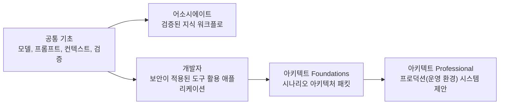

> 🇰🇷 이 문서는 한국어 번역본입니다(ELI5 스타일). 원문: [README.md](README.md)

# Claude 인증 커리큘럼

> 시험이 묻는 판단력을, 시험이 설명하는 시스템을 직접 만들면서 배우세요.

**상태:** 로컬 프리뷰
**가이드 버전:** 1.0
**가이드 시행일:** 2026년 7월
**마지막 확인:** 2026-08-09

이 무료 커리큘럼이 다루는 내용:

| 시험 | 자격증 | 문항 수 | 시간 | 응시료 | 핵심 루트 |
|------|------------|------:|-----:|----:|-----------:|
| CCAO-F | Claude Certified Associate - Foundations | 60 | 120분 | $99 | 9개 레슨 |
| CCDV-F | Claude Certified Developer - Foundations | 53 | 120분 | $125 | 15개 레슨 |
| CCAR-F | Claude Certified Architect - Foundations | 60 | 120분 | $125 | 21개 레슨 |
| CCAR-P | Claude Certified Architect - Professional | 63 | 120분 | $175 | 25개 레슨 |

네 가지 가이드 모두 100~1,000점 척도에서 720점을 환산 합격 점수로 사용하고, 자격증 유효 기간은 12개월이라고 명시합니다. 프로그램 세부 사항은 바뀔 수 있으니 등록 전에 공식 가이드에서 사실을 확인하세요.

2026년 8월 9일 기준으로 확인한 바, 공식 시험 등록은 Claude Partner Network 소속 조직의 사람으로 제한되며, 인정된 파트너 회사 이메일이 필요합니다. 그럼에도 이 커리큘럼은 모두에게 열려 있습니다. 시험을 치르지 않고 실력만 얻고 싶은 학습자도 환영합니다. 응시 자격은 바뀔 수 있으니 결제나 일정 잡기 전에 현재의 [인증 FAQ](https://anthropic-partners.skilljar.com/page/faq-certifications)를 확인하세요.

## AI 튜터와 함께 GitHub에서 배우기

이 커리큘럼은 AI 네이티브입니다. Claude Code, Codex, ChatGPT, Cursor 또는 다른 에이전트가 루트를 한 단계씩 가르치고, 저장소에 포함된 랩을 실행하고, 당신이 만든 산출물을 검토하고, 레슨 퀴즈를 치르게 하고, 저장된 진행 상황에서 이어서 학습할 수 있습니다.

[GitHub 학습자 가이드](GETTING_STARTED.md)로 시작하거나, [이동식 인증 튜터 스킬](../../skills/claude-certification/SKILL.md)을 설치하세요:

```bash
npx skills add rohitg00/ai-engineering-from-scratch
```

그다음 에이전트에게 실행해 달라고 하세요:

```text
/claude-certification
```

저장소를 클론한 로컬 Claude Code 세션은 `.claude/skills/`에서 같은 스킬을 자동으로 찾아냅니다. 슬래시 명령을 지원하지 않는 하네스는 `GETTING_STARTED.md`와 튜터 스킬을 직접 읽을 수 있습니다. 학습자의 진행 상황은 `CLAUDE-CERTIFICATION.md`에, 학습자가 만든 결과물은 `learning-artifacts/claude/` 아래에 저장됩니다. 저장소에 포함된 `outputs/` 파일은 참고용 산출물로 남으며 절대 덮어쓰이지 않습니다.

## 당신이 만들게 될 것

루트들은 공통 기초를 공유한 뒤 역할에 따라 갈라집니다:



- 어소시에이트: 증거와 상위 보고(에스컬레이션)를 갖춘, 통제된 지식 노동 워크플로.
- 개발자: 도구, 테스트, 보안, 평가를 갖춘 프로토콜 우선 Claude 애플리케이션.
- 아키텍트 Foundations: 아키텍처 결정 기록, 위협 모델, 평가기, 컨텍스트 계획, 장애 복구 런북.
- 아키텍트 Professional: RAG, 통합, 평가, 거버넌스, SLA, 소유권까지 담은 발굴부터 운영까지의 완전한 아키텍처 패킷.

각 트랙에는 짧은 진단 테스트와, 공식 가이드와 같은 문항 수의 오리지널 전체 모의고사가 포함됩니다. 문항 구성은 블루프린트 가중치를 실용적으로 반올림한 수준으로 따릅니다. 실제 시험 문제를 모방하거나 재현하지 않습니다.

## GitHub 레슨 색인

튜터는 선택한 트랙 파일을 읽어 루트 순서를 파악합니다. 이 전체 색인은 GitHub에서 모든 공통 레슨을 바로 찾아볼 수 있게 해 줍니다.

| # | 레슨 |
|---:|--------|
| 00 | [Study the Decisions, Not the Vocabulary](lessons/00-certification-strategy/) |
| 01 | [Choose the Smallest Surface That Can Carry the Work](lessons/01-claude-product-and-model-landscape/) |
| 02 | [Spend Capability Where Failure Is Expensive](lessons/02-model-selection-and-token-economics/) |
| 03 | [Turn a Request Into a Testable Contract](lessons/03-prompting-and-task-decomposition/) |
| 04 | [Put Each Fact in the Right Kind of Context](lessons/04-context-knowledge-memory-and-caching/) |
| 05 | [Validate the Claim, Not the Confidence](lessons/05-output-evaluation-and-validation/) |
| 06 | [Put Authority Around Capability](lessons/06-governance-safety-and-responsible-use/) |
| 07 | [Design the Handoff Before the Automation](lessons/07-workflow-design-and-human-handoffs/) |
| 08 | [The Messages API Is a State Machine](lessons/08-messages-api-and-application-lifecycle/) |
| 09 | [Structured Output Is an Untrusted Contract](lessons/09-structured-output-and-defensive-parsing/) |
| 10 | [A Tool Loop Is Controlled Delegation](lessons/10-tool-use-and-agentic-loops/) |
| 11 | [MCP Separates Capability From Host](lessons/11-mcp-server-design-and-integration/) |
| 12 | [The Agent SDK Is a Harness, Not Permission](lessons/12-claude-agent-sdk-and-hooks/) |
| 13 | [Security Lives Outside the Prompt](lessons/13-application-security-and-secrets/) |
| 14 | [Evals Turn Agent Behavior Into Engineering Evidence](lessons/14-evals-testing-debugging-and-observability/) |
| 15 | [Claude Code Scales Through Shared Constraints](lessons/15-claude-code-for-development-teams/) |
| 16 | [Multi-Agent Orchestration and Delegation](lessons/16-multi-agent-orchestration-and-delegation/) |
| 17 | [Agent SDK Sessions, Subagents, and Context](lessons/17-agent-sdk-sessions-subagents-and-context/) |
| 18 | [Tool Contracts, Errors, and Progressive Discovery](lessons/18-tool-contracts-errors-and-progressive-discovery/) |
| 19 | [Claude Code Memory, Rules, Skills, and CI](lessons/19-claude-code-memory-rules-skills-and-ci/) |
| 20 | [Reliable Extraction, Batch, and Independent Reviewers](lessons/20-reliable-extraction-batch-and-reviewers/) |
| 21 | [Make Large Context Observable](lessons/21-long-context-reliability-provenance-and-escalation/) |
| 22 | [Business Discovery, Requirements, and SLAs](lessons/22-business-discovery-requirements-and-slas/) |
| 23 | [End-to-End Architecture and Value Tradeoffs](lessons/23-end-to-end-architecture-and-value-tradeoffs/) |
| 24 | [RAG, Retrieval, and Data Pipelines](lessons/24-rag-retrieval-and-data-pipelines/) |
| 25 | [Integration Protocols, Identity, and Least Privilege](lessons/25-integration-protocols-identity-and-least-privilege/) |
| 26 | [Production Observability, Latency, and Cost](lessons/26-production-observability-latency-and-cost/) |
| 27 | [Enterprise Governance, Compliance, and Human Review](lessons/27-enterprise-governance-compliance-and-hitl/) |
| 28 | [Stakeholder Communication, ADRs, and Lifecycle Ownership](lessons/28-stakeholder-communication-adrs-and-lifecycle/) |
| 29 | [Ship a Week of Work, Not a Perfect Prompt](lessons/29-associate-workflow-capstone/) |
| 30 | [Ship a Claude Application You Can Defend](lessons/30-developer-application-capstone/) |
| 31 | [Defend One Architecture Across Six Contexts](lessons/31-architect-foundations-scenario-capstone/) |
| 32 | [Architect Professional System Capstone](lessons/32-architect-professional-system-capstone/) |

## 로컬 프리뷰

저장소 루트에서:

```bash
node site/build.js
python3 scripts/audit_certifications.py
python3 -m http.server 4173 --bind 127.0.0.1
```

그다음 열기:

```text
http://127.0.0.1:4173/site/certifications.html
```

서버는 반드시 저장소 루트에서 시작해야 합니다. 그래야 아직 푸시하지 않은 로컬 레슨 파일도 레슨 뷰어가 읽을 수 있습니다.

인증 커리큘럼은 GitHub과 웹사이트를 통해 공개됩니다. 튜터 상태, 실행 가능한 랩, 평가, 인터랙티브 메커니즘이 과정의 일부이기 때문에, EPUB/PDF 책 워크플로에는 의도적으로 포함하지 않습니다.

## 리서치 기록

- [CCAR-F 정확한 시험 메커니즘 리뷰](references/ccar-f-exact-mechanics.md)
- [공식 Anthropic Academy 패리티(대응) 맵](research/official-academy-parity.md)
- [공식 블루프린트 맵](research/official-blueprint-map.md)
- [소스 검증 대장](research/source-verification-ledger.md)
- [YouTube 소스 리뷰](research/youtube-source-review.md)
- [최근 커뮤니티 시그널](research/recent-community-signal.md)

## 독립성과 시험 무결성

이것은 독립적인 커뮤니티 커리큘럼입니다. Anthropic과 제휴하거나, 승인받거나, 후원받거나, 공식 허가를 받은 것이 아닙니다. Claude와 인증 이름들은 학습 대상 프로그램을 식별하는 용도로만 쓰입니다.

커리큘럼은 공개된 시험 목표와 오리지널 시나리오를 사용합니다. 기밀 시험 콘텐츠는 사용하지 않습니다. 실제 시험에 응시한다면 비밀 유지 규정과 수험생 행동 규칙을 따르세요.
