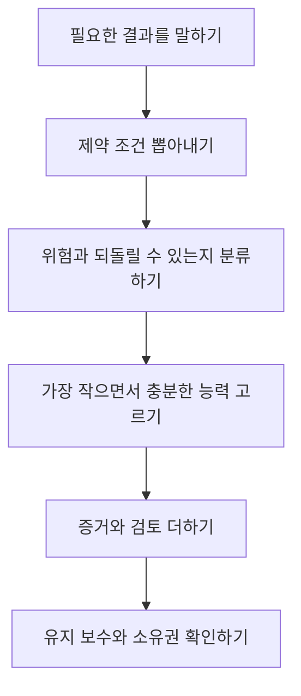

> 🇰🇷 이 문서는 한국어 번역본입니다(ELI5 스타일). 원문: [en.md](en.md)

# 단어가 아니라 결정을 공부하세요

> 인증 블루프린트(시험 범위 설명서)는 유능한 실무자가 변호할 수 있는 판단(결정)들의 지도입니다. 이것을 단어 목록으로 취급하면 시험에서 가장 덜 쓸모 있는 부분만 공부하게 됩니다.

**유형:** Learn
**언어:** Python
**선수 지식:** 없음
**시간:** 약 75분

## 학습 목표

- 인증 블루프린트를 가중치가 적용된 학습 계획으로 바꾸기.
- 안정적인 엔지니어링 원칙과, 언제든 바뀔 수 있는 제품 세부 사항을 구분하기.
- 판단(결정), 이유, 공식 소스를 기록하는 증거 대장(ledger) 만들기.
- 덤프를 쓰거나 실제 시험 문제를 재구성하지 않고 시나리오 판단 연습하기.
- 눈에 띄는 모의고사 점수 하나가 아니라 도메인별 성과에 기반한 준비 완료 게이트(gate) 정의하기.

## 문제 상황

Maya는 두 주 동안 기능 이름을 외우는 데 시간을 썼습니다. Project, 컨텍스트 윈도우, 커넥터의 정의를 말할 수 있습니다. 그러다 시나리오를 만났습니다.

한 팀이 기밀 주간 보고서를 요약하려고 합니다. 소스 파일은 매주 금요일마다 바뀝니다. 최종 요약본은 경영진에게 전달됩니다. 선택지에는 보고서를 새 채팅에 붙여 넣기, 오래된 Project에 추가하기, 실시간 소스 연결하기, 커스텀 애플리케이션 만들기가 있습니다. 어떤 선택지든 요약본은 만들 수 있습니다. 하지만 업데이트 주기, 검토 요건, 데이터 정책, 유지 보수 부담에 맞는 것은 단 하나뿐입니다.

Maya는 기억에서 커넥터의 정의를 찾아 헤맵니다. 시나리오는 정의가 아니라 결정을 요구하고 있습니다.

이 구분이 이 커리큘럼 전체를 지배합니다. 공식 가이드가 설명하는 작업은 제품 선택, 출력 검증, 지식 관리, 위험 에스컬레이션 같은 것들입니다. 정의는 그런 작업을 떠받칠 수는 있어도, 대신 수행해 주지는 못합니다.

시험은 환산 점수(scaled score)를 사용합니다. 연습 백분율은 공식 점수가 아니며, 어떤 커뮤니티 모의고사도 실제 결과를 예측할 수 없습니다. 당신의 임무는 낯선 시나리오를 만나도 구조가 잡힌 느낌이 들 만큼 판단력을 쌓는 것입니다.

## 개념

### 블루프린트는 '직무 모델'입니다

각 도메인(영역)은 목표 역할에게 기대되는 업무의 한 부분입니다. 가중치는 채점되는 시험에서 그 도메인이 차지하는 비중을 추정한 것입니다. 가중치는 곧 난이도가 아닙니다. 작은 도메인에도 어려운 문제가 들어 있을 수 있습니다. 가중치가 알려 주는 것은 연습 시간을 어디에 배분할지입니다.

Associate Foundations에서 가장 큰 도메인은 출력 평가와 검증입니다. 이것은 신호입니다. 이 역할은 Claude에게 답을 '물어볼 수 있는' 사람이 아니라, 그 답을 써도 되는지 판단할 수 있는 사람입니다.

모든 목표를 읽을 때 라벨 세 개를 붙여 보세요:

1. **Know(앎):** 회상해야 하는 사실이나 용어.
2. **Do(실행):** 수행해야 하는 절차.
3. **Decide(판단):** 제약 조건 안에서 풀어야 하는 트레이드오프.

대부분의 약한 학습 계획은 Know에 과투자합니다. 대부분의 시나리오 문제는 Do와 Decide에 집중됩니다.

### 안정적인 원칙과 바뀌는 사실

천천히 바뀌는 지식이 있습니다:

- 민감한 데이터는 승인된 처리 경로가 필요하다.
- 클레임은 중요한 산출물에 들어가기 전에 증거가 필요하다.
- 지속되는 지침은 간결하고, 범위가 한정되고, 관리되어야 한다.
- 되돌릴 수 없는 행동은 되돌릴 수 있는 초안보다 강한 검토를 받아야 한다.
- 작은 모델이 측정된 요구 사항을 충족한다면 더 큰 모델은 낭비다.

이 레슨이 쓰인 날과 당신이 공부하는 날 사이에 바뀔 수 있는 지식도 있습니다:

- 모델 이름, 가격, 컨텍스트 한도.
- 플랜 자격과 기능 가용성.
- 제품 내비게이션과 인터페이스 라벨.
- 커넥터 능력과 승인 동작.
- 인증 수수료, 정책, 접근 규칙.

두 번째 그룹에는 반드시 검증 날짜와 공식 소스를 붙여야 합니다. 이 커리큘럼은 2026년 7월 버전 1.0 가이드 기준으로 확인되었습니다. 시험 일정을 잡기 전에 현재 공식 가이드와 인증 FAQ를 다시 여세요.

### 시나리오 결정 스택

여러 답이 그럴듯하게 들릴 때는 시나리오를 이 순서로 검사합니다:



'가장 작으면서 충분한 능력'이 중요합니다. 직접 채팅으로 일회성 초안을 안전하게 만들 수 있다면, 관리형 Project는 불필요할 수 있습니다. 소스가 매일 바뀐다면, 붙여 넣은 복사본은 너무 오래된 것일 수 있습니다. 워크플로가 중요한 결과를 낳는 행동을 한다면, 편의성이 승인보다 우선하지 않습니다.

### 오답은 보통 '국소적으로는 옳습니다'

잘 만든 오답 선택지(디스트랙터)는 헛소리가 아닙니다. 잘못된 문제를 풀거나, 제약 하나를 무시하거나, 불필요한 장치를 얹습니다.

흔한 유형:

- **능력은 있지만 부적합:** 그 기능으로 작업은 가능하지만, 명시된 프라이버시나 신선도 요건 아래에서는 불가능.
- **기본값이 최대 출력:** 측정된 필요 없이 가장 큰 모델을 선택.
- **프롬프트만 고치기:** 실패의 진짜 원인이 오래된 지식이나 없는 소스인데 프롬프트만 다시 씀.
- **소유자 없는 자동화:** 워크플로에 리뷰어, 에스컬레이션 경로, 유지 보수 담당자가 없음.
- **실행 후 정책:** 민감한 자료를 먼저 처리하고 나중에 분류함.
- **성공 사례 하나:** 잘 만들어진 출력 하나를 신뢰성의 증거로 취급함.

### 증거 대장(ledger) 만들기

노트에는 복사한 문단이 아니라 결정을 기록해야 합니다. 목표 하나당 항목 하나를 쓰세요:

```json
{
  "objective": "Choose when human verification is required",
  "decision_rule": "Require independent review when an error could create material harm or the claim lacks authoritative evidence",
  "counterexample": "A low-risk brainstorming list can be reviewed by the author during normal editing",
  "artifact": "claim-evidence matrix",
  "official_source": "URL and verification date",
  "confidence": "practiced"
}
```

반례(counterexample)가 필수입니다. 규칙이 적용되면 안 되는 상황을 말하지 못한다면, 경계를 배운 게 아니라 슬로건을 외운 것일 겁니다.

## 직접 만들기

일곱 줄짜리 Associate Foundations 대장을 만드세요. 도메인마다 한 줄입니다. 각 줄에 쓸 내용:

- 도메인 가중치.
- 내가 내리게 될 판단 두 개.
- 그 일을 해낼 수 있음을 증명하는 산출물 하나.
- 빨리 알아차리고 싶은 실패 모드 하나.
- 공식 소스 하나.
- 현재 내 자신감 단계: unseen(안 봄), understood(이해함), practiced(연습함), timed(시간 제한 연습함).

그다음 학습 시간 열 시간을 비례 배분합니다. 수학적 배분에서 시작하되, 약점에 맞춰 조정하세요. 이미 잘하는 21퍼센트 도메인은 한 번도 써 본 적 없는 12퍼센트 도메인보다 보완이 덜 필요할 수 있습니다.

공식:

```text
domain hours = total hours x domain weight x weakness multiplier
```

최종 숫자를 정규화해서 합계가 가용 시간에 다시 맞도록 하세요. 낯선 도메인에는 1.5의 약점 배수가 합리적입니다. 싫어하는 고가중치 작업을 피하려고 배수를 쓰지는 마세요.

마지막으로 연습 문제용 오류 로그를 만듭니다. 기록할 것:

- 내가 내린 결정.
- 내가 놓친 제약.
- 선택한 옵션이 매력적으로 보였던 이유.
- 더 나은 답을 만들었을 규칙.
- 같은 규칙이 적용되는 새 시나리오.

같은 모의고사를 반복해서 치르는 것보다 오류 로그를 복습하는 게 더 가치 있습니다.

### 벼락치기 더미가 아니라 리듬(cadence)으로

이 네 단계 리듬을 커리큘럼 휴리스틱(경험 법칙)으로 사용하세요. 네 주에 걸쳐 늘여도 되고, 실제로 가진 시간에 맞게 압축해도 됩니다:

1. **정향(Orient):** 현재 가이드를 읽고, 손대지 않은 진단 테스트를 한 번 치르고, 모든 오답을 목표와 자신감 단계에 매핑합니다.
2. **구축(Build):** 요구 레슨과 학습자 소유 산출물을 완성합니다. 코드, 정책, 아키텍처 예시를 문장(읽기거리)으로 취급하지 말고 테스트를 실행합니다.
3. **전이(Transfer):** 새 시나리오를 풀고, 그럴듯한 대안 각각이 왜 지는지 변호하고, 오류 로그로 약한 도메인을 보수합니다.
4. **시뮬레이션(Simulate):** 공개된 비공개 책(closed-book) 규칙 아래에서 새로운 시간 제한 세트를 치르고, 찍어서 맞은 문제까지 복습하며, 평가 직전에는 새 자료 추가를 멈춥니다.

보완을 고르기 전에 모든 오답을 분류하세요:

- **암기 빈틈(Recall gap):** 안정적인 사실이나 정의를 몰랐다.
- **오래된 사실(Stale fact):** 현재 공식 검증이 필요한 제품 세부 사항을 기억으로 답했다.
- **놓친 제약(Missed constraint):** 프라이버시, 신선도, 지연 시간, 비용, 권위, 되돌릴 수 있는지를 무시했다.
- **순서 오류(Sequence error):** 유효한 행동을 잘못된 라이프사이클 단계에서 골랐다.
- **접점 혼동(Surface confusion):** 가장 작고 유지 가능한 적합품이 아닌, 능력만 있는 제품이나 도구를 골랐다.
- **증거 실패(Evidence failure):** 자신감, 인용 존재, 성공 사례 하나를 증명으로 받아들였다.
- **과공학(Overengineering):** 시나리오가 요구하기도 전에 아키텍처를 얹었다.

범주가 복구 방법을 결정합니다. 오래된 사실은 문서 조회가 필요하고, 놓친 제약은 새 시나리오가 필요하고, 순서 오류는 라이프사이클 맵이 필요합니다. 같은 해설을 다시 읽는 것은 만능 학습 전략이 아닙니다.

## 인터랙티브 랩

루트맵 그림에서 도메인 자신감과 가용 시간을 바꿔 보세요. 약하지만 가중치가 높은 도메인이 학습 순서를 어떻게 바꾸는지, 모든 목표를 똑같이 대우할 때와 비교하며 관찰하세요.

```figure
00-certification-route-map
```

## 연습 랩

로컬 시나리오 채점기를 실행한 뒤, 자신감 라벨 하나를 바꾸고 가중치가 적용된 학습 순서가 어떻게 달라지는지 관찰하세요. 도메인 가중치나 배분된 시간을 일부러 망가뜨려 보고, 러너가 잘못된 계획을 거부하는지 확인하세요.

## 출시된 산출물(Shipped Artifact)

`outputs/readiness-plan.json`에 채워진 산출물은 완성된 10시간짜리 Associate Foundations 계획입니다. 일곱 블루프린트 도메인 전부, 현재 자신감, 도메인별 판단 두 개, 실패 모드, 공식 소스, 만들어 낼 구체적 산출물, 4단계 연습 리듬, 오답 분류학을 포함합니다.

## 검증하기

API 키 없이 패킷과 테스트를 검증하세요:

```bash
cd certifications/claude/lessons/00-certification-strategy/code
python3 main.py
python3 -m unittest discover tests -v
```

검증기는 도메인 가중치와 배분 시간이 합계와 일치하는지, 모든 소스에 날짜가 있고 공식 소스인지, 모든 도메인에 연습 증거가 있는지, 보완이 서로 다른 실패 범주를 다루는지 증명합니다. 예시가 통과한 뒤에는 채워진 값을 당신의 값으로 바꾸세요.

## 캡스톤 연결

여섯 문항 퀴즈는 가중치, 날짜가 있는 사실, 제약, 오류 증거로 추론할 수 있는지 확인합니다. 검증된 계획을 선택한 루트의 캡스톤(종합 프로젝트)으로 가져가세요. Associate 루트에서는 레슨 29의 커버리지와 준비 완료 기록이 됩니다.

## 활용하기

커리큘럼을 네 번의 패스(pass)로 활용하세요.

**첫 패스: 정향.** 현재 가이드를 읽고, 진단 테스트를 한 번 치르고, 약한 도메인을 표시합니다. 진단 테스트를 다 끝내기 전까지는 그 답을 공부하지 마세요.

**두 번째 패스: 구축.** 레슨과 산출물을 완성합니다. 노트 없이 주간 워크캡스톤을 실행합니다. 캡스톤은 제품 선택, 지식 유지, 프롬프팅, 검증, 거버넌스, 인수인계를 하나의 워크플로로 몰아 넣습니다.

**세 번째 패스: 설명.** 각 결정마다, 명시된 제약 아래에서 차선 대안이 왜 지는지 설명합니다. 설명은 얕은 자신감을 드러냅니다.

**네 번째 패스: 시간 제한.** 비공개 책(closed-book) 조건에서 전체 모의고사를 치릅니다. 찍어서 맞은 답을 포함해 모든 답을 복습합니다. 찍어서 맞은 답은 숙달이 아닙니다.

보수적인 준비 완료 게이트는:

- 목표 점수 이상의 새로운 시간 제한 연습 세트 두 개.
- 원점수 연습 채점에서 75퍼센트 미만 도메인 없음.
- 캡스톤 산출물 전부 완성.
- 놓친 모든 문제를 '놓친 제약' 관점으로 설명 완료.
- 전체 모의고사에서 최소 10분 남김.

이것은 학습 게이트지, Anthropic의 환산 점수 예측이 아닙니다.

## 시험 결정 패턴

- 가장 기능 많은 옵션보다 명시된 제약을 모두 만족하는 옵션을 고르세요.
- current(현재), confidential(기밀), recurring(반복), approved(승인됨), auditable(감사 가능), executive(경영진) 같은 단어를 아키텍처 입력으로 취급하세요.
- 콘텐츠 품질과 워크플로 품질을 분리하세요. 승인되지 않은 데이터 경로로 만든 좋은 답도 여전히 잘못된 해법입니다.
- 신선도가 중요하면 복사한 스냅샷보다 유지 관리되는 소스를 고르세요.
- 결과의 파급력, 불확실성, 되돌릴 수 없음이 큰 곳에는 사람 검토를 더하세요.
- 기억에 남는 인터페이스를 믿는 대신 현재 공식 자료로 제품 사실을 검증하세요.

## 흔한 함정

- 실제 시험 문제 덤프 사용. 프로그램 규칙을 위반할 뿐 아니라 판단이 아니라 패턴 인식을 훈련합니다.
- 더 긴 답이 더 맞을 것이라고 취급하기.
- 날짜 없이 정확한 가격 외우기.
- 가장 큰 모델을 가장 안전한 선택으로 동일시하기.
- 해설을 공부하는 대신 저품질 모의고사를 많이 치르기.
- 익숙한 시나리오를 낯선 시나리오도 처리할 수 있다는 증거로 착각하기.
- 원점수 연습 백분율을 공식 환산 점수와 혼동하기.

## 연습 문제

1. 각 도메인에서 목표 하나를 골라 Know, Do, Decide로 분류하세요. 각 분류를 변호하세요.
2. Project가 불필요한 시나리오 하나와, Project가 가장 단순하고 유지 가능한 선택이 되는 시나리오 하나를 쓰세요.
3. 이 커리큘럼에서 바뀔 수 있는 제품 사실 하나를 찾으세요. 공식 소스에서 검증하고 날짜를 기록하세요.
4. 오류 로그의 약한 항목 "답을 잊어버렸다"를 '놓친 제약' 설명으로 다시 쓰세요.
5. 모의고사 점수 하나보다 엄격하지만 가용 시간 안에 달성 가능한 개인 준비 완료 게이트를 설계하세요.

## 핵심 용어

| 용어 | 의미 |
|---|---|
| Blueprint(블루프린트) | 시험 범위를 정의하는 공식 도메인·목표 지도 |
| Scaled score(환산 점수) | 원점수 백분율과 같지 않은, 변환된 시험 점수 |
| Distractor(디스트랙터) | 불완전하게 읽으면 그럴듯해 보이도록 설계된 오답 선택지 |
| Decision rule(결정 규칙) | 알려진 제약 아래에서 대안을 고르는 재사용 가능한 방법 |
| Evidence ledger(증거 대장) | 목표를 규칙, 산출물, 공식 소스와 연결한 날짜 있는 기록 |
| Readiness gate(준비 완료 게이트) | 다음 평가 단계에 도전하기 전 충족해야 하는 조건 집합 |

## 더 읽기

- [Anthropic Partner 인증 카탈로그](https://anthropic-partners.skilljar.com/page/partner-certifications)
- [Anthropic 인증 FAQ](https://anthropic-partners.skilljar.com/page/faq-certifications)
- [Claude Certified Associate Foundations 시험 가이드](https://everpath-course-content.s3-accelerate.amazonaws.com/instructor%2F6nizmqk8tpzpfjvt6qmmav7rh%2Fpublic%2F1783542847%2FClaude+Certified+Associate+%E2%80%93+Foundations+Exam+Guide.pdf)
- [CCAR-F 정확한 시험 메커니즘 리뷰](../../../references/ccar-f-exact-mechanics.md)
- [프롬프트 엔지니어링: 기법과 패턴](../../../../../phases/11-llm-engineering/01-prompt-engineering/)
- [LLM 애플리케이션 평가와 테스트](../../../../../phases/11-llm-engineering/10-evaluation/)
