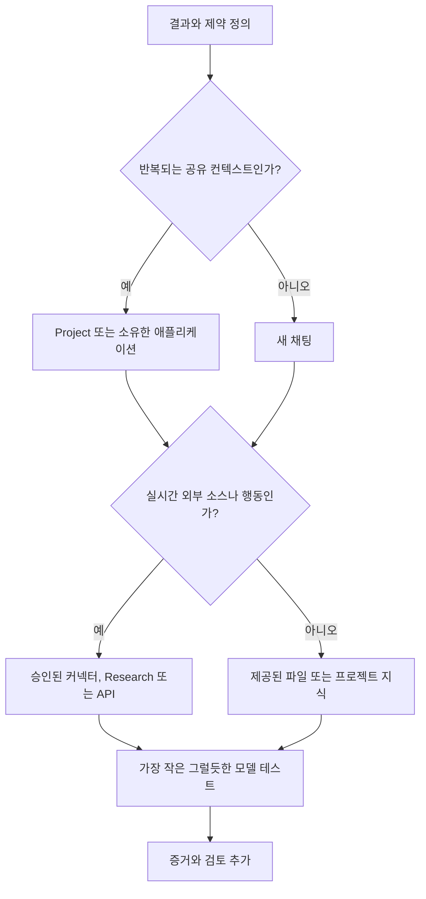

> 🇰🇷 이 문서는 한국어 번역본입니다(ELI5 스타일). 원문: [en.md](en.md)

# 일을 떠안을 수 있는 가장 작은 접점을 고르세요

> 제품 선택은 지식 노동 규모에서의 아키텍처링입니다. 잘못된 접점(surface)은 올바른 출력을 오래되게 만들고, 검토 불가능하게 만들고, 쓸데없이 비싸게 만들 수 있습니다.

**유형:** Learn
**언어:** Python
**선수 지식:** [단어가 아니라 결정을 공부하세요](../../00-certification-strategy/), [관리형 LLM 플랫폼](../../../../../phases/17-infrastructure-and-production/01-managed-llm-platforms/)
**시간:** 약 90분

## 학습 목표

- 채팅, Projects, Research, 파일과 Artifacts, 커넥터, 프로그래밍 방식 접점 사이에서 선택하기.
- 특정 모델 버전에 의존하지 않고 Haiku, Sonnet, Opus의 지속적인 역할 설명하기.
- 접점과 모델을 품질, 속도, 비용, 신선도, 거버넌스 제약에 맞추기.
- 직접 Anthropic, Amazon Bedrock, Google Vertex AI, Microsoft Foundry 배포 경로를 아키텍처 결정 기록으로 비교하기.
- 메모리, 프로젝트 지식, 새 대화 중 어느 것이 올바른 연속성 메커니즘인지 판별하기.
- 바뀔 수 있는 제품 사실에 공식 소스와 검증 날짜 표시하기.

## 문제 상황

운영 책임자가 주간 경쟁사 브리프를 준비합니다. 지난주 채팅을 열어 새 링크 세 개를 붙여 넣고, 업데이트를 요청하고, 결과를 전달합니다.

출력은 깔끔합니다. 하지만 이전 대화의 오래된 제품 가격을 인용하고, 내부 문서의 정책 변경을 놓치고, 출처 없는 경쟁사 주장을 담고 있습니다. 실패는 문구에서 시작하지 않았습니다. 선택한 작업 접점에서 시작했습니다.

오래된 채팅이 낡은 컨텍스트를 나르고 있었습니다. 붙여 넣은 링크가 철저한 조사를 보장하지는 않았습니다. 내부 정책은 가용 지식에 포함되어 있지 않았습니다. 워크플로에는 클레임 검증 단계가 없었습니다.

시험 목표의 이름은 '제품과 모델 선택'이지만, 진짜 실력은 경계 설계입니다. Claude가 무엇을 볼 수 있는지, 무엇을 기억하는지, 무엇을 검색할 수 있는지, 무엇을 만들 수 있는지, 그리고 작업이 얼마나 많은 추론 능력을 받을 만한지를 당신이 결정합니다.

## 개념

### 기능 메뉴가 아니라 '일'에서 시작하세요

작업을 여섯 차원으로 묘사합니다:

| 차원 | 질문 |
|---|---|
| 반복성 | 일회성인가, 반복되는가, 계속 이어지는가? |
| 지식 | 필요한 소스는 작은가, 큰가, 비공개인가, 바뀌는가? |
| 신선도 | 어제의 복사본이 오늘 틀릴 수 있는가? |
| 출력 | 결과가 답변인가, 보고서인가, 파일인가, 분석인가, 재사용 가능한 워크플로인가? |
| 파급력 | 결과가 틀리거나 의도치 않은 행동이 일어나면 무슨 일이 생기는가? |
| 협업 | 한 사람이 쓰는가, 아니면 팀이 공유하고 유지해야 하는가? |

그다음에 접점을 고릅니다.

### 채팅은 범위가 한정된 대화 작업용입니다

명확한 입력이 있는 일회성 작업에는 새 채팅이 종종 올바른 기본값입니다. 깨끗한 컨텍스트 경계를 줍니다. 초안 작성, 브레인스토밍, 설명, 제공된 텍스트 변환, 짧은 분석에 사용하세요.

오래 돌아간 채팅은 옛 가정이 조용히 새 작업에 영향을 줄 때 위험해집니다. 목표가 바뀌었거나, 컨텍스트에 상충하는 지침이 있거나, 이전 메시지 중 무엇이 아직 중요한지 설명할 수 없을 때 재시작하세요. 연속성이 필요하다면 재시작 전에 짧고 검증된 인수인계 내용을 추출해 두세요.

채팅 검색과 메모리는 이전 컨텍스트를 되찾아 줄 수 있지만, 승인된 단일 진실 원본(source of truth)의 대체품은 아닙니다. 메모리는 선호 설정과 지속되는 작업 컨텍스트에 유용합니다. 정책, 가격표, 고객 기록은 소유권과 날짜가 있는 관리되는 시스템에 있어야 합니다.

### Projects는 관리되는 컨텍스트 경계입니다

Project는 집중된 채팅들을 프로젝트 지침과 지식 베이스와 함께 묶습니다. 브랜드 가이드, 리서치 프로그램, 운영 절차, 고객 프로젝트처럼 같은 안정적인 컨텍스트가 반복되는 작업을 떠받칠 때 더 잘 맞습니다.

이점은 단순 저장이 아니라 재현성입니다. 새 대화마다 의도된 경계 안에서 시작됩니다.

위험은 낡은 구성입니다. 지난 분기 정책이 담긴 Project는 같은 잘못된 결정을 꾸준히 내놓을 수 있습니다. 모든 Project에는 소유자, 소스 목록, 검토 주기, 제거 절차가 필요합니다.

공식 제품 동작은 바뀝니다. 2026년 8월 8일 기준으로 확인한 바, Anthropic의 도움말 자료는 Project에 지침과 업로드된 지식을 담을 수 있고, 지식이 컨텍스트 한도에 가까워지면 검색(retrieval)을 사용할 수 있다고 설명합니다. 가용성, 한도, 플랜 요건은 현재 도움말 센터에서 다시 확인해야 합니다.

### Cowork은 조종 가능한 작업 루프입니다

Cowork는 다단계 지식 노동을 위한 제품 접점이지, 별도의 배포 경로가 아니며 이 레슨의 시험 목표도 아닙니다. 2026년 8월 9일 기준으로 확인한 바, Anthropic의 현재 도움말 자료는 결과 지향적 작업 루프를 설명합니다: 결과를 묘사하면, 접근 방식을 검토하고, 진행을 지켜보고, 실행 중에 조종하거나 방향을 바꿀 수 있습니다. Project는 관련 작업에 상시 파일, 링크, 지침, 메모리를 제공할 수 있습니다. 스킬은 재사용 가능한 워크플로를 제공하고, 플러그인은 스킬, 커넥터, 에이전트, 훅을 패키지로 담을 수 있습니다.

결과가 승인된 소스들에 걸친 실제 파일이나 조율된 작업이고, 사람의 조종이 도움이 될 때 Cowork을 사용하세요. 파일 경계는 좁게 유지하세요. 현재 문서에 따르면 로컬 접근은 연결된 폴더로 제한되고, 파일 작업은 권한(퍼미션)을 거치며, 영구 삭제는 명시적 승인이 필요합니다. 민감한 파일, 낯선 플러그인, 파급력 있는 행동, 넓은 컴퓨터 접근에는 수동 승인을 쓰고, 작업과 가까이 있으며, 결과 파일을 검토하세요. 오래 돌아가는 루프가 책임을 모델에게 넘겨 주지는 않습니다.

### Research는 다중 소스 조사용입니다

작업에 폭넓은 정보 수집, 여러 번의 검색, 종합, 인용이 필요하면 Research를 사용하세요. 좁고 현재적인 사실 하나에는 직접 웹 검색이 더 낫습니다. 시장 비교, 논문 여러 편 검토, 공개 소스와 연결된 내부 자료의 대조 같은 질문에는 Research가 더 낫습니다.

Research가 소스 판단의 필요를 없애 주지는 않습니다. 긴 보고서도 여전히 약한 증거를 인용하거나, 서로 다른 날짜의 클레임을 섞거나, 비공개 제약을 놓칠 수 있습니다. 인용은 증거로 가는 내비게이션이지 자동 증명이 아닙니다.

### 파일과 Artifacts는 출력을 검사 가능하게 만듭니다

다음에 무슨 일이 일어날지에 따라 출력 형태를 고르세요. 답을 읽고 버릴 거라면 인라인 텍스트가 적절합니다. 필드를 비교해야 한다면 구조화된 표가 낫습니다. 결과가 비즈니스 프로세스에 들어간다면 다운로드 가능한 문서나 스프레드시트가 낫습니다.

산출물은 가정, 소스, 날짜, 해결되지 않은 항목을 드러내야 합니다. 불확실성을 숨긴 멋진 파일보다, 증거 열이 명확한 평범한 표가 검토하기 쉽습니다.

파일 생성·편집 능력은 접점, 플랜, 파일 유형, 크기에 따라 바뀔 수 있습니다. 이를 기반으로 반복 워크플로를 설계하기 전에 현재 한도를 확인하세요.

### 커넥터는 복사 붙여넣기를 실시간·권한 기반 접근으로 바꿉니다

커넥터는 Claude가 외부 서비스에서 검색하거나 그 안에서 행동하게 해 줍니다. 소스 신선도가 중요하고 수동 복사-붙여넣기는 낡아 버릴 때 유용합니다.

커넥터가 존재한다는 이유만으로 선택하지 마세요. 확인할 것:

- 읽기 전용인지, 데이터를 변경할 수 있는지.
- 연결된 계정에서 어떤 권한을 상속받는지.
- 모든 행동에 승인이 필요한지.
- 어떤 데이터가 대화와 함께 보존되는지.
- 조직 관리자가 활성화해야 하는지.
- 커넥터가 필요한 정확한 콘텐츠 유형을 노출하는지.

2026년 8월 8일 기준으로 확인한 바, 공식 문서는 Google Workspace 커넥터가 Gmail을 검색하고, Calendar와 Drive와 함께 작동하며, 행동에 명시적 승인이 필요하다고 설명합니다. 보이지 않을 수 있는 콘텐츠를 포함한 제약도 문서화되어 있습니다. 이런 세부 사항은 바뀔 수 있는 제품 사실입니다.

### API와 코딩 접점은 소유한 소프트웨어 동작용입니다

결정론적인 통합, 커스텀 인터페이스, 자동화된 테스트, 버전 관리되는 구성, 소프트웨어 시스템 안에서의 반복 실행이 필요하면 API, Claude Code, 에이전트 런타임으로 이동하세요.

Project 구성 방법을 배우는 것을 피하려고 애플리케이션을 만들지는 마세요. 채팅 제품이 표현할 수 없는 계약이 워크플로에 필요할 때, 예를 들어 타입이 지정된 출력 스키마, 애플리케이션이 소유한 인가, 릴리스마다 자동 평가가 필요할 때 만드세요.

### 배포는 컨트롤 플레인 결정입니다

작업 점점을 고르는 것과 Claude가 어디서 실행되는지 고르는 것은 서로 다른 결정입니다. Project가 직원용 접점으로 맞는 동안 별도 애플리케이션이 클라우드 호스팅 API를 쓸 수 있습니다. 두 선택을 "Claude"라는 한 단어 뒤에 숨기지 마세요.

2026년 8월 9일 기준으로 확인한 바, 공식 Anthropic 문서는 엔터프라이즈 아키텍처 리뷰가 비교해야 할 네 가지 배포 경로를 설명합니다:

| 경로 | 컨트롤 플레인과 조달 | 잘 맞는 경우 | 승인 전 재확인 |
|---|---|---|---|
| Claude for Enterprise와 직접 Claude API | Anthropic이 사람용 제품과 자사(first-party) API 서비스를 운영합니다. 엔터프라이즈 시트와 직접 API 워크스페이스는 별개의 사용 형태입니다. | 직접 Anthropic 조달이 가능하고, 자사 제품 접근이 중요하며, 클라우드 마켓플레이스가 필수가 아닐 때. | 엔터프라이즈 신원과 시트 정책, API 인증, 워크스페이스 예산, 데이터 약관, 가용 기능, 모델 라이프사이클. |
| Amazon Bedrock | AWS 네이티브 인증, 청구, 리전, 할당량, AWS 관리 추론 경계. | 조직이 이미 AWS IAM, AWS 조달, AWS 컴플라이언스 통제로 프로덕션(운영 환경) AI를 거버넌스하고 있을 때. | 모델 접근, 지역 엔드포인트, 기능 차이, AWS 데이터 처리, 할당량, 정확한 Bedrock API 세대. |
| Google Vertex AI | Google Cloud 프로젝트 신원, 청구, 글로벌/멀티 리전/리전 엔드포인트. | 워크로드가 기존 Google Cloud 랜딩 존과 그 IAM, 청구, 로깅, 데이터 거주(residency) 통제에 속할 때. | 모델과 기능 지원, 엔드포인트 지역, 프로비저닝 대 종량제 용량, Google Cloud 데이터 처리. |
| Microsoft Foundry | Azure 네이티브 엔드포인트와 인증, Azure Marketplace 청구. 현재 문서는 Azure 호스팅과 Anthropic 호스팅 선택지를 설명합니다. | Azure 조달, Entra 신원, Azure RBAC, Foundry 운영이 이미 승인된 경로일 때. | 호스팅 옵션, 배포 유형, 리전 또는 데이터 존, 모델과 기능 지원, 현재 프로세서(처리자) 약관. |

이 행들은 순위가 아닙니다. 소유권의 지도입니다. 최선의 경로는 조직의 제약을 가장 적은 새 컨트롤 플레인으로 만족시키는 것입니다.

직접 Anthropic 접근을 하나의 조달 계열로 취급하되, 그 통제를 명시적으로 유지하세요. Claude for Enterprise는 이름이 지정된 사람들과 공유 작업을 거버넌스합니다. 직접 Claude API는 API 조직과 워크스페이스를 통해 애플리케이션 워크로드를 거버넌스합니다. 시트는 API 용량이 아니고, API 지출 한도는 시트 정책이 아닙니다.

파트너 클라우드는 각 계층을 누가 운영하고 처리하는지에서도 다릅니다. 2026년 8월 9일 기준으로 확인한 바, Anthropic의 데이터 보존 문서는 자사 Claude API와 Microsoft Foundry에 대해서는 Anthropic이 데이터 처리자(processor)이고, Amazon Bedrock과 Google Cloud에 대해서는 클라우드 제공사가 데이터 처리자라고 설명합니다. Foundry는 추가로 호스팅 선택지가 있으며 그 경계는 현재 Foundry 페이지에서 읽어야 합니다. "Azure" 또는 "AWS"라고만 쓰지 말고 정확한 제품(offering), 리전, 호스팅 옵션을 기록하세요.

### 제공사가 아니라 요구 사항을 채점하세요

벤더를 만나기 전에 결정 기준을 먼저 쓰세요:

| 기준 | 아키텍처 질문 |
|---|---|
| 클라우드 커밋 | 어떤 랜딩 존, 네트워크 통제, 로깅 시스템, 지원 팀이 이미 존재하는가? |
| 조달 | 소비가 클라우드 마켓플레이스를 거쳐야 하는가, 직접 Anthropic 계약을 거쳐야 하는가? |
| 컴플라이언스와 데이터 경계 | 처리자는 누구인가, 추론은 어디서 실행되는가, 무엇이 경계 밖으로 나갈 수 있는가, 어떤 보존 약관이 적용되는가? |
| 신원 | 사람은 엔터프라이즈 SSO와 SCIM을 쓰는가, 워크로드는 클라우드 신원, 페더레이션, 범위가 한정된 API 크리덴셜을 쓰는가? |
| 시트와 예산 | 이름 지정 사용자 접근, 애플리케이션 토큰, 프로비저닝 용량 중 무엇을 사는가, 하나 이상인가? 한도는 어디서 강제되는가? |
| 운영 통제 | 모델 활성화, 할당량, 리전, 로그, 사고 대응, 지원 종료(deprecation) 작업, 기능 검증을 누가 소유하는가? |

각 기준을 실제 워크로드에 맞게 가중치를 매기고, 모든 경로를 짧은 이유와 함께 채점하고, 결과를 계산하세요. 이유 없는 점수는 장식입니다. 다른 조직에 복사한 점수는 허위 정보입니다.

아키텍처 결정 기록으로 마무리하세요. 선택한 경로, 기각된 대안, 결과(consequences), 리뷰 트리거를 명시합니다. 클라우드 커밋, 처리자 약관, 필요한 기능, 조달은 바뀔 수 있으니, 승인된 결정에도 리뷰 날짜가 필요합니다.

### 모델 계열은 등급이 아니라 역할입니다

지속되는 계열 패턴:

- **Haiku:** 좁고, 잘 정의되고, 대량인 작업에 속도와 저비용 우선.
- **Sonnet:** 대부분의 전문 워크플로에 능력, 지연 시간, 비용의 균형.
- **Opus:** 측정된 품질이 추가 비용이나 지연 시간을 정당화하는 가장 어려운 추론, 종합, 에이전틱 작업에 능력 우선.

정확한 세대, 별칭, 가격, 컨텍스트 한도, 출력 한도, 사고(thinking) 모드, 플랫폼 가용성은 바뀝니다. 버전 표를 영구 지식으로 가르치지 마세요. 실시간 모델 개요와 가격 페이지를 사용하세요.

선택에는 증거가 필요합니다. 가장 작은 그럴듯한 모델에서 대표 예시를 실행하세요. 프롬프트, 컨텍스트, 검증 설계를 고친 뒤에도 측정된 실패가 남을 때만 상위 모델로 올라가세요.



## 직접 만들기

연결된 판단 두 개로 제품 선택 기록을 만드세요.

첫째, 주간 경쟁사 브리프의 작업 접점을 고릅니다.

1. 출력을 명시: 소스 부록이 붙은 두 쪽짜리 경영진 브리프.
2. 신선도를 설정: 공개 클레임은 7일 이내; 내부 제품 사실은 현재 승인된 로드맵 기준.
3. 폭넓은 공개 수집에는 Research, 내부 문서에는 승인된 커넥터 또는 관리되는 Project 소스를 선택.
4. 두 계열 등급에서 대표적인 5소스 브리프를 테스트해 모델을 선택.
5. 사실 커버리지, 근거 없는 클레임, 지연 시간, 리뷰 시간을 비교.
6. 사람 소유자가 최종 클레임을 승인하도록 요구.
7. 바뀔 수 있는 사실마다 사용한 제품 문서와 날짜를 기록.

결정 기록에는 기각된 대안이 포함되어야 합니다. 오래된 채팅 재사용이 낡은 컨텍스트 때문에 지는 이유, 그리고 네이티브 워크플로가 요건을 충족한다면 커스텀 애플리케이션이 왜 이른지 설명하세요.

둘째, 애플리케이션 워크로드의 배포 결정 매트릭스를 완성합니다:

1. 점수를 매기기 전에 구체적인 워크로드와 여섯 배포 기준을 쓴다.
2. Claude for Enterprise와 직접 API 접근, Amazon Bedrock, Google Vertex AI, Microsoft Foundry를 비교한다.
3. 이 워크로드에 대해 각 기준에 1~5의 가중치를 매긴다.
4. 모든 후보에 1~5 적합도 점수와 기준마다의 이유를 준다.
5. 바뀔 수 있는 플랫폼 클레임마다 현재 공식 문서에 연결하고 검증 날짜를 기록한다.
6. 가중치가 적용된 최고 적합도를 선택한 뒤, ADR의 결과(consequences)와 리뷰 트리거를 쓴다.

선호하는 제공사를 밀어주려고 가중치를 조작하지 마세요. 엄격한 컴플라이언스 규칙이 경로를 실격시킨다면, 채점 전에 게이트로 명시하세요.

## 인터랙티브 랩

모델 적합(model-fit) 그림에서 반복성, 신선도, 파급력, 협업, 출력 제약을 바꿔 보세요. 요점은 만능 최고 접점을 찾는 게 아닙니다. 어떤 제약이 더 단순한 접점을 맞지 않게 만드는지 관찰하는 것입니다.

```figure
01-claude-model-fit
```

## 연습 랩

로컬 적합도 채점기를 실행한 뒤, 더 싼 모델이 게이트 하나를 실패하게 만들거나 더 단순한 접점이 모든 제약을 충족하게 만들어 보세요. 배포 가중치를 바꾸거나, 후보 점수를 망가뜨리거나, 날짜 있는 증거를 지워 보세요. 추천은 제품이나 클라우드 선호가 아니라 증거에 따라 바뀌어야 합니다.

## 출시된 산출물(Shipped Artifact)

`outputs/product-selection-record.json`에는 주간 경쟁사 브리프의 작업 접점 결정이 채워져 있고, 규제된 Azure 기반 애플리케이션의 배포 매트릭스와 ADR이 들어 있습니다. 배포 섹션은 현재 네 경로 전부, 여섯 가중치 기준, 시나리오별 이유, 날짜 있는 공식 증거, 결과(consequences), 리뷰 트리거를 다룹니다.

## 검증하기

결정론적 검증기와 테스트를 실행합니다:

```bash
cd certifications/claude/lessons/01-claude-product-and-model-landscape/code
python3 main.py
python3 -m unittest discover tests -v
```

검증기는 날짜 없는 제품 사실, 벤치마크에 없는 모델 선택, 사람 소유권 누락, 기각된 대안 없는 결정, 불완전한 배포 경로, 계산 불일치, 최고 가중 적합도를 무시하는 ADR, 공식 증거 누락을 거부합니다. 채워진 기록을 당신이 소유한 반복 워크플로 하나에 맞게 각색하세요.

## 캡스톤 연결

레슨 퀴즈는 바뀌는 제약 아래에서의 제품과 모델 적합을 테스트합니다. 산출물은 제품 선택과 소스 경계 결정을 캡스톤 29~32로 공급합니다. 거기서 당신은 더 작거나 더 네이티브한 접점이 왜 지는지 변호해야 합니다.

## 활용하기

작업을 시작하기 전에 이 간결한 결정 카드를 사용하세요:

```text
Outcome:
Recurrence:
Required sources and freshness:
Sensitivity:
Output form:
Human owner:
Chosen surface:
Chosen model family:
Chosen deployment path:
Cloud commitment and procurement route:
Data boundary and processor:
Human seats versus application budget:
Why smaller or simpler alternatives fail:
Changeable facts verified on:
```

소스와 소유자 칸을 채울 수 없다면, 프롬프트를 쓸 준비가 된 것이 아닙니다.

모델 선택은 아주 작은 비교 세트를 유지하세요. 대표 작업 열 개가 영웅적인 예시 하나보다 유용합니다. 쉬운, 평범한, 모호한, 실패하기 쉬운 케이스를 포함하세요. 작은 모델이 요건을 통과하는지 측정하세요. 문장 스타일만 비교하지 마세요.

## 시험 결정 패턴

- 일회성이고 범위가 한정된 변환은 보통 새 채팅에서 시작합니다.
- 공유되는 안정 컨텍스트가 있는 반복 작업은 관리되는 Project를 가리킵니다.
- 폭넓고, 현재적이고, 다중 소스인 조사는 Research를 가리킵니다.
- 신선한 외부 데이터나 외부 행동은 승인된 커넥터나 소유한 통합을 가리킵니다.
- 구조화되고, 자동화되고, 테스트 가능한 동작은 API나 코딩 접점을 가리킵니다.
- 기존 AWS 거버넌스와 조달은 Bedrock을 가장 작은 운영 변경으로 만들 수 있습니다.
- 기존 Google Cloud 거버넌스와 엔드포인트 요건은 Vertex AI를 가장 작은 운영 변경으로 만들 수 있습니다.
- 기존 Azure 조달, 신원, Foundry 운영은 Microsoft Foundry를 가장 작은 운영 변경으로 만들 수 있습니다.
- 직접 조달과 자사 통제가 수용 가능하면 직접 Anthropic 접근이 맞을 수 있지만, 엔터프라이즈 시트와 API 워크로드는 여전히 별개의 결정입니다.
- 가장 강한 평판의 모델이 아니라, 측정된 품질을 충족하는 가장 작은 모델을 고르세요.
- 오래된 컨텍스트가 돕기보다 오염시킬 가능성이 클 때는 재시작하세요.

## 흔한 함정

- 편해 보인다는 이유로 오래된 채팅 재사용하기.
- 메모리를 권위 있는 데이터베이스로 취급하기.
- 파일을 한 번 올리고 계속 최신일 것이라고 가정하기.
- 단순 사실 조회에 Research 선택하기.
- 작업에 필요한 것보다 커넥터에 더 많은 권한 주기.
- 현재 모델 가격을 영구적인 결정 규칙에 하드코딩하기.
- Sonnet이나 Haiku가 목표를 충족하는지 테스트하기 전에 Opus 선택하기.
- 관리되는 네이티브 접점으로 충분한데 커스텀 애플리케이션 만들기.
- 조달, 신원, 사고 소유권을 무시한 채 기능 헤드라인으로 클라우드 고르기.
- 이름 지정 사용자 시트를 애플리케이션 용량으로, API 예산을 시트 정책으로 취급하기.
- 정확한 제품(offering), 호스팅 옵션, 엔드포인트 지역, 처리자를 기록하지 않고 "우리 클라우드에서 실행"이라고 쓰기.
- 오늘의 모델과 기능 지원을 영구적인 제공사 매트릭스로 얼려 두기.

## 연습 문제

1. 일회성 재작성, 반복되는 정책 Q&A 워크플로, 5소스 시장 보고서, 자동화된 티켓 분류기에 접점을 고르세요. 각 선택을 변호하세요.
2. 커넥터가 파일 업로드보다 나쁜 케이스 두 개를 만드세요.
3. 대표 작업 다섯 개에서 작은 모델과 큰 모델을 비교하세요. 실행 전에 성공 기준을 정의하세요.
4. 당신이 쓰는 Project 하나를 감사하세요. 소유자, 낡은 소스, 지속 지침, 검토 날짜를 나열하세요.
5. 공식 도움말 센터에서 현재 제품 제한 하나를 찾고, 영구 규칙이 아니라 날짜 있는 사실로 기록하세요.
6. 조직의 애플리케이션 하나에 대해 네 배포 경로를 채점한 뒤, 클라우드 커밋 가중치를 바꾸고 ADR을 바꿔야 하는지 설명하세요.

## 핵심 용어

| 용어 | 의미 |
|---|---|
| Work surface(작업 접점) | 입력, 컨텍스트, 도구, 출력이 관리되는 제품 경계 |
| Project knowledge(프로젝트 지식) | Project 안의 대화를 위해 유지되는 파일이나 소스 |
| Memory(메모리) | 이전 작업에서 파생된 사용자 제어 연속성. 권위 있는 소스 데이터와는 별개 |
| Connector(커넥터) | 외부 서비스나 데이터 소스에 대한 권한이 있는 연결 |
| Research(리서치) | 다단계 정보 수집과 종합 능력 |
| Smallest sufficient capability(가장 작은 충분 능력) | 측정된 요건을 모두 충족하는 가장 덜 복잡한 접점과 모델 |
| Deployment path(배포 경로) | 사람이나 애플리케이션이 Claude에 접근하는 상업·운영 경로 |
| Control plane(컨트롤 플레인) | 신원, 정책, 청구, 할당량, 배포, 운영 구성을 소유하는 시스템 |
| Architecture decision record(아키텍처 결정 기록) | 결정, 컨텍스트, 대안, 결과, 리뷰 트리거를 날짜와 함께 기록한 문서 |

## 더 읽기

- [모델 개요](https://platform.claude.com/docs/en/about-claude/models/overview)
- [인증(Authentication)](https://platform.claude.com/docs/en/manage-claude/authentication)
- [워크스페이스](https://platform.claude.com/docs/en/manage-claude/workspaces)
- [싱글 사인온 설정](https://support.claude.com/en/articles/13132885-set-up-single-sign-on-sso)
- [Claude Enterprise 지출 한도](https://platform.claude.com/docs/en/manage-claude/spend-limits-api)
- [API와 데이터 보존](https://platform.claude.com/docs/en/manage-claude/api-and-data-retention)
- [Amazon Bedrock의 Claude](https://platform.claude.com/docs/en/build-with-claude/claude-in-amazon-bedrock)
- [Google Cloud의 Claude](https://platform.claude.com/docs/en/build-with-claude/claude-on-vertex-ai)
- [Microsoft Foundry의 Claude](https://platform.claude.com/docs/en/build-with-claude/claude-in-microsoft-foundry)
- [Project란 무엇인가?](https://support.claude.com/en/articles/9517075-what-are-projects)
- [Claude Cowork 시작하기](https://support.claude.com/en/articles/13345190-get-started-with-claude-cowork)
- [Claude Cowork 안전하게 사용하기](https://support.claude.com/en/articles/13364135-use-claude-cowork-safely)
- [Claude에서 스킬 사용하기](https://support.claude.com/en/articles/12512180-use-skills-in-claude)
- [Cowork 플러그인 설치](https://claude.com/docs/cowork/guide/plugins)
- [웹 검색, 확장 사고, Research는 언제 쓰나](https://support.claude.com/en/articles/11095361-when-should-i-use-web-search-extended-thinking-and-research)
- [커넥터로 Claude 확장하기](https://support.claude.com/en/articles/11176164-use-connectors-to-extend-claude-s-capabilities)
- [Google Workspace 커넥터 사용하기](https://support.claude.com/en/articles/10166901-use-google-workspace-connectors)
- [컨텍스트 엔지니어링](../../../../../phases/11-llm-engineering/05-context-engineering/)
- [모델 라우팅](../../../../../phases/17-infrastructure-and-production/16-model-routing/)
