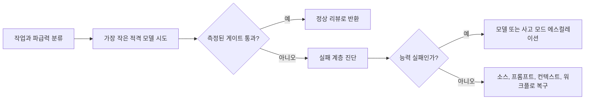

> 🇰🇷 이 문서는 한국어 번역본입니다(ELI5 스타일). 원문: [en.md](en.md)

# 실패 비용이 큰 곳에 능력을 쓰세요

> 모델 선택은 순위 매기기 놀이가 아닙니다. 품질, 지연 시간, 컨텍스트, 비용에 걸친 배분 문제입니다.

**유형:** Learn
**언어:** Python
**선수 지식:** [일을 떠안을 수 있는 가장 작은 접점을 고르세요](../../01-claude-product-and-model-landscape/), [캐싱, 레이트 리밋과 비용 최적화](../../../../../phases/11-llm-engineering/11-caching-cost/)
**시간:** 약 90분

## 학습 목표

- 외운 가격표에 의존하지 않고 토큰과 워크플로 비용 추정하기.
- 측정된 품질, 지연 시간, 파급력으로 모델 선택하기.
- 샘플링의 비결정성과, 릴리스 클레임에 반복 평가가 필요한 이유 설명하기.
- 현재 모델과 플랫폼을 검증한 뒤에만 속도, 노력(effort), 사고(thinking) 설정 선택하기.
- 모델 실패와 프롬프트, 컨텍스트, 소스, 워크플로 실패를 구분하기.
- 라우팅, 캐싱, 배치 처리, 출력 한도를 별개의 최적화 레버로 사용하기.

## 문제 상황

지원(서포트)팀이 모든 요청을 가장 유능한 모델로 라우팅합니다. 첫 달은 성공적으로 보입니다. 품질은 높지만 응답 시간은 들쑥날쑥하고 청구서는 예측의 네 배입니다.

관리자는 모든 것을 가장 빠른 모델로 옮기는 것으로 대응합니다. 비용은 줄었습니다. 하지만 에스컬레이션 요약은 예외 사항을 빠뜨리고, 복잡한 환불 케이스는 자신감 넘치지만 불완전한 권고를 받습니다.

두 설계 모두 모델 이름을 정책처럼 썼습니다. 어느 쪽도 '일'을 묘사하지 않습니다.

프로덕션(운영 환경) 결정은 실패의 비용에서 시작합니다. 내부 브레인스토밍의 오타는 값싸습니다. 환불 결정에서 빠진 예외는 더 비쌉니다. 모델, 프롬프트, 컨텍스트, 소스 품질, 리뷰 프로세스는 그 차이를 반영해야 합니다.

## 개념

### 토큰은 작업량의 척도입니다

모델은 페이지나 단어가 아니라 토큰을 처리합니다. 입력 토큰에는 지침, 대화 히스토리, 제공된 문서, 도구 정의, 검색된 콘텐츠가 포함됩니다. 출력 토큰에는 응답이 포함되고, 제품이나 API에 따라 추론 관련 계산이나 현재 가격 정책이 설명하는 다른 과금 단위가 포함될 수 있습니다.

계획을 위해 네 바구니로 나누세요:

```text
total input = stable instructions + task input + retrieved knowledge + prior turns
total output = requested answer + structured metadata
```

모든 입력을 한 숫자 안에 숨기지 마세요. 안정적인 지침은 캐싱의 이득을 볼 수 있습니다. 검색된 지식은 가지치기될 수 있습니다. 이전 턴은 요약되거나 버려질 수 있습니다. 작업 입력은 보통 제거할 수 없습니다.

### 실시간 가격보다 변수를 먼저 쓰세요

가격은 바뀝니다. 지속되는 방정식은 바뀌지 않습니다:

```text
request cost = input_tokens / 1,000,000 x input_rate
             + output_tokens / 1,000,000 x output_rate
             + tool or feature charges
```

워크플로라면:

```text
workflow cost = request cost x requests per case x cases per month
              + review cost
              + failure and rework cost
```

리뷰와 재작업(rework)이 중요합니다. 사람 교정 작업을 두 배로 만드는 더 싼 모델이 오히려 비싼 선택일 수 있습니다.

설명용이지 현재 가격은 아닌 요금표를 생각해 봅시다. 모델 A는 입력에 1, 출력에 5 단위. 모델 B는 3과 15. 한 케이스는 입력 토큰 20,000, 출력 토큰 2,000을 사용합니다. 모델 B는 호출당 세 배 비용입니다. 모델 A가 분류(triage) 케이스의 98퍼센트를 통과하고 어려운 케이스를 탐지할 수 있다면, 평범한 작업은 A로 라우팅하고 불확실한 나머지는 에스컬레이션하세요. 어려운 케이스를 안전하게 탐지할 수 없다면, 라우팅 설계가 불완전한 것입니다.

### 품질에는 '느낌'이 아니라 임계값이 필요합니다

모델을 테스트하기 전에 최소 수용 결과를 정의하세요. 유용한 차원:

- 필요한 사실이 존재함.
- 근거 없는 클레임이 없음.
- 지침을 따름.
- 출력 스키마가 유효함.
- 지연 시간이 워크플로 한도 미만.
- 사람 교정 시간이 임계값 미만.
- 안전과 프라이버시 통제가 유지됨.

최선의 모델은 모든 필수 임계값을 충분한 여유로 통과하는 가장 싼 옵션입니다. 평균 품질만으로는 부족합니다. 모델이 전체적으로는 점수가 높으면서 고파급 엣지 케이스는 전부 실패할 수 있습니다.

### 샘플링은 재생(replay)이 아니라 분포입니다

생성되는 각 토큰마다 언어 모델은 가능한 이어질 선택들 위에 분포를 가집니다. 샘플링은 그 분포에서 고릅니다. (받는 모델에서의) 온도 설정은 분포가 얼마나 집중되어 있는지를 바꿉니다. 모델 추론을 결정론적 함수로 만들지는 않습니다.

공식 Anthropic API 문서는 온도 0조차 완전히 결정적이지 않다고 명시합니다. 동일한 요청이 자사 API와 파트너 클라우드에서 서로 다른 결과를 낼 수 있습니다. 고정된 모델 ID가 모델 가중치를 안정화하지만, Anthropic의 모델 버전 관리 문서는 라우팅, 안전 분류기, 샘플링 로직 같은 서빙 인프라도 바뀔 수 있다고 말합니다.

이것은 증거의 의미를 바꿉니다:

- 통과한 응답 하나는 '그 응답 하나가 통과했다'는 것만 증명한다.
- 단일 평균은 꼬리(tail) 실패와 실행 간 변동을 숨긴다.
- 결정론적 검증기는 스키마와 산술을 검사할 수 있지만, 생성을 결정적으로 만들 수는 없다.
- 같은 버전 관리된 작업에서 반복 시도하면 최소 품질, 분산, 심각한 실패, 꼬리 지연이 드러난다.
- 모델, 프롬프트, 도구, 플랫폼, 서빙 모드가 바뀌면 새로운 비교가 필요하다.

작은 학습 연습이라도 구성당 최소 세 번의 독립 실행을 하세요. 프로덕션 표본 크기는 이 최소치가 아니라 관찰한 위험과 분산에서 나와야 합니다. 위험 슬라이스를 따로 비교하고, 듣기 좋은 평균 하나보다 최소 핵심 케이스 품질이나 p95 지연 같은 게이트를 선호하세요.

샘플링 통제 자체도 바뀔 수 있는 제품 사실입니다. 2026년 8월 9일 기준으로 확인한 바, 현재 Anthropic Messages 가이드는 Claude 4.7 이상이 기본값이 아닌 `temperature`, `top_p`, `top_k` 값을 거부한다고 설명합니다. 지원되는 구형 모델은 그중 일부를 여전히 받을 수 있습니다. 현재 모델과 플랫폼 문서를 확인하지 않고 오래된 요청의 샘플링 설정을 복사하지 마세요.

### 실패 계층을 진단하세요

출력이 약할 때 실패가 어디서 시작됐는지 물으세요:

1. **요구 사항 실패:** 성공이 처음부터 정의되지 않았다.
2. **소스 실패:** 필요한 사실이 없었거나 오래되었다.
3. **컨텍스트 실패:** 관련 증거가 묻히거나 잘리거나 상충하는 자료와 섞였다.
4. **프롬프트 실패:** 지침이나 출력 기준이 불분명했다.
5. **모델 실패:** 좋은 입력과 기준에도 모델이 능력이 부족했다.
6. **워크플로 실패:** 리뷰, 에스컬레이션, 도구 동작이 빠져 있었다.

모델 업그레이드는 주로 다섯 번째 계층에 도움이 됩니다. 나머지를 잠시 감출 수 있는데, 그러면 시스템 디버깅이 더 어려워집니다.

### 지연 시간은 여러 구성 요소로 이루어집니다

사용자는 전체 소요 시간보다 더 많은 것을 경험합니다:

- 첫 눈에 보이는 출력까지의 시간.
- 스트리밍 청크 사이의 시간.
- 전체 생성 시간.
- 도구와 검색 시간.
- 사람 승인 시간.

더 유능한 모델은 호출당 시간이 더 걸리면서 재시도 횟수를 줄일 수 있습니다. 작은 모델은 빨리 답하지만 더 많은 루프를 만들 수 있습니다. 워크플로 전체를 측정하세요.

### 관찰 가능한 제약으로 라우팅하세요

단순한 라우팅 정책은 작업을 세 개의 차선으로 분류할 수 있습니다:

| 차선 | 예시 | 정책 |
|---|---|---|
| 정례(Routine) | 제공된 업데이트 포맷하기 | 빠른 모델, 엄격한 템플릿 |
| 모호(Ambiguous) | 상충하는 메모 비교하기 | 균형 잡힌 모델, 소스 요건 |
| 중대(Consequential) | 예외 승인 권고하기 | 유능한 모델 + 필수 리뷰 |

분류기 자체도 실패할 수 있습니다. 가능한 한 결정론적 신호를 사용하세요: 문서 길이, 작업 유형, 민감도 라벨, 요청된 행동, 또는 사용자의 명시적 선택. 라우팅 결정을 로그로 남기고 잘못된 라우팅을 감사하세요.



### 캐싱, 배치, 한도는 서로 다른 문제를 풉니다

**프롬프트 캐싱**은 현재 모델과 플랫폼이 지원할 때, 안정적인 프롬프트 접두어를 반복 처리하는 비용과 지연을 줄입니다. 낡은 지침을 올바르게 만들지는 않습니다.

**의미적 캐싱(semantic caching)**은 충분히 비슷한 요청에 이전 결과를 재사용합니다. 신선도 정책이 필요하고, 개인화되거나 빠르게 바뀌거나 파급력 있는 작업에는 위험합니다.

**배치 처리**는 응답 시간을 비용과 처리량으로 바꿉니다. 야간 분류나 대량 추출 같은 오프라인 작업에 맞고, 사용자가 기다리는 인터랙티브 작업에는 맞지 않습니다.

**출력 한도**는 불필요하게 긴 응답을 막습니다. 그러나 작업 요건보다 작게 설정하면 작업 자체를 잘라 버립니다. 가장 작은 유용한 출력을 요청하고 완전성을 검증하세요.

**컨텍스트 가지치기**는 무관한 입력을 과금되기 전에, 그리고 모델의 주의를 흩기 전에 제거합니다. 컨텍스트가 더 많다고 자동으로 지식이 더 많은 것은 아닙니다.

### 구성은 날짜가 있는 묶음입니다

모델 선택은 구성 레버 하나일 뿐입니다:

| 레버 | 바꾸는 것 | 측정할 것 |
|---|---|---|
| Model(모델) | 베이스라인 능력, 가격, 지원 기능, 라이프사이클 | 위험 슬라이스별 품질, 비용, 지연 시간, 호환성 |
| Speed(속도) | 빠른 모드가 지원되는 곳에서의 서빙 속도, 보통 프리미엄 가격 | 초당 출력 토큰, 첫 토큰까지 시간, p95 지연, 수용된 결과 비용 |
| Effort(노력) | 지원되는 곳에서 모델이 텍스트, 사고, 도구 사용에 쏟는 작업량과 토큰 지출 | 품질, 도구 호출 수, 출력 토큰, 지연 시간, 비용 |
| Thinking(사고) | 지원되는 곳에서 모델이 명시적 추론을 배분하는지와 방법 | 어려운 케이스 품질, 사고 토큰, 총 출력, 지연 시간, 비용 |
| Prompt and output contract(프롬프트·출력 계약) | 지침, 증거 경계, 형식, 요청된 길이 | 지침 준수, 스키마 유효성, 교정 시간 |
| Sampling(샘플링) | 아직 받는 모델 생성의 무작위성 통제 | 결과 변동, 심각한 실패, 스타일 다양성 |

2026년 8월 9일 기준으로 확인한 바, 공식 모델 개요는 `claude-sonnet-5`와 `claude-opus-5`를 정확한 Claude API ID로 나열합니다. Sonnet 5는 적응형 사고가 기본 켜져 있고, 사고 비활성화를 받으며, 산출물에서 쓰인 low와 high 노력 값을 지원합니다. Opus 5는 적응형 사고와 산출물에서 쓰인 medium 노력 값을 받습니다.

빠른 모드(fast mode)는 더 좁습니다. 현재 공식 문서는 Sonnet 5가 아니라 Opus 5와 Opus 4.8을 나열하고, 이 기능을 파트너 플랫폼이 아닌 Claude API(Managed Agents 포함)로 제한합니다. 접근 권한, `speed: "fast"`, `anthropic-beta: fast-mode-2026-02-01` 헤더가 필요한 리서치 프리뷰입니다. 같은 모델을 더 빠른 추론과 프리미엄 가격으로 쓰는 것이며, 더 높은 지능을 약속하지 않습니다. 가용성, 지원, 가격은 독립적으로 바뀔 수 있습니다.

라우팅 코드나 학습 노트에 영구적인 호환성 매트릭스를 박아 넣지 마세요. 실험마다:

1. 정확한 모델 ID와 플랫폼을 기록합니다.
2. 모델 지원, 사고, 노력, 속도, 가격의 현재 공식 페이지를 엽니다.
3. 제안된 각 구성을 날짜와 소스와 함께 `docs-supported` 또는 `docs-unsupported`로 표시합니다. 문서가 지원한다는 것이 당신 계정에 프리뷰 접근이 있다는 증명은 아닙니다.
4. 지원되지 않는 조합을 시험하거나 조용히 폴백할 것이라고 가정하지 마세요.
5. 지원되는 구성을 같은 작업 세트와 게이트로 반복 실행합니다.

플랫폼이 허용하면 한 번에 레버 하나만 바꾸세요. 지원 정책 때문에 모델과 속도를 함께 바꿔야 한다면, 그것을 속도 단독의 효과 증명이 아니라 '라우팅 대안'이라고 부르세요.

### 환산된 시험 점수는 백분율이 아닙니다

2026년 8월 9일 기준으로 확인한 바, Anthropic의 인증 FAQ는 결과를 100~1,000 환산 점수로 보고하며 최소 합격 점수는 720입니다. 스케일링은 난이도가 다를 수 있는 시험 형태(form)들을 동등하게 맞춥니다.

따라서 720은 '72퍼센트가 원점수 합격선'이라는 증거가 절대 아닙니다. 이 커리큘럼의 퀴즈와 모의고사 백분율은 원점수 연습 점수입니다. 공식 환산 점수로 환산되지 않으며 시험 결과를 예측할 수 없습니다.

## 직접 만들기

주간 운영 워크플로를 위한 10케이스 모델 선택 벤치마크를 만드세요.

- 정례적인 포맷과 분류 케이스 4개.
- 모호한 종합 케이스 3개.
- 상충하는 소스 자료가 있는 케이스 2개.
- 사람에게 에스컬레이션해야 하는 중대 케이스 1개.

모델을 실행하기 전에 루브릭을 정의하세요:

```json
{
  "required_facts": 4,
  "unsupported_claims_allowed": 0,
  "format_valid": true,
  "latency_seconds_max": 20,
  "human_correction_minutes_max": 3,
  "consequential_case_must_escalate": true
}
```

가장 작은 그럴듯한 모델 계열을 먼저 테스트하세요. 입력·출력 토큰, 지연 시간, 루브릭 점수, 교정 시간을 기록합니다. 실패하는 케이스만 에스컬레이션하세요. 라우팅된 워크플로와, 10케이스 전부를 더 큰 모델에 보내는 방식을 비교하세요.

보고서는 다음에 답해야 합니다:

- 어떤 케이스가 작은 모델을 안전하게 쓸 수 있는가?
- 어떤 관찰 가능한 신호가 케이스를 위로 라우팅하는가?
- 어떤 실패가 모델 실패가 아니었는가?
- 예시 볼륨에서 라우팅이 얼마나 절약하는가?
- 라우터가 불확실할 때 무슨 일이 생기는가?

그다음 모호하거나 중대한 케이스 하나에 대한 모드 시행(mode-trials) 산출물을 만드세요:

1. 결과를 보기 전에 최소 품질, 최대 p95 지연, 최대 평균 비용, 최소 반복 실행 수를 정의한다.
2. 속도, 노력, 사고를 달리하는 구성을 최소 세 개 제안한다.
3. 정확한 모델과 플랫폼 조합을 현재 공식 문서에서 검증한다. 문서화된 '지원되지 않는' 조합 하나는 기각된 옵션으로 보존한다.
4. 지원되는 모든 구성을 같은 프롬프트, 소스, 도구, 채점 루브릭으로 최소 세 번 실행한다.
5. 실행마다 품질, 지연 시간, 비용, 결과 지문(fingerprint)을 기록한다.
6. 원시 실행에서 최소 품질, p95 지연, 평균 비용을 정합화(reconcile)한다.
7. 모든 게이트를 통과하는 가장 싼 지원 구성을 선택한다.

제공된 산출물은 한 모델에서 low와 high 노력, 적응형과 비활성화 사고, 표준과 빠른 서빙을 비교하고, 지원되지 않는 빠른 조합 하나를 다룹니다. 그 `standard` 속도는 요청 필드를 생략한다는 뜻의 정규화된 실험 라벨입니다. 빠른 구성은 필요한 프리뷰 접근, 요청 필드, 베타 헤더를 별도로 기록합니다. 이것은 날짜가 있는 예시이지, 재사용 가능한 호환성 표나 계정 자격의 증명이 아닙니다.

## 인터랙티브 랩

위험 그림에서 파급력, 불확실성, 되돌릴 수 있는지, 리뷰 강도를 바꿔 보세요. 토큰 지출을 최적화하기 전에 '그럴듯한 오류 통과(오탐 통과)'의 숨은 비용이 보입니다.

```figure
02-responsible-ai-risk
```

## 연습 랩

10케이스 라우팅 벤치마크를 실행하세요. 중대 케이스가 리뷰를 건너뛰게 하거나, 케이스 ID를 중복시키거나, 라우팅 비용을 잘못 표기해서 결정론적 검증이 실패하는지 확인하세요. 그다음 반복 모드 실행을 하나 지우거나, 정합화된 p95 값을 바꾸거나, 문서화된 지원되지 않는 모드를 시도하거나, 비용 게이트를 실패하는 구성을 선택해 보세요. 게이트를 약화시키는 대신 증거를 고치세요.

## 출시된 산출물(Shipped Artifact)

`outputs/model-routing-benchmark.json`은 정례, 모호, 상충 소스, 중대 작업에 걸친 10케이스 라우팅 계약을 보존합니다. 측정된 게이트, 선택된 차선, 토큰 추정치, 리뷰 시간, 그리고 모든 케이스를 더 큰 모델에 보내는 방식과의 비교를 포함합니다.

`outputs/mode-trials.json`은 적용된 구성 산출물입니다. 현재 문서 근거, 속도, 노력, 사고, 빠른 모드 요청 전제 조건, 반복 품질, p95 지연, 평균 비용, 지원되지 않는 조합, 선택된 모드, 재실행 트리거를 기록합니다.

지원 명령문은 공식 문서 기준의 날짜가 있으며, 실제 요청으로 검증된 것이 아니라 `docs-supported` 상태를 사용합니다. 품질, 지연 시간, 비용 값은 설명용 연습 데이터이지, 프로바이더 실행이나 벤치마크 결과가 아닙니다. 당신 자신의 작업 세트와 계정에서 반복한 결과로 바꾸세요.

## 검증하기

프로바이더를 호출하지 않고 벤치마크를 검증합니다:

```bash
cd certifications/claude/lessons/02-model-selection-and-token-economics/code
python3 main.py
python3 -m unittest discover tests -v
```

검증기는 원래 벤치마크 검사를 보존하고 모드 시행을 별도로 검증합니다. 현재 공식 지원 증거, 명시적인 '설명용 측정' 라벨, 빠른 모드 요청 전제 조건, docs-supported 모드당 최소 세 번의 반복 실행, 관찰된 결과 지문, 정합화된 요약, 시도하지 않은 docs-unsupported 옵션, 가장 싼 통과 구성의 선택을 요구합니다. 미래의 어떤 모델이 어떤 모드를 지원할지에 대한 하드코딩된 주장은 하지 않습니다.

## 캡스톤 연결

퀴즈는 라우팅, 실패 계층 진단, 비용 추론을 테스트합니다. 검증된 벤치마크를 캡스톤 29~32의 모델 선택 증거로 사용한 뒤, 설명용 측정치를 당신의 대표 케이스 결과로 바꾸세요.

## 활용하기

이 결정 문장을 사용하세요:

```text
For [task class], choose [model family or mode] because it clears [quality gate]
across [repeated runs] within [p95 latency and mean cost limit]. Escalate when
[observable condition], and require [review rule] when [consequence threshold].
Model, platform, speed, effort, and thinking support checked in official docs on [date].
```

근거가 "더 똑똑하니까"뿐이라면, 결정이 끝나지 않은 것입니다.

벤치마크를 실행하기 전에 실시간 모델 개요와 가격 페이지를 검토하세요. 정확한 모델 식별자는 시대를 초월한 정책이 아니라 벤치마크 결과 안에 저장하세요. 이것은 모델 별칭이 바뀌어도 증거가 조용히 무효화되는 일을 막습니다.

지원되지 않는 구성은 프로덕션 요청이 아니라 결정 기록에 남기세요. 그 기각은 유혹적인 모드가 왜 테스트되지 않았는지 설명하고, 미래 검증을 위한 명확한 트리거를 만듭니다.

## 시험 결정 패턴

- 더 큰 능력에 돈을 쓰기 전에 빠진 기준, 소스, 컨텍스트를 먼저 고치세요.
- 대표 품질 게이트를 통과하는 가장 작은 모델을 사용하세요.
- 토큰 가격만이 아니라 사람 교정과 실패 비용을 포함하세요.
- 중대하거나 모호한 작업은 관찰 가능한 신호로 위로 라우팅하세요.
- 워크플로가 지연된 완료를 견딜 때만 배치 처리하세요.
- 신선도와 격리가 허용할 때만 안정적이고 재사용 가능한 자료를 캐시하세요.
- 모델 기능, 가격, 한도를 날짜가 있는 사실로 취급하세요.
- 확률적 평가는 반복하세요. 낮은 온도나 고정된 모델 ID가 동일한 출력을 보장하지 않습니다.
- 속도, 노력, 사고를 등급이 아니라 측정된 구성 선택으로 비교하세요.
- 720을 환산된 인증 점수로 취급하고, 절대 원시 백분율로 취급하지 마세요.

## 흔한 함정

- 작업 벤치마크 대신 계열 평판으로 고르기.
- 쉬운 예시 하나로 모델 비교하기.
- 핵심 케이스 실패를 숨긴 채 평균 품질 보고하기.
- 모든 나쁜 출력을 모델 한계라고 부르기.
- 비용과 주의 분산이 같이 오를 때까지 컨텍스트 늘리기.
- 근본 소스가 바뀐 뒤 캐시된 출력 재사용하기.
- 비용 모델에서 리뷰 시간 빼기.
- 불투명한 분류기와 감사 기록 없이 라우팅하기.
- 한 번 통과했거나 온도가 낮았다는 이유로 프롬프트를 결정적이라고 선언하기.
- 다른 모델이나 플랫폼의 속도, 노력, 사고, 샘플링 설정 복사하기.
- 지원되지 않는 모드를 실패 시 닫기(fail closed)와 비호환 기록 대신 조용히 다운그레이드하기.
- 사용자 대면 목표를 위반하는 꼬리 지연을 숨긴 채 평균 지연만 비교하기.
- 720 환산 합격선을 원시 72퍼센트 목표로 바꾸기.

## 연습 문제

1. 50,000 케이스와 두 모델 등급이 있는 워크플로의 월간 비용을 기호적으로 계산하세요.
2. 지원 워크플로를 위한 결정론적 라우팅 신호 세 개를 쓰세요.
3. 다섯 개 실패를 요구 사항, 소스, 컨텍스트, 프롬프트, 모델, 워크플로 문제로 진단하세요.
4. 배치 처리를 써야 하는 작업 하나와, 인터랙티브로 남아야 하는 작업 하나를 찾으세요.
5. 현재 사고(thinking) 기능 하나를 공식 문서에서 검증하고 모델, 플랫폼, 날짜를 기록하세요.
6. 구성 하나를 세 번 실행하고 결과 지문을 보존한 뒤, 단일 실행이 무엇을 숨겼을지 설명하세요.
7. 공식 문서에서 현재 지원되지 않는 모드 조합 하나를 찾고, 요청을 보내지 않고 기록하세요.

## 핵심 용어

| 용어 | 의미 |
|---|---|
| Token economics(토큰 경제학) | 입력, 출력, 요청량, 모델 요율, 워크플로 비용 사이의 관계 |
| Quality gate(품질 게이트) | 후보 구성이 통과해야 하는 측정 가능한 임계값 |
| Routing(라우팅) | 작업 신호로 모델이나 실행 차선 선택하기 |
| Escalation(에스컬레이션) | 불확실하거나 중대한 작업을 더 큰 능력이나 사람 검토로 넘기기 |
| Prompt caching(프롬프트 캐싱) | 안정적인 프롬프트 자료에 대한 프로바이더 측 계산 재사용 |
| Rework cost(재작업 비용) | 불충분한 출력을 교정하는 데 필요한 사람 또는 기계 노력 |
| Sampling(샘플링) | 모델 확률 분포에서 생성 토큰 선택하기 |
| Mode trial(모드 시행) | 정확한 모델, 플랫폼, 속도, 노력, 사고 구성 하나의 반복되고 날짜 있는 평가 |
| Tail latency(꼬리 지연) | p95처럼 평균에 숨은 느린 요청을 드러내는 고백분위 지연 측정치 |
| Scaled score(환산 점수) | 시험 형태(form)를 동등하게 맞추는 데 쓰이는 변환된 결과이지 원시 백분율이 아님 |

## 더 읽기

- [모델 개요](https://platform.claude.com/docs/en/about-claude/models/overview)
- [Message 생성 API 참조](https://platform.claude.com/docs/en/api/messages/create)
- [Messages 다루기](https://platform.claude.com/docs/en/build-with-claude/working-with-messages)
- [모델 ID와 버전 관리](https://platform.claude.com/docs/en/about-claude/models/model-ids-and-versions)
- [Claude Sonnet 5의 새 소식](https://platform.claude.com/docs/en/about-claude/models/whats-new-sonnet-5)
- [Claude Opus 5의 새 소식](https://platform.claude.com/docs/en/about-claude/models/whats-new-opus-5)
- [Claude 가격](https://platform.claude.com/docs/en/about-claude/pricing)
- [사고(Thinking)](https://platform.claude.com/docs/en/build-with-claude/thinking)
- [노력(Effort)](https://platform.claude.com/docs/en/build-with-claude/effort)
- [빠른 모드](https://platform.claude.com/docs/en/build-with-claude/fast-mode)
- [프롬프트 캐싱](https://platform.claude.com/docs/en/build-with-claude/prompt-caching)
- [배치 처리](https://platform.claude.com/docs/en/build-with-claude/batch-processing)
- [Anthropic 인증 FAQ](https://anthropic-partners.skilljar.com/page/faq-certifications)
- [캐싱, 레이트 리밋과 비용 최적화](../../../../../phases/11-llm-engineering/11-caching-cost/)
- [프롬프트·의미 캐싱 경제학](../../../../../phases/17-infrastructure-and-production/14-prompt-semantic-caching/)
- [비용 절감 프리미티브로서의 모델 라우팅](../../../../../phases/17-infrastructure-and-production/16-model-routing/)
