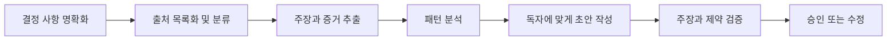

# 요청을 검증 가능한 계약으로 바꾸기

> 🇰🇷 이 문서는 한국어 번역본입니다(ELI5 스타일). 원문: [en.md](en.md)

> 좋은 프롬프트는 무엇을 쓸지만 설명하지 않습니다. 생성이 시작되기 전에 성공이 무엇인지 관측 가능하게 만듭니다.

**유형:** Learn
**언어:** Python
**선수 지식:** [단어가 아니라 결정을 공부하기](../../00-certification-strategy/), [프롬프트 엔지니어링](../../../../../phases/11-llm-engineering/01-prompt-engineering/)
**시간:** 약 100분

## 학습 목표

- 모호한 요청을 결과물, 증거 기준, 제약 조건, 합격 검사로 번역할 수 있다.
- 복잡한 작업을 각각 독립적으로 검사하고 수정할 수 있는 단계로 나눌 수 있다.
- 직접 프롬프팅, 예시 제공, 구조화된 섹션, 반복 개선, 워크플로 재설계 중 상황에 맞는 방법을 고를 수 있다.
- 나쁜 출력을 무조건 모델 탓으로 돌리지 않고 프롬프트 실패를 진단할 수 있다.
- 가치가 높은 Claude 워크플로를 위해 재사용 가능한 프롬프트 패킷을 만들 수 있다.

## 문제 상황

운영 관리자가 Claude에게 "우리 고객 불만 사항을 조사해서 설득력 있는 경영진 보고서와 권고안을 만들어 줘"라고 요청했습니다. 결과물은 유창합니다. 권고안 네 개, 트렌드 두 개, 깔끔한 표까지 들어 있습니다.

하지만 쓸 수 없는 결과물이기도 합니다. 권고안 하나는 회사 정책과 충돌하고, 표는 서로 다른 두 기간의 데이터를 뒤섞었으며, 지역별 예외 사항이 빠져 있습니다. 어떤 불만 사항이 어떤 주장을 뒷받침하는지 아무도 알 수 없습니다.

팀은 세 가지 방법으로 고쳐 보려 합니다. "정확하게 해 줘"를 추가하고, Claude에게 "더 깊게 생각해 봐"라고 요청하고, 마지막에는 같은 요청을 더 성능이 좋은 모델에 붙여 넣습니다. 글은 더 좋아지지만 증거 문제는 그대로 남습니다.

애초에 요청에는 결정 사항, 허용된 출처, 요구되는 커버리지, 독자, 그리고 근거 있는 권고안의 판정 기준이 정의되어 있지 않았습니다. 그럴듯한 보고서가 유일하게 보이는 목표였으니, Claude는 그럴듯한 보고서에 맞춰 최적화했을 뿐입니다.

## 개념

### 프롬프팅은 인터페이스 설계입니다

프롬프트는 사람의 의도와 모델의 동작을 잇는 인터페이스입니다. 좋은 인터페이스는 입력, 제약 조건, 출력, 실패 상태를 드러냅니다. 약한 프롬프트는 이 네 가지를 모두 "훌륭한", "포괄적인", "전문적인" 같은 형용사 속에 숨겨 버립니다.

다음 계약을 사용해 보세요.

1. **결과물(Outcome):** 이 출력이 어떤 결정이나 행동을 지원하는가?
2. **맥락(Context):** 어떤 배경 지식이 필요하고, 무엇이 불필요한가?
3. **과업(Task):** Claude가 어떤 변환 작업을 수행해야 하는가?
4. **증거(Evidence):** 어떤 출처가 주장을 뒷받침할 수 있고, 빈틈은 어떻게 처리하는가?
5. **제약(Constraints):** 절대 일어나면 안 되는 일은 무엇인가?
6. **형식(Format):** 결과물이 정확히 어떤 모양이어야 하는가?
7. **합격 검사(Acceptance checks):** 사람이나 프로그램이 합격 여부를 어떻게 판단하는가?

순서보다 중요한 것은 일곱 요소가 모두 있다는 점입니다. 섹션은 마크다운 제목, XML 스타일 태그, 또는 일관된 다른 구분 기호로 표시할 수 있습니다. 구조화하면 모델이 데이터와 지시문을 구분하기 쉬워지고, 검토자도 가정이 숨어 있는 곳을 찾기 쉬워집니다.

```text
<outcome>
주간 지원 리뷰를 준비한다. 목적은 디렉터가 두 가지 프로세스 개선책을 고를 수 있도록 하는 것.
</outcome>

<sources>
첨부된 티켓과 정책 핸드북만 사용한다. 핸드북을 권위 있는 자료로 대우한다.
</sources>

<task>
불만 사항을 근본 원인별로 묶고, 각 그룹의 수를 세고, 개선책은 최대 세 개까지만 제안한다.
</task>

<constraints>
고객의 의도를 추론하지 않는다. 날짜가 없으면 unknown으로 표시한다. 이름은 포함하지 않는다.
</constraints>

<output>
출력: 요약(경영진용), 증거 표, 권고안, 불확실성 목록.
</output>

<checks>
모든 권고안은 티켓 ID 2개 이상과 정책 조항 1개 이상을 인용해야 한다.
</checks>
```

### 기준이 표현보다 먼저입니다

목표가 없으면 프롬프트 최적화 자체가 불가능합니다. 먼저 기준을 정하고, 대표적인 사례를 놓고 프롬프트를 개선해 나가세요.

불만 사항 보고서라면 기준은 이럴 수 있습니다.

- 모든 불만 사항이 정확히 한 번 분류되거나, 명시적으로 미분류로 표시된다.
- 개수를 합산하면 입력 총개수와 일치한다.
- 정책 관련 주장은 제공된 조항을 인용한다.
- 권고안이 팀의 권한 범위를 넘지 않는다.
- 개인 식별 정보가 없다.
- 불확실성은 추측으로 바꾸지 않고 그대로 드러난다.

"더 좋게 만들어 줘"는 진단 신호가 전혀 없습니다. "개수가 총합과 일치해야 한다"는 무엇이 실패했고 무엇을 바꿔야 하는지 알려 줍니다.

### 검증 경계를 따라 나눕니다

긴 작업은 각 단계가 검사 가능한 산출물을 만들 때 훨씬 안전해집니다. 유용한 분해는 다음과 같습니다.



이것은 정해진 페이지 수로 자르는 것과 다릅니다. 각 경계는 질문 하나에 답해야 합니다.

- 분석 전에 출처 목록을 검증할 수 있는가?
- 해석 전에 추출한 사실을 검증할 수 있는가?
- 게시 전에 권고안을 검증할 수 있는가?

서로 의존하지 않는 독립적인 작업만 병렬로 실행하세요. 불만 카테고리 분류와 정책 제약 추출은 병렬로 돌릴 수 있습니다. 권고안 작성은 둘 다 끝날 때까지 기다려야 합니다.

순차적인 단계는 숨은 결합을 줄여 줍니다. 복구 지점도 만들어 줍니다. 추출이 잘못됐다면 보고서 전체를 다시 만드는 게 아니라 추출 단계만 고치면 됩니다.

### 예시는 경계를 가르칩니다

규칙을 말로 설명하기 어렵거나 형식이 정확해야 할 때 퓨샷(few-shot) 예시가 유용합니다. 좋은 예시는 쉬운 중심 사례만 보여 주는 게 아니라 결정 경계를 보여 줍니다.

감성 레이블을 예로 들면, 명백히 긍정적인 예시 세 개만 주지 마세요. 애매한 불만 사항, 긍정과 부정이 섞인 진술, "알 수 없음" 사례를 함께 넣고 각 레이블이 왜 맞는지 설명하세요. 그래야 모델이 카테고리를 가르는 기준을 배웁니다.

예시는 우연히 엉뚱한 규칙을 만들어 내기도 합니다. 모든 예시가 소매 고객을 언급하면 모델은 소매 관련 표현 자체를 과업의 일부로 여길 수 있습니다. 예시는 다양하고, 최소한이며, 작성된 기준과 일치해야 합니다.

### 역할은 신중하게 부여합니다

역할 프롬프트는 "컴플라이언스 검토자처럼 행동해" 같은 관점을 줄 수는 있습니다. 하지만 지식, 권한, 접근 권한을 부여하지는 않습니다. 역할은 정책 문서, 출처 증거, 사람의 승인 단계를 대체할 수 없습니다.

구체적인 관점을 주세요.

```text
개인정보 보호 책임자의 관점에서 초안을 검토한다.
개인 데이터를 노출하는 문장을 하나하나 찾아 내고, 제공된 정책 중 해당 조항을 인용하며,
규정을 지키는 최소한의 수정안을 제안한다.
```

이것은 검증할 수 있습니다. "당신은 세계 최고의 개인정보 전문가입니다"는 검증할 수 없습니다.

### 반복 개선에는 가설이 필요합니다

의미 있는 반복 개선은 의미 있는 변수 하나를 바꾸고, 작은 평가 세트로 그 효과를 측정하는 것입니다. 예를 들면 다음과 같습니다.

- 가설: 주장-증거 표를 요구하면 근거 없는 권고안이 줄어든다.
- 가설: 정책을 티켓보다 먼저 배치하면 예외 처리가 좋아진다.
- 가설: 반례 하나를 넣으면 혼합 사례 분류가 좋아진다.

프롬프트 변형을 비교하는 동안 평가 사례는 고정하세요. 그렇지 않으면 프롬프트가 나아진 것인지 입력이 쉬워진 것인지 구분할 수 없습니다.

여러 번 바꿔도 계속 실패한다면 문장을 다듬는 것을 멈추세요. 문제는 증거 부족, 상충하는 요구 사항, 과도한 컨텍스트, 부족한 모델 능력, 안전하지 않은 워크플로일 수 있습니다.

## 만들어 보기

### 단계 1: 합격 카드 작성하기

반복적으로 하는 업무 하나를 고르고, 프롬프트를 쓰기 전에 짧은 합격 카드를 작성하세요.

```text
지원하는 결정:
주요 독자:
권위 있는 출처:
필요한 사실:
금지된 내용이나 행동:
출력 구조:
합격 조건:
에스컬레이션 조건:
```

합격 조건은 모두 관측 가능해야 합니다. "전문적"은 관측할 수 없습니다. "설명 없는 약어를 쓰지 않고 세 문장 요약으로 시작한다"는 관측할 수 있습니다.

### 단계 2: 출처 우선순위 만들기

출처가 서로 충돌하는 것은 흔한 일입니다. 어느 출처가 이기는지 Claude에게 알려 주세요.

```text
권위 순서:
1. 2026-07-01자 승인된 정책 핸드북
2. 현재 운영 절차
3. 티켓 메모

출처가 충돌하면 충돌 사실을 보고한다. 조용히 더 최신이거나 더 긴 텍스트를 고르지 않는다.
```

최신성과 권위는 다릅니다. 최근 채팅 메시지가 승인된 정책을 자동으로 덮어쓰지는 않습니다.

### 단계 3: 단계 설계하기

각 단계마다 입력, 출력, 게이트를 정의하세요.

| 단계 | 입력 | 출력 | 게이트 |
|---|---|---|---|
| 접수(Intake) | 요청과 출처 목록 | 범위 카드 | 담당자가 결정과 마감을 확인 |
| 추출(Extraction) | 승인된 출처 | 주장-증거 행 | 필수 필드 완비 |
| 분석(Analysis) | 검증된 행 | 패턴과 예외 | 개수 일치 |
| 초안(Draft) | 승인된 분석 | 독자용 보고서 | 형식과 범위 합격 |
| 검증(Validation) | 초안과 출처 | 발견 사항과 수정 | 고위험 발견 사항 해결 |

이 표는 곧 워크플로 명세입니다. 단계별 프롬프트는 거대한 프롬프트 하나보다 작고 정확하게 유지할 수 있습니다.

### 단계 4: 불확실성 동작 추가하기

증거가 없을 때 무엇을 해야 하는지 Claude에게 알려 주세요.

```text
필요한 사실을 확인할 수 없으면 "제공된 출처만으로는 확인되지 않음"이라고 쓴다.
누락된 출처를 나열하고 어떤 결론을 내릴 수 없는지 설명한다.
과업이 추정을 명시적으로 허용하지 않는 한 숫자를 추정하지 않는다.
```

보류(abstention)는 설계된 출력이지 모델의 결함이 아닙니다.

### 단계 5: 공격적인 사례 테스트하기

최소 다섯 가지 사례를 만드세요.

- 증거가 완전한 정상 요청.
- 필수 출처 하나가 빠진 요청.
- 서로 충돌하는 두 출처.
- 출처 내용 안에 숨어 있는 지시문.
- 사용자 권한을 넘는 요청.

합격 카드를 기준으로 합격/불합격을 기록하세요. 인상적인 시연 하나만 믿지 마세요.

## 인터랙티브 랩

프롬프트 계약 피규어를 사용해 결과물, 증거, 제약, 출력 형식, 검사를 별개 구성 요소로 편집해 보세요. 단계 게이트를 따라가 보면, 출처가 빠졌을 때 분석을 멈춰야 하는지 — 더 예쁜 형식의 불확실성 문서를 만들면 안 되는지 — 이해할 수 있습니다.

```figure
03-prompt-contract
```

## 연습 랩

계약 채점기를 실행하고, 합격 검사 하나, 출처 순위 하나, 단계 게이트 하나, 공격적 사례 하나를 제거해 보세요. 애매한 프롬프트 문구를 추가하는 대신 정확한 실패를 수리해 보세요.

## 산출물

`outputs/prompt-contract-packet.json`은 작성 완료된 불만 분석 계약입니다. 일곱 계약 요소 전부, 권위 순서, 공격적 평가 사례 다섯 개, 명시적인 보류 동작, 단계별 게이트가 들어 있습니다.

## 검증하기

로컬에서 검증하세요:

```bash
cd certifications/claude/lessons/03-prompting-and-task-decomposition/code
python3 main.py
python3 -m unittest discover tests -v
```

검증기는 애매한 합격 기준, 누락된 권위 순서, 없는 에스컬레이션 동작, 그리고 정상/출처 누락/충돌/인젝션/무권한 사례 중 하나라도 빠진 평가 세트를 거부합니다.

## 캡스톤 연결

퀴즈는 계약 설계, 분해, 증거 계층, 보류를 확인합니다. 검증을 통과한 패킷을 캡스톤 29~32로 가져가서, 여러분이 만들 워크플로의 버전 관리되는 프롬프트이자 합격 계약으로 사용하세요.

## 활용하기

### 시험 판단 패턴

시나리오 문제에서는 이 순서를 사용하세요.

1. 요청된 결과물을 파악한다.
2. 빠진 요구 사항이나 증거를 찾는다.
3. 실패를 관측 가능하게 만드는 수리 방법을 선호한다.
4. 결과가 큰 일에서는 명시적인 사람 또는 정책 경계를 유지한다.
5. 프롬프트, 컨텍스트, 워크플로 원인을 다 처리한 뒤에만 모델 능력을 올린다.

가장 강한 답은 보통 계약이나 워크플로를 개선합니다. 애매한 형용사를 추가하는 일은 거의 없습니다.

### 흔한 함정

- **프로젝트 전체를 한 프롬프트로:** 복잡한 작업에 검증 지점이 없어집니다.
- **계층 없이 더 많은 디테일:** 긴 프롬프트는 모순을 더 많이 담을 수 있습니다.
- **역할을 권위로 착각:** 페르소나는 신뢰할 수 있는 사실이나 권한을 만들지 않습니다.
- **경계 사례 없는 예시:** 모델은 쉬운 패턴만 배우고 경계는 놓칩니다.
- **사고 과정 의존:** 숨은 추론 텍스트를 요구하는 것은 검증 가능한 중간 산출물의 대체품이 아닙니다.
- **모델 업그레이드가 첫 대응:** 아무리 좋은 능력도 없는 정책은 복구할 수 없습니다.
- **끝없는 대화식 수정:** 재사용하는 작업에는 버전 관리되는 지시문과 평가 사례가 필요합니다.

### 연습 문제

1. "이걸 경영진용으로 요약해 줘"를 일곱 요소 프롬프트 계약으로 다시 써 보세요.
2. 다섯 단계 작업을 골라 어떤 단계가 병렬로 실행될 수 있는지 찾고, 모든 의존 관계를 설명하세요.
3. 카테고리 레이블용 예시 세 개를 만드세요: 명확한 것 하나, 경계 사례 하나, 보류 사례 하나.
4. 상충하는 증거와 무권한 요청을 포함해 프롬프트용 평가 사례 다섯 개를 설계하세요.
5. 최근의 약한 출력 하나를 검토하고 실패를 요구 사항, 출처, 컨텍스트, 프롬프트, 모델, 워크플로 중 하나로 분류하세요.

## 핵심 용어

- **합격 기준(Acceptance criterion):** 출력이 반드시 만족해야 하는 관측 가능한 조건.
- **분해(Decomposition):** 작업을 명시적인 의존 관계와 출력이 있는 단계로 나누는 것.
- **퓨샷 프롬프팅(Few-shot prompting):** 원하는 작업이나 경계를 보여 주는 예시를 제공하는 것.
- **프롬프트 계약(Prompt contract):** 결과물, 맥락, 과업, 증거, 제약, 형식, 검사를 구조화해 적은 것.
- **출처 계층(Source hierarchy):** 출처가 충돌할 때 어떤 증거가 권위 있는지 정하는 규칙.
- **보류(Abstention):** 증거나 권한이 부족할 때 추론을 명시적으로 거부하는 것.
- **검증 경계(Verification boundary):** 작업이 계속되기 전에 중간 산출물을 검사할 수 있는 지점.

## 더 읽을거리

- [Anthropic: 프롬프트 엔지니어링 개요](https://platform.claude.com/docs/en/build-with-claude/prompt-engineering/overview)
- [Anthropic: 프롬프팅 모범 사례](https://platform.claude.com/docs/en/build-with-claude/prompt-engineering/claude-4-best-practices)
- [Anthropic: 성공 기준 정의와 평가 만들기](https://platform.claude.com/docs/en/test-and-evaluate/develop-tests)
- [AI Engineering from Scratch: 퓨샷 프롬프팅과 사고 연쇄](../../../../../phases/11-llm-engineering/02-few-shot-cot/)
- [AI Engineering from Scratch: Anthropic 워크플로 패턴](../../../../../phases/14-agent-engineering/12-anthropic-workflow-patterns/)

공식 제품 동작과 모델별 프롬프팅 조언은 바뀔 수 있습니다. 위 링크는 2026-08-08에 확인했습니다. 프로덕션(운영 환경) 프롬프트를 확정하거나 특정 릴리스 기능을 공부하기 전에 최신 Anthropic 문서를 다시 확인하세요.
