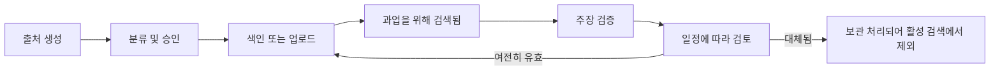

# 모든 사실을 알맞은 종류의 컨텍스트에 넣기

> 🇰🇷 이 문서는 한국어 번역본입니다(ELI5 스타일). 원문: [en.md](en.md)

> 컨텍스트는 일시적인 주력입니다. 지식은 관리되는 증거입니다. 메모리는 연속성입니다. 캐싱은 재사용입니다. 이 넷을 뒤섞으면 그럴듯한 낡은 답이 나옵니다.

**유형:** Learn
**언어:** Python
**선수 지식:** [요청을 검증 가능한 계약으로 바꾸기](../../03-prompting-and-task-decomposition/), [컨텍스트 엔지니어링](../../../../../phases/11-llm-engineering/05-context-engineering/)
**시간:** 약 105분

## 학습 목표

- 채팅 컨텍스트, 프로젝트 지시문, 프로젝트 지식, 메모리, 커넥터, 검색, API 프롬프트 캐싱을 구분할 수 있다.
- 무엇을 저장하고, 검색하고, 요약하고, 갱신하고, 버릴지 선택할 수 있다.
- 권위, 소유권, 민감도, 최신성 메타데이터를 갖춘 출처 레지스트리를 만들 수 있다.
- 필요한 증거를 지우지 않고도 컨텍스트 과부하를 줄일 수 있다.
- 어떤 Claude 제품 동작이 바뀔 수 있는지 판별하고 최신 문서에서 확인해야 하는지 설명할 수 있다.

## 문제 상황

한 팀이 분기 계획을 위해 Claude 프로젝트를 만들었습니다. 정책 파일, 회의록, 영업 데이터 내보내기, 낡은 제품 로드맵을 업로드하고, 프로젝트 지시문에는 "가장 최근에 승인된 계획을 사용해"라고 적어 넣었습니다.

석 달 뒤, Claude가 낡은 로드맵에 있던 출시일을 권고했습니다. 그 날짜는 프로젝트 지식에 있고, 과거 회의록 여러 곳에 등장하며, 커넥터에 저장된 더 최신의 결정과 충돌합니다. 답변은 자신감 넘치게 들립니다. 컨텍스트 안에 틀린 답을 뒷받침하는 증거가 반복되고 있었기 때문입니다.

팀은 이것을 환각(hallucination)이라고 불렀습니다. 하지만 대부분은 지식 관리 실패입니다. 프로젝트를 문서 창고로, 메모리를 권위 출처로, 검색을 진실의 보증으로 취급한 탓입니다.

많은 컨텍스트가 좋은 컨텍스트는 아닙니다. 믿을 수 있는 시스템은 어떤 사실이 일시적인지, 어떤 사실이 권위 있는지, 그리고 누가 그 사실을 최신으로 유지할 책임이 있는지 압니다.

## 개념

### 일곱 메커니즘, 일곱 역할

Claude는 여러 메커니즘을 통해 정보를 받거나 재사용할 수 있습니다. 정확한 제공 여부, 제한, 이름은 플랜과 제품에 따라 바뀔 수 있습니다. 오래 남는 구분은 각자의 역할입니다.

| 메커니즘 | 주 역할 | 주요 위험 |
|---|---|---|
| 현재 채팅 컨텍스트 | 지금 이 대화를 전달 | 오래된 턴이 주의를 소모하거나 충돌 |
| 프로젝트 지시문 | 재사용 가능한 동작과 제약 설정 | 포괄적인 지시문이 낡거나 모호해짐 |
| 프로젝트 지식 | 관리되는 참조 자료 공급 | 파일에 소유권이나 최신성 통제가 없음 |
| 메모리 | 대화 간에 유용한 연속성 보존 | 기억된 선호가 승인된 사실로 오인됨 |
| 커넥터 | 현재 권한 아래에서 외부 시스템 접근 | 출처 권한, 동기화, 최신성이 오해됨 |
| 검색 | 더 큰 코퍼스에서 관련 조각 선택 | 관련해 보이는 텍스트가 불완전하거나 낮은 권위 |
| 프롬프트 캐싱 | 안정적인 API 프롬프트 접두부를 효율적으로 재사용 | 동적 콘텐츠가 캐시되거나 무효화가 무시됨 |

하나의 기능이 여러 역할을 지원할 수 있지만, 이 구분이 범주 오류를 막아 줍니다. 메모리는 "간결한 보고서를 선호한다"는 사실을 Claude에게 상기시킬 수 있습니다. 하지만 메모리가 조용히 현재 환불 정책의 출처가 되어서는 안 됩니다. 커넥터는 최신 파일을 보여 줄 수 있습니다. 하지만 그 파일이 승인되었다는 증거는 아닙니다.

### 컨텍스트에는 주의 예산이 있습니다

큰 컨텍스트 윈도우는 용량을 늘릴 뿐 확실성을 늘리지 않습니다. 문서가 하나 추가될 때마다 주의 경쟁이 생기고 모순이 스며들 기회도 함께 늘어납니다.

네 겹으로 생각해 보세요.

```text
컨텍스트 꾸러미 = 지배적 지시문
                + 과업별 입력
                + 검색된 권위 있는 증거
                + 최소한의 연속성
```

안정적인 지시문은 안정적으로 유지하세요. 현재 결정에 필요한 과업 입력만 추가하세요. 증거는 메타데이터와 권위 규칙으로 검색하세요. 이전 대화는 현재 과업에 영향을 줄 때만 끌고 오세요.

긴 대화에는 버려진 계획, 정정된 사실, 포맷 실험이 쌓이기 쉽습니다. 무한히 이어 가는 것보다 검증된 브리핑으로 새 대화를 시작하는 쪽이 안전할 때가 많습니다. 요약은 결정과 논의를 분리한 뒤에 하세요.

### 검색은 선택이지 검증이 아닙니다

검색 시스템은 보통 관련도로 조각의 순위를 매깁니다. 하지만 관련도는 다음 질문에 답하지 않습니다.

- 이 출처는 승인되었는가?
- 최신인가?
- 규칙 전체를 담고 있는가, 발췌만 담고 있는가?
- 더 높은 권위의 출처가 충돌하지 않는가?
- 이 사용자가 이 출처에 접근해도 되는가?

각 출처에 메타데이터를 붙이고, 의미 기반 관련도와 함께 또는 그보다 먼저 필터링하세요. 최소한의 레지스트리에는 다음이 들어갑니다.

| 필드 | 질문 |
|---|---|
| 출처 ID | 주장이 이 출처로 거슬러 올라갈 수 있는가? |
| 소유자 | 정확성에 책임지는 사람은 누구인가? |
| 권위 | 정책인가, 절차인가, 메모인가, 초안인가? |
| 시행일 | 언제부터 유효한가? |
| 검토일 | 언제 다시 확인해야 하는가? |
| 민감도 | 누가 처리하거나 볼 수 있는가? |
| 대체 관계 | 어떤 이전 출처가 더는 권위 있지 않은가? |
| 검색 태그 | 어떤 과업과 지역을 커버하는가? |

소유자나 검토일이 없는 문서는 자동 수집 대상이 아니라 격리 대상입니다.

### 지시문과 지식은 다릅니다

지시문은 동작을 기술합니다. 지식은 증거를 공급합니다.

지시문은 이럴 수 있습니다.

```text
환불 관련 질문에는 근거 조항을 인용하고 지역 간 충돌을 드러낸다.
```

지식에는 실제 승인된 환불 정책이 들어 있어야 합니다. 정책 문장을 동작 지시문에 넣으면 유지보수가 어려워집니다. 동작 규칙을 아무 지식 파일에나 흘려 넣으면 놓치기 쉬워집니다.

프로젝트 지시문이 사용자의 요청이나 제공된 출처와 충돌할 때, 어느 쪽이 이기는지는 제품의 지시문 계층 구조와 조직 정책에 따라 달라집니다. 계층을 상상으로 만들어 내지 마세요. 실제 화면에서 테스트하고 예상되는 우선순위를 문서로 남기세요.

### 메모리는 연속성이지 공식 기록 데이터베이스가 아닙니다

메모리는 안정적인 선호와 진행 중인 맥락에 유용합니다: 선호하는 어조, 반복되는 목표, 프로젝트가 존재한다는 사실 같은 것들이죠. 하지만 기억해 둔 주장이 현재의 운영상 진실로 취급되는 순간 위험해집니다.

메모리에 의존하기 전에 세 가지 질문을 하세요.

1. 이 사실이 바뀌었을 가능성이 있는가?
2. 확인 비용이 싼 권위 있는 출처가 있는가?
3. 기억된 사실이 틀렸다면 결과는 얼마나 큰가?

변동이 그럴듯하고 결과도 중요하다면 검증하세요. 워크플로에서는 메모리에서 온 컨텍스트에 라벨을 붙이고, 실제 공식 출처로의 인용을 유지하세요.

### 프롬프트 캐싱은 경제적 메커니즘입니다

API 프롬프트 캐싱은 안정적인 접두부의 반복 처리를 줄여 줍니다. 진실을 개선하지 않고, 장기 메모리도 만들지 않습니다.

현재 API의 캐싱 동작이 그 패턴을 지원한다면, 재사용할 콘텐츠를 동적 콘텐츠 앞에 배치하세요.

```text
안정 접두부: 시스템 규칙 + 도구 정의 + 승인된 참조 코퍼스
동적 접미부: 사용자 요청 + 최신 검색 결과 + 현재 상태
```

캐싱에 적합한 것은 크고, 반복되고, 안정적인 콘텐츠입니다. 부적합한 것은 요청마다 바뀌거나, 승인된 경계를 넘어 남으면 안 되는 데이터를 담고 있는 콘텐츠입니다.

캐시 수명, 최소 크기, 가격, 모델 지원, 무효화 동작은 바뀔 수 있는 제품 사실입니다. 최신 공식 문서에서 확인하세요. 올바른 설계가 낡은 캐시에 의존해서는 안 됩니다.

### 컨텍스트 품질에는 생애주기 소유권이 필요합니다

지식에는 생애주기가 있습니다.



어려운 일은 업로드가 아닙니다. 승인하고, 갱신하고, 은퇴시키는 일입니다.

## 만들어 보기

### 단계 1: 컨텍스트 목록화하기

반복되는 워크플로 하나를 골라 모든 정보 출처를 나열하고 분류하세요.

```text
동작 지시문:
과업 입력:
권위 있는 지식:
참조 지식:
대화 연속성:
외부 연결 데이터:
일시적 계산:
```

한 항목이 여러 범주에 걸쳐 보이면, 어느 사본이 권위 있는지 그리고 중복을 어떻게 제거할지 결정하세요.

### 단계 2: 출처 레지스트리 만들기

각 출처마다 간단한 표나 JSON 레코드를 만드세요.

```json
{
  "source_id": "refund-policy-uk",
  "owner": "customer-operations",
  "authority": "approved-policy",
  "effective_date": "2026-07-01",
  "review_date": "2026-10-01",
  "sensitivity": "internal",
  "supersedes": "refund-policy-uk-2025"
}
```

여기 날짜는 예시입니다. 실제 기록을 사용하세요. 검토일이 지난 출처는 거부하거나 표시하세요.

### 단계 3: 보류를 포함한 검색 설계하기

검색 계약을 정의하세요.

- 사용자 권한, 지역, 제품, 활성 상태로 필터링한다.
- 논의 메모보다 승인된 정책을 우선한다.
- 예외 사항이 잘리지 않도록 주변 텍스트를 충분히 검색한다.
- 조각과 함께 출처 ID와 시행일을 반환한다.
- 요구되는 권위가 없으면 보류한다.
- 충돌을 조용히 병합하지 말고 드러낸다.

정상 사례, 낡은 출처, 권한 불일치, 충돌, 범위 밖 질문을 테스트하세요.

### 단계 4: 프롬프트 예산 세우기

각 컨텍스트 바구니의 크기를 측정하거나 추정하세요. 프롬프트가 과부하라면 이 순서로 줄이세요.

1. 중복 자료와 대체된 자료를 제거한다.
2. 관련 없는 대화 턴을 제외한다.
3. 충분한 주변 컨텍스트를 갖춘 더 좁은 권위 구간을 검색한다.
4. 논의 기록을 검증된 결정 기록으로 교체한다.
5. 검증 경계에서 과업을 나눈다.

안전 제약이나 필수 증거부터 지우는 것만은 하지 마세요.

### 단계 5: 유지보수 체계 세우기

소유자와 주기를 정하세요.

| 자산 | 소유자 | 검토 트리거 | 은퇴 규칙 |
|---|---|---|---|
| 프로젝트 지시문 | 워크플로 소유자 | 프로세스 변경 | 낡은 버전 교체 |
| 정책 지식 | 정책 소유자 | 승인 또는 검토일 | 대체된 사본 제거 |
| 검색 색인 | 플랫폼 소유자 | 출처 업데이트 | 재색인 및 검증 |
| 평가 세트 | 품질 소유자 | 새로운 실패 유형 | 대표 사례 추가 |

지식 관리는 출시 후 뒤처리가 아니라 제품의 일부입니다.

## 인터랙티브 랩

컨텍스트-캐시 피규어에서 안정 접두부 크기, 요청량, 캐시 적중률, 출처 최신성, 무효화 동작을 바꿔 보세요. 비용 절감과 올바름 경계를 비교하세요. 캐시 적중은 재사용된 접두부가 승인 상태로 남아 있을 때만 유용합니다.

```figure
04-context-cache
```

## 연습 랩

컨텍스트 플래너를 실행하세요. 동적인 계정 출처를 캐시하려 하거나, 새 승인 없이 대체된 정책을 되살리거나, 프롬프트 예산을 초과해 보세요. 러너는 올바름과 생애주기 규칙을 캐시 절감보다 앞에 두어야 합니다.

## 산출물

`outputs/context-registry.json`은 환불 워크플로용으로 작성 완료된 출처 레지스트리입니다. 동작 지시문, 승인된 정책, 대체된 초안, 대화 연속성, 동적 연결 데이터를 분리해 담고 있으며, 프롬프트 예산과 명시적인 캐싱 정책도 들어 있습니다.

## 검증하기

레지스트리를 검증하세요:

```bash
cd certifications/claude/lessons/04-context-knowledge-memory-and-caching/code
python3 main.py
python3 -m unittest discover tests -v
```

검증기는 출처 ID의 고유성, ISO 날짜, 소유권, 권위, 활성 대비 대체 상태, 예산 합계, 그리고 안정적이고 비밀이 아닌 출처만 캐시 접두부에 들어가는지 검사합니다.

## 캡스톤 연결

퀴즈는 출처 권위, 검색 한계, 캐싱 적합성, 컨텍스트 리셋 판단을 확인합니다. 캡스톤 29~32에서 레지스트리와 캐시 정책을 출처 추적(provenance)이자 컨텍스트 예산 산출물로 사용하세요.

## 활용하기

### 시험 판단 패턴

시나리오에서 반복 작업, 낡은 답변, 빠진 컨텍스트가 언급되면:

1. 빠진 것이 동작인지, 증거인지, 연속성인지, 외부 데이터인지 판별한다.
2. 그 역할에 맞게 설계된 메커니즘에 넣는다.
3. 권위, 최신성, 민감도, 소유권 통제를 추가한다.
4. 검색 실패와 권한 실패를 테스트한다.
5. 올바름이 확보된 뒤에만 캐싱을 사용한다.

### 흔한 함정

- **전부 업로드:** 물량은 모순과 유지보수 비용을 늘립니다.
- **메모리를 진실로:** 연속성이 공식 출처로 오인됩니다.
- **커넥터를 승인으로:** 파일에 접근할 수 있다는 사실이 권위로 오인됩니다.
- **검색을 증명으로:** 관련 있는 조각이 출처 추적이나 완전성 검사 없이 받아들여집니다.
- **끝없는 채팅 하나:** 정정되고 버려진 컨텍스트가 계속 활성 상태로 남습니다.
- **캐시를 메모리로:** API 최적화에 사용자 상태를 오래 보존하라고 기대합니다.
- **은퇴 경로 없음:** 대체된 파일이 영원히 검색됩니다.

### 연습 문제

1. 실제 워크플로의 항목 열 개를 일곱 메커니즘으로 분류하세요.
2. 출처 다섯 개의 레지스트리를 만들고, 어느 것이 활성 검색에 들어가면 안 되는지 찾으세요.
3. 과부하 프롬프트를 네 겹 컨텍스트 꾸러미로 다시 써 보세요.
4. 낡은 증거와 무단 접근을 포함해 검색 실패 테스트 다섯 개를 설계하세요.
5. 프로젝트 주간이 끝났을 때 무엇을 저장하고, 요약하고, 버릴지 결정하고 각 결정을 설명하세요.

## 핵심 용어

- **컨텍스트(Context):** 현재 요청에서 모델이 사용할 수 있는 정보.
- **프로젝트 지시문(Project instructions):** Claude 프로젝트에 연결된 재사용 가능한 동행동 안내.
- **프로젝트 지식(Project knowledge):** 프로젝트에 연결된 참조 자료.
- **메모리(Memory):** 현재 기능 동작에 따르는, 제품이 지원하는 대화 간 연속성.
- **커넥터(Connector):** 설정된 권한 아래에서 외부 데이터나 기능을 노출하는 통합.
- **검색(Retrieval):** 요청을 위해 더 큰 코퍼스에서 관련 자료를 고르는 것.
- **프롬프트 캐싱(Prompt caching):** 반복되는 API 처리를 줄이기 위해 자격이 되는 프롬프트 콘텐츠를 재사용하는 것.
- **공식 출처(Source of record):** 어떤 사실의 권위 있는 시스템이나 문서.
- **최신성(Freshness):** 정보가 의도한 용도에 충분히 최신인지 여부.

## 더 읽을거리

- [Anthropic 고객 지원: 프로젝트란 무엇인가요?](https://support.claude.com/en/articles/9517075-what-are-projects)
- [Anthropic 고객 지원: Claude의 채팅 검색과 메모리 활용하기](https://support.claude.com/en/articles/11817273-use-claude-s-chat-search-and-memory-to-build-on-previous-context)
- [Anthropic 고객 지원: 커넥터로 Claude 기능 확장하기](https://support.claude.com/en/articles/11176164-use-connectors-to-extend-claude-s-capabilities)
- [Anthropic: 프롬프트 캐싱](https://platform.claude.com/docs/en/build-with-claude/prompt-caching)
- [AI Engineering from Scratch: RAG(검색 증강 생성)](../../../../../phases/11-llm-engineering/06-rag/)
- [AI Engineering from Scratch: 저장소 메모리와 상태](../../../../../phases/14-agent-engineering/34-repo-memory-and-state/)

프로젝트, 메모리, 커넥터, 검색 모드, 프롬프트 캐싱의 이름, 제공 여부, 제한, 보존 동작, 가격은 바뀔 수 있습니다. 위 자료는 2026-08-08에 확인했습니다. 배포하거나 시험 공부하기 전에 최신 공식 제품 및 개인정보 문서를 확인하세요.
