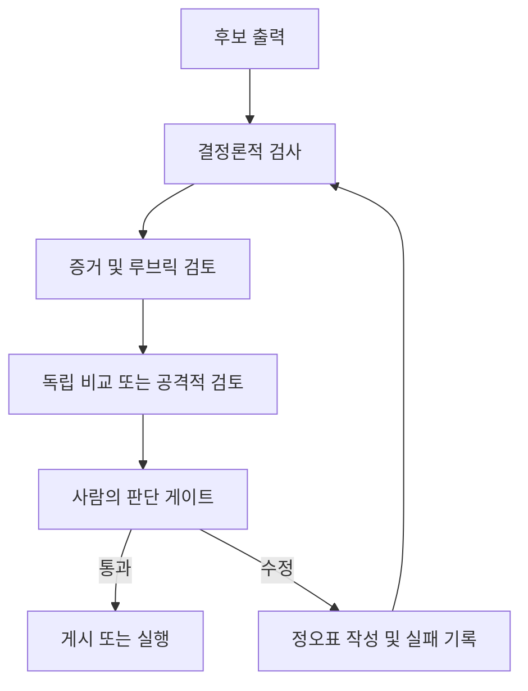

# 자신감이 아니라 주장을 검증하기

> 🇰🇷 이 문서는 한국어 번역본입니다(ELI5 스타일). 원문: [en.md](en.md)

> 유창함은 발표 품질입니다. 검증은 그 출력이 제 역할을 안전하게 해낼 수 있다는 증거입니다.

**유형:** Learn
**언어:** Python
**선수 지식:** [요청을 검증 가능한 계약으로 바꾸기](../../03-prompting-and-task-decomposition/), [모든 사실을 알맞은 종류의 컨텍스트에 넣기](../../04-context-knowledge-memory-and-caching/), [평가와 테스트](../../../../../phases/11-llm-engineering/10-evaluation/)
**시간:** 약 115분

## 학습 목표

- 정확성, 완전성, 일관성, 독자 적합성, 편향, 형식에 대한 과업별 기준을 만들 수 있다.
- 결과가 큰 주장을 권위 있는 증거까지 추적할 수 있다.
- 결정론적 검사, 루브릭 채점, 독립 검토, 사람의 판단을 조합할 수 있다.
- 환각, 누락, 모순, 범위, 인용 실패를 진단할 수 있다.
- 수리 방법을 고르기 전에 모델 능력 한계를 통해 예상 못한 출력을 진단할 수 있다.
- 프로덕션(운영 환경) 실패를 오래 쓸 수 있는 평가 사례로 바꿀 수 있다.

## 문제 상황

Claude가 고객 데이터와 내부 정책으로 주간 경영진 브리핑을 만들었습니다. 브리핑은 강렬한 서두, 간결한 권고안, 모든 섹션의 인용을 갖추고 있습니다. 경영진은 이 브리핑을 근거로 정책 변경을 승인합니다.

나중에 애널리스트가 세 가지 문제를 발견합니다. 인용 하나가 주제를 언급할 뿐 그 주장을 뒷받침하지 않는 문서를 가리킵니다. 집계 과정에서 작은 고객 세그먼트 하나가 사라졌습니다. 권고안 하나는 팀의 권한을 넘었습니다.

문서는 인용도 있고 전문적인 어조도 있어서 검증된 것처럼 보였습니다. 하지만 아무도 커버리지, 함의(entailment), 실행 범위를 테스트하지 않았습니다.

이것이 출력 평가가 Claude Certified Associate 블루프린트에서 가장 큰 도메인인 이유입니다. 쓸모 있는 Claude 워크플로는 텍스트가 나타났을 때 끝나는 게 아니라, 결과가 그 결과가 미치는 영향에 비례하는 검사를 통과했을 때 끝납니다.

## 개념

### 출력의 역할에서 출발합니다

평가 기준은 출력이 지원하는 결정을 따라가야 합니다. 브레인스토밍 목록과 규제 제출 서류는 서로 다른 증거와 검토가 필요합니다.

여섯 차원을 출발점으로 사용하세요.

1. **정확성:** 사실 주장이 뒷받침되고 계산이 올바른가?
2. **완전성:** 필요한 항목, 대상 집단, 예외, 주의 사항이 있는가?
3. **일관성:** 섹션, 숫자, 레이블, 권고안이 서로 일치하는가?
4. **독자 적합성:** 의도된 독자가 이해하고 행동에 옮길 수 있는가?
5. **공정성과 안전:** 출력이 근거 없는 편향을 만들거나, 데이터를 노출하거나, 정책을 넘지 않는가?
6. **형식 준수:** 사람과 시스템이 요구하는 구조적 요건을 만족하는가?

이것은 범주이지 점수가 아닙니다. 관측 가능한 테스트로 바꾸세요.

약한 기준:

```text
보고서는 정확하고 완전하다.
```

테스트 가능한 기준:

```text
모든 정량 주장은 제공된 데이터셋과 대사(reconcile)되어야 한다.
모든 권고안은 뒷받침 발견 사항 하나와 지배 제약 하나 이상을 인용해야 한다.
일곱 운영 지역이 모두 나타나거나 "데이터 없음"으로 표시되어야 한다.
요약은 가장 큰 불확실성 두 가지를 명시해야 한다.
```

### 주장을 증거까지 추적합니다

인용은 포인터일 뿐입니다. 검증이 묻는 것은 가리킨 증거가 그 주장 그 자체를 뒷받침하는가입니다.

주장-증거 매트릭스를 만드세요.

| 주장 ID | 주장 | 출처 | 지원 유형 | 권위 | 검토자 판정 |
|---|---|---|---|---|---|
| C-01 | 북부 지역 반품이 증가했다 | 데이터셋 120-184행 | 직접 계산 | 1차 데이터 | 통과 |
| C-02 | 교육이 그 변화를 일으켰다 | 인터뷰 메모 7 | 추측 | 일화 | 실패 |
| C-03 | 환불에는 승인이 필요하다 | 정책 4.2 | 직접 인용 | 승인된 정책 | 통과 |

이 매트릭스는 흔한 네 가지 질문을 분리합니다.

- 출처가 존재하는가?
- 이 주장에 대해 권위가 있는가?
- 주제를 논의하기만 하는 것이 아니라 주장을 함의하는가?
- 주장이 증거보다 더 강하지 않은가?

보고서는 올바른 인용을 담고 있으면서도 인과를 과장할 수 있습니다. "그 이후에 발생했다"는 "그 때문에 발생했다"를 증명하지 않습니다.

### 다시 시도하기 전에 성질부터 진단합니다

"예상 못한 출력"은 유용한 진단이 아닙니다. 일반적인 재시도는 원인을 그대로 두기 때문에 같은 실패를 재현할 때가 많습니다.

Anthropic의 입문 능력 강좌는 진단을 네 가지 모델 성질 중심으로 정리합니다. 네 개의 고립된 라벨이 아니라 실용적인 고장 나무(fault tree)로 사용하세요.

| 성질 | 실패 신호 | 표적화된 대응 |
|---|---|---|
| 다음 토큰 예측 | 답이 유창하고 그럴듯하지만 근거가 없음 | 결과가 큰 주장을 제공된 증거에 뿌리내리게 하고, 보류를 요구하며, 함의를 검증 |
| 지식 | 과업이 최신·희귀·비공개·논쟁적 사실에 의존 | 파라메트릭 회상에 의존하는 대신 최신 권위 출처를 추가하고 불확실성을 드러냄 |
| 작업 메모리 | 중요한 컨텍스트가 묻히거나 현재 세션에 없거나 너무 많은 자료와 경쟁 | 관련 컨텍스트만 검색하고, 과업을 나누고, 상태를 요약하며, 커버리지를 검증 |
| 조종 가능성(Steerability) | 지시문이 모호하거나, 상충하거나, 지나치게 길거나, 검증 불가능 | 요청을 우선순위·예시·제약·합격 테스트를 갖춘 간결한 계약으로 다시 작성 |

여러 성질이 함께 실패할 수 있습니다. 긴 정책 질문은 유용한 작업 메모리를 초과하면서 동시에 모델 지식 밖의 사실을 요구할 수 있습니다. 주 성질 하나, 기여하는 성질, 그 진단의 증거, 그리고 각 원인을 겨냥한 수리 방법을 기록하세요.

선택 과목인 AI Fluency 4D 검사는 같은 판단의 사람 쪽 면을 더합니다.

- **위임(Delegation):** 어떤 작업을 위임하고 어떤 판단을 사람에게 남길지 결정한다.
- **기술(Description):** 시스템에 필요한 컨텍스트, 목표, 제약, 성공 기준을 공급한다.
- **판별(Discernment):** 결과가 정확하고 유용하며 적절한지 평가한다.
- **성실(Diligence):** 워크플로 전반에 개인정보 보호, 출처 표기, 정책, 책임 소재를 적용한다.

이 검사들은 과업별 평가를 대체하지 않습니다. 모든 실패를 "프롬프트가 나빠서"로 몰지 않고 올바른 평가자와 수리 방법을 고르는 데 도움을 줍니다.

### 계층화된 검증을 사용합니다

단 하나의 평가자로는 충분하지 않습니다. 계층을 조합하세요.



**결정론적 검사**는 코드나 정확한 규칙입니다. 스키마 유효성, 필수 필드, 행 합계, 범위, 인용 ID 존재 여부, 금지 용어, 권한 플래그에 사용하세요.

**루브릭 검토**는 해석이 필요한 품질을 다룹니다. 예를 들어 요약이 핵심 예외를 보존했는지 같은 것들이죠. 모델이 루브릭으로 채점할 수 있지만, 채점자 자체도 테스트가 필요합니다.

**독립 또는 공격적 검토**는 별도의 패스를 시켜 근거 없는 주장, 누락된 집단, 충돌, 안전하지 않은 권고안을 찾게 합니다. 독립성이 핵심입니다. 생성한 시스템 자신에게 "너 맞아?"라고 물으면 같은 맹점이 겹쳐 보입니다.

**사람 검토**는 결과, 모호한 트레이드오프, 조직 권한을 책임집니다. 사람이 모든 기계적 검사를 반복해서는 안 됩니다. 사람은 증거, 불확실성, 실패한 검사, 판단이 필요한 결정을 받아야 합니다.

### 평가자를 성질에 맞춥니다

각 성질마다 가장 싼 신뢰 가능한 평가자를 사용하세요.

| 성질 | 강한 첫 평가자 |
|---|---|
| 유효한 JSON | 파서 또는 스키마 검증기 |
| 산술 합계 | 결정론적 계산 |
| 정확한 필수 필드 | 프로그래밍적 어설션 |
| 의미 보존 | 루브릭 기반 비교 |
| 구절이 주장을 뒷받침 | 인용 구절을 붙인 증거 검토 |
| 적절한 경영진 어조 | 사람 또는 테스트된 루브릭 채점자 |
| 고영향 공정성 결정 | 정책을 갖춘 자격 있는 사람 검토 |

코드가 정확히 판정할 수 있는 것을 LLM에게 판단하게 하지 마세요. 맥락에 의존하는 윤리적 트레이드오프를 코드에게 결정하게 하지도 마세요.

### 환각은 하나의 실패가 아닙니다

고치기 전에 결함을 분류하세요.

- **날조(Fabrication):** 사실이나 출처를 지어냈다.
- **잘못된 귀속(Misattribution):** 실제 주장을 잘못된 출처에 배정했다.
- **과잉 확장(Overreach):** 결론이 증거보다 강하다.
- **누락(Omission):** 필요한 사실, 세그먼트, 예외가 없다.
- **모순(Contradiction):** 출력의 두 부분이 동시에 참일 수 없다.
- **범위 위반(Scope violation):** 응답이 요청이나 권한을 넘어 답했다.
- **시효 만료(Staleness):** 한때 유효했던 사실이 더는 현재 것이 아니다.
- **형식 실패(Format failure):** 콘텐츠를 다음 시스템이 소비할 수 없다.

결함마다 필요한 수리가 다릅니다. 날조에는 제한된 출처와 보류가 필요할 수 있습니다. 누락에는 커버리지 체크리스트가 필요할 수 있습니다. 모순에는 대사(reconciliation) 패스가 필요할 수 있습니다. 형식 실패에는 구조화된 출력과 파서 검증이 필요할 수 있습니다.

### 평가 세트는 위험을 대표합니다

쓸모 있는 평가 세트에는 정상 사례보다 더 많은 것이 들어갑니다. 포함하세요.

- 흔한 대표 과업.
- 중요한 경계 사례.
- 과거에 관찰된 실패.
- 빠진 증거와 충돌하는 증거.
- 출처 텍스트 안에 숨은 공격적 지시문.
- 개인정보, 공정성, 무단 행동이 걸린 사례.
- 길이와 형식 한계에 가까운 입력.

위험 그룹별로 성과를 추적하세요. 전체 평균 95퍼센트가 가장 중요한 사례의 40퍼센트 통과율을 숨길 수 있습니다.

주요 프롬프트나 모델 변경용으로 별도의 보류 세트(held-out set)를 유지하세요. 모든 사례에 맞춰 계속 튜닝하면 워크플로가 일반화 없이 시험 모양만 외울 수 있습니다.

### 브랜드 편향 없이 출력을 비교합니다

프롬프트나 모델 변형을 비교할 때:

1. 같은 사례와 기준을 사용한다.
2. 실질적으로 가능하면 어떤 시스템이 무엇을 만들었는지 숨긴다.
3. 표시 순서를 무작위로 섞는다.
4. 전체 선호 전에 개별 차원을 점수 매긴다.
5. 검토자 간 불일치를 조사한다.
6. 불안정성을 관찰할 만큼 충분히 재실행한다.

선호하는 출력 하나는 일화입니다. 배포 결정에는 대표적인 위험에 걸친 결과의 분포가 필요합니다.

## 만들어 보기

### 단계 1: 출시 게이트 정의하기

게이트를 세 수준으로 쓰세요.

```text
차단(Blocker): 근거 없는 고영향 주장, 제한 데이터 노출, 무효한 합계
필수(Required): 모든 지역 커버, 인용 해석 가능, 권고안이 권한 내
품질(Quality): 간결한 요약, 읽기 쉬운 제목, 최소 반복
```

차단 결함은 게시를 막습니다. 품질 문제는 정책에 따라 수리 티켓과 함께 게시를 허용할 수 있습니다. 이렇게 하면 외형 취향이 안전 실패와 경쟁하지 않게 됩니다.

### 단계 2: 검증 기록 만들기

각 실행마다 기록하세요.

```json
{
  "workflow_version": "brief-v3",
  "source_snapshot": "2026-W31",
  "checks": {
    "schema": "pass",
    "totals_reconcile": "pass",
    "claim_support": "fail",
    "privacy": "pass"
  },
  "failed_claims": ["C-08"],
  "uncertainties": ["West region sample incomplete"],
  "reviewer_decision": "revise"
}
```

값은 예시입니다. 프로덕션에서는 검증 로그에 보존 및 개인정보 정책을 적용하세요.

예상 못한 결과에는 짧은 진단을 붙이세요.

```json
{
  "primaryProperty": "knowledge",
  "contributingProperties": ["next-token-prediction"],
  "evidence": "The cited policy was published after the model's supplied source snapshot.",
  "targetedFix": "Retrieve the approved current policy and rerun claim-support checks.",
  "humanCompetency": "discernment"
}
```

라벨만으로는 쓸모가 없습니다. 증거와 표적화된 수리가 있어야 진단이 테스트 가능해집니다.

### 단계 3: 생성과 검토를 분리합니다

검토자에게 초안, 기준, 출처 증거를 주세요. 조용히 다시 쓸 권한은 주지 마세요.

```text
발견 사항마다 한 행씩 반환한다:
claim_id | severity | evidence | criterion | proposed correction

제공된 출처가 주장을 뒷받침하지 않으면 unsupported로 표시한다.
대체 증거를 지어내지 않는다.
```

이러면 생성자는 명시적인 발견 사항 목록을 보고 수정할 수 있습니다. 감사 추적을 위해 원본 발견 사항과 수정본을 모두 남기세요.

### 단계 4: 채점자 보정하기

통과, 경계, 실패 출력의 예시를 만들고 자격 있는 검토자에게 라벨링하게 하세요. 자동 채점자의 판정을 사람 기준과 비교하세요.

거짓 통과부터 검사하세요. 나쁜 출력을 내보내기 때문입니다. 그다음 거짓 실패를 검사하세요. 검토 역량을 낭비하기 때문입니다. 사람의 판단이 정당하게 갈리는 지점은 기록하세요. 거짓된 합의를 강요하지 마세요.

### 단계 5: 루프 닫기

모든 중대한 프로덕션 실패는 최소 하나의 오래 남는 산출물을 만들어야 합니다.

- 새 평가 사례.
- 더 날카로운 기준.
- 결정론적 검사.
- 출처 관리 수리.
- 프롬프트 또는 워크플로 변경.
- 모니터링 신호 또는 에스컬레이션 규칙.

개별 보고서만 고치지 마세요. 그 보고서를 통과시킨 시스템을 개선하세요.

## 인터랙티브 랩

문서·비전 파이프라인을 사용해 입력 증거에서 추출된 필드, 주장, 검증 발견 사항, 출시 결정까지 각 변환을 살펴보세요. 실패한 시각 추출이나 근거 없는 주장을 켜고 어느 게이트가 출시를 막아야 하는지 관찰하세요.

```figure
05-document-vision-pipeline
```

## 연습 랩

작성 완료된 주장 매트릭스로 출시 채점기를 실행하세요. 차단 결정을 게시로 바꾸거나, 주장을 없는 출처로 가리키게 하거나, 정확한 합계를 모델 판단자에게 배정하거나, 예상 못한 출력 진단에서 능력 성질 하나를 빼서 출시 검증이 실패하는지 확인해 보세요.

## 산출물

`outputs/claim-validation-record.json`은 주장-증거 매트릭스, 네 성질 능력 진단, 출시 게이트, 평가자 배정, 불확실성, 최종 `revise` 결정을 담은 검토 패킷입니다. 차단 경로가 보이도록 의도적으로 실패하는 인과 주장을 하나 포함하고 있습니다.

## 검증하기

결정론적 검사를 실행하세요:

```bash
cd certifications/claude/lessons/05-output-evaluation-and-validation/code
python3 main.py
python3 -m unittest discover tests -v
```

검증기는 주장 ID의 고유성, 모든 출처 참조의 해석 가능성, 능력 진단에 네 성질과 표적화된 수리가 모두 있는지, 정확한 성질에 결정론적 평가자가 배정되는지, 차단 실패가 게시 결정을 만들 수 없는지 증명합니다.

## 캡스톤 연결

퀴즈는 함의, 평가자 선택, 슬라이스 실패, 회귀 학습을 확인합니다. 이 패킷을 캡스톤 29~32의 검증 및 검토자 증거로 사용하세요.

## 활용하기

### 시험 판단 패턴

출력 품질을 어떻게 개선할지 묻는다면:

1. 출력의 목적과 영향을 정의한다.
2. 명시적이고 과업별인 기준을 고른다.
3. 정확한 성질에는 정확한 검사를 쓴다.
4. 중요한 주장을 권위 있는 증거까지 추적한다.
5. 모호하거나 고영향인 경우에는 독립 검토와 사람 검토를 유지한다.
6. 관찰된 실패를 평가 세트로 되돌려 넣는다.

### 흔한 함정

- **유창함을 정확성으로:** 매끄러운 답이 틀릴 수 있습니다.
- **인용 존재를 뒷받침으로:** 링크가 주장을 함의하지 않을 수 있습니다.
- **단일 종합 점수:** 핵심 위험 세그먼트가 평균 속에 사라집니다.
- **자기 검토만:** 생성자와 검토자가 가정과 누락을 공유합니다.
- **정확한 산술에 LLM:** 결정론적 검사가 더 싸고 신뢰할 수 있습니다.
- **패킷 없는 사람 검토:** 검토자가 문장만 받고 주장, 증거, 실패한 검사는 받지 못합니다.
- **행복 경로만 테스트:** 빠진, 충돌하는, 낡은, 공격적인 입력이 계속 안 보입니다.
- **증상만 수리:** 보고서는 고쳐지지만 실패 사례가 테스트 스위트에 들어가지 않습니다.

### 연습 문제

1. 주관적 품질 목표 다섯 개를 관측 가능한 기준으로 바꿔 보세요.
2. 한 페이지 보고서의 주장-증거 매트릭스를 만들고 과잉 확장을 표시하세요.
3. 열 개 검사에 결정론적, 루브릭, 독립, 사람 평가자를 배정하세요.
4. 정상 네 개, 경계 세 개, 고위험 세 개 사례로 평가 세트를 만드세요.
5. 출력 두 개를 블라인드 비교하고 검토자가 의견이 갈리는 지점을 기록하세요.

## 핵심 용어

- **함의(Entailment):** 증거가 진술된 주장을 실제로 뒷받침하는지 여부.
- **평가 세트(Evaluation set):** 동작을 측정하는 데 쓰는 대표적이고 위험 중심적인 사례 모음.
- **결정론적 검사(Deterministic check):** 정확한 기대 성질을 가진 반복 가능한 프로그래밍 테스트.
- **루브릭 채점자(Rubric grader):** 정의된 정성 기준을 적용하는 사람 또는 모델 평가자.
- **독립 검토(Independent review):** 생성자의 자기 판단에 의존하지 않는 별도 평가 패스.
- **출시 게이트(Release gate):** 출력이 게시되거나 실행되기 전에 통과해야 하는 조건.
- **거짓 통과(False pass):** 유효하지 않은 출력을 평가자가 잘못 수용한 것.
- **회귀(Regression):** 이전에 통과하던 동작이 변경 후 실패하는 것.

## 더 읽을거리

- [Anthropic: 성공 기준 정의와 평가 만들기](https://platform.claude.com/docs/en/test-and-evaluate/develop-tests)
- [Anthropic: 평가 도구](https://platform.claude.com/docs/en/test-and-evaluate/eval-tool)
- [Anthropic: 환각 줄이기](https://platform.claude.com/docs/en/test-and-evaluate/strengthen-guardrails/reduce-hallucinations)
- [Anthropic Academy: AI 능력과 한계](https://anthropic.skilljar.com/ai-capabilities-and-limitations)
- [Anthropic Academy: AI Fluency 프레임워크와 기초](https://anthropic.skilljar.com/ai-fluency-framework-foundations)
- [AI Engineering from Scratch: 고급 RAG와 평가](../../../../../phases/11-llm-engineering/07-advanced-rag/)
- [AI Engineering from Scratch: 검토자 에이전트](../../../../../phases/14-agent-engineering/39-reviewer-agent/)
- [AI Engineering from Scratch: 공정성 기준](../../../../../phases/18-ethics-safety-alignment/21-fairness-criteria-group-individual-counterfactual/)

평가 도구, 모델 동작, 제품 인터페이스는 바뀔 수 있습니다. 위 공식 참고 자료는 2026-08-08에 확인했습니다. 모델, 프롬프트, 출처, 도구, 워크플로 정책이 바뀔 때마다 채점자와 임계값을 재검증하세요.
