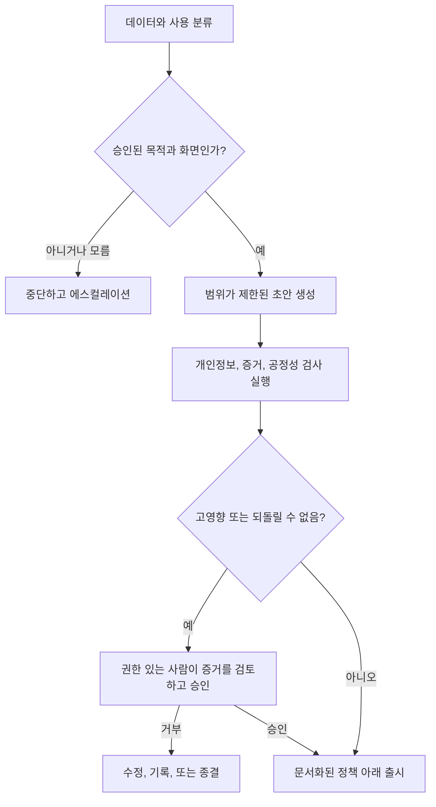

# 능력 주위에 권한을 두기

> 🇰🇷 이 문서는 한국어 번역본입니다(ELI5 스타일). 원문: [en.md](en.md)

> 모델은 데이터를 볼 권한도, 결정을 내릴 권한도, 행동을 할 권한도 없이 답을 만들어 낼 수 있습니다.

**유형:** Learn
**언어:** Python
**선수 지식:** [모든 사실을 알맞은 종류의 컨텍스트에 넣기](../../04-context-knowledge-memory-and-caching/), [자신감이 아니라 주장을 검증하기](../../05-output-evaluation-and-validation/), [가드레일](../../../../../phases/11-llm-engineering/12-guardrails/)
**시간:** 약 110분

## 학습 목표

- Claude 화면이나 워크플로를 고르기 전에 정보와 사용 사례를 분류할 수 있다.
- 기술적 능력과 조직적 허가, 인간의 권한을 분리할 수 있다.
- 개인정보 보호, 보안, 편향, 투명성, 보존, 오남용에 대한 통제를 설계할 수 있다.
- 영향, 되돌릴 수 있는지 여부, 모호성에 따라 사람 검토를 배치할 수 있다.
- 안전하지 않거나 규정을 준수하지 않는 동작을 위한 사고 대응과 에스컬레이션 경로를 만들 수 있다.

## 문제 상황

고객 성공 매니저가 계정 검토를 더 빨리 하고 싶어합니다. 지원 통화 녹취록, 계약서 발췌, 갱신 메모를 승인받지 않은 개인 AI 계정에 붙여 넣습니다. Claude가 유용한 요약을 해 주니, 매니저는 고객을 갱신 위험 순으로 나열하고 특별 제안을 자동 발송하게 만듭니다.

이 워크플로는 출력 품질을 논하기도 전에 여러 지점에서 실패합니다.

- 녹취록에는 개인 정보와 상업적으로 민감한 데이터가 들어 있습니다.
- 어떤 제품 약관과 보존 통제가 적용되는지 아무도 확인하지 않았습니다.
- 순위 매기기가 고객 그룹 간 불공평한 대우를 만들 수 있습니다.
- 매니저에게 할인을 자동 승인할 권한이 없습니다.
- 출처, 검토, 발송 메시지의 기록이 없습니다.

프롬프트에 "개인정보를 보호해 줘"를 추가하는 것은 시스템을 수리하지 못합니다. 거버넌스는 누가, 어떤 데이터를, 어떤 목적으로, 어떤 화면에서, 어떤 통제 아래 사용할 수 있고, 누가 책임지는지를 정의합니다.

## 개념

### 처리하기 전에 분류합니다

모델이 아니라 데이터와 결정에서 시작하세요.

간단한 조직 분류는 이럴 수 있습니다.

| 등급 | 예시 | 일반적인 통제 방향 |
|---|---|---|
| 공개(Public) | 게시된 문서 | 무결성과 출처 표기 검증 |
| 내부(Internal) | 비공개 프로세스 메모 | 승인된 계정과 접근 통제 |
| 기밀(Confidential) | 계약서, 고객 상세 정보 | 최소 필요 데이터, 엄격한 권한, 보존 검토 |
| 제한(Restricted) | 시크릿, 규제 기록, 고도로 민감한 식별자 | 금지하거나, 특별히 승인된 통제 워크플로 요구 |

이 라벨은 예시이지 보편적인 법이 아닙니다. 여러분 조직의 실제 정책과 법률 지침을 사용하세요.

사용 사례도 분류하세요. 사람 검토자를 위한 텍스트 요약은 자격 판정이나 구속력 있는 커뮤니케이션 발송과 다릅니다. 저민감도 입력도 고영향 결정을 지원할 수 있습니다.

접수 시점에 다섯 가지를 물으세요.

1. 어떤 데이터가 워크플로에 들어오는가?
2. 어떤 목적이 승인되어 있는가?
3. 누가 입력과 출력에 접근할 수 있는가?
4. 어떤 결정이나 행동이 뒤따를 수 있는가?
5. 기록을 얼마나 오래 보관할 수 있는가?

답을 하나라도 모른다면 올바른 다음 단계는 생성이 아니라 정책 확인일 수 있습니다.

### 능력, 허가, 권한은 별개입니다

Claude는 기술적으로 제안서 초안을 쓸 수 있습니다. 커넥터에 고객 기록 접근 허가가 있을 수도 있습니다. 그렇다고 워크플로가 할인을 승인하거나 메시지를 보낼 수 있는 것은 아닙니다.

세 개의 게이트를 사용하세요.

```text
능력(Capability): 시스템이 그 작업을 수행할 수 있는가?
허가(Permission): 이 신원이 필요한 데이터나 도구에 접근해도 되는가?
권한(Authority): 이 역할이 그 결정을 내리거나 실행해도 되는가?
```

세 개 모두 통과해야 합니다. 도구 권한은 최소 권한 원칙을 따라야 합니다. 워크플로에는 승인된 목적에 필요한 데이터와 행동만 주세요. 영향이 의미 있는 곳에서는 읽기, 초안 작성, 승인, 실행 역할을 분리하세요.

### 데이터와 목적을 최소화합니다

목적 제한(purpose limitation)이란 한 작업에 승인된 데이터가 다른 작업에 자동으로 승인되지 않는다는 뜻입니다. 장애 해결을 위해 수집한 지원 녹취록이 고객 프로파일링에 승인되어 있지 않을 수 있습니다.

데이터 최소화(data minimization)는 충분한 가장 작은 입력을 요구합니다.

- 신원이 필요 없으면 이름을 제거한다.
- 정확한 식별자를 범위가 제한된 참조로 바꾼다.
- 레코드 전체가 아니라 관련 구간을 검색한다.
- 시크릿이나 개인 데이터를 프롬프트나 로그에 넣지 않는다.
- 출력을 다음 단계가 필요로 하는 필드로 제한한다.

최소화는 노출, 프롬프트 크기, 의도치 않은 2차 사용을 줄여 줍니다. 하지만 승인된 화면과 문서화된 정책의 필요를 없애 주지는 않습니다.

### 제품 약관은 바뀔 수 있는 사실입니다

데이터 사용, 보존, 지역 처리, 관리자 통제, 기능 제공 여부는 소비자용 제품, 상업용 제공물, API 사용, 플랜, 설정에 따라 다를 수 있고, 언제든 바뀔 수 있습니다.

한 Claude 화면에서 얻은 가정을 다른 화면으로 옮기지 마세요. 배포 전에 다음 항목에 대해 최신 공식 약관과 조직 계약을 확인하세요.

- 제출한 데이터를 어떻게 사용할 수 있는지.
- 기본값과 설정 가능한 보존 기간.
- 삭제 동작과 법적 예외.
- 관리자 접근과 감사 기능.
- 지역 또는 데이터 소재 옵션.
- 커넥터와 제3자 데이터 처리.

확인한 출처와 날짜를 워크플로 결정 로그에 기록하세요.

### 사람 검토는 결정 경계에 둡니다

"힐먼 인 더 루프(human in the loop)"는 너무 막연합니다. 사람이 무엇을 보고, 무엇을 결정하고, 무엇을 멈출 수 있는지 정의하세요.

다음 중 하나 이상이 높은 곳에 더 강한 검토를 두세요.

- 사람, 재정, 권리, 안전, 평판에 미치는 영향.
- 행동의 되돌릴 수 없음.
- 정책이나 증거의 모호성.
- 사례의 새로움.
- 실행 후 오류를 발견하기 어려운 정도.



검토자에게는 출처 증거, 모델 출력, 불확실성, 정책 제약, 제안된 행동이 필요합니다. 승인 버튼만 있는 구조는 의례적인 감독을 만들 뿐입니다.

### 공정성에는 정의된 집단과 결과가 필요합니다

편향은 "편향되지 마"라고 요청한다고 해결되지 않습니다. 정의하세요.

- 누가 영향을 받는가?
- 어떤 결과가 배분되거나 거부되는가?
- 어떤 속성이나 대리 변수가 근거 없는 격차를 만들 수 있는가?
- 어떤 비교와 임계값을 쓸 것인가?
- 누가 그 결과를 해석할 자격이 있는가?
- 어떤 이의 제기나 정정 경로가 있는가?

합법하고 적절한 범위에서 관련 세그먼트별로 테스트하세요. 데이터 불균형과 워크플로 설계를 모두 조사하세요. 검토자가 같은 오해를 부르는 증거를 본다면 사람 검토도 같은 편향을 재현할 수 있습니다.

고용, 신용, 주거, 의료, 교육, 공공 서비스, 법적 권리에 관한 결정이라면 자격을 갖춘 정책·법률·도메인 담당자를 참여시키세요. 이 강좌는 법률 자문이 아닙니다.

### 투명성은 영향받는 사람을 위해 존재합니다

쓸모 있는 투명성은 다음을 설명합니다.

- 정책상 공개가 요구될 때, AI가 실질적으로 도왔다는 사실.
- 어떤 정보가 결과에 영향을 미쳤는지.
- 어떤 불확실성과 한계가 남아 있는지.
- 최종 결정을 누가 내렸는지.
- 정정이나 이의 제기를 어떻게 요청하는지.

막연한 투명성 요구를 채우겠다고 숨겨진 시스템 지시문, 보안 통제, 개인 데이터, 독점적 추론을 노출하지 마세요. 책임 소재를 확인하는 데 필요한 수준에서 프로세스와 증거를 설명하세요.

### 가드레일에는 다층 방어가 필요합니다

프롬프트 지시문은 한 겹일 뿐입니다. 튼튼한 워크플로에는 다음이 포함될 수 있습니다.

- 입력 분류와 접근 통제.
- 시크릿과 개인 데이터 탐지.
- 신뢰할 수 있는 출처 검색 필터.
- 도구 허용 목록과 범위가 제한된 자격 증명.
- 구조화된 출력과 결정론적 검증.
- 콘텐츠와 정책 검사.
- 결과가 큰 행동 전의 승인.
- 속도와 지출 한도.
- 적절한 보존 기간을 가진 감사 로그.
- 모니터링, 롤백, 사고 대응.

출처 콘텐츠에 악의적인 지시문이 있을 수 있다고 가정하세요. 검색된 문서는 명령이 아니라 데이터로 취급하세요. 명확히 구분 표시하고, 도구 승인은 모델 텍스트 밖에 유지하세요.

### 사고에는 준비된 경로가 필요합니다

사고란 개인정보 노출, 안전하지 않은 조언, 무단 도구 사용, 체계적 편향, 프롬프트 인젝션, 반복되는 근거 없는 출력일 수 있습니다.

출시 전에 준비하세요.

1. **탐지:** 신호와 보고 채널을 정의한다.
2. **봉쇄:** 워크플로를 일시 중지하거나, 자격 증명을 철회하거나, 행동 경로를 비활성화한다.
3. **보존:** 민감한 데이터를 퍼뜨리지 않으면서 승인된 증거를 보존한다.
4. **통지:** 조직과 법적 에스컬레이션 규칙을 따른다.
5. **수정:** 데이터, 권한, 프롬프트, 모델, 워크플로 통제를 수리한다.
6. **학습:** 재발을 막도록 평가 사례와 모니터링을 추가한다.

실제 정책과 관할권을 확인하지 않은 채 삭제, 통지 시점, 법적 결론을 약속하지 마세요.

## 만들어 보기

### 단계 1: 사용 사례 카드 작성하기

```text
목적:
데이터 등급:
영향받는 사람:
허용된 출처:
승인된 Claude 화면:
허용된 출력:
금지된 행동:
사람 결정 소유자:
보존 규칙:
사고 소유자:
```

목적, 데이터 등급, 행동 권한의 변경에는 명시적인 승인을 요구하세요.

### 단계 2: 통제 맵 만들기

각 위험을 예방, 탐지, 시정 통제에 대응시키세요.

| 위험 | 예방 | 탐지 | 시정 |
|---|---|---|---|
| 개인 데이터 노출 | 입력 최소화 및 가명 처리 | 프롬프트와 출력 스캔 | 봉쇄, 통지, 접근 교체 |
| 근거 없는 권고안 | 출처 제한 | 주장-증거 검증 | 차단 및 수정 |
| 무단 행동 | 읽기 전용 도구와 승인 | 시도된 행동 감사 | 자격 증명 철회 및 조사 |
| 불공평한 대우 | 기준과 대표 테스트 정의 | 세그먼트 평가 | 데이터, 정책, 워크플로 재설계 |

하나의 통제가 실패 경로 전체를 커버하는 경우는 드뭅니다.

### 단계 3: 승인 패킷 설계하기

검토자는 다음을 받아야 합니다.

- 제안된 결정이나 행동.
- 지지하는 증거와 충돌하는 증거.
- 데이터와 정책 분류.
- 자동 검사 결과.
- 알려진 불확실성.
- 되돌릴 수 있는지 여부와 영향받는 집단.
- 명시적인 승인, 수정, 거부, 에스컬레이션 옵션.

사람의 결정은 모델 권고와 별도로 추적하세요.

### 단계 4: 위협 워크숍 실행하기

최소한 다음 사례를 테스트하세요.

- 제한 등급 데이터가 뜻밖에 나타난다.
- 연결된 문서에 정책을 무시하라는 지시문이 들어 있다.
- 사용자가 승인 범위 밖의 목적을 요청한다.
- 모델이 역할 권한을 넘는 행동을 제안한다.
- 평가 결과 영향받는 세그먼트에서 격차가 나타난다.
- 제3자 커넥터가 사용 불가가 되거나 동작이 바뀐다.

어느 통제가 문제를 탐지하고 다음에 누가 행동하는지 기록하세요.

## 인터랙티브 랩

신뢰도-위험 피규어에서 증거 신뢰도, 영향, 되돌릴 수 있는지 여부, 영향받는 집단을 바꿔 보세요. 이 상호작용은 권한이나 영향이 크면 신뢰도 높은 출력이라도 검토가 필요할 수 있음을 보여 줍니다.

```figure
06-data-analysis-confidence
```

## 연습 랩

거버넌스 채점기를 실행하세요. 분석 신뢰도를 1.0으로 올리거나, 사람 게이트를 제거하거나, 신뢰할 수 없는 콘텐츠가 변경(mutate)을 승인하게 해 보세요. 신뢰도는 결코 권한이나 영향 통제를 대체하지 못한다는 결과가 나와야 합니다.

## 산출물

`outputs/responsible-use-control-map.json`은 고객 갱신 지원용으로 작성 완료된 거버넌스 패킷입니다. 승인된 목적, 데이터 등급, 금지된 행동, 예방·탐지·시정 통제, 사람 승인 패킷, 사고 소유자가 포함되어 있습니다.

## 검증하기

통제를 검증하세요:

```bash
cd certifications/claude/lessons/06-governance-safety-and-responsible-use/code
python3 main.py
python3 -m unittest discover tests -v
```

검증기는 빠진 통제 계층, 소유자 없는 사고, 권한 있는 사람 게이트 없는 고영향 행동, 그리고 신뢰할 수 없는 콘텐츠가 변경을 승인하게 만드는 설계를 거부합니다.

## 캡스톤 연결

퀴즈는 능력 대 권한, 최소화, 화면별 약관, 검토 품질, 인젝션 경계, 공정성 대응을 확인합니다. 이 패킷을 어소시에이트 캡스톤 29와 프로페셔널 아키텍트 캡스톤 32의 거버넌스 및 승인 증거로 가져가세요.

## 활용하기

### 시험 판단 패턴

거버넌스 시나리오에서는:

1. 데이터, 목적, 영향을 분류한다.
2. 최신 승인된 제품 약관과 조직 정책을 확인한다.
3. 입력과 권한을 최소화한다.
4. 생성 권한과 결정·실행 권한을 분리한다.
5. 고영향 또는 되돌릴 수 없는 행동 전에 의미 있는 사람 게이트를 둔다.
6. 증거 보존, 감사 가능성, 이의 제기, 사고 대응을 유지한다.

### 흔한 함정

- **프롬프트만 있는 거버넌스:** 문장 한 줄이 접근이나 보존을 강제할 수 없습니다.
- **기술적 접근을 권한으로:** 커넥터 허가가 비즈니스 승인으로 오인됩니다.
- **모든 화면에 하나의 개인정보 규칙:** 제품과 계약 동작은 다릅니다.
- **일단 수집, 용도는 나중에:** 2차 목적에는 승인이 없습니다.
- **고무도장 사람 검토:** 검토자에게 증거나 거부 권한이 없습니다.
- **지시문으로 하는 공정성:** 집단, 측정, 이의 제기 경로가 정의되지 않습니다.
- **최대 로깅:** 감사 데이터가 새로운 개인정보·보안 위험을 만듭니다.
- **컴플라이언스 확신:** 워크플로가 자격 있는 검토 없이 법적 주장을 합니다.

### 연습 문제

1. 여러분 조직의 워크플로 세 개에서 데이터와 행동을 분류하세요.
2. Claude 보조 프로세스 하나의 사용 사례 카드를 만드세요.
3. 예방, 탐지, 시정 통제를 갖춘 통제 맵을 만드세요.
4. 포괄적인 커넥터 권한을 최소 권한으로 다시 설계하세요.
5. 고영향 권고안의 승인 패킷을 작성하세요.
6. 사고를 테이블톱 연습으로 진행하고 첫 봉쇄 행동을 찾으세요.

## 핵심 용어

- **목적 제한(Purpose limitation):** 승인된 목적에만 데이터를 사용하는 것.
- **데이터 최소화(Data minimization):** 그 목적에 필요한 정보만 처리하는 것.
- **최소 권한(Least privilege):** 필요한 가장 작은 접근과 행동 범위만 부여하는 것.
- **사람 결정 게이트(Human decision gate):** 권한 있는 사람이 검사하고, 거부하고, 수정하고, 승인할 수 있는 정의된 지점.
- **다층 방어(Defense in depth):** 실패 경로에 걸쳐 여러 통제를 두는 것.
- **프롬프트 인젝션(Prompt injection):** 모델이나 도구 동작을 바꾸려 시도하는 신뢰할 수 없는 콘텐츠.
- **이의 제기 경로(Appeal path):** 영향받는 사람이 결과에 이의를 제기하거나 정정을 요청하는 절차.
- **사고 대응(Incident response):** 준비된 탐지, 봉쇄, 통지, 수정, 학습 행동.

## 더 읽을거리

- [Anthropic: API와 데이터 보존](https://platform.claude.com/docs/en/manage-claude/api-and-data-retention)
- [Anthropic 프라이버시 센터](https://privacy.anthropic.com/)
- [Anthropic 트러스트 센터](https://trust.anthropic.com/)
- [Anthropic: 책임 있는 확장 정책](https://www.anthropic.com/responsible-scaling-policy)
- [Anthropic: 프롬프트 누출 줄이기](https://platform.claude.com/docs/en/test-and-evaluate/strengthen-guardrails/reduce-prompt-leak)
- [AI Engineering from Scratch: 보안, 시크릿, 감사](../../../../../phases/17-infrastructure-and-production/25-security-secrets-audit/)
- [AI Engineering from Scratch: 컴플라이언스 프레임워크](../../../../../phases/17-infrastructure-and-production/26-compliance-frameworks/)
- [AI Engineering from Scratch: 공정성 기준](../../../../../phases/18-ethics-safety-alignment/21-fairness-criteria-group-individual-counterfactual/)

개인정보 보호, 보존, 관리자 통제, 제품 약관, 규제 의무는 바뀌며 화면, 플랜, 계약, 위치, 설정에 따라 다를 수 있습니다. 위 공식 자료는 2026-08-08에 확인했습니다. 민감한 데이터를 처리하거나 결과가 큰 결정을 자동화하기 전에 최신 약관을 확인하고 자격 있는 조직 내 지침을 받으세요.
