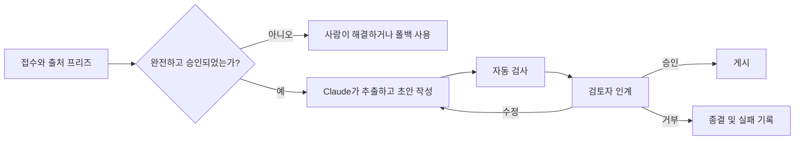

# 자동화보다 인계 설계가 먼저입니다

> 🇰🇷 이 문서는 한국어 번역본입니다(ELI5 스타일). 원문: [en.md](en.md)

> Claude가 작업을 끝냈을 때 워크플로가 완성된 게 아닙니다. 다음 담당자가 검증하고, 결정하고, 행동하고, 복구할 수 있을 때 완성됩니다.

**유형:** Learn
**언어:** Python
**선수 지식:** [자신감이 아니라 주장을 검증하기](../../05-output-evaluation-and-validation/), [능력 주위에 권한을 두기](../../06-governance-safety-and-responsible-use/), [Anthropic 워크플로 패턴](../../../../../phases/14-agent-engineering/12-anthropic-workflow-patterns/)
**시간:** 약 105분

## 학습 목표

- Claude가 어디에 참여할지 정하기 전에 현재 워크플로를 매핑할 수 있다.
- 워크플로 단계를 보조, 자동화, 재설계, 거부 중 무엇으로 할지 결정할 수 있다.
- 단계별 입력, 출력, 소유자, 게이트, 폴백, 서비스 기대치를 명세할 수 있다.
- 증거, 불확실성, 권한을 보존하는 사람 인계 패킷을 만들 수 있다.
- 검토, 실패, 유지보수 비용을 놓치지 않고 워크플로 가치를 측정할 수 있다.

## 문제 상황

한 제품 팀이 주간 출시 브리핑을 자동화했습니다. Claude가 이슈 요약을 읽고 브리핑을 작성해 매주 금요일 공유 채널에 올립니다.

첫 두 브리핑은 시간을 절약해 줍니다. 세 번째에는 범위에서 제외된 기능이 포함되고, 네 번째는 해결되지 않은 보안 우려를 빠뜨립니다. 예전에 브리핑을 모으던 엔지니어는 이제 검토를 제품 매니저가 맡는다고 생각하고, 제품 매니저는 자동 게시물이 이미 승인된 줄 압니다.

팀은 텍스트 생산은 자동화했지만 소유권 모델을 삭제했습니다. 출처 시점(cutoff)도, 승인 게이트도, 에스컬레이션 경로도, 데이터가 불완전할 때의 폴백도 없습니다.

성공적인 워크플로는 모델 호출의 사슬이 아닙니다. 명시적인 증거와 복구 가능한 상태를 갖춘 책임의 사슬입니다.

## 개념

### 현재 상태를 먼저 매핑합니다

Claude를 넣기 전에 일이 실제로 어떻게 움직이는지 관찰하세요.

- 어떤 이벤트가 시작하는가?
- 각 입력을 누가 공급하는가?
- 어느 시스템이 공식 출처인가?
- 사람들이 어디서 판단을 쓰는가?
- 어떤 예외가 시간을 가장 많이 잡아먹는가?
- 누가 결과를 승인하는가?
- 그다음 어떤 외부 행동이 뒤따르는가?
- 실패는 어떻게 탐지하고 복구하는가?

이상적인 프로세스만 문서화하지 마세요. 실제 사례 몇 개를 따라가 보세요. 비공식적인 확인 절차에 핵심 지식이 숨어 있는 경우가 많습니다. 그것을 규칙으로 인코딩하거나 담당자를 정하지 않고 없애면, 새 워크플로는 효율적으로 보이지만 품질은 떨어집니다.

### 도구가 아니라 개입 방식을 고릅니다

각 단계마다 네 가지 개입 방식 중에서 고르세요.

1. **보조(Assist):** Claude가 제안, 요약, 추출, 초안 작성을 하되 사람이 계속 조작자로 남는다.
2. **자동화(Automate):** 시스템이 정책 아래에서 범위가 제한되고 충분히 테스트된 되돌릴 수 있는 단계를 수행한다.
3. **재설계(Redesign):** 현재 단계 자체가 나쁜 입력이나 중복 시스템이 만든 낭비이므로 제거하거나 재구성한다.
4. **거부(Reject):** 데이터, 영향, 모호성, 정책 때문에 위험이 감당할 수 없어 그 단계에는 Claude를 쓰지 않는다.

자동화가 항상 최고 성숙도는 아닙니다. 애널리스트가 서로 충돌하는 스프레드시트 두 개를 맞추는 데 몇 시간을 쓴다면, 대사(reconciliation) 문장을 더 빨리 생성하는 것은 출처 충돌을 해결하지 못합니다.

### 모든 단계를 계약으로 명세합니다

각 단계는 다음을 가져야 합니다.

```text
트리거:
소유자:
허용된 입력과 출처:
변환 작업:
출력 스키마:
합격 기준:
타임아웃 또는 서비스 기대치:
에스컬레이션 조건:
폴백:
다음 소유자:
```

계약이 있으면 단계를 독립적으로 테스트할 수 있고, 책임이 시스템 사이에서 흩어져 사라지는 것을 막을 수 있습니다.

출시 브리핑 추출 단계의 예입니다.

```text
Trigger: Thursday 15:00 source freeze
Owner: release coordinator
Inputs: approved tracker view and signed security status
Output: structured candidate items with source IDs and status
Pass: all required teams represented; unresolved fields marked
Escalate: missing security status or conflicting launch state
Fallback: coordinator uses the manual template
Next owner: product manager validates inclusion decisions
```

### 영향과 되돌릴 수 있는지로 통제 위치를 정합니다

두 질문이 자동화 깊이를 결정합니다.

1. 결과가 틀리면 그 결과는 얼마나 심각한가?
2. 피해가 생기기 전에 행동을 싼 비용으로 되돌릴 수 있는가?

| 영향 | 되돌릴 수 있음 | 설계 방향 |
|---|---|---|
| 낮음 | 예 | 모니터링을 곁들인 제한적 자동화가 맞을 수 있음 |
| 높음 | 예 | 생성 또는 스테이징 후, 출시 전에 검토 요구 |
| 낮음 | 아니오 | 확인 절차, 감사, 좁은 범위 추가 |
| 높음 | 아니오 | 권한 있는 사람 결정 게이트와 강한 폴백 유지 |

검토를 위해 저장된 초안과 수천 명의 고객에게 보내진 메시지는 다릅니다. 행동 권한은 별개의 능력으로 취급하세요.

### 의존 관계에 맞는 워크플로 패턴을 고릅니다

Claude 워크플로는 소수의 패턴을 주로 씁니다.

- **프롬프트 체이닝:** 각 단계를 검사할 수 있는 고정된 순서.
- **라우팅:** 작업을 분류해 전문 경로로 보냄.
- **병렬화:** 독립적인 분석을 실행하고 결과를 대사함.
- **오케스트레이터-워커:** 조율자가 가변적인 작업을 하위 작업으로 나누고 종합함.
- **평가자-최적화기:** 생성하고, 기준에 비춰 검토하고, 게이트나 한계에 도달할 때까지 수정함.

작업을 대표하는 가장 단순한 패턴을 선호하세요. 고정된 5단계 보고서에 개방형 에이전트는 필요 없습니다. 라우팅 워크플로에는 관측 가능한 라우팅 신호와 애매한 사례용 폴백이 필요합니다.



### 인계는 제품입니다

인계는 재발견(다시 알아내기)을 최소화해야 합니다. 다음 소유자에게 주세요.

- 필요한 결정과 마감.
- 워크플로의 범위와 버전.
- 출처 ID와 최신성 상태.
- 후보 출력.
- 통과한 검사와 실패한 검사.
- 알려진 불확실성과 충돌.
- 이미 수행된 행동.
- 옵션: 승인, 수정, 거부, 에스컬레이션.
- 폴백과 복구 지침.

핵심 주의 사항을 긴 대화 기록 맨 끝에 묻어 두지 마세요. 인계를 결정 중심으로 구조화하세요.

받는 사람은 무엇이 자기 몫으로 남는지 알아야 합니다. "검토 부탁합니다"는 불완전합니다. "R-14와 R-19 항목이 대외 게시 승인 대상인지 확인해 주세요. 다른 검사는 모두 통과했습니다"는 실행 가능합니다.

### 실패에도 상태를 보존합니다

긴 워크플로는 실패합니다. API 타임아웃, 커넥터의 부분 데이터, 검토자의 마감 누락, 생성 후에 바뀌는 입력까지.

의미 있는 경계에서 체크포인트를 찍으세요.

- 출처 스냅샷 수락.
- 추출 검증 완료.
- 초안 버전 생성.
- 검토 발견 사항 기록.
- 승인 기록.
- 외부 행동 완료.

가능하면 재시도를 멱등(idempotent)하게 만드세요. 초안 생성 재시도는 보통 안전합니다. 멱등성 키 없이 발송이나 금융 행동을 재시도하면 피해가 두 배가 될 수 있습니다.

출시 전에 수동 폴백을 정의하세요. 현재 어느 직원도 실행할 수 없는 폴백은 가상의 회복력입니다.

### 데모가 아니라 워크플로를 측정합니다

가치와 위험을 함께 추적하세요.

```text
순가치 = 절약된 시간
          - 사람 검토 시간
          - 정정과 사고 비용
          - 플랫폼과 모델 비용
          - 유지보수 비용
```

쓸모 있는 운영 지표는 다음과 같습니다.

- 엔드투엔드 완료 시간.
- 대기와 검토 시간.
- 첫 통과 수용률.
- 고심각 거짓 통과율.
- 에스컬레이션과 폴백 비율.
- 사례당 재작업량.
- 수용된 결과당 비용.
- 출처 최신성 실패.
- 사용자 정정과 이의 제기 결과.

검토가 더 어려워진다면 생성 단계가 빨라져도 엔드투엔드 시간은 줄지 않을 수 있습니다.

### 이해관계자별로 한계를 전달합니다

경영진은 기대 가치, 위험 경계, 준비 완료 증거가 필요합니다. 운영자는 정확한 입력, 실패 신호, 폴백 단계가 필요합니다. 검토자는 기준과 권한이 필요합니다. 보안과 정책 담당자는 데이터 흐름, 권한, 보존, 사고 통제가 필요합니다.

역량 데모를 프로덕션 증거로 제시하지 마세요. 무엇을, 어떤 사례로 테스트했는지, 무엇이 사람 몫으로 남는지, 어떤 최신 제품 사실을 재검증해야 하는지 밝히세요.

## 만들어 보기

### 단계 1: 실제 사례 하나 매핑하기

역할과 시스템을 표시해 현재 프로세스를 그리세요. 표시할 것:

- 대기 시간.
- 재작업 루프.
- 판단 지점.
- 공식 출처 조회.
- 외부 행동.
- 알려진 예외.

담당자에게 어떤 비공식 확인이 최악의 실수를 막는지 물으세요.

### 단계 2: 후보 개입 점수 매기기

각 단계마다 1부터 5까지 평가하세요.

| 요인 | 질문 |
|---|---|
| 반복성 | 같은 변환이 되풀이되는가? |
| 명확성 | 합격 기준을 쓸 수 있는가? |
| 데이터 승인 | 입력이 승인되고 통제되고 있는가? |
| 되돌릴 수 있는지 | 잘못된 행동을 멈추거나 되돌릴 수 있는가? |
| 탐지 가능성 | 실패가 피해 전에 보일 것인가? |

점수가 낮으면 자동화보다 보조, 재설계, 거부를 시사합니다.

### 단계 3: 미래 상태 계약 작성하기

각 단계, 소유자, 게이트, 체크포인트, 폴백, 서비스 기대치를 정의하세요. 수동 경로를 명시적으로 만드세요. 그런 다음 담당자, 검토자, 정책 소유자와 함께 정상 사례와 예외 사례를 하나씩 걸어 보세요.

### 단계 4: 인계 패킷 만들기

안정적인 템플릿을 사용하세요.

```text
필요한 결정:
마감과 소유자:
워크플로와 출처 버전:
후보 결과:
증거:
통과한 검사:
실패한 검사:
불확실성:
가능한 행동:
폴백:
```

필수 차단 결함이나 출처 버전이 빠진 패킷은 거부하세요.

### 단계 5: 섀도우 모드로 파일럿하기

기존 프로세스 옆에서 Claude를 돌리되 외부 행동은 하지 못하게 하세요. 결과와 검토 노력을 비교하세요. 쉬운 사례만이 아니라 예외도 포함하세요. 게이트가 통과하고 사고 소유자가 준비된 뒤에만 제한 출시로 넘어가세요.

## 인터랙티브 랩

검토 임계값 피규어에서 영향, 되돌릴 수 있는지 여부, 모호성, 증거 완전도를 바꿔 보세요. 되돌릴 수 없는 상태에 도달하기 전에 통제가 제한적 자동화에서 필수 검토로 이동해야 합니다.

```figure
07-human-review-threshold
```

## 연습 랩

인계 채점기를 실행하세요. 게시 단계에서 소유자, 체크포인트, 폴백, 승인 중 하나를 빼고 실패하는 계약을 관찰하세요. 그다음 미해결 검토 검사를 지우고 권고되는 다음 행동이 어떻게 달라지는지 비교해 보세요.

## 산출물

`outputs/workflow-handoff-packet.json`은 단계 소유자, 게이트, 체크포인트, 폴백, 서비스 기대치, 그리고 실행 가능한 검토자 패킷을 갖춘 작성 완료된 출시 브리핑 워크플로입니다.

## 검증하기

워크플로를 로컬에서 검증하세요:

```bash
cd certifications/claude/lessons/07-workflow-design-and-human-handoffs/code
python3 main.py
python3 -m unittest discover tests -v
```

검증기는 모든 단계가 소유자, 게이트, 에스컬레이션, 폴백, 다음 소유자를 갖는지, 되돌릴 수 없는 게시에 사람 승인이 있는지, 그리고 인계가 실패한 검사와 가능한 결정을 명시하는지 검사합니다.

## 캡스톤 연결

퀴즈는 현재 상태 매핑, 재설계, 인계 내용, 재시도 안전, 소유권, 섀도우 모드 준비를 확인합니다. 검증된 패킷을 어소시에이트 캡스톤 29의 운영 및 검토자 인계물로 제출하세요.

## 활용하기

### 시험 판단 패턴

워크플로 시나리오에서는:

1. 현재의 결정, 증거, 역할, 예외 경로를 매핑한다.
2. 자동화하기 전에 프로세스 낭비를 제거한다.
3. 의존 관계에 맞는 가장 단순한 패턴을 고른다.
4. 고영향 또는 되돌릴 수 없는 경계에서 사람 권한을 유지한다.
5. 증거와 실패한 검사를 담은 구조화된 인계를 보낸다.
6. 출시 전에 체크포인트, 폴백, 모니터링, 소유권을 정의한다.

### 흔한 함정

- **문장은 자동화, 소유자는 삭제:** 아무도 누가 승인하는지 모릅니다.
- **데모를 배포 증명으로:** 정상 사례가 예외와 운영을 숨깁니다.
- **고정 프로세스에 개방형 에이전트:** 가치 없이 복잡성만 늘어납니다.
- **의존하는 작업을 병렬화:** 증거 검증 전에 종합이 시작됩니다.
- **슬로건으로서의 휴먼 인 더 루프:** 검토 패킷이나 거부 권한이 없습니다.
- **출처 시점 없음:** 출력이 승인되는 동안 입력이 바뀝니다.
- **전부 재시도:** 되돌릴 수 없는 행동이 두 번 실행될 수 있습니다.
- **절약 시간이 유일한 지표:** 검토, 정정, 실패, 유지보수가 안 보입니다.

### 연습 문제

1. 반복되는 워크플로를 매핑하고 비공식 품질 검사 하나를 찾으세요.
2. 각 단계를 보조, 자동화, 재설계, 거부로 분류하세요.
3. 가치가 가장 높은 후보의 단계 계약을 작성하세요.
4. 5분만 있는 검토자를 위한 인계 패킷을 설계하세요.
5. 테이블톱 실패를 진행하세요: 승인 후 게시 전에 출처가 바뀐다.
6. 워크플로가 순가치를 만드는지 드러낼 지표 다섯 개를 정의하세요.

## 핵심 용어

- **현재 상태 맵(Current-state map):** 일이 오늘 실제로 어떻게 움직이는지를 나타낸 것.
- **단계 계약(Step contract):** 워크플로 단계의 트리거, 소유자, 입력, 변환, 출력, 게이트, 에스컬레이션, 폴백, 다음 소유자.
- **인계 패킷(Handoff packet):** 다음 책임자를 위해 준비된 구조화된 상태와 증거.
- **체크포인트(Checkpoint):** 검증된 단계 뒤의 지속 가능한 복구 지점.
- **멱등성(Idempotency):** 작업을 반복해도 그 효과가 중복되지 않는 성질.
- **섀도우 모드(Shadow mode):** 새 워크플로가 실제 결과를 통제하지 못하게 하면서 실행하는 것.
- **폴백(Fallback):** 자동 경로가 안전하지 않거나 사용 불가일 때 쓰는, 테스트된 대체 경로.
- **출처 시점(Source cutoff):** 출력이 어떤 입력을 대표하는지 고정하는 버전 경계.

## 더 읽을거리

- [Anthropic: 효과적인 에이전트 만들기](https://www.anthropic.com/research/building-effective-agents)
- [Anthropic: 성공 기준 정의와 평가 만들기](https://platform.claude.com/docs/en/test-and-evaluate/develop-tests)
- [AI Engineering from Scratch: 범위 계약](../../../../../phases/14-agent-engineering/36-scope-contracts/)
- [AI Engineering from Scratch: 검증 게이트](../../../../../phases/14-agent-engineering/38-verification-gates/)
- [AI Engineering from Scratch: 다중 세션 인계](../../../../../phases/14-agent-engineering/40-multi-session-handoff/)
- [AI Engineering from Scratch: 제안 후 커밋](../../../../../phases/15-autonomous-systems/15-propose-then-commit/)

Claude 제품 기능, 커넥터 동작, 모델 능력, 한계, 비용은 바뀔 수 있습니다. 위 자료는 2026-08-08에 확인했습니다. 워크플로를 섀도우 모드에서 프로덕션으로 옮기기 전에 최신 공식 문서와 조직 통제를 다시 확인하세요.
