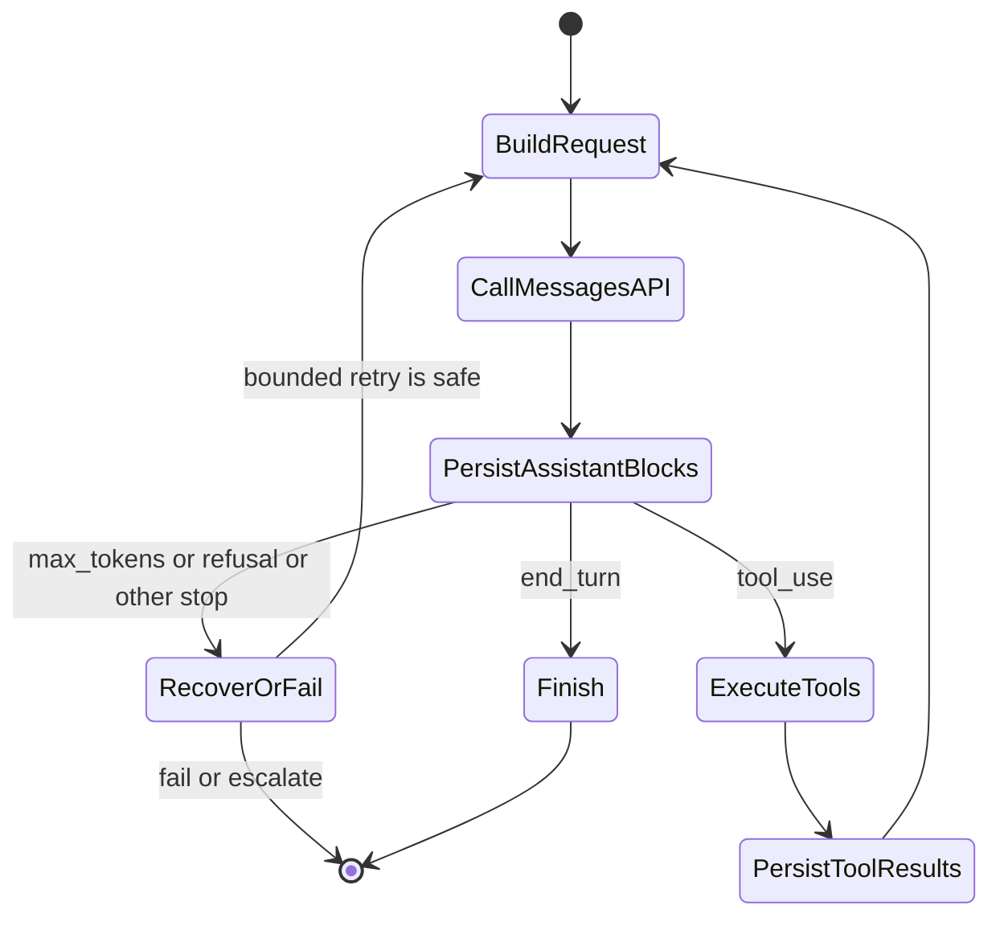

# Messages API는 상태 기계입니다

> 🇰🇷 이 문서는 한국어 번역본입니다(ELI5 스타일). 원문: [en.md](en.md)

> API는 당신의 대화를 기억하지 않습니다. 기억하는 것은 당신의 애플리케이션이고, 콘텐츠 블록 하나가 잘못 놓이면 루프 전체가 망가질 수 있습니다.

**유형:** Build
**언어:** Python
**선수 지식:** [실패 비용이 큰 곳에 능력을 쓰기](../../02-model-selection-and-token-economics/), [요청을 검증 가능한 계약으로 바꾸기](../../03-prompting-and-task-decomposition/), [모든 사실을 알맞은 종류의 컨텍스트에 넣기](../../04-context-knowledge-memory-and-caching/)
**시간:** 약 120분

## 학습 목표

- Claude 요청을 명시적인 애플리케이션 상태 전이로 모델링할 수 있다
- 동기, 스트리밍, 배치 전송 방식과 별개로 SDK 또는 순수 REST를 선택할 수 있다
- 이미지와 문서 콘텐츠 블록을 명시적인 자산 경계와 함께 구성할 수 있다
- 타입이 지정된 응답 블록을 보존하고 `stop_reason`에 따라 분기할 수 있다
- 세션, 재시도, 타임아웃, 보존, 컨텍스트 예산 위생을 강제할 수 있다
- 실제 API 키 없이 완전한 생애주기를 테스트할 수 있다

## 프로토콜을 가르쳐 주는 실패

엔지니어가 이 순서로 요청을 보냅니다.

1. 사용자가 "A-17 주문은 어디에 있나요?"라고 묻는다.
2. Claude가 ID `toolu_01`인 `tool_use` 블록을 반환한다.
3. 애플리케이션이 `lookup_order`를 실행한다.
4. 애플리케이션이 새 요청에 도구 결과만 담아 보낸다.

두 번째 요청은 실패하거나, Claude는 도구를 요청한 적이 없다는 듯이 답합니다.

신비로운 일은 없었습니다. Messages API는 무상태(stateless)입니다. 클라이언트가 원래 `tool_use` 블록을 담은 어시스턴트 메시지를 다시 보내지 않은 것입니다. `tool_result`는 독립적인 사실이 아닙니다. ID로 특정 도구 요청에 답하는 것이고, 그 대화 순서의 소유자는 당신의 코드입니다.

프레임워크가 배열을 대신 관리해 주기 때문에 이 부분을 놓치기 쉽습니다. 인증 시험은 그 편의 계층 아래까지 추론할 것을 기대합니다. 날것의 상태 기계를 한 번 직접 만들어 보세요. 그 뒤에는 모든 SDK, 에이전트 프레임워크, 관리형 런타임의 디버깅이 훨씬 쉬워집니다.

## 하나의 요청, 하나의 전이

요청은 모델, 시스템 지시문, 메시지, 토큰 통제, 선택적 기능을 공급합니다. 응답은 콘텐츠 블록, 사용량 메타데이터, 그리고 생성이 멈춘 이유를 공급합니다. 그다음에 무슨 일이 일어날지는 당신의 애플리케이션이 결정합니다.

```json
{
  "model": "<current-model-id>",
  "max_tokens": 800,
  "system": "Answer from verified order data only.",
  "messages": [
    {
      "role": "user",
      "content": "Where is order A-17?"
    }
  ]
}
```

정확한 모델 식별자와 선택적 요청 필드는 바뀝니다. 설정(configuration)으로 취급하고, 플랫폼이 허용하는 곳에서는 의도적인 버전을 고정(pin)하고, 최신 [모델 개요](https://platform.claude.com/docs/en/about-claude/models/overview)에서 확인하세요. 오래 남는 계약은 이것입니다: 클라이언트가 컨텍스트를 제출하면 타입이 지정된 응답을 받는다.



이 다이어그램은 SDK 메서드를 외우는 것보다 유용합니다. 각 화살표는 애플리케이션의 책임입니다. 로그로 남기고, 테스트하고, 재시도하고, 거부할 수 있습니다.

## 독립적인 두 접근 패턴을 고릅니다

클라이언트 라이브러리와 완료 패턴은 서로 다른 질문에 답합니다. 독립적으로 고르세요.

| 클라이언트 | 선호하는 경우 | 그래도 당신이 소유하는 것 |
|---|---|---|
| 공식 SDK | 지원 언어이고, 타입이 지정된 요청·응답 모델, 타입화된 오류, 헤더 관리, 재시도 기본값, 페이지네이션, 스트림 누적 헬퍼를 원할 때 | 애플리케이션 상태, `stop_reason` 정책, 재시도 안전성, 도구 승인, 로깅, 최종 검증 |
| 순수 REST | 지원 SDK가 없는 런타임, 의존성을 금지하는 제약 환경, 사용자 지정 HTTP 전송이나 프로토콜 수준 픽스처가 필요할 때 | 인증과 버전 헤더, JSON 타입, SSE 프레이밍, 타임아웃, 재시도, 오류 매핑, 하위 호환 대응, 연결 정리 |

지원되는 프로덕션 언어라면 SDK가 더 안전한 기본값입니다. 프로토콜 잔일을 없애 주기 때문이지 애플리케이션 생애주기를 소유해 주기 때문이 아닙니다. 순수 REST는 그 추가 통제가 추가 테스트 부담을 정당화할 때 적절합니다. [Python SDK 가이드](https://platform.claude.com/docs/en/cli-sdks-libraries/sdks/python)는 동기·비동기 클라이언트, 타입화된 모델, 스트리밍 헬퍼, 재시도 기본값, raw 응답 접근을 문서화합니다. [API 개요](https://platform.claude.com/docs/en/api/overview)가 HTTP 계약 그 자체입니다.

그다음에 하나 또는 여러 결과가 어떻게 도착하는지 고르세요.

| 완료 패턴 | 가장 잘 맞는 경우 | 완료 증거 | 잘 맞지 않는 경우 |
|---|---|---|---|
| 동기 메시지(Synchronous Message) | 계속 진행 전에 완전한 응답이 필요한 단일 인터랙티브 요청 | `stop_reason`을 처리한 하나의 파싱된 `Message` | 점진적 렌더링이나 대규모 오프라인 큐 |
| 스트리밍 메시지(Streaming Message) | 부분 표시나 첫 토큰까지의 시간이 중요한 인터랙티브 또는 긴 응답 | 누적된 콘텐츠 + 종단 `message_stop` + 최종 메시지 메타데이터 | 부분 델타로 되돌릴 수 없는 작업 실행 |
| 메시지 배치(Message Batch) | 나중에 완료되어도 되는 다수의 독립 요청 | 비동기 처리 후 안정적인 `custom_id`로 항목별 결과 대사 | 대화형 도구 루프 또는 토큰별 사용자 피드백 |

비동기 SDK 클라이언트는 메시지 배치가 아닙니다. 비동기 SDK 클라이언트는 평범한 HTTP 작업을 동시에 기다리게 해 줄 뿐입니다. 메시지 배치는 서버 쪽 비동기 작업 부하로, 저장된 입력과 결과, 항목별 결과, 그리고 나중의 대사(reconciliation)를 갖습니다. 최신 [배치 처리 가이드](https://platform.claude.com/docs/en/build-with-claude/batch-processing)는 결과가 제출 순서대로 정렬되지 않는다는 점도 짚습니다. 따라서 식별은 `custom_id`에서 나옵니다.

## 콘텐츠는 타입이 지정된 블록의 순서입니다

응답을 `response.content[0].text`로 줄이지 마세요. Claude는 하나의 메시지에 여러 블록을 반환할 수 있습니다.

- `text`는 사용자용 또는 중간 언어를 담습니다.
- `tool_use`는 도구를 지명하고 구조화된 입력을 공급하며 고유한 요청 ID를 실어 나릅니다.
- `thinking`은 해당 기능이 활성화된 경우 확장 추론 데이터를 담을 수 있습니다.
- 제공자 기능이 시간이 지나며 추가 블록 타입을 도입할 수 있습니다.

방어적인 코드는 `type`으로 분기하고, 지원하는 블록은 명시적으로 처리하고, 알 수 없는 블록은 조용히 텍스트로 취급하지 않고 기록합니다. 버전이 바뀔 때 중요해집니다. 모든 블록이 `text` 속성을 갖는다고 가정하는 파서는 유효한 도구 요청을 빈 답으로 바꿔 버립니다.

도구 왕복에는 엄격한 순서가 있습니다.

```json
[
  {
    "role": "user",
    "content": "Where is order A-17?"
  },
  {
    "role": "assistant",
    "content": [
      {
        "type": "tool_use",
        "id": "toolu_01",
        "name": "lookup_order",
        "input": {"id": "A-17"}
      }
    ]
  },
  {
    "role": "user",
    "content": [
      {
        "type": "tool_result",
        "tool_use_id": "toolu_01",
        "content": "{\"status\":\"ready\"}"
      }
    ]
  }
]
```

어시스턴트 요청이 먼저 오고, user 역할의 결과가 뒤따릅니다. `tool_use_id`는 원래 ID와 정확히 일치해야 합니다. 여러 도구 호출이 함께 도착하면 각각에 대한 결과를 반환하고 상관관계를 보존하세요.

## 중단 사유는 통제 신호입니다

텍스트는 "지금 확인해 볼게요"라고 말하지만 실제로는 도구 때문에 응답이 멈췄을 수 있습니다. 텍스트는 완성돼 보이지만 실제로는 토큰 한도에서 멈췄을 수 있습니다. 프로토콜 신호로 분기하세요.

| 신호 | 애플리케이션 해석 | 안전한 대응 |
|---|---|---|
| `end_turn` | Claude가 이 턴을 완료함 | 답을 검증하고 제시 |
| `tool_use` | 하나 이상의 클라이언트 도구가 요청됨 | 검증, 승인, 실행, 결과 추가, 계속 |
| `max_tokens` | 설정된 출력 예산이 생성을 끝냄 | 출력을 불완전 가능성으로 취급; 계획이 있을 때만 재시도 |
| `stop_sequence` | 설정된 시퀀스가 생성을 끝냄 | 그 경계가 계약에 유효한지 확인 |
| `pause_turn` | 서버 쪽 작업이 이어짐을 필요로 할 수 있음 | 현재 기능별 이어짐 계약을 따름 |
| `refusal` | 모델이 요청을 거절함 | 거절을 보존하고 승인된 폴백 또는 에스컬레이션 사용 |
| `model_context_window_exceeded` | 생성이 모델 컨텍스트 윈도우를 채움 | 응답을 잘린 것으로 취급하고 컨텍스트 예산 재설계 |

제품 참고, 2026-08-08 검증: 지원되는 중단 사유와 이어짐 요구 사항은 바뀔 수 있습니다. 현재의 진실 원천은 [Handling stop reasons](https://platform.claude.com/docs/en/build-with-claude/handling-stop-reasons)입니다. 코드는 알 수 없는 값에서 안전하게 실패(fail closed)하고 진단에 필요한 메타데이터를 충분히 수집해야 합니다.

`while stop_reason != "end_turn"` 같은 코드를 쓰지 마세요. 모든 낯선 상태를 또 다른 요청으로 바꾸고 폭주 루프를 만듭니다. 최대 턴 수, 벽시계 마감, 도구별 예산을 갖춘 포괄적인 분기(exhaustive branch)를 쓰세요.

## 대화 상태의 소유자는 클라이언트입니다

Messages API를 위해 서비스가 숨겨진 채팅 객체를 보관하지 않습니다. 각 호출은 당신이 보내기로 선택한 컨텍스트를 받습니다. 그 덕에 통제권이 있지만, 세션 위생도 당신의 일이 됩니다.

이 경계들을 지키세요.

1. **사용자 격리.** 한 테넌트의 메시지 배열을 다른 테넌트에 재사용하지 않는다.
2. **시스템 분리.** 신뢰할 수 있는 지시문을 신뢰할 수 없는 문서 콘텐츠 밖에 둔다.
3. **정규 저장.** 타입이 지정된 블록을 보존한다. 도구 ID를 복원할 수 없는 납작한 전사(transcript)가 아니라.
4. **컨텍스트 예산화.** 입력 증가를 측정하고 한도 전에 압축한다. 그때 사실과 미해결 의무는 유지한다.
5. **보존 정책.** 제품이 필요로 하는 것만 저장한다. 로그 전에 시크릿과 민감 필드를 가린다.
6. **멱등성.** 네트워크 재시도가 안정적인 작업 키 없이 결제, 이메일, 배포를 반복해서는 안 된다.

긴 세션을 요약한다면 활성 도구 요청, 사용자 제약, 검증된 사실, 미해결 질문, 승인 상태, 출처 참조를 보존하세요. "보내지 마"라는 지시를 떨구는 유창한 요약은 운영상 틀린 요약입니다.

## 멀티모달 요청은 타입이 지정된 자산 전송입니다

텍스트, 이미지, 문서는 하나의 순서 있는 콘텐츠 배열에 들어갑니다. 자산보다 과업을 먼저 말하고, 미디어에 맞는 블록 타입을 쓰고, 출처를 명시적으로 유지하세요.

```json
{
  "model": "<current-model-id>",
  "max_tokens": 400,
  "messages": [
    {
      "role": "user",
      "content": [
        {
          "type": "text",
          "text": "Compare the chart with the approved policy document."
        },
        {
          "type": "image",
          "source": {
            "type": "base64",
            "media_type": "image/png",
            "data": "<base64-image-bytes>"
          }
        },
        {
          "type": "document",
          "source": {
            "type": "file",
            "file_id": "<application-owned-file-id>"
          }
        }
      ]
    }
  ]
}
```

이미지는 `base64`, `url`, 또는 Files API의 `file` 소스를 쓸 수 있습니다. PDF는 `document` 블록 안에서 URL, base64, 또는 Files API 소스를 쓸 수 있습니다. 블록 순서는 프롬프트의 일부입니다: 지시문과 신뢰 맥락을 그것이 지배하는 자산 가까이 두세요. 최신 미디어와 모델 제약은 [Vision](https://platform.claude.com/docs/en/build-with-claude/vision)과 [PDF support](https://platform.claude.com/docs/en/build-with-claude/pdf-support)에서 확인하세요.

Files API는 재사용과 보존을 바꾸지, 콘텐츠 블록의 의미를 바꾸지 않습니다. 한 번 업로드하고 불투명한 `file_id`를 받은 뒤, 바이트를 다시 보내는 대신 이후 Messages 요청에서 그것을 참조하세요. 여러 요청에 걸쳐 재사용되는 정책 PDF나 이미지에 유용합니다.

제품 참고, 2026-08-09 검증: [Files API](https://platform.claude.com/docs/en/build-with-claude/files)는 베타이며, 현재 Message가 파일을 참조할 때 `files-api-2025-04-14` 베타 헤더를 사용합니다. 파일은 워크스페이스 범위이고, 업로드 후 불변이며, 삭제할 때까지 유지됩니다. 그 워크스페이스의 어떤 API 키든 파일을 참조할 수 있습니다. 현재 헤더, 플랫폼 제공 여부, 한도, 다운로드 규칙은 변동 가능한 것으로 취급하고 구현 전에 가이드를 확인하세요.

| 소스 | 경계를 넘는 데이터 | 재사용과 보존 책임 |
|---|---|---|
| 인라인 base64 | 인코딩된 바이트가 모든 요청을 타고 이동 | 페이로드를 로그에 남기지 않기; 요청 보존과 크기 한도를 명시적으로 유지 |
| URL | 제공자가 원격 오리진에서 자산을 가져옴 | 오리진을 승인하고, 시크릿이 든 URL을 피하고, 오리진 로그와 가용성을 고려 |
| Files API `file_id` | 식별자가 API 워크스페이스에 저장된 바이트를 참조 | 애플리케이션이 소유한 ID만 허용 목록에 두고, 소유자와 목적을 기록하고, 워크스페이스 격리를 강제하고, 보존 기간이 끝나면 삭제 |

`file_id`가 현재 테넌트가 그 파일을 쓸 수 있다는 증거는 아닙니다. 테넌트, 워크스페이스, 미디어 타입, 민감도, 콘텐츠 해시, 업로드 시각, 삭제 기한을 담은 애플리케이션 기록에 바인딩하세요. 모델이나 사용자가 공급한 임의의 ID를 받아 그대로 전달하는 일은 절대 금지입니다. 원본 이미지 바이트, PDF 텍스트, 서명된 URL, 불투명한 파일 ID를 평범한 추적(trace)에 넣지 마세요. 대신 콘텐츠 해시와 정책 결정을 로그로 남기세요.

## 스트리밍은 전달을 바꾸지 의미를 바꾸지 않습니다

스트리밍은 완전한 메시지가 도착하기 전에 사용자가 출력을 볼 수 있게 해 줍니다. 최종 응답을 조립하고 검증해야 할 필요를 없애 주지는 않습니다.

일반적인 이벤트 처리는 이 모양입니다.

```python
text_parts = []

for event in stream:
    if event.type == "content_block_delta" and event.delta.type == "text_delta":
        text_parts.append(event.delta.text)
    elif event.type == "message_delta":
        final_stop_reason = event.delta.stop_reason
    elif event.type == "message_stop":
        complete = True
```

경험상 도움이 된다면 잠정 텍스트를 렌더링해도 되지만, 부분 스트림으로 되돌릴 수 없는 작업을 트리거하지 마세요. 도구 입력도 점진적으로 도착할 수 있습니다. 블록이 완성될 때까지 버퍼에 모으고, 한 번 파싱하고, 검증한 뒤에 승인하세요.

연결이 끊기면 모호성이 생깁니다. 완전한 종단 이벤트가 도착했는지 추적하세요. 도착하지 않았다면 그 시도를 불완전으로 표시하세요. 읽기 전용 요청은 안전할 때 재시도하세요. 변경(mutating) 작업은 다시 아무것도 하기 전에 멱등성 기록을 확인하세요.

최신 이벤트 타입과 SDK 헬퍼는 [Streaming Messages](https://platform.claude.com/docs/en/build-with-claude/streaming)를 참고하세요.

## 배치, 캐시, 씽킹은 서로 다른 문제를 해결합니다

이 기능들은 비용이나 지연 시간을 바꾸기 때문에 자주 뒤섞입니다. 하지만 목적이 다릅니다.

**메시지 배치(Message Batches)** 는 다수의 독립 요청을 비동기로 처리합니다. 즉각적인 응답 지연 시간을 처리량과 유리한 배치 경제성과 맞바꿉니다. 오프라인 분류, 추출, 평가, 마이그레이션에 사용하세요. 다음 답이 지금 필요한 인터랙티브 도구 루프에는 쓰지 마세요. 각 요청을 사용자 지정 ID로 추적하고 부분 배치 실패를 처리하세요. [Batch processing](https://platform.claude.com/docs/en/build-with-claude/batch-processing) 참고.

**프롬프트 캐싱**은 안정적인 프롬프트 접두부를 재사용합니다. 변동이 심한 사용자 콘텐츠 앞에 오래가는 시스템 지시문, 도구 정의, 공유 참조 자료를 두세요. 캐시된 접두부 안에서 바이트 하나만 바뀌어도 하류 재사용이 무효화될 수 있습니다. 캐시 적중은 첫 토큰까지의 시간과 입력 경제성을 개선하지만, 컨텍스트 윈도우를 넓혀 주거나 낡은 사실을 옳게 만들지는 않습니다. [Prompt caching](https://platform.claude.com/docs/en/build-with-claude/prompt-caching) 참고.

**확장 씽킹(Extended thinking)** 은 그 덕을 보는 과업에 추론 작업을 할당합니다. 예산을 소비하고, 응답 블록을 바꾸고, 도구 턴에 걸쳐 씽킹 블록을 보존하는 기능별 규칙이 있습니다. 서명된 씽킹 콘텐츠를 편집하거나 지어내지 마세요. 단순 추출에 반사적으로 켜지도 마세요. 평가 세트에서 품질, 지연 시간, 비용을 비교하세요. [Extended thinking](https://platform.claude.com/docs/en/build-with-claude/extended-thinking) 참고.

시험 추론은 간단합니다: 작업 부하에서 메커니즘을 고릅니다. 오프라인 독립 작업이면 배치. 반복되는 안정 접두부면 캐싱. 측정된 품질 이득이 있는 어려운 추론이면 씽킹. 빠른 토큰 전달이면 스트리밍.

## 생애주기와 자산 경계를 오프라인으로 만들기

`code/main.py`의 실행 가능한 시뮬레이터는 각본화된 제공자 응답을 받습니다. 숨은 클라이언트 작업을 드러내 줍니다.

- 모든 어시스턴트 콘텐츠 블록을 저장한다.
- 요청된 도구를 실행한다.
- 일치하는 `tool_result` 블록을 반환한다.
- 완전한 상태를 다시 보낸다.
- 알 수 없는 중단 사유를 거부한다.
- 폭주 루프를 멈춘다.
- 시뮬레이션 스트림을 `message_stop` 뒤에만 수집한다.
- 동기, 스트림, 배치와 독립적으로 SDK 또는 REST를 고른다.
- 이미지와 재사용 파일 콘텐츠 블록을 만들고 검증한다.
- 애플리케이션 소유 허용 목록 밖의 파일 ID를 거부한다.
- 자산 바이트나 파일 ID 없이 해시화된 경계 원장을 만든다.

실행하세요:

```bash
cd certifications/claude/lessons/08-messages-api-and-application-lifecycle/code
python3 main.py
python3 -m unittest discover tests -v
```

이 레슨의 어떤 코드도 SDK를 임포트하거나, 자격 증명을 읽거나, 파일을 업로드하거나, URL을 가져오거나, 모델을 호출하지 않습니다. `multimodal_lab_fixture()`는 1픽셀 합성 이미지와 오프라인 플레이스홀더 파일 ID를 사용합니다. 비공개 실험에서는 `ScriptedTransport.create()`를 실제 SDK 호출로 바꾸고, 인증된 업로드 후에만 플레이스홀더를 교체하세요. 상태 기계, 허용 목록, 원장은 그대로 두세요.

## 인터랙티브 랩

생애주기 피규어로 사용자 입력, 어시스턴트 콘텐츠 블록, 도구 실행, 상관된 결과, 종단 중단 사유를 하나씩 밟아 보세요. 순서를 깨뜨려 어떤 전이가 무효가 되는지 확인하세요.

```figure
08-messages-lifecycle
```

## 연습 랩

각본화된 생애주기를 실행한 뒤, 어시스턴트 `tool_use` 메시지를 빼 보거나, 상관 ID를 바꾸거나, `message_stop` 없이 스트림을 끝내 보세요. 그다음 재사용 파일 ID를 소유 허용 목록 밖으로 바꾸거나, 이미지 base64를 손상시키거나, 접근 선택자에게 배치 처리와 점진적 토큰을 동시에 요구해 보세요. 각 실패는 프롬프트 재시도가 아니라 이름 붙은 프로토콜 오류나 데이터 경계 오류에 대응해야 합니다.

## 산출물

`outputs/messages-lifecycle-transcript.json`은 여전히 제공자 없는 완전한 도구 왕복입니다. `outputs/multimodal-request-fixture.json`은 네 개의 접근 결정, 혼합 이미지·문서 요청 하나, 애플리케이션 소유 파일 허용 목록, 가려진 자산 경계 원장을 추가합니다. `python3 main.py`를 실행하면 두 픽스처가 모두 출력됩니다. 단위 테스트 스위트는 네트워크 없이 체크인된 각 산출물을 검증합니다.

## 검증하기

```bash
cd certifications/claude/lessons/08-messages-api-and-application-lifecycle/code
python3 main.py
python3 -m unittest discover tests -v
```

## 캡스톤 연결

퀴즈는 낯선 시나리오에서 같은 프로토콜 판단을 확인합니다. 검증된 전사(transcript)를 개발자 캡스톤 30과 아키텍트 캡스톤 31, 32의 생애주기 증거로 사용하세요.

## 한 턴을 넘는 애플리케이션 생애주기

프로덕션 Claude 애플리케이션의 상태는 "요청"과 "응답"보다 많습니다.

```mermaid
flowchart LR
    Intake[Validate intake] --> Authorize[Authorize capabilities]
    Authorize --> Invoke[Invoke model]
    Invoke --> Parse[Parse typed blocks]
    Parse --> Act[Execute approved tools]
    Act --> Verify[Verify result and final state]
    Verify --> Deliver[Deliver or escalate]
    Deliver --> Observe[Record trace and metrics]
    Observe --> Evaluate[Run regression evals]
    Evaluate --> Improve[Version prompt, model, tools, or code]
    Improve --> Intake
```



모델 오류는 한 가지 실패 클래스일 뿐입니다. 전송 타임아웃, 속도 한도, 잘못된 애플리케이션 상태, 스키마 불일치, 권한 거부, 도구 실패, 낡은 캐시, 사용자 취소, 배포 회귀도 있습니다. 각각 따로 태그를 붙이세요. 타임아웃에 도움이 되는 재시도가 권한 실패는 더 악화시킬 수 있습니다.

시스템 지시문, 모델 선택, 도구 카탈로그, 출력 스키마, 애플리케이션 코드를 모든 추적(trace)에 버전으로 기록하세요. 그 식별자들이 없으면 회귀를 재현할 수 없고 평가 실행을 공정하게 비교할 수 없습니다.

## 시험 판단 규칙

- 시나리오에서 이전 메시지를 잃었다면, 모델 메모리보다 클라이언트 소유 상태부터 의심한다.
- 도구 결과가 거부되면 역할 순서와 일치하는 tool-use ID를 검사한다.
- 출력이 잘린 것 같으면 프롬프트를 바꾸기 전에 `stop_reason`과 usage를 검사한다.
- 사용자가 즉각적인 점진 표시를 필요로 하면 배치가 아니라 스트리밍을 고른다.
- 수천 개의 독립 작업이 나중에 끝나도 된다면 메시지 배치를 고른다.
- 지원 SDK가 전송 수요를 충족하면 타입화된 모델과 헬퍼를 선호하고, 생애주기 정책은 애플리케이션 코드에 둔다.
- 제약 런타임이 순수 REST를 필요로 하면 헤더, 오류, SSE, 재시도, 알 수 없는 필드에 명시적인 테스트 예산을 잡는다.
- 자산이 반복되면 인라인 전송과 Files API 재사용, 그리고 명시적인 삭제 정책을 비교한다.
- `file_id`가 인증된 테넌트와 워크스페이스에 바인딩되어 있지 않으면 요청 전에 거부한다.
- 긴 공유 접두부가 반복되면 프롬프트 캐싱을 평가한다.
- 재시도가 부수 효과를 반복할 수 있다면 먼저 멱등성이나 대사(reconciliation)를 요구한다.
- 새로운 중단 사유가 나타나면 안전하게 실패(fail closed)하고 최신 문서로 갱신한다.

## 연습 문제

1. 두 개의 `tool_use` 블록을 포함한 각본화된 응답을 추가하세요. 두 결과 모두 올바른 ID와 함께 하나의 다음 user 메시지에 나타나는지 단언(assert)하세요.
2. `max_tokens`에 대한 명시적 처리를 추가하세요. 부분 텍스트를 최종으로 표시하는 대신 타입화된 불완전 결과를 반환하세요.
3. `message_stop` 전에 끊기는 스트림을 시뮬레이션하세요. 불완전 시도를 기록하고 되돌릴 수 없는 행동이 실행되지 않음을 증명하세요.
4. 원본 사용자 메시지를 저장하지 않으면서 테넌트와 프롬프트 버전 메타데이터를 추적에 추가하세요.
5. 멀티모달 픽스처에 URL 기반 이미지를 추가하세요. 네트워크 호출 없이 오리진, 승인, 보존, 실패 경계를 기록하세요.

## 더 읽을거리

- [Messages API 참조](https://platform.claude.com/docs/en/api/messages)
- [Messages 예제](https://platform.claude.com/docs/en/api/messages-examples)
- [Python SDK](https://platform.claude.com/docs/en/cli-sdks-libraries/sdks/python)
- [Vision](https://platform.claude.com/docs/en/build-with-claude/vision)
- [PDF support](https://platform.claude.com/docs/en/build-with-claude/pdf-support)
- [Files API](https://platform.claude.com/docs/en/build-with-claude/files)
- [Handling stop reasons](https://platform.claude.com/docs/en/build-with-claude/handling-stop-reasons)
- [Streaming Messages](https://platform.claude.com/docs/en/build-with-claude/streaming)
- [Batch processing](https://platform.claude.com/docs/en/build-with-claude/batch-processing)
- [Prompt caching](https://platform.claude.com/docs/en/build-with-claude/prompt-caching)
- [Extended thinking](https://platform.claude.com/docs/en/build-with-claude/extended-thinking)
