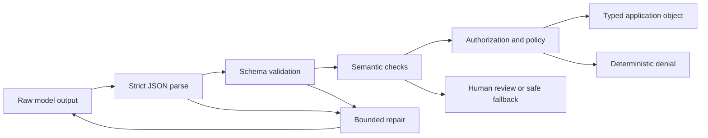

# 구조화된 출력은 신뢰할 수 없는 계약입니다

> 🇰🇷 이 문서는 한국어 번역본입니다(ELI5 스타일). 원문: [en.md](en.md)

> 유효한 JSON이 유효한 비즈니스 결정은 아닙니다. 바이트를 파싱하고, 모양을 검증하고, 의미를 확인한 뒤에 행동을 허용하세요.

**유형:** Build
**언어:** Python
**선수 지식:** [자신감이 아니라 주장을 검증하기](../../05-output-evaluation-and-validation/), [Messages API는 상태 기계입니다](../../08-messages-api-and-application-lifecycle/)
**시간:** 약 95분

## 학습 목표

- JSON 문법, 스키마 유효성, 의미 유효성, 승인을 구분할 수 있다
- 잘못된 상태를 표현하기 어렵게 만드는 좁은 스키마를 설계할 수 있다
- 안전하지 않은 정리(cleanup)나 낙관적 강제 변환(coercion) 없이 Claude 출력을 파싱할 수 있다
- 예산이 제한되고 증거가 풍부한 재시도로 유효하지 않은 응답을 수리할 수 있다
- 소비자를 조용히 망가뜨리지 않고 출력 계약을 진화시킬 수 있다
- 공격적 경계와 스트리밍 경계에서 구조화된 출력을 테스트할 수 있다

## 실패했어야 할 JSON

지원 애플리케이션이 1부터 5까지의 우선순위를 요청했습니다. 응답은 이렇습니다.

```json
{
  "category": "billing",
  "priority": 9,
  "summary": "Customer reports a duplicate charge",
  "needs_human": false
}
```

JSON 파서는 성공합니다. 객체는 기대한 모든 키를 갖고 있습니다. 애플리케이션은 이것을 최고 긴급 우선순위로 분류하고, 사람 검토를 건너뛰고, 온콜 엔지니어를 호출합니다.

모델은 JSON을 어기지 않았습니다. 계약을 강제하지 못한 것은 당신의 애플리케이션입니다.

구조화된 출력에는 네 개의 게이트가 있습니다.

1. **문법(Syntax):** 파싱 가능한 JSON 값이 정확히 하나인가?
2. **모양(Shape):** 값이 타입, 필수 필드, 열거형, 범위, 추가 속성 규칙과 일치하는가?
3. **의미(Semantics):** 필드들이 도메인 사실과 서로 일치하는가?
4. **권한(Authority):** 요청된 다운스트림 행동이 허용되는가?

앞의 게이트를 통과했다고 뒤의 게이트를 통과하는 게 아닙니다.



## "JSON으로만 답해"는 계약이 아닙니다

"JSON만 반환해 줘"는 지시문입니다. 확률을 높여 줄 뿐입니다. 잘못된 출력을 불가능하게 하거나, 스키마 드리프트를 막아 주거나, 비즈니스 의미를 검증해 주지 않습니다.

현재 모델과 API가 구조화된 출력(structured outputs)을 지원하면 JSON Schema를 제공해 생성을 제한해 달라고 플랫폼에 요청할 수 있습니다. 문법과 모양 실패를 줄여 줍니다. 그래도 인용된 주문이 존재하는지, 환불이 승인되었는지, 카테고리가 올바른지는 증명하지 않습니다.

제품 참고, 2026-08-09 검증: 구조화된 출력의 제공 여부, 지원되는 스키마 키워드, 다른 기능과의 비호환성, 모델 지원은 바뀔 수 있습니다. 출시 전에 [Structured outputs](https://platform.claude.com/docs/en/build-with-claude/structured-outputs)를 확인하세요. 제한된 디코딩(constrained decoding)이 켜져 있어도 애플리케이션 쪽 검증을 유지하세요.

스키마의 소유자는 애플리케이션입니다. API처럼 버전을 관리하세요.

```json
{
  "$id": "support-triage-v1",
  "type": "object",
  "required": ["category", "priority", "summary", "needs_human"],
  "additionalProperties": false,
  "properties": {
    "category": {
      "type": "string",
      "enum": ["billing", "bug", "account", "other"]
    },
    "priority": {
      "type": "integer",
      "minimum": 1,
      "maximum": 5
    },
    "summary": {
      "type": "string",
      "minLength": 1,
      "maxLength": 240
    },
    "needs_human": {
      "type": "boolean"
    }
  }
}
```

이 스키마는 그 엄격함을 정당화합니다. 소비자는 정확히 네 개의 필드를 기대합니다. 뜻밖의 `debug_context` 필드는 개인 텍스트를 로그로 운반할 수 있습니다. 정수 범위는 `9`를 막습니다. 열거형은 카테고리 표기가 흩어져 분석이 깨지는 것을 막습니다.

## 소비자의 결정에서 스키마를 설계합니다

"Claude가 무엇을 만들어 낼 수 있을까?"로 시작하지 마세요. "다음 결정론적 구성 요소가 무엇을 결정해야 할까?"로 시작하세요.

소비자가 큐를 고른다면 열거형을 주세요. 우선순위로 정렬한다면 범위가 있는 정수를 주세요. 불확실성이 라우팅을 바꾼다면 문장 속에 나타나기를 바라는 대신 불확실성을 명시적으로 표현하세요.

두 계약을 비교해 보세요.

```json
{"answer": "Probably a billing issue. It seems urgent."}
```

```json
{
  "category": "billing",
  "priority": 4,
  "evidence_ids": ["invoice-483", "message-12"],
  "uncertainty": "medium",
  "needs_human": true
}
```

두 번째 객체는 라우팅과 검증을 가능하게 합니다. 여전히 틀릴 수 있지만 검사 가능합니다.

이 설계 규칙을 사용하세요.

- 자유 형식 라벨보다 열거형을 선호한다.
- 모든 유효한 응답이 공급할 수 있는 경우에만 필수 필드를 쓴다.
- `null`은 "알려진 부재"에 의도적으로 쓰지, 만능 탈출구로 쓰지 않는다.
- 소비자가 의도적으로 확장을 지원하는 게 아니라면 추가 속성을 거부한다.
- 비용과 저장을 통제하도록 문자열과 배열에 상한을 둔다.
- 사실이 추적 가능해야 하면 증거 식별자를 포함한다.
- 행동을 승인의 증거가 아니라 제안으로 인코딩한다.
- 스키마에 안정적인 이름과 버전을 준다.

수십 개의 선택 필드로 서로 무관한 모드를 표현하는 거대한 스키마 하나는 피하세요. 태그드 유니언(tagged union)이나 별도의 엔드포인트 계약을 쓰세요. 모든 필드가 선택이면 잘못된 상태가 곱절로 늘어납니다.

## 엄격하게 파싱합니다

낙관적인 정리는 실패를 숨깁니다. 이 패턴을 보세요.

```python
raw = raw.replace("```json", "").replace("```", "")
payload = json.loads(raw)
```

친절해 보이지만 생성 뒤에 계약을 바꿉니다. 해설이 포함된 응답, JSON 객체 두 개, 사용자가 조작한 펜스(fence) 텍스트가, 모델이 실제로 단일 값으로 반환한 적 없는 무언가로 변형될 수 있습니다.

엄격한 파싱을 선호하세요.

```python
payload = json.loads(raw)
validate_against_schema(payload)
```

계약이 JSON 객체 하나라고 말한다면 마크다운 펜스와 뒤에 붙은 문장을 거부하세요. 실패 클래스를 기록하세요. 그래야 수리 시도가 정확한 오류를 받을 수 있습니다.

조용히 강제 변환하지 마세요.

- `"4"`는 정수가 아닙니다.
- `1`은 불리언이 아닙니다.
- `"false"`는 false가 아닙니다.
- 쉼표로 구분된 문자열은 배열이 아닙니다.
- 빠진 필드는 안전한 기본값과 동일하지 않습니다. 스키마가 그 기본값을 선언하고 애플리케이션이 의도적으로 적용하는 경우가 아니라면.

파이썬에서 한 사례는 특히 교묘합니다: `bool`은 `int`의 하위 클래스입니다. 순진한 `isinstance(True, int)` 검사는 정수가 필요한 곳에서 불리언을 받아들입니다. 실행 가능한 검증기는 이것을 명시적으로 거부합니다.

## 모양 뒤에 의미를 검증합니다

스키마는 `invoice_id`가 문자열임을 증명할 수 있습니다. 그 인보이스가 존재하거나 인증된 사용자의 것임을 증명할 수는 없습니다.

의미 검사는 신뢰할 수 있는 애플리케이션 데이터를 사용합니다.

```python
if payload["invoice_id"] not in invoices_for(authenticated_user):
    raise SemanticError("invoice is not visible to this user")

if payload["refund_amount"] > verified_charge_amount:
    raise SemanticError("refund exceeds verified charge")
```

필드 간 규칙도 중요합니다. `uncertainty: high`일 때 `needs_human: false`는 유효하지 않을 수 있습니다. 제안된 `action: close_account`에는 승인 토큰이 필요할 수 있습니다. 인용 ID는 그 주장을 실제로 뒷받침하는 출처로 해석되어야 합니다.

모델은 제안을 만드는 데 도움을 줄 수 있습니다. 신원, 소유권, 금액 경계, 권한, 상태 전이를 검증하는 것은 결정론적 코드입니다.

## 예산을 두고 수리합니다

유효하지 않은 출력이 항상 실패를 의미하지는 않습니다. 문법이나 스키마 오류는 과업이 저위험이고 정정이 없는 증거를 지어내지 않는다면 수리 가능할 수 있습니다.

수리 루프에는 다음이 포함되어야 합니다.

1. 원래 과업과 변경되지 않은 신뢰할 수 있는 컨텍스트.
2. 스키마 또는 정확한 계약 요약.
3. 필드 경로가 있는 기계 생성 검증 오류.
4. 엄격한 최대 시도 횟수.
5. 종단 폴백 또는 에스컬레이션.

```text
이전 출력을 수리한다.
JSON 객체 하나만 반환하고 주변 텍스트는 넣지 않는다.
검증 오류:
- $.priority: 1부터 5까지의 정수가 필요함
- $.needs_human: 필수 필드가 없음
출처에 없던 증거를 지어내지 않는다.
```

원본 예외 덤프, 시크릿, 데이터베이스 레코드, 임의의 신뢰할 수 없는 문자열을 더 높은 신뢰의 지시 영역에 붙여 넣지 마세요. 검증 피드백은 데이터입니다. 구분 표시를 하고 신뢰할 수 있는 수리 지시문과 분리하세요.

두 번의 시도만으로 실패가 우연한 포맷 문제인지 더 깊은 계약 불일치인지 드러나는 경우가 많습니다. 무한 재시도는 예산을 태우고 프롬프트 인젝션 페이로드를 증폭시킬 수 있습니다. 시도 횟수, 토큰, 지연 시간, 반복되는 오류 지문(fingerprint)을 세세요.

출처에 필요한 증거가 없다면 JSON을 수리하는 것은 잘못된 작업입니다. 명시적인 불완전 상태를 반환하거나 에스컬레이션하세요.

## 도구 입력과 최종 출력은 다른 계약입니다

Claude 도구 사용도 구조화된 입력을 공급하지만, 다른 경계를 위해 존재합니다.

- 도구 입력 스키마는 모델이 호출을 구성하도록 돕는다.
- 도구 핸들러는 여전히 값을 검증하고 호출자를 승인한다.
- 도구 결과는 원격 서비스에서 오면 신뢰할 수 없는 외부 데이터다.
- 최종 애플리케이션 출력에는 자체 소비자용 스키마가 있다.

넓은 내부 도구 스키마를 공개 응답 계약으로 재사용하지 마세요. 내부 필드는 구현 세부나 시크릿을 노출할 수 있습니다. 검증된 도구 결과를 최소한의 최종 객체로 매핑하세요.

마찬가지로 최종 JSON에 `"approved": true`가 들어 있다고 행동을 실행하지 마세요. 승인은 인증된 애플리케이션 상태에서 나옵니다. 모델 출력에서 나오지 않습니다.

도구 사용이 구조화 출력 메커니즘일 때는 CCAR-F 가이드가 쓰는 세 가지 공개 `tool_choice` 결정을 알아 두세요.

| 선택 | 모델 동작 | 쓰는 경우 |
|---|---|---|
| `auto` | 모델이 도구를 호출하거나 대화 텍스트를 반환할 수 있음 | 어느 경로든 유효할 때 |
| `any` | 모델이 제공된 도구 중 하나를 반드시 호출해야 함 | 타입화된 도구 결과가 필요하지만 여러 스키마가 유효할 때 |
| `{"type":"tool","name":"extract_metadata"}` | 지명된 도구를 반드시 선택해야 함 | 이후 작업 전에 알려진 추출 하나가 반드시 일어나야 할 때 |

기계가 읽을 최종 응답을 위해서는, 현재 네이티브 구조화 출력 기능이 요구하는 스키마와 기능 조합을 지원한다면 그것을 선호하세요. 워크플로가 실제로 도구를 고르거나 호출하는 것이라면 도구 스키마를 쓰세요. 어느 쪽이든 의미 검사와 승인은 애플리케이션의 일입니다.

## Pydantic은 검증기 구현이지 계약이 아닙니다

공개 CCAR-F 가이드는 JSON Schema 검증과 검증-재시도 루프와 함께 Pydantic을 언급합니다. 파이썬에서 Pydantic 모델은 스키마를 생성하고, 설정에 따라 입력을 강제 변환하거나 거부하며, 필드 간 검증을 표현할 수 있습니다. 하지만 모델의 주장을 참으로 만들거나 다운스트림 권한을 부여하지는 않습니다.

이 저장소는 stdlib 우선 원칙을 지키므로 실행 가능한 랩은 관련 검사를 직접 구현합니다. 프로덕션 애플리케이션이 이미 Pydantic을 쓴다면 같은 네 게이트를 명시적으로 매핑하세요.

```text
JSON parse -> Pydantic shape validation -> domain validation -> authorization
```

강제 변환 동작을 검사하세요. `"4"`를 `4`로 조용히 바꾸는 검증기는 한 외부 경계에서는 적절하지만 다른 경계에서는 용납될 수 없습니다. 범위가 제한되고 필드 단위인 검증 오류를 수리로 흘려 보내고, 출처에 필요한 증거가 없으면 에스컬레이션하세요.

## 스트리밍은 부분 문법을 만듭니다

스트림으로 받은 JSON은 관련 콘텐츠 블록이 끝날 때까지 불완전합니다. 접두부 `{"category":"bill`은 아직 무효가 아닙니다. 미완성인 것입니다.

구조화된 블록을 버퍼에 모으세요. 증분 JSON을 위해 설계된 파서를 쓰고 그 부분 상태 의미론을 이해하는 경우가 아니라면 글자마다 반복해서 파싱하지 마세요. 필수 필드 하나가 우연히 일찍 나타났다고 다운스트림 행동을 트리거하지 마세요.

블록이 완성되면:

1. 스트림이 유효한 종단 이벤트에 도달했는지 확인한다.
2. 정확히 한 번 파싱한다.
3. 스키마를 검증한다.
4. 의미와 정책을 검증한다.
5. 다운스트림 상태 전이를 원자적으로 커밋한다.

스트림이 끊기면 부분 객체를 버리거나 격리하세요. UI는 잠정 텍스트를 보여 줄 수 있지만, 애플리케이션 계약은 완성되지 않은 것입니다.

## 스키마 진화는 API 마이그레이션입니다

버전 1이 `priority`를 정수로 반환한다고 하자. 버전 2가 그것을 `severity: "low" | "medium" | "high"`로 바꾼다. 프롬프트를 먼저 배포하면 오래된 소비자가 깨지고, 소비자를 먼저 배포하면 오래된 출력이 거부될 수 있습니다.

다음 전략 중 하나를 사용하세요.

- 계약 버전 필드를 추가하고 마이그레이션 동안 둘 다 지원한다.
- 좁게 계획된 호환성 기간 동안 관용적 리더(tolerant reader)를 배포한다.
- 전환 전에 병렬 생성을 돌려 결과를 비교한다.
- 어댑터 경계에서 새 출력을 오래된 내부 타입으로 번역한다.

스키마를 조용히 바꾸지 마세요. 추적에 스키마 버전, 프롬프트 버전, 모델 버전, 검증기 버전을 기록하세요. 회귀 평가는 오래된 예와 새로운 예, 경계 값, 빠진 필드, 뜻밖의 필드, 적대적인 문자열, 큰 입력을 모두 커버해야 합니다.

## 검증기와 수리 루프 만들기

`code/main.py`는 외부 의존성 없이 JSON Schema의 쓸모 있는 부분집합을 구현합니다. 객체, 필수 필드, 추가 속성, 원시 타입, 열거형, 숫자 경계, 문자열 경계, 배열, 중첩 경로를 검증합니다. 그다음 검증기를 예산이 제한된 추출기로 감쌉니다.

실행하세요:

```bash
cd certifications/claude/lessons/09-structured-output-and-defensive-parsing/code
python3 main.py
python3 -m unittest discover tests -v
```

첫 번째 각본화된 응답은 정수가 필요한 곳에 `"high"`를 씁니다. 두 번째 응답이 그 필드를 수리합니다. 테스트는 마크다운 펜스, 빠진 필드, 불리언-정수, 뜻밖의 필드, 소진된 재시도가 명시적으로 실패함을 증명합니다.

프로덕션에서는 애플리케이션 스택이 지원하는 성숙한 검증기를 선호하세요. 손으로 쓴 부분집합의 목적은 라이브러리가 수행하는 검사를 드러내는 것이지 완전한 JSON Schema 구현을 대체하는 것이 아닙니다.

## 인터랙티브 랩

복구 피규어로 후보 출력을 문법, 스키마, 의미, 승인 게이트에 통과시켜 보세요. 수리 예산을 구조적 오류에 쓴 뒤, 반드시 에스컬레이션해야 하는 증거 누락 실패와 그 결과를 비교해 보세요.

```figure
09-structured-output-recovery
```

## 연습 랩

예산이 제한된 추출기를 실행한 뒤, 펜스 쳐진 JSON, 불리언 정수, 뜻밖의 필드, 그리고 유효하지 않은 시도 두 번을 제출해 보세요. 각 실패의 소유자가 문법인지, 모양인지, 의미인지, 권한인지 판별하세요.

## 산출물

`outputs/validated-triage.json`은 제공자 없는 수리 데모가 만든 작성 완료된 계약입니다. `python3 main.py`로 재현한 뒤 단위 테스트 스위트를 실행하세요. 한 테스트는 체크인된 산출물을 `demo()`와 비교하고, 나머지 테스트는 펜스, 빠진 필드, 불리언 정수, 추가 속성, 예산이 제한된 수리, 소진된 재시도를 커버합니다.

## 검증하기

```bash
cd certifications/claude/lessons/09-structured-output-and-defensive-parsing/code
python3 main.py
python3 -m unittest discover tests -v
```

## 캡스톤 연결

퀴즈는 각 실패의 소유 게이트를 확인합니다. 검증된 객체와 수리 증거를 개발자 캡스톤 30과 아키텍트 캡스톤 31, 32에서 사용하세요.

## 시험 판단 규칙

- 출력이 파싱되지만 범위나 열거형을 위반하면 프롬프트 정리가 아니라 스키마 검증을 고른다.
- 출력이 스키마와 일치하지만 신뢰할 수 있는 기록과 충돌하면 의미 검증을 고른다.
- 객체가 특권 행동을 제안하면 애플리케이션 신원과 정책에서 승인한다.
- 포맷이 일시적으로 실패하면 정확한 검증 피드백을 담은 예산이 제한된 수리를 쓴다.
- 증거가 없으면 사실을 수리하는 대신 에스컬레이션하거나 명시적인 불완전 상태를 반환한다.
- 스트리밍이 불완전하면 계약이 끝난 것처럼 파싱하거나 행동하지 않는다.
- 스키마가 바뀌면 모든 공개 API처럼 버전을 붙이고 마이그레이션한다.
- 제한된 생성(constrained generation)을 쓸 수 있으면 오류를 줄이는 데 사용하되 다운스트림 검증은 유지한다.

## 연습 문제

1. `evidence_ids`를 상한이 있는 문자열 배열로 추가하세요. 유효한 목록, 정수 항목, 선택한 한도를 초과하는 목록에 대한 테스트를 작성하세요.
2. `uncertainty: high`가 `needs_human: true`를 요구하는 필드 간 규칙을 추가하세요.
3. 인보이스 전체 기록을 모델에 노출하지 않고 인증된 사용자의 것임을 확인하는 의미 검증기를 만드세요.
4. `contract_version` 필드를 추가하고 버전 1에서 버전 2로 가는 어댑터를 구현하세요.
5. 검증기에 적대적인 문자열 열 개를 먹여 보세요: 펜스, 중복 객체, 뜻밖의 필드, 이스케이프된 제어 텍스트, 거대한 요약, 불리언 정수, 중첩된 프롬프트 인젝션 언어.
6. 별도의 프로덕션 샌드박스에서 트리아지 계약을 Pydantic 모델로 다시 만드세요. 이 레슨에 Pydantic을 의존성으로 추가하지 않고 엄격 동작과 강제 변환 동작을 비교하세요.

## 더 읽을거리

- [Structured outputs](https://platform.claude.com/docs/en/build-with-claude/structured-outputs)
- [Messages API 참조](https://platform.claude.com/docs/en/api/messages)
- [도구 사용 개요](https://platform.claude.com/docs/en/agents-and-tools/tool-use/overview)
- [출력 일관성 높이기](https://platform.claude.com/docs/en/test-and-evaluate/strengthen-guardrails/increase-consistency)
- [JSON Schema 명세](https://json-schema.org/specification)
- [Claude Certified Architect Foundations 시험 가이드](https://everpath-course-content.s3-accelerate.amazonaws.com/instructor%2F6nizmqk8tpzpfjvt6qmmav7rh%2Fpublic%2F1783542750%2FClaude+Certified+Architect+%E2%80%93+Foundations+Exam+Guide.pdf)
