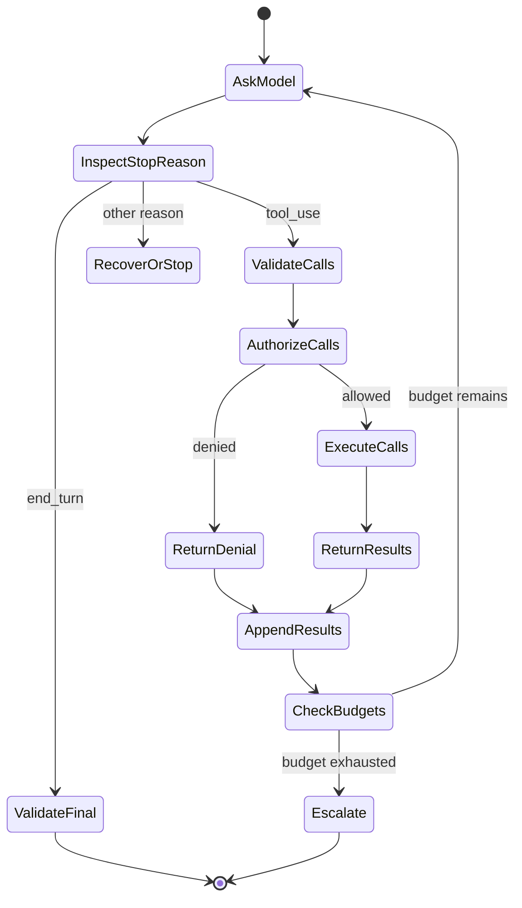

> 🇰🇷 이 문서는 한국어 번역본입니다(ELI5 스타일). 원문: [en.md](en.md)

# 도구 루프는 통제된 위임입니다

> Claude가 작업을 제안할 수는 있습니다. 하지만 그 요청을 검증하고, 권한을 부여하고, 결과를 관찰하고, 루프를 계속할지 결정하는 것은 여러분의 애플리케이션입니다.

**유형:** 빌드(Build)
**언어:** Python
**선수 지식:** [Messages API는 상태 기계입니다](../../08-messages-api-and-application-lifecycle/), [구조화된 출력은 신뢰할 수 없는 계약입니다](../../09-structured-output-and-defensive-parsing/)
**시간:** 약 130분

## 학습 목표

- 전체 `tool_use`/`tool_result` 프로토콜 루프를 구현합니다
- 목적에 맞게 좁힌 도구 계약을 설계하고 실행 경계를 선택합니다
- 모델의 도구 '선택'과 결정론적인 '권한 확인'을 분리합니다
- 직접 작성한 루프, SDK Tool Runner, 관리형 에이전트를 비교합니다
- 실패를 타입이 붙은 결과로 반환하고, 실행에 도움이 되는 런타임 이벤트를 소비합니다
- 자율성에 한계를 두고, 경로가 정해져 있을 때는 고정된 워크플로를 선택합니다

## 결제를 두 번 반복하는 에이전트

청구(billing) 어시스턴트가 "중복 결제 환불해 줘"라는 요청을 받았다고 합시다. Claude가 `issue_refund` 도구를 요청하고, 애플리케이션이 이를 실행합니다. 그런데 최종 텍스트가 도착하기 전에 응답 연결이 끊어집니다. 애플리케이션이 턴 전체를 다시 시도하면 Claude는 같은 도구를 또 요청하고, 고객은 환불을 두 번 받게 됩니다.

문제는 모델이 도구를 사용했다는 사실이 아닙니다. 애플리케이션이 '언어 생성'과 '거래(transaction) 제어'를 혼동한 것입니다.

신뢰할 수 있는 도구 루프에는 두 가지 계약이 있습니다:

1. 모델은 구조화된 인자와 함께 이름이 붙은 기능을 '제안'할 수 있습니다.
2. 그 기능을 실행할지, 어떻게 실행할지, 최대 몇 번까지 실행할지는 결정론적인 애플리케이션 코드가 결정합니다.

도구 사용은 Claude에게 손을 뻗을 수 있는 범위를 주지만, 권한을 주지는 않습니다.

## 프레임워크보다 먼저 만나는 와이어 수준의 계약

클라이언트 도구는 요청 안에 선언합니다. 각 선언은 모델에게 이름, 설명, JSON Schema 입력 계약을 제공합니다.

```json
{
  "name": "lookup_order",
  "description": "Look up one order by its exact public order ID. Returns status and last update. This tool never changes an order.",
  "input_schema": {
    "type": "object",
    "required": ["order_id"],
    "additionalProperties": false,
    "properties": {
      "order_id": {
        "type": "string",
        "description": "Order ID in the form A-12345"
      }
    }
  }
}
```

Claude는 다음처럼 응답할 수 있습니다:

```json
{
  "stop_reason": "tool_use",
  "content": [
    {
      "type": "tool_use",
      "id": "toolu_7f3",
      "name": "lookup_order",
      "input": {"order_id": "A-12345"}
    }
  ]
}
```

여러분의 클라이언트는 이 어시스턴트 콘텐츠 전체를 그대로 보존한 채 도구를 검증하고 실행한 뒤, 다음을 이어 붙입니다:

```json
{
  "role": "user",
  "content": [
    {
      "type": "tool_result",
      "tool_use_id": "toolu_7f3",
      "content": "{\"found\":true,\"status\":\"in_transit\"}"
    }
  ]
}
```

이 짝을 이루는 ID는 장식이 아닙니다. 하나의 결과를 하나의 요청과 연결해 주는 열쇠입니다. 프로토콜이 기대하는 대화 기록에서 어시스턴트 메시지는 반드시 결과 시퀀스 바로 앞에 있어야 합니다.

최신 SDK와 API 형태는 [클라이언트 도구 구현하기](https://platform.claude.com/docs/en/agents-and-tools/tool-use/implement-tool-use) 문서를 참고하세요.

## 루프는 명시적인 상태를 가집니다



모든 전이는 실패할 수 있습니다. 응답이 도구 ID를 빠뜨릴 수도 있고, 도구 이름을 알 수 없을 수도 있고, 인자가 스키마를 어길 수도 있고, 권한 확인이 호출을 거부할 수도 있고, 핸들러가 시간 초과될 수도 있고, 결과가 너무 클 수도 있고, Claude가 또 다른 도구를 요구할 수도 있으며, 최종 답변이 출력 계약을 지키지 못할 수도 있습니다.

이 상태들을 하나의 넓은 `try/except`와 만능 재시도 뒤로 숨기지 마세요. 실패를 분류하고, 실패 유형별로 복구 방법을 선택해야 합니다.

## 도구 설계는 곧 인터페이스 설계입니다

Claude는 인터페이스만 보고 도구를 고릅니다. 사람이 핸들러 코드를 읽지 않고도 각 도구를 언제 써야 하는지 알 수 있어야 합니다.

### 도구 하나에는 역할 하나만

`manage_customer`는 너무 모호합니다. 검색일 수도, 수정일 수도, 환불일 수도, 계정 정지일 수도, 삭제일 수도 있으니까요. 좁게 나눈 카탈로그가 선택하기도 쉽고 보안상으로도 관리하기 쉽습니다:

- `get_customer_profile`
- `list_customer_invoices`
- `propose_refund`
- `issue_approved_refund`

'제안'과 '실행'을 나누는 것이 중요합니다. 위험이 낮은 도구는 제안 금액을 계산할 수 있습니다. 위험이 높은 도구는 모델 밖에서 생성된, 인증된 승인 토큰을 요구해야 합니다.

### 내부 문서가 아니라 선택용 설명을 작성하세요

쓸모 있는 설명은 도구가 무엇을 하는지, 언제 쓰는지, 언제 쓰면 안 되는지, 결과가 무엇을 의미하는지 알려 줍니다. API 매뉴얼 전체를 복사해 붙여 넣는 것이 아닙니다.

나쁜 예:

```text
Calls GET /v3/orders/{id} in the Commerce service.
```

더 나은 예:

```text
Read the current status of one existing order from the commerce system.
Use only when the user supplies an exact order ID. This tool is read-only.
Do not use it to search by email or to modify shipment details.
```

설명 안에 예시를 넣으면 까다로운 형식을 명확히 할 수 있습니다. 하지만 모든 토큰은 도구 카탈로그와 함께 매번 반복됩니다. 예시가 선택 정확도를 충분히 끌어올려 컨텍스트 비용을 감수할 가치가 있는지 측정해 보세요.

### 잘못된 호출을 아예 표현하기 어렵게 만드세요

enum(열거형), 필수 필드, 값 범위, `additionalProperties: false`를 활용하세요. 서로 배타적인 모드는 분리하세요. 좁은 범위의 도메인 값으로 충분한데 굳이 자유 형식의 셸 명령, SQL, URL, 파일 시스템 경로를 받지 마세요.

스키마는 생성을 '안내'할 뿐입니다. 검증은 여전히 핸들러의 몫입니다. 스키마에서 생성되었다는 이유만으로 모델이 만든 입력을 안전하다고 가정하면 안 됩니다.

## 도구 카탈로그는 작고 서로 구별되게 유지하세요

도구를 많이 만든다고 능력이 늘어나는 것은 아닙니다. 이름이 서로 겹치거나 카탈로그가 길면 선택이 모호해지고 컨텍스트만 소모됩니다.

현실적인 작업에 필요한 최소한의 도구로 시작하세요. 평가(eval)에서 능력 공백이 보이면 도구를 추가하고, 실행 궤적에서 혼란이 보이면 도구를 없애거나 합치세요.

다음 질문들을 활용하세요:

- 두 도구가 이름과 설명만 보면 서로 바꿔 쓸 수 있어 보이는가?
- 범용 코드 또는 CLI 도구가 샌드박스 안에서 이미 이 작업을 해낼 수 있는가?
- 에이전트가 매 턴마다 이 능력이 필요한가?
- 이 능력을 스킬에 넣어 두고 관련 있을 때만 불러올 수는 없는가?
- 메인 에이전트가 아니라 별도의 서브에이전트가 이 도구를 가져야 하는가?
- 표준화된 MCP 서버로 만들면 여러 호스트가 안전하게 공유할 수 있는가?

도구 개수는 아키텍처 점수가 아닙니다. 정확한 선택과 통제된 실행이 아키텍처의 점수입니다.

## 권한 확인은 검증 다음에 이루어집니다

안전한 실행 경계는 다음 순서를 따릅니다:

1. 허용 목록(allowlist)으로 도구 이름을 확인합니다.
2. 입력 타입과 값 범위를 검증합니다.
3. 인증된 신원과 테넌트 컨텍스트는 인자가 아니라 애플리케이션 쪽에서 묶어 줍니다.
4. 기능 범위와 리소스 소유권을 확인합니다.
5. 중대한 결과를 낳는 작업에는 승인을 요구합니다.
6. 멱등성(idempotency), 시간 초과, 호출 빈도, 크기 제한을 적용합니다.
7. 사용 가능한 가장 좁은 샌드박스에서 실행합니다.
8. 결과를 Claude나 로그로 보내기 전에 민감한 값을 마스킹합니다.

도구 인자에 `user_id`가 들어 있다면 이를 신원으로 믿으면 안 됩니다. 인증된 세션과 비교하거나, 아예 모델의 통제 범위에서 제거하세요.

변경(쓰기) 작업의 승인 기록에는 사용자, 작업, 정규화된 인자, 만료 시각, 작업 ID가 함께 묶여 있어야 합니다. 대화 텍스트 속 "아까 유저가 yes라고 했어요"는 안전한 승인 토큰이 아닙니다.

## 실패는 결과로 돌려보내세요

핸들러가 실패했다고 해서 곧바로 애플리케이션 전체가 죽는 것은 아닙니다. Claude가 간결하고 사실적인 도구 결과를 받으면 스스로 복구할 수 있습니다.

```json
{
  "type": "tool_result",
  "tool_use_id": "toolu_7f3",
  "is_error": true,
  "content": "Order service timed out. No order state was changed. Retry is allowed once."
}
```

좋은 에러 내용은 모델에게 다음을 알려 줍니다:

- 무엇이 실패했는지.
- 부수 효과(사이드 이펙트)가 있었는지.
- 재시도가 안전한지.
- 어떤 수정이 가능한지.

스택 트레이스, 환경 변수 값, 데이터베이스 쿼리, 접근 토큰, 내부 호스트명을 노출하지 마세요. 이런 값은 마스킹과 접근 제어가 걸린 보호된 텔레메트리에만 보관하세요.

검증 실패에는 필드 경로를 담을 수 있습니다. 반면 정책 거부는 모델이 우회로를 찾도록 유도해서는 안 됩니다. "이 에이전트는 환불을 처리할 수 없습니다" 같은 거부가 보안 규칙을 하나하나 나열하는 것보다 안전합니다.

모르는 도구가 들어오면 설계에 따라 연관 ID가 붙은 에러 결과로 처리하거나 터미널 프로토콜 에러로 처리하세요. 모델이 지목한 핸들러 이름을 동적으로 import해서 실행하는 일은 절대 없어야 합니다.

## 여러 도구 호출과 병렬 실행

Claude는 한 응답에서 도구를 두 개 이상 요구할 수 있습니다. 병렬로 실행해도 되는 경우는 서로 독립적이고, 읽기 전용이며, 순서를 바꿔도 안전할 때뿐입니다.

두 개의 검색은 보통 동시에 돌려도 됩니다. 하지만 "송장 생성" 다음 "송장 발송"은 의존 관계가 있으므로 반드시 순차 실행해야 합니다. 같은 레코드에 두 번 쓰기는 충돌할 수 있습니다. 결제와 이메일 발송은 트랜잭션이나 보상(compensating) 워크플로가 필요할 수 있습니다.

요청된 `tool_use` ID 하나하나마다 `tool_result`를 하나씩 돌려보내세요. 궤적을 재구성할 수 있을 만큼의 순서 정보는 유지하세요. 병렬 호출 중 하나가 실패하면, 배치 전체가 성공한 것처럼 꾸미지 말고 각각의 결과를 그대로 보고하세요.

제품 참고 사항(2026-08-08 확인): 자동 도구 실행과 병렬 호출을 도와주는 헬퍼 API는 SDK마다 다릅니다. 이런 헬퍼가 있다고 해서 애플리케이션의 권한 확인 책임이 없어지는 것은 아닙니다. 최신 [도구 사용 개요](https://platform.claude.com/docs/en/agents-and-tools/tool-use/overview)를 확인하세요.

## 에이전트에 한계를 두세요

에이전트 루프에는 `end_turn` 외에도 종결 조건이 필요합니다:

- 모델 턴 최대 횟수.
- 도구 호출 최대 횟수(전체 및 도구별).
- 실제 시간 기준 마감.
- 토큰 및 금액 예산.
- 연속 에러 최대 횟수.
- 동일한 호출의 반복 최대 횟수.
- 사용자 취소.
- 사람의 승인 필요.
- 검증된 최종 상태 조건.

최종 상태 조건은 "응답이 그럴듯하게 끝났는가"를 묻는 것보다 훨씬 강력합니다. 배포 에이전트는 "배포했다"고 말했을 때가 아니라 기대한 버전이 실제로 정상 동작할 때 성공한 것입니다. 리서치 에이전트는 긴 보고서를 뽑아냈을 때가 아니라 요구된 주장들에 확인 가능한 출처가 붙었을 때 성공한 것입니다.

궤적을 기록하세요: 프롬프트 버전, 모델, 중단 사유(stop reason), 도구 이름, 정규화된 인자 지문(fingerprint), 판단, 지연 시간, 결과 분류, 상태 변화. 민감한 값은 마스킹합니다.

## 워크플로인가, 에이전트인가

단계와 분기가 정해져 있으면 고정된 워크플로를 쓰고, 경로가 관찰 결과에 따라 달라지며 모델이 도구 사이에서 골라야 한다면 에이전트를 쓰세요.

| 작업 | 더 나은 기본값 | 이유 |
|---|---|---|
| 필드 추출, 검증, 저장 | 워크플로 | 순서가 정해져 있고 계약이 명확함 |
| 분류 후 하나의 큐로 라우팅 | 워크플로 | 분기 집합이 유한함 |
| 낯선 저장소의 결함 조사 | 에이전트 | 탐색 경로가 조사 결과에 따라 달라짐 |
| 확인된 중복 결제에 대한 환불 | 승인이 붙은 워크플로 | 중대한 작업이며 통제 수단이 명확함 |
| 계속 바뀌는 내부 시스템에서 증거 수집 | 한계가 있는 에이전트 | 어떤 도구를 쓸지 빠진 증거에 따라 달라짐 |

자율성이 정당해지려면 작업이 가치 있고, 환경이 도구에 접근 가능하며, 실수를 감지할 수 있고, 복구가 가능해야 합니다. 에러를 감지할 수 없다면 에이전트 턴을 더 붙이는 것은 위험을 감추기만 합니다.

## 루프를 얼마나 직접 소유할지 선택하세요

워크플로 판정을 통과했다면, 운영 요구사항을 만족하는 가장 작은 하네스(실행 틀)를 고르세요.

| 런타임 | 이것이 처리하는 것 | 애플리케이션이 여전히 처리해야 하는 것 | 이럴 때 선호 |
|---|---|---|---|
| 직접 작성한 Messages 루프 | 여러분이 구현한 프로토콜 작업만 | 전체 기록, 중단 사유, 스키마와 정책, 실행, 재시도, 예산, 추적, 복구 전부 | 와이어 수준의 제어, 제한된 런타임, 커스텀 상태 기계가 필요하거나 프로토콜 학습과 테스트가 목적일 때 |
| SDK Tool Runner | 도구 선언 헬퍼, `tool_use`/`tool_result` 순서 관리, 메시지 상태 갱신, (선택) 턴별 스트리밍 | 권한 확인, 샌드박스, 멱등성, 에러 공개 방식, 반복 한도, 관측 가능성, 최종 상태 증명 | 지원되는 SDK가 맞고, 클라이언트 도구를 여전히 애플리케이션 통제 아래 실행할 수 있을 때 |
| Claude 관리형 에이전트(Managed Agents) | 설정된 샌드박스, 내장 도구, 이벤트 기반 실행을 갖춘 원격 에이전트/세션/환경 하네스 | 에이전트 구성, 데이터 경계 승인, 커스텀 도구 실행, 확인 판단, 이벤트 저장, 비즈니스 권한 판단, 결과 검증 | 관리형 세션과 샌드박스 경계가 필요하고 현재의 베타·플랫폼·이벤트 계약을 수용할 수 있을 때 |

이 레슨의 코드는 의도적으로 첫 번째 선택지로 작성되었습니다. 모든 전이가 그대로 드러납니다. 이 코드를 [Tool Runner](https://platform.claude.com/docs/en/agents-and-tools/tool-use/tool-runner)로 옮기면 반복적인 루프 배관 코드는 사라지지만, 환불이 안전해지는 것은 아닙니다. 반복 한도를 정하고, 도구 실행을 가로채거나 감싸고, 애플리케이션의 승인 절차를 유지하며, 최종 상태를 검증하세요.

제품 참고 사항(2026-08-09 확인): [Claude 관리형 에이전트](https://platform.claude.com/docs/en/managed-agents/overview)는 현재 퍼블릭 베타 상태이며 버전이 붙은 베타 계약을 사용합니다. 관리형 에이전트, 환경, 세션, 내장 도구, SSE(server-sent event, 서버 전송 이벤트) 스트리밍을 제공합니다. 헤더, 리소스, 이벤트 타입, 도구셋, 제한, 프로바이더 가용성은 언제든 바뀔 수 있는 것으로 취급하세요. 작업 이름에 "에이전트"가 붙었다는 이유만으로 이것을 선택하면 안 됩니다.

관리형 에이전트 연동은 '이벤트 소비자'이지 최종 텍스트를 한 번 받는 호출이 아닙니다. 애플리케이션은 사용자 이벤트를 보내고, 저장된 세션·에이전트 이벤트를 소비하며, 상태를 추적합니다. 커스텀 도구 호출이나 권한 게이트가 있는 도구는 세션을 `requires_action` 상태로 멈출 수 있고, 애플리케이션은 참조된 이벤트 ID에 결과나 확인 판단을 담아 응답합니다. SSE 연결이 닫혔다는 것이 성공을 의미하지는 않습니다. 저장된 이벤트와 최종 상태를 대조하세요. 레슨 12에서 이 경계를 오프라인 이벤트 픽스처 기반으로 구현하며, 최신 문서는 [세션 이벤트 스트림](https://platform.claude.com/docs/en/managed-agents/events-and-streaming)입니다.

## 퍼스트파티(자체 제공)라도 실행 경계는 하나가 아닙니다

기능은 '코드와 데이터가 어디에서 실행되는지', '누가 권한을 주는지', '어떻게 발견되는지'로 분류하세요.

| 표면(실행 지점) | 실행·데이터 경계 | 이럴 때 사용 | 이렇게 가정하지 말 것 |
|---|---|---|---|
| Messages 서버 도구 | Anthropic이 웹 검색, 웹 페치, 코드 실행, 도구 검색 같은 지원 도구를 대신 실행 | 제공자 쪽 실행과 데이터 정책이 맞는, 지원되는 퍼스트파티 기능 | 평소라면 애플리케이션이 클라이언트 `tool_use`를 받아 실행한다고 가정 |
| Anthropic 스키마 클라이언트 도구 | Anthropic이 학습된 스키마를 정의하고, 애플리케이션이 bash, 텍스트 에디터, 메모리, 컴퓨터 사용 같은 도구를 실행 | 표준 스키마가 모델 친숙도를 높여 주지만 실행은 클라이언트가 책임져야 하는 일반 작업 | 퍼스트파티 스키마라면 제공자가 실행하거나 자동으로 권한을 준다고 가정 |
| 관리형 에이전트 내장 도구 | 설정된 관리형 또는 셀프호스팅 에이전트 환경이 자신의 도구셋을 실행 | 그 런타임의 샌드박스와 권한 정책에 맞는 저장소·웹 작업 | 도구셋을 켜면 비즈니스 권한이 주어지거나 확인 작업이 사라진다고 가정 |
| 커스텀 클라이언트 도구 | 애플리케이션이 자신의 JSON Schema 계약을 검증하고 실행 | 사내 비즈니스 작업, 좁은 도메인 API, 정확한 애플리케이션 정책 | 스키마에 맞는 입력이 곧 신원·권한·멱등성의 증거라고 가정 |
| 스킬(Skill) | 지원되는 런타임이 재사용 가능한 지침, 참고 자료, 스크립트, 애셋을 불러옴 | 관련 있을 때만 공개되어야 하는 절차 | 스킬 자체가 실행·권한 경계라고 가정 |
| MCP | MCP 클라이언트 또는 커넥터가 표준화된 외부 서버를 호출 | 명시적인 서버·신원·전송 경계를 갖춘 채 여러 호스트가 공유하는 기능이나 컨텍스트 | 서버를 발견(discovery)했다고 해서 반환된 모든 도구가 안전하거나 관련 있다고 가정 |

스킬과 도구는 대체재가 아니라 흔히 상호 보완적입니다. 환불 검토 스킬이 절차를 가르치고, 커스텀 클라이언트 도구가 승인된 작업을 노출하는 식입니다. 여러 호스트가 같은 표준 인터페이스를 필요로 한다면 MCP가 그 작업을 운반할 수 있습니다. 제공자가 실행하는 서버 도구는 네트워크, 데이터 보존, 결과 의미 체계가 데이터에 맞을 때만 선택하세요. Anthropic 스키마 클라이언트 도구는 샌드박스와 작업 검증기가 실행할 준비가 되었을 때만 선택하세요.

현재의 실행 카테고리는 [도구 사용의 동작 방식](https://platform.claude.com/docs/en/agents-and-tools/tool-use/how-tool-use-works)에 문서화되어 있고, 관리형 하네스에는 별도의 [도구 구성](https://platform.claude.com/docs/en/managed-agents/tools) 문서가 있습니다. 버전과 모델 호환성은 바뀌므로, 선택한 도구 유형과 버전을 추적 기록에 함께 저장하세요.

## 루프 만들어 보기

`code/main.py`는 도구 레지스트리와 날것의(raw) 루프를 구현합니다. 여러 호출, 스키마 검사, 변경 도구 승인, 핸들러 에러, 모르는 도구, 연관 ID, 턴 예산을 지원합니다. 오프라인 판단 실험실은 명시된 요구사항을 바탕으로 워크플로, 직접 작성한 루프, SDK Tool Runner, 관리형 에이전트 중 하나를 별도로 선택합니다. 또한 스킬을 도구인 것처럼 취급하지 않고, 실행 표면을 선택적 스킬과 조합합니다.

```bash
cd certifications/claude/lessons/10-tool-use-and-agentic-loops/code
python3 main.py
python3 -m unittest discover tests -v
```

데모가 출력하는 트랜스크립트(실행 기록)를 읽어 보세요. 어시스턴트의 `tool_use` 블록과 그다음 user의 `tool_result`를 찾으세요. 그다음, 뒤에 출력되는 판단 픽스처를 살펴보세요. 관리형 에이전트 케이스에서 베타를 수용하지 않도록 바꿔서, 어떤 런타임도 시작되기 전에 판단이 실패하게 만들어 보세요. 프로토콜과 아키텍처의 정확성은 '가정'이 아니라 '눈으로 확인'되어야 합니다.

## 인터랙티브 실습

도구 루프 피겨를 이용해 턴, 도구 호출, 시간, 승인 예산을 배분해 보세요. 반복 호출이나 거부된 변경을 일으키고, 어떤 결정론적 종결 조건이 루프를 멈추는지 관찰하세요.

```figure
10-tool-loop-budget
```

## 연습 실습

도구 루프를 실행한 뒤, 모르는 도구, 잘못된 인자, 거부된 변경, 여러 호출, 핸들러 에러, 소진된 턴 예산을 하나씩 테스트해 보세요. 모든 결과가 자신의 도구 사용 ID를 그대로 유지하는지 확인하세요. 다음으로, 제공자 서버 도구, Anthropic 스키마 클라이언트 도구, 사내 커스텀 도구, 스킬 기반 절차, MCP 서비스를 실행 경계와 권한 소유자 기준으로 분류해 보세요.

## 완성된 산출물

`outputs/tool-loop-transcript.json`은 `demo()`가 만든, ID가 연관된 완성된 실행 트랜스크립트입니다. `outputs/runtime-and-tool-surface-decisions.json`은 날짜가 기록된, 특정 공급업체에 치우치지 않은 4개 런타임 × 4가지 기능 조합 비교입니다. `python3 main.py`를 실행해 둘 다 살펴보고, 유닛 테스트 스위트를 실행해 산출물, 스키마 경계, 승인 거부, 런타임 게이트, 실행 경계, 핸들러 실패, 폭주 방지를 검증하세요.

## 확인하기

```bash
cd certifications/claude/lessons/10-tool-use-and-agentic-loops/code
python3 main.py
python3 -m unittest discover tests -v
```

## 캡스톤 연계

퀴즈는 제안과 권한의 구분, 도구 설명, 멱등성, 병렬화, 최종 상태 검사, 워크플로 선택을 평가합니다. 검증된 트랜스크립트를 도구 경계의 증거로 삼아 Developer 캡스톤 30과 Architect 캡스톤 31, 32로 가져가세요.

## 시험 판단 규칙

- Claude의 도구 선택은 제안일 뿐, 결코 권한이 아닙니다.
- 정책보다 스키마를 먼저, 실행보다 정책을 먼저 검증합니다.
- 도구가 언제 적용되는지를 구별해 주는 좁은 이름과 설명을 사용합니다.
- 복구가 안전할 때는 간결하고 연관 ID가 붙은 에러를 반환합니다.
- 재시도 가능한 부수 효과에는 멱등성이나 대조(reconciliation)를 요구합니다.
- 순서가 중요하지 않은 독립적인 호출만 병렬화합니다.
- 예산 소진, 반복 호출, 취소, 인식되지 않은 제어 상태에서는 중단합니다.
- 경로가 이미 정해져 있으면 결정론적인 워크플로를 선호합니다.
- 클라이언트 실행이 맞고 커스텀 와이어 제어가 가치를 더하지 않으면 SDK Tool Runner를 선호합니다.
- 관리형 에이전트는 구체적인 관리형 런타임 요구사항과 수용 가능한 베타·데이터 경계가 있을 때만 선택합니다.
- 관리형 세션은 이벤트 상태 기계로 다룹니다. `requires_action`은 이벤트 ID로 해결하고, 끊긴 스트림에서 성공을 추정하지 않습니다.
- 서버 실행 도구, Anthropic 스키마 클라이언트 도구, 관리형 내장 도구, 커스텀 클라이언트 도구를 실행 위치로 구분합니다.
- 스킬은 절차로, MCP는 연결 경계로 다룹니다. 어느 쪽도 권한을 부여하지 않습니다.
- 최종 문장만 보지 말고 도구 궤적과 최종 상태를 평가합니다.

## 연습 문제

1. 필수 승인 토큰이 있는 `issue_refund`를 추가하세요. 대화 텍스트가 그 토큰을 대체할 수 없음을 증명해 보세요.
2. 한 응답에 읽기 전용 호출 두 개를 넣고 동시에 실행하세요. 결정론적인 결과 연관을 유지하세요.
3. 한 도구가 부수 효과를 일으킨 뒤 시간 초과되게 만들어 보세요. 재시도 전에 멱등성 키와 대조 검사를 추가하세요.
4. 같은 정규화된 도구 요청이 두 번 나타나면 멈추는 반복 호출 감지기를 추가하세요.
5. 사내 커스텀 도구 하나를 두 호스트가 공유하는 MCP 기능으로 다시 만들어 보세요. 인증, 동의, 결과 필터링, 가용성 책임 중 무엇이 서버 경계로 옮겨가고 무엇이 각 호스트에 남는지 식별하세요.

## 더 읽을거리

- [도구 사용 개요](https://platform.claude.com/docs/en/agents-and-tools/tool-use/overview)
- [클라이언트 도구 구현하기](https://platform.claude.com/docs/en/agents-and-tools/tool-use/implement-tool-use)
- [도구 에러 다루기](https://platform.claude.com/docs/en/agents-and-tools/tool-use/implement-tool-use#handling-tool-use-and-tool-result-content-blocks)
- [Tool Runner](https://platform.claude.com/docs/en/agents-and-tools/tool-use/tool-runner)
- [도구 사용의 동작 방식](https://platform.claude.com/docs/en/agents-and-tools/tool-use/how-tool-use-works)
- [Claude 관리형 에이전트](https://platform.claude.com/docs/en/managed-agents/overview)
- [세션 이벤트 스트림](https://platform.claude.com/docs/en/managed-agents/events-and-streaming)
- [관리형 에이전트 도구](https://platform.claude.com/docs/en/managed-agents/tools)
- [효과적인 에이전트 만들기](https://www.anthropic.com/research/building-effective-agents)
- [중단 사유 다루기](https://platform.claude.com/docs/en/build-with-claude/handling-stop-reasons)
