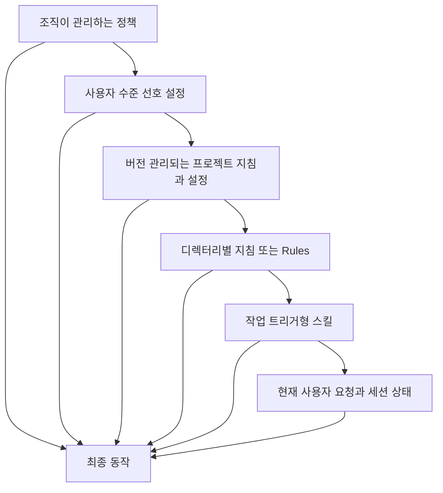

> 🇰🇷 이 문서는 한국어 번역본입니다(ELI5 스타일). 원문: [en.md](en.md)

# Claude Code는 공유된 제약으로 확장됩니다

> 팀에게 필요한 것은 거대한 프롬프트 하나가 아닙니다. 작은 프로젝트 계약, 재사용 가능한 절차, 결정론적 검사, 버전 관리되는 설정이 필요합니다.

**유형:** Learn
**언어:** Python
**선수 지식:** [에이전트 SDK는 하네스이지 허가가 아닙니다](../../12-claude-agent-sdk-and-hooks/), [평가(eval)는 에이전트 행동을 엔지니어링 증거로 바꿉니다](../../14-evals-testing-debugging-and-observability/)
**시간:** 약 170분

## 학습 목표

- 프로젝트 온보딩 역할을 하는 간결한 `CLAUDE.md` 설계하기
- 지침, 설정, Rules(규칙), 스킬, 에이전트, 훅(hook), MCP 설정을 올바른 범위(scope)에 배치하기
- 승인 경계를 잃지 않으면서 권한 모드, 컨텍스트 복구, 목표(goal), 루프(loop), 워크트리(worktree), 예약 작업 다루기
- 모델, 프롬프트, 플러그인, 팀 설정 변경 사항 버전 관리하기
- 검토 없이 배포하는 존재가 아니라, 경계가 있는 기여자로서 Claude Code를 CI에 통합하기
- 산출물, 테스트, 트레이스, 복구 지점을 통해 팀 워크플로 평가하기

## 900줄짜리 지침 파일

팀은 모든 정정 사항을 `CLAUDE.md`에 추가합니다. 그러다 보면 이 파일 안에 아키텍처 역사, API 문서, 스타일 의견, 릴리스 절차, 보안 규칙, 예제, 문제 해결 방법, 작업별 플레이북이 전부 뒤섞입니다.

Claude는 매 세션마다 이 파일을 읽습니다. 중요한 명령어가 낡은 문장들과 뒤섞여 경쟁합니다. 파일이 너무 커서 개발자들은 변경 사항 검토를 포기합니다. 오래된 한 줄이 이미 폐기된 테스트 명령어를 쓰라고 하고, 에이전트는 잘못된 테스트 스위트를 돌린 뒤에도 성공했다고 계속 보고합니다.

이 팀은 메모리를 만든 것이 아니라, 컨텍스트 부채를 만든 것입니다.

`CLAUDE.md`는 정확한 온보딩 스크립트처럼 동작해야 합니다. 이 저장소가 무엇인지, 어떻게 둘러보는지, 어떻게 빌드하고 테스트하는지, 어떤 제약이 자명하지 않은지, 더 깊은 문서가 어디에 있는지를 담아야 합니다.

## 정보는 가장 좁은 지속 범위에 두기

Claude Code는 여러 범위에서 설정과 지침을 불러올 수 있습니다. 정확한 계층 구조와 파일 이름은 제품 세부 사항이지만, 설계 원칙은 변하지 않습니다. 넓은 정책은 넓은 범위에 두고, 프로젝트 사실은 저장소에 두며, 작업 절차는 관련 있을 때만 불러옵니다.



넓은 수준의 통제가 프로젝트 작업에 의해 쉽게 약해져서는 안 됩니다. 좁은 지침을 전역으로 복사해서도 안 됩니다. 정확한 우선순위, 관리 정책 위치, 임포트, 탐색 동작은 설치된 버전마다 다르므로 현재 버전의 [Claude Code 설정](https://code.claude.com/docs/en/settings) 및 [메모리](https://code.claude.com/docs/en/memory) 문서를 확인하세요.

여러 출처가 충돌할 때는 우선순위를 눈에 보이게 만드세요. 서로 모순되는 두 문장을 남겨 두고 모델이 더 안전한 쪽을 고르기를 바라는 방식에 의존하지 마세요.

## 간결한 CLAUDE.md 작성하기

Claude가 반복적으로 필요로 하는 사실부터 시작합니다:

```markdown
# Repository guide

## Purpose
This repository is a Python service that routes support tickets.

## Commands
- Install: `python3 -m venv .venv && .venv/bin/pip install -r requirements.txt`
- Focused tests: `python3 -m unittest discover tests -v`
- Full validation: `./scripts/validate.sh`

## Layout
- `src/`: application code
- `tests/`: unit and integration tests
- `docs/architecture.md`: boundaries and decision records

## Constraints
- Never commit credentials or `.env` files.
- Preserve public API compatibility unless the task explicitly changes it.
- Require explicit approval before deployment or external messages.
```

포함할 것:

- 목적과 기술 스택.
- 표준으로 쓰는 빌드, 테스트, 린트, 실행 명령어.
- 중요한 디렉터리 지도.
- 이 저장소만의 스타일 또는 아키텍처 규칙.
- 안전 및 외부 공개 동작의 경계.
- 더 깊은 내용을 담은 권위 있는 문서로 가는 링크.

빼야 할 것:

- Claude가 이미 알고 있는 뻔한 조언.
- API 레퍼런스 전문.
- 임시 작업 상태.
- 시크릿이나 환경 변수 값.
- 특수한 워크플로 하나에서만 쓰는 지침.
- 강제되지도 검토되지도 않는 규칙.

작게 시작하세요. 같은 정정이 여러 세션에 걸쳐 반복되면, 그것이 `CLAUDE.md`에 속하는지, Rule에 속하는지, 스킬, 훅, 테스트, 아니면 실제 코드에 속하는지 판단하세요. "항상 포매터를 실행하라"는 요구에 대한 가장 강력한 해결책은 문장을 한 줄 더 추가하는 것이 아니라, 편집 뒤에 도는 훅과 CI 검사일 수 있습니다.

## Rules, 스킬, 커맨드, 에이전트

이 네 가지는 저마다 다른 문제를 풉니다.

### Rules

파일군이나 저장소의 특정 영역에 적용되는 제약은 Rules나 디렉터리 범위 지침에 두세요. 프론트엔드 규칙이 데이터베이스 마이그레이션을 편집하는 동안 컨텍스트를 잠식해선 안 됩니다.

각 규칙은 일관성 있고 검증 가능하게 유지하세요. 어떤 메커니즘으로 무엇이 원천(source of truth)인지 명시하세요. 같은 지침을 루트 파일과 디렉터리 파일에 중복해서 넣으면 어긋남이 피할 수 없이 생기므로 피하세요.

### 스킬

스킬은 재사용 가능한 절차, 참고 자료, 스크립트, 에셋을 하나로 묶습니다. 짧은 설명 덕분에 Claude가 전체 자료를 언제 불러올지 판단할 수 있습니다.

데이터베이스 마이그레이션 검토, 릴리스 노트 작성, 보안 위협 모델링, 표준 문서 스타일 같은 작업에는 스킬을 활용하세요. 핵심 세션 프롬프트는 작게 유지하고, 스킬은 저장소와 함께 또는 승인된 배포 방식으로 버전 관리하세요.

핵심 이점은 점진적 공개(progressive disclosure)입니다. 항상 로드되면서 핸드북 전체를 담고 있는 스킬은 그냥 또 하나의 시스템 프롬프트일 뿐입니다.

### 커맨드

커맨드는 사용자가 직접 실행하는 워크플로를 명시적으로 제공합니다. `/release-check`나 `/review-migration`처럼 개발자가 의도적으로 시작해야 하는 작업에 적합합니다.

커맨드 인자는 신뢰할 수 없는 입력으로 취급하세요. 커맨드가 도구 권한 확인이나 승인 절차를 우회하지 않습니다.

### 에이전트

커스텀 에이전트나 서브에이전트는 격리된 역할, 도구 집합, 지침을 정의합니다. 독립적인 검토, 좁은 전문성, 소유권이 나뉜 병렬 작업에 활용하세요.

읽기 전용 검토자에게 편집·배포 도구가 상속되어선 안 됩니다. 독립성이 중요하다면 생성자와 평가자가 숨겨진 추론까지 공유하게 해서도 안 됩니다.

제품 참고(2026-08-09 확인): 정확한 파일시스템 위치, frontmatter 필드, 커맨드 동작, 에이전트 설정은 계속 바뀝니다. 최신 [Claude Code 문서](https://code.claude.com/docs/en/overview)를 확인하고, 저장소 예제에는 대상 버전을 표시하세요.

## 설정은 코드입니다

팀 설정은 권한, 환경, 훅, 모델 동작, MCP 서버, 플러그인 등 제품의 여러 기능을 제어합니다. 프로덕션(운영 환경) 코드를 리뷰하듯 검토하세요.

범위를 나누세요:

- 협상 불가능한 제한은 조직 정책으로.
- 공유할 안전한 기본값은 커밋된 프로젝트 설정으로.
- 커밋하면 안 되는 머신별 경로나 실험은 로컬 설정으로.
- 시크릿 이름과 배포별 값은 환경 변수로.

토큰을 설정 파일 안에 커밋하지 마세요. deny 패턴이 샌드박스라고 가정하지 마세요. 무해한 픽스처로 권한 동작을 직접 테스트하세요.

설정을 바꿀 때는:

1. 의도한 동작을 명문화합니다.
2. 관련 Claude Code 버전을 고정하거나 기록합니다.
3. 좁은 범위의 인수 테스트나 수동 검증 스크립트를 추가합니다.
4. 거부되어야 하는 동작과 허용되는 동작을 각각 실행해 봅니다.
5. 실제로 병합된 최종 설정을 검토합니다.
6. 롤백 절차를 남겨 둡니다.

설정 파일이 파싱된다는 것이, 설치된 버전이 모든 키를 실제로 반영한다는 보장은 아닙니다.

## 권한 모드는 기본선을 정합니다

권한 모드는 Claude가 도구 호출을 제안했을 때 무슨 일이 일어나는지를 제어합니다. 저장소 정책을 바꾸거나, 자격 증명을 주거나, 외부 동작을 되돌릴 수 있게 만들지는 않습니다.

제품 참고(2026-08-09 확인): 현재 Claude Code 문서에 바로 이 모드들이 정리되어 있습니다. 다만 사용 가능 여부와 UI 라벨은 제품 화면, 요금제, 프로바이더, 모델, 관리자 정책, 설치된 버전에 따라 다릅니다.

| 모드 | 실질적 경계 | 적합한 용도 |
|---|---|---|
| `default` | 읽기는 진행되고, 편집과 명령어는 확인을 요구할 수 있음 | 처음 사용할 때, 민감한 저장소 |
| `acceptEdits` | 파일 편집과 일반 파일시스템 작업은 진행되고, 다른 명령어는 여전히 확인을 요구함 | diff를 보며 진행하는 로컬 코드 반복 작업 |
| `plan` | 읽기와 탐색은 진행되고, auto 모드를 쓸 수 있을 때 분류기가 승인한 명령어는 실행될 수 있으나 소스 편집은 차단됨 | 범위와 접근 방식을 먼저 승인받을 때 |
| `auto` | 별도 분류기가 행동을 평가하고, 명시적인 ask 통제는 여전히 확인을 요구할 수 있음 | 신뢰하는 방향에서의 연구 프리뷰 수준 자율성 |
| `dontAsk` | 확인을 요구할 작업은 전부 거부되고, 사전 승인된 작업만 진행됨 | 잠가 둔 CI와 스크립트 |
| `bypassPermissions` | 내장 권한 검사를 우회하되, 설정된 deny·ask·사용자 상호작용 통제는 여전히 적용됨 | 소중한 자격 증명이 없는 격리된 컨테이너나 VM |

세션에는 `--permission-mode <mode>`를 쓰고, 지원되는 환경에서는 `permissions.defaultMode` 설정을 쓰세요. 권한 규칙은 이어서 `deny`, `ask`, `allow` 패턴으로 호출 범위를 좁힙니다. 명시적인 deny·ask 규칙, 조직 커넥터 통제, 필수 사용자 상호작용은 `bypassPermissions`를 포함한 모든 모드에서 평가됩니다. 단단한 경계는 deny 규칙, 샌드박스, 자격 증명 범위, 브랜치 보호, 훅 같은 곳에 두어야 합니다. auto 모드 대화 기록이 나중에 압축으로 지워버릴 수 있는 문장 한 줄에 두는 것이 아니라요.

`acceptEdits`는 말 그대로 편집에 드는 절차가 줄어든다는 뜻일 뿐입니다. 게시, 배포, 아무 셸 명령어, 메시지 전송까지 자동 승인하지 않습니다. `auto`는 연구 프리뷰이지 안전성의 증명이 아닙니다. `bypassPermissions`는 평범한 노트북에서, 또는 세션이 Git 워크트리에 있다는 이유만으로 써서는 안 됩니다.

## 훅은 조언을 검사로 바꿉니다

결정론적인 생명주기 동작에는 훅을 사용하세요:

- 도구가 실행되기 전에 시크릿 경로 읽기를 차단합니다.
- 보호된 브랜치로의 커밋을 차단합니다.
- 외부로 내보내는 쓰기 작업에는 승인을 요구합니다.
- 편집 후 변경된 파일을 포맷합니다.
- 코드 변경 후 관련 테스트만 실행합니다.
- 도구 출력에서 민감한 내용을 가립니다.
- 감사(audit) 이벤트를 기록합니다.
- 필수 검사의 증거가 생기기 전까지는 완료 처리를 막습니다.

훅은 빠르게 유지하세요. 느린 훅은 반복해서 실행되며 대화형 지연 시간을 망칩니다. 타임아웃과 명확한 실패 동작을 정해 두세요. 보안 훅은 요청을 판단할 수 없을 때 안전한 쪽으로 실패해야(fail closed) 합니다.

Claude Code는 훅 입력을 JSON으로 전달합니다. 커맨드 훅에는 서로 다른 두 제어 경로가 있습니다:

- 구조화된 제어를 위해 종료 코드 `0`으로 끝나고 stdout에 JSON 객체 하나를 출력합니다.
- 이벤트별 차단 동작을 위해 종료 코드 `2`로 끝나고 stderr에 사유를 출력합니다.

두 경로를 섞지 마세요. Claude Code는 종료 코드가 `0`일 때만 구조화된 JSON을 처리하고, 종료 코드 `2`로 출력된 JSON은 무시합니다. 종료 코드 `1`은 대부분의 이벤트에서 블로킹하지 않는 오류라서, 정책 훅이 평범한 유닉스 실패 의미론에 의존해서는 안 됩니다.

`PreToolUse`와 `PermissionRequest`는 출력 형태도 다릅니다. `PreToolUse` 훅은 `hookSpecificOutput.permissionDecision`으로 allow, deny, ask, defer를 지정할 수 있습니다:

```json
{
  "hookSpecificOutput": {
    "hookEventName": "PreToolUse",
    "permissionDecision": "deny",
    "permissionDecisionReason": "Publishing requires a human-controlled workflow"
  }
}
```

`PermissionRequest` 훅은 Claude Code가 곧 사용자에게 확인을 요구하려는 순간, 또는 요구할 수 없어 거부해야 하는 상황에서만 실행됩니다. 중첩된 decision 객체를 사용합니다:

```json
{
  "hookSpecificOutput": {
    "hookEventName": "PermissionRequest",
    "decision": {
      "behavior": "deny",
      "message": "External publishing requires interactive human approval",
      "interrupt": false
    }
  }
}
```

allow 결정은 일치하는 deny나 ask 규칙을 덮어쓸 수 없습니다. 종료 코드 `2`는 `PreToolUse` 호출을 막고 `PermissionRequest`를 거부하지만, 이벤트마다 동작은 다릅니다. 예컨대 `PostToolUse` 훅은 동작이 이미 끝난 뒤에 실행되므로 그 동작을 되돌릴 수 없습니다. 어떤 훅이든 강제 장치로 취급하기 전에 이벤트 표를 먼저 읽으세요.

공유 훅은 적절할 때 검토된 프로젝트 코드에 두되, 제약된 에이전트가 정책을 몰래 다시 쓴 뒤 금지된 동작을 실행할 수 없음을 보장하세요. 조직 통제, 저장소 권한, 샌드박스 경계가 훅 계층을 지켜야 합니다.

## MCP와 플러그인은 설치되는 능력입니다

MCP 서버나 플러그인은 도구, 프롬프트, 훅, 에이전트, 스킬, 커맨드, 언어 처리 능력을 추가할 수 있습니다. 설치 자체가 공격 표면과 컨텍스트 표면을 바꿉니다.

팀 검토는 다음을 다뤄야 합니다:

- 게시자와 원본 저장소.
- 정확한 버전과 업데이트 정책.
- 설치되는 구성 요소.
- 도구와 파일시스템 권한.
- 네트워크 목적지.
- 요구하는 시크릿과 환경 변수.
- 헤드리스나 CI 환경에서의 동작.
- 제거와 롤백 절차.

승인된 작은 카탈로그를 선호하세요. 지원되는 곳에서는 버전을 고정하세요. 업그레이드는 대표 저장소와 평가(eval) 세트에서 먼저 테스트하세요. 검토된 로컬 스킬이면 충분한 작은 절차 하나를 쓰자고 큰 플러그인을 설치하는 일은 피하세요.

플러그인과 MCP는 서로 바꿔 쓸 수 없습니다. MCP는 외부 능력 연결을 표준화하고, 플러그인은 Claude Code 확장을 패키징하고, 스킬은 절차와 보조 자료를 담습니다. 유행이 아니라 필요에 따라 고르세요.

## 세션에는 복구 규율이 필요합니다

Claude Code 세션은 개발자가 작업을 이어가고, 조사를 분기하고, 로컬 컨텍스트를 유지하는 데 도움이 됩니다. 하지만 세션 기록이 공식 기록 장치(system of record)는 아닙니다.

중요한 작업을 이어가기 전에:

- 현재 Git 상태와 diff를 확인합니다.
- 관련 테스트를 다시 돌립니다.
- 외부에 남긴 부수 효과를 대조·정리합니다.
- 브랜치와 저장소 루트를 확인합니다.
- 대기 중인 승인을 검토합니다.
- 지침, 도구, 모델 설정이 바뀌었는지 확인합니다.

쌓인 컨텍스트가 어긋남을 만들거나, 테넌트나 기밀 유지 경계를 넘을 때는 세션을 비우거나 새로 시작하세요. 컴팩션(compaction)은 연속성을 위한 도구이지, 모든 제약이 살아남았다는 증거가 아닙니다.

저장소 정책이 허용하면 작은 복구 지점을 커밋하세요. 세션 요약은 버전 관리를 대신할 수 없습니다.

세션 커맨드는 저마다 다른 용도로 쓰세요:

| 기능 | 효과 | 쓰는 시점 |
|---|---|---|
| `/context` | 컨텍스트 윈도우를 무엇이 잡아먹는지 보여줌 | 메모리, 스킬, 도구, 메시지 비대를 진단할 때 |
| `/compact [focus]` | 이전 대화를 초점이 맞춰진 요약으로 교체함 | 히스토리를 줄이면서 같은 작업을 계속할 때 |
| 자동 컴팩션 | 한도에 가까워지면 오래된 도구 출력을 지운 뒤 요약함 | 평범한 긴 세션의 연속성 유지 |
| `/clear` | 빈 대화를 시작하며, 이전 대화는 계속 이어볼 수 있음 | 무관한 작업이나 새로운 신뢰 경계로 넘어갈 때 |
| `/rewind` 또는 `Esc` 두 번 | 코드나 대화를 체크포인트에서 복원하거나 요약함 | 추적된 편집을 되돌리거나 잘못된 대화 분기를 없앨 때 |

컴팩션은 평범한 대화 지침을 잃어버릴 수 있습니다. 프로젝트 루트의 `CLAUDE.md`와 자동 메모리는 다시 로드되고, 경로 범위 규칙은 해당 파일을 다시 읽을 때 재적용됩니다. 지속돼야 하는 제약은 버전 관리되는 설정에 두고, 컴팩션 이후에는 현재 인수 경계를 다시 한번 말해 주세요.

되감기(rewind)는 편의 기능이지 소스 컨트롤이 아닙니다. Claude Code가 직접 한 파일 편집은 추적하지만, 셸 명령어, 외부 시스템, 대부분의 서브에이전트가 만든 변경은 추적하지 않습니다. `context: fork`로 실행되는 포어그라운드 스킬은 예외로, 그들의 직접 편집은 추적됩니다. 작업을 다시 시도하기 전에 Git과 외부 상태를 확인하세요.

## 자율성은 멈추는 조건도 다릅니다

반복되는 워크플로라고 전부 같은 루프처럼 취급하지 마세요.

### 목표 세션

`/goal <조건>`은 별도의 소형 모델 평가자가 조건이 충족됐다고 판단할 때까지, 이전 턴이 끝날 때마다 다음 턴을 시작합니다. 평가자는 대화 속 증거를 읽을 뿐, 테스트를 직접 돌리거나 파일을 들여다보지는 않습니다. 측정 가능한 결과, 그것을 증명하는 명령어, 계속 참이어야 할 제약을 명시하세요. 시간이나 턴 절은 평가자에게 보이지만 단단한 실행 시간 제한은 아니므로, 하드 리밋은 목표 세션 밖에서 강제하세요.

```text
/goal tests/auth exits 0 and lint is clean, without changing fixtures, or stop after 15 turns
```

세션에는 목표를 하나만 활성화할 수 있고, `/goal clear`로 멈춥니다. 목표는 권한을 바꾸지 않으므로 default 모드에서는 여전히 확인을 요구할 수 있습니다. 목표를 auto 모드와 짝지으면 일반적인 확인 요구는 줄지만, 명시적인 ask 통제는 여전히 동작할 수 있습니다. 그만큼 격리된 환경, deny 규칙, 예산, 관측 가능한 증거의 필요성도 커집니다.

### 세션 내 루프와 예약 프롬프트

`/loop 5m check whether CI finished`는 현재 CLI 세션이 열려 있는 동안 프롬프트를 예약합니다. 고정 간격을 주지 않으면 Claude가 다음 지연 시간을 스스로 정할 수 있습니다. 이런 작업은 세션의 도구와 권한을 상속받아 턴 사이에 실행되며, 지속되는 잡(job) 인프라가 아닙니다.

지속 실행이 필요하면 알맞은 스케줄러를 쓰세요:

- 저장된 프롬프트, 선택한 저장소, 커넥터, 스케줄·API·GitHub 트리거 조합에는 클라우드 Routine을 쓰세요. Routine은 연구 프리뷰이며 승인 확인 없이 자율적으로 돌아가므로, 쓰지 않는 커넥터는 모두 제거하고 브랜치 권한은 좁게 유지하세요.
- 로컬 머신과 커밋되지 않은 파일까지가 의도된 경계에 포함될 때는 데스크톱 예약 작업을 쓰세요.
- 트리거와 권한이 검토된 저장소 워크플로 설정 안에 있어야 한다면 GitHub Actions를 쓰세요.

`/schedule`은 지원되는 환경에서 클라우드 Routine을 만들거나 관리합니다. 제품 플래그, 제한, 계정 자격, 정확한 스케줄링 동작은 버전에 민감합니다. 변하지 않는 설계 원칙은 따로 있습니다. 자기 완결적인 프롬프트, 명시적인 성공 조건, 최소한의 신원, 감사 가능한 결과입니다.

## 병렬 작업에는 격리된 파일이 필요합니다

두 에이전트가 하나의 체크아웃을 편집하면, 프롬프트가 서로 다른 작업을 가리키고 있어도 서로의 결과를 덮어쓸 수 있습니다. 독립적인 Claude Code 세션은 워크트리에서 시작하세요:

```bash
claude --worktree auth-hardening
claude --worktree docs-refresh
```

현재 Claude Code는 기본적으로 별도의 `worktree-<name>` 브랜치에 `.claude/worktrees/<name>/`을 만듭니다. 세션마다 소유자, 파일 경계, 인수 테스트, 통합 계약을 지정하세요. 커스텀 서브에이전트는 병렬로 편집해야 할 때 `isolation: worktree`를 선언할 수 있습니다.

워크트리는 작업 파일과 브랜치를 격리합니다. 하지만 저장소의 Git 메타데이터, 프로젝트 플러그인, 저장된 권한 승인은 공유하고, 네트워크, 자격 증명, 데이터베이스 등 다른 부수 효과는 격리하지 않습니다. 격리됐다고 부르기 전에 이 공유 표면들을 검토하세요. 활성 체크아웃 사이에서 파일을 복사하는 대신, 평범한 Git 리뷰로 통합하세요.

## 관리형 리뷰와 GitHub 액션은 다릅니다

제품 참고(2026-08-09 확인): Anthropic의 관리형 Code Review GitHub 통합은 Team 및 Enterprise 플랜 대상 연구 프리뷰입니다. 풀 리퀘스트에 특화된 에이전트 여럿을 돌리고, 심각도 태그가 붙은 인라인 지적을 달아줄 수 있습니다. 리뷰 가이드를 위해 `CLAUDE.md`와 `REVIEW.md`를 읽을 수 있습니다. 다만 이 지적들이 풀 리퀘스트를 승인하거나 막지는 않으며, 병합 게이트는 여전히 브랜치 보호와 결정론적 검사가 결정합니다.

공식 `anthropics/claude-code-action@v1`은 여러분의 GitHub Actions 워크플로 안에서 Claude Code를 실행합니다. 권한이 부여된 `@claude` 멘션에 응답하거나, 저장소 이벤트와 cron 스케줄에 정해진 프롬프트를 실행할 수 있습니다. 체크아웃 깊이, GitHub 토큰 권한, 시크릿 소스, 도구, 설정, 모델, 턴 제한은 워크플로가 통제합니다.

```yaml
name: bounded-claude-review
on:
  pull_request:
    types: [opened, synchronize]
permissions:
  contents: read
  pull-requests: read
  id-token: write
jobs:
  review:
    runs-on: ubuntu-latest
    steps:
      - uses: actions/checkout@v6
      - uses: anthropics/claude-code-action@v1
        with:
          anthropic_api_key: ${{ secrets.ANTHROPIC_API_KEY }}
          prompt: "Review this pull request and emit evidence-backed findings only."
          claude_args: "--max-turns 6 --allowedTools Read,Grep,Glob"
```

자격 증명은 GitHub Secrets이나 워크로드 아이덴티티에 두고, 워크플로 권한은 필요한 것만 부여하며, 병합 전에 모든 변경을 검토하세요. 더 강한 공급망 고정이 필요한 조직은 문서화된 메이저 릴리스를 추적하면서 액션을 검토된 커밋 SHA에 고정할 수 있습니다.

## CI에서의 헤드리스 Claude Code

헤드리스 실행은 자동화 안에서 코드를 분석하고, 구조화된 출력을 만들고, 패치를 제안할 수 있습니다. 동시에, 평소에는 위험한 요청을 걸러주던 대화형 인간을 없애버립니다.

CI 사용은 경계가 있는 잡으로 설계하세요:


통제 수단은 다음을 포함합니다:

- 최소한의 저장소·토큰 권한.
- 무관한 시크릿 접근 금지.
- 고정된 의존성과 설정.
- 네트워크 허용 목록.
- 턴·시간·비용 제한.
- 구조화된 출력 스키마.
- 산출물과 트레이스 보존.
- 보호 브랜치로의 직접 푸시 금지.
- 병합, 배포, 메시지 전송, 이슈 댓글 전에 사람의 검토.

수명이 짧은 자동화 자격 증명을 쓰세요. 풀 리퀘스트 본문과 저장소 파일은 신뢰할 수 없는 것으로 취급하세요. 신뢰할 수 없는 기여를 평가하는 잡에 특권 토큰을 노출하지 마세요.

현재의 헤드리스 플래그, 구조화 스트리밍 모드, 권한 옵션은 바뀝니다. 설치된 CLI의 공식 [헤드리스 모드](https://code.claude.com/docs/en/headless) 문서로 직접 확인하고, 여러분 저장소의 명령어 예제에는 버전 라벨을 붙여 두세요.

## 계획부터 증거까지의 팀 워크플로

탄탄한 개발 루프는 이렇게 흘러갑니다:

1. Claude가 간결한 프로젝트 계약을 읽습니다.
2. 폭넓은 편집에 앞서 관련 코드를 살피고 계획을 씁니다.
3. 선택이 외부에 영향을 줄 때는 개발자가 범위를 확인합니다.
4. Claude가 작고 일관된 변경을 만듭니다.
5. 훅이 포맷을 맞추고 좁은 검사를 돌립니다.
6. Claude가 실패를 살피고 원인을 고칩니다.
7. 빌드된 산출물을 끝까지 실행해 봅니다.
8. 독립된 검토가 diff와 증거를 확인합니다.
9. 병합과 배포는 평범한 버전 관리 보호 절차가 통제합니다.

시각적 변경은 실제 빌드를 띄우고 스크린샷을 확인하세요. API는 실제 전송되는 응답과 직렬화를 확인하세요. CLI는 빌드된 산출물을 직접 실행하세요. 이런 증거 요구 사항이 저장소 고유의 것이라면 팀 지침에 명시해 두어야 합니다.

## 동작을 바꾸는 모든 것을 버전 관리하기

기록하세요:

- Claude Code 버전.
- 모델 설정 또는 별칭.
- 루트 및 디렉터리 지침.
- 설정과 훅.
- 스킬, 커맨드, 에이전트, 플러그인, MCP 서버.
- 자동화가 쓰는 프롬프트와 출력 스키마 버전.

이 중 하나라도 바뀌면 대표 워크플로 평가(eval)를 돌리세요. 정확성, 안전성, 턴 수, 지연 시간, 비용을 비교합니다. 모델 업그레이드는 전반적인 추론은 좋아지지만, 중요한 워크플로 하나의 도구 선택을 바꿔 놓을 수도 있습니다.

영원히 버전을 고정하는 것이 답이 아니라, 통제된 업그레이드가 답입니다. 호환성 유지 기간, 카나리 저장소, 회귀 테스트 스위트, 롤백 경로를 활용하세요.

## 팀 설정 검토 사례

다음 가상의 변경을 검토해 봅시다:

```json
{
  "permissions": {
    "allow": ["Bash(*)", "Read(**)"]
  },
  "mcpServers": {
    "company": {
      "command": "npx",
      "args": ["latest-company-server"]
    }
  }
}
```

문제점으로는 광범위한 셸·파일시스템 접근, 버전이 고정되지 않은 패키지, 불분명한 서버 출처, 네트워크 경계 부재, 시크릿 계획 부재, 승인 정책 부재가 있습니다. 더 많은 능력을 가진 설정이 곧 더 나은 팀 설정은 아닙니다.

검토자는 능력 목록을 요구하고 각 권한을 실제 워크플로에 맞게 좁혀 달라고 해야 합니다. 그런 다음 실제 설치된 버전으로 허용되는 작업 하나와 거부되는 작업 하나를 테스트하세요.

## 인터랙티브 랩

```figure
15-team-agent-loop
```

인터랙티브 루프에서 팀 변경 제안 하나가 지침, 실행, 결정론적 검증, 검토, 복구를 통과하는 과정을 체험해 보세요. 범위와 강제 통제를 바꿔 가며, 프롬프트만 있는 규칙이 어디서부터 신뢰할 수 있는 팀 경계로서의 힘을 잃는지 관찰하세요.

## 실습 랩

위의 가상 변경을 감사하고, 셸과 파일시스템 표면을 좁히며, 허용 픽스처 하나와 거부 픽스처 하나, 그리고 롤백 조건을 정의해 보세요.

## 완성 산출물

작성을 마친 [`outputs/team-configuration-review.md`](../outputs/team-configuration-review.md)는 이 검토를 능력, 권한, 컨텍스트, 자율성, 격리, 스케줄링, 강제, 복구를 아우르는 재사용 가능한 기록으로 바꿔 줍니다. [`outputs/permission-request-decision.json`](../outputs/permission-request-decision.json)은 외부 게시를 거부하는, 검증을 통과한 `PermissionRequest` 훅 결정입니다.

## 검증하기

여러분 저장소에 맞게 사본을 편집한 뒤, 결정론적 검증기를 실행하세요:

```bash
cd certifications/claude/lessons/15-claude-code-for-development-teams
python3 code/main.py
python3 -m unittest discover -s code/tests -v
```

검증기는 필수 소유자 표기, 허용·거부 픽스처, 버전 관리된 설정, 롤백 증거를 확인합니다. 여섯 문제짜리 레슨 퀴즈는 여러분이 증거를 만들어 낸 뒤 의사결정 규칙을 점검합니다.

## 캡스톤 연계

완성한 검토는 팀 설정과 CI 통제 부록으로서 Developer 캡스톤으로 가져가세요.

## 시험 의사결정 규칙

- `CLAUDE.md`는 간결하고 프로젝트 고유의 내용으로 유지합니다.
- 정보는 가장 좁은 지속 범위에 둡니다.
- 재사용하는 작업 절차는 스킬로, 결정론적 생명주기 검사는 훅으로 처리합니다.
- 설정, 플러그인, MCP 서버는 검토된 코드이자 능력으로 취급합니다.
- 편집 속도에는 `acceptEdits`, 사전 승인된 자동화에는 `dontAsk`를 쓰고, 우회는 일회용 격리 런타임에서만 씁니다.
- `/context`, 초점이 맞춰진 `/compact`, `/clear`, `/rewind`는 각자 다른 복구 용도로 씁니다.
- `/goal`, `/loop`, Routine, 예약 잡은 증거, 권한, 시간, 비용으로 경계를 정합니다.
- 병렬로 쓰는 주체들에게는 별도 워크트리와 명시적인 소유권을 줍니다.
- 시크릿은 보호된 환경 변수나 시크릿 관리자 경계 안에 둡니다.
- 세션을 이어가기 전에 Git과 외부 상태를 대조합니다.
- 헤드리스 CI에는 최소한의 토큰, 도구, 네트워크, 시간, 권한을 줍니다.
- 에이전트 자동화 이후에는 평범한 검토와 보호된 병합 경로를 요구합니다.
- 설정 변경은 버전 관리하고 평가합니다.

## 연습 문제

1. 같은 무해한 편집을 `default`, `acceptEdits`, `plan`, `dontAsk`에서 각각 실행하고, 어떤 경계가 달라지는지 기록하세요.
2. 픽스처 세션을 컴팩션한 뒤, 어떤 프로젝트·경로·스킬 지침이 다시 로드되는지 확인하세요.
3. 같은 CI 작업에 대해 경계가 있는 `/goal` 조건과 별도의 `/loop` 프롬프트를 작성하고, 둘의 멈춤 조건이 어떻게 다른지 설명하세요.
4. 소유자가 겹치지 않는 일회용 워크트리 세션 둘을 시작하고, 검토된 diff로 통합하세요.
5. `PreToolUse` JSON 거부와 `PermissionRequest` 거부를 각각 구현하고, 종료 코드 `0`과 `2`의 동작을 따로 증명하세요.
6. 같은 풀 리퀘스트에 대해 관리형 Code Review와 읽기 전용 `anthropics/claude-code-action@v1` 워크플로를 비교하세요.

## 더 읽을거리

- [Claude Code 개요](https://code.claude.com/docs/en/overview)
- [Claude Code 메모리](https://code.claude.com/docs/en/memory)
- [Claude Code 설정](https://code.claude.com/docs/en/settings)
- [Claude Code 훅 가이드](https://code.claude.com/docs/en/hooks-guide)
- [Claude Code 권한 모드](https://code.claude.com/docs/en/permission-modes)
- [Claude Code 커맨드](https://code.claude.com/docs/en/commands)
- [Claude Code 체크포인팅](https://code.claude.com/docs/en/checkpointing)
- [Claude Code 목표](https://code.claude.com/docs/en/goal)
- [Claude Code 예약 작업](https://code.claude.com/docs/en/scheduled-tasks)
- [Claude Code Routines](https://code.claude.com/docs/en/routines)
- [Claude Code 워크트리](https://code.claude.com/docs/en/worktrees)
- [Claude Code 관리형 Code Review](https://code.claude.com/docs/en/code-review)
- [Claude Code GitHub Actions](https://code.claude.com/docs/en/github-actions)
- [Claude Code 헤드리스 모드](https://code.claude.com/docs/en/headless)
- [Claude Code 보안](https://code.claude.com/docs/en/security)
- [Agent Skills](https://platform.claude.com/docs/en/agents-and-tools/agent-skills/overview)
