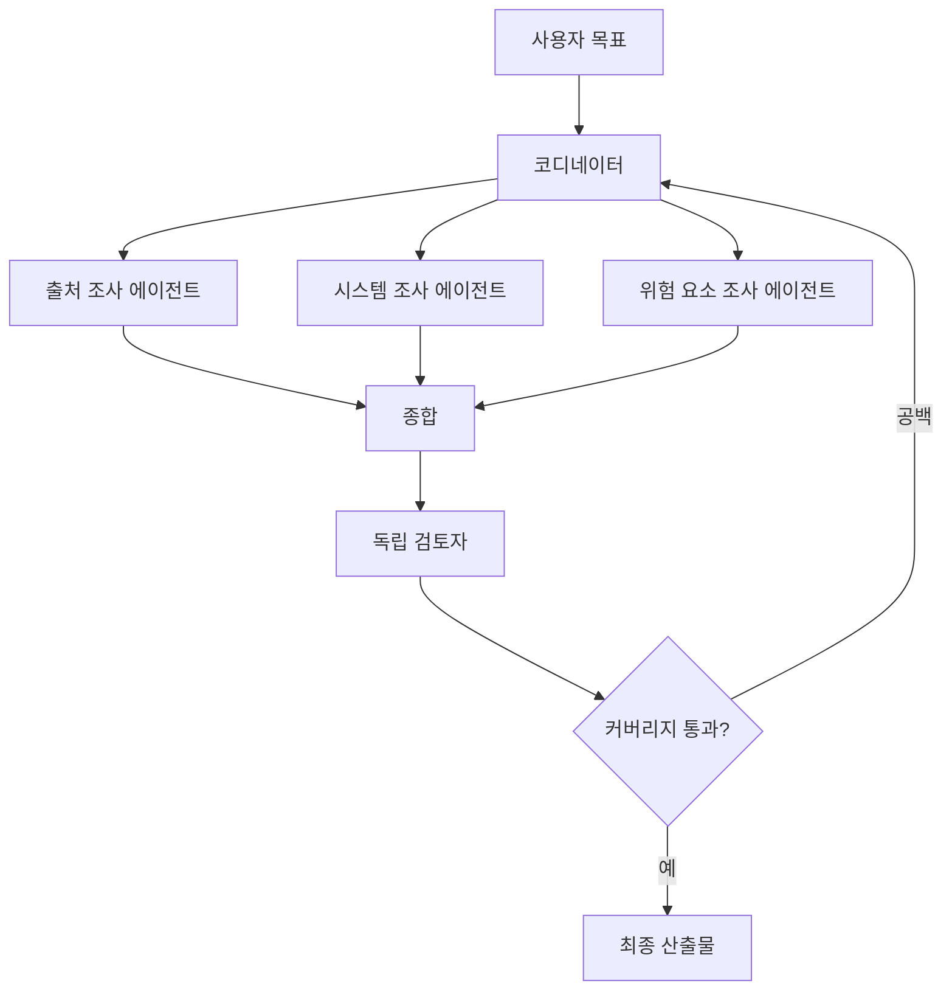

> 🇰🇷 이 문서는 한국어 번역본입니다(ELI5 스타일). 원문: [en.md](en.md)

# 멀티 에이전트 오케스트레이션과 위임

> 위임하는 것은 경계가 분명한 질문 하나여야 합니다. 자신의 불확실성 전부가 아니라요.

**유형:** Reference
**언어:** Python
**선수 지식:** [도구 루프는 통제된 위임이다](../../10-tool-use-and-agentic-loops/); 페이즈 14, 레슨 12와 28
**시간:** 약 135분

## 학습 목표

- 단일 에이전트, 코디네이터, 파이프라인, 병렬, 검토자 패턴을 고르기
- 범위, 도구, 산출물, 완료 기준을 갖춘 위임 작업 작성하기
- 컨텍스트 격리로 비대를 줄이고 독립적인 판단을 지키기
- 결정론적 선수 조건과 적응형 모델 판단을 구분하기
- 출처(provenance), 오류, 미해결 공백을 잃지 않으면서 부분 결과 병합하기

## 문제 상황

한 리서치 에이전트가 거대한 프롬프트 하나를 들고 있습니다. 여섯 곳의 출처를 검색하고, 주장들을 비교하고, 신뢰도를 계산하고, 보고서를 쓰고, 인용을 검토하고, 추가 조사가 필요한지 판단합니다. 작업이 커질수록 초기 제약을 잊고 같은 검색을 반복합니다. 팀은 이를 다섯 에이전트로 쪼개고, 넓은 도구와 함께 "보고서가 훌륭해질 때까지 협업하라"는 지시를 내립니다.

새 시스템은 비용이 더 들고 디버깅도 더 어렵습니다. 두 에이전트가 같은 주장을 조사합니다. 코디네이터가 JSON을 기다리는데 한 에이전트는 산문을 돌려줍니다. 검토자는 생성자의 추론을 보고 그 가정을 그대로 반복합니다. 한 에이전트가 조용히 실패하는데, 최종 종합 단계는 빠진 결과를 부정적 증거로 취급합니다.

멀티 에이전트 아키텍처가 분해(decomposition) 문제를 해결해 준 게 아닙니다. 계약이 없다는 사실이 더 큰 비용을 부르게 만들었을 뿐입니다.

## 개념

### 다른 컨텍스트가 왜 존재하는지부터 정하기

서브에이전트는 뚜렷한 이득이 있을 때만 만듭니다:

- 경계가 분명한 관심사에 대한 컨텍스트 격리
- 독립된 작업의 병렬 실행
- 전용 도구나 지침
- 생성자 컨텍스트 없이 하는 독립 검토
- 코디네이터의 컨텍스트 예산 보호

하위 작업이 결정론적인 함수 하나라면 도구를 쓰세요. 필요할 때 불러오는 재사용 가능한 가이드라면 스킬을 쓰세요. 자기만의 추론 루프, 증거, 멈춤 조건이 필요하다면 서브에이전트가 맞을 수 있습니다.

### 다섯 가지 패턴부터



#### 단일 에이전트

필요한 증거를 하나의 컨텍스트가 다 담을 수 있고 도구 사용 경로가 짧을 때 가장 좋습니다. 평가하기 가장 쉬운 구조입니다.

#### 순차 파이프라인

각 단계가 정해진 선행 단계를 갖습니다. 추출, 검증, 검토, 렌더링처럼 순서와 선수 조건이 명확할 때 쓰세요.

#### 병렬 팬아웃과 리듀스

독립적인 작업을 동시에 돌리고, 리듀서(reducer)가 구조화된 결과를 합칩니다. 파일별 검토나 독립적인 출처 조사에 쓰세요. 서로의 발견에 의존하는 단계는 병렬화하지 마세요.

#### 코디네이터와 전문가

코디네이터가 현재 부족한 부분을 보고 작업을 골라 위임합니다. 분해 방식을 처음부터 완전히 알 수 없을 때 쓰세요.

#### 생성자와 독립 검토자

한 컨텍스트가 만들고, 다른 컨텍스트가 생성자의 설득력 있는 내부 서사 없이 산출물과 증거, 채점 기준(rubric)만 받습니다. 독립성이 요구 사항입니다. 같은 대화에서 나온 '두 번째 의견'이 아닙니다.

### 위임 계약 작성하기

쓸모 있는 위임 작업에는 다음이 담깁니다:

```text
Goal: one outcome the subagent owns
Scope: files, sources, claims, or systems included and excluded
Inputs: authoritative evidence and current state
Allowed tools: minimum necessary capabilities
Constraints: time, turns, cost, safety, and format
Output: machine-checkable schema with provenance and errors
Completion: observable conditions for done, partial, or blocked
Handoff: what the coordinator should do with each state
```

"주제를 철저히 조사하라"는 것은 완료를 정의하지 못합니다. "근거가 확보된 주장을 최대 다섯 개 돌려줘라. 각 주장에 출처 ID, 날짜, 인용 구간 참조, 신뢰도 등급, 충돌 목록, 미해결 질문을 붙여라"는 것은 정의합니다.

### 결정론적 순서는 모델 밖에 두기

검토가 테스트 뒤에 이뤄져야 한다면, 그 순서는 코드가 강제합니다. 모든 파일이 파일 간 일관성 검토 전에 개별 검토를 받아야 한다면, 오케스트레이션이 매니페스트를 추적하며 첫 패스가 끝나기 전까지 두 번째 패스를 막습니다.

컨텍스트가 빠듯해진 상황에서 코디네이터 프롬프트가 단단한 선수 조건을 기억해 주리라 기대하지 마세요.

어떤 빠진 주장에 추가 조사가 필요한가 같은 의미론적 질문은 Claude가 결정합니다. 최대 동시 실행 수, 필수 산출물, 승인 상태, 단계 순서 같은 불변 조건은 코드가 결정합니다.

### 작업 경계를 의도적으로 활용하기

Claude Code와 에이전트 하네스에서는 작업이나 서브에이전트 경계가 격리된 컨텍스트와 제한된 도구 집합을 제공할 수 있습니다. 정확한 설정 방법은 시간이 지나며 바뀌므로 현재 문서로 확인하세요. 변하지 않는 설계 원칙은 이렇습니다:

- 서브에이전트가 필요한 증거만 전달하기
- 명시적인 허용 목록으로 도구 제한하기
- 결과와 함께 구조화된 메타데이터 요청하기
- 서로 의존하지 않을 때만 독립 호출을 병렬 실행하기
- 전역 제약과 최종 상태의 책임은 코디네이터에 두기
- 대안을 탐색하면서 원본을 건드리면 안 될 때 세션을 포크하기

격리는 컨텍스트 비대를 막아줍니다. 하지만 모든 에이전트가 같은 결함 있는 증거나 채점 기준을 받는다면, 사실에 대한 독립은 보장되지 않습니다.

### 세 가지 결과 상태를 지키기

모든 하위 작업은 다음을 돌려줘야 합니다:

- complete: 요청된 계약 충족
- partial: 유효한 작업에 명명된 공백이나 실패한 출처가 더해진 상태
- blocked: 새 권한이나 상태 없이는 안전하게 진행 불가

일부 필드만 채워졌다는 이유로 partial을 complete로 바꾸지 마세요. 코디네이터는 빠진 증거와 구조화된 오류를 종합 단계까지 전파해야 합니다.

### 식별자와 출처로 병합하기

리듀서에는 안정적인 키가 필요합니다. 코드 리뷰라면 파일과 지적(finding) 식별자를, 리서치라면 주장과 출처 식별자를, 고객 지원이라면 티켓과 조치 식별자를 쓰세요.

병합 규칙에는 다음을 명시하세요:

- 중복 처리
- 충돌 보존
- (있다면) 출처 우선순위
- 신선도 비교
- 불완전한 입력
- 신뢰도 집계
- 에이전트 간 불일치 시 에스컬레이션

종합기(synthesizer)가 더 매끄러운 글을 만들겠다고 충돌을 숨기게 하지 마세요.

### 실행 궤적 평가하기

최종 산출물이 옳아 보여도, 오케스트레이션이 일을 낭비하거나 경계를 넘고 있을 수 있습니다. 다음을 테스트하세요:

- 올바른 서브에이전트 선택
- 허용된 도구 사용
- 작업 소유권 중복 없음
- 선수 조건 순서
- 결과 스키마와 오류 전파
- 턴과 비용 예산
- 검토자 독립성
- 최종 상태 완전성

인위적인 도구 실패와 부분 결과를 활용하세요. 정상 경로(happy path)만 통과한 것은 가장 시시한 증거입니다.

## 만들어 보기

## 인터랙티브 랩

```figure
16-multi-agent-topology
```

에이전트를 더하기 전에 토폴로지 탐색기를 써 보세요. 단일 컨텍스트, 순차 파이프라인, 병렬 팬아웃, 코디네이터, 독립 검토자를 비교해 보면, 이 그림이 조정 비용, 선수 조건, 부분 결과 리스크를 드러냅니다.

## 실습 랩

아래의 경계가 분명한 리서치 파이프라인을 설계한 뒤, 불필요한 컨텍스트 하나를 빼 보고 측정 가능한 결과가 변하는지 근거를 들어 설명하세요.

## 완성 산출물

작성을 마친 [`outputs/orchestration-contract.md`](../outputs/orchestration-contract.md)는 빈 워크시트가 아니라 구체적인 리서치 파이프라인 인계 문서입니다.

## 검증하기

작업 식별자, 의존성 순서, 예산, 부분 상태, 검토자 격리를 로컬에서 검증합니다:

```bash
cd certifications/claude/lessons/16-multi-agent-orchestration-and-delegation
python3 code/main.py
python3 -m unittest discover -s code/tests -v
```

의존성 하나를 바꾸거나 부분 상태 규칙을 빼고, 검증기가 패킷을 막는지 확인해 보세요. 레슨 퀴즈는 빌드 이후 토폴로지 결정을 점검합니다.

## 캡스톤 연계

검증을 마친 계약은 Architect Foundations 시나리오 캡스톤의 오케스트레이션 섹션으로 재활용하세요.

기술적 의사결정을 위한 멀티 에이전트 리서치 파이프라인을 설계합니다.

### 단계 1: 최종 계약 정의하기

에이전트를 정의하기 전에 결정 브리프, 주장 스키마, 출처 요구 사항, 미해결 공백의 표현 방식을 정합니다.

### 단계 2: 단일 에이전트 베이스라인 시도하기

품질, 비용, 지연 시간, 반복 작업, 컨텍스트 증가를 측정합니다. 베이스라인이 실패하지 않았다면 에이전트를 더하지 마세요.

### 단계 3: 컨텍스트 경계 찾기

격리, 병렬화, 전문화, 독립 검토에서 이득을 보는 관심사만 분리합니다. 새 컨텍스트마다 기대하는 개선점을 기록하세요.

### 단계 4: 작업 계약 작성하기

표를 만듭니다:

| 작업 | 범위 | 허용 도구 | 산출물 | 완료 | 부분 | 예산 |
|------|-------|---------------|--------|------|---------|--------|

### 단계 5: 선수 조건 코드로 새기기

의존성 그래프나 상태 머신으로 표현합니다. 필요한 모든 조사 상태가 complete이거나 명시적으로 partial이 되기 전에는 검토자를 실행할 수 없습니다.

### 단계 6: 병합 레드팀하기

중복 주장, 서로 엇갈리는 날짜, 실패한 에이전트 하나, 오래된 증거, 스키마가 틀린 결과를 주입합니다. 종합 단계가 실패를 조용히 지워버리지 않는지 확인하세요.

## 활용하기

코드베이스 검토라면 검증된 구조는 이렇습니다:

1. 파일과 파일 간 관심사의 매니페스트를 만듭니다.
2. 읽기 전용 도구로 경계가 분명한 파일별 검토를 병렬 실행합니다.
3. 지적 사항을 공유 스키마로 정규화합니다.
4. 매니페스트와 정규화된 지적 사항 위에 파일 간 패스를 한 번 돌립니다.
5. 독립 검토자가 약한 증거와 중복을 거르게 합니다.
6. 승인된 변경은 결정론적 테스트와 범위 게이트를 통과한 뒤에만 적용합니다.

모든 에이전트에게 저장소 전체를 들여다보라고 하지 마세요. 컨텍스트가 중복되고 소유권이 모호해집니다.

고객 지원에서는 전문성뿐 아니라 권한으로도 역할을 나누세요. 정책 조사자는 문서를 읽을 수 있습니다. 환불 추천자는 사안을 분석할 수 있습니다. 쓰기 권한은 별도로 승인된 실행자만 받아야 합니다.

## 시험 의사결정 패턴

선수 조건과 권한에는 구조적 강제를 고르세요. 서브에이전트는 결정론적 유틸리티 호출이 아니라 격리된 추론을 위해 고르세요.

강한 선택지는 대개 이렇습니다:

- 경계가 분명한 전문가들을 거느린 코디네이터를 쓰고
- 역할별로 도구를 제한하고
- 구조화된 결과와 부분 상태를 돌려주고
- 독립적인 작업을 병렬화하고
- 독립 검토를 새 컨텍스트에서 진행하고
- 출처와 오류의 출처 정보(provenance)를 보존하고
- 식별된 공백만 다시 위임합니다

약한 선택지는 더 많은 에이전트에게 같은 넓은 프롬프트와 도구 집합을 나눠 쓰라고 합니다.

## 흔한 함정

### 단계마다 에이전트 하나

정해진 단계에는 자율적인 컨텍스트가 필요 없습니다. 동작이 결정론적이라면 코드나 도구를 쓰세요.

### 무조건 병렬

의존하는 작업을 병렬로 돌리면 낡은 가정 위에서 진행되고, 값비싼 병합 수리가 필요해집니다.

### 데이터 창고가 된 코디네이터

서브에이전트의 날 것 대화 기록은 전역 컨텍스트를 부풀립니다. 압축된 구조화 결과만 돌려받고, 상세한 증거는 프롬프트 밖에 보관하세요.

### 생성자 컨텍스트를 물려받은 검토자

검토자가 같은 관점을 물려받으면 스타일 편집자로 전락합니다. 산출물, 증거, 채점 기준은 깨끗한 컨텍스트에서 주세요.

## 연습 문제

1. 비대해진 단일 에이전트 프롬프트를 도구, 스킬, 서브에이전트의 책임으로 분해하세요. 각 경계의 근거를 제시합니다.
2. 출처 조사 에이전트 셋 중 하나가 타임아웃될 때의 부분 결과 동작을 설계하세요.
3. 파일별·파일 간 검토 파이프라인에 결정론적 선수 조건을 추가하세요.
4. 같은 평가 세트에서 순차 분해와 적응형 분해를 비교하세요.
5. 두 에이전트가 작업 소유권을 중복했을 때 실패하는 궤적 테스트를 만드세요.

## 핵심 용어

| 용어 | 사람들이 말하는 것 | 실제 의미 |
|------|-----------------|------------------------|
| 코디네이터 | 가장 똑똑한 에이전트 | 분해, 전역 제약, 병합, 완료를 책임지는 컨텍스트 |
| 서브에이전트 | 함수 호출 | 경계가 분명한 작업과 도구를 가진 격리된 추론 루프 |
| 팬아웃 | 에이전트를 많이 쓰기 | 독립적이고 경계가 분명한 작업을 동시에 실행하기 |
| 리듀스 | 전부 요약하기 | 명시적인 충돌·부분 상태 규칙으로 구조화된 결과를 병합하기 |
| 핸드오프 | 산문 보내기 | 타입이 정해진 상태, 증거, 오류, 다음 책임을 넘기기 |
| 독립 검토자 | 다시 물어보기 | 생성자의 설득과 격리된 컨텍스트에서 산출물과 증거를 평가하기 |

## 더 읽을거리

- [Claude Agent SDK 문서](https://platform.claude.com/docs/en/agent-sdk/overview): 현재의 서브에이전트와 세션 기능
- [Building effective agents](https://www.anthropic.com/research/building-effective-agents): 오케스트레이션 패턴
- 페이즈 14, 레슨 28: 더 넓은 오케스트레이션 비교
- 페이즈 14, 레슨 39: 독립 검토자 설계
