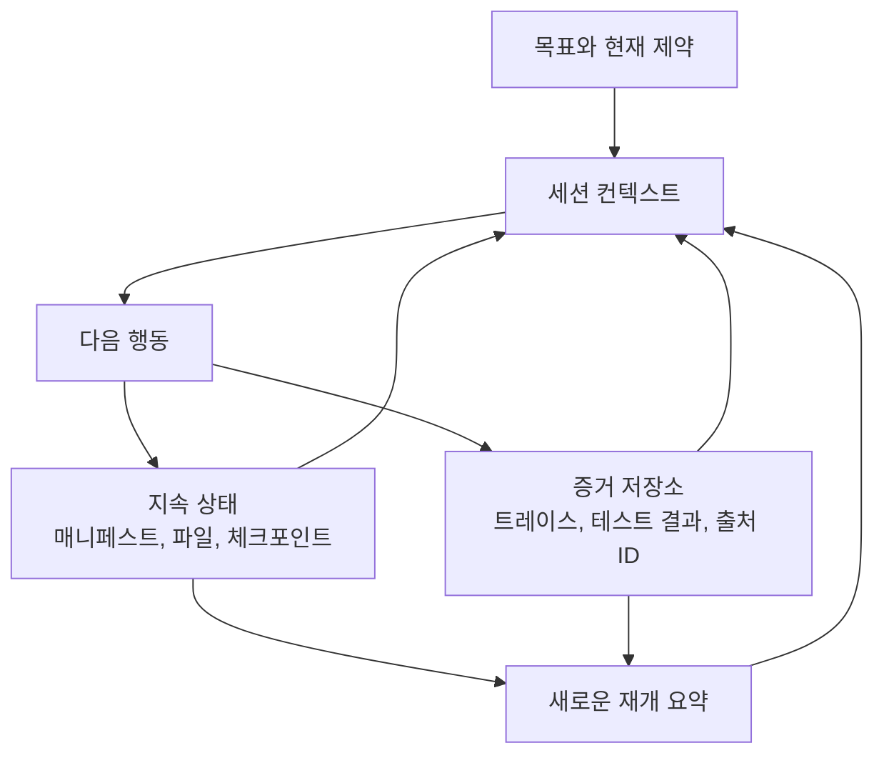

> 🇰🇷 이 문서는 한국어 번역본입니다(ELI5 스타일). 원문: [en.md](en.md)

# 에이전트 SDK 세션, 서브에이전트, 컨텍스트

> 연속성이 도움이 될 때는 세션을 이어가세요(Resume). 물려받은 가정이 위험이 될 때는 컨텍스트를 포크하세요.

**유형:** Reference
**언어:** Python
**선수 지식:** [에이전트 SDK는 하네스이지 허가가 아닙니다](../../12-claude-agent-sdk-and-hooks/), [멀티 에이전트 오케스트레이션과 위임](../../16-multi-agent-orchestration-and-delegation/); 페이즈 14, 레슨 17
**시간:** 약 120분

## 학습 목표

- 지속되는 작업 상태와 대화 컨텍스트 분리하기
- 실패 리스크에 따라 새 세션, 재개 세션, 포크 세션, 컴팩션 세션 고르기
- 서브에이전트로 컨텍스트와 도구 격리하기
- 결정론적 생명주기 이벤트에 훅 배치하기
- 낡은 가정을 되풀이하거나 부수 효과를 중복하지 않는 복구 설계하기

## 문제 상황

저장소 마이그레이션 에이전트가 몇 시간째 돌아가고 있습니다. 컨텍스트 안에는 최초 계획, 도구 출력, 실패한 실험, 부분 패치, 테스트 로그, 요약 몇 개가 들어 있습니다. 의존성이 바뀐 뒤, 팀은 같은 세션을 재개하며 말합니다. "멈췄던 곳에서 이어가."

에이전트는 낡은 계획을 따릅니다. 타임아웃 전에 이미 성공했던 쓰기 작업을 되풀이합니다. 컴팩션은 큰 그림은 남겼지만 결정적인 테스트 실패는 지워버렸습니다. 검토자 서브에이전트는 부모의 전체 히스토리를 받고, 옛 의존성 동작이 여전히 유효하다고 가정합니다.

이 시스템은 세 가지를 뒤섞었습니다:

- 지속되는 외부 상태
- 현재 대화 컨텍스트
- 실행 히스토리

셋은 서로 연관되지만, 하나의 저장소처럼 취급해선 안 됩니다.

## 개념

### 컨텍스트는 작업 집합이다

모델 컨텍스트에는 다음 결정에 필요한 정보만 있어야 합니다. 완료된 작업, 승인, 파일, 체크포인트, 도구 부수 효과를 담는 공식 데이터베이스가 아닙니다.



지속돼야 하는 사실은 컨텍스트 밖에 저장합니다:

- 현재 작업 매니페스트와 상태
- 완료된 산출물과 버전
- 멱등성 키와 외부 액션 ID
- 승인과 만료
- 마지막으로 검증된 테스트와 배포 결과
- 미해결 방해 요소(블로커)
- 출처와 트레이스 참조

세션을 시작하거나 재개할 때는 그 상태로부터 압축된 현재 작업 집합을 다시 조립하세요.

### 네 가지 세션 동작 중 고르기

#### 새 세션

목표나 신뢰 경계가 바뀌었거나, 물려받은 컨텍스트를 믿을 수 없거나, 이전 작업이 끝났을 때는 깨끗한 세션을 쓰세요. 공식 상태로부터 구조화된 브리프를 공급합니다.

#### 세션 재개

작업, 제약, 증거가 여전히 유효하고 대화의 연속성이 가치를 줄 때 재개하세요. 먼저 외부 상태를 재검증합니다. 세션 ID가 세상이 그대로라는 증거는 아닙니다.

#### 세션 포크

대안을 탐색하면서 원본 브랜치를 보존해야 할 때 포크하세요. 경쟁하는 아키텍처 플랜, 독립적인 디버깅 가설, 위험한 마이그레이션 옵션이 유용한 사례입니다. 포크는 출발점을 물려받지만, 명시적인 조율 없이 공유 상태를 바꿔선 안 됩니다.

#### 세션 컴팩션

컨텍스트가 커졌지만 현재 작업이 여전히 연속성의 이득을 볼 때 컴팩션하세요. 좋은 컴팩션 요약은 결정, 제약, 산출물 ID, 테스트 상태, 열린 공백, 다음 행동을 남깁니다. 큰 증거는 외부에 저장하고 참조만 유지하세요.

컴팩션은 컨텍스트를 아껴 줍니다. 하지만 지속되는 실행을 만들어 주거나, 중요한 사실이 살아남음을 보장하거나, 최신성을 검증하지는 않습니다.

### 구조화된 재개 패킷 활용하기

```json
{
  "goal": "Migrate the request client without changing public behavior",
  "scope": ["src/client.py", "tests/test_client.py"],
  "completed": [
    {"task": "inventory", "artifact": "work/inventory.json", "verified": true}
  ],
  "current_state": {
    "branch": "migration/client-v2",
    "dependency_version": "verified-at-resume",
    "tests": "12 passed, 1 blocked"
  },
  "open_gaps": ["timeout retry semantics need decision"],
  "constraints": ["no public API change", "no production writes"],
  "next_action": "compare retry behavior against the contract tests"
}
```

패킷은 현재의 진실을 보고합니다. 대화 턴마다 요약하지 마세요.

### 책임별로 서브에이전트 컨텍스트 격리하기

서브에이전트는 다음을 받아야 합니다:

- 하나의 목표와 범위
- 필요한 최소한의 증거
- 제한된 도구
- 명시적인 출력·오류 스키마
- 턴, 시간, 비용 예산
- 완료 및 에스컬레이션 규칙

무관한 부모 히스토리는 받으면 안 됩니다. 격리는 어텐션을 지키고 검토자의 독립성을 지켜줄 수 있습니다.

코디네이터는 전역 상태를 쥐고 있으며, 돌려받은 결과를 병합하기 전에 계약을 점검합니다.

### 결정론적 생명주기 작업에는 훅 사용하기

훅은 세션이나 도구 주변의 정해진 이벤트에서 실행됩니다. 정확한 이벤트 이름과 설정은 달라질 수 있으니, 현재의 Agent SDK와 Claude Code 문서를 참고하세요. 변하지 않는 배치 규칙은 이렇습니다:

- 사전 훅은 검증하거나 차단하고
- 사후 훅은 정규화, 기록, 검증하고
- 중단 훅은 완료와 정리를 점검하고
- 세션 훅은 통제된 상태를 로드하거나 저장합니다

예시:

- 선언된 범위 밖의 쓰기 차단
- 파괴적인 도구 전에 새로운 승인 요구
- 너무 큰 도구 출력은 잘라내거나 외부화
- 도구 오류를 공통 스키마로 정규화
- 편집 뒤 포매터나 대상 테스트 실행
- 불변의 트레이스 참조 기록

모델의 추론이 필요한 의미론적 판단을 깨지기 쉬운 셸 로직에 넣지 마세요. 단단한 인가를 프롬프트 안에 넣지 마세요.

### 부수 효과는 멱등하게 만들기

타임아웃 뒤의 재개는 결과가 사라졌을 때 같은 동작을 반복할 수 있습니다. 모든 외부 쓰기에는 멱등성(idempotency)이나 재조정(reconciliation) 전략이 필요합니다.

예컨대:

- 고유한 요청 키로 환불 생성
- 패치 전에 기대하는 파일 해시 기록
- 재시도 전에 배포 버전 확인
- 도구 호출 ID와 결과 상태 저장
- 알 수 없는 결과를 다음 쓰기 전에 재조정

"다시 시도"는 오류 분류를 마친 뒤에만 안전합니다.

### 경계에서 재검증하기

이어가기 전에:

1. 현재 파일, 의존성 버전, 브랜치, 서비스 상태를 파악합니다.
2. 체크포인트와 비교합니다.
3. 낡은 가정을 표시합니다.
4. 안전한 다음 단계를 확인해 주는 가장 작은 검증을 다시 실행합니다.
5. 새로운 현재 상태 요약을 만듭니다.

환경이 크게 달아졌다면, 옛 세션에게 스스로를 재해석하라고 강요하기보다 새 계획으로 시작하거나 포크하세요.

### 컨텍스트 예산 세우기

컨텍스트를 다음에 배분합니다:

- 목표와 단단한 제약
- 현재 계획과 매니페스트
- 다음 선택에 필요한 최신 증거
- 압축된 관련 도구 출력
- 최종 출력 계약

거대한 날 것 로그, 저장소 전체, 반복되는 도구 스키마는 활성 작업 집합 밖에 두거나 점진적 공개 뒤에 두어야 합니다.

경계가 분명한 검색은 서브에이전트에게 맡기고 참조가 붙은 요약만 받으세요. 컨텍스트는 이름상의 윈도우가 크더라도 희소한 추론 자원입니다.

## 만들어 보기

## 인터랙티브 랩

```figure
17-session-context-budget
```

컨텍스트 예산 시뮬레이터로 목표, 제약, 증거, 도구 결과, 출력 계약 사이에 작업 집합을 배분해 보세요. 컴팩션이 크기는 줄일 수 있어도 상태가 최신임을 증명하지는 못하는 이유가 눈에 보입니다.

## 실습 랩

마이그레이션 연습에서 체크포인트 하나를 무효화하고, 대화 히스토리를 믿지 않고 재개 패킷을 복구해 보세요.

## 완성 산출물

작성을 마친 [`outputs/session-recovery-packet.md`](../outputs/session-recovery-packet.md)는 해시, 미확인 부수 효과, 안전한 다음 행동을 담아 중단된 마이그레이션 하나를 기록합니다.

## 검증하기

지속 상태, 재검증, 멱등성 키, 격리된 검토가 포함됐는지 검증합니다:

```bash
cd certifications/claude/lessons/17-agent-sdk-sessions-subagents-and-context
python3 code/main.py
python3 -m unittest discover -s code/tests -v
```

퀴즈는 세션 선택과 복구 규칙을 점검합니다.

## 캡스톤 연계

검증을 마친 패킷은 재개와 컨텍스트 관리의 증거로서 Architect Foundations 캡스톤에 붙이세요.

세 개의 세션으로 이어지는 지속형 마이그레이션 연습을 만듭니다.

### 세션 1: 조사와 계획

파일, 테스트, 공개 계약, 의존성, 리스크의 매니페스트를 만듭니다. 대화 밖에 저장하세요. 아직 구현은 없습니다.

### 세션 2: 구현과 검증

매니페스트와 현재 저장소 상태에서 시작합니다. 제한된 파일 도구를 씁니다. 완료된 작업 ID, 파일 해시, 테스트 출력 참조, 미해결 공백을 저장합니다.

중간에 파일 쓰기 직후의 타임아웃을 흉내 내 보세요. 어떤 재시도보다 먼저 파일 해시를 대조하면서 재개합니다.

### 세션 3: 독립 검토

새로운 검토 컨텍스트를 포크합니다. 구현 대화 기록이 아니라 diff, 요구 사항, 테스트, 채점 기준을 공급합니다. 검토자는 증거가 붙은 구조화된 지적 사항을 돌려줍니다.

### 훅 요구 사항

- 쓰기 전 범위 게이트
- 쓰기 후 대상 검증
- 외부 증거 참조가 붙은 도구 출력 크기 제한
- 구조화된 트레이스 기록
- 매니페스트 완료나 명시적 부분 상태를 요구하는 중단 점검

## 활용하기

고객 지원 에이전트라면 티켓 상태, 가져온 증거 ID, 승인, 도구 결과를 지속되는 케이스 기록에 저장합니다. 세션 컨텍스트에는 현재 질문과 관련 증거만 담습니다. 담당자가 몇 시간 뒤 돌아온다면, 케이스 기록에서 작업 집합을 다시 만들고 정책의 최신성을 재검증하세요.

CI라면 각 실행이 커밋과 선언된 입력으로부터 깨끗하게 시작해야 합니다. 인터랙티브 세션을 재사용하면 명시되지 않은 상태가 끼어들 수 있습니다. 대신 저장해 둔 지적 사항이나 구조화된 요약을 명시적인 입력으로 쓰세요.

## 시험 의사결정 패턴

유효한 연속성에는 재개를, 격리된 대안에는 포크를, 낡은 컨텍스트 자체가 리스크일 때는 새 세션을 고르세요. 컴팩션은 크기를 다룰 뿐, 진실을 다루지 않습니다.

이런 답을 고르세요:

- 지속 상태를 프롬프트 밖에 저장하고
- 재개 시 현재 환경을 재검증하고
- 서브에이전트의 컨텍스트와 도구를 격리하고
- 결정론적 게이트와 정규화에는 훅을 쓰고
- 재시도 전에 미지의 부수 효과를 재조정하고
- 산출물 참조가 붙은 구조화된 요약을 전달합니다

옛 대화 기록 전문을 새 에이전트마다 먹이는 답은 피하세요.

## 흔한 함정

### 세션 곧 상태

대화 히스토리는 트랜잭션도, 멱등성도, 버전 관리도, 공식적인 외부 진실도 제공하지 않습니다.

### 컴팩션 곧 복구

요약은 중요한 그 하나의 실패를 빠뜨릴 수 있습니다. 복구는 지속 상태와 검증으로 합니다.

### 포크 곧 독립

포크는 결함 있는 증거를 물려받을 수 있습니다. 검토자의 독립은 깨끗한 채점 기준과 통제된 입력도 요구합니다.

### 훅 남발

불투명한 훅이 너무 많으면 동작을 디버깅하기 어렵습니다. 작고, 관측 가능하고, 버전 관리되고, 이름이 붙은 불변 조건에 묶인 훅을 유지하세요.

## 연습 문제

1. 배포 도중 중단된 에이전트의 재개 패킷을 설계하세요.
2. 영향이 큰 도구 호출에 멱등성과 재조정을 추가하세요.
3. 다섯 시나리오가 재개, 포크, 컴팩션, 새 세션 중 무엇이 필요한지 판단하세요.
4. 의미론적 모델 작업과 결정론적 게이트를 분리하는 훅 지도를 만드세요.
5. 검토자를 생성자 대화 기록이 있을 때와 없을 때 각각 시험하고, 반복된 가정을 비교하세요.

## 핵심 용어

| 용어 | 사람들이 말하는 것 | 실제 의미 |
|------|-----------------|------------------------|
| 세션 | 지속되는 메모리 | 대화형 작업 컨텍스트이지, 공식 시스템 상태가 아님 |
| 재개 | 무작정 이어가기 | 현재 외부 상태를 대조한 뒤 유효한 컨텍스트를 재사용하기 |
| 포크 | 전부 복사하기 | 격리된 대안 작업을 위해 기존 컨텍스트를 분기하기 |
| 컴팩션 | 모든 디테일 저장하기 | 외부 상태가 공식 증거를 보관하는 가운데 현재 컨텍스트를 압축하기 |
| 훅 | 프롬프트 하나 | 생명주기 이벤트에 붙은 결정론적 코드 |
| 멱등성 | 한 번 재시도 | 같은 요청 식별자에 대해 같은 작업을 반복해도 추가 효과가 없는 성질 |

## 더 읽을거리

- [Claude Agent SDK 세션 문서](https://platform.claude.com/docs/en/agent-sdk/sessions): 현재 세션 동작
- [Claude Agent SDK 훅 문서](https://platform.claude.com/docs/en/agent-sdk/hooks): 현재 생명주기 이벤트
- 페이즈 14, 레슨 40: 멀티 세션 인계
- 페이즈 15, 레슨 12: 지속형 실행
