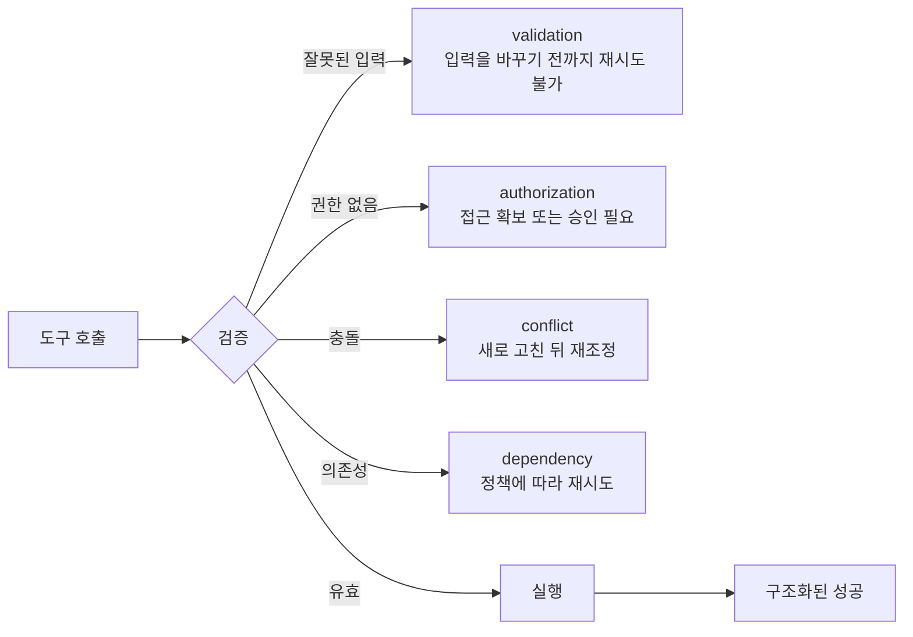

> 🇰🇷 이 문서는 한국어 번역본입니다(ELI5 스타일). 원문: [en.md](en.md)

# 도구 계약, 오류, 점진적 탐색

> 모델은 당신이 묘사한 인터페이스 안에서 고릅니다. 모호한 도구는 모호한 행동을 만듭니다.

**유형:** Reference
**언어:** Python
**선수 지식:** [도구 루프는 통제된 위임이다](../../10-tool-use-and-agentic-loops/), [MCP는 능력을 호스트와 분리한다](../../11-mcp-server-design-and-integration/); 페이즈 13, 레슨 05
**시간:** 약 120분

## 학습 목표

- 겹치지 않는 경계를 가진 도구 이름, 설명, 스키마 작성하기
- 안전한 복구로 이끄는 구조화된 도구·MCP 오류 설계하기
- 도구 선택(tool choice)과 좁은 도구 배분을 의도적으로 활용하기
- MCP 설정과 시크릿을 사용자·프로젝트 용도로 범위 나누기
- 권한 부여를 잃지 않으면서 큰 도구 카탈로그에 점진적 탐색 적용하기

## 문제 상황

한 에이전트에게 도구 셋이 보입니다:

- `search`
- `find`
- `lookup`

셋의 설명은 모두 "정보를 찾습니다"입니다. 하나는 공개 웹 페이지를 검색하고, 하나는 사내 고객 기록을 조회하고, 하나는 승인된 정책을 가져옵니다. 스키마는 문자열 하나만 받습니다. 오류는 아무 텍스트나 돌려줍니다.

모델의 선택은 들쑥날쑥합니다. 공개 리서치 작업이 사내 데이터를 조회합니다. 정책 질문이 웹을 검색합니다. 도구가 "failed"를 돌려주면, 에이전트는 예산이 닳을 때까지 재시도합니다.

모델이 도구 사용을 몰라서 헤매는 게 아닙니다. 인터페이스가 안전하게 고르는 데 필요한 구분을 지워버린 것입니다.

## 개념

### 도구 설명은 결정 표면의 일부다

탄탄한 도구 계약에는 다음이 명시됩니다:

- 하나의 행동과 대상
- 언제 쓰는지
- 언제 쓰지 않는지
- 공식 데이터의 경계
- 필요한 신원이나 승인
- 인자의 의미와 제약
- 결과와 오류의 형태
- 부수 효과와 되돌릴 수 있는지 여부

비교해 봅시다:

```json
{
  "name": "search",
  "description": "Search for information",
  "input_schema": {
    "type": "object",
    "properties": {"q": {"type": "string"}}
  }
}
```

그리고:

```json
{
  "name": "search_active_support_policy",
  "description": "Search approved active support-policy text for the caller's region. Use for policy questions. Do not use for customer-account facts or public web research. Returns versioned policy passages with source IDs.",
  "input_schema": {
    "type": "object",
    "properties": {
      "query": {"type": "string", "minLength": 3},
      "region": {"type": "string", "enum": ["uk", "eu", "us"]},
      "top_k": {"type": "integer", "minimum": 1, "maximum": 8}
    },
    "required": ["query", "region", "top_k"],
    "additionalProperties": false
  }
}
```

두 번째 인터페이스는 선택 경계와 결과 약속을 함께 줍니다. 그래도 서비스는 실행 시점에 신원과 지역을 검증해야 합니다.

### 겹치는 도구 피하기

모델이 어느 도구가 요청을 소유하는지 추론할 수 없으면 두 도구는 겹치는 것입니다. 인터페이스는 이렇게 고칩니다:

- 같은 행동은 하나의 도구 뒤로 통합하기
- 눈에 보이는 대상이나 권한 경계로 나누기
- 출처나 부수 효과를 이름에 드러내기
- 긍정적·부정적 사용 기준 추가하기
- 현재 API가 지원하는 곳에서 입력 예제 제공하기
- 헷갈리는 조합에 대해 선택을 테스트하기

엉킨 카탈로그를 프롬프트 규칙으로 떠안으려 하지 마세요.

### 스키마가 불변 조건을 지니게 하기

타입, 열거형(enum), 필수 필드, 범위, 패턴, 닫힌 객체를 쓰세요. `options`라는 이름의 문자열 하나면 검증이 자연어로 밀려납니다. 타입이 있는 필드는 잘못된 상태를 표현하기 어렵게 만듭니다.

스키마가 통과됐다는 것은 의미가 옳다는 뜻이 아닙니다. 계정이 존재하는지, 금액이 정책에 맞는지, 사용자에게 권한이 있는지, 참조한 자원이 그 테넌트 소속인지는 서비스가 여전히 확인해야 합니다.

### 오류는 데이터로 돌려주기



오류 계약에는 다음이 포함돼야 합니다:

- 범주
- 재시도 가능 플래그
- 안전한 메시지
- (관련 있다면) 필드별 오류
- 부분 결과와 출처 정보
- 제안되는 안전한 다음 행동
- 트레이스나 장애(인시던트) 참조

스택 트레이스, 시크릿, 날 것 자격 증명, 내부 경로를 노출하지 마세요. 모든 오류를 재시도 가능으로 표시하지 마세요.

MCP 도구라면 프로토콜의 구조화된 오류 시그널과, 클라이언트가 해석할 수 있는 콘텐츠 본문을 쓰세요. 전송(transport) 성공과 도구 성공은 별개입니다. 정확한 필드는 현재 명세로 확인하세요.

### 도구 선택을 의도적으로 쓰기

도구 선택(tool choice) 제어는 현재 API 화면에 따라 도구를 강제하거나, 자동 선택을 허용하거나, 특정 도구를 고르거나, 도구 사용을 막을 수 있습니다.

애플리케이션이 타입이 있는 결과를 요구한다면 구조화된 도구 출력 강제를 쓰세요. 도구를 쓸지, 어떤 도구를 쓸지가 모델의 몫이라면 자동 선택을 허용하세요. JSON을 얻으려고 실제 세계의 동작을 강제하지 마세요. 추출과 실행을 분리하세요.

병렬 도구 사용을 허용한다면, 호출들이 서로 독립적인지, 하네스가 모든 결과를 올바른 호출 식별자와 연결할 수 있는지 확인하세요.

### 도구는 적게 나눠 주기

도구 목록은 컨텍스트를 잠아먹고 선택지를 만듭니다. 역할마다 필요한 최소한의 카탈로그만 주세요.

- 리서치 에이전트: 읽기 전용 웹과 출처 도구.
- 정책 에이전트: 현행 정책 자원과 검색.
- 환불 추천자: 케이스를 읽고 추천을 계산.
- 승인된 실행자: 새로운 승인과 함께 쓰는, 경계가 분명한 쓰기 도구 하나.

편하다고 한 에이전트에게 네 카탈로그를 전부 주지 마세요.

### 큰 카탈로그는 점진적으로 탐색하기

공용 도구와 능력 검색 매커니즘으로 시작하세요. 특수 정의는 작업이 필요를 입증한 뒤에만 로드합니다.

점진적 탐색은 다음을 개선할 수 있습니다:

- 컨텍스트 사용량
- 도구 선택
- 프롬프트 캐시 안정성
- 보안 검토 표면

탐색에는 신원과 범위가 적용돼야 합니다. 제한된 능력의 이름이나 설명이 새어 나가면 안 됩니다.

### MCP 설정 범위 나누기

프로젝트 설정은 팀을 위해 버전 관리됩니다. 사용자 설정은 한 계정이나 머신의 여러 프로젝트에 걸쳐 적용됩니다. 공유하는 서버 선언과 안전한 기본값은 프로젝트 범위에 두고, 개인 경로, 로컬 선택, 사용자별 자격 증명은 커밋되는 파일 밖에 두세요.

시크릿은 환경 변수 참조로 쓰세요. 값은 절대 커밋하지 않습니다. 서버 명령어, 인자, 환경, 전송 방식, 출처, 도구 표면을 검토하세요.

MCP 서버는 도구, 자원(resource), 프롬프트를 노출할 수 있습니다. 제어 방향에 따라 프리미티브를 고르세요:

- tool: 모델이 행동을 요청
- resource: 호스트나 모델이 맥락 데이터를 읽음
- prompt: 사용자나 호스트가 재사용 템플릿을 실행

모든 정적 문서를 행동 도구로 감싸지 마세요.

### 의도에 따라 Claude Code 내장 도구 고르기

변하지 않는 경계는 이렇습니다:

- Read: 알고 있는 파일 내용 읽기
- Glob: 경로 탐색
- Grep: 텍스트와 심벌 검색
- Edit: 기존 파일에 대한 경계가 분명한 변경
- Write: 파일 전체를 새로 만들거나 교체
- Bash: 더 안전한 전용 도구가 없는 명령어, 테스트, 작업

Bash와 쓰기 도구는 작업별로 제한하세요. 의도한 동작을 표현하고 검사 가능한 증거를 남기는 가장 구체적인 인터페이스를 쓰세요.

## 만들어 보기

## 인터랙티브 랩

```figure
18-tool-discovery-contract
```

탐색 계약 그림으로 겹치는 도구, 점진적으로 로드되는 도구, 실행 인가를 비교해 보세요. 오류 범주를 바꿔 가며, 재시도·입력 변경·승인·에스컬레이션 중 무엇이 유일한 안전한 다음 수인지 확인하세요.

## 실습 랩

겹치는 설명 하나와 재시도 가능으로 표시된 인가 오류 하나를 심어 보고, 두 실패를 관찰한 뒤 인터페이스와 복구 계약을 고쳐 보세요.

## 완성 산출물

작성을 마친 [`outputs/tool-catalog-review.md`](../outputs/tool-catalog-review.md)에는 정책, 계정, 공개 검색의 뚜렷한 경계와 실패 매트릭스가 담깁니다.

## 검증하기

결정론적 계약 검토를 실행합니다:

```bash
cd certifications/claude/lessons/18-tool-contracts-errors-and-progressive-discovery
python3 code/main.py
python3 -m unittest discover -s code/tests -v
```

퀴즈는 같은 선택 규칙을 시험합니다.

## 캡스톤 연계

산출물은 도구와 MCP 계약 색인으로서 Architect Foundations 캡스톤으로 가져가세요.

이 체크리스트로 도구 카탈로그를 감사합니다.

| 질문 | 증거 |
|----------|----------|
| 각 이름이 하나의 행동과 대상을 식별하는가? | 선택 테스트 |
| 긍정적·부정적 사용 사례가 뚜렷한가? | 혼동 조합 평가 |
| 스키마가 잘못된 형태를 거부하는가? | 검증기 테스트 |
| 서비스가 의미·인가 규칙을 강제하는가? | 통합 테스트 |
| 오류가 범주화되고 재시도를 아는가? | 실패 픽스처 |
| 모든 부수 효과가 이름과 경계를 갖는가? | 위협 모델 |
| 역할마다 도구가 최소인가? | 능력 매트릭스 |
| 큰 카탈로그를 점진적으로 로드할 수 있는가? | 컨텍스트·캐시 측정 |
| 프로젝트와 사용자 설정이 분리돼 있는가? | 설정 검토 |
| 시크릿이 참조로만 있고 저장되지 않는가? | 저장소 스캔 |

두 도구에 똑같이 들어맞을 법한 질의를 포함해 선택 케이스를 최소 열둘 만드세요. 모델이 올바른 도구를 고르거나 도구 없음을 올바르게 고를 때만 평가가 통과합니다.

검증, 인가, 충돌, 속도 제한, 타임아웃, 부분 결과 실패를 주입합니다. 하네스가 범주에 따라 동작을 바꾸는지 단언(assert)하세요.

## 활용하기

구조화된 추출이라면, 원하는 레코드를 스키마로 표현하는 부수 효과 없는 도구 하나를 정의하세요. 구조화된 레코드가 필요할 때 그 도구를 강제합니다. 그다음 의미 제약과 출처 정보를 검증합니다. 프로덕션(운영 환경) 쓰기 도구를 출력 스키마로 재활용하지 마세요.

큰 엔터프라이즈 카탈로그라면 레지스트리로 작업과 범위에 맞는 능력을 찾으세요. 선택된 정의만 로드합니다. 카탈로그 크기, 탐색 정밀도, 도구 선택, 캐시 히트, 무단 탐색 시도를 모니터링하세요.

## 시험 의사결정 패턴

도구 문제는 흔히 인터페이스 문제입니다. 프롬프트를 복잡하게 만들기 전에 설명, 경계, 스키마, 배분, 오류 계약을 고치세요.

이런 답을 고르세요:

- 도구에 뚜렷한 이름과 부정적 사용 가이드를 주고
- 재시도 의미를 담은 구조화된 `isError` 방식 결과를 돌려주고
- 적절한 곳에서 도구 선택으로 타입 있는 출력을 강제하고
- 프로젝트 설정과 사용자 시크릿을 분리하고
- 맥락 데이터에는 resource를, 행동에는 tool을 쓰고
- 큰 카탈로그에 점진적 탐색을 적용합니다

## 흔한 함정

### 인가처럼 쓰인 도구 설명

"관리자 전용"은 그저 텍스트입니다. 서비스에는 인증된 범위와 정책이 필요합니다.

### 복구 정책처럼 쓰인 오류 텍스트

모델은 "failed"가 재시도인지, 입력 변경인지, 에스컬레이션인지, 중단인지 추측합니다. 명시적인 범주와 재시도 상태를 돌려주세요.

### 모든 작업용 도구 하나

거대한 스키마와 조건부 동작은 선택, 검증, 인가가 어려워집니다. 의미 있는 경계를 따라 나누세요.

### 공유 설정 속의 시크릿

프로젝트 파일은 협업을 위해 설계됐습니다. 환경 변수 이름을 참조하고, 값은 버전 관리 밖에서 프로비저닝하세요.

## 연습 문제

1. 모호한 도구 정의 다섯 개를 뚜렷한 경계로 다시 쓰세요.
2. 사내, 공개, 정책 검색에 대한 혼동 조합 평가를 만드세요.
3. 다중 출처 검색의 타임아웃에 대한 구조화된 부분 결과를 설계하세요.
4. 단일체 MCP 서버를 도구, 자원, 프롬프트로 나누세요.
5. 시크릿 값이 없는 프로젝트·사용자 설정 예제를 만드세요.

## 핵심 용어

| 용어 | 사람들이 말하는 것 | 실제 의미 |
|------|-----------------|------------------------|
| 도구 계약 | 함수 이름 | 선택 가이드, 스키마, 결과, 오류, 권한, 부수 효과 경계 |
| 부정적 사용 가이드 | 추가 프롬프트 텍스트 | 다른 인터페이스가 요청을 소유하는 상황을 명시한 것 |
| 도구 선택 | 도구 권한 | Claude가 도구를 호출할지, 어떤 도구를 호출할지에 대한 요청 수준 제어 |
| 점진적 탐색 | 동적 인가 | 범위가 적용된 탐색 뒤에 관련 능력을 필요할 때 로드하기 |
| MCP 자원(resource) | 읽기 도구 | resource 프리미티브를 통해 식별하고 읽는 맥락 데이터 |
| 프로젝트 범위 | 전역 설정 | 하나의 저장소나 팀을 위한 버전 관리되는 설정 |

## 더 읽을거리

- [Claude 도구 사용 문서](https://platform.claude.com/docs/en/agents-and-tools/tool-use/overview)
- [MCP 명세](https://modelcontextprotocol.io/specification/latest)
- [Claude Code MCP 문서](https://docs.anthropic.com/en/docs/claude-code/mcp)
- 페이즈 13, 레슨 05: 도구 스키마 설계
- 페이즈 13, 레슨 15: 도구 오염(tool poisoning) 위협
