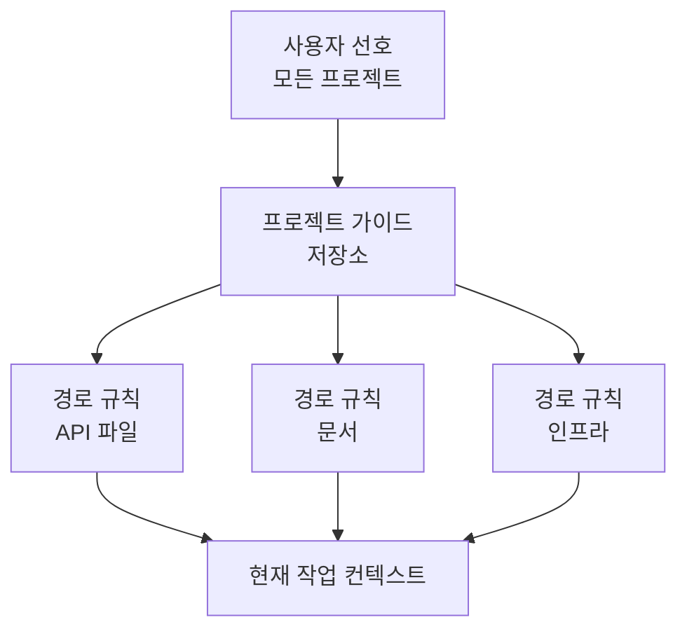

> 🇰🇷 이 문서는 한국어 번역본입니다(ELI5 스타일). 원문: [en.md](en.md)

# Claude Code 메모리, Rules, 스킬, CI

> 안정적인 가이드는 그 범위가 참인 곳에 두고, 실패가 용납되지 않는 제약은 실행 가능한 형태로 두세요.

**유형:** Reference
**언어:** Python
**선수 지식:** [Claude Code는 공유된 제약으로 확장됩니다](../../15-claude-code-for-development-teams/), [에이전트 SDK 세션, 서브에이전트, 컨텍스트](../../17-agent-sdk-sessions-subagents-and-context/)
**시간:** 약 210분

## 학습 목표

- 컨텍스트 비대 없이 프로젝트·사용자 지침 계층 설계하기
- 용도에 따라 CLAUDE.md, 경로 규칙, 스킬, 커맨드, 에이전트, 훅, 설정 고르기
- 좁은 도구 권한을 가진 실제 다중 파일 `SKILL.md` 패키지를 작성·배포하기
- 명시적인 장애 보고를 곁들인 플랜, 직접 실행, 경계가 분명한 서브에이전트 활용하기
- 재현 가능한 CI 증거를 위한 헤드리스 Claude Code 설정하기
- 낡은 메모리, 넓은 권한, 숨은 로컬 설정이 팀 작업을 지배하지 않게 하기

## 문제 상황

한 팀이 모든 지침을 루트 `CLAUDE.md` 하나에 넣어 둡니다. 아키텍처 역사, 포맷팅, 데이터베이스 규칙, 배포 절차, 개인 취향, 커맨드, 여섯 언어용 예제까지요. 이 파일이 모든 작업에 복사됩니다.

개발자들은 개인 재정의(오버라이드)를 추가합니다. CI에는 다른 설정이 있습니다. 어떤 커맨드는 쓰기 권한을 전제합니다. 넓은 범위의 훅이 무관한 파일까지 다시 포맷합니다. 지침은 "항상 모든 테스트를 실행하라"고 하니, 문서를 조금 고치는 것만으로 40분짜리 테스트 스위트가 돌아갑니다. 에이전트가 안전 규칙을 무시하면, 팀은 굵은 글씨를 더 추가합니다.

문제는 지침이 부족해서가 아닙니다. 문제는 범위, 우선순위, 점진적 공개이고, 가이드와 강제를 뒤섞은 것입니다.

## 개념

### 매커니즘을 일에 맞추기

| 매커니즘 | 가장 좋은 용도 | 피할 것 |
|-----------|----------|-------|
| `CLAUDE.md` | 간결하고 안정적인 저장소 가이드와 포인터 | 전체 매뉴얼, 임시 상태, 시크릿 |
| 임포트 파일 | 원 소유처 근처에 두는 공유 보조 지침 | 순환하거나 보이지 않는 지침 그래프 |
| 경로 규칙 | 일치하는 파일에만 참인 가이드 | 모든 작업에 복사되는 전역 규칙 |
| 스킬 | 관련 있을 때 로드되는 재사용 절차·도메인 플레이북 | 일회성 사실이나 단단한 인가 |
| 커맨드 | 사용자가 직접 실행하는 워크플로의 호환용 이름 | 스킬 구조 없는 새 다단계 패키지 |
| 에이전트 | 격리된 컨텍스트와 도구를 가진 경계가 분명한 역할 | 결정론적 유틸리티 함수 |
| 훅 | 결정론적 검증, 차단, 정규화, 자동화 | 열린 결말의 의미론적 판단 |
| 설정 | 권한, 모델, 플러그인, 런타임 설정 | 저장소에 커밋된 시크릿 값 |

제품 참고(2026-08-09 확인): 커스텀 커맨드는 스킬에 통합됐습니다. `.claude/commands/` 아래 파일은 여전히 호환되지만, `.claude/skills/<name>/SKILL.md`가 새 워크플로에 권장되는 패키지입니다. 정확한 필드, 우선순위, 제품 가용성은 바뀔 수 있으니 구현 전에 현재 Claude Code 문서로 확인하세요. 2026년 7월 CCAR-F 블루프린트는 여러분이 계층, 규칙, 커맨드, 스킬, 에이전트, 메모리, 플래닝, 헤드리스 워크플로를 이해하고 있기를 기대합니다.

### 루트 지침 파일은 작게

루트 파일은 유능한 새 기여자가 바르게 시작하도록 도와야 합니다.

넣을 것:

- 프로젝트 목적과 자명하지 않은 아키텍처 경계
- 표준 빌드, 테스트, 포맷팅 명령어
- 원천(source of truth) 파일
- 보안과 범위 제약
- 더 깊은 가이드로 가는 링크나 임포트
- 검증과 기여 기대 사항

뺄 것:

- 임시 작업 상태
- 생성된 목록
- 긴 API 레퍼런스
- 개인 에디터 설정
- 시크릿 값
- 하나의 디렉터리에만 적용되는 지침

지식 덤프가 아니라 온보딩 라우터로 다루세요.

### 지침은 가장 좁은 참인 범위에 두기



사용자 범위에는 팀 동작을 규정해선 안 되는 개인 기본값이 들어갑니다. 프로젝트 범위에는 버전 관리되는 공유 결정이 들어갑니다. 경로별 규칙은 파일 패턴이 일치할 때만 로드됩니다. 작업 지침에는 현재 요청이 담깁니다.

두 규칙이 충돌하면 문서화된 우선순위를 조사하고 프로젝트의 원천(source of truth)을 명확히 하세요. 중요한 워크플로가 숨은 로컬 재정의에 의존하게 만들지 마세요.

### 안정적인 보조 가이드는 임포트하기

임포트를 쓰면 모듈별 소유를 지키면서 루트 파일을 간결하게 유지할 수 있습니다. 예컨대 데이터베이스 마이그레이션 정책은 데이터베이스 문서 근처에 있어야 합니다. 루트의 포인터가 이를 찾을 수 있게 해 줍니다.

임포트 그래프를 감사하세요:

- 모든 대상이 존재하는지
- 순환이 없는지
- 넓은 파일 임포트가 시크릿이나 무관한 텍스트를 새지 않는지
- 소유와 갱신 트리거가 명확한지
- 삭제되거나 이름이 바뀐 가이드는 눈에 띄게 실패하는지

메모리 점검 커맨드는 어떤 지침이 활성인지 드러내는 데 도움이 됩니다. 이는 설정을 디버깅하는 용도로 쓰지, 복구 불가능한 프로젝트 상태를 저장하는 용도가 아닙니다.

### 점진적 공개에는 스킬 사용하기

스킬은 반복 가능한 방법, 참고 자료, 스크립트, 산출물을 묶습니다. 설명이 에이전트가 언제 적용할지 판단하도록 돕습니다. 본문 전체는 선택됐을 때만 로드되므로, 무관한 작업의 컨텍스트를 지켜 줍니다.

스킬이 잘 맞는 예:

- 데이터베이스 마이그레이션 검토
- 장애 분류(인시던트 트리아지)
- 릴리스 노트 작성
- 위협 모델 체크리스트
- 아키텍처 결정 인터뷰

스킬은 입력, 순서, 증거, 출력, 멈춤 조건을 정의해야 합니다. 시크릿을 담거나 권한을 부여해서는 안 됩니다.

실제 프로젝트 스킬은 `.claude/skills/<skill-name>/SKILL.md`에 위치합니다. 진입 파일은 YAML frontmatter와 마크다운 지침을 갖습니다:

```yaml
---
name: migration-review
description: Review database migration files when a change adds or modifies paths under migrations/. Use it before merge to collect forward, rollback, locking, and data-safety evidence.
allowed-tools: Read Grep Glob Bash(python3 ${CLAUDE_SKILL_DIR}/scripts/check_scope.py *)
---
```

description은 트리거 계약입니다. 스킬이 무엇을 하고 언제 적용되는지, 개발자가 실제로 쓸 법한 언어로 적으세요. 트리거되어야 할 요청과, 아슬아슬하게 비슷하지만 트리거되면 안 되는 요청을 모두 테스트하세요. 명시적인 `/skill-name` 호출로만 로드돼야 한다면 `disable-model-invocation: true`를 쓰세요.

`allowed-tools`는 호출 턴 동안 일치하는 도구를 사전 승인합니다. 사용 가능한 도구 집합을 제한하거나 deny 규칙을 덮어쓰거나 세션 권한으로 남지는 않습니다. 패턴은 패키지된 절차만큼만 좁게 유지하고, 폴더 신뢰를 수락하기 전에 프로젝트 스킬을 검토하세요.

세부 내용은 `SKILL.md` 밖으로 옮기고 의도적으로 안내하세요:

| 스킬 파일 | 목적 | 로드 조건 |
|---|---|---|
| `SKILL.md` | 트리거, 핵심 순서, 멈춤 조건, 출력 계약 | 스킬이 호출될 때 |
| `references/review-checklist.md` | 상세한 도메인 증거 | 핵심 순서가 검토 단계에 도달할 때 |
| `scripts/check_scope.py` | 결정론적 경로 검증 | 요청된 마이그레이션 파일을 읽기 전에 |
| `examples/accepted.md` | 대표적인 출력 형태 하나 | 형식이 모호할 때 |

모든 보조 파일을 `SKILL.md`에서 참조해서 Claude가 왜, 언제 열어야 하는지 알게 하세요. 번들 경로는 현재 작업 디렉터리를 가정하지 말고 `${CLAUDE_SKILL_DIR}`로 해석하세요. [`outputs/migration-review-skill/`](../outputs/migration-review-skill/) 아래의 제공 패키지는 실행 가능한 예제입니다.

### 명시적인 사용자 의도에는 커맨드 사용하기

커맨드는 사용자가 반복 가능한 워크플로를 의도적으로 실행할 때 유용합니다. 인자 힌트, 허용 도구, 실행 컨텍스트를 정의하세요. 격리가 필요하다면 지원되고 적절할 때 포크된 컨텍스트를 쓰세요.

예시:

- 마이그레이션 파일 하나 검토
- 인터뷰에서 ADR 생성
- 대상이 정해진 테스트 플랜 실행
- 실패한 CI 트레이스 살펴보기

조용히 쓰거나 배포하거나 넓은 Bash 접근을 쓰는 커맨드는 피하세요. 이름과 인자 계약이 결과를 분명히 드러내야 합니다.

새로 만드는 것은 그 명시적 워크플로를 사용자 호출형 스킬로 구현하세요. 기존 `.claude/commands/<name>.md` 파일도 여전히 `/<name>`을 만들며, 사용자를 깨뜨리지 않고 마이그레이션할 수 있습니다. 절차에 스크립트, 참고 자료, 템플릿, 호출 제어, 플러그인을 통한 배포가 필요하다면 스킬 디렉터리를 선호하세요.

### 서브에이전트를 경계가 분명한 증거 수집가로 쓰기

`/agents`를 실행해 재사용 가능한 서브에이전트 정의를 만들고 관리하세요. 프로젝트 에이전트는 `.claude/agents/` 아래에 두어 역할이 코드베이스와 함께 검토되게 합니다. `description`은 Claude에게 언제 위임할지 알려주고, `tools`는 도구 풀을 제한하고, `maxTurns`는 단단한 턴 예산을 주고, `isolation: worktree`는 편집 에이전트에게 별도 체크아웃을 줍니다.

```markdown
---
name: migration-auditor
description: Audit migration safety when a change touches migrations/. Return evidence and blockers; do not edit.
tools: Read, Grep, Glob, Bash
maxTurns: 10
isolation: worktree
---

Inspect only the assigned migration and adjacent schema code.
Stop after ten turns or twenty minutes, whichever comes first.
Return JSON with status, evidence, blockers, and next_step.
Never replace missing evidence with an assumption.
```

턴이나 시간 상자는 멈춤 조건이지 완료의 증거가 아닙니다. 부모 세션이 결과를 검증하고 통합을 책임집니다. 구조화된 장애 보고를 요구하세요. 파일에 접근할 수 없는 서브에이전트가 도구나 범위를 몰래 넓히는 대신, `status: blocked`와 정확한 장애물, 시도한 증거, 좁은 `next_step`을 돌려주도록요.

워크트리 격리는 서브에이전트가 편집할 때만 쓰세요. 읽기 전용 조사자는 대개 별도 컨텍스트면 충분합니다. 워크트리는 파일과 브랜치를 격리하지, 네트워크, 자격 증명, 공유 Git 메타데이터, 외부 시스템은 격리하지 않습니다.

### 가장 작은 공유 표면으로 배포하기

배포 방식은 청중에 따라 고르세요:

- 하나의 저장소라면 `.claude/skills/`와 `.claude/agents/`를 커밋합니다.
- 여러 저장소가 같은 버전 관리 번들을 필요로 한다면 스킬, 에이전트, 훅, MCP 정의를 플러그인에 넣습니다.
- 플러그인은 검토된 마켓플레이스로 게시하고 릴리스나 커밋을 고정합니다.
- 관리형 설정은 조직 정책과 마켓플레이스 제한용으로 쓰지, 모든 팀의 절차를 쏟아 넣는 장소로 쓰지 않습니다.

프로젝트는 `.claude/settings.json`에서 마켓플레이스를 알리고 검토된 플러그인을 활성화할 수 있습니다:

```json
{
  "extraKnownMarketplaces": {
    "company-tools": {
      "source": {"source": "github", "repo": "company/claude-plugins"},
      "autoUpdate": false
    }
  },
  "enabledPlugins": {
    "migration-review@company-tools": true
  }
}
```

폴더 신뢰는 여전히 중요하고, 관리형 `strictKnownMarketplaces`는 네트워크나 파일시스템 작업이 일어나기 전에 사용자가 어떤 소스를 추가할 수 있는지 제한할 수 있습니다. 게시자, 버전, 구성 요소, 스크립트, 훅, MCP 서버, 권한, 업데이트, 롤백을 검토하세요. 프로젝트 기본값은 팀 설정이고, 관리형 설정은 덮어쓸 수 없는 조직 정책입니다.

### 경로 규칙을 로컬 정책으로 쓰기

경로 글롭(glob)은 이런 규칙을 표현할 수 있습니다:

- API 변경은 계약 테스트를 요구
- 마이그레이션 파일은 추가 전용
- 문서는 특정 스타일 사용
- 프로덕션 설정에는 리터럴 시크릿 금지

글롭 동작을 테스트하세요. 한 번도 일치하지 않는 규칙은 거짓 안심을 줍니다. 저장소 전체에 일치하는 글롭은 루트 파일 비대를 재현합니다.

### 계획, 탐색, 실행을 분리하기

변경 전에 범위나 전략의 승인이 필요하면 플랜 모드를 쓰세요. 그대로 하면 본 작업을 부풀릴 읽기 전용 코드베이스 질문에는 탐색 서브에이전트를 쓰세요. 변경이 이미 경계가 있고 다음 안전 행동이 명백하면 직접 실행하세요.

요구 사항이 빠져 있을 때는 인터뷰 패턴이 유용합니다. 구현을 실질적으로 바꿀 질문을 하고, 결정을 기록한 뒤 만듭니다.

예제와 테스트는 실제 인수 경계를 보여줄 때 일관성을 높입니다. 지침을 되풀이할 뿐인 예제는 추가하지 마세요.

### 테스트를 대화 계약의 일부로 만들기

코드 작업이라면:

1. 동작과 가장 작은 관련 검증을 식별합니다.
2. 가능하면 실패하는 테스트를 확인하거나 작성합니다.
3. 경계가 분명한 변경을 만듭니다.
4. 좁은 범위의 테스트를 돌립니다.
5. 리스크에 비례하는 더 넓은 게이트를 돌립니다.
6. 실제 산출물이나 동작을 확인합니다.
7. 정확한 증거와 남은 불확실성을 보고합니다.

Claude가 이 루프를 제안하고 실행할 수 있지만, 게이트를 통과했는지는 결정론적인 CI가 결정합니다.

### 훅 결정에는 정확한 계약이 필요합니다

Claude Code는 훅에 JSON을 보냅니다. 커맨드 훅은 종료 코드 `0`으로 끝나며 stdout에 구조화된 JSON 객체 하나를 출력하거나, 종료 코드 `2`로 끝나며 stderr에 차단 사유를 씁니다. JSON은 종료 코드 `0`일 때만 파싱되므로 둘을 섞지 마세요. 종료 코드 `1`은 대부분의 이벤트에서 블로킹하지 않습니다.

이벤트 스키마는 서로 바꿔 쓸 수 없습니다. `PreToolUse`는 `hookSpecificOutput.permissionDecision`에 `allow`, `deny`, `ask`, `defer`를 쓰고, `PermissionRequest`는 `hookSpecificOutput.decision.behavior`에 `allow`나 `deny`를 씁니다. 설정된 deny와 ask 규칙은 여전히 평가되며, allow 결과가 일치하는 deny 규칙을 덮어쓰지 않습니다.

```json
{
  "hookSpecificOutput": {
    "hookEventName": "PermissionRequest",
    "decision": {
      "behavior": "deny",
      "message": "Production access requires interactive approval"
    }
  }
}
```

선택한 이벤트를 종료 코드 `2`가 막을 수 있는지 확인하세요. `PreToolUse`는 막고 `PermissionRequest`는 거부하지만, `PostToolUse`가 목격한 동작은 되돌릴 수 없습니다.

### 헤드리스 CI는 새 검토자로 설계하기

헤드리스 Claude Code는 프린트 모드와 구조화된 출력으로 비대화형 실행이 가능합니다. 사용 전에 현재 플래그와 스키마를 확인하세요. 변하지 않는 원칙은 이렇습니다:

- 깨끗한 커밋과 선언된 입력에서 시작
- 최소 권한의 도구와 설정 사용
- 모델과 설정을 고정하거나 기록
- 시간, 턴, 비용 경계 설정
- JSON이나 스키마 제약 출력 요청
- 지적 생성과 변경 적용 분리
- 필요한 곳에서 독립 검토 실행
- 수정 점검 시 이전 지적 사항을 명시적으로 포함
- 결정론적 테스트와 정책 게이트를 최종 권위로

CI는 인터랙티브 개발자 세션을 상속받아선 안 됩니다. 재현 가능성은 새로운 상태를 요구합니다.

제품 참고(2026-08-09 확인): Anthropic의 관리형 Code Review 제품은 Team 및 Enterprise 플랜 대상 연구 프리뷰입니다. 이것과 공식 GitHub 액션은 별개의 운영 선택입니다. 관리형 Code Review는 풀 리퀘스트 지적을 보고하지만 승인하거나 막지는 않습니다. `anthropics/claude-code-action@v1`은 명시적인 이벤트, GitHub 권한, 시크릿 소스, 설정, 도구, 모델, 턴 경계를 가진 저장소 워크플로 안에서 실행됩니다. 어느 쪽도 결정론적 게이트나 보호된 병합 경로를 대체하지 않습니다.

### 실행 사이에 지적 사항 보존하기

한 실행이 문제를 찾고 다른 실행이 수정을 검증한다면, 지적 사항을 안정적인 ID, 파일, 증거, 심각도, 상태를 가진 구조화된 산출물로 저장하세요. 자연어 요약만 전달하면 검증하려는 정확한 주장이 사라질 수 있습니다.

수정 검토에는 원본 지적 사항, 현재 diff, 관련 테스트, 인수 규칙이 전달됩니다. 원본 대화 전체는 필요 없습니다.

## 만들어 보기

## 인터랙티브 랩

```figure
19-memory-rule-precedence
```

우선순위 탐색기로 안정적인 프로젝트 사실, 경로별 가이드, 재사용 스킬, 커맨드, 결정론적 훅을 각자의 가장 좁은 참인 범위로 라우팅해 보세요. 충돌하는 계층이 왜 숨은 로컬 정책이 CI를 통치할 수 없는지 보여줍니다.

## 실습 랩

문서화된 경로 글롭 하나를 망가뜨리고, 어떤 픽스처 경로가 규칙을 로드하는지 살펴본 뒤, 좁은 가이드를 루트 파일로 되돌리지 않고 범위를 고치세요. 그다음 제공된 스킬 검사기를 마이그레이션 경로 하나와 경로 탈출 시도 하나로 실행해 봅니다:

```bash
python3 outputs/migration-review-skill/scripts/check_scope.py migrations/2026_add_index.sql
python3 outputs/migration-review-skill/scripts/check_scope.py ../secrets.sql
```

## 완성 산출물

작성을 마친 [`outputs/configuration-scope-audit.md`](../outputs/configuration-scope-audit.md)는 테스트한 글롭 픽스처, allow·deny 경계 하나, 경계가 분명한 서브에이전트, 플러그인 배포, 정확한 훅 출력, 새로운 CI 계약을 기록합니다. [`outputs/migration-review-skill/`](../outputs/migration-review-skill/) 디렉터리는 실제 `SKILL.md`와 결정론적 스크립트, 필요할 때 불러오는 참고 자료를 제공합니다.

## 검증하기

Claude, 네트워크 접근, 자격 증명 없이 검증합니다:

```bash
cd certifications/claude/lessons/19-claude-code-memory-rules-skills-and-ci
python3 code/main.py
python3 -m unittest discover -s code/tests -v
```

퀴즈는 매커니즘 선택과 CI 수정을 점검합니다.

## 캡스톤 연계

결과는 Architect Foundations 캡스톤의 Claude Code 설정 섹션에서 재활용하세요.

Python API 코드, 데이터베이스 마이그레이션, 문서를 가진 저장소를 위한 팀 설정을 설계합니다.

### 루트 가이드

읽기 좋은 한 페이지 안에 담으세요. 프로젝트 지도, 표준 명령어, 보안 제약, 경로 규칙 링크를 포함합니다.

### 경로 규칙

다음을 위한 별도 규칙을 만듭니다:

- `src/api/**`: 계약과 인가 테스트
- `migrations/**`: 추가 전용과 롤백 요구 사항
- `docs/**`: 스타일과 링크 검사

### 스킬과 커맨드

제공된 migration-review 패키지를 `.claude/skills/migration-review/`로 설치하고, 트리거 하나와 아슬아슬한 미스 하나를 테스트하며, 좁은 `allowed-tools` 권한을 유지하세요. 템플릿이나 스크립트가 필요해지면 명시적인 `/adr` 커맨드를 스킬로 옮깁니다.

`/agents`로 읽기 전용 migration-auditor 하나를 정의하세요. `maxTurns`, 구조화된 `status` / `evidence` / `blockers` / `next_step` 결과, 그리고 증거가 없으면 추측하는 대신 멈추라는 규칙을 주세요.

### 훅

- 쓰기 전: 선언된 범위 밖의 파일 차단
- 편집 후: 편집된 파일에만 포매터 실행
- Bash 전: 파괴적이거나 시크릿을 출력하는 명령어 거부
- 중단: 정확한 검증 증거 요구

### CI 검토

JSON 지적 사항을 내놓는 새로운 읽기 전용 검토를 실행합니다. 별도 잡이 결정론적 테스트와 정책 검사를 적용합니다. 두 산출물 모두 저장하세요.

그다음 설정 디버깅을 시험해 봅니다. 일치하지 않는 경로 글롭을 심고, 감사가 이를 잡아낸다는 것을 증명하세요.

## 활용하기

설정은 코드처럼 검토돼야 합니다. 변경은 권한, 컨텍스트, 도구, 자동화된 동작을 바꿀 수 있습니다.

다음 변경은 검토를 요구하세요:

- 새 MCP 서버나 플러그인
- 더 넓은 도구 권한
- 쓰기나 커맨드 효과가 있는 훅
- 모델이나 프로바이더 변경
- 새 임포트와 경로 패턴
- 외부 시스템에 닿는 스킬
- 더 넓은 도구, 더 높은 턴 한도, 워크트리 격리를 가진 에이전트
- 플러그인 마켓플레이스, 활성화된 플러그인, 자동 업데이트 정책
- 변경을 적용할 수 있는 CI 워크플로

작은 픽스처 작업으로 현재 동작을 기록하세요. 설정 테스트는 마이그레이션 가이드가 마이그레이션 경로에서만 로드되는 것, 위험한 커맨드가 차단되는 것, 검토 커맨드가 기대한 스키마를 돌려주는 것을 단언할 수 있습니다.

## 시험 의사결정 패턴

지침이 너무 크거나 일부 파일에만 적용된다면 범위가 있는 규칙이나 스킬로 옮기세요. 조건이 절대 위반되면 안 된다면 더 강한 프롬프트 문구 대신 결정론적인 설정, 권한, 훅, CI를 쓰세요.

이런 답을 고르세요:

- `CLAUDE.md`를 간결하고 버전 관리된 상태로 유지하고
- 좁은 가이드에는 임포트와 경로별 규칙을 쓰고
- 재사용 워크플로를 스킬이나 명시적 커맨드로 패키징하고
- 스킬 트리거 설명, 보조 파일, 좁은 호출 권한을 작성하고
- 서브에이전트를 도구 집합, 턴, 소유권, 구조화된 장애 보고로 경계 짓고
- 한 프로젝트 설정은 직접 배포하고, 프로젝트를 넘는 번들은 검토된 플러그인으로 배포하고
- 필요한 곳에서 격리된 커맨드 작업을 위해 컨텍스트를 포크하고
- 폭넓은 편집 전에 플랜이나 탐색을 쓰고
- 헤드리스 CI는 깨끗한 상태에서 구조화된 출력으로 돌리고
- 수정은 이전 지적 ID와 대조해 검증합니다

## 흔한 함정

### 백과사전이 된 루트 파일

모든 것이 모든 곳에서 로드됩니다. 중요한 제약이 무관한 세부와 경쟁하고, 소유자 없이 품어집니다.

### 팀 정책처럼 쓰인 개인 설정

로컬 동작은 CI에서 검토하거나 재현할 수 없습니다. 공유 결정은 프로젝트 범위에 두세요.

### 숨은 빌드 시스템이 된 훅

불투명한 자동화는 커맨드를 날벼락처럼 만들고 실패의 원인 파악을 어렵게 합니다. 훅은 작고 관측 가능하게 유지하세요.

### 유일한 게이트가 된 AI 검토

모델의 지적은 판단을 돕습니다. 불변 조건을 강제하는 것은 결정론적 테스트, 스키마, 보안 정책, 승인입니다.

## 연습 문제

1. 비대해진 루트 지침 파일을 한 페이지짜리 라우터로 줄이세요.
2. 경로 규칙을 설계하고 각 글롭이 일치함을 증명하는 픽스처 경로를 작성하세요.
3. 200줄짜리 워크플로 프롬프트를 트리거 테스트, 참고 파일, 결정론적 스크립트를 갖춘 다중 파일 스킬로 바꾸세요.
4. `/agents`로 읽기 전용 서브에이전트를 만들고, 턴을 제한하며, blocked 장애 보고를 테스트하세요.
5. 서로 다른 JSON 형태로 `PreToolUse` 거부와 `PermissionRequest` 거부를 검증하세요.
6. 스킬과 에이전트를 플러그인으로 패키징하고, 테스트 마켓플레이스에 고정하며, 롤백을 문서화하세요.
7. 안정적인 지적 ID를 가진 읽기 전용 헤드리스 검토 스키마를 만드세요.

## 핵심 용어

| 용어 | 사람들이 말하는 것 | 실제 의미 |
|------|-----------------|------------------------|
| CLAUDE.md | 영구적인 모델 메모리 | 문서화된 범위에 따라 로드되는 버전 관리 프로젝트 가이드 |
| 경로 규칙 | 추가 프롬프트 | 일치하는 파일 경로에서만 활성화되는 가이드 |
| 스킬 | 커맨드 별명 | 지침, 참고 자료, 도구, 출력을 지닌 재사용 절차를 필요할 때 로드하는 것 |
| 커맨드 | 자동화 마법 | 인자, 도구, 컨텍스트 동작을 갖춘 명시적인 사용자 호출 워크플로 |
| `allowed-tools` | 샌드박스 | 스킬 호출 턴 동안 일치하는 도구에 대한 임시 사전 승인 |
| 서브에이전트 | 무제한 병렬 작업자 | 선언된 역할, 도구, 턴 예산, 결과 계약을 가진 별도 컨텍스트 |
| 플러그인 | 프롬프트 파일 | 스킬, 에이전트, 훅, MCP 서버, 관련 설정의 버전 관리 번들 |
| 훅 | 모델 지시 | 생명주기 이벤트를 감싼 결정론적 코드 |
| 헤드리스 모드 | UI 없는 인터랙티브 채팅 | 선언된 입력으로부터 기계가 읽을 수 있는 출력을 내는 비대화형 실행 |

## 더 읽을거리

- [Claude Code 메모리 문서](https://code.claude.com/docs/en/memory)
- [Claude Code 스킬](https://code.claude.com/docs/en/skills)
- [Claude Code 서브에이전트](https://code.claude.com/docs/en/sub-agents)
- [Claude Code 워크트리](https://code.claude.com/docs/en/worktrees)
- [Claude Code 설정](https://code.claude.com/docs/en/settings)
- [Claude Code 플러그인 마켓플레이스](https://code.claude.com/docs/en/plugin-marketplaces)
- [Claude Code 훅](https://code.claude.com/docs/en/hooks)
- [Claude Code 관리형 Code Review](https://code.claude.com/docs/en/code-review)
- [Claude Code GitHub Actions](https://code.claude.com/docs/en/github-actions)
- [Claude Code 헤드리스 모드](https://code.claude.com/docs/en/headless)
- 페이즈 14, 레슨 33~38: 실행 가능한 지침, 상태, 범위, 검증
