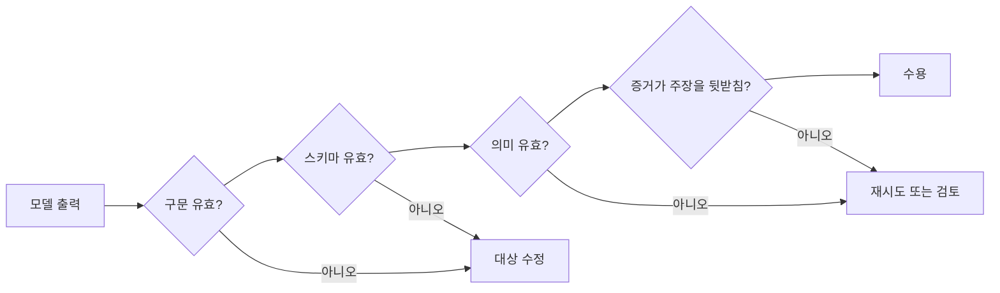

> 🇰🇷 이 문서는 한국어 번역본입니다(ELI5 스타일). 원문: [en.md](en.md)

# 신뢰할 수 있는 추출, 배치, 독립 검토자

> 유효한 JSON은 형태가 살아남았음을 증명합니다. 사실이 살아남았음을 증명하지는 않습니다.

**유형:** Reference
**언어:** Python
**선수 지식:** [신뢰도가 아니라 주장을 검증하라](../../05-output-evaluation-and-validation/), [구조화된 출력은 신뢰할 수 없는 계약이다](../../09-structured-output-and-defensive-parsing/); 페이즈 14, 레슨 39
**시간:** 약 135분

## 학습 목표

- 거짓 양성과 모호한 레이블을 줄이는 추출 기준 정의하기
- 스키마, 예제, nullable 필드, 열거형, 증거 구간을 의도적으로 활용하기
- 구문, 스키마, 의미, 출처 검증을 분리하기
- 경계가 있는 재시도와 독립 검토 패스 설계하기
- 워크플로 요구 사항에 따라 실시간 또는 배치 처리 고르기

## 문제 상황

어떤 파이프라인이 계약상 의무를 유효한 JSON으로 추출합니다. 모든 레코드가 스키마에 맞습니다. 그래도 법무 검토자는 18퍼센트를 반려합니다.

모델은 빠진 날짜를 그럴듯한 값으로 채우고, 배경 진술을 의무로 레이블링하고, 낯선 범주를 가장 가까운 열거형으로 돌려 맞춥니다. 재시도 루프가 검증을 통과할 때까지 같은 프롬프트를 다시 먹입니다. 검증이 타입만 확인하니, 지어낸 값은 더 그럴듯한 형식으로 다듬어질 뿐입니다.

팀은 직렬화를 해결하고 그것을 정확성으로 착각한 것입니다.

## 개념

### 스키마보다 판단 기준을 먼저 정의하기

스키마는 어떤 필드가 있는지 말해 줍니다. 기준은 무엇이 자격이 되는지 말합니다.

의무 추출기라면 이렇게 정의합니다:

- 의무 당사자는 명시적이거나 모호함 없이 연결돼야 함
- 요구되는 행동은 논의만 된 게 아니라 진술돼야 함
- 트리거와 기한은 근거가 있을 때만 추출
- 증거 구간은 해당 주장을 담고 있어야 함
- 모르는 값은 `null`로 남음
- 근거 없는 범주는 메모와 함께 `other`를 쓰거나 검토를 트리거
- 예외와 부정은 결과를 바꿈

이런 규칙이 없으면 주석자, 모델, 평가자가 저마다 다른 작업을 수행합니다.

### 경계에는 퓨샷 예제 사용하기

예제는 상식적인 사람들조차 판단이 갈리는 지점에서 가장 유용합니다.

포함할 것:

- 명확한 긍정 사례
- 아슬아슬한 미스 사례
- 부정된 의무
- `null`로 표현된 빠진 날짜
- 열거형 밖의 범주
- 한 문단에 두 개의 의무
- 서로 충돌하는 조항

각 예제는 답만이 아니라 이유를 보여줘야 합니다. 뻔한 쉬운 사례로 컨텍스트를 채우지 마세요.

### 부재를 표현할 수 있게 만들기

어떤 필드가 모를 수 있다면 스키마에 명시적인 상태가 필요합니다. 문자열을 강요하면 지어내기를 부추깁니다.

```json
{
  "type": "object",
  "properties": {
    "party": {"type": ["string", "null"]},
    "action": {"type": "string"},
    "deadline": {"type": ["string", "null"]},
    "category": {
      "type": "string",
      "enum": ["payment", "delivery", "reporting", "other"]
    },
    "evidence_span": {"type": "string"},
    "needs_review": {"type": "boolean"}
  },
  "required": ["party", "action", "deadline", "category", "evidence_span", "needs_review"],
  "additionalProperties": false
}
```

필수 + nullable은 명시적인 결정을 강제합니다. 근거가 있는 값이거나, 확인된 부재거나. 조용한 필드 누락을 막아 줍니다.

### 타입 있는 출력에는 도구 사용 활용하기

부수 효과 없는 추출 도구가 스키마를 실어 줄 수 있습니다. 애플리케이션이 필요로 할 때 도구 선택(tool choice)으로 그 타입 있는 레코드를 강제할 수 있습니다. 엄격한 스키마 기능은 현재 API가 지원하는 곳에서 유효한 구조를 보장할 수 있습니다.

구조화된 출력을 얻자고 실제 동작 도구를 호출하지 마세요. 추출과 실행은 권한이 다릅니다.

### 네 계층으로 검증하기



#### 구문

페이로드를 파싱할 수 있는가?

#### 스키마

필드, 타입, 열거형, 범위가 유효한가?

#### 의미

필드 간 관계가 성립하는가? 도메인이 금지한다면 기한이 적용일보다 앞설 수 없습니다. 근거 없는 범주에 `needs_review`가 false일 수는 없습니다.

#### 출처

증거 구간이 실제로 추출된 주장을 뒷받침하는가? 그리고 올바른 소스 버전에서 왔는가?

자신만만한 환각 대부분은 마지막 두 계층만 잡아냅니다.

### 가장 작은 유용한 오류를 되돌려 주기

수정 시에는 구조화된 검증 피드백을 돌려줍니다:

```json
{
  "category": "semantic_validation",
  "field": "deadline",
  "message": "The extracted date does not appear in the evidence span.",
  "allowed_action": "Set deadline to null or select a supported span."
}
```

"다시 시도"만 말하지 마세요. 원본 소스와 이전 결과를 유지하고, 재시도는 제한하세요. 의미 오류가 반복되면 불확실성을 지연 시간과 비용으로 바꾸는 대신 에스컬레이션해야 합니다.

### 생성자와 검토자 분리하기

생성자가 추출합니다. 검토자는 소스, 후보 레코드, 채점 기준을 받습니다. 검토자는 이것을 확인합니다:

- 필수 증거가 존재하는지
- 구간이 null이 아닌 모든 주장을 뒷받침하는지
- 부정과 예외가 처리됐는지
- 범주가 정의에 맞는지
- 모르는 것을 지어내지 않았는지
- 충돌과 모호함이 표시됐는지

더 강한 독립성을 위해 새 컨텍스트를 쓰세요. 검토자는 지적 ID, 필드, 증거, 처리 결과(disposition)를 돌려줍니다. 레코드를 몰래 다시 쓰지 않습니다.

검토자의 정밀도와 재현율은 사람 레이블과 대조해 측정하세요. 모델 심판은 도구이지 정답(ground truth)이 아닙니다.

### 워크플로에 맞는 배치 선택하기

2026년 7월 CCAR-F 공개 가이드는 Message Batches 비용 50퍼센트 절감, 최대 24시간의 처리 기간(보장된 지연 시간 SLA 없음), 하나의 배치 요청 안에서의 멀티 턴 도구 호출 불가를 명시합니다. 이것들은 시험일 기준의 참고 사실이지, 가격이나 서비스 한도가 변하지 않겠다는 약속이 아닙니다. 배포 전에 [Message Batches 문서](https://platform.claude.com/docs/en/build-with-claude/batch-processing)에서 현재 가격, 한도, 보존 기간, 기능 호환성을 확인하세요.

배치가 맞는 경우:

- 대규모 오프라인 추출
- 평가 데이터셋
- 야간 분류
- 백필과 재처리
- 생성 뒤의 독립 검토

실시간이 맞는 경우:

- 인터랙티브한 사용자 응답
- 엄격하고 짧은 지연 시간 한도가 있는 작업
- 같은 요청 안에서의 적응형 도구 사용
- 즉각적인 승인이나 피드백이 필요한 워크플로

다음 단계가 요청 도중 모델이 관찰해야 하는 외부 동작에 의존한다면 배치를 쓰지 마세요. 입력을 미리 계산하거나 워크플로를 잡으로 나누세요.

### 배치 잡을 대조 가능하게 만들기

모든 항목에 안정적인 `custom_id`를 주세요. 소스 버전, 스키마 버전, 프롬프트 버전, 기대 출력 위치를 저장합니다. 결과는 순서가 뒤섞여 돌아올 수 있습니다.

다음을 처리하세요:

- 성공
- 검증 실패
- 공급자 실패
- 만료
- 중복 제출
- 부분 잡 완료
- 소스 변경 뒤의 재시도

결과와 입력을 배열 위치로 조인하지 마세요.

### 중요한 오류를 평가하기

추출이라면:

- 필드별 정밀도와 재현율
- (적절한 곳에서) 정확 일치 또는 정규화 일치
- 증거 뒷받침 비율
- 고위험 필드의 거짓 양성 비율
- null 보정
- 범주 혼동 행렬
- 검토자 불일치
- 수용된 레코드당 비용과 지연 시간

평균은 위험한 거짓 양성 부류를 숨길 수 있습니다. 문서 유형, 언어, 길이, 리스크로 층을 나눠 보세요.

## 만들어 보기

## 인터랙티브 랩

```figure
20-batch-review-confidence
```

신뢰도·검토 시뮬레이터로 레코드가 구문, 스키마, 의미, 출처 게이트를 통과하는 과정을 따라가 보세요. 거짓 양성 비용과 검토 커버리지를 조절하면, 유효한 JSON과 모델 신뢰도만으로는 출시 기준이 충분하지 않은 이유가 보입니다.

## 실습 랩

근거가 있는 날짜 하나를 지어낸 값으로 바꾸고, 네 검증 계층을 돌리고, 실패한 레코드를 무분별한 재시도 대신 재정(adjudication)으로 보내 보세요.

## 완성 산출물

작성을 마친 [`outputs/extraction-review-report.md`](../outputs/extraction-review-report.md)에는 안정적인 `custom_id` 값을 가진 배치 잡, nullable인 미지 값, 뒤섞인 결과, 검토 지적 사항, 재정 상태가 담깁니다.

## 검증하기

결정론적 검증기를 실행합니다:

```bash
cd certifications/claude/lessons/20-reliable-extraction-batch-and-reviewers
python3 code/main.py
python3 -m unittest discover -s code/tests -v
```

퀴즈는 수정, 배치, 검토자 결정을 점검합니다.

## 캡스톤 연계

검증을 마친 보고서는 네 검증 계층 전부의 증거로서 Architect Foundations 추출 시나리오로 가져가세요.

지원 정책 변경을 위한 추출 파이프라인을 만듭니다.

### 출력 계약

정책 ID, 적용일, 영향 지역, 행동 유형, 임계값, 증거 구간, 소스 버전, 검토 상태를 추출합니다. 불확실한 모든 필드는 nullable이거나 명시적인 `other` 상태를 갖습니다.

### 데이터셋

예제를 최소 40개 만듭니다:

- 명확한 변경 15개
- 변경이 없는 배경 진술 10개
- 부정이나 예외 5개
- 빠진 날짜나 임계값 5개
- 충돌하는 버전 5개

### 패스

1. 엄격한 스키마를 쓰는 생성기
2. 결정론적 구문·스키마 검증
3. 의미 관계 검증
4. 독립 증거 검토자
5. 불일치에 대한 사람의 재정

### 실험

제로샷 기준, 퓨샷 경계 예제, 생성기+검토자를 비교합니다. 거짓 양성, 증거 뒷받침, 비용, 지연 시간을 보고하세요.

### 배치 설계

안정적인 ID로 레코드를 제출합니다. 테스트에서는 결과 순서를 무작위로 섞습니다. 부분 실패를 주입하고, 대조가 완료된 레코드는 유지하면서 안전한 항목만 재시도한다는 것을 증명하세요.

## 활용하기

프로덕션(운영 환경)에서는 날 것 소스를 정규화된 추출과 분리해 저장하세요. 소스 버전과 증거 오프셋을 유지합니다. 기준이나 스키마가 바뀌면 과거 결정을 덮어쓰지 말고 새 출력 버전을 만드세요.

사람이 레코드를 고쳤다면 사유 코드를 저장하세요. 프롬프트를 수정하기 전에 불일치를 활용해 기준과 평가 세트를 개선합니다.

고위험 추출이라면 검토를 층화할 수 있습니다. 고영향 필드와 근거가 약한 레코드, 새 문서 유형은 전부 검토하고, 평범한 사례는 무작위 표본을 뽑아 검토합니다.

## 시험 의사결정 패턴

JSON은 유효한데 내용이 틀리다면 의미·증거 검증을 더하세요. 판단 경계에서 일관성이 약하다면 명시적인 기준과 퓨샷 예제를 쓰세요.

이런 답을 고르세요:

- 지어내는 대신 `null`이나 `other`를 쓰고
- 실제 동작을 촉발하지 않고 타입 있는 출력을 강제하고
- 구체적인 검증 오류를 재시도 한도와 함께 되돌려 주고
- 생성자와 검토자를 분리하고
- 비동기이고 도구에 독립적인 워크로드에는 배치를 쓰고
- 안정적인 ID로 결과를 대조합니다

## 흔한 함정

### 스키마 곧 진실

타입은 값이 소스에 등장하는지, 소스로부터 도출되는지 증명하지 못합니다.

### 필수인 non-nullable 필드

계약에 부재를 표현할 방법이 없으니 모델은 그럴듯한 값을 지어냅니다.

### 무한 수정

같은 모호한 소스가 되풀이되는 추측을 낳습니다. 정해진 시도를 마쳤으면 에스컬레이션하세요.

### 조용히 고쳐 쓰는 검토자

시스템은 어떤 주장이 왜 실패했는지 잃어버립니다. 통제된 수정에 앞서 구조화된 지적 사항을 먼저 돌려주세요.

## 연습 문제

1. 임계값과 통화를 묶는 의미 규칙을 추가하세요.
2. 거짓 의무를 줄이는 부정 예제를 설계하세요.
3. 검토자를 사람 레이블과 대조해 보정하고 불일치를 보고하세요.
4. 뒤섞인 배치 결과를 위한 안정적 ID 대조를 만드세요.
5. 단일 패스 파이프라인과 검토자 파이프라인의 수용 레코드당 비용을 비교하세요.

## 핵심 용어

| 용어 | 사람들이 말하는 것 | 실제 의미 |
|------|-----------------|------------------------|
| 구조화된 출력 | 올바른 데이터 | 기계가 읽을 수 있는 형태와 일치하는 데이터 |
| 의미 검증 | 스키마 검증 | 값과 관계가 도메인에 맞는 뜻이 되는지 확인 |
| 출처 검증 | 유효한 인용 | 소스 증거가 추출된 바로 그 주장을 뒷받침한다는 증명 |
| Nullable | 선택적 필드 | 모르는 값이나 없는 값에 대한 명시적 지원 상태 |
| 배치 | 더 빠른 API | 오프라인 대량 처리와 다른 비용·지연 제약에 최적화된 비동기 처리 |
| 재정 | 재시도 | 평가자나 레이블의 불일치를 해결하는 자격 있는 결정 |

## 더 읽을거리

- [Claude 구조화된 출력 문서](https://platform.claude.com/docs/en/build-with-claude/structured-outputs)
- [Claude Message Batches 문서](https://platform.claude.com/docs/en/build-with-claude/message-batches)
- 페이즈 11, 레슨 03: 기초부터 시작하는 구조화된 출력
- 페이즈 14, 레슨 39: 검토자 에이전트
- 페이즈 17, 레슨 15: 배치 아키텍처
