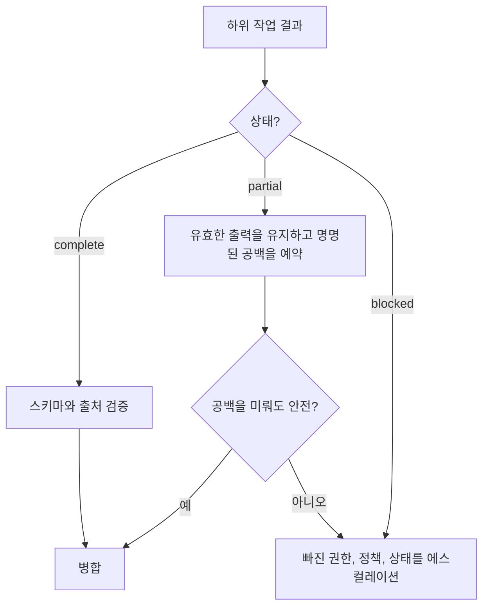

> 🇰🇷 이 문서는 한국어 번역본입니다(ELI5 스타일). 원문: [en.md](en.md)

# 큰 컨텍스트를 관측 가능하게 만들기

> 큰 컨텍스트 윈도우는 더 많은 증거를 담을 수 있습니다. 하지만 어떤 증거가 주목됐고, 최신이고, 권위 있고, 행동해도 안전한지는 말해 주지 않습니다.

**유형:** Reference
**언어:** Python
**선수 지식:** [에이전트 SDK 세션, 서브에이전트, 컨텍스트](../../17-agent-sdk-sessions-subagents-and-context/), [도구 계약, 오류, 점진적 탐색](../../18-tool-contracts-errors-and-progressive-discovery/), [신뢰할 수 있는 추출, 배치, 독립 검토자](../../20-reliable-extraction-batch-and-reviewers/)
**시간:** 약 150분

## 학습 목표

- 중요한 사실을 배치하고 검색해 lost-in-the-middle 실패를 줄이기
- 출처, 오류, 충돌, 결정에 필요한 세부를 잃지 않고 도구 출력 다듬기
- complete, partial, blocked 결과를 에이전틱 워크플로 전체에 전파하기
- 큰 코드베이스 작업마다 매니페스트, 스크래치패드, 서브에이전트, 컴팩션을 구분해 쓰기
- 증거와 결과의 무게에 따라 신뢰도를 보정하고 사람 검토를 층화하기
- 수집과 렌더링 과정에서 소스 신원, 날짜, 충돌, 콘텐츠 유형 보존하기

## 문제 상황

마이그레이션 코디네이터에게 파일 140개, 아키텍처 문서 세 개, 의존성 보고서, 테스트 로그, 서브에이전트 넷의 결과가 들어옵니다. 프롬프트는 광고된 컨텍스트 윈도우 안에 들어갑니다.

그래도 최종 플랜은 보안 규칙 하나를 위반합니다. 그 규칙은 긴 아키텍처 문서 한가운데쯤에 딱 한 번 등장합니다. 실패한 통합 테스트를 담은 도구 결과는 "테스트는 대체로 통과"로 줄여졌습니다. 한 서브에이전트는 파일 24개 중 18개를 검토하다 타임아웃됐지만, 산문 요약은 완전해 보입니다. 마크다운 표는 추출 과정에서 열 관계를 잃어, 폐기 예정인 의존성이 지원되는 것처럼 보입니다.

이름상의 토큰 한도를 넘은 것은 없습니다. 시스템이 실패한 이유는, 중요한 사실의 배치가 약했고, 메타데이터가 사라졌고, 부분 완료된 작업이 완료처럼 보였고, 에스컬레이션 규칙을 정의한 사람이 아무도 없었기 때문입니다.

컨텍스트 신뢰성은 더 많은 텍스트를 담는 능력이 아닙니다. 올바른 상태를 보존하고, 불확실성을 드러내고, 증거가 부족할 때 결정을 알맞은 곳으로 라우팅하는 능력입니다.

## 개념

### 컨텍스트에는 어텐션 지형이 있다

모델은 모든 토큰을 모든 작업에서 똑같이 유용하게 취급하지 않습니다. 입력이 길어지면 증거를 찾기 어려워지는데, 특히 관련 사실이 비슷하거나 상충하는 자료에 둘러싸여 있을 때 그렇습니다. 이를 흔히 lost in the middle(가운데서 잃어버림)이라고 부릅니다.

배치는 의도적으로 쓰세요:

1. 증거 앞에 작업, 결정, 단단한 제약, 출력 계약을 둡니다.
2. 파일, 주장, 출처, 서브시스템 같은 안정적인 식별자로 증거를 묶습니다.
3. 현재 질문은 모델이 답해야 하는 바로 직전에 둡니다.
4. 최종 요청 근처에는 소수의 결정적인 제약만 반복합니다.
5. 아카이브 전체를 들고 다니지 말고 현재 결정에 필요한 좁은 증거를 검색합니다.

모든 규칙을 양쪽 끝에서 반복하지 마세요. 반복은 컨텍스트를 잠식하고 낡은 지침을 증폭시킬 수 있습니다. 빠지면 실질적인 실패를 부르는 불변 조건만 끌어올리세요.

```text
goal and hard constraints
current manifest and unresolved gaps
relevant evidence blocks with metadata
decision-specific question
required result and escalation schema
```

증거를 신뢰할 수 있게 고를 수 있다면, 검색이 보통 거대한 프롬프트 하나보다 강합니다. 큰 컨텍스트 윈도우는 남은 어려운 사례를 위한 용량이지, 정보 아키텍처를 건너뛰라는 허가가 아닙니다.

### 증거에는 봉투(envelope)가 필요하다

날 것 텍스트로는 부족합니다. 중요한 단위마다 구조화된 메타데이터를 씌우세요:

```json
{
  "evidence_id": "policy-auth-017",
  "source_uri": "repo://docs/security/authentication.md",
  "source_version": "git:3a91c7e",
  "content_type": "text/markdown",
  "effective_date": "2026-07-15",
  "observed_at": "2026-08-08T10:30:00Z",
  "authority": "approved-architecture-policy",
  "scope": ["services/auth/**"],
  "extractor": "markdown-section-v2",
  "location": {"heading": "Token rotation", "lines": [88, 112]},
  "status": "active"
}
```

값은 예시입니다. 이 봉투는 산문이 답하지 못하는 질문에 답합니다:

- 에이전트는 어떤 버전을 봤는가?
- 그것이 정책인가, 초안인가, 생성된 요약인가?
- 어떤 파일이나 주장을 다스리는가?
- 원본 구간을 들여다볼 수 있는가?
- 더 새롭거나 더 권위 있는 다른 출처가 있는가?

소스 본문과 메타데이터를 모든 인계 단계에서 묶어 두세요. 신원 없는 매끈한 요약은 검증하기 어렵습니다.

### 결정 가치 기준으로 도구 출력 다듬기

도구 출력이 컨텍스트를 잠식할 수 있습니다. 다듬기는 상태가 아니라 반복을 제거해야 합니다.

남길 것:

- 도구 호출과 트레이스 ID
- 명령어나 질의와 범위가 지정된 대상
- 종료 코드나 완료 상태
- 구조화된 오류와 재시도 가능 여부
- 영향을 받은 파일, 레코드, 주장
- 실패한 단언과 가장 작은 뒷받침 발췌
- 개수, 합계, 생략된 항목 수
- 소스 버전과 타임스탬프
- 충돌과 미해결 공백
- 전체 외부 산출물을 가리키는 포인터

제거하거나 외부화할 것:

- 반복되는 진행 줄
- 중복 스택 프레임
- 뚜렷한 증거를 더하지 않는 성공 행
- 장식적 포맷팅
- 안정적인 참조로 이미 저장된 큰 본문

가능하면 결정론적 어댑터를 쓰세요:

```json
{
  "status": "partial",
  "summary": "18 of 24 files reviewed; 2 findings; 6 files not processed",
  "findings": ["finding-014", "finding-015"],
  "errors": [
    {
      "category": "dependency_timeout",
      "retryable": true,
      "scope": ["services/payments/**"],
      "trace_id": "trace-8801"
    }
  ],
  "full_artifact": "artifact://review/run-224"
}
```

"대체로 통과"는 가장 중요한 구분을 지워버립니다. 어느 부분이 통과하지 못했는지요.

### complete, partial, blocked는 1급 상태다

모든 작업 계약은 세 가지 결과를 정의해야 합니다:

- **Complete:** 필요한 모든 부분이 출력 계약을 충족합니다.
- **Partial:** 유효한 작업은 있지만, 명명된 범위나 증거가 빠져 있습니다.
- **Blocked:** 안전한 진행에 새로운 권한, 정책, 데이터, 외부 상태가 필요합니다.

partial은 실패가 아니고, complete도 아닙니다. 코디네이터는 유효한 지적 사항은 유지하고, 자격이 되는 공백만 재시도하며, 종합 단계가 빠진 작업을 '문제 없음'으로 해석하지 않게 막을 수 있습니다.



오류에는 범주, 재시도 가능 여부, 안전한 메시지, 영향 범위, 부분 결과 참조, 제안되는 다음 행동이 필요합니다. 타임아웃은 재시도로 해결될 수 있습니다. 인가 거부는 재시도로 고쳐지지 않습니다. 모호한 정책에는 토큰이 아니라 소유자가 필요합니다.

### 불안이 아니라 사유를 에스컬레이션하기

에스컬레이션은 빠진 결정을 이름으로 짚어야 합니다:

| 상황 | 안전한 대응 |
|---|---|
| 증거 부족 | 필요한 출처와 영향받는 결론을 특정 |
| 권위 있는 출처 간 충돌 | 양쪽을 보존하고, 문서화된 우선순위를 적용하거나, 소유자에게 라우팅 |
| 정책 공백 | 통제 대상 동작을 멈추고 정책 소유자에게 규칙 요청 |
| 권한 공백 | 범위가 지정된 접근을 요청하거나 승인된 대체 경로 선택 |
| 의미 오류 반복 | 경계가 있는 재시도를 멈추고 재정 요청 |
| 미지의 외부 부수 효과 | 재시도 전에 상태를 재조정 |

"모델이 확신하지 못합니다"로 에스컬레이션하지 마세요. 출처 ID, 시도한 검사, 정확한 모호함, 결과의 무게, 기한, 이용 가능한 안전한 선택지를 제공하세요.

### 큰 코드베이스에는 네 가지 서로 다른 메모리 도구가 필요하다

이 매커니즘들은 서로 연관되지만 바꿔 쓸 수는 없습니다.

#### 매니페스트

매니페스트는 지속되는 지도입니다. 파일 ID, 소유, 목적, 의존성, 검토 상태, 해시, 지적 사항, 미해결 작업을 담습니다. 커버리지와 복구를 지탱합니다. 매니페스트는 대화 밖에서 공식적인 권위를 유지합니다.

#### 스크래치패드

스크래치패드는 현재 경계가 분명한 작업을 위한 임시 추론을 지탱합니다. 검색 가설, 후보 파일, 다음 검사 같은 것들이요. 버려도 됩니다. 결정, 승인, 완료된 동작의 유일한 사본은 절대 저장하지 마세요.

#### 서브에이전트

서브에이전트는 경계가 분명한 관심사를 위한 격리된 컨텍스트를 받습니다. 파일과 증거 참조가 붙은 구조화된 결과를 돌려줍니다. 격리는 컨텍스트 경쟁을 줄이지만, 커버리지와 병합 규칙의 강제는 여전히 코디네이터가 책임집니다.

#### 컴팩션

컴팩션은 커지는 세션을 현재 목표, 제약, 검증된 작업, 열린 공백, 증거 참조, 다음 행동으로 압축합니다. 컨텍스트 크기를 통제합니다. 진실이나 지속 상태를 보장하지는 않습니다.

함께 쓰세요:

```text
manifest says what exists and what is done
scratchpad helps decide the next bounded search
subagent isolates one reasoning responsibility
compaction rebuilds a smaller current working set
```

큰 저장소라면 구조와 의존성 지도부터 만들고, 가장 작은 연결된 조각을 검색하세요. 경계가 분명한 서브에이전트에게 특정 서브시스템의 점검을 맡깁니다. 정규화된 지적 사항은 매니페스트로 돌려보냅니다. 마지막 파일 간 패스는 날 것 대화 기록이 아니라 매니페스트와 수용된 증거 위에서 돌립니다.

### 신뢰도는 증거로 보정돼야 한다

모델이 만든 퍼센트가 소수점 둘째 자리까지 있다고 해서 보정된 것은 아닙니다. 신뢰도는 관측 가능한 증거로 표현하세요:

- 뒷받침 등급: 직접, 계산됨, 간접, 충돌, 없음
- 출처의 권위와 신선도
- 커버리지: 필수 항목 대비 검토된 항목
- 평가자 동의와 알려진 불일치
- 시험된 사례 대비 새로움
- 틀렸을 때의 결과

결정 기록은 이렇게 말할 수 있습니다:

```text
Evidence class: direct in two approved sources
Coverage: 24 of 24 required files
Conflicts: one resolved by architecture owner on 2026-08-07
Automated checks: 18 passed, 0 failed
Residual uncertainty: runtime behavior not observed under network partition
Disposition: human review required before production rollout
```

"92퍼센트 확신"보다 이쪽이 쓸모 있습니다.

### 사람 검토는 층화돼야 한다

결과의 무게나 정책이 요구하면 모든 사례를 검토하세요. 그렇지 않다면 사람의 주의를 리스크로 배분합니다:

- 고영향 결정 전부
- 충돌이나 정책 공백 전부
- 증거가 약하거나 부분인 결과 전부
- 새 콘텐츠 유형, 언어, 서브시스템 전부
- 결정 임계값 근처의 사례
- 평범하게 통과하는 사례의 무작위 표본

무작위 표본은 미지의 실패 부류를 잡아냅니다. 표시된 사례만 검토하면, 망가진 표시기는 계속 안 보일 수 있습니다.

검토자의 불일치와 정정을 추적하세요. 이는 허영심 어린 수용률을 계산하는 게 아니라 평가 사례와 라우팅 임계값을 갱신하는 데 씁니다.

### 콘텐츠 유형은 의미를 바꾼다

수집과 렌더링은 콘텐츠 유형을 존중해야 합니다:

- 마크다운은 제목, 목록, 링크, 코드 펜스를 구조로 씁니다.
- HTML에는 눈에 보이는 텍스트와 다른 숨은 내비게이션, 스크립트, 접근성 레이블이 있을 수 있습니다.
- PDF 페이지는 표, 각주, 단, 다이어그램, 스캔 이미지를 실을 수 있습니다.
- CSV와 스프레드시트는 행, 열, 수식, 시트로 관계를 표현합니다.
- 소스 코드는 심벌, 임포트, 주석, 생성된 파일, 저장소 경로에 의존합니다.
- 이미지와 다이어그램은 시각적 해석에 더해 원본 에셋 참조가 필요합니다.

모든 형식을 구분 없는 텍스트로 납작하게 만들면, 표가 뒤집히고 각주가 떨어져 나가고 내비게이션이 증거와 뭉칠 수 있습니다. 원본 콘텐츠 유형, 추출 방법, 위치, 렌더링 경고를 저장하세요. 레이아웃이 의미를 실을 때는 실제 렌더링된 산출물을 시험하세요.

문서 텍스트는 신뢰할 수 없는 데이터로 다루세요. 숨은 HTML 요소나 코드 주석이 작업이나 도구 정책을 덮어쓰면 안 되는 지시를 품고 있을 수 있습니다.

## 만들어 보기

## 인터랙티브 랩

```figure
21-provenance-escalation
```

출처·에스컬레이션 시뮬레이터로 증거를 묻거나, 다듙거나, 충돌시키거나, 제거하면서 커버리지와 작업 상태가 변하는 것을 지켜 보세요. 이 인터랙션이 `partial`과 `blocked`를 관측 가능하게 만들어, 매끈한 요약이 빠진 작업을 숨기지 못하게 합니다.

## 실습 랩

패킷 사본에서 생략 항목 수나 충돌 소유자를 빼 보고, 거짓 완료의 리스크를 관찰한 뒤, 증거 봉투를 고쳐 보세요.

## 완성 산출물

작성을 마친 [`outputs/reliability-packet.md`](../outputs/reliability-packet.md)는 충돌 하나, 명시적인 커버리지, 소스 메타데이터, 소유자가 지정된 에스컬레이션과 함께 파일 24개 검토를 기록합니다.

## 검증하기

증거 봉투와 검토 층을 검증합니다:

```bash
cd certifications/claude/lessons/21-long-context-reliability-provenance-and-escalation
python3 code/main.py
python3 -m unittest discover -s code/tests -v
```

퀴즈는 배치, 매니페스트, 복구를 점검합니다.

## 캡스톤 연계

패킷은 Architect Foundations 캡스톤의 컨텍스트 신뢰성 부록으로 쓰세요.

큰 코드베이스 보안 검토를 위한 신뢰성 패킷을 만듭니다.

### 단계 1: 매니페스트 만들기

범위 안의 모든 파일을 서브시스템, 소유자, 해시, 콘텐츠 유형, 검토 상태, 배정된 서브에이전트, 지적 ID, 미해결 공백과 함께 나열합니다. 결정론적 커버리지 검사를 더하세요.

### 단계 2: 컨텍스트 예산 정의하기

목표, 단단한 제약, 현재 매니페스트 조각, 관련 증거, 구조화된 오류, 출력 계약에 자리를 남겨 둡니다. 전체 로그는 안정적인 참조와 함께 외부에 저장합니다.

### 단계 3: 도구 결과 정규화하기

검색, 테스트, 파일 점검용 어댑터를 작성합니다. 타임아웃, 잘린 로그, 권한 거부, 부분 검색 결과를 주입하고, 각각이 영향 범위와 올바른 재시도 동작을 보존하는지 확인하세요.

### 단계 4: 에스컬레이션 규칙 더하기

충돌하는 정책, 커버리지 밖 파일, 빠진 인가, 미지의 부수 효과에 대한 픽스처를 만듭니다. 각각은 소유자와 안전한 다음 행동을 이름으로 짚어야 합니다.

### 단계 5: 검토 보정하기

심각한 지적 사항과 부분 결과는 전부 검토하고, 통과 사례는 무작위 표본을 검토합니다. 보고된 증거 등급과 검토자의 처리 결과를 비교하고, 측정된 거짓 통과 리스크로 라우팅을 조정하세요.

### 단계 6: 렌더링 시험하기

마크다운 정책 하나, 표가 많은 PDF 하나, CSV 하나, 소스 파일 하나를 쓰세요. 인용이 올바른 섹션, 페이지, 셀 범위, 줄로 연결되는지, 레이아웃에 의존하는 사실이 살아남는지 확인합니다.

## 활용하기

### 시험 의사결정 패턴

긴 컨텍스트 신뢰성 시나리오라면:

1. 현재 목표와 결정적인 제약을 명확한 경계에 둡니다.
2. 관련 증거를 골라 구조화된 출처 봉투를 함께 실어 갑니다.
3. 실패, 개수, 충돌, 참조는 지키면서 장황함을 다듬습니다.
4. complete, partial, blocked 상태를 명시적으로 전파합니다.
5. 정책, 권한, 모호함의 공백은 이름이 지정된 소유자에게 에스컬레이션합니다.
6. 신뢰도는 증거와 커버리지로 보정합니다.
7. 사람 검토는 결과의 무게, 불확실성, 새로움, 무작위 표본으로 층화합니다.

### 흔한 함정

- **컨텍스트에 들어가니 주목됐을 거라는 착각:** 용량이 신뢰할 수 있는 어텐션으로 오인됩니다.
- **증거처럼 쓰인 요약:** 소스 신원, 날짜, 뒷받침 구간이 사라집니다.
- **모든 오류를 다듬기:** 그 하나의 실패한 단언이 반복되는 로그와 함께 지워집니다.
- **partial은 지적 사항 없음:** 검토되지 않은 범위가 부정적 증거로 바뀝니다.
- **모든 실패를 재시도:** 인가와 정책 공백이 상태를 바꾸지 못한 채 예산만 소진합니다.
- **데이터베이스처럼 쓰인 스크래치패드:** 컨텍스트가 바뀌면 지속돼야 할 결정이 증발합니다.
- **검증처럼 쓰인 컴팩션:** 더 작은 요약이 낡은 가정을 보존할 수 있습니다.
- **퍼센트로 표현된 신뢰도:** 문구의 정밀함이 보정으로 오인됩니다.
- **모든 형식을 일반 텍스트로 수집:** 표, 각주, 코드 구조, 렌더링된 의미가 사라집니다.

### 연습 문제

1. 50페이지짜리 컨텍스트 패킷을 재배치해 모든 규칙을 복제하지 않고도 작업과 결정적인 정책이 계속 보이게 하세요.
2. 5,000줄짜리 테스트 로그를 전체 산출물 포인터가 붙은 구조화된 부분 결과로 바꾸세요.
3. 파일 300개짜리 저장소를 위한 매니페스트와 서브에이전트 계약 셋을 설계하세요.
4. 증거 부족, 정책 충돌, 미지의 부수 효과에 대한 에스컬레이션 패킷을 작성하세요.
5. 추출 레코드 10,000개를 위한 층화 검토 계획을 만드세요.
6. 마크다운 표와 그 렌더링된 뷰에서의 추출을 비교하고, 사라진 관계를 기록하세요.

## 핵심 용어

- **Lost in the middle(가운데서 잃어버림):** 긴 컨텍스트 속에 묻힌 관련 정보를 신뢰하게 활용하는 능력이 떨어지는 현상.
- **출처 봉투(provenance envelope):** 소스 신원, 버전, 날짜, 권위, 위치, 추출 방법을 보존하는 메타데이터.
- **부분 결과(partial result):** 명시적으로 빠진 범위나 오류가 함께 표시된, 유효하게 완료된 작업.
- **매니페스트(manifest):** 범위, 상태, 소유, 증거, 공백의 지속되는 구조화 목록.
- **스크래치패드(scratchpad):** 공식 상태가 아닌 임시 작업 메모.
- **컴팩션(compaction):** 대화 컨텍스트를 더 작은 작업 집합으로 압축하는 것.
- **신뢰도 보정(confidence calibration):** 표현된 확신이나 라우팅을 측정된 증거와 오류 동작에 맞추는 것.
- **층화 검토(stratified review):** 리스크 범주별로 사람 검토를 배분하고 대표 표본을 더하는 것.
- **콘텐츠 유형 렌더링(content-type rendering):** 원본 형식의 구조적·시각적 의미를 보존하는 것.

## 더 읽을거리

- [Claude Certified Architect Foundations Exam Guide](https://everpath-course-content.s3-accelerate.amazonaws.com/instructor%2F6nizmqk8tpzpfjvt6qmmav7rh%2Fpublic%2F1783542750%2FClaude+Certified+Architect+%E2%80%93+Foundations+Exam+Guide.pdf)
- [Anthropic: 긴 컨텍스트 프롬프팅 팁](https://platform.claude.com/docs/en/build-with-claude/prompt-engineering/long-context-tips)
- [Anthropic: 컨텍스트 윈도우](https://platform.claude.com/docs/en/build-with-claude/context-windows)
- [Anthropic: 인용(Citations)](https://platform.claude.com/docs/en/build-with-claude/citations)
- [Anthropic: Agent SDK 컨텍스트 관리](https://platform.claude.com/docs/en/agent-sdk/context-management)
- [AI Engineering from Scratch: 컨텍스트 엔지니어링](../../../../../phases/11-llm-engineering/05-context-engineering/)
- [AI Engineering from Scratch: 저장소 메모리와 상태](../../../../../phases/14-agent-engineering/34-repo-memory-and-state/)
- [AI Engineering from Scratch: 멀티 세션 인계](../../../../../phases/14-agent-engineering/40-multi-session-handoff/)

컨텍스트 한도, 컴팩션 동작, 인용, SDK 기능, 모델 지원, 콘텐츠 처리 능력은 바뀔 수 있습니다. 이 참고 자료들은 2026-08-08에 확인했습니다. 배포 전에 현재 공식 문서를 확인하고 정확한 플랫폼 동작을 직접 시험하세요.
