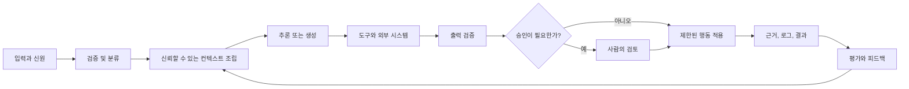

> 🇰🇷 이 문서는 한국어 번역본입니다(ELI5 스타일). 원문: [en.md](en.md)

# 엔드투엔드 아키텍처와 가치 트레이드오프


> 아키텍처란 결과를 바꾸는 곳에만 복잡성을 쓰는 기술입니다.

**유형:** 참고 자료
**언어:** Python
**선수 지식:** [비즈니스 디스커버리, 요구사항, SLA](../../22-business-discovery-requirements-and-slas/) / 페이즈 14, 레슨 01, 12, 28
**소요 시간:** 약 135분

## 학습 목표

- 입력부터 피드백과 운영까지 이어지는 완전한 Claude 시스템을 그릴 수 있다
- 증강 호출, 워크플로, 에이전트, 멀티 에이전트 시스템 중에서 선택할 수 있다
- 근거, 권한, 검증 경계를 기준으로 복잡한 작업을 분해할 수 있다
- 비용, 지연 시간, 품질, 안전, 유지보수성의 트레이드오프를 방어할 수 있다
- 추가적인 모델 성능으로는 구조적 설계 결함을 고칠 수 없는 경우를 식별할 수 있다

## 문제 상황

어떤 팀이 계약 검토 어시스턴트를 출시합니다. 하나의 프롬프트에 계약서, 정책
라이브러리, 추출 스키마, 협상 규칙, 최종 수정본(redline) 요청이 전부 들어갑니다.
데모는 잘 동작합니다. 프로덕션(운영 환경)은 그렇지 않습니다.

긴 계약서는 실질적인 컨텍스트 예산을 초과합니다. 정책 버전이 서로 충돌합니다.
모델은 법적으로 뒷받침되지 않는 결론과 함께 유효한 JSON을 돌려줍니다. 검토자는
어떤 출처가 어떤 변경을 뒷받침했는지 볼 수 없습니다. 재시도는 실패를 바꾸지 않은
채 비용만 늘립니다. 더 큰 모델은 문장 품질만 높일 뿐, 출처 추적, 권한, 라이프사이클
담당 문제는 그대로 남겨 둡니다.

이 시스템은 프롬프트에 문장 하나가 더 필요해서 실패하는 게 아닙니다. 서로 다른
여러 책임이 단일 확률적 단계 안에 압축되어 있기 때문에 실패합니다.

## 핵심 개념

### 전체 루프 그리기

엔드투엔드 아키텍처는 모델 호출보다 훨씬 많은 것을 포함합니다.



모든 연결선마다 물어보세요:

- 어떤 데이터가 경계를 넘는가?
- 어떤 신원과 권한이 적용되는가?
- 어떤 스키마 또는 계약이 강제되는가?
- 타임아웃, 모호함, 부분 실패가 생기면 어떻게 되는가?
- 어떤 근거가 보관되는가?
- 다음 결정의 담당자는 누구인가?

실패 경로가 없는 아키텍처 다이어그램은 마케팅 그림에 불과합니다.

### 맞는 패턴 중 가장 작은 것 고르기

쓸모 있는 출발 패턴은 네 가지입니다.

#### 증강 모델 호출

하나의 요청이 선택된 컨텍스트, 검색, 또는 도구를 사용하고 범위가 제한된 출력을
반환합니다. 단계가 알려져 있고 한 번의 턴 안에 필요한 근거가 들어갈 수 있을 때,
분류, 추출, 초안 작성, 채점에 사용하세요.

장점:

- 오케스트레이션 오버헤드가 가장 낮음
- 평가가 가장 쉬움
- 지연 시간과 비용이 예측 가능함

한계:

- 분기가 많은 작업에는 부적합
- 여러 외부 행동에 걸친 복구 능력이 제한적

#### 결정론적 워크플로

코드가 순서를 제어하고 선택된 단계에서 Claude를 호출합니다. 비즈니스 프로세스가
안정적이거나, 감사 가능성이 중요하거나, 각 전이마다 명확한 계약이 필요할 때
사용하세요.

장점:

- 명시적인 상태와 재시도
- 단계별로 좁은 권한
- 재현 가능한 테스트

한계:

- 경로를 미리 알 수 없으면 취약해짐
- 새로운 예외 유형이 생기면 워크플로 수정이 필요

#### 적응형 에이전트

Claude가 중지 조건을 만날 때까지 관찰을 바탕으로 다음 행동을 선택합니다. 근거
탐색이 경로를 결정하고 모든 분기를 나열하는 것이 비현실적일 때 사용하세요.

장점:

- 유연한 계획
- 개방형 조사와 수리에 유용

한계:

- 지연 시간과 비용이 들쭉날쭉함
- 더 넓은 권한과 평가 범위
- 루프, 드리프트, 도구 오류 리스크

#### 멀티 에이전트 시스템

코디네이터가 서로 분리된 관심사를 전문가 또는 독립 검토자에게 위임합니다.
작업을 분할할 수 있거나, 컨텍스트 격리가 품질을 높이거나, 검증을 위해 독립성이
필요할 때 사용하세요.

장점:

- 병렬 실행
- 역할당 더 작은 컨텍스트
- 독립적인 검토

한계:

- 인계(handoff) 손실과 중복 작업
- 더 많은 호출과 더 어려운 추적 분석
- 조율 비용이 절감액보다 클 수 있음

다이어그램이 성숙해 보인다는 이유로 멀티 에이전트를 고르지 마세요. 특정한
컨텍스트, 독립성, 병렬성, 전문화 요구가 조율 비용을 감당할 가치가 있을 때
선택하세요.

### 계약(Contract)을 기준으로 분해하기

나쁜 분해는 "올바름을 어떻게 검사할 것인가"를 묻지 않은 채 문서의 섹션이나 팀
경계를 따릅니다. 좋은 분해는 인계 지점마다 계약을 만듭니다.

계약 검토 시스템의 경우:

1. 접수(intake) 단계가 파일 형식, 신원, 관할권 메타데이터를 검증한다.
2. 조항 분할이 안정적인 식별자와 원문 위치(span)를 반환한다.
3. 정책 검색이 출처가 있는 버전화된 근거를 반환한다.
4. 조항 분석이 스키마에 맞는 조사 결과를 반환한다.
5. 독립 검토자가 근거 커버리지와 모순을 점검한다.
6. 수정본 생성은 승인된 조사 결과만 사용한다.
7. 법무 담당자가 중대 변경을 승인한다.
8. 시스템이 결정 근거와 이후 결과를 기록한다.

각 단계는 "이 계약서를 검토하라"보다 훨씬 좁은 임무를 가집니다. 실패 지점을
특정할 수 있습니다. 승인된 조항 분석을 다시 생성하지 않고도 검색만 재시도할 수
있고, 검토자가 모든 작업을 버리지 않고 조사 결과 하나만 기각할 수 있습니다.

### 의미적 통제와 결정론적 통제 분리하기

"이 조항이 책임을 중대하게 바꾸는가" 같은 모호한 판단에는 Claude가 유용합니다.
필수 필드, 권한 검사, 최대 환불 금액, 허용 관할권, 문서 버전 같은 불변 조건에는
코드가 더 적합합니다.

다음 규칙을 사용하세요:

```text
어떤 조건이 신뢰할 수 있는 데이터 위의 안정적인 술어(predicate)로 표현될 수
있다면, 모델 밖에서 강제하라.
```

프롬프트 지시는 행동을 안내합니다. 보안 경계를 만들지는 않습니다.

### 전체 경로에 예산 배분하기

비용은 한 번의 호출에 대한 입력 토큰 + 출력 토큰만이 아닙니다. 시스템의 하나의
경로(trajectory)에는 검색, 여러 모델 호출, 도구 실행, 재시도, 검토, 사람의
노동이 포함될 수 있습니다.

추정하세요:

```text
기대 과제 비용 =
  모델 호출 비용
  + 검색과 도구 비용
  + 재시도 확률 × 재시도 비용
  + 사람 검토 시간(분) × 인건비
  + 예상 장애 및 수정 비용
```

재시도를 더 많이 만드는 작은 모델은 성공 과제당 비용이 더 클 수 있습니다. 비싼
검토 단계를 없애 준다면 큰 모델이 더 저렴할 수도 있지만, 그것은 평가로만
확인할 수 있습니다.

### 지연 시간을 분포로 다루기

평균 지연 시간은 사용자가 실제로 겪는 긴 꼬리(long tail)를 숨깁니다. 모델 시간,
도구 시간, 대기 시간, 재시도, 사람의 승인이 모두 합쳐집니다.

최소한 P50, P95, 타임아웃 비율을 사용하세요. 인터랙티브 작업이라면 총 완료
시간뿐 아니라 첫 번째 유용한 출력까지의 시간도 추적하세요. 백그라운드 작업이라면
첫 토큰 지연보다 처리량과 완료 기한이 더 중요할 수 있습니다.

병렬 실행은 독립적인 작업에만 도움이 됩니다. 같은 레이트 리밋을 두고 경쟁하거나
직렬 조정이 필요한 결과를 만드는 병렬 호출은, 엔드투엔드 시간을 줄이지 못한 채
비용만 늘릴 수 있습니다.

### 피드백을 제품 표면으로 설계하기

피드백은 좋아요 이벤트 더미가 아닙니다. 결과를 입력, 버전, 경로, 결정과 연결해야
합니다.

저장하세요:

- 입력 유형과 리스크 등급
- 프롬프트, 모델, 도구, 지식 버전
- 검색된 근거 식별자
- 도구 호출과 구조화된 오류
- 출력과 검증기 결과
- 사람의 수정과 사유 코드
- 다운스트림 결과

그래야 피드백 루프가 결정을 지원합니다: 프롬프트 변경, 검색 수리, 라우팅 조정,
도구 개선, 범위 축소.

## 직접 만들기

## 인터랙티브 랩

```figure
23-architecture-tradeoff
```

아키텍처 트레이드오프 탐색기에서 증강 호출, 워크플로, 에이전트, 멀티 에이전트
설계를 가중치가 적용된 품질, 지연 시간, 비용, 안전, 감사 가능성, 변경 비용
근거와 비교해 보세요. 하드 제약은 높은 총점으로 평균 내서 없앨 수 없습니다.

## 실습 랩

결정 사본에서 기각된 대안이나 하드 안전 게이트 하나를 제거하고, 준비성 검사가
실패하는 것을 관찰한 뒤, 아키텍처 논리를 수리해 보세요.

## 완성 산출물

작성을 마친 [`outputs/architecture-decision.md`](../outputs/architecture-decision.md)는
결정론적 계약 검토 워크플로를 선택하고, 실패 경로와 되돌리기 조건을 기록합니다.

## 검증하기

결정론적 결정 패킷 검증기를 실행하세요:

```bash
cd certifications/claude/lessons/23-end-to-end-architecture-and-value-tradeoffs
python3 code/main.py
python3 -m unittest discover -s code/tests -v
```

퀴즈도 같은 패턴과 통제 결정을 점검합니다.

## 캡스톤 연계

ADR을 Architect Professional 캡스톤의 아키텍처 옵션 섹션으로 가져가세요.

하나의 비즈니스 워크플로에 대해 아키텍처 패킷을 만드세요.

### 1단계: 후보 세 개 그리기

증강 호출, 결정론적 워크플로, 적응형 에이전트 설계를 그리세요. 비교가 공정하도록
입력, 출력, 제약은 동일하게 유지합니다.

### 2단계: 명시적인 트레이드오프 채점하기

근거를 글로 적으면서 1~5점 척도를 사용하세요.

| 기준 | 가중치 | 증강 호출 | 워크플로 | 에이전트 |
|------|-------:|----------:|---------:|---------:|
| 과제 품질 | 25 | | | |
| P95 지연 시간 | 15 | | | |
| 성공당 비용 | 15 | | | |
| 안전과 권한 | 20 | | | |
| 감사 가능성 | 15 | | | |
| 변경 비용 | 10 | | | |

가중치는 습관이 아니라 디스커버리에서 나와야 합니다. 규제 대상 행동이 안전을
하드 제약으로 만든다면, 편의성과 평균 내서 없애면 안 됩니다.

### 3단계: 실패 경로 작성하기

각 외부 의존성마다 타임아웃, 재시도, 서킷 브레이커 동작, 부분 결과, 사용자
메시지, 운영자 근거를 명시하세요. 에이전트에는 총 턴 수와 비용 예산도
포함합니다.

### 4단계: 평가 정의하기

정상, 모호함, 공격적(adversarial), 의존성 실패 케이스를 모두 다루는 대표
집합을 만드세요. 최종 품질, 경로 품질, 비용, 지연 시간, 안전을 측정합니다.

### 5단계: 되돌리기 조건 기록하기

어떤 근거가 나오면 팀이 패턴을 바꿀지 명시하세요. 아키텍처는 영원한 정체성이
아니라 현재의 결정입니다.

## 활용하기

회사 공시 자료 전반의 질문에 답해야 하는 리서치 시스템을 생각해 봅시다.

하나의 검색 쿼리로 충분한 근거가 안정적으로 나온다면 단일 증강 호출이 맞습니다.
모든 과제가 쿼리, 검색, 랭킹, 답변, 인용 순서를 따른다면 워크플로가 맞습니다.
누락된 개체를 찾아내고, 쿼리를 다시 만들고, 근거가 충분한지 판단해야 한다면
에이전트가 맞습니다. 병렬 출처 조사나 독립 검증이 목표 지표를 조율 비용을 감수할
만큼 충분히 끌어올릴 때만 멀티 에이전트 설계가 맞습니다.

이제 한 시간 답변 마감과 엄격한 비용 예산을 추가해 봅시다. 최적 설계가 바뀔 수
있습니다. 아키텍처는 언제나 제약 아래의 아키텍처입니다.

## 시험 의사결정 패턴

옵션들이 복잡도에서만 다르다면, 명시된 요구사항을 충족하는 가장 단순한
아키텍처를 고르세요. 프롬프트 패치보다 구조적 해결책을 먼저 찾으세요.

강한 답은 보통 다음과 같습니다:

- 결정론적 규칙을 코드에서 강제한다
- 고위험 도구와 권한을 격리한다
- 알려진 경로에는 워크플로를, 진짜 적응이 필요한 경로에는 에이전트를 쓴다
- 독립성이 요구사항이면 독립 검토자를 추가한다
- 모든 변환 과정에서 출처(provenance)를 유지한다
- 중지, 재시도, 부분 결과, 에스컬레이션 동작을 정의한다
- 호출당 비용이 아니라 성공 결과당 비용을 최적화한다

약한 답은 실제 실패 경계를 다루지 않은 채 더 큰 모델, 더 긴 프롬프트, 더 많은
에이전트, 더 많은 도구를 추가하는 경우가 많습니다.

## 흔한 함정

### 기능 비대화

불필요한 도구 하나하나가 프롬프트 크기, 선택 모호성, 공격 표면, 권한 리스크를
키웁니다. 현재 역할에 필요한 최소한만 노출하세요.

### 없는 계약을 프롬프트로 때우기

두 단계가 식별자, 스키마, 오류 동작으로 불일치한다면, 더 명확한 자연어 지시로는
신뢰할 수 있는 인터페이스를 만들 수 없습니다. 계약을 정의하세요.

### 독립성으로서의 자기 검토

같은 컨텍스트에게 "다시 확인해 달라"고 하면 같은 가정을 반복할 수 있습니다.
독립성이 중요하다면 명시적인 채점 기준(rubric)과 격리된 근거를 가진 별도의
검토자를 사용하세요.

### 데모 경로만 최적화하기

프로덕션 품질은 모호함, 오래된 데이터, 권한 오류, 타임아웃, 부분 실패 속에
있습니다. 아키텍처 승인 전에 이것들을 포함하세요.

## 연습 문제

1. 송금 분쟁 처리 프로세스에 대해 증강 호출, 워크플로, 에이전트 후보를
   설계하세요. 하나를 선택하고 되돌리기 조건을 명시합니다.
2. AI 워크플로에서 결정론적 코드여야 하는 불변 조건 세 개를 찾으세요.
3. 재시도율과 검토율이 다른 두 모델의 성공 과제당 비용을 계산하세요.
4. 멀티 에이전트 리서치 설계에 도구 장애를 추가하고 부분 결과 동작을
   명시하세요.
5. 최종 문장은 훌륭하지만 경로가 낭비적이거나 위험한 시스템을 잡아내는 평가를
   작성하세요.

## 핵심 용어

| 용어 | 사람들이 말하는 것 | 실제 의미 |
|------|--------------------|-----------|
| 증강 호출 | 약한 에이전트 | 선택된 컨텍스트나 도구가 공급되는 범위 제한적 모델 호출 |
| 워크플로 | 고정된 단계를 가진 에이전트 | 명시적 전이를 가진 코드 소유 오케스트레이션 |
| 에이전트 | 모든 LLM 애플리케이션 | 관찰로부터 행동을 선택하는 모델 주도 루프 |
| 멀티 에이전트 | 더 높은 지능 | 격리, 병렬성, 독립 검토를 위해 조율되는 여러 모델 컨텍스트 |
| 계약 | 프롬프트 지시 | 데이터, 오류, 책임에 대한 기계 검증 가능한 경계 |
| 성공당 비용 | 토큰 가격 | 승인된 결과 하나당 모델, 도구, 재시도, 검토, 수정의 총 기대 비용 |

## 더 읽기

- [효과적인 에이전트 구축](https://www.anthropic.com/research/building-effective-agents) — 워크플로와 에이전트 패턴
- [Claude Agent SDK 문서](https://platform.claude.com/docs/en/agent-sdk/overview) — 최신 에이전트 하네스 기능
- 페이즈 14, 레슨 01 — 첫 원리부터의 에이전트 루프
- 페이즈 14, 레슨 28 — 오케스트레이션 트레이드오프
- 페이즈 17, 레슨 08 — 굿풋(goodput)과 지연 시간 측정
