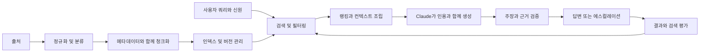

> 🇰🇷 이 문서는 한국어 번역본입니다(ELI5 스타일). 원문: [en.md](en.md)

# RAG, 검색, 데이터 파이프라인


> 근거가 뒷받침된 답변의 신뢰도는, 모델에 도달한 근거만큼만 신뢰할 수 있습니다.

**유형:** 빌드
**언어:** Python
**선수 지식:** [엔드투엔드 아키텍처와 가치 트레이드오프](../../23-end-to-end-architecture-and-value-tradeoffs/) / 페이즈 11, 레슨 06, 07 / 페이즈 5, 레슨 23
**소요 시간:** 약 150분

## 학습 목표

- 수집(ingestion), 청킹(chunking), 인덱싱, 검색, 생성, 인용 경계를 설계할 수 있다
- 희소(sparse), 밀집(dense), 하이브리드, 필터, 반복 검색을 데이터 형태에 맞출 수 있다
- 모델이나 프롬프트를 바꾸기 전에 검색 실패를 진단할 수 있다
- 답변 품질과 별도로 검색 품질을 측정할 수 있다
- 파이프라인 전체에서 신선도, 접근 제어, 출처(provenance)를 유지할 수 있다

## 문제 상황

정책 어시스턴트가 몇 달간 잘 동작합니다. 그러다 문서 갱신 이후, 오래된 환불
기준을 근거로 확신에 찬 답변을 하기 시작합니다. 모델 버전, 프롬프트, 지연 시간은
전혀 바뀌지 않았습니다.

팀이 프롬프트에 "최신 정책을 사용하라"고 추가합니다. 아무것도 개선되지 않습니다.
모델은 한 번도 받지 못한 근거를 따를 수 없습니다. 인덱스에는 두 정책 버전이 모두
들어 있고, 메타데이터 필터는 없으며, 검색기는 오래된 청크를 1위로 올립니다. 그
청크의 문구가 쿼리와 더 비슷하게 매칭되기 때문입니다.

이것은 검색 장애입니다. 모델 장애로 취급하면 시간만 낭비하고, 진짜 통제 실패를
숨길 수 있습니다.

## 핵심 개념

### RAG는 데이터 시스템이다

검색 증강 생성(RAG)은 서로 다른 실패 양상을 가진, 연결된 두 시스템으로 이루어집니다.



모델이 아무리 뛰어나도 시스템은 다음 이유로 실패할 수 있습니다:

- 출처가 아예 수집되지 않았음
- 파싱이 중요한 표를 놓쳤음
- 청킹이 조건과 그 예외를 서로 갈라 놓았음
- 인덱스가 낡았거나 호환되지 않는 표현을 사용함
- 필터가 테넌트, 관할권, 날짜, 권한을 무시함
- 랭킹이 정식 출처보다 키워드 매치를 우대함
- 컨텍스트 조립이 가장 좋은 근거를 잘라 버렸음
- 생성이 실제로 뒷받침하는 것보다 많이 주장하면서 청크 하나만 인용함

가장 먼저 실패하는 경계부터 진단하세요.

### 의미와 검색을 기준으로 청크 설계하기

고정 토큰 청크는 베이스라인일 뿐, 만능 답은 아닙니다. 청크의 모양은 사람이 인용할
단위를 보존해야 합니다.

산문 형태의 정책이라면 제목과 문단이 유용한 경계가 되는 경우가 많습니다. API
문서라면 메서드 시그니처를 파라미터와 오류와 함께 유지하세요. 표라면 각 행
그룹마다 헤더를 붙여 보존하세요. 티켓이라면 한 메시지에 대화 컨텍스트가 필요할 수
있습니다. 소스 코드라면 임의의 문자 윈도우보다 함수와 클래스가 낫습니다.

오버랩(overlap)은 사실 하나가 경계를 넘을 때 도움이 되지만, 근거를 복제하고
인덱스 크기를 키우며, 거의 동일한 텍스트들로 최종 컨텍스트를 어수선하게 채울 수도
있습니다. 반드시 측정하세요.

모든 청크에는 메타데이터가 필요합니다:

- 안정적인 문서 및 청크 식별자
- 출처 URI 또는 원본 시스템(system-of-record) 식별자
- 버전과 시행일
- 테넌트, 관할권, 제품, 콘텐츠 유형
- 접근 제어 속성
- 수집 및 파서 버전
- 상위 제목과 위치

메타데이터가 있어야 검색이 단순히 "비슷한 것"이 아니라 "통제되는 것"이 됩니다.

### 쿼리와 데이터 형태에 맞는 검색 선택하기

#### 희소 검색(Sparse Retrieval)

BM25 방식의 검색은 명시적인 용어를 매칭합니다. 식별자, 제품명, 오류 코드, 정책
문구에 강하고, 저렴하고 설명하기 쉽습니다.

#### 밀집 검색(Dense Retrieval)

임베딩은 의미적 유사도를 매칭합니다. 사용자가 개념을 다른 말로 표현하거나 쿼리와
출처의 어휘가 다를 때 도움이 됩니다. 다만 정확한 식별자를 놓칠 수 있고, 의미는
비슷하지만 정식 출처가 아닌 텍스트를 가져올 수도 있습니다.

#### 하이브리드 검색

희소 후보와 밀집 후보를 결합한 뒤, 융합(fuse)하거나 재랭킹합니다. 하이브리드
검색은 자연어와 식별자가 섞인 쿼리를 어느 하나만 쓸 때보다 잘 처리하는 경우가
많습니다.

#### 필터 검색

근거가 모델에 도달하기 전에 신뢰할 수 있는 메타데이터와 인가를 적용하세요. 사용자가
볼 수 없는 청크를 "무시하라"고 Claude에게 부탁하지 마세요. 금지된 데이터는
컨텍스트에 들어와서는 안 됩니다.

#### 반복 검색

에이전트는 쿼리를 다시 만들거나, 참조를 따라가거나, 누락된 근거를 식별할 수
있습니다. 탐색이 진짜로 적응적일 때 사용하세요. 쿼리 수, 턴 수, 시간, 비용
예산을 설정하세요. 안정적인 질의응답 파이프라인이 기본값으로 에이전트 복잡성의
비용을 치를 필요는 없습니다.

### 검색 평가와 답변 평가 분리하기

상위 후보에 올바른 근거가 없다면 답변 품질에는 천장이 있습니다. 먼저 검색을
측정하세요.

유용한 측정 지표:

- recall at K: 후보 집합에 필요한 출처가 들어 있었는가?
- precision at K: 후보 집합 중 얼마나 관련이 있었는가?
- 평균 역순위(mean reciprocal rank): 첫 번째 관련 출처가 얼마나 일찍 나왔는가?
- nDCG: 랭킹이 고관련 출처를 앞에 배치했는가?
- 신선도 커버리지: 결과가 활성 버전을 사용했는가?
- 인가 누출: 어떤 결과가 호출자의 접근 권한을 침해했는가?

그다음 생성을 평가합니다:

- 인용된 근거에 의한 주장 뒷받침
- 인용의 정확성과 완전성
- 답변의 완전성
- 근거가 불충분할 때의 거절(abstention)
- 출처 간 충돌 탐지

단일 엔드투엔드 점수로는 어느 층을 수리해야 하는지 알 수 없습니다.

### 출처(provenance)를 데이터로 보존하기

출처 정보가 답변 뒤에 생성되는 산문(prose)으로만 존재하게 두지 마세요. 출처
식별자를 검색, 컨텍스트 조립, 출력 스키마, 로그까지 끌고 가세요.

각 주장마다 다음을 보존하세요:

- 출처 문서와 청크 식별자
- 출처 버전과 시행일
- 뒷받침하는 정확한 구간(span)
- 검색 점수와 순위
- 변환 또는 요약 단계

출처가 충돌하면 충돌을 보고하세요. 그 도메인에 명시적인 우선순위 규칙이 없다면
가장 최근 날짜를 조용히 고르면 안 됩니다.

### 갱신을 원자적으로, 그리고 관측 가능하게 만들기

문서 갱신은 오래된 청크와 새 청크가 공존하는 혼합 인덱스를 만들 수 있습니다. 더
안전한 패턴은 새 버전을 만들고 검증한 뒤, 별칭(alias)이나 포인터를 원자적으로
전환하는 것입니다. 새 인덱스가 검색 및 신선도 검사를 통과할 때까지는 롤백
수단을 유지하세요.

모니터링 항목:

- 수집 성공률과 지연(lag)
- 파싱된 콘텐츠 수와 크기
- 출처별 활성 버전
- 임베딩 또는 인덱스 버전
- 빈 결과 및 저점수 비율
- 검색 분포의 변화
- 실패한 상위 평가 쿼리

## 직접 만들기

## 인터랙티브 랩

```figure
24-rag-ranking
```

랭킹 랩에서 코드를 수정하기 전에 어휘 매치, 메타데이터 필터, 오래된 출처 제외,
top-K 동작을 비교해 보세요. 눈에 보이는 순위가 검색 결정을 recall, 역순위,
신선도, 출처와 연결해 줍니다.

## 실습 랩

픽스처(fixture) 사본에 오래되었거나 권한 없는 문서를 추가하고, 생성 단계 이전에
그것이 후보 집합에 들어올 수 없음을 증명해 보세요.

## 완성 산출물

[`outputs/retrieval-evidence-report.json`](../outputs/retrieval-evidence-report.json)은
랭킹된 청크 식별 정보, 활성 출처 버전, 검색 지표가 채워진 베이스라인입니다.

## 검증하기

다음으로 재현하고 검증하세요:

```bash
cd certifications/claude/lessons/24-rag-retrieval-and-data-pipelines/code
python3 main.py
python3 -m unittest discover tests -v
```

여섯 문제짜리 퀴즈는 진단과 검색 선택을 점검합니다.

## 캡스톤 연계

근거 보고서를 Architect Professional 캡스톤의 RAG 평가와 신선도 게이트로
가져가세요.

이 랩은 Python 표준 라이브러리만으로 작은 BM25 방식 인덱스를 구현합니다.
의도적으로 투명하게 만들었습니다. 프로덕션(운영 환경) 검색 시스템은 더 빠르고
더 강력하지만, 점수 계산과 메타데이터 경계가 더 이상 마법처럼 느껴지지 않아야
합니다.

실행하기:

```bash
cd certifications/claude/lessons/24-rag-retrieval-and-data-pipelines/code
python3 main.py
python3 -m unittest discover tests -v
```

### 1단계: 토큰 정규화하기

`tokenize`는 텍스트를 소문자로 바꾸고 영숫자 용어를 추출합니다. 프로덕션
파이프라인은 언어 인지 토크나이제이션, 필드 처리, 파서 테스트가 필요합니다. 이
레슨은 랭킹 개념만 남겨 둡니다.

### 2단계: 안정적인 식별자로 청크화하기

`chunk_document`는 문서 ID, 위치, 갱신 시간, 안정적인 청크 ID를 유지하면서
겹치는 단어 윈도우를 만듭니다. 잘못된 오버랩은 무한 루프를 만드는 대신 초기에
실패합니다.

### 3단계: 인덱싱 전에 비활성 출처 제외하기

`RetrievalIndex.build`는 비활성 문서 버전을 무시합니다. 단순화된 신선도
게이트입니다. 프로덕션에서는 활성화가 검증된 인덱스 버전과 원자적 전환에 묶여야
합니다.

### 4단계: 투명하게 점수 매기기

인덱스는 용어 빈도, 문서 빈도, 길이 정규화, 역문서 빈도 점수를 계산합니다. 정확한
쿼리 용어가 활성 정책 문구를 실제로 담고 있는 출처를 끌어올릴 수 있습니다.

### 5단계: 출처 정보 반환하기

모든 `RetrievalHit`는 문서 ID, 청크 ID, 갱신 날짜, 텍스트, 점수를 함께
가집니다. 생성 레이어는 이 구조화된 근거를 소비하고, 주장을 근거에 연결해
반환해야 합니다.

### 6단계: 검색기 평가하기

`evaluate_retrieval`은 레이블이 붙은 케이스를 기준으로 recall at K와 평균
역순위를 계산합니다. 랭킹을 바꾸기 전에 정상, 모호함, 낡은 버전, 권한, 공격적
쿼리를 먼저 추가하세요.

## 활용하기

프로덕션 시스템은 보통 문서 파서, 오브젝트 스토리지, 희소 또는 벡터 인덱스,
메타데이터 필터, 재랭커, 평가 파이프라인을 조합합니다. 관리형 서비스가 구현을
숨겨도 동일한 계약을 유지하세요.

정책 장애의 경우:

1. 쿼리를 재현하고 검색된 청크 ID를 살펴본다.
2. 인덱스에서 어떤 출처 버전이 활성인지 확인한다.
3. 기준값과 예외 주변의 파싱과 청크 경계를 점검한다.
4. 신원 및 메타데이터 필터를 검증한다.
5. 희소, 밀집, 하이브리드 후보 집합을 비교한다.
6. 수리 전과 후에 고정(frozen)된 검색 평가를 실행한다.
7. 검증된 인덱스로 원자적으로 전환하고 롤백 수단을 유지한다.
8. 생성 레이어에서 주장 뒷받침 평가를 다시 실행한다.

온도(temperature)나 모델 크기를 바꾸는 것부터 시작하지 마세요. 어느 쪽도
누락되거나 금지된 근거를 되살릴 수 없습니다.

## 시험 의사결정 패턴

모델과 지연 시간은 그대로인데 문서 갱신 직후 답변이 틀리게 되었다면, 수집,
인덱싱, 필터링, 검색부터 조사하세요.

강한 아키텍처 선택:

- 정확한 식별자와 의미적 바꿔 말하기를 모두 다루도록 검색을 맞춘다
- 생성 전에 신원과 메타데이터로 필터링한다
- 출처와 인덱스를 버전 관리한다
- 최종 답변과 별도로 검색을 평가한다
- 출처 정보를 출력 계약까지 전달한다
- 불충분하거나 충돌하는 근거를 명시적으로 표현한다

약한 선택:

- 모델에게 최신 문서를 기억하라고 말한다
- 모든 출처로 컨텍스트를 늘린다
- 후보를 살펴보기 전에 모델을 교체한다
- 출처 식별자 없이 생성된 인용에 의존한다

## 흔한 함정

### 더 많은 컨텍스트가 더 많은 근거라는 생각

관련 없는 컨텍스트는 어텐션을 두고 경쟁하며 최고의 근거를 가릴 수 있습니다. 더
큰 컨텍스트 페이로드보다 더 나은 검색과 정렬이 이기는 경우가 많습니다.

### 비슷하면 정식 출처라는 착각

의미적 유사도는 정책 우선순위, 권한, 시행일을 담고 있지 않습니다. 그것들은
메타데이터와 규칙이 필요합니다.

### 유효한 인용이 뒷받침된 주장이라는 착각

인용이 실제 출처를 가리켜도 그 출처가 주장 전체를 뒷받침하지 않을 수 있습니다.
링크 유효성만이 아니라 함의(entailment)와 커버리지를 평가하세요.

### 갱신은 추가라는 생각

오래된 버전을 비활성화하지 않은 채 새 청크만 추가하면 모순되는 근거가 만들어집니다.
갱신을 버전화된 배포로 다루세요.

## 연습 문제

1. 필드 인지 부스팅을 추가해 제목 매치가 본문 매치보다 높은 점수를 받도록
   만들어 보세요.
2. 관할권 필터를 추가하고, 권한 없는 청크가 후보에 절대 나타나지 않음을
   증명하는 테스트를 만들어 보세요.
3. 두 랭킹 리스트 위에서 동작하는 하이브리드 랭크 융합 함수를 만들어 보세요.
4. 정확한 식별자와 바꿔 말한 표현이 서로 다른 전략을 요구하는 검색 케이스
   열 개를 만들어 보세요.
5. 검증과 롤백을 갖춘 원자적 인덱스 갱신 체크리스트를 설계하세요.

## 핵심 용어

| 용어 | 사람들이 말하는 것 | 실제 의미 |
|------|--------------------|-----------|
| 청크 | 고정된 토큰 수 | 식별자와 메타데이터를 가진, 검색·인용 가능한 단위 |
| 희소 검색 | 옛날 키워드 검색 | 정확한 어휘와 식별자에 강한 용어 기반 랭킹 |
| 밀집 검색 | 의미적 진리 | 임베딩 공간의 유사도이지, 정식성이나 사실적 뒷받침이 아님 |
| 하이브리드 검색 | 데이터베이스 두 개 | 정확성 신호와 의미 신호를 결합하는 후보 융합 |
| Recall at K | 답변 정확도 | 검색된 상위 K개 안에 필요한 근거가 있었는지 여부 |
| 출처(provenance) | 생성된 각주 | 출처부터 주장까지 전달되는 구조화된 계보(lineage) |

## 더 읽기

- [Claude 인용(citations) 문서](https://platform.claude.com/docs/en/build-with-claude/citations) — 최신 인용 지원
- [Claude 토큰 카운팅 문서](https://platform.claude.com/docs/en/build-with-claude/token-counting) — 컨텍스트 예산 관리
- 페이즈 11, 레슨 06 — 첫 원리부터의 RAG 파이프라인
- 페이즈 11, 레슨 07 — 고급 검색과 재랭킹
- 페이즈 19, 레슨 65 — 희소 + 밀집 하이브리드 검색
