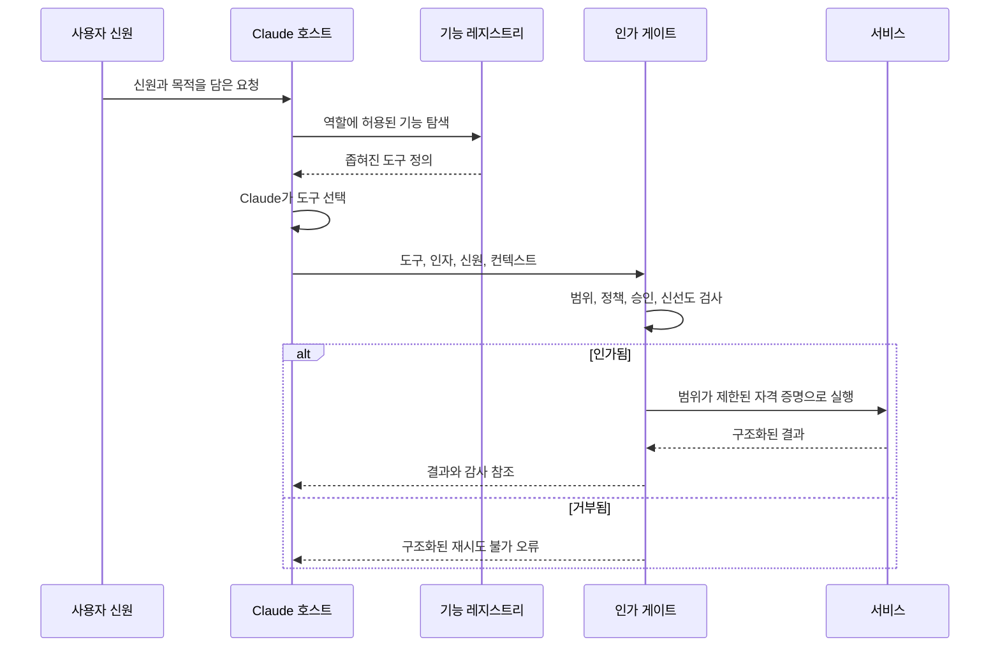

> 🇰🇷 이 문서는 한국어 번역본입니다(ELI5 스타일). 원문: [en.md](en.md)

# 통합 프로토콜, 신원, 최소 권한


> 도구는 Claude가 조심스럽게 쓰기 때문에 안전한 게 아닙니다. 시스템이 권한 없는
> 사용을 거부할 때 비로소 안전합니다.

**유형:** 빌드
**언어:** Python
**선수 지식:** [엔드투엔드 아키텍처와 가치 트레이드오프](../../23-end-to-end-architecture-and-value-tradeoffs/) / 페이즈 13, 레슨 01, 05, 06, 16, 18
**소요 시간:** 약 150분

## 학습 목표

- 요구사항에 따라 직접 API, CLI, MCP, 에이전트 간 통합 중에서 선택할 수 있다
- 기능 탐색(discovery)과 실행 인가(authorization)를 분리할 수 있다
- 최소 권한 도구 집합과 신원 전파를 설계할 수 있다
- 비밀 정보를 누출하지 않으면서 구조화되고 실행 가능한 오류를 반환할 수 있다
- 승인, 감사, 권한 회수 통제를 실행 경계에 배치할 수 있다

## 문제 상황

어떤 지원 에이전트는 티켓을 읽고, 답변 초안을 쓰고, 환불을 처리하고, 사용자
계정을 삭제할 수 있습니다. 대부분의 지원 직원은 앞의 두 가지 기능만 필요합니다. 그런데
팀은 네 도구를 모두 켜 둔 채 프롬프트만 추가합니다: "절대적으로 필요하지 않는 한
환불을 처리하거나 계정을 삭제하지 마라."

이것은 최소 권한이 아닙니다. 위험한 기능이 여전히 존재하고, 모델은 여전히 그것을
보고 있으며, 프롬프트 인젝션도 여전히 그것을 겨냥할 수 있습니다. 확인 문구는
실수로 쓰는 것을 줄여 줄 뿐, 인가를 대신하지 못합니다.

구조적 해결책은 더 단순합니다: 역할에 필요 없는 기능은 노출하지 않고, 호출자의
신원을 전파하며, 도구가 실행되는 시점에 범위(scope)와 승인을 강제합니다.

## 핵심 개념

### 경계에서 통합 형태 고르기

프로토콜들은 겹치는 부분이 있지만, 풀어 주는 주된 문제는 서로 다릅니다.

| 형태 | 가장 잘 맞는 경우 | 주된 트레이드오프 |
|------|-------------------|-------------------|
| 직접 API | 애플리케이션이 하나의 서비스 계약을 알고 낮은 오버헤드가 필요할 때 | 타이트한 서비스 결합과 직접 만들어야 하는 탐색 |
| CLI | 실행 파일을 감싸는 로컬 또는 CI 자동화 | 프로세스, 환경, 출력 관리 부담 |
| MCP | 호스트가 여러 서버에 걸친 도구, 리소스, 프롬프트를 표준 방식으로 탐색해야 할 때 | 또 하나의 프로토콜 경계와 운영해야 할 인가 모델 |
| 에이전트 간 | 한 에이전트가 작업을 다른 자율 서비스에 위임할 때 | 더 어려운 신뢰, 신원, 진행 상황, 실패 의미론 |

MCP가 모든 API를 대체하지는 않습니다. 안정적인 내부 서비스 호출은 직접 API가 더
명확하고 빠를 수 있습니다. 여러 호스트가 기능을 발견하고 호출하는 공통 방법이
필요하거나, 도구의 소유권이 서버 경계 뒤에 남아 있어야 할 때 MCP가 빛을 발합니다.

CLI는 로컬 개발자 워크플로와 CI에 유용하지만, 장시간 실행되는 작업에는 취약한
자식 프로세스 이상의 영구 상태, 취소, 결과 조회가 필요합니다. 에이전트 간 통합은
상대가 자율적인 작업을 소유할 때 의미가 있지, 단순한 함수 엔드포인트일 때는
아닙니다.

### 탐색, 선택, 실행 분리하기



탐색은 모델이 무엇을 보는지 통제합니다. 인가는 실제로 무슨 일이 일어나는지
통제합니다. 둘 다 필요합니다.

탐색이 모든 도구를 반환하면, 모델은 추가 컨텍스트와 선택 비용을 치릅니다. 위험한
작업에 대한 설명까지 보게 됩니다. 반대로 인가가 없다면, 도구를 숨기는 것은 단지
감추기(obscurity)일 뿐입니다. 호출자는 여전히 엔드포인트에 직접 접근할 수 있습니다.

### 신원을 전파하되 대체하지 않기

애플리케이션 API 키는 애플리케이션을 식별합니다. 요청을 만드는 사람 사용자나
서비스를 자동으로 대변하지는 않습니다.

다음을 함께 전달하세요:

- 주체(principal) ID
- 테넌트 또는 조직
- 인증된 세션
- 역할과 범위(scope)
- 정책이 요구하는 경우 목적 또는 케이스 식별자
- 상향된 권한 행동에 대한 승인 참조
- 요청 ID와 추적(trace) ID

다운스트림 시스템은 신뢰할 수 있는 신원 클레임을 바탕으로 자체적인 인가 결정을
해야 합니다. 넓은 서비스 자격 증명을 준 뒤 Claude에게 사용자 권한을 흉내 내라고
하지 마세요.

### 네 수준에서 최소 권한 적용하기

1. 도구 집합: 과제와 역할에 필요한 기능만 노출한다.
2. 도구 스키마: 필요한 인자만 받고 값을 제한한다.
3. 자격 증명: 필요한 서비스 범위와 리소스만 부여한다.
4. 행동: 실행 시점에 현재 정책, 객체 소유권, 승인을 다시 검사한다.

권한은 변합니다. 승인은 만료됩니다. 도구 정의는 몇 분 전에 로드된 것일 수
있습니다. 실행 시점 인가가 마지막 통제 장치입니다.

### 승인을 하나의 기능으로 설계하기

"사용자에게 먼저 물어본다"는 모호합니다. 신뢰할 수 있는 승인에는 다음이
담깁니다:

- 정확히 제안된 행동과 파라미터
- 기대되는 효과와 되돌릴 수 있는지 여부
- 요청자 신원
- 승인자 신원과 권한
- 만료 시각
- 일회용 또는 제한 횟수 의미론
- 감사 참조

승인 후에는 검토된 그 정확한 행동을 실행합니다. 인자가 바뀌면 새 승인을
요청하세요.

### 구조화된 오류 반환하기

도구는 복구 방법이 서로 다른 방식으로 실패합니다.

```json
{
  "ok": false,
  "error": {
    "category": "authorization",
    "retryable": false,
    "message": "refunds:write scope is required",
    "safe_details": {
      "required_action": "request authorized human review"
    }
  }
}
```

카테고리에는 검증(validation), 인가(authorization), 찾을 수 없음(not-found),
충돌(conflict), 레이트 리밋(rate-limit), 의존성(dependency), 타임아웃(timeout),
내부 오류(internal) 등이 있을 수 있습니다. 에이전트에게 재시도가 안전한지, 무엇이
결과를 바꿀 수 있는지 알려 주세요. 원시 스택 트레이스, 토큰, 비밀 정보가 담긴
업스트림 메시지는 반환하지 마세요.

### 점진적 탐색으로 기능 비대화 줄이기

큰 도구 카탈로그는 컨텍스트를 소모하고 선택 오류를 늘립니다. 작고 안정적인
집합과 검색 또는 레지스트리 메커니즘으로 시작하고, 과제가 필요성을 입증할 때
전문 도구를 로드하세요.

점진적 탐색도 주체의 범위를 강제해야 합니다. 검색이 호출자가 알 수 없는 기능의
존재나 설명을 노출해서는 안 됩니다.

### MCP 범위는 비즈니스 인가를 정의하지 않는다

MCP는 기능 교환을 표준화합니다. 신원, 테넌트 격리, 동의, 승인, 정책, 감사,
자격 증명 관리는 여전히 여러분의 애플리케이션이 소유합니다. 전송 계층 보안은
인가가 아니며, 프로토콜 핸드셰이크가 성공했다고 해서 모든 도구에 대한 권한이
생기는 것은 아닙니다.

## 직접 만들기

## 인터랙티브 랩

```figure
25-identity-permission-path
```

권한 경로 탐색기에서 인증된 요청부터 기능 탐색, 모델 선택, 실행 시점 인가,
승인, 서비스 호출, 감사까지 신원의 여정을 따라가 보세요. 범위를 바꿔 보면 탐색과
인가가 왜 별개의 통제인지 드러납니다.

## 실습 랩

탐색 범위만 부여한 상태로 실행을 시도해 본 뒤, 제한된 승인을 추가하고 어떤
결정이 바뀌고 어떤 경계가 여전히 강제되는지 관찰해 보세요.

## 완성 산출물

[`outputs/least-privilege-review.json`](../outputs/least-privilege-review.json)은
보이는 도구와 구조화된 환불 거부 시도를 보여 주는, 작성을 마친 기능 검토
보고서입니다.

## 검증하기

동작을 재현하고 모든 인가 테스트를 실행하세요:

```bash
cd certifications/claude/lessons/25-integration-protocols-identity-and-least-privilege/code
python3 main.py
python3 -m unittest discover tests -v
```

퀴즈는 프로토콜, 신원, 승인, 재시도 규칙을 점검합니다.

## 캡스톤 연계

이 보고서를 Architect Professional 캡스톤의 신원 및 최소 권한 근거로
사용하세요.

이 랩은 표준 라이브러리 Python으로 경계를 눈에 보이게 만듭니다.

```bash
cd certifications/claude/lessons/25-integration-protocols-identity-and-least-privilege/code
python3 main.py
python3 -m unittest discover tests -v
```

### 1단계: 기본 형태 선택하기

`select_protocol`은 하나의 기본 통합 필요성을 요구합니다. 동적 탐색은 MCP로,
로컬 자동화는 CLI로, 자율적 원격 위임은 에이전트 간으로, 알려진 서비스 호출은
직접 API로 매핑됩니다. 모호한 요구사항은 실패하므로 아키텍트가 경계를 명확히
해야 합니다.

### 2단계: 주체와 도구 계약 정의하기

`Principal`은 범위와 유효한 승인을 가집니다. `ToolContract`는 필요한 범위,
리스크, 승인 필요 여부를 선언합니다. 설명은 동작을 설명할 뿐, 그것을 허가하지는
않습니다.

### 3단계: 탐색 필터링하기

`discover_tools`는 주체의 범위를 벗어난 기능을 제거합니다. 지원 초안 작성자는
계정 삭제 기능을 절대 보지 못합니다.

### 4단계: 실행 시점에 인가하기

`authorize`는 현재 범위와 승인을 검사합니다. 검사가 실패하면 `execute_tool`은
구조화된 재시도 불가 오류와 함께 호출을 거부합니다.

이 장난감 시스템은 암호학적 신원, 토큰 검증, 정책 엔진을 구현하지 않습니다. 그것들은
프로덕션(운영 환경) 인프라의 몫입니다. 다만 결정의 배치(어디에 놓여야 하는지)는
그대로 지켜 줍니다.

## 활용하기

지원 시스템이라면 역할별 도구 번들을 만드세요:

- 트리아지(triage): 배정된 티켓 읽기, 분류, 라우팅
- 응답자(responder): 티켓과 정책 읽기, 초안 작성
- 환불 검토자: 케이스와 권고안 읽기, 승인 또는 기각
- 환불 실행자: 승인된 특정 행동만 실행
- 관리자: 지원 에이전트 경로 밖의 계정 유지보수

어떤 서비스가 관리자 도구를 제공할 수 있다는 이유만으로 모델에게 그것을
주어서는 안 됩니다. 고위험 작업은 승인된 행동에 묶인 단기 자격 증명을 사용하고
변조 불가능한 감사 기록을 남겨야 합니다.

MCP와 직접 API 중 하나를 고를 때는 다음을 비교하는 ADR을 작성하세요:

- 호스트의 수와 다양성
- 동적 탐색의 필요성
- 지연 시간 예산
- 기존 인증 체계와 SDK 성숙도
- 배포 및 소유권 경계
- 스트리밍 또는 장시간 실행 동작
- 관측 가능성과 지원 부담

프로토콜 유행은 요구사항이 아닙니다.

## 시험 의사결정 패턴

역할이 절대 필요 없는 기능이라면 설정에서 제거하세요. 로깅과 확인 절차는
보완 통제일 뿐, 최소 권한이 아닙니다.

다음과 같은 답을 선호하세요:

- 인증된 사용자 또는 서비스 신원을 전파한다
- 도구와 자격 증명을 좁게 범위화한다
- 실행 시점에 다시 인가한다
- 고영향 행동에 새로 발급된 유효한 승인을 사용한다
- 카테고리화되고 재시도 인지적인 오류를 반환한다
- 통합 경계에서 프로토콜을 선택한다
- 카탈로그가 클 때 기능을 점진적으로 탐색한다

더 나은 프롬프트, 더 큰 모델, 성공적인 MCP 연결이 인가 문제를 해결해 준다고
가정하는 답은 기각하세요.

## 흔한 함정

### 모든 사용자를 위한 하나의 서비스 계정

다운스트림 서비스는 넓은 애플리케이션 권한만 봅니다. 사용자별 제한이 강제
가능한 정책이 아니라 프롬프트 정책으로 전락합니다.

### 묶이지 않은 확인

사용자가 50달러 환불을 승인했는데 인자가 500으로 바뀝니다. 승인은 행동,
파라미터, 신원, 시각에 반드시 묶여야 합니다.

### 통제 장치로서의 도구 설명

설명은 선택을 돕습니다. 하지만 보안 관점에서는 신뢰할 수 없는 텍스트이며, 그
자체가 프롬프트 인젝션을 운반할 수 있습니다.

### 인가 오류 재시도하기

재시도는 권한을 만들어 주지 않습니다. 오류를 재시도 불가로 표시하고 올바른 승인
또는 접근 요청 프로세스로 라우팅하세요.

## 연습 문제

1. 리소스 수준 인가를 추가해 주체가 배정된 티켓만 읽을 수 있게 만들어 보세요.
2. 서명되고 일회용인 승인 기록을 만들고, 바뀐 인자를 거부해 보세요.
3. 권한 없는 도구 이름을 숨기는 점진적 탐색 인터페이스를 정의해 보세요.
4. 200ms 지연 시간 예산을 기준으로 세 개의 내부 서비스에 대해 MCP와 직접 API를
   비교해 보세요.
5. 도구 설명과 결과를 대상으로 간접 프롬프트 인젝션 레드팀 테스트를 해 보세요.

## 핵심 용어

| 용어 | 사람들이 말하는 것 | 실제 의미 |
|------|--------------------|-----------|
| 인증(Authentication) | 행동 권한 | 신원의 증거 |
| 인가(Authorization) | 로그인 | 이 신원이 이 행동을 할 수 있는지에 대한 결정 |
| 범위(Scope) | 프롬프트 규칙 | 신뢰할 수 있는 자격 증명이나 정책 결정이 운반하는 제한된 권한 |
| 탐색(Discovery) | 인가 | 기능을 찾는 것이며, 그것을 실행할 권한과는 별개 |
| 최소 권한 | 확인 절차 추가 | 불필요한 기능을 제거하고 남은 모든 권한 경계를 최소화 |
| 승인(Approval) | 사용자가 예라고 함 | 정확한 행동 파라미터에 시간·신원으로 묶인 인가 |

## 더 읽기

- [MCP 명세](https://modelcontextprotocol.io/specification/latest) — 최신 프로토콜 동작
- [MCP 인가 명세](https://modelcontextprotocol.io/specification/latest/basic/authorization) — 프로토콜 수준 인가 요구사항
- [Claude 도구 사용 문서](https://platform.claude.com/docs/en/agents-and-tools/tool-use/overview) — 최신 도구 계약
- 페이즈 13, 레슨 05 — 스키마 설계
- 페이즈 13, 레슨 18 — 프로덕션 MCP 인증
- 페이즈 17, 레슨 25 — 시크릿과 감사 통제
