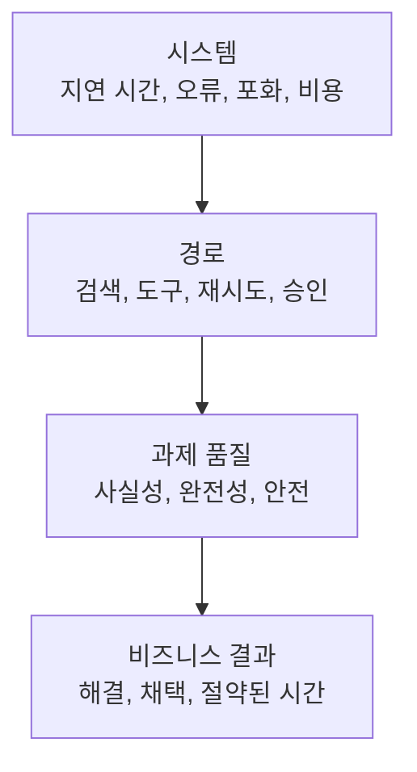

> 🇰🇷 이 문서는 한국어 번역본입니다(ELI5 스타일). 원문: [en.md](en.md)

# 프로덕션 관측 가능성, 지연 시간, 비용


> API 호출이 녹색불이어도 과제는 실패했을 수 있습니다.

**유형:** 빌드
**언어:** Python
**선수 지식:** [RAG, 검색, 데이터 파이프라인](../../24-rag-retrieval-and-data-pipelines/) / 페이즈 11, 레슨 10 / 페이즈 17, 레슨 08, 13, 27
**소요 시간:** 약 150분

## 학습 목표

- 시스템 신뢰성을 과제 품질과 비즈니스 결과로부터 분리할 수 있다
- Claude 요청과 에이전트 경로(trajectory)를 위한 로그, 지표, 트레이스를 설계할 수 있다
- 모델, 검색, 도구, 대기열, 재시도에 걸친 지연 시간을 진단할 수 있다
- 총비용과 성공 결과당 비용을 측정할 수 있다
- 서비스 목표에서 알림과 출시 게이트를 정의할 수 있다

## 문제 상황

프로덕션(운영 환경) 대시보드는 API 호출의 99.9% 성공을 보고합니다. 그런데
고객들은 여전히 불평합니다.

모델은 HTTP 200을 반환하지만 일부 답변은 낡은 출처를 사용합니다. 도구가
타임아웃되었는데 에이전트가 조용히 계속 진행합니다. 타임스탬프가 프롬프트 앞부분에
붙어서 긴 프롬프트가 캐시를 놓칩니다. 평균은 괜찮아 보이는데 P95 지연 시간이
두 배가 되었습니다. 더 싼 모델이 호출 단가를 낮췄지만 재시도와 사람의 검토는
늘렸습니다.

대시보드는 전송 성공을 측정합니다. 제품은 과제 성공에 달려 있습니다. 관측
가능성(옵저버빌리티)은 이 둘을 연결해야 합니다.

## 핵심 개념

### 네 계층을 관측하기



시스템 신호는 컴포넌트가 돌았는지 알려 줍니다. 경로 신호는 애플리케이션이 무엇을
했는지 알려 줍니다. 품질 신호는 결과가 과제를 충족했는지 알려 줍니다. 비즈니스
신호는 워크플로가 가치를 만들었는지 알려 줍니다.

이것들을 하나의 "성공" 필드로 뭉치지 마세요.

### 로그, 지표, 트레이스는 맡은 일이 다르다

로그는 개별 이벤트를 기록합니다: 요청 수용, 검색 결과 없음, 도구의 인가 거부,
출력의 스키마 검증 실패, 검토자의 에스컬레이션. 운영자가 그룹화하고 필터링할 수
있도록 구조화된 필드를 사용하세요.

지표는 시간에 걸친 동작을 집계합니다: 요청률, 오류율, P95 지연 시간, 토큰
사용량, 캐시 적중, 검색 recall, 과제 통과율, 성공당 비용. 대시보드와 알림을
이끕니다.

트레이스는 전체 경로를 연결합니다. 하나의 트레이스가 모델 호출, 검색, 도구
실행, 검증, 재시도, 사람의 승인을 부모-자식 타이밍과 함께 보여 줘야 합니다.
트레이스가 없으면 느린 요청은 불투명한 덩어리 하나로 보입니다.

### 의미적 계약을 트레이싱하기

결과를 재현하고 분류할 수 있을 만큼의 정보를 수집하세요:

- 트레이스, 요청, 세션, 사용자 안전 식별자
- 애플리케이션, 프롬프트, 모델, 도구, 지식, 평가 버전
- 입력 유형과 리스크 등급
- 토큰 수와 캐시 읽기/쓰기
- 중지 사유와 도구 이름
- 도구 소요 시간과 구조화된 오류 카테고리
- 검증 및 정책 결정
- 평가기 결과와 사람의 수정
- 최종 상태와 다운스트림 결과

비밀 정보, 원시 자격 증명, 불필요한 개인 데이터를 로그로 남기지 마세요. 민감한
입력은 평문 대신 해시, 분류, 개수, 접근 제어된 참조를 저장하세요.

### 시스템 성공과 과제 성공 분리하기

시스템 성공은 요청이 프로토콜대로 완료됐는지 묻습니다. 과제 성공은 출력이 정의된
채점 기준을 충족했는지 묻습니다. 유효한 JSON 응답이 사실상 틀릴 수 있습니다.
에이전트는 요청된 상태 변경을 완료하지 않은 채 정상 종료할 수도 있습니다.

에이전트 시스템이라면 둘 다 평가하세요:

- 최종 상태: 의도한 산출물이나 시스템 상태가 존재하는가?
- 경로: 도구, 권한, 근거, 예산이 올바르게 사용되었는가?

텍스트 매칭만으로는 둘 다 놓칩니다.

### 지연 시간 분해하기

엔드투엔드 지연 시간에는 다음이 포함됩니다:

```text
대기열 + 컨텍스트 조립 + 모델 + 검색 + 도구 + 검증 + 재시도 + 승인
```

주요 스팬마다 P50과 P95를 추적하세요. P50은 평범한 경로를 설명합니다. P95는
느린 도구, 긴 컨텍스트, 레이트 리밋, 재시도를 드러냅니다.

스트리밍 경험이라면 첫 유용한 출력까지의 시간을 포함하세요. 첫 토큰까지의 시간은
좋아 보여도, 사용자는 인용, 도구 결과, 최종 검증된 답변을 기다리고 있을 수
있습니다.

백그라운드와 배치 시스템이라면 마감 내 완료율과 처리량을 측정하세요. 전체 작업이
비즈니스 윈도우 안에 끝난다면 30초짜리 배치 항목 하나는 허용될 수 있습니다.

### 근거에서 시작하는 최적화하기

흔한 지연 시간 개입:

- 간단한 작업을 더 빠른 적합한 모델로 라우팅
- 관련 없는 컨텍스트 줄이기
- 캐싱을 위해 안정적인 프롬프트 접두어 배치
- 더 적고 더 나은 후보 검색
- 독립적인 도구 호출 동시 실행
- 비인터랙티브 워크로드를 배치로 이동
- 시간, 턴, 재시도 예산 강제
- 신선도가 허락하는 곳에서 결정론적 도구 결과 캐싱

각각은 품질이나 안전을 바꿀 수 있습니다. 대표적인 평가 집합에서 트레이드오프를
측정하세요.

### 성공 결과당 비용 측정하기

토큰 가격은 구성 요소 하나일 뿐입니다.

```text
총비용 = 모델 + 캐시 쓰기/읽기 + 도구 + 인프라 + 검토 + 수정
성공당 비용 = 총비용 / 승인된 과제 결과 수
```

실패한 요청도 돈이 듭니다. 안전한 거절, 재시도, 검토자 시간, 장애 수정도
드립니다. 팀이 조치할 수 있도록 입력, 출력, 캐시, 도구 비용을 따로따로
보고하세요.

모델이나 아키텍처 변형을 고를 때 의미 있는 비교 지표는 성공 결과당 비용입니다.

### 프롬프트 캐시 구조 이해하기

프롬프트 캐싱은 안정적인 접두어를 재사용합니다. 앞부분에 가까운 변화는 그 뒤의
모든 것을 무효화할 수 있습니다. 최신 문서가 그 캐시 배치를 지원한다면, 안정적인
도구 정의, 시스템 지시, 큰 참조 자료를 동적인 사용자 콘텐츠보다 앞에 두세요.

캐시 읽기 토큰과 캐시 쓰기 토큰을 추적하세요. 적중률 지표 없는 캐시 기능 플래그는
최적화가 아닙니다.

도구 정의, 모델 설정, 사고(thinking) 구성, 그 밖의 요청 변경은 캐시 동작에
영향을 줄 수 있습니다. 세부 사항은 계속 바뀌므로 최신 공식 문서로 확인하세요.

### 실행 가능한 알림 만들기

모든 지표 움직임이 아니라 사용자와 운영자의 결정에 알림을 설정하세요.

좋은 알림의 예:

- 의미 있는 윈도우 동안 과제 통과율이 SLO 미달
- 안전 통제 실패 또는 권한 없는 행동 시도
- P95 지연 시간이 사용자 허용치 초과
- 검색 신선도 지연
- 도구 오류 카테고리 급증
- 배포 후 캐시 적중 붕괴
- 성공당 비용이 예산 초과
- 평가기 불일치 또는 레이블 드리프트

모든 알림에는 담당자, 런북(runbook), 근거 링크, 에스컬레이션 경로가 필요합니다.
어떤 조치가 뒤따르는지 아무도 모른다면 그것은 대시보드 장식입니다.

### 롤아웃으로 근거 리스크 제한하기

오프라인 평가는 필요 조건이지 충분 조건이 아닙니다. 프로덕션 트래픽에는 새로운
쿼리, 데이터, 부하, 통합이 들어옵니다.

다음을 사용하세요:

1. 사용자 영향이 없는 섀도 평가
2. 테넌트 또는 트래픽 비율 기준의 작은 카나리
3. 자동 롤백이 있는 단계적 확대
4. 품질, 지연 시간, 비용, 안전 게이트 통과 후 전체 롤아웃

안정적인 베이스라인과 비교하고 과제 클래스별로 층을 나누세요. 전체 평균의 개선이
고위험 구간의 심각한 후퇴를 숨길 수 있습니다.

## 직접 만들기

## 인터랙티브 랩

```figure
26-latency-cost-slo
```

SLO 탐색기에서 과제 성공률, 캐시 비율, 재시도 비용, P50, P95를 독립적으로 바꿔
보세요. 더 싼 호출이나 건강한 전송에도 불구하고 사용자, 품질, 성공당 비용 게이트를
여전히 통과하지 못하는 변형이 드러납니다.

## 실습 랩

저렴하지만 실패하는 트레이스를 추가하고, 단가는 떨어지는데도 성공당 비용이
오르는 것을 관찰해 보세요. 그다음 출시를 막아야 할 첫 게이트를 찾아 보세요.

## 완성 산출물

[`outputs/release-scorecard.json`](../outputs/release-scorecard.json)은 품질,
지연 시간, 캐시, 경제성 게이트가 독립적으로 적용된, 작성을 마친 베이스라인과
후보 비교표입니다.

## 검증하기

집계를 재현하고 테스트하세요:

```bash
cd certifications/claude/lessons/26-production-observability-latency-and-cost/code
python3 main.py
python3 -m unittest discover tests -v
```

퀴즈는 진단과 롤아웃 결정을 점검합니다.

## 캡스톤 연계

스코어카드를 Architect Professional 캡스톤의 평가, 관측 가능성, 카나리
게이트로 가져가세요.

이 랩은 Python만으로 합성 트레이스 레코드를 집계합니다.

```bash
cd certifications/claude/lessons/26-production-observability-latency-and-cost/code
python3 main.py
python3 -m unittest discover tests -v
```

### 1단계: 하나의 과제 경로 표현하기

`Trace`는 간결한 엔드투엔드 기록을 저장합니다: 변형(variant), 지연 시간, 토큰
수, 비용, 시스템 결과, 과제 결과, 캐시 상태, 오류 카테고리. 프로덕션 트레이스는
하나의 평면적 객체 대신 자식 스팬과 접근 제어된 참조를 담을 것입니다.

### 2단계: 실패를 숨기지 않고 집계하기

`summarize`는 시스템 성공과 과제 성공을 따로따로 보고합니다. nearest-rank 방식의
P50과 P95, 캐시 읽기 비율, 오류 카테고리, 총비용, 과제 성공당 비용을
계산합니다. 실패한 시도도 비용 분자에 남습니다.

### 3단계: 변형 비교하기

`by_variant`는 캐시되거나 라우팅된 설계가 베이스라인에 평균으로 섞이는 것을
막습니다. 품질, 지연 시간, 비용을 함께 비교하세요.

### 4단계: 서비스 목표 평가하기

`evaluate_objectives`는 최소 과제 성공률과 최대 지연 시간, 비용 임계값을
적용합니다. 변형은 모든 필수 게이트를 통과해야 합니다. 안전이나 품질 실패를 더
낮은 비용으로 평균 내서 덮으면 안 됩니다.

## 활용하기

하나의 프로덕션 질문으로 시작해 봅시다: "릴리스 후에 과제 성공률이 왜 떨어졌는가?"

애플리케이션과 릴리스 버전으로 트레이스를 필터링하세요. 입력 유형별로 층을
나누세요. 시스템 오류를 확인하고, 그다음 검색과 도구 스팬, 그다음 검증기와
평가기 결과를 확인하세요. 프롬프트, 모델, 지식, 도구 버전을 비교하세요.
베이스라인 경로와 가장 먼저 갈라진 지점을 찾아내세요.

P50은 안정한데 P95 지연 시간이 오른다면 느린 경로(slow path) 동작을 살펴
보세요: 재시도, 레이트 리밋, 큰 입력, 도구 타임아웃, 승인 대기. 토큰 가격이
안정적인데 비용이 오른다면 호출 횟수, 컨텍스트 길이, 캐시 적중, 검토를 살펴
보세요.

릴리스 스코어카드를 유지하세요:

| 게이트 | 베이스라인 | 후보 | 요구 사항 |
|--------|-----------|------|-----------|
| 과제 통과율 | | | 고위험 층에서 후퇴 없음 |
| 안전 통과율 | | | 하드 통제에서 100% |
| P95 지연 시간 | | | SLO 이내 |
| 성공당 비용 | | | 예산 이내 |
| 검색 recall | | | 허용치 이내 |
| 사람 검토 시간(분) | | | 숨겨진 워크플로 부담 없음 |

## 시험 의사결정 패턴

API 성공률은 높은데 사용자가 나쁜 결과를 보고한다면, 의미적 품질과 경로 근거를
추가하거나 살펴 보세요. 문서 갱신 후에 틀린 답변이 시작됐다면, 모델을 바꾸기
전에 검색을 추적하세요.

다음과 같은 답을 선호하세요:

- 로그, 지표, 트레이스를 함께 사용한다
- 전송 성공, 과제 성공, 비즈니스 성공을 분리한다
- 평균이 아니라 P95를 모니터링한다
- 성공 결과당 비용을 비교한다
- 프롬프트, 모델, 도구, 지식을 버전 관리한다
- 품질, 지연 시간, 비용, 안전으로 롤아웃을 게이팅한다
- 모든 알림에 담당자와 런북을 지정한다

## 흔한 함정

### 기본값으로 전체 프롬프트 로깅하기

개인 데이터, 비밀 정보, 규제 대상 콘텐츠가 누출될 수 있습니다. 최소한의 안전한
근거를 기록하고, 민감한 참조는 접근 제어 아래 두세요.

### 단일 집계 품질 점수

언어, 리스크 등급, 과제, 고객별 후퇴를 숨길 수 있습니다. 층을 나누세요.

### 평균 지연 시간

평균이 안정적으로 보여도 작은 느린 집단이 경험을 망칠 수 있습니다. 꼬리 지연과
타임아웃 비율을 추적하세요.

### 호출당 비용

싸게 실패하는 것에 보상합니다. 승인된 결과당 비용을 쓰고 검토와 수정을
포함하세요.

## 연습 문제

1. 랩에 검색용과 두 도구용 자식 스팬을 추가해 보세요.
2. 입력 리스크 층을 추가하고, 전체 개선이 치명적인 후퇴를 숨길 수 있음을
   증명해 보세요.
3. 캐시 무효화 실험을 만들고 적중률, P95, 비용을 측정해 보세요.
4. 담당자와 런북이 있는 도구 인가 실패 알림을 설계해 보세요.
5. 어떤 하드 통제 실패든 롤백하는 카나리 정책을 작성해 보세요.

## 핵심 용어

| 용어 | 사람들이 말하는 것 | 실제 의미 |
|------|--------------------|-----------|
| 로그 | 디버그 텍스트 | 안전한 근거와 식별자를 가진 구조화된 이벤트 |
| 지표 | 아무 숫자 | 동작을 이해하거나 통제하는 데 쓰이는 시간 집계 |
| 트레이스 | 요청 ID | 전체 경로의 연결된 타이밍과 결과 |
| 과제 성공 | HTTP 200 | 요청된 결과가 채점 기준과 제약을 충족함 |
| P95 지연 시간 | 가장 느린 요청 | 측정된 요청의 95%가 이 값 이하에서 완료됨 |
| 성공당 비용 | 모델 가격 | 총 기대 비용을 승인된 과제 결과 수로 나눈 값 |

## 더 읽기

- [Claude 사용량 및 비용 API 문서](https://platform.claude.com/docs/en/build-with-claude/usage-cost-api) — 최신 사용량 보고
- [프롬프트 캐싱 문서](https://platform.claude.com/docs/en/build-with-claude/prompt-caching) — 최신 캐시 동작
- 페이즈 17, 레슨 13 — LLM 관측 가능성
- 페이즈 17, 레슨 27 — LLM 재무 운영
- 페이즈 17, 레슨 20, 21 — 점진적 전달과 A/B 테스트
