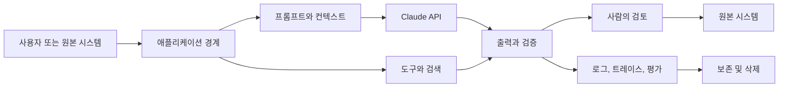

> 🇰🇷 이 문서는 한국어 번역본입니다(ELI5 스타일). 원문: [en.md](en.md)

# 엔터프라이즈 거버넌스, 컴플라이언스, 사람의 검토


> 거버넌스란 누가, 누구의 데이터로, 어떤 리스크를 감수할 수 있는지 결정하는
> 시스템입니다.

**유형:** 참고 자료
**언어:** Python
**선수 지식:** [기능에 권한 두르기](../../06-governance-safety-and-responsible-use/), [통합 프로토콜, 신원, 최소 권한](../../25-integration-protocols-identity-and-least-privilege/) / 페이즈 17, 레슨 26
**소요 시간:** 약 150분

## 학습 목표

- 정책과 규제 의무를 담당자가 있는 기술적 통제로 변환할 수 있다
- 데이터를 분류하고 프롬프트, 도구, 저장소, 로그, 검토 전체에 걸쳐 매핑할 수 있다
- 리스크, 권한, 되돌릴 수 있는지 여부를 기준으로 사람의 검토를 설계할 수 있다
- 맥락 안에서 편향, 공정성, 투명성, 이의 제기 가능성을 평가할 수 있다
- 승인, 모니터링, 사고 대응, 감사를 위한 근거를 구축할 수 있다

## 문제 상황

의료팀이 환자 메시지를 요약하고, 라우팅 카테고리를 추천하고, 응답 초안을
작성하는 Claude 워크플로를 제안합니다. 설계 문서에는 이렇게 적혀 있습니다: "모델은
데이터를 보관하지 않고, 모든 출력은 사람이 검토하며, 시스템은 HIPAA를 준수합니다."

이 문장들은 어느 것도 아키텍처가 아닙니다.

데이터는 API 페이로드, 파일, 캐시, 배치 저장소, 로그, 트레이스, 지원 시스템,
검토자 도구에 나타날 수 있습니다. "사람의 검토"라는 말은 검토자의 자격, 근거,
업무량, 권한에 대해 아무것도 말해 주지 않습니다. 컴플라이언스는 구체적인 사용
처, 계약, 구성, 지역, 통제 장치, 법률 분석에 달려 있습니다. 아키텍트가 한 문장으로
선언할 수 있는 것이 아닙니다.

올바른 대응은 무조건적인 거절이 아닙니다. 데이터 맵, 리스크 결정, 통제 담당자,
근거, 그리고 필요할 때 보안·개인정보·법무·임상·컴플라이언스 전문가로의
에스컬레이션을 갖춘, 통제된 설계입니다.

이 레슨은 아키텍처 판단력을 가르칩니다. 법률 자문이 아닙니다.

## 핵심 개념

### 리스크 결정에서 시작하기

거버넌스는 다음을 식별하는 것에서 시작합니다:

- 시스템이 영향을 주는 결정 또는 행동
- 이득을 보거나 피해를 입을 수 있는 사람들
- 관련된 데이터 분류
- 오류와 악용 양상
- 되돌릴 수 있는지 여부
- 필요한 권한
- 적용되는 조직 내부 및 외부 의무
- 잔여 리스크를 수용하는 담당자

만능 가드레일 목록으로 시작하지 마세요. 콘텐츠 필터, 승인 대기열, 암호화 통제는
특정 경계의 명명된 리스크를 다룰 때만 가치가 있습니다.

### 데이터를 시스템 전체에 매핑하기



각 연결선과 저장소마다 기록하세요:

- 데이터 카테고리와 목적
- 출처와 (관련 있는 경우) 데이터 주체
- 필수 필드와 선택 필드
- 신원과 접근
- 암호화와 키 소유권
- 제공자와 하위 처리자(subprocessor) 경계
- 지역 또는 데이터 소재지 요구사항
- 보존 및 삭제 동작
- 모델 개선 또는 평가에의 사용
- 사고 및 접근 감사 근거

제품 기능은 보존 및 적격성 동작이 서로 다를 수 있습니다. 파일, 배치 처리, 코드
실행, MCP 커넥터, 호스티드 세션, 표준 Messages 요청은 동일한 경계를 공유하지
않을 수 있습니다. 정확한 기능 조합은 최신 공식 문서와 여러분의 계약으로
확인하세요.

### 보호하기 전에 최소화하기

불필요한 데이터가 시스템에 아예 들어오지 않으면 보안 통제가 더 강해집니다.

다음 순서를 적용하세요:

1. 과제에 필요 없는 필드를 제거한다.
2. 신원이 필요 없는 곳에서는 가명 처리하거나 집계한다.
3. 명시적인 요구사항에 따라 기능 또는 제공자 경계를 제한한다.
4. 신원, 범위, 보존 기간, 로그를 제한한다.
5. 남은 데이터를 암호화, 모니터링, 사고 통제로 보호한다.

"Claude에게 기억하지 말라고 하기"는 보존 통제가 아닙니다. 구성과 계약상
동작이 보존을 정의합니다.

### 통제 매트릭스 만들기

통제는 여러 유형으로 나뉩니다.

| 유형 | 목적 | 예시 |
|------|------|------|
| 예방형 | 안전하지 않은 사건을 차단 | 범위 게이트가 권한 없는 쓰기를 차단 |
| 탐지형 | 문제를 드러냄 | 샘플링된 출력에서 민감 필드 누출 알림 |
| 교정형 | 피해를 제한하거나 수리 | 접근 회수, 모델 라우트 롤백, 영향받은 레코드 정정 |
| 거버넌스형 | 권한을 배정하고 검토 | 담당자가 중대 변경 후 유스케이스를 재승인 |

각 통제마다 담당자, 구현, 근거, 테스트, 실패 대응, 검토 주기를 기록하세요.
담당자와 테스트가 없는 통제는 그저 소망입니다.

### 모델 가드레일과 시스템 가드레일을 겹쌓기

여러 경계를 사용하세요:

- 입력 검증과 분류
- 신뢰할 수 있는 출처와 신뢰할 수 없는 콘텐츠의 분리
- 프롬프트 지시와 예시
- 최소한의 도구 노출
- 인증과 인가
- 스키마 및 의미적 출력 검증
- 행동 한계와 승인
- 배포 후 모니터링과 레드팀 테스트

프롬프트 가드레일은 생성에 영향을 줍니다. 시스템 가드레일은 불변 조건을 강제합니다.
어느 하나가 다른 하나를 대체하지는 않습니다.

### 사람의 검토를 통제 장치로 설계하기

사람 개입(human-in-the-loop)은 검토자가 결정을 개선할 수 있고, 그러기 위한
정보, 시간, 역량, 권한을 가지고 있을 때 유용합니다.

정의하세요:

- 트리거: 리스크 클래스, 근거 부족, 충돌, 불확실성, 또는 샘플링된 케이스
- 검토자: 역할과 자격
- 패킷: 출처 근거, 모델 출력, 도구 경로, 플래그, 제안된 행동
- 결정: 승인, 수정, 기각, 에스컬레이션, 또는 근거 요청
- 서비스 수준: 시간 예산과 대기열 처리 용량
- 폴백: 검토를 사용할 수 없을 때의 안전한 동작
- 감사: 신원, 근거, 타임스탬프, 최종 행동

자동화 편향(automation bias)을 피하세요. 검토자는 도장 찍기를 유도하는 매끈한
답변이 아니라 근거를 살펴볼 이유가 필요합니다. 생성된 결론보다 출처 발췌를 먼저
보여 주거나, 구조화된 사유 코드를 요구하는 방법을 고려하세요.

### 리스크에 맞춘 검토하기

| 리스크 | 예시 | 검토 패턴 |
|--------|------|-----------|
| 낮음 | 쉽게 되돌릴 수 있는 내부 초안 | 자동 검사 + 샘플링된 검토 |
| 중간 | 고객 대면 추천 | 임계값 또는 예외 기반 검토 |
| 높음 | 재무, 법률, 임상, 또는 파괴적 행동 | 행동 전 자격을 갖춘 사람의 승인 |
| 알 수 없음 | 새 유스케이스 또는 빈약한 근거 | 보류, 에스컬레이션, 근거 수집 |

같은 모델이 내놓는 확신도(confidence)는 신뢰할 수 있는 안전 경계가 아닙니다.
관측 가능한 근거, 보정된 평가기, 결정론적 조건, 자격을 갖춘 검토를 사용하세요.

### 공정성을 맥락적 요구사항으로 다루기

편향이란 사람들에게 불리하게 작용할 수 있는 체계적 오류나 표현을 의미합니다.
공정성은 단일한 만능 지표가 아닙니다.

물어보세요:

- 어떤 결정이 내려지고 있는가?
- 어떤 집단이 다른 오류율이나 접근성을 겪을 수 있는가?
- 어떤 보호 대상 또는 민감 속성이 존재하거나, 추론되거나, 우회적으로 표현되는가?
- 법적·윤리적 맥락에 맞는 공정성 정의는 무엇인가?
- 정확도, 개인정보, 개별 대응과의 트레이드오프는 무엇인가?
- 기준을 선택하고 검토할 권한은 누구에게 있는가?

적절한 경우 대표적인 세부 집단과 교차 집단(intersectional group)을 테스트하세요.
작은 표본 크기는 불확실성을 만들며, 이는 숨기지 말고 보고해야 합니다.

### 투명성과 이의 제기 가능성 제공하기

사람들에게 필요한 설명은 서로 다릅니다.

- 최종 사용자는 AI가 상호작용에 실질적으로 영향을 주는 시점과, 유해한 결과에
  이의를 제기하는 방법을 알아야 합니다.
- 검토자는 근거, 불확실성, 통제 맥락이 필요합니다.
- 운영자는 버전, 트레이스, 실패 카테고리가 필요합니다.
- 감사자는 정책 매핑, 테스트, 담당, 보관된 근거가 필요합니다.
- 경영진은 잔여 리스크, 비즈니스 영향, 결정 상태가 필요합니다.

설명으로 사고 과정(chain-of-thought)이나 민감한 시스템 지시를 노출하지 마세요.
출처 기반 이유, 적용된 규칙, 관련 요인, 사람의 이의 제기 경로를 제공하세요.

### 변화에 대비하기

다음 중 중대한 요소가 바뀌면 재평가하세요:

- 유스케이스 또는 영향받는 모집단
- 모델 또는 제공자
- 프롬프트 또는 도구 권한
- 데이터 출처, 보존 기간, 지역
- 평가 결과 또는 사고 패턴
- 법, 정책, 계약
- 배포 규모

리스크 평가와 통제 근거에 버전을 부여하세요. 출시 승인이 관련 없는 미래의
다른 시스템까지 커버하지는 않습니다.

## 직접 만들기

## 인터랙티브 랩

```figure
27-governance-approval-flow
```

승인 흐름 탐색기에서 결과의 심각도, 되돌릴 수 있는지, 근거, 검토자 자격,
대기열 용량, 폴백을 바꿔 보세요. 어떤 경우에 "사람의 검토"라는 레이블이 진짜
통제 장치이고, 어떤 경우에 단지 병목인지 드러납니다.

## 실습 랩

패킷 사본에서 검토 폴백이나 통제 담당자 하나를 제거하고, 차단 상태를 관찰한 뒤,
거버넌스 설계를 수리해 보세요.

## 완성 산출물

작성을 마친 [`outputs/governance-control-packet.md`](../outputs/governance-control-packet.md)에는
리스크 레지스터, 데이터 경계, 예방·탐지·교정·거버넌스 통제, 그리고 인력이 배치된
승인 경로가 담깁니다.

## 검증하기

담당 구조와 실패 대응을 결정론적으로 검증하세요:

```bash
cd certifications/claude/lessons/27-enterprise-governance-compliance-and-hitl
python3 code/main.py
python3 -m unittest discover -s code/tests -v
```

퀴즈는 거버넌스와 재평가 결정을 점검합니다.

## 캡스톤 연계

이 패킷을 Architect Professional 캡스톤의 거버넌스 및 사람 검토 섹션으로
가져가세요.

고영향 Claude 워크플로를 위한 거버넌스 패킷을 만드세요.

### 1단계: 리스크 레지스터

```markdown
| 리스크 | 원인 | 영향받는 당사자 | 영향 | 가능성 | 통제 | 담당자 | 잔여 리스크 |
|--------|------|----------------|------|--------|------|--------|-------------|
```

우발적 실패, 오용, 프롬프트 인젝션, 내부자 접근, 의존성 실패, 오래된 지식,
불공정한 성능, 검토자 과부하를 포함하세요.

### 2단계: 데이터 맵

모든 페이로드, 저장소, 로그, 캐시, 평가 집합, 사람 인터페이스, 외부 서비스를
나열하세요. 데이터 목적, 최소 필드, 보존, 삭제, 신원, 지역, 계약 경계를
표시합니다.

### 3단계: 통제 매트릭스

```markdown
| 통제 | 다루는 리스크 | 경계 | 담당자 | 근거 | 테스트 | 실패 시 |
|------|---------------|------|--------|------|--------|---------|
```

예방형, 탐지형, 교정형, 거버넌스형 통제를 최소 하나씩 포함하세요.

### 4단계: 사람 검토 설계

트리거, 검토자 자격, 근거 패킷, 행동, 대기열 SLO, 폴백, 감사 기록을 명시하세요.
예상 검토 물량을 계산합니다. 대기열이 SLO를 충족할 수 없다면 설계가 불완전한
것입니다.

### 5단계: 승인과 재평가

별도의 담당자가 필요한 기술, 보안, 개인정보, 도메인, 비즈니스 결정을 지정하세요.
중대 변경 트리거와 다음 검토 날짜를 정의합니다.

## 활용하기

환자 메시지 워크플로의 경우, 더 안전한 첫 릴리스는 응답을 보내거나 의료 기록을
변경하지 않은 채 자격을 갖춘 검토자에게 라우팅 추천 초안을 제공하는 것일 수
있습니다. 최소 필수 필드, 신뢰할 수 있는 임상 출처, 엄격한 테넌트 및 역할 인가,
출처 연결 출력, 고위험 키워드 및 근거 검사, 그리고 검토 대기열을 사용할 수 없을
때의 안전한 폴백을 사용합니다.

그런 다음 팀은 다음을 검증합니다:

- 메시지 클래스별 과제 정확도
- 긴급 케이스에 대한 위음성(false negative) 동작
- 허용되고 적절한 경우 인구통계 및 언어 세부 집단
- 출처 뒷받침과 오래된 데이터 처리
- 검토자 합의도, 시간, 수정 사항(override)
- 개인정보, 접근, 보존, 삭제 통제
- 사고, 롤백, 감사 동작

법무, 개인정보, 보안, 임상 담당자가 결과 근거가 적용되는 의무를 충족하는지
판단합니다. 아키텍트는 맵, 통제, 테스트, 잔여 리스크 진술을 제공합니다.

## 시험 의사결정 패턴

시나리오에 규제 대상 또는 민감한 데이터가 나오면, 내부 사용이 자동으로 허용된다고
추론하지 마세요. 최소화하고, 분류하고, 정책과 계약을 확인하고, 적절한 권한자를
참여시키세요.

다음과 같은 답을 선호하세요:

- 불필요한 식별자를 제거하거나 익명화한다
- 기능별 데이터 경계와 보존을 매핑한다
- 모델 통제와 결정론적 통제를 겹으로 쌓는다
- 고영향 행동을 자격을 갖춘 승인에 묶는다
- 대표적인 세부 집단과 불리한 케이스를 테스트한다
- 근거와 이의 제기 또는 에스컬레이션 경로를 제공한다
- 통제 담당자와 재평가 트리거를 지정한다

프롬프트, 모델 확신도, 일반적인 검토, 벤더 주장을 완전한 거버넌스로 취급하는
답은 피하세요.

## 흔한 함정

### 제품 이름으로 하는 컴플라이언스

적격성은 기능, 구성, 계약, 지역, 데이터 흐름에 따라 달라질 수 있습니다. 정확한
아키텍처를 검증하세요.

### 체크박스로서의 사람의 검토

근거 없이 자격이 없거나 과부하에 걸린 검토자는 리스크를 신뢰할 수 있게 줄여 주지
못합니다.

### 최소화 없는 감사용 로깅

장황한 로그는 새로운 민감 데이터 저장소를 만들 수 있습니다. 적절한 접근 및 삭제
통제 아래 최소한의 근거만 보관하세요.

### 단일 공정성 지표

공정성 정의들은 서로 충돌할 수 있습니다. 맥락, 법, 피해, 이해관계자 결정에서
선택한 뒤 트레이드오프를 보고하세요.

## 연습 문제

1. 파일, MCP 커넥터, 배치 평가, 사람의 검토를 사용하는 지원 워크플로의 데이터
   맵을 만들어 보세요.
2. 일 10,000건, 트리거율 5%인 검토 대기열을 설계하고 인력 가정을 계산해 보세요.
3. 권한 없는 테넌트 데이터가 모델 컨텍스트에 절대 도달하지 않음을 증명하는 통제
   테스트를 작성해 보세요.
4. AI 보조 결정으로 피해를 입은 사용자를 위한 이의 제기 경로를 정의해 보세요.
5. 거버넌스 재평가를 강제하는 중대 변경 기준을 만들어 보세요.

## 핵심 용어

| 용어 | 사람들이 말하는 것 | 실제 의미 |
|------|--------------------|-----------|
| 거버넌스 | 정책 문서 | 시스템 라이프사이클에 걸친 결정, 담당, 통제, 근거, 검토 |
| 데이터 최소화 | 전부 암호화 | 목적이 요구하지 않는 필드는 수집하거나 보내지 않음 |
| 사람 개입(HITL) | 사람이 출력을 봄 | 트리거, 자격을 갖춘 담당자, 근거, 권한, 폴백을 갖춘 정의된 통제 |
| 잔여 리스크 | 숨겨진 문제 | 통제 후에 남은 리스크로, 권한 있는 담당자가 명시적으로 수용함 |
| 공정성 | 동일한 정확도 | 트레이드오프와 영향받는 이해관계자가 있는 맥락 의존적 기준 |
| 이의 제기 가능성 | 고객 지원 | 결과에 이의를 제기하고, 검토하고, 바로잡을 수 있는 실질적인 경로 |

## 더 읽기

- [Claude API 데이터 보존 문서](https://platform.claude.com/docs/en/manage-claude/api-and-data-retention) — 최신 기능별 경계
- [Anthropic Trust Center](https://trust.anthropic.com/) — 최신 보안 및 컴플라이언스 자료
- [Claude의 헌법(Constitution)](https://www.anthropic.com/constitution) — Anthropic의 공개된 모델 행동 프레임워크
- 페이즈 17, 레슨 26 — 컴플라이언스 아키텍처
- 페이즈 18, 레슨 20, 21 — 편향과 공정성
