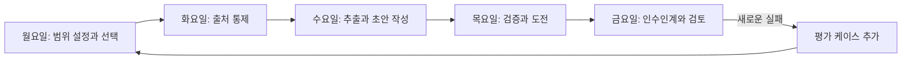

> 🇰🇷 이 문서는 한국어 번역본입니다(ELI5 스타일). 원문: [en.md](en.md)

# 완벽한 프롬프트가 아니라 한 주의 작업을 출시하기


> 여러분의 캡스톤은 통제된 결정 워크플로입니다: 출처가 들어오고, 주장이
> 검증되고, 사람의 권한이 유지되고, 상태가 인수인계됩니다.

**유형:** 빌드
**언어:** Python
**선수 지식:** [작업을 감당할 수 있는 가장 작은 표면 선택하기](../../01-claude-product-and-model-landscape/), [요청을 검증 가능한 계약으로 바꾸기](../../03-prompting-and-task-decomposition/), [각 사실을 올바른 종류의 컨텍스트에 두기](../../04-context-knowledge-memory-and-caching/), [확신도가 아니라 주장을 검증하기](../../05-output-evaluation-and-validation/), [기능에 권한 두르기](../../06-governance-safety-and-responsible-use/), [자동화보다 인수인계를 먼저 설계하기](../../07-workflow-design-and-human-handoffs/)
**소요 시간:** 시뮬레이션된 한 주(워크위크)에 걸쳐 약 4시간

## 학습 목표

- 제품 선택, 프롬프팅, 지식 관리, 검증, 거버넌스, 문제 해결, 인수인계 설계를 결합한다.
- 명시적인 체크포인트를 갖춘, 출처 기반 주간 브리핑 워크플로를 구축한다.
- 출처, 주장, 거버넌스, 인수인계 준비성을 위한 결정론적 Python 검증기를 구현한다.
- 출시를 권고하기 전에 정상 케이스와 실패 케이스를 실행한다.
- 워크플로가 안전하다고 주장하는 대신 준비성의 근거를 만들어 낸다.

## 문제 상황

당신은 7개 지역 팀을 둔 가상 회사 Northstar Field Services의 운영 책임자입니다.
매주 금요일, 리더십 그룹은 서비스 지연, 고객 영향 장애, 정책 예외, 그리고 다음
주를 위한 두 가지 결정을 다루는 브리프가 필요합니다.

현재 프로세스는 취약합니다. 지역 책임자들이 서로 다른 형식으로 업데이트를
보냅니다. 애널리스트가 사실을 문서로 옮기고, 엇갈린 날짜를 맞추고, 세 사람에게
승인을 요청합니다. 최종 브리프는 가끔 한 지역을 빠뜨리거나, 오래된 메시지에서
정정되기 전 숫자를 그대로 실기도 합니다.

리더십은 "Claude로 주간 보고서를 자동화해 달라"고 요청합니다. 그 요청은
솔루션이 아닙니다. 이 브리프는 인력 배치와 고객 커뮤니케이션에 영향을 줍니다.
일부 입력에는 고객 정보가 들어 있습니다. 정책 예외에는 권한을 가진 담당자가
필요합니다. 근거 없이 확신에 찬 초안은 잘못된 결정을 더 빨리 내리게 만들 수
있습니다.

당신의 임무는 범위가 제한된 Claude 보조 워크플로를 설계하는 것입니다. Claude는
추출, 비교, 초안 작성을 할 수 있습니다. 결정론적 검사가 정확한 속성을
검증합니다. 권한을 가진 사람이 게시와 결과를 좌우하는 결정을 담당합니다.

## 핵심 개념

### 산출물은 증명의 사슬이다

여러분은 다섯 개의 연결된 산출물을 만들게 됩니다:

1. 유스케이스 및 제품 선택 기록.
2. 관리되는 출처 레지스트리와 고정된 주간 스냅샷.
3. 단계별 프롬프트 계약.
4. 주장-근거 및 거버넌스 검증 결과.
5. 폴백을 갖춘 사람 인수인계 패킷.



매일은 게이트에서 끝납니다. 게이트가 실패하면 불확실성을 다음 단계로 밀어 넣지
마세요.

### Python 검증기는 의도적으로 제한적이다

캡스톤 코드는 Claude를 호출하지 않습니다. 결정적인 아키텍처 경계를 보여 줍니다:
정확한 워크플로 속성은 결정론적 코드의 몫입니다.

검증기는 다음을 확인합니다:

- 필수 패킷 섹션이 존재하는지.
- 모든 활성 출처에 담당자, 권한 클래스, 날짜, 민감도, 안정적인 ID가 있는지.
- 주장이 알려진 출처를 참조하는지.
- 결과에 영향을 주는 주장이 직접 또는 계산된 근거를 사용하는지.
- 오래되었거나 충돌하는 근거가 보이는지.
- 선택된 표면(surface)이 해당 데이터 클래스에 승인되어 있는지.
- 고결과 또는 되돌릴 수 없는 작업에 권한을 가진 사람 담당자가 있는지.
- 인수인계가 결정, 마감, 폴백, 다음 담당자를 명명하는지.

검증기는 정책이 윤리적으로 충분한지, 사람 검토자가 유능한지, 출처 진술이
사실인지 판단할 수 없습니다. 그것들은 조직과 사람의 책임으로 남습니다.

## 직접 만들기

## 인터랙티브 랩

```figure
29-associate-capstone-readiness
```

5일간의 구축 내내 준비성 보드를 사용하세요. 목적, 출처, 프롬프트 단계, 주장
뒷받침, 권한, 인수인계, 폴백을 연결해서, 매끈한 브리프가 실패한 게이트를
숨길 수 없게 만듭니다.

## 실습 랩

아래 5일 워크플로를 완주한 뒤, 표면, 출처, 주장 뒷받침, 권한, 인수인계 게이트를
하나씩 의도적으로 깨 뜨려 보세요.

## 완성 산출물

제공되는 체크리스트와 작성을 마친
[`outputs/demo-readiness-report.json`](../outputs/demo-readiness-report.json)이
실질적인 산출물입니다.

## 검증하기

아래 명령으로 통과하는 패킷과 모든 실패 우선 테스트를 재현하세요. 네트워크
접근이나 자격 증명은 필요하지 않습니다. 레슨 퀴즈가 마지막 개인 점검입니다.

## 캡스톤 연계

완성된 패킷은 다른 사람이 검토하는 Associate 루트 캡스톤의 근거입니다.

### 월요일: 결정과 제품 표면의 범위 정하기

결정을 한 문장으로 쓰세요:

```text
금요일 15:00까지, 운영 디렉터가 승인된 지역 스냅샷을 근거로 다음 주의 인력
또는 프로세스 변경을 최대 두 가지로 정해 선택한다.
```

범위 밖을 정의하세요:

- 고객 메시지 자동 발송 없음.
- 직원 성과 순위 매기기 없음.
- 인력 일정 변경 없음.
- 법적 또는 규제 결론 없음.
- 제한된 데이터 사용 없음.

후보 표면들을 비교하세요. 일회성 채팅은 쉽지만 유지되는 지시와 반복되는 출처
집합에는 약합니다. Project는 현재 약관, 플랜 통제, 데이터 처리가 승인되어 있다면
협업적이고 반복되는 작업에 맞을 수 있습니다. API는 프로그래밍 방식 수집, 검증,
감사 통합이 필요할 때 맞습니다. Research는 최신 외부 사실에 유용하지, 내부
승인 정책을 대체하는 용도가 아닙니다.

제품 이름만이 아니라 결정을 기록하세요:

```text
표면(Surface):
적합한 이유:
허용되는 데이터 클래스:
약관 확인 날짜:
지원되지 않는 요구사항:
폴백 표면 또는 수동 경로:
```

게이트: 담당자가 목적, 표면, 데이터 클래스, 금지 행동을 승인한다.

### 화요일: 근거를 고정하고 통제하기

다음을 위한 출처 레지스트리를 만드세요:

- 일곱 지역 상태 파일.
- 장애 시스템 익스포트.
- 승인된 서비스 정책.
- 인력 수용력(capacity) 표.
- 지난주 결정 기록.

모든 출처에는 안정적인 ID, 담당자, 권한 클래스, 시행일, 검토일, 민감도가
필요합니다. 논의 메모는 정책이 아니라 참고 자료로 표시하세요. 결정에 필요하지
않다면 고객 이름은 제거하세요.

주간 출처 스냅샷을 문서화된 시점에 고정하세요. 그 이후 바뀌는 사실은 수정 또는
예외 프로세스로 들어가야 합니다. 그렇지 않으면 초안 작성자, 검토자, 리더가
각기 다른 세계를 보게 됩니다.

권한 순서를 정의하세요:

```text
1. 승인된 서비스 정책과 서명된 장애 상태
2. 마감 전에 제출된 현재 지역 상태
3. 지난 결정 기록
4. 논의 메모 — 책임자만 사용, 단독 근거로는 절대 사용 금지
```

게이트: 일곱 지역이 모두 있거나 명시적으로 누락 표시됨; 출처가 신선도 및 권한
검사를 통과함; 충돌마다 담당자가 있음.

### 수요일: 작업 분해하기

한 번에 최종 브리프를 요구하지 마세요. 네 개의 제한된 단계를 사용하세요.

**1단계, 추출:** 지역, 지연, 영향받는 서비스, 장애 ID, 정책 예외, 출처 ID,
불확실성에 대한 구조화된 행을 반환합니다. 행동을 권고하지 않습니다.

**2단계, 조정(reconciliation):** 지역 커버리지, 합계, 중복 장애, 날짜 충돌,
근거 없는 필드를 검사합니다. 블로커가 남아 있으면 중단합니다.

**3단계, 분석:** 패턴을 식별하고 후보 행동을 최대 세 개까지 제안합니다. 각
행동에는 뒷받침하는 조사 결과, 정책 제약, 예상 이점, 잠재적 손해, 그리고 그것을
승인할 수 있는 담당자가 필요합니다.

**4단계, 초안 작성:** 검증된 행과 승인된 분석만으로 경영진 브리프를 만듭니다.
필요한 결정, 근거, 예외, 알려진 불확실성을 포함합니다.

매 단계마다 프롬프트 계약을 사용하세요. 출처 계층, 거절(abstention) 동작, 출력
형태, 수용 기준을 포함합니다. 실패한 결과를 재현할 수 있도록 버전을 저장하세요.

게이트: 분석이 시작되기 전에 구조화된 추출이 스냅샷과 일치함.

### 목요일: 검증하고 도전하기

포함된 검증기를 실행하세요:

```bash
cd certifications/claude/lessons/29-associate-workflow-capstone
python3 code/main.py
```

데모 패킷은 `ready_for_human_review` 상태를 반환해야 합니다. 이제 의도적으로
깨 뜨려 보세요:

- `approved_surface`를 false로 설정.
- 출처 담당자 하나 제거.
- 존재하지 않는 출처 ID 참조.
- 결과에 영향을 주는 주장 하나를 추측성(speculative)으로 표시.
- 결정 담당자 제거.
- 행동을 되돌릴 수 없게 만들기.

단위 테스트를 실행하세요:

```bash
python3 -m unittest discover -s code/tests -v
```

그런 다음 실제 초안에 대한 주장-근거 매트릭스를 만드세요. 인용은 정확히 그
주장을 뒷받침해야 합니다. 합계는 모델 채점자가 아니라 코드나 스프레드시트로
검증하세요. 별도의 검토자에게 채점 기준(rubric)과 근거를 주세요. 그 검토자가
초안을 조용히 다시 쓰는 것이 아니라 조사 결과를 보고하도록 요청하세요.

출시 등급을 사용하세요:

- **차단(Block):** 승인되지 않은 데이터나 표면, 알 수 없는 출처, 유효하지 않은
  합계, 근거 없는 중대 주장, 결정 권한 누락.
- **수정(Revise):** 불완전한 커버리지, 미해결 충돌, 오래된 출처, 불명확한
  불확실성.
- **품질 개선:** 반복, 약한 제목, 중대하지 않은 어조 문제.

게이트: 모든 블로커가 해결됨. 남은 불확실성은 사람 패킷에 보임.

### 금요일: 인수인계하고 루프 닫기

[`outputs/checklist.md`](../outputs/checklist.md)를 완성하세요. 검토 패킷을
만드세요:

```text
결정: 다음 주 개입 방안을 최대 두 가지 선택.
담당자: 운영 디렉터.
마감: 금요일 15:00.
스냅샷: 주간 출처 레지스트리 버전과 마감 시점.
후보: 브리프 버전과 프롬프트 버전.
근거: 주장 ID, 출처 ID, 계산 결과.
검사: 통과, 실패, 수동 검토 항목.
불확실성: 누락된 지역, 충돌하는 날짜, 빈약한 근거.
옵션: 승인, 수정, 기각, 에스컬레이션.
폴백: 수동 템플릿 게시 또는 공지와 함께 지연.
```

디렉터는 "AI"가 아니라 결정을 승인합니다. 누가, 어떤 스냅샷을 근거로, 무엇을
승인했는지 기록하세요. 승인 후에 출처가 바뀌면 게시 게이트를 무효화하고 변경
분(delta)을 검토하세요.

시뮬레이션된 출시 후에 짧은 회고를 실행하세요:

- 어떤 단계가 사람의 시간을 가장 많이 소모했는가?
- 어떤 검사가 가장 심각한 결함을 잡았는가?
- 중요한 판단이 더 어려워진 부분이 있는가?
- 어떤 출처가 더 나은 담당 체계를 필요로 하는가?
- 어떤 실패가 평가 집합에 들어가야 하는가?
- 워크플로가 보조 상태를 유지해야 하는가, 제한된 자동화로 갈지, 수동으로
  돌아가야 하는가?

## 활용하기

### 완전한 근거 패키지

제출물에는 다음이 포함되어야 합니다:

- 검증 날짜가 있는 표면 선택 기록.
- 10개 출처 레지스트리 또는, 필요한 모든 출처 클래스를 대표하는 더 작은
  동등물.
- 네 개의 프롬프트 단계 계약.
- 최소 10개 평가 케이스: 정상 4개, 경계 3개, 거버넌스 또는 공격적 3개.
- 결과에 영향을 주는 모든 주장에 대한 주장-근거 매트릭스.
- 통과 패킷 1개와 실패 패킷 3개에 대한 검증기 출력.
- 통과하는 단위 테스트 출력.
- 완성된 사람 인수인계 체크리스트.
- 구체적인 워크플로 변경 하나를 담은 한 페이지 회고.

### 캡스톤 의사결정 패턴

작업을 검토하거나 시험 시나리오에 답할 때 사용하세요:

1. **승인된 목적이 없으면, 중단한다.** 기능이 있다고 권한이 생기는 것은 아니다.
2. **권위 있는 근거가 없으면, 거절하거나 에스컬레이션한다.** 더 많은 프롬프팅으로
   출처가 만들어지지는 않는다.
3. **정확한 속성은, 결정론적 검사로.** 합계와 스키마에 주관적 채점은 필요 없다.
4. **높은 결과는, 사람의 권한으로.** 사람에게 근거와 기각할 권한을 준다.
5. **반복되는 실패는, 시스템을 수리한다.** 케이스, 통제, 또는 출처 규칙을
   추가한다.
6. **바뀔 수 있는 제품 사실은, 실시간으로 검증한다.** 표면, 날짜, 출처를
   기록한다.

### 흔한 함정

- **최종 프롬프트부터 시작하기:** 범위와 출처 실패가 산문(prose) 문제로 위장한다.
- **아카이브 통째로 올리기:** 폐기된 근거가 활성 정책과 경쟁한다.
- **인용 문법 믿기:** 인용된 출처가 주장을 실제로 함의하지 않을 수 있다.
- **검토자가 상태를 다시 발견하게 두기:** 인수인계 시간이 절약하기로 한 시간을
  잠식한다.
- **게시를 먼저 자동화하기:** 되돌릴 수 있는지와 권한이 무시된다.
- **테스트를 안전성의 증명으로 취급하기:** 단위 테스트는 구현된 규칙을 커버할
  뿐, 조직적 진실을 커버하지 않는다.
- **현재 제품 세부를 설계에 얼려 넣기:** 약관, 기능, 모델, 비용, 한계는
  흘러간다.

### 연습 문제

1. 가상 시나리오를 실제 반복 업무 하나로 바꾸되, 5일간의 게이트는 유지해
   보세요.
2. 여러분의 워크플로에 고유한 정책에 대한 검증기 규칙을 추가해 보세요.
3. 그 규칙을 구현하기 전에 실패하는 테스트를 먼저 작성해 보세요.
4. 같은 열 개 케이스에서 거대 프롬프트 하나와 4단계 흐름을 비교해 보세요.
5. 검토자에게 여러분의 패킷만으로 인수인계를 완료해 달라고 요청하세요. 그 사람이
   추가로 요청해야 했던 모든 사실을 기록하세요.
6. 검토와 재작업 시간을 포함해 승인된 브리프당 비용을 계산해 보세요.

## 핵심 용어

- **결정 워크플로:** 통제된 근거를 검토된 행동이나 권고로 바꾸는 순서.
- **출처 스냅샷:** 한 번의 실행에 사용되는 고정되고 버전화된 근거 집합.
- **중대 주장(consequential claim):** 결정이나 행동에 실질적으로 영향을 주는
  주장.
- **검증 패킷:** 출시 전에 검사되는, 구조화된 출처, 주장, 거버넌스, 인수인계
  상태.
- **출시 등급:** 결과의 심각도에 따른 차단, 수정, 또는 품질 상태.
- **결정 담당자:** 최종 선택에 대한 권한과 책임을 가진 사람.
- **델타 검토:** 이전 승인 이후 도입된 변경을 다시 검증하는 것.
- **준비성의 근거:** 테스트 결과, 실패 케이스, 승인, 폴백 증명이지 일반적인
  안심시키기가 아님.

## 더 읽기

- [Claude Certified Associate Foundations 시험 가이드](https://everpath-course-content.s3-accelerate.amazonaws.com/instructor%2F6nizmqk8tpzpfjvt6qmmav7rh%2Fpublic%2F1783542847%2FClaude+Certified+Associate+%E2%80%93+Foundations+Exam+Guide.pdf)
- [Anthropic: 효과적인 에이전트 구축](https://www.anthropic.com/research/building-effective-agents)
- [Anthropic: 성공 기준 정의와 평가 구축](https://platform.claude.com/docs/en/test-and-evaluate/develop-tests)
- [Anthropic: API와 데이터 보존](https://platform.claude.com/docs/en/manage-claude/api-and-data-retention)
- [AI Engineering from Scratch: 범위 계약](../../../../../phases/14-agent-engineering/36-scope-contracts/)
- [AI Engineering from Scratch: 검증 게이트](../../../../../phases/14-agent-engineering/38-verification-gates/)
- [AI Engineering from Scratch: 멀티 세션 인수인계](../../../../../phases/14-agent-engineering/40-multi-session-handoff/)

공식 시험 블루프린트와 Claude 제품 동작은 바뀔 수 있습니다. 이 캡스톤은 2026년
7월 기준 가이드와 2026-08-08에 확인한 출처에 맞춰져 있습니다. 릴리스별 사실에
의존하기 전에 현재 가이드, 제품 약관, 모델, 한계, 통제를 확인하세요.
