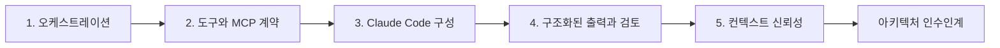

> 🇰🇷 이 문서는 한국어 번역본입니다(ELI5 스타일). 원문: [en.md](en.md)

# 여섯 컨텍스트에서 하나의 아키텍처 방어하기

> 아키텍처란 시나리오가 바뀌고, 도구가 실패하고, 근거가 불완전할 때에도 여전히 유지되는 경계들의 집합입니다.

**유형:** 빌드
**언어:** Python
**선수 지식:** [멀티 에이전트 오케스트레이션과 위임](../../16-multi-agent-orchestration-and-delegation/), [도구 계약, 오류, 점진적 탐색](../../18-tool-contracts-errors-and-progressive-discovery/), [Claude Code 메모리, Rules, 스킬, CI](../../19-claude-code-memory-rules-skills-and-ci/), [신뢰할 수 있는 추출, 배치, 독립 검토자](../../20-reliable-extraction-batch-and-reviewers/), [큰 컨텍스트를 관측 가능하게 만들기](../../21-long-context-reliability-provenance-and-escalation/)
**소요 시간:** 집중 세션 두 번에 걸쳐 약 6시간

## 학습 목표

- 다섯 개 CCAR-F 도메인 전체에서 아키텍처 선택을 방어한다.
- 하나의 토폴로지를 통째로 외우는 대신, 하나의 결정 방법을 여섯 공개 시나리오 컨텍스트에 적용한다.
- 오케스트레이션, 도구, Claude Code, 구조화된 출력, 컨텍스트 신뢰성에 대한 결정론적 검사를 구현한다.
- 부분 결과, 오래된 상태, 안전하지 않은 도구, 잘못된 출력을 시험하는 실패 패킷을 만든다.
- 명시적인 트레이드오프와 에스컬레이션이 담긴, 검토자가 볼 수 있는 아키텍처 패킷을 만들어 낸다.

## 문제 상황

어떤 아키텍트가 여섯 가지 예상 유스케이스에 대해 여섯 개의 다이어그램을 준비합니다. 지원 다이어그램은 에이전트 루프를 쓰고, 코드 다이어그램은 Claude Code를 쓰고, 리서치 다이어그램에는 서브에이전트가 있고, 추출 다이어그램은 JSON을 씁니다.

검토 자리에서 아키텍트는 어떤 단계가 도구이고 어떤 단계가 서브에이전트인지 그 이유를 설명하지 못합니다. 다이어그램에는 재시도 의미론, 구성 범위, 부분 결과, 출처 버전, 사람의 권한이 빠져 있습니다. 각 설계는 잘 풀리는 경로(happy path)에서만 동작합니다.

시나리오 기반 아키텍처 문제는 전이(transfer) 능력을 시험합니다. 이름과 사업 세부 사항은 바뀌어도 같은 결정이 반복됩니다:

- 어떤 순서가 결정론적이고, 어떤 선택에는 모델 추론이 필요한가?
- 각 관심사를 어느 컨텍스트가 가져야 하는가?
- 어떤 도구가 보이고, 승인되고, 재시도 가능한가?
- 공유 Claude Code 가이던스는 어디에 두는가?
- 타입이 맞는 결과가 의미적으로도 근거적으로도 유효해지려면 어떻게 해야 하는가?
- 실패, 압축(compaction), 재개, 사람 인수인계 이후에도 살아 남는 상태는 무엇인가?

이 캡스톤은 하나의 아키텍처 방법을 만들고, 공개된 여섯 컨텍스트 모두에 적용합니다.

## 핵심 개념

### 여섯 컨텍스트는 템플릿이 아니라 렌즈다

2026년 7월 공개 CCAR-F 가이드는 다음 시나리오 컨텍스트를 언급합니다:

1. 고객 지원 해결 에이전트.
2. Claude Code를 활용한 코드 생성.
3. 멀티 에이전트 리서치.
4. Claude를 활용한 개발자 생산성.
5. CI/CD를 위한 Claude Code.
6. 구조화된 데이터 추출.

이 과정은 시험 시나리오를 그대로 재현하지 않습니다. 가상의 소프트웨어·서비스 회사인 Cedar Bridge라는 독창적인 시스템을 직접 만들게 됩니다. 각 렌즈는 같은 아키텍처의 서로 다른 부분에 압박을 가합니다.

| 렌즈 | Cedar Bridge 원본 과제 | 설계해야 할 주요 실패 |
|---|---|---|
| 지원 | 활성 정책과 케이스 증거로 해결안 초안 작성 | 무단 조치 또는 오래된 정책 |
| 코드 생성 | 모노레포의 요청 파서 패치 | 지나치게 넓은 범위 또는 누락된 파일 간 계약 |
| 리서치 | 세 가지 마이그레이션 방식 비교 | 작업 중복, 충돌, 불완전한 출처 |
| 개발자 생산성 | 승인된 결정을 ADR과 작업 계획으로 전환 | 오래된 대화 상태 또는 숨겨진 로컬 구성 |
| CI/CD | 깨끗한 체크아웃에서 풀 리퀘스트 검토 | 무제한 권한 또는 재현 불가능한 지적 |
| 추출 | 변경 통지를 레코드로 정규화 | 스키마는 유효하지만 조작되었거나 근거 없는 값 |

서로 관련 없는 플랫폼 여섯 개가 필요한 게 아닙니다. 필요한 것은 핵심 아키텍처에 명시적인 변화 지점을 더한 것입니다.

### 다섯 게이트 결정 스택 사용하기



#### 게이트 1: 에이전트형 아키텍처와 오케스트레이션

작업, 선수 조건, 컨텍스트 경계, 허용된 도구, 완료 또는 부분 상태, 병합 규칙을 정의합니다. 고정된 순서는 코드로, 의미적인 선택은 모델 추론으로 처리합니다. 서브에이전트에게는 이유가 필요합니다: 격리, 전문화, 독립 검토, 안전한 병렬 처리 중 하나여야 합니다.

지원 시나리오에서는 접수 이후 정책 리서처와 케이스 애널리스트가 독립적으로 일할 수 있습니다. 해결안 초안은 둘 모두에 의존합니다. 승인된 실행자는 별개의 권한 경계이며, 읽기 전용 추천 루프의 일부가 아닙니다.

리서치에서는 겹치지 않는 질문별로 흩어서(fan out) 진행하고 주장 ID별로 모읍니다. 코드에서는 모든 에이전트에 저장소 전체를 맡기는 대신 매니페스트와 범위가 정해진 탐색자를 사용합니다.

#### 게이트 2: 도구 설계와 MCP 통합

모든 도구에는 하나의 행동과 대상, 긍정·부정 선택 기준, 닫힌(closed) 스키마, 권한 범위, 부수 효과 선언, 구조화된 오류 계약이 필요합니다. 쓰기 도구에는 새로운 권한 부여, 멱등성, 사후 대조(reconciliation)가 필요합니다.

컨텍스트 데이터에는 MCP 리소스를, 모델이 요청하는 행동에는 도구를, 재사용 가능한 사용자 호출 템플릿에는 프롬프트를 사용합니다. 점진적 탐색(progressive discovery)은 카탈로그 크기를 줄여 주지만 접근 범위는 그대로 보존해야 합니다.

CI에서는 검토에 읽기, 검색, 테스트 인터페이스면 충분합니다. 워크플로가 파이프라인에서 돈다는 이유만으로 프로덕션 배포 권한을 주지 마세요.

#### 게이트 3: Claude Code 구성과 워크플로

프로젝트 가이던스는 간결하고, 버전 관리되고, 공유되는 상태로 유지합니다. 파일별 요구 사항은 경로 규칙에 넣습니다. 재사용 가능한 방법은 스킬로, 명시적인 사용자 워크플로는 커맨드로 묶습니다. 결정론적 범위 제한과 커맨드 통제에는 훅(hook)을 사용합니다.

넓은 범위의 변경 전에 계획을 세웁니다. 탐색은 격리된 읽기 전용 컨텍스트에서 합니다. CI는 선언된 설정, 범위가 정해진 도구, 구조화된 지적 사항, 결정론적 테스트를 갖춘 깨끗한 커밋에서 시작합니다. 대화형 개발자 세션을 이어 받지 않습니다.

#### 게이트 4: 프롬프트 엔지니어링과 구조화된 출력

프롬프트 문구보다 평가 기준을 먼저 정의합니다. 모호한 판단에는 경계 예시를 사용합니다. 알 수 없는 값을 표현할 수 있게 만듭니다. 지원되는 곳에서는 스키마를 강제하고, 그다음 구문, 스키마, 의미, 출처를 검증합니다.

재시도 횟수를 제한하고 가장 작으면서도 쓸모 있는 검증 오류를 되돌려 줍니다. 생성자 컨텍스트와 검토자 컨텍스트를 분리합니다. 배치는 비동기 독립 항목에 어울리며, 중간 결과를 관찰해야 하는 적응형 도구 루프에는 어울리지 않습니다.

#### 게이트 5: 컨텍스트 관리와 신뢰성

경직된 제약과 현재 질문을 분명한 위치에 둡니다. 출처 메타데이터와 함께 가장 작은 관련 증거 조각을 검색합니다. 실패나 커버리지를 지우지 않으면서 로그를 다듬습니다. 매니페스트와 부수 효과는 대화 밖에 저장합니다. 완료, 부분, 차단 상태를 전파합니다.

확신은 증거 등급, 커버리지, 충돌, 새로움(novelty), 측정된 오류에서 나옵니다. 사람 검토는 결과의 심각성과 불확실성에 따라 층화하고, 평범한 통과 케이스도 무작위 표본으로 검토합니다.

### 아키텍처 품질은 실패 행동에서 드러난다

다이어그램은 구성 요소를 보여 줍니다. 시나리오 패킷은 압박 상황에서의 행동을 보여 줍니다:

- 어떤 출처가 유효한 부분 결과를 돌려준 뒤 타임아웃된다.
- 어떤 도구가 무작정 재시도하면 안 되는 충돌을 반환한다.
- 서브에이전트가 결과 스키마를 어긴다.
- CI가 저장소에는 없는 숨겨진 로컬 지시를 받는다.
- 추출 레코드는 JSON으로는 유효하지만 잘못된 버전을 인용한다.
- 재개된 세션에 브랜치가 바뀐 뒤로는 쓸모없어진 계획이 들어 있다.
- 승인된 두 정책이 충돌하는데 우선순위 규칙이 없다.

각 실패마다 탐지 방법, 봉쇄, 재시도 또는 에스컬레이션, 지속되는 상태, 사람 담당자를 밝히세요.

## 직접 만들기

## 인터랙티브 랩

```figure
31-architect-foundation-readiness
```

준비성 매트릭스로 여섯 시나리오 렌즈 전체에서 다섯 아키텍처 게이트를 모두 시험해 보세요. 도구, 구성, 검증, 컨텍스트 불변 조건을 바꿔 가며 어떤 시나리오가 막히는지 관찰하세요. 하나의 토폴로지에 의존하지 않습니다.

## 실습 랩

아키텍처 도메인마다 실패 fixture를 하나씩 실행하고, 공유 불변 조건을 약화시키지 않으면서 그것을 고치는 시나리오 간 델타(delta)를 작성해 보세요.

## 완성 산출물

아키텍처 패킷과 작성을 마친
[`outputs/demo-readiness-report.json`](../outputs/demo-readiness-report.json)이
실질적인 산출물입니다.

## 검증하기

아래 명령으로 보고서를 재현하고 실패 우선 테스트를 실행하세요.
레슨 퀴즈는 개인의 전이 판단을 점검합니다.

## 캡스톤 연계

완성된 패킷, 시나리오 간 델타, ADR, 독립 검토가
Architect Foundations 캡스톤 제출물이 됩니다.

### 단계 1: 주 렌즈 하나 고르기

Cedar Bridge 렌즈 하나를 고르거나, 여러분만의 독창적인 시나리오로 바꾸세요. 다음을 적습니다:

```text
지원하는 결정:
사용자와 영향을 받는 사람들:
입력 출처와 민감도:
허용되는 행동:
금지되는 행동:
지연 시간과 처리량:
실패의 결과:
사람의 권한:
```

"멀티 에이전트 시스템을 쓰자"로 시작하지 마세요. 결정과 경계에서 시작하세요.

### 단계 2: 아키텍처 패킷 완성하기

[`outputs/architecture-packet.md`](../outputs/architecture-packet.md)를 복사해 도메인 섹션을 모두 채우세요. 패킷에는 다음이 담겨야 합니다:

- 컨텍스트와 논골(하지 않을 것).
- 작업 의존성 그래프와 결과 상태.
- 역할과 도구 기능 매트릭스.
- 구조화된 오류가 담긴 도구·MCP 계약.
- Claude Code 지시, 규칙, 스킬, 커맨드, 훅, CI 결정.
- 프롬프트 계약, 스키마, 검증기, 재시도 한도, 독립 검토.
- 컨텍스트 예산, 매니페스트, 출처(provenance), 에스컬레이션, 사람 검토.
- 위협, 대안, 롤아웃, 복구.

### 단계 3: 패킷을 JSON으로 옮기기

함께 제공되는 Python 검증기가 보여 주는 형태를 사용하세요. 검증기는 의도적으로 글의 품질이 아니라 아키텍처 불변 조건을 검사합니다.

통과하는 예제를 실행해 보세요:

```bash
cd certifications/claude/lessons/31-architect-foundations-scenario-capstone
python3 code/main.py
```

그다음 패킷을 저장하고 실행합니다:

```bash
python3 code/main.py --input outputs/my-scenario.json
```

프로그램이 검사하는 항목:

- 필수 섹션과 인식되는 시나리오 컨텍스트.
- 고유한 작업, 알려진 선수 조건, 순환 없는 의존성, 분산된 도구.
- 도구 선택 경계, 구조화된 오류, 권한 부여, 멱등성.
- 공유 Claude Code 가이던스, 범위가 정해진 규칙, 최신 구조화 CI 검토.
- 네 층의 검증, 제한된 재시도, 알 수 없는 상태, 검토자 분리.
- 출처 필드, 결과 상태, 에스컬레이션 사유, 층화된 검토.
- 완전한 아키텍처 인수인계.

프로그램은 모델이 항상 올바르게 고를 것, 정책이 유효할 것, 사람 담당자가 적임일 것을 증명할 수는 없습니다. 시나리오 평가와 조직적 검토를 더하세요.

### 단계 4: 실패 우선 테스트 실행하기

실행합니다:

```bash
python3 -m unittest discover -s code/tests -v
```

각 도메인마다 fixture를 하나 이상 더 만드세요:

| 도메인 | 주입하는 실패 | 기대 조치 |
|---|---|---|
| 오케스트레이션 | 의존성 순환 또는 누락된 부분 상태 | 차단 |
| 도구와 MCP | 쓰기 도구에 멱등성 없음 | 차단 |
| Claude Code | CI가 대화형 상태를 상속 | 차단 |
| 구조화된 출력 | 스키마는 통과하지만 출처 계층 없음 | 차단 |
| 신뢰성 | 정책 충돌에 에스컬레이션 경로 없음 | 차단 |

깨진 패킷이 통과하도록 검증기를 약하게 만들지 마세요. 설계를 고치거나, 불변 조건이 적용되지 않는 이유를 설명하고 동등한 통제로 바꾸세요.

### 단계 5: 여섯 렌즈 전체로 전이하기

나머지 각 컨텍스트마다 한 페이지 분량의 델타를 작성합니다:

```text
그대로 유지되는 것:
새로운 출처 또는 권한 경계:
새로운 도구 또는 MCP 요구 사항:
새로운 Claude Code 구성 요구 사항:
새로운 검증 또는 출력 요구 사항:
새로운 컨텍스트 또는 에스컬레이션 위험:
제거한 통제와 이유:
추가한 통제와 이유:
```

타당한 변경의 예:

- 지원은 정책 신선도와 환불 실행 전 승인을 더합니다.
- 코드 생성은 저장소 범위, 경로 규칙, 테스트를 더합니다.
- 리서치는 주장 단위 병합과 출처 충돌 보존을 더합니다.
- 개발자 생산성은 간결한 프로젝트 메모리 계층과 명시적인 커맨드를 더합니다.
- CI/CD는 깨끗한 상태의 헤드리스 검토와 읽기 전용 권한을 더합니다.
- 추출은 null 가능한 미지 값, 증거 구간, 배치 사후 대조를 더합니다.

출처, 오류, 제한된 권한, 검증이라는 핵심 요구 사항은 모든 렌즈를 통과해서 살아 남아야 합니다.

### 단계 6: 트레이드오프 방어하기

아키텍처 결정 기록(ADR) 세 개를 작성합니다:

1. 단일 에이전트 대 조율자와 서브에이전트.
2. 직접 도구 카탈로그 대 MCP와 점진적 탐색.
3. 대화형 처리 대 비동기 배치.

각 기록에는 컨텍스트, 선택한 옵션, 기각한 대안, 결과, 증거, 변경 계기, 담당자를 담습니다. ADR은 제품 취향이 아닙니다. 이 시나리오에 이 선택이 어울리는 이유를 설명하는 것입니다.

### 단계 7: 독립 검토 진행하기

새로운 검토자에게 패킷, 검증기 출력, 위협 fixture, 채점 기준을 주세요. 설득력 있는 설계 회의록은 주지 마세요. 지적 사항에는 안정적인 ID, 영향받는 도메인, 증거, 심각도, 필요한 수정이 담기도록 요구하세요.

그런 다음 아키텍트가 각 지적 사항을 증거와 함께 해결하거나 기각합니다. 결정론적 검증을 다시 실행하고 최종 인수인계를 보존하세요.

## 사용하기

### 시험 시나리오 방법

시나리오를 읽을 때:

1. 결과, 증거, 권한 경계를 적는다.
2. 에이전트를 고르기 전에 결정론적 선수 조건을 그린다.
3. 각 역할에 가장 작은 도구 표면을 준다.
4. 공유 구성과 사용자 로컬 컨텍스트를 분리한다.
5. 구조적 유효성과 의미·출처 유효성을 구분한다.
6. 부분 작업을 전파하고 재시도 불가능한 빈틈은 에스컬레이션한다.
7. 요구되는 모든 불변 조건을 지키는 가장 작은 아키텍처를 고른다.

Claude 기능을 더 많이 언급한다는 이유로 옵션을 고르지 마세요. 이름 붙은 실패를 고치면서 더 큰 실패를 만들지 않는 통제를 고르세요.

### 제출 증거

완전한 캡스톤에는 다음이 담깁니다:

- 완성한 주 아키텍처 패킷 한 개.
- 유효한 JSON 패킷과 검증기 출력 한 벌.
- 시나리오 간 델타 페이지 다섯 장.
- 도메인당 하나씩, 추가한 실패 fixture 최소 다섯 개.
- 기각한 대안이 담긴 ADR 세 개.
- 독립 검토자의 지적 사항과 조치 내용.
- 통과하는 테스트 출력.
- 잔여 위험과 사람 담당 진술서 한 부.

### 흔한 함정

- **토폴로지 먼저:** 요구 사항과 의존성보다 에이전트를 먼저 고른다.
- **서브에이전트를 함수처럼:** 결정론적 유틸리티에 불필요한 추론 컨텍스트를 준다.
- **도구 설명을 권한 부여처럼:** 자연어가 서비스 수준의 강제를 대신한다.
- **개인 구성을 팀 정책처럼:** CI와 협업자가 행동을 재현할 수 없다.
- **스키마를 진실처럼:** 지원되지 않는 값도 타입 검사를 통과한다.
- **재개를 복구처럼:** 오래된 대화가 외부 상태 대조를 대신한다.
- **시나리오 이름당 설계 하나:** 공유 아키텍처 원칙이 끝내 전이되지 않는다.
- **기능 밀도를 정교함으로:** 실패 경로를 닫지 않은 채 구성 요소만 더해 비용을 늘린다.

### 연습 문제

1. 설계에서 서브에이전트 하나를 빼고 품질이 달라지는지 확인한다.
2. 모델이 컨텍스트만 필요한 곳에서는 행동 도구를 MCP 리소스로 바꿔 본다.
3. 전역 지시 하나를 테스트된 경로 규칙으로 옮긴다.
4. 스키마로는 유효하지만 거짓인 주장을 잡아 내는 의미 검증기를 추가한다.
5. 긴 세션을 재개 패킷으로 압축하고, 외부 상태가 여전히 권위 있음을 증명한다.
6. 다른 학습자와 아키텍처 패킷을 교환해 서로의 실패 fixture를 실행한다.

## 핵심 용어

- **시나리오 렌즈:** 공유 아키텍처 결정을 압박해 보기 위해 쓰는 비즈니스 컨텍스트.
- **변화 지점:** 핵심 불변 조건은 유지된 채 시나리오에 따라 바뀌리라 예상되는 구성 요소나 정책.
- **기능 매트릭스:** 역할에 허용된 도구, 데이터, 행동을 대응시킨 표.
- **아키텍처 불변 조건:** 구성 요소와 실패를 막론하고 유지되어야 할 조건.
- **실패 fixture:** 탐지와 복구 동작을 증명하는 통제된 시나리오.
- **시나리오 간 델타:** 하나의 아키텍처를 다른 컨텍스트에 맞게 적응시키는 데 필요한 명시적 변경.
- **잔여 위험:** 통제 이후에도 남는 알려진 위험. 담당자와 조치 방침이 함께 적힌다.
- **아키텍처 인수인계:** 안전하게 구현하는 데 필요한 결정, 증거, 통제, 빈틈, 다음 담당자의 꾸러미.

## 더 읽을거리

- [Claude Certified Architect Foundations 시험 가이드](https://everpath-course-content.s3-accelerate.amazonaws.com/instructor%2F6nizmqk8tpzpfjvt6qmmav7rh%2Fpublic%2F1783542750%2FClaude+Certified+Architect+%E2%80%93+Foundations+Exam+Guide.pdf)
- [Anthropic: Building effective agents](https://www.anthropic.com/research/building-effective-agents)
- [Anthropic: Claude Agent SDK](https://platform.claude.com/docs/en/agent-sdk/overview)
- [Anthropic: 도구 사용](https://platform.claude.com/docs/en/agents-and-tools/tool-use/overview)
- [Model Context Protocol 사양](https://modelcontextprotocol.io/specification/latest)
- [Anthropic: 구조화된 출력](https://platform.claude.com/docs/en/build-with-claude/structured-outputs)
- [AI Engineering from Scratch: 오케스트레이션 패턴](../../../../../phases/14-agent-engineering/28-orchestration-patterns/)
- [AI Engineering from Scratch: 지속 실행](../../../../../phases/15-autonomous-systems/12-durable-execution/)
- [AI Engineering from Scratch: 검토자 에이전트](../../../../../phases/14-agent-engineering/39-reviewer-agent/)

Agent SDK, Claude Code, API, MCP, 컨텍스트, 모델, 배치 동작은 바뀔 수 있습니다. 공개 블루프린트와 참고 자료는 2026-08-08에 확인했습니다. 구현 세부 사항을 확정하기 전에 현재 공식 문서와 실제 런타임을 다시 확인하세요.
