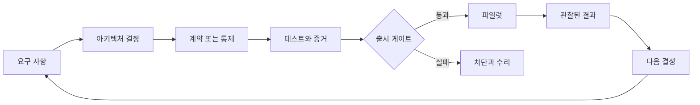

> 🇰🇷 이 문서는 한국어 번역본입니다(ELI5 스타일). 원문: [en.md](en.md)

# Architect Professional 시스템 캡스톤

> 프로덕션 아키텍처를 방어할 수 있게 만들어 주는 증거 패킷을 만듭니다.

**유형:** 빌드
**언어:** Python
**선수 지식:** [일을 떠안을 수 있는 가장 작은 접점을 고르세요](../../01-claude-product-and-model-landscape/), [실패 비용이 큰 곳에 능력을 쓰세요](../../02-model-selection-and-token-economics/), [요청을 검증 가능한 계약으로 바꾸기](../../03-prompting-and-task-decomposition/), [모든 사실을 알맞은 종류의 컨텍스트에 넣기](../../04-context-knowledge-memory-and-caching/), [자신감이 아니라 주장을 검증하기](../../05-output-evaluation-and-validation/), [능력 주위에 권한을 두기](../../06-governance-safety-and-responsible-use/), [Messages API는 상태 기계입니다](../../08-messages-api-and-application-lifecycle/), [구조화된 출력은 신뢰할 수 없는 계약입니다](../../09-structured-output-and-defensive-parsing/), [도구 루프는 통제된 위임입니다](../../10-tool-use-and-agentic-loops/), [MCP는 기능을 호스트로부터 분리합니다](../../11-mcp-server-design-and-integration/), [Agent SDK는 하네스이지 권한이 아닙니다](../../12-claude-agent-sdk-and-hooks/), [보안은 프롬프트 바깥에 있습니다](../../13-application-security-and-secrets/), [평가(eval)는 에이전트 행동을 엔지니어링 증거로 바꿉니다](../../14-evals-testing-debugging-and-observability/), [Claude Code는 공유된 제약으로 확장됩니다](../../15-claude-code-for-development-teams/), [멀티 에이전트 오케스트레이션과 위임](../../16-multi-agent-orchestration-and-delegation/), [도구 계약, 오류, 점진적 탐색](../../18-tool-contracts-errors-and-progressive-discovery/), [비즈니스 디스커버리, 요구사항, SLA](../../22-business-discovery-requirements-and-slas/), [엔드투엔드 아키텍처와 가치 트레이드오프](../../23-end-to-end-architecture-and-value-tradeoffs/), [RAG, 검색, 데이터 파이프라인](../../24-rag-retrieval-and-data-pipelines/), [통합 프로토콜, 신원, 최소 권한](../../25-integration-protocols-identity-and-least-privilege/), [프로덕션 관측 가능성, 지연 시간, 비용](../../26-production-observability-latency-and-cost/), [엔터프라이즈 거버넌스, 컴플라이언스, 사람의 검토](../../27-enterprise-governance-compliance-and-hitl/), [이해관계자 커뮤니케이션, ADR, 라이프사이클 담당](../../28-stakeholder-communication-adrs-and-lifecycle/)
**소요 시간:** 약 8~12시간

## 학습 목표

- 프로덕션 Claude 시스템을 위한 디스커버리부터 운영까지의 아키텍처를 납품한다.
- 패턴, 모델, 컨텍스트, RAG, 통합, 통제 결정을 방어한다.
- 품질, 지연 시간, 비용, 안전, 보안을 명시적인 게이트로 증명한다.
- 거버넌스, 롤아웃, 런북, 라이프사이클 담당 체계를 꾸린다.
- 같은 결정을 임원, 엔지니어링, 통제, 운영 대상자에게 각각 맞게 전달한다.

## 임무

여러 지역에서 사업하는 회사를 위한, 거버넌스가 적용된 엔터프라이즈 지원-해결
시스템을 설계합니다.

현재 팀은 주당 4만 건의 티켓을 처리합니다. 결제와 배송 문의가 대부분을
차지합니다. 첫 응답 시간의 중앙값은 11분입니다. 정책 변경은 매주 문서와 내부
시스템을 타고 들어옵니다. 검토 결과 인용이 일관되지 않으며, 이전의 자동화는
직원 권한을 넘어 환불을 집행한 적이 있습니다.

제안하는 시스템은 티켓을 분류하고, 최신 정책을 검색하고, 범위가 정해진 계정
컨텍스트를 읽고, 답변 초안을 쓰고, 조치를 추천할 수 있습니다. 계정을 삭제해서는
안 됩니다. 환불 실행에는 명시적인 권한과 방금 이루어진 사람의 승인이 필요합니다.
회사는 단계적 롤아웃, 측정 가능한 품질, 지역을 고려한 데이터 처리, 지원 플랫폼
팀에 대한 운영 인수인계를 기대합니다.

자율성을 극대화하라는 요구가 아닙니다. 제약 안에서 최선의 시스템을 설계하고,
왜 출시 준비가 됐는지 증명하라는 요구입니다.

## 필수 산출물

`outputs/architecture-packet-template.md`의 템플릿을 사용하세요. 패킷에는 서로
연결된 열 개의 산출물이 담겨야 합니다.

### 1. 디스커버리 브리프

성과 결과, 베이스라인, 목표, 가드레일, 사용자, 현재 워크플로, 데이터, 권한, 가정,
논골을 정의합니다.

최소한 다음을 구분해야 합니다:

- 첫 응답 시간과 전체 해결 시간
- 시스템의 작업 완료와 정책에 맞는 과제 성공
- 추천과 실행 권한
- 내부 목표와 계약상 약속
- 알려진 사실과 추정치

### 2. 아키텍처 옵션과 ADR

최소한 다음을 비교합니다:

1. 전체 사람 검토가 붙은 검색 보조 초안 작성
2. 범위가 정해진 모델 단계를 둔 결정론적 워크플로
3. 적응형 도구 사용 에이전트

하나를 선택합니다. 근거, 결과, 기각한 대안, 번복 조건을 기록하세요. 여러
에이전트를 쓴다면 각 컨텍스트 경계나 독립 검토자의 근거를 대세요. 구성 요소가
많다고 점수가 더 주어지지 않습니다.

### 3. 엔드투엔드 시스템 뷰

다음 항목의 Mermaid 다이어그램을 만듭니다:

- 시스템 컨텍스트
- 데이터와 신원 흐름
- 정상 티켓 시퀀스 하나
- 고위험 환불 시퀀스 하나
- 배포와 담당 체계
- 실패와 부분 결과 경로

모든 외부 엣지에는 스키마, 신원, 타임아웃, 재시도, 증거, 담당자가 명시되어야
합니다.

### 4. 모델, 프롬프트, 컨텍스트 계획

작업 클래스와 각 클래스의 모델 선택 기준을 정의합니다. 품질, 지연 시간, 비용,
컨텍스트, 사고(thinking) 요구 사항을 담습니다. 검증 날짜 없이 제품 사실을
확정하지 마세요.

다음을 설계합니다:

- 시스템·사용자 지시 경계
- 판단 일관성이 필요한 곳의 few-shot 예시
- 안정적인 접두사와 프롬프트 캐싱 계획
- 컨텍스트 정리(pruning)와 압축(compaction)
- 구조화된 출력과 의미 검증
- 프롬프트와 모델 버전 관리

### 5. 지식과 RAG 설계

출처 담당 체계, 파싱, 청크 형태, 메타데이터, 희소 또는 밀집(sparse/dense) 검색,
필터, 재순위화(reranking), 컨텍스트 조립, 출처, 출처 충돌, 신선도, 버전 활성화,
롤백을 명시합니다.

정상, 모호, 오래됨, 무단, 공격(어버서리얼) 케이스를 담은 검색 평가를 만듭니다.
검색은 답변 품질과 따로 측정합니다.

### 6. 통합과 신원 설계

요구 사항에 따라 직접 API, CLI, MCP, 에이전트 간 경계를 고릅니다. 도구 탐색,
스키마, 자격 증명, 행동 전반에 최소 권한을 적용합니다.

환불에 대한 신선한 승인을 설계합니다. 승인을 주체(principal), 금액, 계정, 사유,
만료, 일회용 사용에 묶습니다. 검증, 권한 부여, 충돌, 속도 제한, 의존성,
타임아웃에 대한 구조화된 오류를 정의합니다.

### 7. 평가와 프로덕션 증거

대표성 있는 골든 셋(golden set)과 혼합 방법 평가 계획을 만듭니다.

다음을 포함합니다:

- 검색 재현율과 신선도
- 주장 뒷받침과 인용 커버리지
- 정책 준수와 완전성
- 도구와 권한 부여 궤적
- 안전하지 않은 행동 방지
- P50과 P95 지연 시간
- 수락된 과제당 비용
- 검토자 일치도와 소요 시간
- 고위험 및 지역·언어 계층

베이스라인과 제안 시스템을 비교합니다. 평균으로 덮어 살릴 수 없는 경질(hard)
게이트를 정의합니다.

### 8. 거버넌스와 사람 검토

위험 등록부, 데이터 지도, 통제 매트릭스, 검토 설계, 공정성 계획, 이의 제기
경로, 사고 증거 계획, 중대 변경 계기(trigger)를 만듭니다.

어떤 질문에 보안, 프라이버시, 법무, 컴플라이언스, 재무, 도메인 승인이 필요한지
밝힙니다. 해당 담당자를 대신해 법적 컴플라이언스를 주장하지 마세요.

### 9. 롤아웃과 운영

섀도우(shadow), 카나리(canary), 보호 확대, 롤백, 대시보드, 알림, 런북, 용량,
의존성 실패, 검토자 대기열 동작을 계획합니다.

각 알림에는 담당자와 행동 방침이 필요합니다. 각 프로덕션 버전에는 알려진 안전
상태로 되돌리는 롤백이 필요합니다. 오래된 정책, 권한 부여 중단, 티켓을 통한
프롬프트 주입, 평가자 표류(drift)에 대해 테이블톱 훈련을 실행합니다.

### 10. 이해관계자 및 인수인계 꾸러미

다음을 준비합니다:

- 한 페이지짜리 임원 결정 브리프
- 제품 워크플로와 도입 계획
- 엔지니어링 계약 색인
- 보안·프라이버시 통제 요약
- 운영 준비성과 인수인계 체크리스트

인수 팀은 수락 전에 모니터링, 안전한 종료, 롤백, 평가, 사고 에스컬레이션을
시연해야 합니다.

## 아키텍처 방법

패킷 전체에서 하나의 증거 사슬을 사용합니다.



구성 요소가 요구 사항으로 거슬러 올라가지 못하면 꼭 필요한지 물어보세요. 요구
사항에 통제나 테스트가 없다면 아키텍처가 불완전한 것입니다. 테스트가 출시에 아무
영향을 주지 않는다면 그것은 그저 보고서일 뿐입니다.

## 직접 만들기

## 인터랙티브 랩

```figure
32-architect-professional-readiness
```

프로페셔널 준비성 보드에서 요구 사항을 결정, 통제, 증거, 출시 게이트, 파일럿
결과, 라이프사이클 담당자와 연결하세요. 권한 부여, 안전, 롤백의 경질(hard)
실패는 가중 준비성 점수와 무관하게 그대로 드러납니다.

## 실습 랩

지원 아키텍처에 실패한 요구 사항, 검증되지 않은 경질 통제, 실패한 평가 게이트,
롤백 훈련을 하나씩 통과시키면서, 각 문제를 담당자 경계에서 수리합니다.

## 완성 산출물

패킷 템플릿, 완성한
[`outputs/reference-architecture-packet.md`](../outputs/reference-architecture-packet.md),
작성을 마친 [`outputs/demo-readiness-report.json`](../outputs/demo-readiness-report.json),
그리고 [`outputs/scored-rubric.md`](../outputs/scored-rubric.md)가 실질적인
산출물입니다. 채점된 참조 아키텍처는 명시된 실전 경질 게이트와 인수인계 증거가
통과할 때까지 프로덕션용으로는 차단 상태를 유지합니다.

## 검증하기

Python 랩은 아키텍처 패킷의 구조를 검증합니다. 비즈니스 결정이 옳은지는 판단하지
않습니다. 더 기초적인 실패 부류를 잡아 냅니다: 담당자 누락, 측정 불가능한 요구
사항, 검증되지 않은 경질 통제, 실패한 평가 게이트, 없는 롤백, 번복 규칙이 없는
결정.

```bash
cd certifications/claude/lessons/32-architect-professional-system-capstone/code
python3 main.py
python3 -m unittest discover tests -v
```

### 단계 1: 요구 사항 옮겨 담기

각 `Requirement`에는 카테고리, 검증 가능한 진술, 측정 가능성 표시, 담당자가
있습니다. 여러분의 패킷에서는 이 표시를 명시적인 측정 계약으로 바꾸세요.

### 단계 2: 결정 옮겨 담기

각 `Decision`은 컨텍스트, 선택, 기각한 옵션, 결과, 번복 조건, 담당자를 기록합니다.
대안이 없는 추천은 트레이드오프 판단을 증명할 수 없습니다.

### 단계 3: 통제 옮겨 담기

각 `Control`은 위험, 종류, 담당자, 증거, 검증 상태, 그리고 경질 출시 게이트인지
여부를 명명합니다. 경질 게이트가 실패하면 평균 준비성과 무관하게 출시가
차단됩니다.

### 단계 4: 게이트 평가하기

`EvaluationGate`는 최소, 최대, 동일 임계값을 지원합니다. 품질, 지연 시간, 비용,
무관용(zero-tolerance) 통제 결과에 사용하세요. 실제 게이트에는 신뢰 구간, 표본
요구 사항, 구간(segment) 커버리지도 필요합니다.

### 단계 5: 출시 결정 내리기

`release_decision`은 모든 지적 사항과 차단 개수를 반환합니다. 논골 누락은
보고되지만 이 장난감 구현에서는 차단하지 않습니다. 여러분의 검토 위원회가 이를
게이트로 만들 수도 있습니다.

위 명령으로 보고서를 재현하고 모든 결정론적 게이트를 실행하세요. 여섯 문제짜리
퀴즈는 개인의 아키텍처 판단을 점검합니다.

## 캡스톤 연계

완성된 열 개 산출물 패킷, 방어, 훈련, 수락된 인수인계가 Architect Professional
캡스톤 제출물이 됩니다.

## 아키텍처 방어

20분 안에 패킷을 발표하고 다음 질문에 답합니다:

1. 이 패턴이 가장 강력했던 기각 대안보다 더 단순한 이유는?
2. 어떤 요구 사항이 모든 모델·에이전트 호출을 정당하는가?
3. 검색이 불충분하거나 충돌하는 증거를 돌려주면 어떻게 되는가?
4. 어떤 신원이 각 도구에 닿으며 권한은 어떻게 검사되는가?
5. 어떤 증거가 출시를 막는가?
6. 더 저렴한 변형이 성공한 결과당 비용이 더 저렴하다는 것을 어떻게 아는가?
7. 검토자는 무엇을 보고, 결정하고, 에스컬레이션할 수 있는가?
8. 배포 전에 재검증이 필요한 제품 세부 사항은 무엇인가?
9. 모든 출처, 통제, 지표, 알림, 사고의 담당자는 누구인가?
10. 어떤 증거가 나오면 아키텍처 결정을 번복하겠는가?

답은 산출물과 증거를 참조해야 합니다. "모델이 유능하다"는 방어가 아닙니다.

## 채점 루브릭

| 영역 | 가중치 | 숙련의 증거 |
|------|-------:|---------------------|
| 솔루션 설계 | 17 | 옵션이 요구 사항에 맞다; 분해와 피드백이 명시적이다 |
| 모델, 프롬프트, 컨텍스트 | 13 | 선택과 재사용이 측정된 트레이드오프를 따른다 |
| 통합 | 19 | RAG, 프로토콜, 신원, 최소 권한이 일관되게 맞물린다 |
| 평가와 최적화 | 16 | 대표적인 테스트와 운영 신호가 출시를 주도한다 |
| 거버넌스와 위험 | 14 | 데이터, 통제, 검토, 공정성, 승인에 담당자가 있다 |
| 이해관계자 라이프사이클 | 14 | 결정이 전달, 도입, 인수인계, 변경으로 이어진다 |
| 개발자 운영 | 7 | 팀 구성, 디버깅, 런북, 담당 체계가 바로 쓸 수 있다 |

이 루브릭은 자기 검토와 독립 검토에 사용하세요. 커리큘럼 도구이지 공식 시험
채점 모델이 아닙니다.

## 시험 결정 패턴

Professional 시험은 라이프사이클 판단을 높이 칩니다. 여러 옵션이 그럴듯하게
들릴 때는, 제시된 제약을 올바른 시스템 경계에서 다루면서 다른 담당자가 검증할 수
있는 증거를 만들어 내는 옵션을 고르세요.

구조적 우선순위:

- 자동화 전에 명확히
- 보호 전에 최소화
- 생성 전에 검색과 필터링
- 실행 시점에 권한 부여
- 구문만이 아니라 의미적 주장을 검증
- 전체 궤적과 최종 상태를 평가
- 경질 통제에서는 차단
- 점진적으로 롤아웃
- 변경과 은퇴(retirement)까지 담당자를 지정

## 흔한 캡스톤 실패

### 결정 없는 매끈한 다이어그램

요구 사항, 대안, 결과, 번복 조건을 추가하세요.

### 증거 없는 긴 통제 목록

모든 통제에 담당자, 테스트, 결과, 실패 대응, 검토 계기를 주세요.

### 잘 풀리는 경로뿐인 평가

모호함, 오래된 데이터, 충돌하는 출처, 프롬프트 주입, 권한 부여 실패, 도구
타임아웃, 고위험 조각, 검토자 과부하를 추가하세요.

### 처리 용량 없는 사람 검토 대기열

처리량, 시간, 자격 요건, SLO, 폴백, 에스컬레이션을 추정하세요.

### 복구 증명 없는 인수인계

훈련을 실행하세요. 운영 팀이 아키텍트가 모든 단계를 읊어 주지 않아도 알려진 안전
상태로 복원할 수 있어야 합니다.

## 연습 문제

1. 지원 시나리오를 규제 대상 문서 분석 워크플로로 바꾸고, 어떤 통제와 담당자가
   달라지는지 찾아 본다.
2. `EvaluationGate`에 통계적 신뢰도와 최소 표본 크기를 추가한다.
3. 권한 부여와 오래된 출처 통제를 기계 판독 가능한 패킷에서 경질 게이트로
   만든다.
4. 독립 검토자에게 테스트나 담당자가 없는 요구 사항 다섯 개를 찾게 한다.
5. 시뮬레이션된 카나리 회귀 이후 실제 번복 결정을 기록한다.

## 핵심 용어

| 용어 | 사람들이 말하는 것 | 실제 의미 |
|------|-----------------|------------------------|
| 아키텍처 패킷 | 긴 설계 문서 | 서로 연결된 결정, 계약, 증거, 통제, 담당 체계, 복구 |
| 경질 게이트 | 가중치 높은 지표 | 평균과 무관하게 출시를 막는 조건 |
| 준비성 | 코드 완성 | 요구 사항을 충족하고 실패를 안전하게 운영할 수 있음을 입증한 상태 |
| 아키텍처 방어 | 발표 기술 | 선택, 결과, 기각한 대안을 증거로 설명하는 것 |
| 운영 담당자 | 배포 팀 | SLO, 사고, 변경, 은퇴까지 책임지는 역할 |

## 더 읽을거리

- [Claude Certified Architect Professional 시험 가이드](https://everpath-course-content.s3-accelerate.amazonaws.com/instructor%2F6nizmqk8tpzpfjvt6qmmav7rh%2Fpublic%2F1783542810%2FClaude+Certified+Architect+%E2%80%93+Professional+Exam+Guide.pdf)
- [Claude 플랫폼 문서](https://platform.claude.com/docs/en/home)
- [Building effective agents](https://www.anthropic.com/research/building-effective-agents)
- Architect Professional 루트의 모든 레슨
