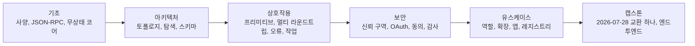

> 🇰🇷 이 문서는 한국어 번역본입니다(ELI5 스타일). 원문: [README.md](README.md)

# MCPA 자격증 커리큘럼

> 시험이 묘사하는 프로토콜을 직접 만들면서, 시험이 측정하는 판단력을 배웁니다.

**상태:** 로컬 미리 보기
**가이드 버전:** 1.0
**가이드 시행일:** 2026년 9월
**마지막 검증일:** 2026-09-24

이 무료 커리큘럼은 Agentic AI Foundation이 Linux Foundation Training and
Certification을 통해 시행하는 Model Context Protocol Associate(MCPA) 시험을
준비시켜 줍니다:

| 시험 | 자격증명 | 수준 | 시간 | 응시료 | 핵심 루트 |
|------|------------|-------|------|-----|-----------:|
| MCPA | Model Context Protocol Associate | 초급 | 90분 | $250 | 34개 레슨 |

시험은 온라인 감독관 방식의 선다형이며, 2026-07-28자 Model Context Protocol
사양에 맞춰져 있고, 2년간 유효하며, 재응시 1회가 포함되고 응시 자격 윈도우는
12개월입니다. 공식 문항 수와 합격 점수는 공개되지 않으므로, 이 커리큘럼의
60문항 모의고사 세 개는 독창적인 연습 세트일 뿐 공식 길이가 아니며, 연습
백분율로 공식 결과를 예측할 수 없습니다. MCPA 페이지는 90분으로 안내하고, 출시
발표는 120분이라 했습니다. 프로그램 세부 사항은 바뀔 수 있으니 예약 전에 현재
가격, 형식, 시험 시간, 응시 자격을 공식 페이지에서 확인하세요. 모든 시험 사실과
그 확인 날짜는
[research/source-verification-ledger.md](research/source-verification-ledger.md)에
기록되어 있습니다.

## AI 튜터와 함께 GitHub에서 배우기

이 커리큘럼은 AI 네이티브입니다. Claude Code, Codex, ChatGPT, Cursor 또는 다른
에이전트가 루트를 가르치고, 저장소에 들어 있는 랩을 실행하고, 여러분이 만든
산출물을 검토하고, 레슨 퀴즈를 시행하고, 저장된 진행 상황부터 이어 갈 수
있습니다.

[GitHub 학습자 가이드](GETTING_STARTED.md)로 시작하거나,
[../../skills/mcpa-certification/SKILL.md](../../skills/mcpa-certification/SKILL.md)의
휴대 가능한 자격증 튜터 스킬을 설치하세요:

```bash
npx skills add rohitg00/ai-engineering-from-scratch
```

그런 다음 에이전트에게 다음 실행을 요청하세요:

```text
/mcpa-certification
```

저장소를 복제하면 로컬 Claude Code 세션이 `.claude/skills/`에서 같은 스킬을
발견합니다. 슬래시 커맨드를 지원하지 않는 하네스는 `GETTING_STARTED.md`와 튜터
스킬을 직접 읽을 수 있습니다. 학습자 진행 상황은 `MCPA-CERTIFICATION.md`에,
학습자 작업물은 `learning-artifacts/mcpa/` 아래에 둡니다. 저장소에 들어 있는
`outputs/` 파일은 참조 산출물로 남으며 절대 덮어쓰지 않습니다. 이 커리큘럼은
EPUB/PDF 북(book) 워크플로 바깥에 있으며 책으로 변환되지 않습니다.

## 여러분이 만드는 것

첫 원리부터 쌓아 올려 동작하는 MCP 교환 하나를 조립하는 단 하나의 루트:



각 레슨에는 실행 가능한 표준 라이브러리 MCP 모의 객체, 테스트 스위트, 레슨
퀴즈, 재사용 가능한 산출물이 실립니다. 모든 레슨은 무상태 2026-07-28 리비전을
현재 사양으로 가르치며, `scripts/check_mcpa_wire.py`가 각 랩의 대화 전사가 그
와이어 형식을 갖췄는지 검사합니다. 프로토콜 사실과 1차 출처, 그리고 작성하며
해소한 출처 충돌은
[research/mcp-2026-07-28-brief.md](research/mcp-2026-07-28-brief.md)에
있습니다. 루트에는 30문항 진단과 서로 강조점이 다른 완전 길이 독창 모의고사 세
개가 포함되며, 이들의 문항 구성은 실용적인 반올림 범위 안에서 공개된
블루프린트 가중치를 따릅니다. 실제 시험 문항을 흉내 내거나 재현하지 않습니다.

MCPA 블루프린트에는 다섯 도메인이 있습니다:

| 도메인 | 가중치 |
|--------|-------:|
| MCP 기초 | 16% |
| 아키텍처와 구성 요소 | 14% |
| 상호작용과 실행 | 26% |
| 보안과 거버넌스 | 24% |
| 유스케이스와 생태계 | 20% |

## GitHub 레슨 색인

튜터는 루트 순서를 트랙 파일에서 읽습니다. 이 완전한 색인은 모든 레슨을
GitHub에서 바로 둘러볼 수 있게 해 줍니다.

| # | 레슨 |
|---:|--------|
| 00 | [MCPA 블루프린트는 체크리스트가 아니라 학습 예산이다](lessons/00-mcp-exam-strategy/) |
| 01 | [MCP 사양 읽기](lessons/01-reading-the-specification/) |
| 02 | [MCP가 푸는 통합 문제](lessons/02-the-integration-problem/) |
| 03 | [JSON-RPC 봉투(엔벨로프)](lessons/03-json-rpc-and-meta/) |
| 04 | [MCP의 무상태 코어](lessons/04-the-stateless-core/) |
| 05 | [최신 MCP 서버와 구식 서버 구별하기](lessons/05-protocol-eras-and-compatibility/) |
| 06 | [호스트, 클라이언트, 서버: MCP의 프로세스 토폴로지](lessons/06-hosts-clients-and-servers/) |
| 07 | [서버를 발견하고 할 수 있는 일 협상하기](lessons/07-discovery-and-capability-negotiation/) |
| 08 | [도구 정의 안의 계약](lessons/08-tool-schemas-and-structured-content/) |
| 09 | [검토자처럼 서버 매니페스트 읽기](lessons/09-reading-server-manifests/) |
| 10 | [모델 상호작용 흐름](lessons/10-model-interaction-flow/) |
| 11 | [도구 프리미티브: 행동 호출과 결과 읽기](lessons/11-the-tools-primitive/) |
| 12 | [리소스: 무상태 서버를 위한 주소 지정 가능한 콘텐츠](lessons/12-the-resources-primitive/) |
| 13 | [프롬프트 템플릿과 인자 완성](lessons/13-prompts-and-completion/) |
| 14 | [멀티 라운드트립 요청과 일루시테이션](lessons/14-multi-round-trip-requests-and-elicitation/) |
| 15 | [폐기됐지만 사라지지 않은 것: 루트, 샘플링, 로깅](lessons/15-deprecated-client-features/) |
| 16 | [구독 스트림: 알림, 진행 상황, 취소](lessons/16-notifications-and-subscriptions/) |
| 17 | [도구 호출 라이프사이클](lessons/17-tool-invocation-lifecycle/) |
| 18 | [요청이 실패하는 두 가지 길](lessons/18-error-handling/) |
| 19 | [전송과 HTTP 헤더 계약](lessons/19-transports-and-http-headers/) |
| 20 | [캐시 신선도와 커서 기반 페이지네이션](lessons/20-caching-and-pagination/) |
| 21 | [장기 작업과 Tasks 확장](lessons/21-long-running-work-and-tasks/) |
| 22 | [MCP 교환의 신뢰 구역](lessons/22-trust-boundaries/) |
| 23 | [MCP 서버 접근 권한 부여](lessons/23-oauth-authorization/) |
| 24 | [권한 서버에 클라이언트 신원 증명하기](lessons/24-client-registration-and-identity/) |
| 25 | [동의와 최소 권한](lessons/25-consent-and-least-privilege/) |
| 26 | [MCP 도구 호출의 위험·안전 통제](lessons/26-risk-and-safety-controls/) |
| 27 | [하나의 추적 ID가 감사 가능성과 관측 가능성을 묶는다](lessons/27-auditability-and-observability/) |
| 28 | [모든 MUST에는 담당자가 필요하다](lessons/28-roles-and-adoption/) |
| 29 | [일에 맞는 MCP 형태 고르기](lessons/29-operational-use-cases/) |
| 30 | [확장 프레임워크](lessons/30-the-extensions-framework/) |
| 31 | [대화 안의 인터랙티브 인터페이스](lessons/31-mcp-apps/) |
| 32 | [서버를 찾고, 라우팅하고, 신뢰하기](lessons/32-registry-gateways-and-sdk-tiers/) |
| 33 | [하나의 MCP 교환을 엔드투엔드로 읽기](lessons/33-mcpa-capstone-readiness/) |

## 제휴 없음

이것은 독립적인 커뮤니티 커리큘럼입니다. Agentic AI Foundation이나 Linux
Foundation과 제휴하거나, 승인받거나, 후원받거나, 허가받은 바 없습니다. 실제
시험 문항을 담고 있지 않습니다. 공식 시험 페이지와 현재 프로그램 정책이 언제나
우선합니다.
