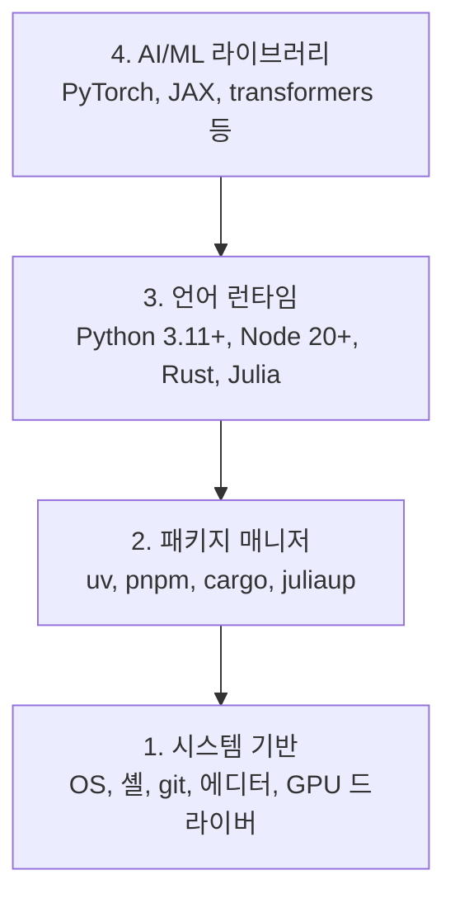

> 🇰🇷 이 문서는 한국어 번역본입니다(ELI5 스타일). 원문: [en.md](en.md)

# 개발 환경 (Dev Environment)

> 도구가 생각의 방식을 결정합니다. 한 번만, 제대로 세팅하세요.

**유형:** Build
**언어:** Python, Node.js, Rust
**선수 지식:** 없음
**소요 시간:** 약 45분

## 학습 목표

- Python 3.11+, Node.js 20+, Rust 툴체인을 처음부터 직접 설치하기
- 재현 가능한 빌드를 위해 가상 환경과 패키지 매니저 설정하기
- CUDA/MPS로 GPU 접근을 확인하고 테스트 텐서 연산 실행해 보기
- 시스템, 패키지, 런타임, AI 라이브러리의 4계층 스택 이해하기

## 문제 상황

여러분은 앞으로 Python, TypeScript, Rust, Julia를 사용해 500개가 넘는 레슨으로 AI 엔지니어링을 배우게 됩니다. 환경이 엉망이라면 모든 레슨이 공부가 아니라 도구와의 싸움이 되어버립니다.

대부분의 사람은 환경 설정을 건너뜁니다. 그리고 나서 import 오류, 버전 충돌, 사라진 CUDA 드라이버를 잡느라 몇 시간을 허비하죠. 우리는 이 작업을 딱 한 번, 제대로 해 두겠습니다.

## 개념

AI 엔지니어링 환경은 네 개의 층으로 이루어져 있습니다:



아래층부터 차례로 설치합니다. 각 층은 바로 아래층에 의존하기 때문입니다.

```figure
s0-env-stack
```

## 직접 만들어 보기

### 단계 1: 시스템 기반

시스템을 점검하고 기본 도구를 설치합니다.

```bash
# macOS
xcode-select --install
brew install git curl wget

# Ubuntu/Debian
sudo apt update && sudo apt install -y build-essential git curl wget unzip

# Windows (WSL2 사용)
wsl --install -d Ubuntu-24.04
```

### 단계 2: uv로 Python 설치

우리는 `uv`를 사용합니다 — pip보다 10~100배 빠르고 가상 환경도 자동으로 관리해 줍니다.

```bash
curl -LsSf https://astral.sh/uv/install.sh | sh

uv python install 3.12

uv venv
source .venv/bin/activate  # Windows에서는 .venv\Scripts\activate

uv pip install numpy matplotlib jupyter
```

확인해 보기:

```python
import sys
print(f"Python {sys.version}")

import numpy as np
print(f"NumPy {np.__version__}")
a = np.array([1, 2, 3])
print(f"Vector: {a}, dot product with itself: {np.dot(a, a)}")
```

### 단계 3: pnpm으로 Node.js 설치

TypeScript 레슨(에이전트, MCP 서버, 웹 앱)에서 사용합니다.

```bash
curl -fsSL https://fnm.vercel.app/install | bash
fnm install 22
fnm use 22

npm install -g pnpm

node -e "console.log('Node', process.version)"
```

fnm 설치 스크립트는 먼저 `unzip`이 있는지 확인하고, 없으면 `Not installing fnm due to missing dependencies.`라는 메시지와 함께 종료합니다. Linux에서는 zip 압축 파일을 풀 때 unzip이 필요하고, macOS에서는 Homebrew로 설치합니다. macOS에는 `unzip`이 기본 탑재되어 있고, Ubuntu·Debian·WSL2는 단계 1의 apt 명령으로 설치할 수 있습니다(그 단계를 건너뛰었다면 `sudo apt install -y unzip`을 실행하세요).

**macOS / Apple 실리콘 (M1/M2/M3/M4):** 설치 중 `Error: Cannot install under Rosetta 2 in ARM default prefix (/opt/homebrew)`라는 오류로 멈춘다면, 터미널이 Rosetta 2로 실행 중인데(`arch`를 입력하면 `i386`이 출력됨) Homebrew는 네이티브 arm64 빌드라는 뜻입니다. fnm을 arm64로 강제해 설치하고 셸에 연결한 뒤, `fnm install 22`부터 위 명령어를 다시 실행하세요:

```bash
arch -arm64 brew install fnm
echo 'eval "$(fnm env --use-on-cd)"' >> ~/.zshrc
source ~/.zshrc
```

### 단계 4: Rust

성능이 중요한 레슨(추론, 시스템)에서 사용합니다.

```bash
curl --proto '=https' --tlsv1.2 -sSf https://sh.rustup.rs | sh

rustc --version
cargo --version
```

### 단계 5: Julia (선택)

Julia가 진가를 발휘하는 수학 위주의 레슨에서 사용합니다.

```bash
curl -fsSL https://install.julialang.org | sh

julia -e 'println("Julia ", VERSION)'
```

### 단계 6: GPU 설정 (GPU가 있다면)

**NVIDIA (Linux / Windows):**

```bash
nvidia-smi

# CUDA 지원 PyTorch 설치
uv pip install torch torchvision torchaudio --index-url https://download.pytorch.org/whl/cu124
```

**macOS / Apple 실리콘 (M1/M2/M3/M4):** Mac에는 CUDA가 없습니다 — 이건 정상이지 실패가 아닙니다. 절대 `--index-url .../cuXXX`를 붙이지 마세요(이 휠은 Linux/Windows 전용이라 설치에 실패합니다). 그냥 기본 빌드를 설치하면 Apple의 MPS(Metal) GPU 백엔드가 포함됩니다:

```bash
uv pip install torch torchvision torchaudio
```

확인 (어떤 플랫폼에서든 동작):

```python
import torch
print(f"CUDA available: {torch.cuda.is_available()}")           # macOS에서는 False — 정상
print(f"MPS available:  {torch.backends.mps.is_available()}")   # Apple 실리콘에서는 True
if torch.cuda.is_available():
    print(f"GPU: {torch.cuda.get_device_name(0)}")
```

GPU가 없어도 문제없습니다. 대부분의 레슨은 CPU에서도 동작합니다. 학습(훈련)이 많은 레슨은 Google Colab이나 클라우드 GPU를 사용하세요.

### 단계 7: 시작하려는 루트 검증하기

이 레슨의 모든 명령어는 저장소 루트, 즉 `README.md`와 `phases/` 폴더가
있는 디렉터리에서 실행하세요. 사전 점검(preflight)은 선택한 루트를 시작하는 데
필요한 것만 검사합니다. 이후 단계의 도구는 기본적으로 건너뛰기 때문에, 새
학습자는 경고의 벽 대신 명확한 답 하나를 보게 됩니다.

풀(beginner) 코스 시퀀스 시작:

```bash
python3 phases/00-setup-and-tooling/01-dev-environment/code/verify.py --route beginner
```

원하는 루트만 골라 검사할 수도 있습니다:

```bash
python3 phases/00-setup-and-tooling/01-dev-environment/code/verify.py --route ml-foundations
python3 phases/00-setup-and-tooling/01-dev-environment/code/verify.py --route llm-engineering
python3 phases/00-setup-and-tooling/01-dev-environment/code/verify.py --route agents
python3 phases/00-setup-and-tooling/01-dev-environment/code/verify.py --route mcp
python3 phases/00-setup-and-tooling/01-dev-environment/code/verify.py --route agent-skills
python3 phases/00-setup-and-tooling/01-dev-environment/code/verify.py --route certification
```

이후 레슨에서 쓰는 선택 도구와 의존성까지 같은 점검 스크립트로 살펴보려면
`--show-later`를 추가하세요. 이후 단계의 도구가 없어도 선택한 루트가 막히는
일은 없습니다.

필수 검사가 실패하면 감지된 경로나 import 오류, 그리고 정확한 수정 명령어가
함께 표시됩니다. Agent Skills 루트와 인증(certification) 루트는 수동 호스트
검사도 함께 보여줍니다. AI 호스트가 스킬을 실제로 발견했는지, 선택한 스킬
스코프에 쓰기가 가능한지는 Python 스크립트가 증명할 수 없기 때문입니다.

beginner 사전 점검을 통과하면 바로 실행 가능한 첫 레슨을 정확히 알려줍니다:

```text
Ready to start Beginner course.
Next: python3 phases/01-math-foundations/01-linear-algebra-intuition/code/vectors.py
```

## 사용해 보기

환경 준비가 끝났으니 검증한 루트를 바로 시작할 수 있습니다. 이후 도구는 레슨이
필요하다고 할 때 설치하세요. 첫 레슨을 스택 전체 설치로 막아 둘 필요는
없습니다. 커리큘럼 전반에서 사용하는 도구는 다음과 같습니다:

| 언어 | 사용 페이즈 | 패키지 매니저 |
|----------|---------|-----------------|
| Python | 페이즈 1-12 (ML, DL, NLP, 비전, 오디오, LLM) | uv |
| TypeScript | 페이즈 13-17 (도구, 에이전트, 스웜, 인프라) | pnpm |
| Rust | 페이즈 12, 15-17 (성능 중요 시스템) | cargo |
| Julia | 페이즈 1 (수학 기초) | Pkg |

## 출시해 보기

이 레슨은 누구나 자신의 셋업을 검사할 수 있는 검증 스크립트를 산출물로 남깁니다.

AI 어시스턴트가 환경 문제를 진단하도록 돕는 프롬프트는 `outputs/prompt-env-check.md`를 참고하세요.

## 연습 문제

1. 검증 스크립트를 실행하고 실패 항목을 모두 고치기
2. 이 코스용 Python 가상 환경을 만들고 PyTorch 설치하기
3. 네 언어 모두로 "hello world"를 작성하고 각각 실행해 보기
