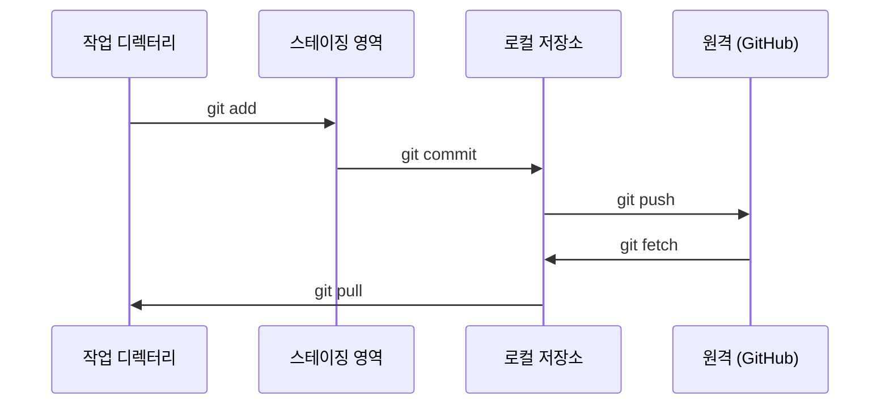

> 🇰🇷 이 문서는 한국어 번역본입니다(ELI5 스타일). 원문: [en.md](en.md)

# Git과 협업 (Git & Collaboration)

> 버전 관리는 선택 사항이 아닙니다. 여러분이 만드는 모든 실험, 모든 모델, 모든 레슨은 기록으로 남습니다.

**유형:** Learn
**언어:** --
**선수 지식:** 페이즈 0, 레슨 01
**소요 시간:** 약 30분

## 학습 목표

- git 신원(identity)을 설정하고 add, commit, push의 일상 워크플로 사용하기
- main을 건드리지 않고 고립된 실험을 위한 브랜치 만들고 병합하기
- 모델 체크포인트와 대용량 바이너리 파일을 제외하는 `.gitignore` 작성하기
- `git log`로 커밋 히스토리를 훑어보며 프로젝트의 변화 이해하기

## 문제 상황

여러분은 앞으로 20개 페이즈에 걸쳐 수백 개의 코드 파일을 작성하게 됩니다. 버전 관리가 없다면 작업을 잃어버리고, 되돌릴 수 없는 사고를 저지르고, 다른 사람과 협업할 방법도 없습니다.

그 도구가 Git입니다. GitHub은 코드가 살아가는 곳이고요. 이 레슨은 이 코스에 필요한 내용만 다룹니다. 그 이상도 이하도 아닙니다.

## 개념



기억할 세 가지:
1. 자주 저장하기 (`git commit`)
2. 원격에 밀어 올리기 (`git push`)
3. 실험은 브랜치에서 하기 (`git checkout -b experiment`)

```figure
s0-commit-dag
```

## 직접 만들어 보기

### 단계 1: git 설정

```bash
git config --global user.name "Your Name"
git config --global user.email "you@example.com"
```

### 단계 2: 일상 워크플로

```bash
git status
git add file.py
git commit -m "Add perceptron implementation"
git push origin main
```

### 단계 3: 실험을 위한 브랜치

```bash
git checkout -b experiment/new-optimizer

# ... 수정하고 커밋하기 ...

git checkout main
git merge experiment/new-optimizer
```

### 단계 4: 이 코스 저장소에서 작업하기

코스 저장소 자체에는 푸시할 수 없습니다 — 쓰기 권한은 관리자에게만 있습니다. 먼저 GitHub에서 포크하세요(오른쪽 위의 Fork 버튼). 그러면 `origin`이 여러분 자신의 복사본을 가리킵니다:

```bash
git clone https://github.com/YOUR-USERNAME/ai-engineering-from-scratch.git
cd ai-engineering-from-scratch

git checkout -b my-progress
# 레슨을 진행하며 코드를 커밋하기
git push origin my-progress
```

## 사용해 보기

이 코스에서 필요한 명령어는 정확히 아래와 같습니다:

| 명령어 | 사용 시점 |
|---------|------|
| `git clone` | 코스 저장소 가져오기 |
| `git add` + `git commit` | 작업 저장하기 |
| `git push` | GitHub에 백업하기 |
| `git checkout -b` | main을 망가뜨리지 않고 시도해 보기 |
| `git log --oneline` | 지금까지 한 일 보기 |

이게 전부입니다. 이 코스에서 rebase, cherry-pick, 서브모듈은 필요 없습니다.

## 연습 문제

1. 이 저장소를 포크하고, 포크를 클론한 뒤, `my-progress`라는 브랜치를 만들고, 파일을 하나 만들어 커밋하고 푸시하기
2. 모델 체크포인트 파일(`.pt`, `.pth`, `.safetensors`)을 제외하는 `.gitignore` 작성하기
3. `git log --oneline`으로 이 저장소의 커밋 히스토리를 살펴보고 레슨이 어떻게 추가되었는지 읽어 보기

## 핵심 용어

| 용어 | 사람들이 말하는 것 | 실제 의미 |
|------|----------------|----------------------|
| 커밋(Commit) | "저장" | 특정 시점의 프로젝트 전체 스냅샷 |
| 브랜치(Branch) | "복사본" | 작업하면서 앞으로 움직이는, 커밋을 가리키는 포인터 |
| 병합(Merge) | "코드 합치기" | 한 브랜치의 변경 사항을 다른 브랜치에 적용하는 것 |
| 원격(Remote) | "클라우드" | 여러분의 저장소를 다른 곳(GitHub, GitLab)에 올려 둔 복사본 |
