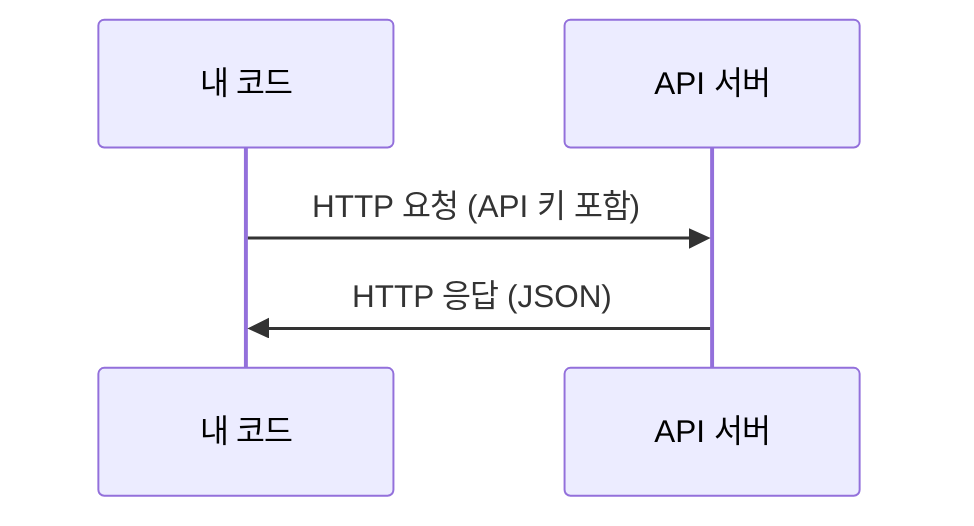

> 🇰🇷 이 문서는 한국어 번역본입니다(ELI5 스타일). 원문: [en.md](en.md)

# API와 키 (APIs & Keys)

> 모든 AI API는 똑같이 동작합니다: 요청을 보내면 응답이 돌아온다. 세부 사항은 바뀌어도 패턴은 변하지 않죠.

**유형:** Build
**언어:** Python, TypeScript
**선수 지식:** 페이즈 0, 레슨 01
**소요 시간:** 약 30분

## 학습 목표

- 환경 변수와 `.env` 파일로 API 키를 안전하게 보관하기
- Anthropic Python SDK와 순수 HTTP 두 가지 방식으로 LLM API 호출하기
- 디버깅을 위해 SDK 방식과 순수 HTTP 요청/응답 형식 비교하기
- 인증 오류, 요청 한도(rate limit) 등 흔한 API 오류를 식별하고 처리하기

## 문제 상황

페이즈 11부터는 LLM API(Anthropic, OpenAI, Google)를 호출하게 됩니다. 페이즈 13~16에서는 이 API들을 반복문 안에서 사용하는 에이전트를 만들죠. API 키가 어떻게 동작하는지, 안전하게 보관하는 방법, 그리고 첫 API 호출을 보내는 방법을 알아야 합니다.

## 개념



모든 API 호출에는 다음이 있습니다:
1. 엔드포인트 (URL)
2. API 키 (인증)
3. 요청 본문 (원하는 것)
4. 응답 본문 (돌아오는 것)

```figure
s0-secret-inject
```

## 직접 만들어 보기

### 단계 1: API 키를 안전하게 보관하기

API 키를 코드 안에 넣지 마세요. 환경 변수를 사용합니다.

```bash
export ANTHROPIC_API_KEY="sk-ant-..."
export OPENAI_API_KEY="sk-..."
```

`.env` 파일을 쓸 수도 있습니다(`.gitignore`에 추가할 것):

```
ANTHROPIC_API_KEY=sk-ant-...
OPENAI_API_KEY=sk-...
```

### 단계 2: 첫 API 호출 (Python)

```python
import os

import anthropic

client = anthropic.Anthropic()

MODEL = os.environ.get("LLM_MODEL", "claude-sonnet-5")

response = client.messages.create(
    model=MODEL,
    max_tokens=256,
    messages=[{"role": "user", "content": "What is a neural network in one sentence?"}]
)

print(response.content[0].text)
```

`LLM_MODEL`은 Anthropic 모델 id를 고르는 환경 변수이고, 기본값은 날짜가 붙지 않은 Sonnet 별칭입니다. 다른 프로바이더(OpenAI, Google 등)도 키에 모델 id를 더하는 같은 패턴을 따르지만, 각자 자체 SDK, 엔드포인트, 요청/응답 스키마를 가집니다.

### 단계 3: 첫 API 호출 (TypeScript)

```typescript
import Anthropic from "@anthropic-ai/sdk";

const client = new Anthropic();

const MODEL = process.env.LLM_MODEL ?? "claude-sonnet-5";

const response = await client.messages.create({
  model: MODEL,
  max_tokens: 256,
  messages: [{ role: "user", content: "What is a neural network in one sentence?" }],
});

console.log(response.content[0].text);
```

### 단계 4: 순수 HTTP (SDK 없이)

```python
import os
import urllib.request
import json

url = "https://api.anthropic.com/v1/messages"
headers = {
    "Content-Type": "application/json",
    "x-api-key": os.environ["ANTHROPIC_API_KEY"],
    "anthropic-version": "2023-06-01",
}
body = json.dumps({
    "model": os.environ.get("LLM_MODEL", "claude-sonnet-5"),
    "max_tokens": 256,
    "messages": [{"role": "user", "content": "What is a neural network in one sentence?"}],
}).encode()

req = urllib.request.Request(url, data=body, headers=headers, method="POST")
with urllib.request.urlopen(req) as resp:
    result = json.loads(resp.read())
    print(result["content"][0]["text"])
```

SDK가 내부에서 하는 일이 바로 이것입니다. 순수 HTTP 호출을 이해하고 있으면 디버깅할 때 큰 도움이 됩니다.

## 사용해 보기

이 코스에서는:

| API | 필요한 시점 | 무료 티어 |
|-----|-----------------|-----------|
| Anthropic (Claude) | 페이즈 11-16 (에이전트, 도구) | 가입 시 $5 크레딧 |
| OpenAI | 페이즈 11 (비교용) | 가입 시 $5 크레딧 |
| Hugging Face | 페이즈 4-10 (모델, 데이터셋) | 무료 |

지금 당장 전부 필요한 건 아닙니다. 레슨에서 요구할 때 설정하세요.

## 출시해 보기

이 레슨의 산출물:
- `outputs/prompt-api-troubleshooter.md` - 흔한 API 오류 진단하기

## 연습 문제

1. Anthropic API 키를 발급받고 첫 API 호출 보내기
2. 순수 HTTP 버전을 실행해 응답 형식을 SDK 버전과 비교하기
3. 일부러 잘못된 API 키를 써 보고 오류 메시지 읽어 보기

## 핵심 용어

| 용어 | 사람들이 말하는 것 | 실제 의미 |
|------|----------------|----------------------|
| API 키 | "API의 비밀번호" | 계정을 식별하고 요청을 승인하는 고유 문자열 |
| 요청 한도(Rate limit) | "속도를 묶어 둔 것" | 남용을 막고 공정한 사용을 보장하기 위한 분/시간당 최대 요청 수 |
| 토큰(Token) | "단어 하나" (API 맥락에서) | 과금 단위: 입력 토큰과 출력 토큰이 따로 집계되어 따로 청구된다 |
| 스트리밍(Streaming) | "실시간 응답" | 응답 전체를 기다리지 않고 단어 단위로 받는 것 |
