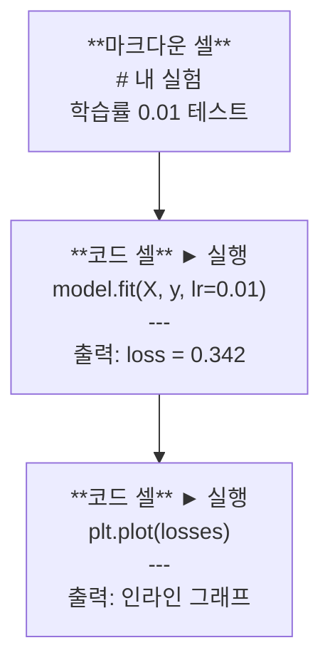
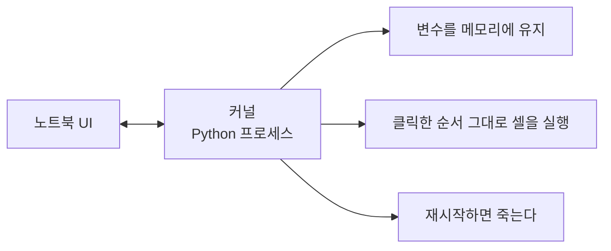

> 🇰🇷 이 문서는 한국어 번역본입니다(ELI5 스타일). 원문: [en.md](en.md)

# Jupyter 노트북 (Jupyter Notebooks)

> 노트북은 AI 엔지니어링의 실험대입니다. 여기서 시제품을 만들고, 잘 동작하는 것을 프로덕션(운영 환경)으로 옮기죠.

**유형:** Build
**언어:** Python
**선수 지식:** 페이즈 0, 레슨 01
**소요 시간:** 약 30분

## 학습 목표

- JupyterLab, Jupyter Notebook, 또는 Jupyter 확장이 설치된 VS Code 설치하고 실행하기
- 매직 명령어(`%timeit`, `%%time`, `%matplotlib inline`)로 벤치마크와 시각화를 노트북 안에서 처리하기
- 노트북과 스크립트의 사용 시점을 구분하고 "탐색은 노트북에서, 출시는 스크립트로" 워크플로 적용하기
- 흔한 노트북 함정 파악하고 피하기: 순서가 꼬인 실행, 숨은 상태, 메모리 누수

## 문제 상황

AI 관련 논문, 튜토리얼, Kaggle 대회 모두 Jupyter 노트북을 사용합니다. 노트북을 쓰면 코드를 조각조각 실행할 수 있고, 출력을 그 자리에서 볼 수 있고, 코드와 설명을 섞을 수 있고, 빠르게 반복 개선할 수 있습니다. 노트북 없이 AI를 배우려는 건 계산 연습장 없이 수학 숙제를 하는 격입니다.

하지만 노트북에는 진짜 함정들이 있습니다. 사람들은 노트북으로 모든 걸 하려고 하는데, 그중에는 노트북이 정말 못하는 일도 포함됩니다. 언제 노트북을 쓰고 언제 스크립트를 써야 하는지 아는 것만으로 나중의 디버깅 악몽을 피할 수 있습니다.

## 개념

노트북은 셀(cell)의 목록입니다. 각 셀은 코드이거나 텍스트입니다.



커널(kernel)은 백그라운드에서 돌아가는 Python 프로세스입니다. 셀을 실행하면 코드가 커널로 전송되고, 커널이 실행한 뒤 결과를 돌려줍니다. 모든 셀이 같은 커널을 공유하므로 변수가 셀 사이에서 유지됩니다.



이 "클릭한 순서 그대로"라는 특성이 초능력이자 동시에 발판 사고의 원인입니다.

```figure
s0-cell-order
```

## 직접 만들어 보기

### 단계 1: 인터페이스 고르기

선택지는 셋, 파일 형식은 하나:

| 인터페이스 | 설치 | 적합한 경우 |
|-----------|---------|----------|
| JupyterLab | `pip install jupyterlab` 후 `jupyter lab` | 풀 IDE 경험, 여러 탭, 파일 브라우저, 터미널 |
| Jupyter Notebook | `pip install notebook` 후 `jupyter notebook` | 단순하고 가벼움, 한 번에 노트북 하나 |
| VS Code | "Jupyter" 확장 설치 | 이미 쓰는 에디터 안에서, git 연동, 디버깅 |

셋 모두 같은 `.ipynb` 파일을 읽고 씁니다. 편한 것을 고르세요. AI 작업에서는 JupyterLab이 가장 흔합니다.

```bash
pip install jupyterlab
jupyter lab
```

### 단계 2: 꼭 알아야 할 키보드 단축키

두 가지 모드로 작업합니다. `Escape`를 누르면 명령 모드(왼쪽에 파란 막대), `Enter`를 누르면 편집 모드(초록 막대)입니다.

**명령 모드 (가장 많이 씀):**

| 키 | 동작 |
|-----|--------|
| `Shift+Enter` | 셀 실행 후 다음 셀로 이동 |
| `A` | 위에 셀 삽입 |
| `B` | 아래에 셀 삽입 |
| `DD` | 셀 삭제 |
| `M` | 마크다운으로 변환 |
| `Y` | 코드로 변환 |
| `Z` | 셀 작업 되돌리기 |
| `Ctrl+Shift+H` | 모든 단축키 보기 |

**편집 모드:**

| 키 | 동작 |
|-----|--------|
| `Tab` | 자동 완성 |
| `Shift+Tab` | 함수 시그니처 보기 |
| `Ctrl+/` | 주석 토글 |

`Shift+Enter`는 하루에도 천 번 누르게 될 키입니다. 이것부터 익히세요.

### 단계 3: 셀의 종류

**코드 셀**은 Python을 실행하고 출력을 보여줍니다:

```python
import numpy as np
data = np.random.randn(1000)
data.mean(), data.std()
```

출력: `(0.0032, 0.9987)`

**마크다운 셀**은 서식이 적용된 텍스트를 렌더링합니다. 지금 무엇을 왜 하는지 기록하는 용도로 쓰세요. 제목, 굵게, 기울임, LaTeX 수식(`$E = mc^2$`), 표, 이미지를 지원합니다.

### 단계 4: 매직 명령어

이건 Python이 아닙니다. `%`(라인 매직)나 `%%`(셀 매직)로 시작하는 Jupyter 전용 명령어입니다.

**코드 실행 시간 측정:**

```python
%timeit np.random.randn(10000)
```

출력: `45.2 us +/- 1.3 us per loop`

```python
%%time
model.fit(X_train, y_train, epochs=10)
```

출력: `Wall time: 2.34 s`

`%timeit`은 코드를 여러 번 돌려 평균을 냅니다. `%%time`은 한 번만 돌리죠. 정밀한 미세 벤치마크에는 `%timeit`, 학습 실행에는 `%%time`을 쓰세요.

**인라인 플롯 켜기:**

```python
%matplotlib inline
```

이제 모든 `plt.plot()`과 `plt.show()`가 노트북 안에 바로 그려집니다.

**노트북을 벗어나지 않고 패키지 설치:**

```python
!pip install scikit-learn
```

`!` 접두사는 아무 셸 명령어나 실행해 줍니다.

**환경 변수 확인:**

```python
%env CUDA_VISIBLE_DEVICES
```

### 단계 5: 풍부한 출력을 인라인으로 표시하기

노트북은 셀의 마지막 표현식을 자동으로 보여줍니다. 하지만 직접 제어할 수도 있습니다:

```python
import pandas as pd

df = pd.DataFrame({
    "model": ["Linear", "Random Forest", "Neural Net"],
    "accuracy": [0.72, 0.89, 0.94],
    "training_time": [0.1, 2.3, 45.6]
})
df
```

이렇게 하면 텍스트 덩어리가 아니라 서식이 갖춰진 HTML 표가 렌더링됩니다. 플롯도 마찬가지:

```python
import matplotlib.pyplot as plt

plt.figure(figsize=(8, 4))
plt.plot([1, 2, 3, 4], [1, 4, 2, 3])
plt.title("Inline Plot")
plt.show()
```

그래프가 셀 바로 아래에 나타납니다. 노트북이 AI 작업을 지배하는 이유가 바로 이것입니다. 데이터와 그래프와 코드를 한눈에 함께 볼 수 있으니까요.

이미지라면:

```python
from IPython.display import Image, display
display(Image(filename="architecture.png"))
```

### 단계 6: Google Colab

Colab은 클라우드에서 무료로 쓸 수 있는 Jupyter 노트북입니다. GPU와 미리 설치된 라이브러리, Google Drive 연동을 제공합니다. 설정이 필요 없죠.

1. [colab.research.google.com](https://colab.research.google.com) 접속
2. 이 코스의 아무 `.ipynb` 파일이나 업로드
3. 런타임 > 런타임 유형 변경 > T4 GPU (무료)

Colab이 로컬 Jupyter와 다른 점:
- 세션 사이에 파일이 유지되지 않는다 (Drive에 저장하거나 다운로드할 것)
- 미리 설치됨: numpy, pandas, matplotlib, torch, tensorflow, sklearn
- 파일 업/다운로드는 `from google.colab import files`
- 영구 저장은 `from google.colab import drive; drive.mount('/content/drive')`
- 90분 동안 활동이 없으면 세션이 종료된다 (무료 티어)

## 사용해 보기

### 노트북 vs 스크립트: 언제 무엇을 쓰나

| 노트북을 쓰는 경우 | 스크립트를 쓰는 경우 |
|-------------------|-----------------|
| 데이터셋 탐색 | 학습 파이프라인 |
| 모델 시제품 만들기 | 재사용 가능한 유틸리티 |
| 결과 시각화 | `if __name__`이 들어가는 코드 |
| 작업 설명 | 주기적으로 실행되는 코드 |
| 빠른 실험 | 프로덕션(운영 환경) 코드 |
| 코스 연습 문제 | 패키지와 라이브러리 |

규칙은 이것입니다: **탐색은 노트북에서, 출시는 스크립트로**.

AI 분야의 흔한 워크플로:
1. 노트북에서 데이터 탐색
2. 노트북에서 모델 시제품 제작
3. 잘 동작하면 코드를 `.py` 파일로 옮기기
4. 그 `.py` 파일을 노트북에서 다시 import해 추가 실험

### 흔한 함정

**순서가 꼬인 실행.** 5번 셀을 실행하고, 2번 셀을 실행하고, 7번 셀을 실행했다고 해봅시다. 여러분 컴퓨터에서는 잘 돌지만 누군가 위에서 아래로 실행하면 깨집니다. 해결책: 공유하기 전에 커널 > 다시 시작 및 모두 실행(Restart & Run All).

**숨은 상태.** 셀을 삭제해도 그 셀이 만든 변수는 메모리에 남아 있습니다. 노트북은 깔끔해 보이지만 유령 셀에 의존하고 있는 거죠. 해결책: 커널을 주기적으로 재시작하기.

**메모리 누수.** 4GB짜리 데이터셋을 불러오고, 모델을 학습시키고, 또 다른 데이터셋을 불러옵니다. 아무것도 해제되지 않죠. 해결책: `del variable_name`과 `gc.collect()`, 또는 커널 재시작.

## 출시해 보기

이 레슨의 산출물:
- 노트북 문제 디버깅용 `outputs/prompt-notebook-helper.md`

## 연습 문제

1. JupyterLab을 열고 노트북을 만든 뒤, `%timeit`으로 10만 개 난수 배열 생성을 리스트 컴프리헨션 vs numpy로 비교하기
2. 마크다운 셀과 코드 셀을 모두 포함한 노트북을 만들어 CSV를 불러오고, 데이터프레임을 표시하고, 차트를 그려 보기. 그런 다음 커널 > 다시 시작 및 모두 실행으로 위부터 아래까지 잘 돌아가는지 확인하기
3. `code/notebook_tips.py`의 코드를 Colab 노트북에 붙여 넣고 무료 GPU로 실행하기

## 핵심 용어

| 용어 | 사람들이 말하는 것 | 실제 의미 |
|------|----------------|----------------------|
| 커널(Kernel) | "내 코드를 돌려 주는 것" | 셀을 실행하고 변수를 메모리에 유지하는 별도의 Python 프로세스 |
| 셀(Cell) | "코드 블록" | 노트북에서 독립적으로 실행 가능한 단위. 코드이거나 마크다운 |
| 매직 명령어(Magic command) | "Jupyter 꼼수" | `%`나 `%%`로 시작하는 특수 명령으로 노트북 환경을 제어한다 |
| `.ipynb` | "노트북 파일" | 셀, 출력, 메타데이터를 담은 JSON 파일. IPython Notebook의 줄임말 |

## 더 읽을거리

- [JupyterLab 문서](https://jupyterlab.readthedocs.io/) — 전체 기능 살펴보기
- [Google Colab FAQ](https://research.google.com/colaboratory/faq.html) — Colab 특유의 제한과 기능
- [28 Jupyter Notebook 팁](https://www.dataquest.io/blog/jupyter-notebook-tips-tricks-shortcuts/) — 파워 유저용 단축키 모음
