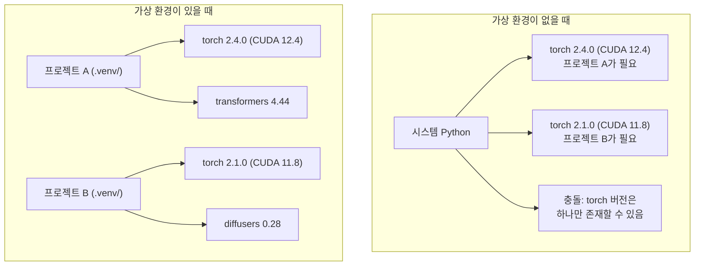

> 🇰🇷 이 문서는 한국어 번역본입니다(ELI5 스타일). 원문: [en.md](en.md)

# Python 환경 (Python Environments)

> 의존성 지옥은 실재합니다. 가상 환경이 그 해독제죠.

**유형:** Build
**언어:** Shell
**선수 지식:** 페이즈 0, 레슨 01
**소요 시간:** 약 30분

## 학습 목표

- `uv`, `venv`, `conda`로 고립된 가상 환경 만들기
- 선택적 의존성 그룹이 들어간 `pyproject.toml`을 작성하고 재현성을 위한 lockfile 생성하기
- 흔한 함정 진단하고 고치기: 전역 설치, pip/conda 혼용, CUDA 버전 불일치
- 서로 충돌하는 의존성을 가진 프로젝트를 위한 페이즈별 환경 전략 세우기

## 문제 상황

파인튜닝 프로젝트를 위해 PyTorch 2.4를 설치했습니다. 다음 주에 다른 프로젝트가 CUDA 빌드가 고정되어 있어 PyTorch 2.1을 요구합니다. 전역으로 업그레이드하면 첫 번째 프로젝트가 깨지고, 다운그레이드하면 두 번째 프로젝트가 깨집니다.

이게 바로 의존성 지옥입니다. AI/ML 작업에서는 끊임없이 발생하는데, 이유는 다음과 같습니다:

- PyTorch, JAX, TensorFlow는 각자 자체 CUDA 바인딩을 배포합니다
- 모델 라이브러리는 특정 프레임워크 버전을 고정합니다
- 전역 `pip install`은 기존에 있던 것을 덮어씁니다
- CUDA 11.8 빌드는 CUDA 12.x 드라이버와 호환되지 않습니다 (그 반대도 마찬가지)

해결책: 모든 프로젝트에 자기 전용 패키지를 담은 고립된 환경을 하나씩 주는 것입니다.

## 개념



```figure
s0-env-isolation
```

## 직접 만들어 보기

### 옵션 1: uv venv (권장)

`uv`는 가장 빠른 Python 패키지 매니저입니다(pip보다 10~100배 빠름). 가상 환경, Python 버전, 의존성 해결을 하나의 도구로 처리합니다.

```bash
curl -LsSf https://astral.sh/uv/install.sh | sh

uv python install 3.12

cd your-project
uv venv
source .venv/bin/activate
```

패키지 설치:

```bash
uv pip install torch numpy
```

`pyproject.toml`이 포함된 프로젝트를 한 번에 만들기:

```bash
uv init my-ai-project
cd my-ai-project
uv add torch numpy matplotlib
```

### 옵션 2: venv (내장)

`uv`를 설치할 수 없다면, Python에는 `venv`가 기본 포함되어 있습니다:

```bash
python3 -m venv .venv
source .venv/bin/activate  # Linux/macOS
.venv\Scripts\activate     # Windows

pip install torch numpy
```

`uv`보다는 느리지만 Python이 설치된 곳이라면 어디서든 동작합니다.

### 옵션 3: conda (필요할 때)

Conda는 CUDA 툴킷, cuDNN, C 라이브러리 같은 Python이 아닌 의존성도 관리합니다. 다음 경우에 사용하세요:

- 시스템 전체에 설치하지 않고 특정 CUDA 툴킷 버전이 필요할 때
- 시스템 패키지를 설치할 수 없는 공유 클러스터에서 작업할 때
- 어떤 라이브러리의 설치 안내가 "conda를 사용하라"고 할 때

```bash
# miniconda 설치 (완전판 Anaconda가 아님)
curl -LsSf https://repo.anaconda.com/miniconda/Miniconda3-latest-Linux-x86_64.sh -o miniconda.sh
bash miniconda.sh -b

conda create -n myproject python=3.12
conda activate myproject

conda install pytorch torchvision torchaudio pytorch-cuda=12.4 -c pytorch -c nvidia
```

규칙 하나: 어떤 환경을 conda로 만들었다면 그 환경의 모든 패키지도 conda로 관리하세요. conda 환경에 `pip install`을 섞으면 디버깅이 고통스러운 의존성 충돌이 생깁니다.

### 이 코스를 위한 전략: 페이즈별 환경

코스 전체를 위한 환경 하나를 만들 수도 있습니다. 하지 마세요. 페이즈마다 필요한 의존성이 다르고(가끔은 서로 충돌) 그렇습니다.

전략:

```
ai-engineering-from-scratch/
├── .venv/                    <-- 페이즈 0-3용 공유 경량 환경
├── phases/
│   ├── 04-neural-networks/
│   │   └── .venv/            <-- PyTorch 환경
│   ├── 05-cnns/
│   │   └── .venv/            <-- 같은 PyTorch 환경 (심링크 또는 공유)
│   ├── 08-transformers/
│   │   └── .venv/            <-- 다른 transformers 버전이 필요할 수 있음
│   └── 11-llm-apis/
│       └── .venv/            <-- API SDK, torch 불필요
```

`code/env_setup.sh`의 스크립트가 이 코스의 기본 환경을 만들어 줍니다.

## pyproject.toml 기초

모든 Python 프로젝트에는 `pyproject.toml`이 있어야 합니다. `setup.py`, `setup.cfg`, `requirements.txt`를 한 파일로 대체합니다.

```toml
[project]
name = "ai-engineering-from-scratch"
version = "0.1.0"
requires-python = ">=3.11"
dependencies = [
    "numpy>=1.26",
    "matplotlib>=3.8",
    "jupyter>=1.0",
    "scikit-learn>=1.4",
]

[project.optional-dependencies]
torch = ["torch>=2.3", "torchvision>=0.18"]
llm = ["anthropic>=0.39", "openai>=1.50"]
```

설치는 이렇게:

```bash
uv pip install -e ".[torch]"    # 기본 + PyTorch
uv pip install -e ".[llm]"     # 기본 + LLM SDK
uv pip install -e ".[torch,llm]" # 전부
```

## Lockfile

lockfile은 모든 의존성(전이적 의존성 포함)을 정확한 버전으로 고정합니다. 이것이 재현성을 보장합니다: lockfile에서 설치하는 사람은 누구든 정확히 같은 패키지를 받게 됩니다.

```bash
# uv add를 사용하면 uv가 uv.lock을 자동 생성한다
uv add numpy

# pip-tools 방식
uv pip compile pyproject.toml -o requirements.lock
uv pip install -r requirements.lock
```

lockfile은 git에 커밋하세요. 누군가 저장소를 클론하면 lockfile에서 설치해 동일한 버전을 받게 됩니다.

## 흔한 실수

### 1. 전역으로 설치하기

```bash
pip install torch  # 나쁨: 시스템 Python에 설치됨

source .venv/bin/activate
pip install torch  # 좋음: 가상 환경에 설치됨
```

패키지가 어디로 가는지 확인:

```bash
which python       # /usr/bin/python이 아니라 .venv/bin/python이 보여야 함
which pip           # .venv/bin/pip이 보여야 함
```

### 2. pip과 conda 섞어 쓰기

```bash
conda create -n myenv python=3.12
conda activate myenv
conda install pytorch -c pytorch
pip install some-other-package   # 나쁨: conda의 의존성 추적이 깨질 수 있음
conda install some-other-package # 좋음: 모든 걸 conda가 관리하게 두기
```

conda 안에서 꼭 pip을 써야 한다면(pip 전용 패키지도 있습니다), conda 패키지를 먼저 모두 설치한 뒤 pip 패키지를 마지막에 설치하세요.

### 3. 활성화를 잊기

```bash
python train.py           # 시스템 Python을 사용, 패키지가 없음
source .venv/bin/activate
python train.py           # 프로젝트 Python을 사용, 패키지 발견
```

셸 프롬프트에는 환경 이름이 표시되어야 합니다:

```
(.venv) $ python train.py
```

### 4. .venv를 git에 커밋하기

```bash
echo ".venv/" >> .gitignore
```

가상 환경은 200MB~2GB에 이릅니다. 로컬 전용이고 컴퓨터 사이에 옮겨 담을 수 없습니다. 대신 `pyproject.toml`과 lockfile을 커밋하세요.

### 5. CUDA 버전 불일치

```bash
nvidia-smi                # 드라이버 CUDA 버전 표시 (예: 12.4)
python -c "import torch; print(torch.version.cuda)"  # PyTorch CUDA 버전 표시

# 이 둘은 호환되어야 합니다.
# PyTorch CUDA 버전은 드라이버 CUDA 버전 이하여야 합니다.
```

## 사용해 보기

셋업 스크립트를 실행해 코스 환경을 만드세요:

```bash
bash phases/00-setup-and-tooling/06-python-environments/code/env_setup.sh
```

저장소 루트에 핵심 의존성이 설치되고 검증된 `.venv`가 생성됩니다.

## 연습 문제

1. `env_setup.sh`를 실행하고 모든 검사를 통과하는지 확인하기
2. 두 번째 가상 환경을 만들고 다른 버전의 numpy를 설치한 뒤, 두 환경이 고립되어 있는지 확인하기
3. PyTorch와 Anthropic SDK가 모두 필요한 프로젝트용 `pyproject.toml` 작성하기
4. 일부러 패키지를 전역으로 설치해 보고(venv 활성화 없이) 어디에 설치되는지 확인한 후 삭제하기

## 핵심 용어

| 용어 | 사람들이 말하는 것 | 실제 의미 |
|------|----------------|----------------------|
| 가상 환경(Virtual environment) | "venv" | 시스템 Python과 분리된, Python 인터프리터와 패키지를 담은 고립된 디렉터리 |
| Lockfile | "고정된 의존성" | 모든 패키지와 정확한 버전을 나열한 파일로, 여러 컴퓨터에서 동일한 설치를 보장한다 |
| pyproject.toml | "새로운 setup.py" | 표준 Python 프로젝트 설정 파일. setup.py/setup.cfg/requirements.txt를 대체한다 |
| 전이적 의존성(Transitive dependency) | "의존성의 의존성" | 패키지 B가 C에 의존할 때, B에 의존하는 A를 설치하면 C는 A의 전이적 의존성이다 |
| CUDA 불일치(CUDA mismatch) | "GPU가 안 돌아간다" | PyTorch가 GPU 드라이버가 지원하는 CUDA 버전과 다른 버전으로 컴파일된 상태 |
