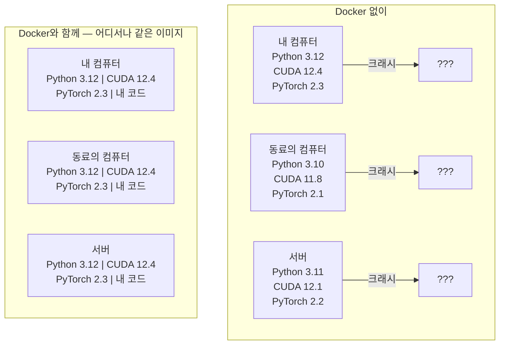

> 🇰🇷 이 문서는 한국어 번역본입니다(ELI5 스타일). 원문: [en.md](en.md)

# AI를 위한 Docker (Docker for AI)

> 컨테이너는 "내 컴퓨터에서는 되는데요"라는 말을 과거의 유물로 만들어 줍니다.

**유형:** Build
**언어:** Docker
**선수 지식:** 페이즈 0, 레슨 01과 03
**소요 시간:** 약 60분

## 학습 목표

- Dockerfile로 CUDA, PyTorch, AI 라이브러리가 담긴 GPU 지원 Docker 이미지 빌드하기
- 호스트 디렉터리를 볼륨으로 마운트해 컨테이너를 다시 빌드해도 모델, 데이터셋, 코드가 유지되게 하기
- NVIDIA Container Toolkit을 설정해 컨테이너 안에서 GPU를 사용할 수 있게 하기
- Docker Compose로 다중 서비스 AI 애플리케이션(추론 서버 + 벡터 데이터베이스) 오케스트레이션하기

## 문제 상황

여러분은 노트북에서 PyTorch 2.3, CUDA 12.4, Python 3.12로 모델을 학습시켰습니다. 동료의 컴퓨터에는 PyTorch 2.1, CUDA 11.8, Python 3.10이 있죠. 여러분의 모델은 동료의 컴퓨터에서 크래시가 납니다. 하지만 Dockerfile은 어느 쪽에서든 잘 돌아갑니다.

AI 프로젝트는 의존성의 악몽입니다. 전형적인 스택에는 Python, PyTorch, CUDA 드라이버, cuDNN, 시스템 수준의 C 라이브러리, 그리고 flash-attn처럼 정확한 컴파일러 버전을 요구하는 특수 패키지가 포함됩니다. Docker는 이 모든 것을 어디서든 동일하게 실행되는 단일 이미지로 포장합니다.

## 개념

Docker는 코드, 런타임, 라이브러리, 시스템 도구를 컨테이너라는 고립된 단위로 감쌉니다. 가벼운 가상 머신이라고 생각하면 됩니다. 다만 자체 커널을 실행하는 대신 호스트 OS의 커널을 공유하기 때문에, 몇 분이 아니라 몇 초 만에 시작됩니다.



### AI 프로젝트가 다른 무엇보다 Docker를 필요로 하는 이유

1. **GPU 드라이버는 까다롭습니다.** CUDA 12.4 코드는 CUDA 11.8에서 돌지 않습니다. Docker는 CUDA 툴킷을 컨테이너 안에 격리하면서, NVIDIA Container Toolkit을 통해 호스트 GPU 드라이버는 그대로 공유합니다.

2. **모델 가중치는 큽니다.** 7B 파라미터 모델은 fp16 기준 14GB입니다. 다시 빌드할 때마다 다시 내려받고 싶지는 않을 겁니다. Docker 볼륨을 쓰면 호스트의 모델 디렉터리를 마운트할 수 있습니다.

3. **다중 서비스 아키텍처가 흔합니다.** 실제 AI 애플리케이션은 Python 스크립트 하나가 아닙니다. 추론 서버, RAG용 벡터 데이터베이스, 웹 프론트엔드까지 있을 수 있죠. Docker Compose는 이 모든 것을 명령어 하나로 오케스트레이션합니다.

### 핵심 용어

| 용어 | 의미 |
|------|---------------|
| 이미지(Image) | 읽기 전용 템플릿. 요리 레시피에 해당. Dockerfile로 빌드한다. |
| 컨테이너(Container) | 이미지의 실행 중인 인스턴스. 주방에 해당. |
| Dockerfile | 이미지를 빌드하기 위한 지시문. 층층이 쌓인다. |
| 볼륨(Volume) | 컨테이너 재시작 후에도 살아남는 영구 저장소. |
| docker-compose | YAML로 다중 컨테이너 애플리케이션을 정의하는 도구. |

### AI에서 흔한 컨테이너 패턴

```
개발 컨테이너(Dev Container)
  풀 툴킷. 에디터 지원. Jupyter. 디버깅 도구.
  개발과 실험 중에 사용.

학습 컨테이너(Training Container)
  최소 구성. 학습 스크립트와 의존성만 포함.
  GPU 클러스터에서 실행. 에디터도 Jupyter도 없음.

추론 컨테이너(Inference Container)
  서빙에 최적화. 작은 이미지. 빠른 콜드 스타트.
  프로덕션(운영 환경)에서 로드 밸런서 뒤에서 실행.
```

```figure
s0-image-layers
```

## 직접 만들어 보기

### 단계 1: Docker 설치

```bash
# macOS
brew install --cask docker
open /Applications/Docker.app

# Ubuntu
curl -fsSL https://get.docker.com | sh
sudo usermod -aG docker $USER
# 그룹 변경을 적용하려면 로그아웃 후 다시 로그인
```

확인:

```bash
docker --version
docker run hello-world
```

### 단계 2: NVIDIA Container Toolkit 설치 (NVIDIA GPU가 있는 Linux)

이 도구는 Docker 컨테이너가 GPU에 접근하게 해 줍니다. macOS와 Windows(WSL2) 사용자는 건너뛰어도 됩니다. Docker Desktop은 그 플랫폼에서 GPU 패스스루를 다른 방식으로 처리합니다.

```bash
distribution=$(. /etc/os-release;echo $ID$VERSION_ID)
curl -fsSL https://nvidia.github.io/libnvidia-container/gpgkey | sudo gpg --dearmor -o /usr/share/keyrings/nvidia-container-toolkit-keyring.gpg
curl -s -L https://nvidia.github.io/libnvidia-container/$distribution/libnvidia-container.list | \
    sed 's#deb https://#deb [signed-by=/usr/share/keyrings/nvidia-container-toolkit-keyring.gpg] https://#g' | \
    sudo tee /etc/apt/sources.list.d/nvidia-container-toolkit.list

sudo apt-get update
sudo apt-get install -y nvidia-container-toolkit
sudo nvidia-ctk runtime configure --runtime=docker
sudo systemctl restart docker
```

컨테이너 안에서 GPU 접근 테스트:

```bash
docker run --rm --gpus all nvidia/cuda:12.4.1-base-ubuntu22.04 nvidia-smi
```

GPU 정보가 보이면 툴킷이 정상 동작하는 것입니다.

### 단계 3: 베이스 이미지 이해하기

올바른 베이스 이미지를 고르면 디버깅 시간을 몇 시간이나 아낄 수 있습니다.

```
nvidia/cuda:12.4.1-devel-ubuntu22.04
  풀 CUDA 툴킷. 컴파일러 포함.
  용도: nvcc가 필요한 패키지 빌드 (flash-attn, bitsandbytes)
  크기: 약 4 GB

nvidia/cuda:12.4.1-runtime-ubuntu22.04
  CUDA 런타임만 포함. 컴파일러 없음.
  용도: 미리 빌드된 코드 실행
  크기: 약 1.5 GB

pytorch/pytorch:2.6.0-cuda12.4-cudnn9-runtime
  CUDA 위에 PyTorch가 미리 설치됨.
  용도: PyTorch 설치 단계 건너뛰기
  크기: 약 6 GB

python:3.12-slim
  CUDA 없음. CPU 전용.
  용도: CPU 추론, 경량 도구
  크기: 약 150 MB
```

### 단계 4: AI 개발용 Dockerfile 작성

`code/Dockerfile`에 있는 Dockerfile입니다. 하나씩 살펴봅시다:

```dockerfile
FROM --platform=linux/amd64 nvidia/cuda:12.4.1-devel-ubuntu22.04

ENV DEBIAN_FRONTEND=noninteractive
ENV PYTHONUNBUFFERED=1

RUN apt-get update && apt-get install -y --no-install-recommends \
    software-properties-common \
    git \
    curl \
    build-essential \
    && add-apt-repository -y ppa:deadsnakes/ppa \
    && apt-get update && apt-get install -y --no-install-recommends \
    python3.12 \
    python3.12-venv \
    python3.12-dev \
    && rm -rf /var/lib/apt/lists/*

RUN update-alternatives --install /usr/bin/python python /usr/bin/python3.12 1

RUN curl -sSL https://raw.githubusercontent.com/pypa/get-pip/3b73145063be545b649ad9ca83ea8da5fc915a4f/public/get-pip.py -o /tmp/get-pip.py \
    && echo "a341e1a43e38001c551a1508a73ff23636a11970b61d901d9a1cad2a18f57055  /tmp/get-pip.py" | sha256sum -c - \
    && python /tmp/get-pip.py \
    && rm /tmp/get-pip.py \
    && update-alternatives --install /usr/bin/pip pip /usr/local/bin/pip3.12 1

RUN python -m pip install --no-cache-dir --upgrade pip setuptools wheel

RUN python -m pip install --no-cache-dir \
    torch==2.6.0+cu124 \
    torchvision==0.21.0+cu124 \
    torchaudio==2.6.0+cu124 \
    --index-url https://download.pytorch.org/whl/cu124

RUN python -m pip install --no-cache-dir \
    numpy \
    pandas \
    scikit-learn \
    matplotlib \
    jupyter \
    transformers \
    datasets \
    accelerate \
    safetensors

WORKDIR /workspace

VOLUME ["/workspace", "/models"]

EXPOSE 8888

CMD ["python"]
```

빌드:

```bash
docker build -t ai-dev -f phases/00-setup-and-tooling/07-docker-for-ai/code/Dockerfile .
```

처음에는 시간이 좀 걸립니다(CUDA 베이스 이미지 + PyTorch 다운로드). 이후 빌드는 캐시된 레이어를 사용합니다.

**macOS / Apple 실리콘 (M1/M2/M3/M4):** `FROM` 줄의 `--platform=linux/amd64`가 이 빌드를 Mac에서 성공시키는 장치입니다. CUDA 베이스 이미지에도 arm64 변형이 있어 Apple 실리콘에서는 Docker Desktop이 자동으로 골라 주지만, PyTorch는 `cu124` 휠을 x86_64 전용으로 배포하기 때문에 `pip install torch==2.6.0+cu124` 레이어가 `No matching distribution found for torch==2.6.0+cu124` 오류로 실패합니다. 플랫폼을 고정하면 x86_64 이미지를 가져와 에뮬레이션으로 실행합니다: 빌드는 느려지고 컨테이너에는 GPU가 없습니다(어차피 Mac에는 CUDA가 없습니다). Mac에서는 아래 `docker run` 명령에서 `--gpus all`을 빼세요. Apple 실리콘에서 GPU 작업을 하려면 레슨 01의 MPS 빌드로 네이티브하게 레슨을 진행하고, 이 이미지는 NVIDIA GPU가 달린 x86_64 Linux 호스트용으로 남겨 두세요.

실행:

```bash
docker run --rm -it --gpus all \
    -v $(pwd):/workspace \
    -v ~/models:/models \
    ai-dev python -c "import torch; print(f'PyTorch {torch.__version__}, CUDA: {torch.cuda.is_available()}')"
```

컨테이너 안에서 Jupyter 실행:

```bash
docker run --rm -it --gpus all \
    -v $(pwd):/workspace \
    -v ~/models:/models \
    -p 8888:8888 \
    ai-dev jupyter notebook --ip=0.0.0.0 --port=8888 --no-browser --allow-root
```

### 단계 5: 데이터와 모델을 위한 볼륨 마운트

볼륨 마운트는 AI 작업에서 아주 중요합니다. 없다면 컨테이너가 멈출 때 14GB짜리 모델 다운로드도 함께 사라집니다.

```bash
# 코드 마운트
-v $(pwd):/workspace

# 공유 모델 디렉터리 마운트
-v ~/models:/models

# 데이터셋 마운트
-v ~/datasets:/data
```

학습 스크립트 안에서는 마운트된 경로에서 불러옵니다:

```python
from transformers import AutoModel

model = AutoModel.from_pretrained("/models/llama-7b")
```

모델은 호스트 파일시스템에 그대로 있습니다. 컨테이너를 다시 다운로드 없이 마음껏 재빌드하세요.

### 단계 6: 다중 서비스 AI 앱을 위한 Docker Compose

실제 RAG 애플리케이션에는 추론 서버와 벡터 데이터베이스가 필요합니다. Docker Compose는 이 둘을 명령어 하나로 실행합니다.

`code/docker-compose.yml` 참고:

```yaml
services:
  ai-dev:
    build:
      context: .
      dockerfile: Dockerfile
    deploy:
      resources:
        reservations:
          devices:
            - driver: nvidia
              count: all
              capabilities: [gpu]
    volumes:
      - ../../../:/workspace
      - ~/models:/models
      - ~/datasets:/data
    ports:
      - "8888:8888"
    stdin_open: true
    tty: true
    command: jupyter notebook --ip=0.0.0.0 --port=8888 --no-browser --allow-root

  qdrant:
    image: qdrant/qdrant:v1.12.5
    ports:
      - "6333:6333"
      - "6334:6334"
    volumes:
      - qdrant_data:/qdrant/storage

volumes:
  qdrant_data:
```

전부 시작:

```bash
cd phases/00-setup-and-tooling/07-docker-for-ai/code
docker compose up -d
```

이제 AI 개발 컨테이너는 서비스 이름으로 벡터 데이터베이스 `http://qdrant:6333`에 접근할 수 있습니다. Docker Compose가 공유 네트워크를 자동으로 만들어 줍니다.

AI 컨테이너 안에서 연결 테스트:

```python
from qdrant_client import QdrantClient

client = QdrantClient(host="qdrant", port=6333)
print(client.get_collections())
```

전부 중지:

```bash
docker compose down
```

qdrant 볼륨까지 삭제하려면 `-v`를 추가하세요:

```bash
docker compose down -v
```

### 단계 7: AI 작업에 유용한 Docker 명령어

```bash
# 실행 중인 컨테이너 목록
docker ps

# 모든 이미지와 크기 목록
docker images

# 사용하지 않는 이미지 제거 (디스크 공간 확보)
docker system prune -a

# 실행 중인 컨테이너 안의 GPU 사용량 확인
docker exec -it <container_id> nvidia-smi

# 컨테이너에서 호스트로 파일 복사
docker cp <container_id>:/workspace/results.csv ./results.csv

# 컨테이너 로그 보기
docker logs -f <container_id>
```

## 사용해 보기

이제 재현 가능한 AI 개발 환경이 생겼습니다. 이 코스의 나머지 동안:

- `docker compose up`으로 개발 환경과 벡터 데이터베이스를 함께 시작하기
- 코드, 모델, 데이터를 볼륨으로 마운트해 재빌드 사이에 아무것도 잃지 않기
- 레슨이 새 Python 패키지를 요구하면 Dockerfile에 추가하고 재빌드하기
- Dockerfile을 팀원들과 공유하기. 그러면 모두가 정확히 같은 환경을 갖게 됩니다.

### GPU가 없다면?

`--gpus all` 플래그와 NVIDIA deploy 블록을 제거하세요. 그래도 컨테이너는 CPU 기반 레슨에서 잘 동작합니다. PyTorch는 CUDA가 없음을 감지해 자동으로 CPU로 전환합니다.

## 연습 문제

1. Dockerfile을 빌드하고 컨테이너 안에서 `python -c "import torch; print(torch.__version__)"` 실행하기
2. docker-compose 스택을 시작하고 AI 컨테이너에서 `http://qdrant:6333/collections`로 Qdrant에 접근되는지 확인하기
3. Dockerfile에 `flask`를 추가하고 재빌드한 뒤, 포트 5000에서 간단한 API 서버 실행하기. `-p 5000:5000`으로 포트를 매핑할 것
4. `docker images`로 이미지 크기 측정하기. 베이스 이미지를 `devel`에서 `runtime`으로 바꿔 크기를 비교해 보기

## 핵심 용어

| 용어 | 사람들이 말하는 것 | 실제 의미 |
|------|----------------|----------------------|
| 컨테이너(Container) | "가벼운 VM" | 호스트 커널을 사용하되 자체 파일시스템과 네트워크를 갖는 고립된 프로세스 |
| 이미지 레이어(Image layer) | "캐시된 단계" | Dockerfile의 각 지시문이 레이어 하나를 만든다. 변하지 않은 레이어는 캐시되어 재빌드가 빠르다 |
| NVIDIA Container Toolkit | "Docker 안의 GPU" | `--gpus` 플래그를 통해 호스트 GPU를 컨테이너에 노출하는 런타임 훅 |
| 볼륨 마운트(Volume mount) | "공유 폴더" | 컨테이너 안으로 매핑되는 호스트 디렉터리. 변경 사항은 컨테이너가 멈춘 뒤에도 유지된다 |
| 베이스 이미지(Base image) | "시작점" | Dockerfile이 그 위에 쌓이는 `FROM` 이미지. 무엇이 미리 설치되어 있는지 결정한다 |
