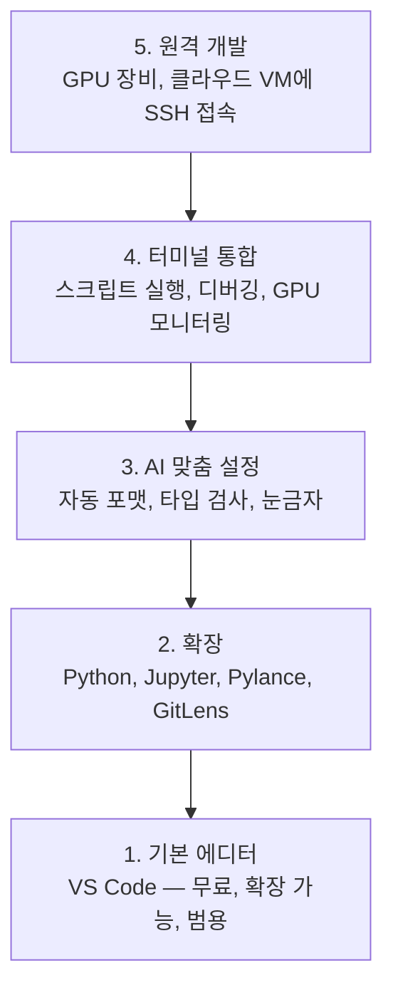

> 🇰🇷 이 문서는 한국어 번역본입니다(ELI5 스타일). 원문: [en.md](en.md)

# 에디터 설정 (Editor Setup)

> 에디터는 여러분의 부조종사입니다. 한 번만 제대로 설정해서 발목을 잡지 않고 제 몫을 해내게 만드세요.

**유형:** Build
**언어:** --
**선수 지식:** 페이즈 0, 레슨 01
**소요 시간:** 약 20분

## 학습 목표

- Python, Jupyter, 린팅, 원격 SSH를 위한 필수 확장과 함께 VS Code 설치하기
- AI 워크플로에 맞게 저장 시 자동 포맷, 타입 검사, 노트북 출력 스크롤 설정하기
- Remote SSH로 원격 GPU 머신의 코드를 로컬처럼 편집하고 디버깅하기
- 에디터 대안들(Cursor, Windsurf, Neovim)과 AI 작업에서의 장단점 평가하기

## 문제 상황

여러분은 에디터 안에서 수천 시간을 보내며 Python을 작성하고, 노트북을 실행하고, 학습 루프를 디버깅하고, GPU 장비에 SSH로 접속하게 됩니다. 잘못 설정된 에디터는 모든 작업 시간을 마찰로 바꿔 버립니다: 자동 완성도 없고, 타입 힌트도 없고, 인라인 오류 표시도 없고, 포맷은 손으로 하고, 터미널 워크플로는 투박하죠.

제대로 된 설정은 20분이면 끝납니다. 건너뛰면 매일 20분씩 잃게 됩니다.

## 개념

AI 엔지니어링 에디터 설정에 필요한 다섯 가지:



```figure
s0-lsp-roundtrip
```

## 직접 만들어 보기

### 단계 1: VS Code 설치

VS Code가 권장 에디터입니다. 무료이고 모든 OS에서 동작하며, 퍼스트클래스 Jupyter 노트북 지원과 AI 작업에 필요한 모든 것을 갖춘 확장 생태계를 갖추고 있습니다.

[code.visualstudio.com](https://code.visualstudio.com/)에서 내려받으세요.

터미널에서 확인:

```bash
code --version
```

macOS에서 `code` 명령을 찾을 수 없다면, VS Code를 열고 `Cmd+Shift+P`를 누른 뒤 "Shell Command"를 입력하고 "Install 'code' command in PATH"를 선택하세요.

### 단계 2: 필수 확장 설치

VS Code의 통합 터미널을 열고(모든 플랫폼에서 `` Ctrl+` ``) AI 작업에 중요한 확장들을 설치합니다:

```bash
code --install-extension ms-python.python
code --install-extension ms-python.vscode-pylance
code --install-extension ms-toolsai.jupyter
code --install-extension eamodio.gitlens
code --install-extension ms-vscode-remote.remote-ssh
code --install-extension ms-python.debugpy
code --install-extension ms-python.black-formatter
code --install-extension charliermarsh.ruff
```

각 확장이 하는 일:

| 확장 | 이유 |
|-----------|-----|
| Python | 언어 지원, 가상 환경 감지, 실행/디버그 |
| Pylance | 빠른 타입 검사, 자동 완성, import 해석 |
| Jupyter | VS Code 안에서 노트북 실행, 변수 탐색기 |
| GitLens | 누가 무엇을 바꿨는지 확인, 인라인 git blame |
| Remote SSH | 원격 GPU 장비의 폴더를 로컬처럼 열기 |
| Debugpy | Python 스텝 디버깅 |
| Black Formatter | 저장 시 자동 포맷, 일관된 스타일 |
| Ruff | 빠른 린팅, 흔한 실수 포착 |

이 레슨의 `code/.vscode/extensions.json` 파일에 전체 추천 목록이 들어 있습니다. 프로젝트 폴더를 열면 VS Code가 설치를 제안해 줍니다.

### 단계 3: 설정 구성

이 레슨의 `code/.vscode/settings.json` 설정을 복사하거나, `설정 > 설정 열기(JSON)`에서 수동으로 적용하세요.

AI 작업의 핵심 설정:

```jsonc
{
    "python.analysis.typeCheckingMode": "basic",
    "editor.formatOnSave": true,
    "editor.rulers": [88, 120],
    "notebook.output.scrolling": true,
    "files.autoSave": "afterDelay"
}
```

중요한 이유:

- **타입 검사를 basic으로**: 실행하기 전에 잘못된 인자 타입을 잡아 줍니다. 텐서 shape 불일치나 잘못된 API 인자로 인한 디버깅 시간을 아껴 줍니다.
- **저장 시 포맷**: 포맷에 대해 다시는 고민하지 않게 됩니다. Black이 처리합니다.
- **88과 120에 눈금자**: Black은 88자에서 줄을 바꿉니다. 120 표시선은 독스트링과 주석이 너무 길어질 때를 알려 줍니다.
- **노트북 출력 스크롤**: 학습 루프는 수천 줄을 출력합니다. 스크롤이 없으면 출력 패널이 폭발합니다.
- **자동 저장**: 저장을 잊게 됩니다. 학습 스크립트가 낡은 코드를 돌리게 되죠. 자동 저장이 그걸 막아 줍니다.

### 단계 4: 터미널 통합

VS Code의 통합 터미널은 학습 스크립트를 실행하고, GPU를 감시하고, 환경을 관리하는 곳입니다.

제대로 설정:

```jsonc
{
    "terminal.integrated.defaultProfile.osx": "zsh",
    "terminal.integrated.defaultProfile.linux": "bash",
    "terminal.integrated.fontSize": 13,
    "terminal.integrated.scrollback": 10000
}
```

유용한 단축키:

| 동작 | macOS | Linux/Windows |
|--------|-------|---------------|
| 터미널 토글 | `` Ctrl+` `` | `` Ctrl+` `` |
| 새 터미널 | `` Ctrl+Shift+` `` | `` Ctrl+Shift+` `` |
| 터미널 분할 | `Cmd+\` | `Ctrl+Shift+5` |

터미널을 분할해 쓰면 유용합니다: 하나는 스크립트 실행용, 하나는 `nvidia-smi -l 1`이나 `watch -n 1 nvidia-smi`로 GPU 감시용.

### 단계 5: 원격 개발 (GPU 장비에 SSH 접속)

AI 작업에서 가장 중요한 확장입니다. 학습은 원격 머신(클라우드 VM, 연구실 서버, Lambda, Vast.ai)에서 돌리게 됩니다. Remote SSH를 쓰면 원격 파일시스템을 열고, 파일을 편집하고, 터미널을 실행하고, 디버깅하는 것이 전부 로컬인 것처럼 이루어집니다.

설정:

1. Remote SSH 확장 설치 (단계 2에서 완료).
2. `Ctrl+Shift+P`(또는 `Cmd+Shift+P`)를 누르고 "Remote-SSH: Connect to Host" 입력.
3. `user@your-gpu-box-ip` 입력.
4. VS Code가 원격 머신에 서버 구성 요소를 자동으로 설치합니다.

비밀번호 없이 접속하려면 SSH 키를 설정하세요:

```bash
ssh-keygen -t ed25519 -C "your-email@example.com"
ssh-copy-id user@your-gpu-box-ip
```

편의를 위해 `~/.ssh/config`에 호스트를 추가:

```
Host gpu-box
    HostName 203.0.113.50
    User ubuntu
    IdentityFile ~/.ssh/id_ed25519
    ForwardAgent yes
```

이제 `Remote-SSH: Connect to Host > gpu-box`로 즉시 연결됩니다.

## 대안들

### Cursor

[cursor.com](https://cursor.com)은 AI 코드 생성이 내장된 VS Code 포크입니다. 같은 확장 생태계와 설정 형식을 사용합니다. Cursor를 쓰더라도 이 레슨의 모든 내용이 그대로 적용됩니다. 같은 `settings.json`과 `extensions.json`을 가져오세요.

### Windsurf

[windsurf.com](https://windsurf.com)은 또 하나의 AI 우선 VS Code 포크입니다. 같은 이야기입니다: 같은 확장, 같은 설정 형식, 같은 Remote SSH 지원.

### Vim/Neovim

이미 Vim이나 Neovim을 쓰고 있고 생산성이 높다면 그대로 계속 쓰세요. AI Python 작업을 위한 최소 설정:

- 타입 검사를 위한 **pyright** 또는 **pylsp** (Mason 또는 수동 설치)
- 언어 서버 연동을 위한 **nvim-lspconfig**
- 노트북 스타일 실행을 위한 **jupyter-vim** 또는 **molten-nvim**
- 파일/심볼 검색을 위한 **telescope.nvim**
- black과 ruff를 붙인 포맷/린트용 **none-ls.nvim**

Vim을 아직 쓰지 않는다면 지금 시작하지 마세요. 그 학습 곡선이 AI 엔지니어링 공부와 경쟁하게 됩니다. VS Code를 쓰세요.

## 사용해 보기

이 설정으로 일상 워크플로는 이렇게 됩니다:

1. VS Code에서 프로젝트 폴더를 연다 (또는 Remote SSH로 GPU 장비에 접속).
2. 자동 완성, 타입 힌트, 인라인 오류와 함께 에디터에서 Python을 작성한다.
3. Jupyter 확장으로 노트북을 인라인으로 실행한다.
4. 통합 터미널에서 학습 스크립트 실행, `uv pip install`, GPU 모니터링을 처리한다.
5. 커밋 전에 GitLens로 변경 사항을 검토한다.

## 연습 문제

1. VS Code와 단계 2에 나열된 모든 확장 설치하기
2. 이 레슨의 `settings.json`을 자신의 VS Code 설정에 복사하기
3. Python 파일을 열어 Pylance가 타입 힌트를 보여주고 Black이 저장 시 포맷하는지 확인하기
4. 원격 머신에 접근할 수 있다면 Remote SSH를 설정하고 그 위의 폴더 열어 보기

## 핵심 용어

| 용어 | 사람들이 말하는 것 | 실제 의미 |
|------|----------------|----------------------|
| LSP | "자동 완성 엔진" | Language Server Protocol: 에디터가 언어별 서버에서 타입 정보, 자동 완성, 진단을 받아 오는 표준 |
| Pylance | "그 Python 플러그인" | Microsoft의 Python 언어 서버. Pyright를 사용해 타입 검사와 IntelliSense를 제공한다 |
| Remote SSH | "서버에서 작업하기" | 원격 머신에 경량 서버를 띄우고 UI를 로컬 에디터로 스트리밍하는 VS Code 확장 |
| 저장 시 포맷(Format on save) | "자동 예쁘게 만들기" | 저장할 때마다 에디터가 포매터(Black, Ruff)를 실행해 코드 스타일을 항상 일관되게 유지한다 |
