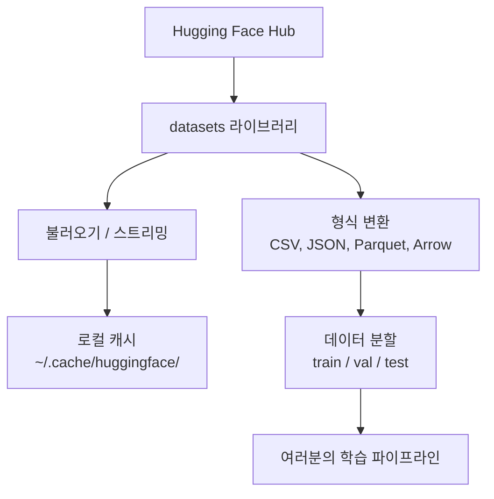

> 🇰🇷 이 문서는 한국어 번역본입니다(ELI5 스타일). 원문: [en.md](en.md)

# 데이터 관리 (Data Management)

> 데이터는 연료입니다. 어떻게 관리하느냐가 속도를 결정합니다.

**유형:** Build
**언어:** Python
**선수 지식:** 페이즈 0, 레슨 01
**소요 시간:** 약 45분

## 학습 목표

- Hugging Face `datasets` 라이브러리로 데이터셋 불러오기, 스트리밍, 캐싱 처리하기
- CSV, JSON, Parquet, Arrow 형식 사이에서 변환하고 각각의 장단점 설명하기
- 고정된 랜덤 시드로 재현 가능한 학습/검증/테스트 분할 만들기
- `.gitignore`, Git LFS, DVC로 대용량 모델·데이터셋 파일 관리하기

## 문제 상황

모든 AI 프로젝트는 데이터에서 시작합니다. 데이터셋을 찾고, 내려받고, 형식을 변환하고, 학습용과 평가용으로 나누고, 실험을 재현할 수 있게 버전을 관리해야 합니다. 이걸 매번 손으로 하면 느리고 실수가 잦습니다. 반복 가능한 워크플로가 필요합니다.

## 개념



Hugging Face `datasets` 라이브러리는 AI 작업에서 데이터를 불러오는 표준 방법입니다. 다운로드, 캐싱, 형식 변환, 스트리밍을 기본으로 처리해 줍니다.

```figure
s0-data-pipeline
```

## 직접 만들어 보기

### 단계 1: datasets 라이브러리 설치

```bash
pip install datasets huggingface_hub
```

### 단계 2: 데이터셋 불러오기

```python
from datasets import load_dataset

dataset = load_dataset("stanfordnlp/imdb")
print(dataset)
print(dataset["train"][0])
```

IMDB 영화 리뷰 데이터셋을 내려받습니다. 처음 내려받은 뒤로는 `~/.cache/huggingface/datasets/`의 캐시에서 불러옵니다.

### 단계 3: 대용량 데이터셋 스트리밍

일부 데이터셋은 디스크에 통째로 담기엔 너무 큽니다. 스트리밍은 전체를 내려받지 않고 한 행씩 불러옵니다.

```python
dataset = load_dataset("wikimedia/wikipedia", "20220301.en", split="train", streaming=True)

for i, example in enumerate(dataset):
    print(example["title"])
    if i >= 4:
        break
```

스트리밍은 `IterableDataset`을 돌려줍니다. 행이 도착하는 대로 처리하면 되고, 데이터셋 크기와 상관없이 메모리 사용량이 일정하게 유지됩니다.

### 단계 4: 데이터셋 형식

`datasets` 라이브러리는 내부적으로 Apache Arrow를 사용합니다. 파이프라인이 필요로 하는 다른 형식으로 변환할 수 있습니다.

```python
dataset = load_dataset("stanfordnlp/imdb", split="train")

dataset.to_csv("imdb_train.csv")
dataset.to_json("imdb_train.json")
dataset.to_parquet("imdb_train.parquet")
```

형식 비교:

| 형식 | 크기 | 읽기 속도 | 적합한 용도 |
|--------|------|-----------|----------|
| CSV | 큼 | 느림 | 사람이 읽기, 스프레드시트 |
| JSON | 큼 | 느림 | API, 중첩된 데이터 |
| Parquet | 작음 | 빠름 | 분석, 컬럼 기반 질의 |
| Arrow | 작음 | 가장 빠름 | 메모리 내 처리 (`datasets`가 내부적으로 사용) |

AI 작업에서는 Parquet이 가장 좋은 저장 형식입니다. 메모리에서는 Arrow로 작업하고, CSV와 JSON은 데이터 교환용입니다.

### 단계 5: 데이터 분할

모든 ML 프로젝트에는 세 가지 분할이 필요합니다:

- **학습(Train)**: 모델이 이 데이터로 학습합니다 (보통 80%)
- **검증(Validation)**: 학습 중 진행 상황을 점검합니다 (보통 10%)
- **테스트(Test)**: 학습이 끝난 뒤의 최종 평가에 사용합니다 (보통 10%)

데이터셋에 따라 미리 분할되어 오기도 합니다. 그렇지 않다면 직접 나누세요:

```python
dataset = load_dataset("stanfordnlp/imdb", split="train")

split = dataset.train_test_split(test_size=0.2, seed=42)
train_val = split["train"].train_test_split(test_size=0.125, seed=42)

train_ds = train_val["train"]
val_ds = train_val["test"]
test_ds = split["test"]

print(f"Train: {len(train_ds)}, Val: {len(val_ds)}, Test: {len(test_ds)}")
```

재현성을 위해 항상 시드를 지정하세요. 같은 시드는 매번 같은 분할을 만들어 냅니다.

### 단계 6: 모델 내려받고 캐시하기

모델은 큰 파일입니다. `huggingface_hub` 라이브러리가 다운로드와 캐싱을 처리합니다.

```python
from huggingface_hub import hf_hub_download, snapshot_download

model_path = hf_hub_download(
    repo_id="sentence-transformers/all-MiniLM-L6-v2",
    filename="config.json"
)
print(f"Cached at: {model_path}")

model_dir = snapshot_download("sentence-transformers/all-MiniLM-L6-v2")
print(f"Full model at: {model_dir}")
```

모델은 `~/.cache/huggingface/hub/`에 캐시됩니다. 한 번 내려받으면 이후 실행에서 즉시 불러옵니다.

### 단계 7: 대용량 파일 다루기

모델 가중치와 대용량 데이터셋은 git에 넣으면 안 됩니다. 선택지는 세 가지입니다.

**옵션 A: .gitignore (가장 간단)**

```
*.bin
*.safetensors
*.pt
*.onnx
data/*.parquet
data/*.csv
models/
```

**옵션 B: Git LFS (대용량 파일을 git으로 추적)**

```bash
git lfs install
git lfs track "*.bin"
git lfs track "*.safetensors"
git add .gitattributes
```

Git LFS는 저장소에는 포인터만 두고 실제 파일은 별도 서버에 저장합니다. GitHub은 무료로 1GB를 제공합니다.

**옵션 C: DVC (데이터 버전 관리)**

```bash
pip install dvc
dvc init
dvc add data/training_set.parquet
git add data/training_set.parquet.dvc data/.gitignore
git commit -m "Track training data with DVC"
```

DVC는 데이터를 가리키는 작은 `.dvc` 파일을 만듭니다. 데이터 자체는 S3, GCS 등 다른 원격 스토리지 백엔드에 있습니다.

| 방식 | 복잡도 | 적합한 경우 |
|----------|-----------|----------|
| .gitignore | 낮음 | 개인 프로젝트, 다시 받을 수 있는 내려받은 데이터 |
| Git LFS | 중간 | git으로 모델 가중치를 공유하는 팀 |
| DVC | 높음 | 재현 가능한 실험, 대용량 데이터셋, 팀 |

이 코스에서는 `.gitignore`로 충분합니다. 여러 컴퓨터에 걸쳐 정확히 같은 실험을 재현해야 할 때 DVC를 사용하세요.

### 단계 8: 저장소 패턴

**로컬 저장소**는 약 10GB 이하의 데이터셋이면 충분합니다. HF 캐시가 자동으로 처리합니다.

**클라우드 저장소**는 그보다 크거나 여러 머신에서 공유할 때 사용합니다:

```python
import os

local_path = os.path.expanduser("~/.cache/huggingface/datasets/")

# s3_path = "s3://my-bucket/datasets/"
# gcs_path = "gs://my-bucket/datasets/"
```

DVC는 S3와 GCS와 직접 연동됩니다:

```bash
dvc remote add -d myremote s3://my-bucket/dvc-store
dvc push
```

이 코스에서는 로컬 저장소로 충분합니다. 원격 GPU 인스턴스에서 파인튜닝할 때 클라우드 저장소가 필요해집니다.

## 이 코스에서 사용하는 데이터셋

| 데이터셋 | 레슨 | 크기 | 배우는 내용 |
|---------|---------|------|----------------|
| IMDB | 토크나이제이션, 분류 | 84 MB | 텍스트 분류 기초 |
| WikiText | 언어 모델링 | 181 MB | 다음 토큰 예측 |
| SQuAD | QA 시스템 | 35 MB | 질의응답, 구간(span) |
| Common Crawl (부분집합) | 임베딩 | 가변 | 대규모 텍스트 처리 |
| MNIST | 비전 기초 | 21 MB | 이미지 분류 기본기 |
| COCO (부분집합) | 멀티모달 | 가변 | 이미지-텍스트 쌍 |

지금 당장 전부 내려받을 필요는 없습니다. 각 레슨이 필요한 것을 명시합니다.

## 사용해 보기

유틸리티 스크립트를 실행해 모든 것이 동작하는지 확인하세요:

```bash
python code/data_utils.py
```

작은 데이터셋을 내려받고, 변환하고, 분할한 뒤 요약을 출력합니다.

## 출시해 보기

이 레슨의 산출물:
- `code/data_utils.py` - 재사용 가능한 데이터 로딩·캐싱 유틸리티
- `outputs/prompt-data-helper.md` - 작업에 맞는 데이터셋을 찾기 위한 프롬프트

## 연습 문제

1. `glue` 데이터셋을 `mrpc` 설정으로 불러와 처음 5개 예시 살펴보기
2. `c4` 데이터셋을 스트리밍해 10초 동안 몇 개의 예시를 처리하는지 세어 보기
3. 데이터셋을 Parquet으로 변환해 CSV와 파일 크기 비교하기
4. 고정 시드로 70/15/15 학습/검증/테스트 분할을 만들고 크기 확인하기

## 핵심 용어

| 용어 | 사람들이 말하는 것 | 실제 의미 |
|------|----------------|----------------------|
| 데이터셋 분할(Dataset split) | "학습 데이터" | ML 수명 주기의 서로 다른 단계에서 쓰이는 이름 붙은 부분집합(train/val/test) |
| 스트리밍(Streaming) | "게으르게 불러오기" | 전체 데이터셋을 내려받지 않고 원격 소스에서 행 단위로 처리하는 것 |
| Parquet | "압축된 CSV" | 분석 질의와 저장 효율에 최적화된 컬럼 기반 파일 형식 |
| Arrow | "빠른 데이터프레임" | datasets 라이브러리가 내부적으로 사용하는, 제로 카피 읽기가 가능한 메모리 내 컬럼 형식 |
| Git LFS | "큰 파일용 git" | 대용량 파일을 git 저장소 밖에 두고 버전 관리에는 포인터만 남기는 확장 |
| DVC | "데이터용 git" | 데이터셋과 모델을 위한 버전 관리 시스템. 클라우드 스토리지와 연동된다 |
| 캐시(Cache) | "이미 내려받은 것" | 이전에 가져온 데이터의 로컬 복사본. 기본 위치는 ~/.cache/huggingface/ |
