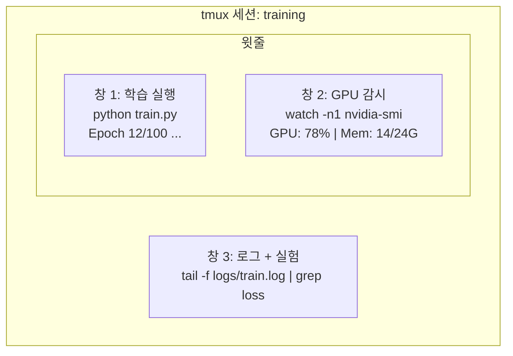

> 🇰🇷 이 문서는 한국어 번역본입니다(ELI5 스타일). 원문: [en.md](en.md)

# 터미널과 셸 (Terminal & Shell)

> 터미널은 AI 엔지니어가 사는 곳입니다. 이곳에 익숙해지세요.

**유형:** Learn
**언어:** --
**선수 지식:** 페이즈 0, 레슨 01
**소요 시간:** 약 35분

## 학습 목표

- 파이프, 리다이렉트, `grep`으로 명령 줄에서 학습 로그를 걸러내고 처리하기
- 동시 학습과 GPU 감시를 위해 여러 창(pane)을 가진 영속 tmux 세션 만들기
- `htop`, `nvtop`, `nvidia-smi`로 시스템과 GPU 자원 감시하기
- SSH, `scp`, `rsync`로 로컬과 원격 머신 사이에서 파일 전송하기

## 문제 상황

여러분은 어떤 에디터보다 터미널에서 더 많은 시간을 보내게 됩니다. 학습 실행, GPU 감시, 로그 추적, 원격 SSH 세션, 환경 관리까지. 모든 AI 워크플로는 셸을 거칩니다. 여기가 느리면 어디서든 느립니다.

이 레슨은 AI 작업에 중요한 터미널 스킬만 다룹니다. 유닉스 역사도, Bash 스크립트 심화도 없습니다. 필요한 것만 담았습니다.

## 개념



동시에 돌아가는 세 가지 작업. 터미널 하나로 관리합니다. 분리(detach)하고, 집에 가고, 다시 SSH로 접속해 재접속(reattach)해도 학습은 계속 돌아갑니다.

```figure
s0-shell-pipeline
```

## 직접 만들어 보기

### 단계 1: 내 셸 알기

어떤 셸을 쓰는지 확인:

```bash
echo $SHELL
```

대부분 `bash`나 `zsh`입니다. 둘 다 잘 동작하고, 이 코스의 명령어는 어느 쪽에서든 통합니다.

꼭 알아야 할 것들:

```bash
# 이동하기
cd ~/projects/ai-engineering-from-scratch
pwd
ls -la

# 히스토리 검색 (배우게 될 가장 유용한 단축키)
# Ctrl+R을 누르고 이전 명령어의 일부를 입력
# Ctrl+R을 다시 누르면 일치 항목 사이를 순환

# 터미널 지우기
clear   # 또는 Ctrl+L

# 실행 중인 명령어 취소
# Ctrl+C

# 실행 중인 명령어 잠시 중단 (fg로 재개)
# Ctrl+Z
```

### 단계 2: 파이프와 리다이렉트

파이프는 명령어들을 연결합니다. 로그 처리, 출력 필터링, 도구 연쇄가 모두 이 방식입니다. 끊임없이 쓰게 됩니다.

```bash
# 로그에 "loss"가 몇 번 나오는지 세기
cat train.log | grep "loss" | wc -l

# 학습 출력에서 loss 값만 추출하기
grep "loss:" train.log | awk '{print $NF}' > losses.txt

# 로그 파일을 실시간으로 지켜보며 오류만 걸러내기
tail -f train.log | grep --line-buffered "ERROR"

# 실험을 최종 정확도 기준으로 정렬하기
grep "final_accuracy" results/*.log | sort -t= -k2 -n -r

# stdout과 stderr를 서로 다른 파일로 보내기
python train.py > output.log 2> errors.log

# 둘 다 같은 파일로 보내기
python train.py > train_full.log 2>&1
```

필요한 리다이렉트는 다음과 같습니다:

| 기호 | 하는 일 |
|--------|-------------|
| `>` | stdout을 파일에 쓰기 (덮어쓰기) |
| `>>` | stdout을 파일에 추가하기 |
| `2>` | stderr를 파일에 쓰기 |
| `2>&1` | stderr를 stdout과 같은 곳으로 보내기 |
| `\|` | 한 명령어의 stdout을 다음 명령어의 stdin으로 보내기 |

### 단계 3: 백그라운드 프로세스

학습 실행은 몇 시간씩 걸립니다. 그동안 터미널을 열어 둘 필요는 없죠.

```bash
# 백그라운드에서 실행 (출력은 여전히 터미널로)
python train.py &

# 백그라운드 실행 + 연결 끊김 면역 (터미널을 닫아도 죽지 않음)
nohup python train.py > train.log 2>&1 &

# 백그라운드에서 무엇이 돌고 있는지 확인
jobs
ps aux | grep train.py

# 백그라운드 작업을 포그라운드로 가져오기
fg %1

# 백그라운드 프로세스 죽이기
kill %1
# 또는 PID를 찾아 죽이기
kill $(pgrep -f "train.py")
```

`&`, `nohup`, `screen`/`tmux`의 차이:

| 방식 | 터미널을 닫아도 살아남나? | 다시 붙일 수 있나? |
|--------|-------------------------|---------------|
| `command &` | 아니요 | 아니요 |
| `nohup command &` | 예 | 아니요 (로그 파일 확인) |
| `screen` / `tmux` | 예 | 예 |

몇 분 이상 걸리는 작업이라면 tmux를 쓰세요.

### 단계 4: tmux

tmux는 여러 창을 가진 영속적인 터미널 세션을 만들어 줍니다. 학습 실행 관리에 가장 유용한 도구 하나를 꼽으라면 이것입니다.

```bash
# 설치
# macOS
brew install tmux
# Ubuntu
sudo apt install tmux

# 이름 붙은 세션 시작
tmux new -s training

# 가로 분할
# Ctrl+B 누른 뒤 "

# 세로 분할
# Ctrl+B 누른 뒤 %

# 창 사이 이동
# Ctrl+B 누른 뒤 방향키

# 분리 (세션은 계속 실행됨)
# Ctrl+B 누른 뒤 d

# 다시 붙이기
tmux attach -t training

# 세션 목록
tmux ls

# 세션 종료
tmux kill-session -t training
```

전형적인 AI 워크플로 세션:

```bash
tmux new -s train

# 창 1: 학습 시작
python train.py --epochs 100 --lr 1e-4

# Ctrl+B, "로 분할한 뒤 GPU 감시 실행
watch -n1 nvidia-smi

# Ctrl+B, %로 세로 분할한 뒤 로그 추적
tail -f logs/experiment.log

# 이제 Ctrl+B, d로 분리
# SSH를 끊고, 커피를 마시러 가고, 돌아와서
# tmux attach -t train
```

### 단계 5: htop과 nvtop으로 감시하기

```bash
# 시스템 프로세스 (top보다 나음)
htop

# GPU 프로세스 (NVIDIA GPU가 있다면)
# 설치: sudo apt install nvtop (Ubuntu) 또는 brew install nvtop (macOS)
nvtop

# nvtop 없이 빠르게 GPU 확인
nvidia-smi

# GPU 사용량을 1초마다 갱신하며 보기
watch -n1 nvidia-smi

# 어떤 프로세스가 GPU를 쓰는지 보기
nvidia-smi --query-compute-apps=pid,name,used_memory --format=csv
```

자주 쓰게 될 `htop` 단축키:
- `F6` 또는 `>`로 열 기준 정렬 (메모리 기준 정렬로 메모리 누수 찾기)
- `F5`로 트리 뷰 토글 (자식 프로세스 확인)
- `F9`로 프로세스 죽이기
- `/`로 프로세스 이름 검색

### 단계 6: 원격 GPU 장비를 위한 SSH

클라우드 GPU(Lambda, RunPod, Vast.ai)를 빌리면 SSH로 접속합니다.

```bash
# 기본 연결
ssh user@gpu-box-ip

# 특정 키로 접속
ssh -i ~/.ssh/my_gpu_key user@gpu-box-ip

# 원격으로 파일 복사
scp model.pt user@gpu-box-ip:~/models/

# 원격에서 파일 가져오기
scp user@gpu-box-ip:~/results/metrics.json ./

# 디렉터리 전체 동기화 (파일이 많으면 더 빠름)
rsync -avz ./data/ user@gpu-box-ip:~/data/

# 포트 포워딩 (원격 Jupyter/TensorBoard를 로컬에서 접근)
ssh -L 8888:localhost:8888 user@gpu-box-ip
# 이제 브라우저에서 localhost:8888을 열기

# 편의를 위한 SSH 설정
# ~/.ssh/config에 추가:
# Host gpu
#     HostName 192.168.1.100
#     User ubuntu
#     IdentityFile ~/.ssh/gpu_key
#
# 그러면 그냥:
# ssh gpu
```

### 단계 7: AI 작업에 유용한 별칭(alias)

`~/.bashrc`나 `~/.zshrc`에 추가하세요:

```bash
source phases/00-setup-and-tooling/10-terminal-and-shell/code/shell_aliases.sh
```

원하는 것만 골라 복사해도 됩니다. 핵심 별칭:

```bash
# GPU 상태 한눈에 보기
alias gpu='nvidia-smi --query-gpu=index,name,utilization.gpu,memory.used,memory.total,temperature.gpu --format=csv,noheader'

# Python 학습 프로세스 전부 죽이기
alias killtraining='pkill -f "python.*train"'

# 가상 환경 빠르게 활성화
alias ae='source .venv/bin/activate'

# 학습 loss 지켜보기
alias watchloss='tail -f logs/*.log | grep --line-buffered "loss"'
```

전체 목록은 `code/shell_aliases.sh`를 참고하세요.

### 단계 8: 자주 쓰는 AI 터미널 패턴

실전에서 계속 등장하는 명령어들:

```bash
# 학습을 실행하고, 전부 로그로 남기고, 끝나면 알림 받기
python train.py 2>&1 | tee train.log; echo "DONE" | mail -s "Training complete" you@email.com

# 두 실험 로그를 나란히 비교하기
diff <(grep "accuracy" exp1.log) <(grep "accuracy" exp2.log)

# 가장 큰 모델 파일 찾기 (디스크 공간 정리)
find . -name "*.pt" -o -name "*.safetensors" | xargs du -h | sort -rh | head -20

# Hugging Face에서 모델 내려받기
wget https://huggingface.co/model/resolve/main/model.safetensors

# 데이터셋 압축 풀기
tar xzf dataset.tar.gz -C ./data/

# 모든 Python 파일의 줄 수 세기 (프로젝트가 얼마나 커졌는지 보기)
find . -name "*.py" | xargs wc -l | tail -1

# 디스크 공간 확인 (학습 데이터는 디스크를 빠르게 채웁니다)
df -h
du -sh ./data/*

# 학습 전 환경 변수 확인
env | grep -i cuda
env | grep -i torch
```

## 사용해 보기

이 코스에서 각 도구가 등장하는 시점:

| 도구 | 사용 시점 |
|------|----------------|
| tmux | 모든 학습 실행 (페이즈 3+) |
| `tail -f` + `grep` | 학습 로그 감시 |
| `nohup` / `&` | 빠른 백그라운드 작업 |
| `htop` / `nvtop` | 느린 학습 디버깅, OOM 오류 |
| SSH + `rsync` | 클라우드 GPU에서 작업 |
| 파이프 + 리다이렉트 | 실험 결과 처리 |
| 별칭(alias) | 반복 명령어 시간 절약 |

## 연습 문제

1. tmux를 설치하고 창 세 개를 가진 세션을 만든 뒤, 하나에서 `htop`, 다른 하나에서 `watch -n1 date`, 마지막에서 Python 스크립트를 실행하기. 분리했다가 다시 붙여 보기
2. `code/shell_aliases.sh`의 별칭을 자신의 셸 설정에 추가하고 `source ~/.zshrc`(또는 `~/.bashrc`)로 다시 불러오기
3. `for i in $(seq 1 100); do echo "epoch $i loss: $(echo "scale=4; 1/$i" | bc)"; sleep 0.1; done > fake_train.log`로 가짜 학습 로그를 만들고, `grep`, `tail`, `awk`로 loss 값만 추출하기
4. 접근할 수 있는 서버용 SSH 설정 항목을 만들어 보기 (문법 연습은 `localhost`로 해도 됩니다)

## 핵심 용어

| 용어 | 사람들이 말하는 것 | 실제 의미 |
|------|----------------|----------------------|
| 셸(Shell) | "터미널" | 명령어를 해석하는 프로그램 (bash, zsh, fish) |
| tmux | "터미널 멀티플렉서" | 하나의 창 안에서 여러 터미널 세션을 돌리고 분리/재접속을 가능하게 하는 프로그램 |
| 파이프(Pipe) | "그 세로줄 기호" | 한 명령어의 출력을 다른 명령어의 입력으로 보내는 `\|` 연산자 |
| PID | "프로세스 ID" | 실행 중인 모든 프로세스에 부여되는 고유 번호. 감시하거나 죽일 때 사용한다 |
| nohup | "no hangup" | 연결 끊김(hangup) 신호에 면역인 상태로 명령을 실행해, 터미널을 닫아도 죽지 않게 한다 |
| SSH | "서버에 접속" | Secure Shell. 원격 머신에서 명령을 실행하기 위한 암호화 프로토콜 |
