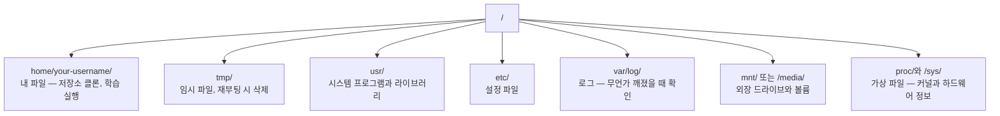

> 🇰🇷 이 문서는 한국어 번역본입니다(ELI5 스타일). 원문: [en.md](en.md)

# AI를 위한 Linux (Linux for AI)

> 대부분의 AI는 Linux에서 돌아갑니다. 막히지 않을 정도는 알아야 합니다.

**유형:** Learn
**언어:** --
**선수 지식:** 페이즈 0, 레슨 01
**소요 시간:** 약 30분

## 학습 목표

- Linux 파일시스템을 탐색하고 명령 줄에서 필수 파일 작업 수행하기
- `chmod`와 `chown`으로 파일 권한을 관리해 "Permission denied" 오류 해결하기
- `apt`로 시스템 패키지를 설치하고 AI 작업용 새 GPU 장비 준비하기
- 원격 머신에서 작업하는 개발자를 흔히 곤란하게 만드는 macOS-Linux 차이 파악하기

## 문제 상황

여러분은 macOS나 Windows에서 개발합니다. 하지만 클라우드 GPU 장비에 SSH로 접속하거나, Lambda 인스턴스를 빌리거나, EC2 머신을 띄우는 순간 Ubuntu 안에 들어서게 됩니다. 터미널이 유일한 인터페이스죠. Finder도, 탐색기도, GUI도 없습니다. 명령 줄에서 파일시스템을 탐색하고, 패키지를 설치하고, 프로세스를 관리하지 못하면 "리눅스에서 파일 압축 푸는 법"을 검색하느라 GPU 시간을 헛되이 지불하는 신세가 됩니다.

이것은 생존 가이드입니다. AI 작업을 위해 원격 Linux 머신에서 동작하는 데 필요한 내용만 정확히 담습니다. 그 이상도 이하도 아닙니다.

## 파일시스템 구조

Linux는 모든 것을 하나의 루트 `/` 아래에 둡니다. `C:\`도 `/Volumes`도 없습니다. 실제로 만지게 될 디렉터리:



여러분의 홈 디렉터리는 `~` 또는 `/home/your-username`입니다. 하는 일의 거의 전부가 여기서 일어납니다.

## 필수 명령어

원격 GPU 장비에서 하는 일의 95%를 커버하는 15개 명령어입니다.

### 이동하기

```bash
pwd                         # 나 지금 어디 있지?
ls                          # 여기 뭐가 있지?
ls -la                      # 여기 뭐가 있지? 숨김 파일과 상세 정보 포함
cd /path/to/dir             # 그곳으로 가기
cd ~                        # 집(홈)으로 가기
cd ..                       # 한 단계 위로
```

### 파일과 디렉터리

```bash
mkdir my-project            # 디렉터리 만들기
mkdir -p a/b/c              # 중첩된 디렉터리를 한 번에 만들기

cp file.txt backup.txt      # 파일 복사
cp -r src/ src-backup/      # 디렉터리 복사 (재귀)

mv old.txt new.txt          # 파일 이름 바꾸기
mv file.txt /tmp/           # 파일 옮기기

rm file.txt                 # 파일 삭제 (휴지통 없음, 그냥 사라짐)
rm -rf my-dir/              # 디렉터리와 안의 모든 것 삭제
```

`rm -rf`는 영구 삭제입니다. 되돌릴 수 없습니다. 엔터를 치기 전에 경로를 두 번 확인하세요.

### 파일 읽기

```bash
cat file.txt                # 파일 전체 출력
head -20 file.txt           # 처음 20줄
tail -20 file.txt           # 마지막 20줄
tail -f log.txt             # 로그 파일을 실시간으로 따라가기 (멈추려면 Ctrl+C)
less file.txt               # 파일을 스크롤하며 보기 (나가려면 q)
```

### 검색

```bash
grep "error" training.log           # "error"가 포함된 줄 찾기
grep -r "learning_rate" .           # 현재 디렉터리의 모든 파일에서 검색
grep -i "cuda" config.yaml          # 대소문자 구분 없이 검색

find . -name "*.py"                 # 현재 디렉터리 아래의 모든 Python 파일 찾기
find . -name "*.ckpt" -size +1G     # 1GB보다 큰 체크포인트 파일 찾기
```

## 권한

Linux의 모든 파일에는 소유자와 권한 비트가 있습니다. 스크립트가 실행되지 않거나 디렉터리에 쓰지 못할 때 만나게 됩니다.

```bash
ls -l train.py
# -rwxr-xr-- 1 user group 2048 Mar 19 10:00 train.py
#  ^^^             소유자 권한: 읽기, 쓰기, 실행
#     ^^^          그룹 권한: 읽기, 실행
#        ^^        그 외 모두: 읽기 전용
```

흔한 해결책:

```bash
chmod +x train.sh           # 스크립트를 실행 가능하게 만들기
chmod 755 deploy.sh         # 소유자: 전체, 그 외: 읽기+실행
chmod 644 config.yaml       # 소유자: 읽기+쓰기, 그 외: 읽기 전용

chown user:group file.txt   # 파일 소유자 바꾸기 (sudo 필요)
```

"Permission denied"라는 말이 나오면 거의 항상 권한 문제입니다. `chmod +x`나 `sudo`로 대부분 해결됩니다.

## 패키지 관리 (apt)

Ubuntu는 `apt`를 사용합니다. 시스템 수준 소프트웨어를 설치하는 방법입니다.

```bash
sudo apt update             # 패키지 목록 새로 고침 (항상 먼저 하기)
sudo apt install -y htop    # 패키지 설치 (-y는 확인 질문 생략)
sudo apt install -y build-essential  # C 컴파일러, make 등. 많은 Python 패키지에 필요
sudo apt install -y tmux    # 터미널 멀티플렉서 (연결이 끊겨도 세션 유지)

apt list --installed        # 무엇이 설치되어 있지?
sudo apt remove htop        # 삭제
```

새 GPU 장비에서 흔히 설치하는 패키지:

```bash
sudo apt update && sudo apt install -y \
    build-essential \
    git \
    curl \
    wget \
    tmux \
    htop \
    unzip \
    python3-venv
```

## 사용자와 sudo

보통 일반 사용자로 로그인합니다. 어떤 작업은 루트(관리자) 권한이 필요하죠.

```bash
whoami                      # 나 어떤 사용자지?
sudo command                # 명령 하나를 루트로 실행
sudo su                     # 루트가 되기 (exit로 돌아옴, 아껴 쓸 것)
```

클라우드 GPU 인스턴스에서는 보통 유일한 사용자이며 이미 sudo 권한이 있습니다. 모든 것을 루트로 실행하지 마세요. 필요할 때만 sudo를 쓰세요.

## 프로세스와 systemd

학습이 멈추거나 무엇이 돌고 있는지 확인해야 할 때:

```bash
htop                        # 대화형 프로세스 뷰어 (나가려면 q)
ps aux | grep python        # 실행 중인 Python 프로세스 찾기
kill 12345                  # PID 12345 프로세스를 정상 종료
kill -9 12345               # 강제 종료 (정상 종료가 안 될 때 사용)
nvidia-smi                  # GPU 프로세스와 메모리 사용량
```

systemd는 서비스(백그라운드 데몬)를 관리합니다. 추론 서버를 돌릴 때 사용하게 됩니다:

```bash
sudo systemctl start nginx          # 서비스 시작
sudo systemctl stop nginx           # 중지
sudo systemctl restart nginx        # 재시작
sudo systemctl status nginx         # 돌고 있는지 확인
sudo systemctl enable nginx         # 부팅 시 자동 시작
```

## 디스크 공간

GPU 장비는 디스크 공간이 부족한 경우가 많습니다. 모델과 데이터셋이 빠르게 채워 버리죠.

```bash
df -h                       # 마운트된 모든 드라이브의 디스크 사용량
df -h /home                 # /home의 디스크 사용량만

du -sh *                    # 현재 디렉터리 항목별 크기
du -sh ~/.cache             # 캐시 크기 (pip, huggingface 모델이 여기 쌓임)
du -sh /data/checkpoints/   # 체크포인트가 얼마나 큰지 확인

# 공간을 가장 많이 잡아먹는 것 찾기
du -h --max-depth=1 / 2>/dev/null | sort -hr | head -20
```

흔한 공간 확보 방법:

```bash
# pip 캐시 비우기
pip cache purge

# apt 캐시 비우기
sudo apt clean

# 필요 없는 오래된 체크포인트 제거
rm -rf checkpoints/epoch_01/ checkpoints/epoch_02/
```

## 네트워킹

명령 줄에서 모델을 내려받고, 파일을 전송하고, API를 호출하게 됩니다.

```bash
# 파일 내려받기
wget https://example.com/model.bin                   # 파일 다운로드
curl -O https://example.com/data.tar.gz              # curl로 같은 일 하기
curl -s https://api.example.com/health | python3 -m json.tool  # API 호출, JSON 보기 좋게 출력

# 머신 사이 파일 전송
scp model.bin user@remote:/data/                     # 원격 머신으로 파일 복사
scp user@remote:/data/results.csv .                  # 원격에서 로컬로 파일 복사
scp -r user@remote:/data/checkpoints/ ./local-dir/   # 디렉터리 복사

# 디렉터리 동기화 (대용량 전송엔 scp보다 빠르고, 실패 시 이어서 전송)
rsync -avz --progress ./data/ user@remote:/data/
rsync -avz --progress user@remote:/results/ ./results/
```

큰 파일에는 `scp` 대신 `rsync`를 사용하세요. 변경된 바이트만 전송하고 끊긴 연결도 처리합니다.

## tmux: 세션 유지하기

원격 장비에 SSH로 접속한 상태에서 노트북을 닫으면 학습 실행이 죽습니다. tmux가 이를 막아 줍니다.

```bash
tmux new -s train           # "train"이라는 새 세션 시작
# ... 학습을 시작한 뒤:
# Ctrl+B, 그다음 D          # 분리 (학습은 계속 실행됨)

tmux ls                     # 세션 목록
tmux attach -t train        # 세션에 다시 붙기

# tmux 안에서:
# Ctrl+B, 그다음 %          # 창을 세로로 분할
# Ctrl+B, 그다음 "          # 창을 가로로 분할
# Ctrl+B, 그다음 방향키      # 창 사이 전환
```

긴 학습 작업은 반드시 tmux 안에서 실행하세요. 반드시요.

## Windows 사용자를 위한 WSL2

Windows 사용자라면 WSL2로 듀얼 부팅 없이 진짜 Linux 환경을 쓸 수 있습니다.

```bash
# PowerShell (관리자)에서
wsl --install -d Ubuntu-24.04

# 재시작 후 시작 메뉴에서 Ubuntu 열기
sudo apt update && sudo apt upgrade -y
```

WSL2는 진짜 Linux 커널을 실행합니다. 이 레슨의 모든 내용이 그 안에서 동작합니다. Windows 파일은 WSL 안에서 `/mnt/c/Users/YourName/`에 있습니다.

GPU 패스스루는 Windows 쪽에 설치된 NVIDIA 드라이버로 동작합니다. Windows용 NVIDIA 드라이버를 설치하면(Linux용이 아니라) WSL2 안에서 CUDA를 사용할 수 있습니다.

## 주의점: macOS에서 Linux로

macOS에 익숙하다면 다음 것들이 발목을 잡을 수 있습니다:

| macOS | Linux | 비고 |
|-------|-------|-------|
| `brew install` | `sudo apt install` | 패키지 이름이 다를 때가 있다. `brew install htop`과 `sudo apt install htop`은 같지만, `brew install readline`과 `sudo apt install libreadline-dev`은 다르다. |
| `open file.txt` | `xdg-open file.txt` | 하지만 원격 장비에는 GUI가 없다. `cat`이나 `less`를 쓸 것. |
| `pbcopy` / `pbpaste` | 없음 | SSH 환경에서는 클립보드 파이프가 존재하지 않는다. |
| `~/.zshrc` | `~/.bashrc` | macOS는 기본이 zsh. 대부분의 Linux 서버는 bash를 쓴다. |
| `/opt/homebrew/` | `/usr/bin/`, `/usr/local/bin/` | 실행 파일이 사는 위치가 다르다. |
| `sed -i '' 's/a/b/' file` | `sed -i 's/a/b/' file` | macOS sed는 `-i` 뒤에 빈 문자열이 필요하다. Linux는 아니다. |
| 대소문자 구분 없는 파일시스템 | 대소문자 구분 파일시스템 | Linux에서 `Model.py`와 `model.py`는 서로 다른 파일이다. |
| 줄바꿈 `\n` | 줄바꿈 `\n` | 동일. 하지만 Windows는 `\r\n`을 써서 bash 스크립트를 깨뜨린다. `dos2unix`로 고칠 것. |

## 빠른 참조 카드

```
탐색:          pwd, ls, cd, find
파일:          cp, mv, rm, mkdir, cat, head, tail, less
검색:          grep, find
권한:          chmod, chown, sudo
패키지:        apt update, apt install
프로세스:      htop, ps, kill, nvidia-smi
서비스:        systemctl start/stop/restart/status
디스크:        df -h, du -sh
네트워크:      curl, wget, scp, rsync
세션:          tmux new/attach/detach
```

```figure
s0-process-fork
```

## 연습 문제

1. 아무 Linux 머신에 SSH로 접속하거나(또는 WSL2를 열고) 홈 디렉터리로 이동하기. 프로젝트 폴더를 만들고, 그 안에 `touch`로 빈 파일 세 개를 만든 뒤 `ls -la`로 목록 확인하기
2. apt로 `htop`을 설치하고 실행해 가장 많은 메모리를 쓰는 프로세스 찾아 보기
3. tmux 세션을 시작하고 그 안에서 `sleep 300`을 실행한 뒤, 분리하고, 세션 목록을 보고, 다시 붙어 보기
4. `df -h`로 남은 디스크 공간을 확인한 뒤 `du -sh ~/.cache/*`로 캐시에서 무엇이 공간을 차지하는지 찾아 보기
5. `scp`로 로컬 머신에서 원격으로 파일을 전송해 보고, 같은 전송을 `rsync`로 해 보며 차이 비교하기
