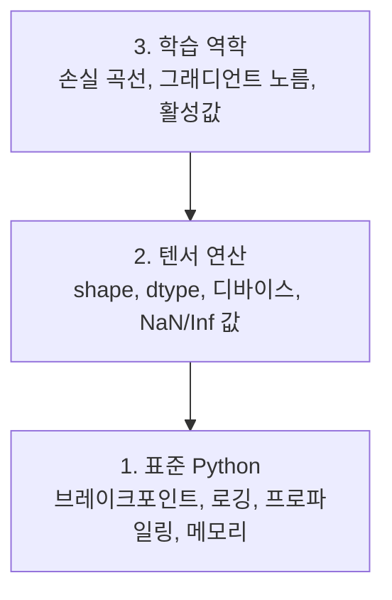

> 🇰🇷 이 문서는 한국어 번역본입니다(ELI5 스타일). 원문: [en.md](en.md)

# 디버깅과 프로파일링 (Debugging and Profiling)

> 최악의 AI 버그는 크래시가 나지 않습니다. 쓰레기 데이터 위에서 조용히 학습한 뒤 아름다운 손실 곡선을 보고하죠.

**유형:** Build
**언어:** Python
**선수 지식:** 레슨 1 (개발 환경), PyTorch 기초 지식
**소요 시간:** 약 60분

## 학습 목표

- 조건부 `breakpoint()`와 `debug_print`로 학습 도중에 텐서 shape, dtype, NaN 값을 들여다보기
- `cProfile`, `line_profiler`, `tracemalloc`으로 학습 루프를 프로파일링해 병목 찾기
- 흔한 AI 버그 감지하기: shape 불일치, NaN 손실, 데이터 누수, 잘못된 디바이스의 텐서
- TensorBoard를 설정해 손실 곡선, 가중치 히스토그램, 그래디언트 분포 시각화하기

## 문제 상황

AI 코드는 일반 코드와 다른 방식으로 실패합니다. 웹 앱은 스택 트레이스와 함께 크래시가 납니다. 하지만 잘못 설정된 학습 루프는 8시간을 돌고 GPU 비용 200달러를 태운 뒤, 모든 입력에 대해 평균만 내놓는 모델을 만들어 냅니다. 코드는 한 번도 오류를 내지 않았죠. 버그는 잘못된 디바이스의 텐서, 잊어버린 `.detach()`, 특성(feature)에 새어 들어간 레이블이었습니다.

이런 조용한 실패가 시간과 컴퓨팅 자원을 낭비하기 전에 잡아낼 디버깅 도구가 필요합니다.

## 개념

AI 디버깅은 세 개의 층에서 이루어집니다:



대부분의 사람은 3층(TensorBoard 응시)으로 바로 달려갑니다. 하지만 AI 버그의 80%는 1층과 2층에 있습니다.

```figure
s0-flame-hot
```

## 직접 만들어 보기

### 파트 1: print 디버깅 (네, 이게 됩니다)

print 디버깅은 무시당하기 쉽습니다. 하지만 그래선 안 됩니다. 텐서 코드에서는 정확히 겨냥한 print 한 줄이 디버거 스텝 진행보다 나을 때가 많습니다. shape, dtype, 값 범위를 한꺼번에 봐야 하니까요.

```python
def debug_print(name, tensor):
    print(f"{name}: shape={tensor.shape}, dtype={tensor.dtype}, "
          f"device={tensor.device}, "
          f"min={tensor.min().item():.4f}, max={tensor.max().item():.4f}, "
          f"mean={tensor.mean().item():.4f}, "
          f"has_nan={tensor.isnan().any().item()}")
```

수상한 연산 뒤마다 이 함수를 호출하세요. 버그를 찾으면 print를 지우면 됩니다. 간단하죠.

### 파트 2: Python 디버거 (pdb와 breakpoint)

내장 디버거는 AI 작업에서 과소평가됩니다. 학습 루프에 `breakpoint()`를 심어 두고 텐서를 대화형으로 들여다보세요.

```python
def training_step(model, batch, criterion, optimizer):
    inputs, labels = batch
    outputs = model(inputs)
    loss = criterion(outputs, labels)

    if loss.item() > 100 or torch.isnan(loss):
        breakpoint()

    loss.backward()
    optimizer.step()
```

디버거가 멈춰 주면 유용한 명령어:

- `p outputs.shape` — shape 확인
- `p loss.item()` — 손실 값 보기
- `p torch.isnan(outputs).sum()` — NaN 개수 세기
- `p model.fc1.weight.grad` — 그래디언트 확인
- `c` — 계속 진행, `q` — 종료

이것이 조건부 디버깅입니다. 뭔가 이상해 보일 때만 멈춥니다. 1만 스텝짜리 학습이라면 이 차이가 큽니다.

### 파트 3: Python 로깅

간단한 확인을 넘어선 디버깅이라면 print 대신 로깅을 쓰세요.

```python
import logging

logging.basicConfig(
    level=logging.INFO,
    format="%(asctime)s [%(levelname)s] %(message)s",
    handlers=[
        logging.FileHandler("training.log"),
        logging.StreamHandler()
    ]
)
logger = logging.getLogger(__name__)

logger.info("Starting training: lr=%.4f, batch_size=%d", lr, batch_size)
logger.warning("Loss spike detected: %.4f at step %d", loss.item(), step)
logger.error("NaN loss at step %d, stopping", step)
```

로깅은 타임스탬프, 심각도 수준, 파일 출력을 제공합니다. 새벽 3시에 학습이 실패했을 때 필요한 건 화면에서 흘러가 버린 터미널 출력이 아니라 로그 파일입니다.

### 파트 4: 코드 구간 시간 측정

시간이 어디로 가는지 아는 것이 최적화의 첫걸음입니다.

```python
import time

class Timer:
    def __init__(self, name=""):
        self.name = name

    def __enter__(self):
        self.start = time.perf_counter()
        return self

    def __exit__(self, *args):
        elapsed = time.perf_counter() - self.start
        print(f"[{self.name}] {elapsed:.4f}s")

with Timer("data loading"):
    batch = next(dataloader_iter)

with Timer("forward pass"):
    outputs = model(batch)

with Timer("backward pass"):
    loss.backward()
```

흔한 발견: 데이터 로딩이 학습 시간의 60%를 차지합니다. 해결책은 더 빠른 GPU가 아니라 DataLoader의 `num_workers > 0`입니다.

### 파트 5: cProfile과 line_profiler

손으로 만든 타이머 이상이 필요할 때:

```bash
python -m cProfile -s cumtime train.py
```

모든 함수 호출을 누적 시간 순으로 보여줍니다. 줄 단위 프로파일링은:

```bash
pip install line_profiler
```

```python
@profile
def train_step(model, data, target):
    output = model(data)
    loss = F.cross_entropy(output, target)
    loss.backward()
    return loss

# 실행: kernprof -l -v train.py
```

### 파트 6: 메모리 프로파일링

#### tracemalloc으로 CPU 메모리 측정

```python
import tracemalloc

tracemalloc.start()

# 여기에 내 코드
model = build_model()
data = load_dataset()

snapshot = tracemalloc.take_snapshot()
top_stats = snapshot.statistics("lineno")
for stat in top_stats[:10]:
    print(stat)
```

#### memory_profiler로 CPU 메모리 측정

```bash
pip install memory_profiler
```

```python
from memory_profiler import profile

@profile
def load_data():
    raw = read_csv("data.csv")       # 여기서 메모리가 튀는 걸 지켜보기
    processed = preprocess(raw)       # 그리고 여기서도
    return processed
```

`python -m memory_profiler your_script.py`로 실행하면 줄 단위 메모리 사용량을 볼 수 있습니다.

#### PyTorch로 GPU 메모리 측정

```python
import torch

if torch.cuda.is_available():
    print(torch.cuda.memory_summary())

    print(f"Allocated: {torch.cuda.memory_allocated() / 1e9:.2f} GB")
    print(f"Cached: {torch.cuda.memory_reserved() / 1e9:.2f} GB")
```

OOM(메모리 부족)을 만났을 때:

1. 배치 크기 줄이기 (항상 가장 먼저 시도할 것)
2. `torch.cuda.empty_cache()`로 캐시된 메모리 해제하기
3. 큰 중간 결과물은 `del tensor` 후 `torch.cuda.empty_cache()` 실행하기
4. 혼합 정밀도(`torch.cuda.amp`)로 메모리 사용량 절반으로 줄이기
5. 아주 깊은 모델은 그래디언트 체크포인팅 사용하기

### 파트 7: 흔한 AI 버그와 잡는 법

#### Shape 불일치

가장 빈번한 버그입니다. 모델은 `[batch, channels, height, width]`를 기대하는데 텐서가 `[batch, features]`인 경우죠.

```python
def check_shapes(model, sample_input):
    print(f"Input: {sample_input.shape}")
    hooks = []

    def make_hook(name):
        def hook(module, inp, out):
            in_shape = inp[0].shape if isinstance(inp, tuple) else inp.shape
            out_shape = out.shape if hasattr(out, "shape") else type(out)
            print(f"  {name}: {in_shape} -> {out_shape}")
        return hook

    for name, module in model.named_modules():
        hooks.append(module.register_forward_hook(make_hook(name)))

    with torch.no_grad():
        model(sample_input)

    for h in hooks:
        h.remove()
```

샘플 배치로 한 번만 실행해 보세요. 모델 안의 모든 shape 변환이 지도처럼 펼쳐집니다.

#### NaN 손실

NaN 손실은 무언가가 폭발했다는 뜻입니다. 흔한 원인:

- 학습률이 너무 높음
- 커스텀 손실 함수의 0으로 나누기
- 0이나 음수의 로그
- RNN의 그래디언트 폭발

```python
def detect_nan(model, loss, step):
    if torch.isnan(loss):
        print(f"NaN loss at step {step}")
        for name, param in model.named_parameters():
            if param.grad is not None:
                if torch.isnan(param.grad).any():
                    print(f"  NaN gradient in {name}")
                if torch.isinf(param.grad).any():
                    print(f"  Inf gradient in {name}")
        return True
    return False
```

#### 데이터 누수

테스트셋에서 99% 정확도가 나옵니다. 멋져 보이지만 버그입니다.

```python
def check_data_leakage(train_set, test_set, id_column="id"):
    train_ids = set(train_set[id_column].tolist())
    test_ids = set(test_set[id_column].tolist())
    overlap = train_ids & test_ids
    if overlap:
        print(f"DATA LEAKAGE: {len(overlap)} samples in both train and test")
        return True
    return False
```

시간적 누수도 확인하세요: 미래 데이터로 과거를 예측하는 겁니다. 분할하기 전에 타임스탬프로 정렬하세요.

#### 잘못된 디바이스

서로 다른 디바이스의 텐서(CPU vs GPU)는 런타임 오류를 일으킵니다. 하지만 가끔은 텐서 하나가 조용히 CPU에 남아 나머지는 전부 GPU에 있는 경우도 있습니다. 이때는 학습이 그냥 느릴 뿐입니다.

```python
def check_devices(model, *tensors):
    model_device = next(model.parameters()).device
    print(f"Model device: {model_device}")
    for i, t in enumerate(tensors):
        if t.device != model_device:
            print(f"  WARNING: tensor {i} on {t.device}, model on {model_device}")
```

### 파트 8: TensorBoard 기초

TensorBoard는 학습 내부에서 시간이 지나며 무슨 일이 일어나는지 보여줍니다.

```bash
pip install tensorboard
```

```python
from torch.utils.tensorboard import SummaryWriter

writer = SummaryWriter("runs/experiment_1")

for step in range(num_steps):
    loss = train_step(model, batch)

    writer.add_scalar("loss/train", loss.item(), step)
    writer.add_scalar("lr", optimizer.param_groups[0]["lr"], step)

    if step % 100 == 0:
        for name, param in model.named_parameters():
            writer.add_histogram(f"weights/{name}", param, step)
            if param.grad is not None:
                writer.add_histogram(f"grads/{name}", param.grad, step)

writer.close()
```

실행:

```bash
tensorboard --logdir=runs
```

살펴볼 것:

- **손실이 줄지 않음**: 학습률이 너무 낮거나 모델 구조 문제
- **손실이 크게 오르내림**: 학습률이 너무 높음
- **손실이 NaN으로 감**: 수치 불안정 (위의 NaN 절 참고)
- **학습 손실은 줄고 검증 손실은 늘어남**: 과적합
- **가중치 히스토그램이 0으로 수렴**: 그래디언트 소실
- **그래디언트 히스토그램이 폭발**: 그래디언트 클리핑 필요

### 파트 9: VS Code 디버거

대화형 디버깅을 원한다면 `launch.json`으로 VS Code를 설정하세요:

```json
{
    "version": "0.2.0",
    "configurations": [
        {
            "name": "Debug Training",
            "type": "debugpy",
            "request": "launch",
            "program": "${file}",
            "console": "integratedTerminal",
            "justMyCode": false
        }
    ]
}
```

줄번호 옆 여백을 클릭해 브레이크포인트를 설정하세요. 변수(Variables) 패널로 텐서 속성을 들여다보고, 디버그 콘솔에서 실행 도중에 임의의 Python 표현식을 돌릴 수도 있습니다.

데이터 전처리 파이프라인을 한 단계씩 밟으며 각 변환을 지켜보고 싶을 때 유용합니다.

## 사용해 보기

대부분의 AI 버그를 잡아내는 디버깅 워크플로:

1. **학습 전**: 샘플 배치로 `check_shapes` 실행. 입력과 출력 차원이 기대에 맞는지 확인.
2. **처음 10 스텝**: 손실, 출력, 그래디언트에 `debug_print` 사용. NaN이 없고 값이 합리적인 범위에 있는지 확인.
3. **학습 중**: 손실, 학습률, 그래디언트 노름을 로깅. 시각화는 TensorBoard로.
4. **무언가 깨졌을 때**: 문제 지점에 `breakpoint()`를 심고 텐서를 대화형으로 점검.
5. **성능은**: 데이터 로딩 vs 순전파 vs 역전파의 시간을 측정. OOM에 가까우면 메모리 프로파일링.

## 출시해 보기

디버깅 툴킷 스크립트 실행:

```bash
python phases/00-setup-and-tooling/12-debugging-and-profiling/code/debug_tools.py
```

AI 특유의 버그 진단을 돕는 프롬프트는 `outputs/prompt-debug-ai-code.md`를 참고하세요.

## 연습 문제

1. `debug_tools.py`를 실행하고 각 섹션의 출력을 읽어 보기. 더미 모델에 NaN을 일부러 만들어 넣고(힌트: 순전파에서 0으로 나누기) 감지기가 잡아내는지 지켜보기
2. 학습 루프를 `cProfile`로 프로파일링해 가장 느린 함수 찾기
3. `tracemalloc`으로 데이터 로딩 파이프라인에서 어느 줄이 가장 많은 메모리를 할당하는지 찾기
4. 간단한 학습 실행에 TensorBoard를 붙여 모델이 과적합 중인지 판단하기
5. 학습 루프 안에 `breakpoint()`를 넣고, 디버거 프롬프트에서 텐서 shape, 디바이스, 그래디언트 값을 들여다보는 연습하기
