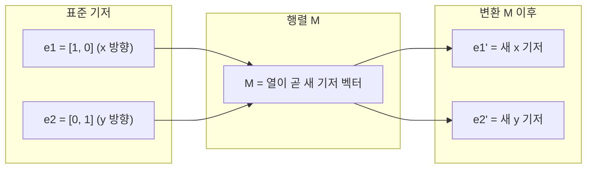
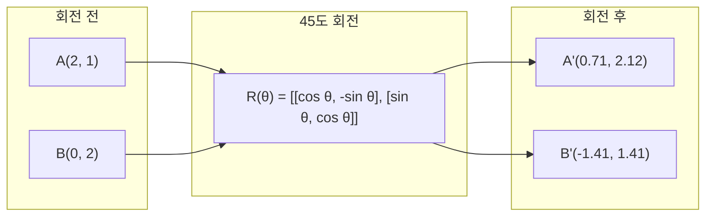
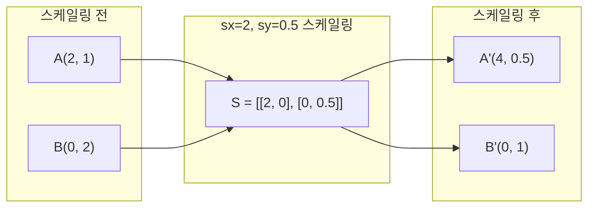
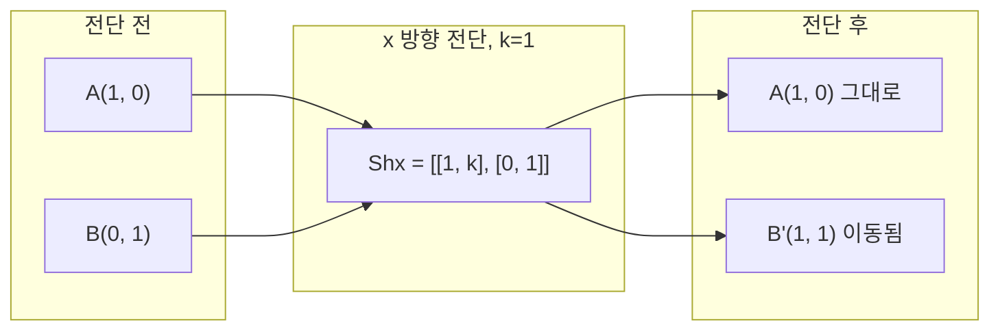
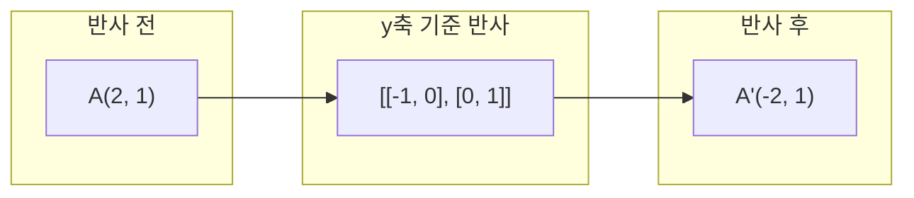
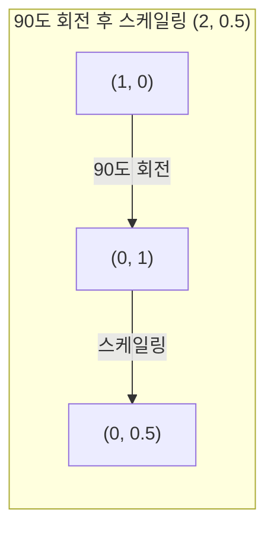
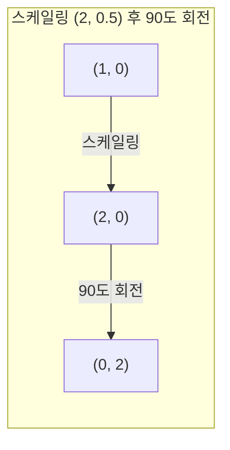

# 행렬 변환 (Matrix Transformations)

> 🇰🇷 이 문서는 한국어 번역본입니다(ELI5 스타일). 원문: [en.md](en.md)

> 행렬은 공간을 새로 빚어 내는 기계입니다. 모든 점에게 무슨 일이 일어나는지 알면, 그 변환 전체를 이해한 것입니다.

**유형:** Build
**언어:** Python, Julia
**선수 지식:** 페이즈 1, 레슨 01-02 (선형 대수 직관, 벡터·행렬 연산)
**소요 시간:** 약 75분

## 학습 목표

- 회전, 스케일링, 전단(shearing), 반사 행렬을 만들고 2D 및 3D 점에 적용하기
- 여러 변환을 행렬 곱셈으로 합성하고, 순서가 중요하다는 것을 검증하기
- 특성 방정식으로 2x2 행렬의 고윳값과 고유벡터 계산하기
- 고윳값이 PCA 방향, RNN 안정성, 스펙트럴 클러스터링 동작을 결정하는 이유 설명하기

## 문제 상황

PCA를 읽다 보면 "공분산 행렬의 고유벡터를 구하라"는 말이 나옵니다. 모델 안정성을 읽다 보면 "모든 고윳값의 크기가 1보다 작은지 확인하라"고 합니다. 데이터 증강을 읽다 보면 "무작위 회전을 적용하라"고 하죠. 행렬이 공간에 기하학적으로 무엇을 하는지 이해하기 전까지는 이 말들이 전부 의미를 모릅니다.

행렬은 단순한 숫자 격자가 아닙니다. 공간을 다루는 기계입니다. 회전 행렬은 점들을 빙글 돌립니다. 스케일링 행렬은 늘립니다. 전단(shearing) 행렬은 기울입니다. 신경망이 데이터에 적용하는 모든 변환은 이런 연산들, 또는 그 조합입니다. 이 레슨은 그 연산들을 구체적으로 만들어 줍니다.

## 핵심 개념

### 변환을 행렬로 쓰기

2D의 모든 선형 변환은 2x2 행렬로 쓸 수 있습니다. 그 행렬은 기저 벡터 [1, 0]과 [0, 1]이 어디로 가는지 정확히 알려 줍니다. 나머지는 전부 여기서 따라 나옵니다.



### 회전

각도 theta만큼의 2D 회전은 거리와 각도를 그대로 유지합니다. 모든 점을 원호를 따라 옮기죠.



3D에서는 축을 중심으로 회전합니다. 축마다 고유한 회전 행렬이 있습니다:

```
Rz(theta) = | cos  -sin  0 |     z축 중심 회전
            | sin   cos  0 |     (x-y 평면이 돌고, z는 그대로)
            |  0     0   1 |

Rx(theta) = | 1   0     0    |   x축 중심 회전
            | 0  cos  -sin   |   (y-z 평면이 돌고, x는 그대로)
            | 0  sin   cos   |

Ry(theta) = |  cos  0  sin |     y축 중심 회전
            |   0   1   0  |     (x-z 평면이 돌고, y는 그대로)
            | -sin  0  cos |
```

### 스케일링

스케일링은 각 축을 따라 독립적으로 늘리거나 줄입니다.



### 전단(Shearing)

전단은 한 축을 고정한 채 다른 축을 기울입니다. 직사각형을 평행사변형으로 바꾸죠.



전단 행렬:
- `Shx = [[1, k], [0, 1]]` : x를 k * y만큼 이동
- `Shy = [[1, 0], [k, 1]]` : y를 k * x만큼 이동

### 반사

반사는 점들을 축이나 선을 기준으로 거울처럼 뒤집습니다.



반사 행렬:
- y축 기준 반사: `[[-1, 0], [0, 1]]`
- x축 기준 반사: `[[1, 0], [0, -1]]`

### 합성: 변환 이어 붙이기

변환 A를 적용한 뒤 B를 적용하는 것은 두 행렬을 곱하는 것과 같습니다: `result = B @ A @ point`. 순서가 중요합니다. 회전 후 스케일링과 스케일링 후 회전은 결과가 다릅니다.



합성 결과: `S @ R = [[0, -2], [0.5, 0]]`



합성 결과: `R @ S = [[0, -0.5], [2, 0]]`

결과가 다릅니다. 행렬 곱셈은 교환 법칙이 성립하지 않습니다.

### 고윳값과 고유벡터

대부분의 벡터는 행렬을 만나면 방향이 바뀝니다. 고유벡터는 특별합니다: 행렬은 이들을 회전시키지 않고 크기만 바꿉니다. 그 크기 배율이 고윳값입니다.

```
A @ v = lambda * v

v는 고유벡터 (변환 속에서 살아남는 방향)
lambda는 고윳값 (얼마나 늘어나는가)

예: A = | 2  1 |
        | 1  2 |

고유벡터 [1, 1], 고윳값 3:
  A @ [1,1] = [3, 3] = 3 * [1, 1]     (같은 방향, 3배로 늘어남)

고유벡터 [1, -1], 고윳값 1:
  A @ [1,-1] = [1, -1] = 1 * [1, -1]  (같은 방향, 그대로)
```

이 행렬은 [1, 1] 방향으로 공간을 3배 늘리고, [1, -1]은 그대로 둡니다. 다른 모든 방향은 이 둘의 섞임입니다.

### 고유분해

행렬이 선형 독립인 고유벡터 n개를 가지면 다음처럼 분해할 수 있습니다:

```
A = V @ D @ V^(-1)

V = 열이 고유벡터인 행렬
D = 고윳값을 대각선에 놓은 대각 행렬
V^(-1) = V의 역행렬

이 식의 뜻: 고유벡터 좌표계로 회전하고, 각 축을 따라 크기를 조절한 뒤, 다시 돌아온다.
```

### 고윳값이 중요한 이유

**PCA.** 공분산 행렬의 고유벡터가 바로 주성분(principal components)입니다. 고윳값은 각 성분이 얼마나 많은 분산을 담는지 알려 줍니다. 고윳값 기준으로 정렬하고 상위 k개만 남기면, 그게 곧 차원 축소입니다.

**안정성.** 순환 신경망과 동역학 시스템에서 크기가 1보다 큰 고윳값은 출력을 폭발시킵니다. 1보다 작으면 출력이 사라져 버리죠. 기울기 소실/폭발 문제를 한 문장으로 말하면 이것입니다.

**스펙트럴 방법.** 그래프 신경망은 인접 행렬의 고윳값을 사용합니다. 스펙트럴 클러스터링은 라플라시안의 고윳값을 사용합니다. 고유벡터가 그래프의 구조를 드러내 줍니다.

### 부피 배율로서의 행렬식

변환 행렬의 행렬식(determinant)은 면적(2D)이나 부피(3D)를 몇 배로 늘리는지 알려 줍니다.

```
det = 1:   면적 보존 (회전)
det = 2:   면적 2배
det = 0:   공간이 더 낮은 차원으로 눌려 버림 (특이(singular))
det = -1:  면적 보존이지만 방향이 뒤집힘 (반사)

| det(회전) | = 1        (항상)
| det(스케일 sx, sy) | = sx * sy
| det(전단) | = 1           (면적 보존)
| det(반사) | = -1     (방향 뒤집힘)
```

```figure
matrix-transform
```

## 직접 만들기

### 단계 1: 변환 행렬을 처음부터 (Python)

```python
import math

def rotation_2d(theta):
    c, s = math.cos(theta), math.sin(theta)
    return [[c, -s], [s, c]]

def scaling_2d(sx, sy):
    return [[sx, 0], [0, sy]]

def shearing_2d(kx, ky):
    return [[1, kx], [ky, 1]]

def reflection_x():
    return [[1, 0], [0, -1]]

def reflection_y():
    return [[-1, 0], [0, 1]]

def mat_vec_mul(matrix, vector):
    return [
        sum(matrix[i][j] * vector[j] for j in range(len(vector)))
        for i in range(len(matrix))
    ]

def mat_mul(a, b):
    rows_a, cols_b = len(a), len(b[0])
    cols_a = len(a[0])
    return [
        [sum(a[i][k] * b[k][j] for k in range(cols_a)) for j in range(cols_b)]
        for i in range(rows_a)
    ]

point = [1.0, 0.0]
angle = math.pi / 4

rotated = mat_vec_mul(rotation_2d(angle), point)
print(f"Rotate (1,0) by 45 deg: ({rotated[0]:.4f}, {rotated[1]:.4f})")

scaled = mat_vec_mul(scaling_2d(2, 3), [1.0, 1.0])
print(f"Scale (1,1) by (2,3): ({scaled[0]:.1f}, {scaled[1]:.1f})")

sheared = mat_vec_mul(shearing_2d(1, 0), [1.0, 1.0])
print(f"Shear (1,1) kx=1: ({sheared[0]:.1f}, {sheared[1]:.1f})")

reflected = mat_vec_mul(reflection_y(), [2.0, 1.0])
print(f"Reflect (2,1) across y: ({reflected[0]:.1f}, {reflected[1]:.1f})")
```

### 단계 2: 변환의 합성

```python
R = rotation_2d(math.pi / 2)
S = scaling_2d(2, 0.5)

rotate_then_scale = mat_mul(S, R)
scale_then_rotate = mat_mul(R, S)

point = [1.0, 0.0]
result1 = mat_vec_mul(rotate_then_scale, point)
result2 = mat_vec_mul(scale_then_rotate, point)

print(f"Rotate 90 then scale: ({result1[0]:.2f}, {result1[1]:.2f})")
print(f"Scale then rotate 90: ({result2[0]:.2f}, {result2[1]:.2f})")
print(f"Same? {result1 == result2}")
```

### 단계 3: 고윳값을 처음부터 (2x2)

2x2 행렬 `[[a, b], [c, d]]`의 고윳값은 특성 방정식 `lambda^2 - (a+d)*lambda + (ad - bc) = 0`의 해입니다.

```python
def eigenvalues_2x2(matrix):
    a, b = matrix[0]
    c, d = matrix[1]
    trace = a + d
    det = a * d - b * c
    discriminant = trace ** 2 - 4 * det
    if discriminant < 0:
        real = trace / 2
        imag = (-discriminant) ** 0.5 / 2
        return (complex(real, imag), complex(real, -imag))
    sqrt_disc = discriminant ** 0.5
    return ((trace + sqrt_disc) / 2, (trace - sqrt_disc) / 2)

def eigenvector_2x2(matrix, eigenvalue):
    a, b = matrix[0]
    c, d = matrix[1]
    if abs(b) > 1e-10:
        v = [b, eigenvalue - a]
    elif abs(c) > 1e-10:
        v = [eigenvalue - d, c]
    else:
        if abs(a - eigenvalue) < 1e-10:
            v = [1, 0]
        else:
            v = [0, 1]
    mag = (v[0] ** 2 + v[1] ** 2) ** 0.5
    return [v[0] / mag, v[1] / mag]

A = [[2, 1], [1, 2]]
vals = eigenvalues_2x2(A)
print(f"Matrix: {A}")
print(f"Eigenvalues: {vals[0]:.4f}, {vals[1]:.4f}")

for val in vals:
    vec = eigenvector_2x2(A, val)
    result = mat_vec_mul(A, vec)
    scaled = [val * vec[0], val * vec[1]]
    print(f"  lambda={val:.1f}, v={[round(x,4) for x in vec]}")
    print(f"    A@v = {[round(x,4) for x in result]}")
    print(f"    l*v = {[round(x,4) for x in scaled]}")
```

### 단계 4: 부피 배율로서의 행렬식

```python
def det_2x2(matrix):
    return matrix[0][0] * matrix[1][1] - matrix[0][1] * matrix[1][0]

print(f"det(rotation 45) = {det_2x2(rotation_2d(math.pi/4)):.4f}")
print(f"det(scale 2,3)   = {det_2x2(scaling_2d(2, 3)):.1f}")
print(f"det(shear kx=1)  = {det_2x2(shearing_2d(1, 0)):.1f}")
print(f"det(reflect y)   = {det_2x2(reflection_y()):.1f}")

singular = [[1, 2], [2, 4]]
print(f"det(singular)     = {det_2x2(singular):.1f}")
print("Singular: columns are proportional, space collapses to a line.")
```

## 실전에서 활용하기

NumPy는 최적화된 루틴으로 이 모든 것을 처리합니다.

```python
import numpy as np

theta = np.pi / 4
R = np.array([[np.cos(theta), -np.sin(theta)],
              [np.sin(theta),  np.cos(theta)]])

point = np.array([1.0, 0.0])
print(f"Rotate (1,0) by 45 deg: {R @ point}")

S = np.diag([2.0, 3.0])
composed = S @ R
print(f"Scale(2,3) after Rotate(45): {composed @ point}")

A = np.array([[2, 1], [1, 2]], dtype=float)
eigenvalues, eigenvectors = np.linalg.eig(A)
print(f"\nEigenvalues: {eigenvalues}")
print(f"Eigenvectors (columns):\n{eigenvectors}")

for i in range(len(eigenvalues)):
    v = eigenvectors[:, i]
    lam = eigenvalues[i]
    print(f"  A @ v{i} = {A @ v}, lambda * v{i} = {lam * v}")

print(f"\ndet(R) = {np.linalg.det(R):.4f}")
print(f"det(S) = {np.linalg.det(S):.1f}")

B = np.array([[3, 1], [0, 2]], dtype=float)
vals, vecs = np.linalg.eig(B)
D = np.diag(vals)
V = vecs
reconstructed = V @ D @ np.linalg.inv(V)
print(f"\nEigendecomposition A = V @ D @ V^-1:")
print(f"Original:\n{B}")
print(f"Reconstructed:\n{reconstructed}")
```

### NumPy로 3D 회전

```python
def rotation_3d_z(theta):
    c, s = np.cos(theta), np.sin(theta)
    return np.array([[c, -s, 0], [s, c, 0], [0, 0, 1]])

def rotation_3d_x(theta):
    c, s = np.cos(theta), np.sin(theta)
    return np.array([[1, 0, 0], [0, c, -s], [0, s, c]])

point_3d = np.array([1.0, 0.0, 0.0])
rotated_z = rotation_3d_z(np.pi / 2) @ point_3d
rotated_x = rotation_3d_x(np.pi / 2) @ point_3d

print(f"\n3D point: {point_3d}")
print(f"Rotate 90 around z: {np.round(rotated_z, 4)}")
print(f"Rotate 90 around x: {np.round(rotated_x, 4)}")
```

## 출시하기

이 레슨은 PCA(페이즈 2)와 신경망 가중치 분석을 위한 기하학적 기초를 다집니다. 여기서 만든 고윳값/고유벡터 코드는 프로덕션(운영 환경) ML 시스템의 차원 축소, 스펙트럴 클러스터링, 안정성 분석을 떠받치는 바로 그 알고리즘입니다.

## 연습 문제

1. 단위 정사각형(꼭짓점 [0,0], [1,0], [1,1], [0,1])에 회전, 스케일링, 전단을 적용하세요. 각각에 대해 변환된 꼭짓점을 출력하고, 회전이 꼭짓점 사이의 거리를 보존하는지 검증합니다.

2. 특성 방정식을 이용해 행렬 [[4, 2], [1, 3]]의 고윳값을 손으로 구하세요. 그다음 직접 만든 함수와 NumPy로 검증합니다.

3. 세 변환(30도 회전, [1.5, 0.8] 스케일링, kx=0.3 전단)의 합성을 만들고, 원 위에 배치한 8개의 점에 적용하세요. 변환 전후 좌표를 출력하고, 합성 행렬의 행렬식을 계산해 개별 행렬식의 곱과 같은지 검증합니다.

## 핵심 용어

| 용어 | 사람들의 말 | 실제 의미 |
|------|----------------|----------------------|
| 회전 행렬 | "빙글 돌리기" | 거리와 각도를 보존하면서 점을 원호를 따라 옮기는 직교 행렬. 행렬식은 항상 1. |
| 스케일링 행렬 | "크게 만들기" | 각 축을 따라 독립적으로 늘리거나 줄이는 대각 행렬. 행렬식은 스케일 인수들의 곱. |
| 전단 행렬 | "비스듬히 기울이기" | 한 좌표를 다른 좌표에 비례해 이동시켜 직사각형을 평행사변형으로 만드는 행렬. 행렬식은 1. |
| 반사 | "거울 보기" | 공간을 축이나 평면을 기준으로 뒤집는 행렬. 행렬식은 -1. |
| 합성 | "두 가지 하기" | 변환 행렬을 곱해 연산을 이어 붙임. 순서가 중요: B @ A는 A를 먼저 하고 그다음 B. |
| 고유벡터 | "특별한 방향" | 행렬이 회전시키지 않고 크기만 바꾸는 방향. 그 변환의 지문(fingerprint). |
| 고윳값 | "얼마나 늘어나나" | 행렬이 자신의 고유벡터를 몇 배로 늘리는지의 배율. 음수(뒤집기)나 복소수(회전)일 수 있음. |
| 고유분해 | "행렬을 쪼개기" | 행렬을 V @ D @ V^(-1)로 쓰는 것. 근본적인 스케일링 방향과 크기로 분리. |
| 행렬식 | "행렬에서 나온 숫자 하나" | 변환이 면적(2D)이나 부피(3D)를 몇 배로 늘리는지의 배율. 0이면 변환을 되돌릴 수 없다는 뜻. |
| 특성 방정식 | "고윳값이 나오는 곳" | det(A - lambda * I) = 0. 근이 고윳값인 다항식. |

## 더 읽을거리

- [3Blue1Brown: Linear Transformations](https://www.3blue1brown.com/lessons/linear-transformations) -- 행렬이 공간을 어떻게 빚는지에 대한 시각적 직관
- [3Blue1Brown: Eigenvectors and Eigenvalues](https://www.3blue1brown.com/lessons/eigenvalues) -- 고유벡터의 기하학적 의미에 관한 최고의 시각적 설명
- [MIT 18.06 Lecture 21: Eigenvalues and Eigenvectors](https://ocw.mit.edu/courses/18-06-linear-algebra-spring-2010/) -- Gilbert Strang의 고전적인 강의
