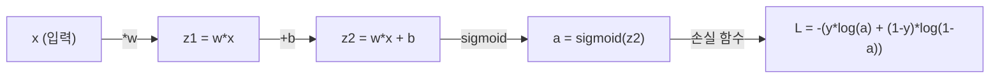
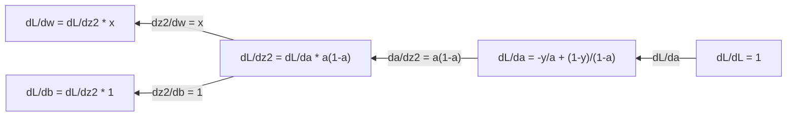
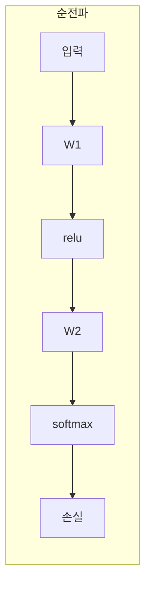
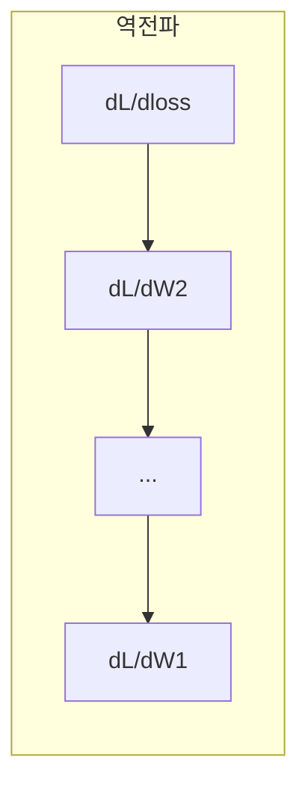

# 머신러닝을 위한 미적분 (Calculus for Machine Learning)

> 🇰🇷 이 문서는 한국어 번역본입니다(ELI5 스타일). 원문: [en.md](en.md)

> 도함수는 어느 쪽이 내리막인지 알려 줍니다. 신경망이 학습하는 데 필요한 건 그게 전부입니다.

**유형:** Learn
**언어:** Python
**선수 지식:** 페이즈 1, 레슨 01-03
**소요 시간:** 약 60분

## 학습 목표

- 흔한 ML 함수(x^2, 시그모이드, 교차 엔트로피)의 수치 미분값과 해석적 도함수 계산하기
- 경사 하강법을 처음부터 구현해 1D와 2D에서 손실 함수 최소화하기
- 선형 회귀 모델의 그래디언트를 유도하고, 손으로 가중치를 업데이트하며 학습시키기
- 헤시안 행렬, 테일러 급수 근사, 그것들이 최적화 방법과 연결되는 방식 설명하기

## 문제 상황

수백만 개의 가중치를 가진 신경망이 있습니다. 각 가중치는 하나의 손잡이(노브)입니다. 모델이 조금 덜 틀리도록 모든 손잡이를 어느 방향으로 돌려야 하는지 알아내야 하죠. 미적분이 바로 그 방향을 알려 줍니다.

미적분 없이 신경망을 학습시키려면 무작위로 값을 바꿔 보고 운을 바라는 수밖에 없습니다. 도함수가 있으면 각 가중치가 오차에 어떤 영향을 주는지 정확히 압니다. 모든 손잡이를 매번 올바른 방향으로 돌릴 수 있는 거죠.

## 핵심 개념

### 도함수란?

도함수는 변화율을 측정합니다. 함수 y = f(x)에서 도함수 f'(x)는 이렇게 말해 줍니다: x를 아주 조금 밀었을 때 y가 얼마나 바뀌나?

기하학적으로 도함수는 한 점에서의 접선의 기울기입니다.

**f(x) = x^2:**

| x | f(x) | f'(x) (기울기) |
|---|------|---------------|
| 0 | 0    | 0 (평평함, 그릇 바닥) |
| 1 | 1    | 2 |
| 2 | 4    | 4 (이 점에서 접선의 기울기) |
| 3 | 9    | 6 |

x=2에서 기울기는 4입니다. x를 오른쪽으로 조금 옮기면 y는 그 양의 약 4배만큼 커집니다. x=0에서 기울기는 0이죠. 그릇의 바닥에 서 있는 겁니다.

공식적인 정의:

```
f'(x) = lim   f(x + h) - f(x)
        h->0  -----------------
                     h
```

코드에서는 극한을 건너뛰고 그냥 아주 작은 h를 씁니다. 이것이 수치 미분입니다.

### 편미분: 한 번에 변수 하나씩

실제 함수는 입력이 많습니다. 신경망의 손실은 수천 개의 가중치에 의존하죠. 편미분(partial derivative)은 변수 하나만 남기고 나머지는 모두 상수로 고정한 다음, 그 변수에 대해 미분합니다.

```
f(x, y) = x^2 + 3xy + y^2

df/dx = 2x + 3y     (y를 상수로 취급)
df/dy = 3x + 2y     (x를 상수로 취급)
```

각 편미분이 답하는 질문: 이 가중치 하나만 살짝 움직이면 손실이 얼마나 변할까?

### 그래디언트: 모든 편미분의 모음

그래디언트(gradient)는 모든 편미분을 하나의 벡터로 모읍니다. 함수 f(x, y, z)의 그래디언트는:

```
grad f = [ df/dx, df/dy, df/dz ]
```

그래디언트는 가장 가파르게 오르는 방향을 가리킵니다. 함수를 최소화하려면 반대 방향으로 가면 됩니다.

**f(x,y) = x^2 + y^2의 등고선 그래프:**

이 함수는 그릇 모양이고, 등고선은 동심원입니다. 최솟값은 (0, 0)에 있습니다.

| 점 | grad f | -grad f (하강 방향) |
|-------|--------|----------------------------|
| (1, 1) | [2, 2] (언덕 위쪽, 최솟값에서 멀어지는 방향) | [-2, -2] (내리막, 최솟값을 향하는 방향) |
| (0, 0) | [0, 0] (평평함, 최솟값) | [0, 0] |

그림으로 본 경사 하강법입니다. 그래디언트를 계산하고, 부호를 뒤집고, 한 걸음 나아갑니다.

### 최적화와의 연결

신경망 학습은 곧 최적화입니다. 모델이 얼마나 틀렸는지 잴 손실 함수 L(w1, w2, ..., wn)이 있고, 이걸 최소화하고 싶은 거죠.

```
경사 하강법 업데이트 규칙:

  w_new = w_old - learning_rate * dL/dw

모든 가중치에 대해:
  1. 그 가중치에 대한 손실의 편미분을 계산한다
  2. 가중치에서 그 값의 작은 배율을 뺀다
  3. 반복한다
```

학습률이 걸음 크기를 조절합니다. 너무 크면 목표를 지나쳐 버리고, 너무 작으면 기어 가듯 느립니다.

**손실 지형 (1D 단면):**

가중치 w가 변함에 따라 손실 함수 L(w)는 봉우리와 골짜기가 있는 곡선이 됩니다.

| 특징 | 설명 |
|---------|-------------|
| 전역 최솟값 | 곡선 전체에서 가장 낮은 지점 -- 가장 좋은 해 |
| 지역 최솟값 | 이웃보다 낮지만 전체 최저는 아닌 골짜기 |
| 기울기 | 경사 하강법은 어느 시작점에서든 기울기를 따라 내리막으로 내려감 |

경사 하강법은 기울기를 따라 내리막으로 내려갑니다. 지역 최솟값에 갇힐 수 있지만, 고차원 공간(수백만 개의 가중치)에서는 실전 문제가 되는 경우가 드뭅니다.

### 수치 미분 vs 해석적 미분

도함수를 계산하는 방법은 두 가지입니다.

해석적: 미분 규칙을 손으로 적용합니다. f(x) = x^2의 도함수는 f'(x) = 2x. 정확하고 빠릅니다.

수치적: 정의를 이용해 근사합니다. 아주 작은 h에 대해 f(x+h)와 f(x-h)를 계산하고 그 차이를 씁니다.

```
수치 미분 (중앙 차분):

f'(x) ~= f(x + h) - f(x - h)
          -----------------------
                  2h

h = 0.0001이면 실전에서 잘 동작
```

수치 미분은 느리지만 어떤 함수에도 통합니다. 해석적 미분은 빠르지만 공식을 직접 유도해야 합니다. 신경망 프레임워크는 세 번째 방법을 씁니다: 자동 미분(automatic differentiation)으로, 정확한 도함수를 기계적으로 계산하죠. 이건 페이즈 3에서 만나게 됩니다.

### 간단한 함수를 손으로 미분하기

ML에서 계속 마주치게 될 도함수들입니다.

```
함수            도함수           사용처
--------        ----------       -------
f(x) = x^2     f'(x) = 2x      손실 함수 (MSE)
f(x) = wx + b  f'(w) = x        선형 레이어 (가중치에 대한 그래디언트)
                f'(b) = 1        선형 레이어 (편향에 대한 그래디언트)
                f'(x) = w        선형 레이어 (입력에 대한 그래디언트)
f(x) = e^x     f'(x) = e^x     소프트맥스, 어텐션
f(x) = ln(x)   f'(x) = 1/x     교차 엔트로피 손실
f(x) = 1/(1+e^-x)  f'(x) = f(x)(1-f(x))   시그모이드 활성화
```

f(x) = x^2의 경우:

```
f(x) = x^2    f'(x) = 2x

  x    f(x)   f'(x)   의미
  -2    4      -4      기울기가 왼쪽으로 기움 (감소 중)
  -1    1      -2      기울기가 왼쪽으로 기움 (감소 중)
   0    0       0      평평함 (최솟값!)
   1    1       2      기울기가 오른쪽으로 기움 (증가 중)
   2    4       4      기울기가 오른쪽으로 기움 (증가 중)
```

f(w) = wx + b에서 x=3, b=1인 경우:

```
f(w) = 3w + 1    f'(w) = 3

w에 대한 도함수는 그냥 x입니다.
x가 크면, w의 작은 변화가 출력의 큰 변화로 이어집니다.
```

### 연쇄 법칙

함수가 겹겹이 합성되어 있을 때, 연쇄 법칙(chain rule)이 미분 방법을 알려 줍니다.

```
y = f(g(x))이면, dy/dx = f'(g(x)) * g'(x)

예: y = (3x + 1)^2
  바깥: f(u) = u^2       f'(u) = 2u
  안쪽: g(x) = 3x + 1    g'(x) = 3
  dy/dx = 2(3x + 1) * 3 = 6(3x + 1)
```

신경망은 함수의 사슬입니다: 입력 -> 선형 -> 활성화 -> 선형 -> 활성화 -> 손실. 역전파(backpropagation)는 이 연쇄 법칙을 출력에서 입력까지 반복적으로 적용한 것입니다. 그게 알고리즘 전부입니다.

### 헤시안 행렬

그래디언트가 기울기를 알려 준다면, 헤시안(Hessian)은 곡률을 알려 줍니다.

헤시안은 2계 편미분들의 행렬입니다. 함수 f(x1, x2, ..., xn)에 대해 헤시안의 (i, j) 성분은:

```
H[i][j] = d^2f / (dx_i * dx_j)
```

2변수 함수 f(x, y)의 경우:

```
H = | d^2f/dx^2    d^2f/dxdy |
    | d^2f/dydx    d^2f/dy^2 |
```

**임계점(그래디언트 = 0인 지점)에서 헤시안이 말해 주는 것:**

| 헤시안 성질 | 의미 | 예시 곡면 |
|-----------------|---------|-----------------|
| 양의 정부호 (모든 고윳값 > 0) | 지역 최솟값 | 위를 향한 그릇 |
| 음의 정부호 (모든 고윳값 < 0) | 지역 최댓값 | 아래를 향한 그릇 |
| 부정부호 (고윳값이 섞임) | 안장점(saddle point) | 말 안장 모양 |

**예:** f(x, y) = x^2 - y^2 (안장 함수)

```
df/dx = 2x       df/dy = -2y
d^2f/dx^2 = 2    d^2f/dy^2 = -2    d^2f/dxdy = 0

H = | 2   0 |
    | 0  -2 |

고윳값: 2와 -2 (하나는 양수, 하나는 음수)
--> (0, 0)에서 안장점
```

f(x, y) = x^2 + y^2 (그릇)와 비교해 보세요:

```
H = | 2  0 |
    | 0  2 |

고윳값: 2와 2 (둘 다 양수)
--> (0, 0)에서 지역 최솟값
```

**ML에서 헤시안이 중요한 이유:**

뉴턴 방법은 헤시안을 사용해 경사 하강법보다 나은 최적화 스텝을 밟습니다. 기울기만 따라가는 게 아니라 곡률까지 고려하죠:

```
뉴턴 업데이트:    w_new = w_old - H^(-1) * gradient
경사 하강법:     w_new = w_old - lr * gradient
```

뉴턴 방법이 더 빨리 수렴하는 이유는, 헤시안이 그래디언트를 "재조율"하기 때문입니다 -- 가파른 방향은 걸음을 줄이고, 평평한 방향은 걸음을 키웁니다.

함정은 이겁니다: N개 파라미터를 가진 신경망의 헤시안은 N x N입니다. 파라미터 100만 개짜리 모델은 1조 개 항목의 행렬이 필요하죠. 그래서 우리는 근사를 사용합니다.

| 방법 | 사용하는 것 | 비용 | 수렴 |
|--------|-------------|------|-------------|
| 경사 하강법 | 1계 도함수만 | 단계당 O(N) | 느림 (선형) |
| 뉴턴 방법 | 완전한 헤시안 | 단계당 O(N^3) | 빠름 (2차) |
| L-BFGS | 그래디언트 이력으로 근사한 헤시안 | 단계당 O(N) | 중간 (초선형) |
| Adam | 파라미터별 적응형 학습률 (대각 헤시안 근사) | 단계당 O(N) | 중간 |
| 자연 그래디언트 | 피셔 정보 행렬 (통계학적 헤시안) | 단계당 O(N^2) | 빠름 |

실전에서 Adam이 딥러닝의 기본 옵티마이저입니다. 파라미터별 그래디언트의 이동 평균과 분산을 추적해 2계 정보를 저렴하게 근사하죠.

### 테일러 급수 근사

매끄러운 함수는 어떤 것이든 국소적으로 다항식으로 근사할 수 있습니다:

```
f(x + h) = f(x) + f'(x)*h + (1/2)*f''(x)*h^2 + (1/6)*f'''(x)*h^3 + ...
```

항을 많이 넣을수록 근사가 좋아집니다 -- 하지만 x 근처에서만요.

**ML에서 테일러 급수가 중요한 이유:**

- **1계 테일러 = 경사 하강법.** f(x + h) ~ f(x) + f'(x)*h를 쓰면 선형 근사를 하는 겁니다. 경사 하강법은 이 선형 모델을 최소화해 h = -lr * f'(x)를 고릅니다.

- **2계 테일러 = 뉴턴 방법.** f(x + h) ~ f(x) + f'(x)*h + (1/2)*f''(x)*h^2를 쓰면 2차 모델이 나옵니다. 이걸 최소화하면 h = -f'(x)/f''(x), 즉 뉴턴 스텝이 됩니다.

- **손실 함수 설계.** MSE와 교차 엔트로피는 매끄럽습니다. 즉 테일러 전개가 잘 동작한다는 뜻이죠. 이건 우연이 아닙니다. 매끄러운 손실이 최적화를 예측 가능하게 만듭니다.

```
근사 차수           담아내는 것        최적화 방법
-------------------    -----------------   -------------------
0계 (상수)             값 자체             랜덤 서치
1계 (선형)             기울기              경사 하강법
2계 (2차)              곡률                뉴턴 방법
그 이상                더 미세한 구조       ML에서는 드묾
```

핵심 통찰: 그래디언트 기반 최적화는 전부, 손실 함수를 국소적으로 근사하고 그 근사의 최솟값으로 한 걸음 내딛는 일입니다.

### ML 속의 적분

도함수가 변화율을 알려 준다면, 적분은 누적을 계산합니다 -- 곡선 아래의 면적이죠.

ML에서 적분을 손으로 계산할 일은 드물지만, 개념은 곳곳에 있습니다:

**확률.** 밀도 p(x)를 가진 연속 확률 변수에서:
```
P(a < X < b) = a부터 b까지 p(x)의 적분
```
확률 밀도 곡선 아래 a부터 b까지의 면적이 그 범위에 떨어질 확률입니다.

**기댓값.** 확률로 가중 평균한 결과값:
```
E[f(X)] = f(x) * p(x)의 적분
```
데이터 분포에 대한 기댓 손실은 적분입니다. 학습은 이것의 경험적 근사를 최소화하는 거죠.

**KL 발산.** 두 분포가 얼마나 다른지 측정합니다:
```
KL(p || q) = p(x) * log(p(x) / q(x))의 적분
```
VAE, 지식 증류, 베이지안 추론에 사용됩니다.

**정규화 상수.** 베이지안 추론에서:
```
p(w | data) = p(data | w) * p(w) / (p(data | w) * p(w)의 w에 대한 적분)
```
분모는 가능한 모든 파라미터 값에 걸친 적분입니다. 보통 계산이 불가능(tractable하지 않음)해서, MCMC나 변분 추론 같은 근사 기법을 쓰는 겁니다.

| 적분 개념 | ML에서 등장하는 곳 |
|-----------------|----------------------|
| 곡선 아래 면적 | 밀도 함수로부터의 확률 |
| 기댓값 | 손실 함수, 위험 최소화 |
| KL 발산 | VAE, 정책 최적화, 증류 |
| 정규화 | 베이지안 사후 분포, 소프트맥스 분모 |
| 주변 가능도 | 모델 비교, 증거 하한(ELBO) |

### 계산 그래프 속의 다변수 연쇄 법칙

연쇄 법칙은 한 줄로 늘어선 스칼라 함수에만 적용되는 게 아닙니다. 신경망에서는 변수가 갈라지고 합쳐지죠. 간단한 순전파를 그래디언트가 어떻게 흐르는지 보겠습니다:



역방향 패스는 오른쪽에서 왼쪽으로 그래디언트를 계산합니다:



각 화살표는 국소 도함수를 곱합니다. 어떤 파라미터의 그래디언트는, 손실부터 그 파라미터까지의 경로를 따라 있는 모든 국소 도함수의 곱입니다. 경로가 갈라지고 합쳐지면 기여도를 더합니다(다변수 연쇄 법칙).

역전파가 하는 일이 전부 이겁니다: 연쇄 법칙을 계산 그래프를 따라 출력에서 입력까지 체계적으로 적용하는 것.

### 야코비안 행렬

함수가 벡터를 벡터로 매핑할 때(신경망 레이어처럼), 그 도함수는 행렬입니다. 야코비안(Jacobian)은 모든 출력의 모든 입력에 대한 편미분을 담습니다.

f: R^n -> R^m에서 야코비안 J는 m x n 행렬입니다:

| | x1 | x2 | ... | xn |
|---|---|---|---|---|
| f1 | df1/dx1 | df1/dx2 | ... | df1/dxn |
| f2 | df2/dx1 | df2/dx2 | ... | df2/dxn |
| ... | ... | ... | ... | ... |
| fm | dfm/dx1 | dfm/dx2 | ... | dfm/dxn |

신경망의 야코비안을 손으로 계산할 일은 없습니다. PyTorch가 처리하니까요. 하지만 존재를 알고 있으면 역전파의 모양을 이해하는 데 도움이 됩니다: 레이어가 R^n을 R^m으로 매핑하면 그 야코비안은 m x n이고, 그래디언트는 이 행렬의 전치를 거슬러 흐릅니다.

### 신경망에서 이것이 중요한 이유

신경망의 모든 가중치는 그래디언트를 받습니다. 그래디언트는 손실을 줄이기 위해 그 가중치를 어떻게 조정해야 하는지 알려 주죠.





각 가중치 업데이트:
- `W1 = W1 - lr * dL/dW1`
- `W2 = W2 - lr * dL/dW2`

순전파는 예측과 손실을 계산합니다. 역전파는 모든 가중치에 대한 손실의 그래디언트를 계산합니다. 그러면 모든 가중치가 내리막으로 작은 걸음을 내딛죠. 이걸 수백만 번 반복합니다. 그게 딥러닝입니다.

```figure
derivative-tangent
```

## 직접 만들기

### 단계 1: 수치 미분을 처음부터

```python
def numerical_derivative(f, x, h=1e-7):
    return (f(x + h) - f(x - h)) / (2 * h)

def f(x):
    return x ** 2

for x in [-2, -1, 0, 1, 2]:
    numerical = numerical_derivative(f, x)
    analytical = 2 * x
    print(f"x={x:2d}  f'(x) numerical={numerical:.6f}  analytical={analytical:.1f}")
```

수치 미분이 해석적 미분과 소수 여러 자리까지 일치합니다.

### 단계 2: 편미분과 그래디언트

```python
def numerical_gradient(f, point, h=1e-7):
    gradient = []
    for i in range(len(point)):
        point_plus = list(point)
        point_minus = list(point)
        point_plus[i] += h
        point_minus[i] -= h
        partial = (f(point_plus) - f(point_minus)) / (2 * h)
        gradient.append(partial)
    return gradient

def f_multi(point):
    x, y = point
    return x**2 + 3*x*y + y**2

grad = numerical_gradient(f_multi, [1.0, 2.0])
print(f"Numerical gradient at (1,2): {[f'{g:.4f}' for g in grad]}")
print(f"Analytical gradient at (1,2): [2*1+3*2, 3*1+2*2] = [{2*1+3*2}, {3*1+2*2}]")
```

### 단계 3: 경사 하강법으로 f(x) = x^2의 최솟값 찾기

```python
x = 5.0
lr = 0.1
for step in range(20):
    grad = 2 * x
    x = x - lr * grad
    print(f"step {step:2d}  x={x:8.4f}  f(x)={x**2:10.6f}")
```

x=5에서 시작해 매 단계가 x=0(최솟값)으로 다가갑니다.

### 단계 4: 2D 함수에서의 경사 하강법

```python
def f_2d(point):
    x, y = point
    return x**2 + y**2

point = [4.0, 3.0]
lr = 0.1
for step in range(30):
    grad = numerical_gradient(f_2d, point)
    point = [p - lr * g for p, g in zip(point, grad)]
    loss = f_2d(point)
    if step % 5 == 0 or step == 29:
        print(f"step {step:2d}  point=({point[0]:7.4f}, {point[1]:7.4f})  f={loss:.6f}")
```

### 단계 5: 수치 미분과 해석적 미분 비교

```python
import math

test_functions = [
    ("x^2",      lambda x: x**2,          lambda x: 2*x),
    ("x^3",      lambda x: x**3,          lambda x: 3*x**2),
    ("sin(x)",   lambda x: math.sin(x),   lambda x: math.cos(x)),
    ("e^x",      lambda x: math.exp(x),   lambda x: math.exp(x)),
    ("1/x",      lambda x: 1/x,           lambda x: -1/x**2),
]

x = 2.0
print(f"{'Function':<12} {'Numerical':>12} {'Analytical':>12} {'Error':>12}")
print("-" * 50)
for name, f, df in test_functions:
    num = numerical_derivative(f, x)
    ana = df(x)
    err = abs(num - ana)
    print(f"{name:<12} {num:12.6f} {ana:12.6f} {err:12.2e}")
```

### 단계 6: 헤시안을 수치로 계산하기

```python
def hessian_2d(f, x, y, h=1e-5):
    fxx = (f(x + h, y) - 2 * f(x, y) + f(x - h, y)) / (h ** 2)
    fyy = (f(x, y + h) - 2 * f(x, y) + f(x, y - h)) / (h ** 2)
    fxy = (f(x + h, y + h) - f(x + h, y - h) - f(x - h, y + h) + f(x - h, y - h)) / (4 * h ** 2)
    return [[fxx, fxy], [fxy, fyy]]

def saddle(x, y):
    return x ** 2 - y ** 2

def bowl(x, y):
    return x ** 2 + y ** 2

H_saddle = hessian_2d(saddle, 0.0, 0.0)
H_bowl = hessian_2d(bowl, 0.0, 0.0)
print(f"Saddle Hessian: {H_saddle}")  # [[2, 0], [0, -2]] -- 부호가 섞임
print(f"Bowl Hessian:   {H_bowl}")    # [[2, 0], [0, 2]]  -- 둘 다 양수
```

안장 함수의 헤시안은 고윳값 2와 -2를 가집니다(부호가 섞여 있어 안장점임을 확인). 그릇은 고윳값 2와 2입니다(둘 다 양수라 최솟값임을 확인).

### 단계 7: 테일러 근사 실전

```python
import math

def taylor_approx(f, f_prime, f_double_prime, x0, h, order=2):
    result = f(x0)
    if order >= 1:
        result += f_prime(x0) * h
    if order >= 2:
        result += 0.5 * f_double_prime(x0) * h ** 2
    return result

x0 = 0.0
for h in [0.1, 0.5, 1.0, 2.0]:
    true_val = math.sin(h)
    t1 = taylor_approx(math.sin, math.cos, lambda x: -math.sin(x), x0, h, order=1)
    t2 = taylor_approx(math.sin, math.cos, lambda x: -math.sin(x), x0, h, order=2)
    print(f"h={h:.1f}  sin(h)={true_val:.4f}  order1={t1:.4f}  order2={t2:.4f}")
```

x0=0 근처에서 sin(x) ~ x입니다(1계 테일러). 근사는 h가 작을 때 훌륭하지만 h가 커지면 무너집니다. 경사 하강법이 작은 학습률에서 가장 잘 동작하는 이유가 바로 이것입니다 -- 각 단계는 선형 근사가 정확하다고 가정하기 때문이죠.

### 단계 8: 신경망에서 이것이 중요한 이유

```python
import random

random.seed(42)

w = random.gauss(0, 1)
b = random.gauss(0, 1)
lr = 0.01

xs = [1.0, 2.0, 3.0, 4.0, 5.0]
ys = [3.0, 5.0, 7.0, 9.0, 11.0]

for epoch in range(200):
    total_loss = 0
    dw = 0
    db = 0
    for x, y in zip(xs, ys):
        pred = w * x + b
        error = pred - y
        total_loss += error ** 2
        dw += 2 * error * x
        db += 2 * error
    dw /= len(xs)
    db /= len(xs)
    total_loss /= len(xs)
    w -= lr * dw
    b -= lr * db
    if epoch % 40 == 0 or epoch == 199:
        print(f"epoch {epoch:3d}  w={w:.4f}  b={b:.4f}  loss={total_loss:.6f}")

print(f"\nLearned: y = {w:.2f}x + {b:.2f}")
print(f"Actual:  y = 2x + 1")
```

모든 그래디언트 기반 학습 루프가 이 패턴을 따릅니다: 예측, 손실 계산, 그래디언트 계산, 가중치 업데이트.

## 실전에서 활용하기

NumPy를 쓰면 같은 연산이 더 빠르고 간결해집니다:

```python
import numpy as np

x = np.array([1, 2, 3, 4, 5], dtype=float)
y = np.array([3, 5, 7, 9, 11], dtype=float)

w, b = np.random.randn(), np.random.randn()
lr = 0.01

for epoch in range(200):
    pred = w * x + b
    error = pred - y
    loss = np.mean(error ** 2)
    dw = np.mean(2 * error * x)
    db = np.mean(2 * error)
    w -= lr * dw
    b -= lr * db

print(f"Learned: y = {w:.2f}x + {b:.2f}")
```

방금 경사 하강법을 처음부터 직접 만들었습니다. PyTorch는 그래디언트 계산을 자동화하지만, 업데이트 루프는 완전히 동일합니다.

## 연습 문제

1. `numerical_derivative`를 두 번 호출해 `numerical_second_derivative(f, x)`를 구현하세요. x^3의 2계 도함수가 x=2에서 12인지 검증합니다.
2. 경사 하강법으로 f(x, y) = (x - 3)^2 + (y + 1)^2의 최솟값을 찾으세요. (0, 0)에서 시작합니다. 답은 (3, -1)로 수렴해야 합니다.
3. 경사 하강법 루프에 모멘텀을 추가하세요: 과거 그래디언트를 누적하는 속도 벡터를 유지합니다. f(x) = x^4 - 3x^2에서 모멘텀의 유무에 따른 수렴 속도를 비교해 보세요.

## 핵심 용어

| 용어 | 사람들의 말 | 실제 의미 |
|------|----------------|----------------------|
| 도함수 | "기울기" | 한 점에서 함수의 변화율. 입력이 한 단위 변할 때 출력이 얼마나 변하는지 알려 줌. |
| 편미분 | "한 변수의 미분" | 나머지 변수는 모두 상수로 고정한 채 한 변수에 대해 구한 도함수. |
| 그래디언트 | "가장 가파르게 오르는 방향" | 모든 편미분의 벡터. 함수를 가장 빨리 증가시키는 방향을 가리킴. |
| 경사 하강법 | "내리막으로 가기" | 손실을 줄이기 위해 파라미터에서 그래디언트(에 학습률을 곱한 값)를 뺌. 신경망 학습의 핵심. |
| 학습률 | "걸음 크기" | 경사 하강법의 각 걸음이 얼마나 큰지 조절하는 스칼라. 너무 크면 발산, 너무 작으면 수렴이 느림. |
| 연쇄 법칙 | "도함수끼리 곱하기" | 합성 함수를 미분하는 규칙: df/dx = df/dg * dg/dx. 역전파의 수학적 토대. |
| 야코비안 | "도함수의 행렬" | 함수가 벡터를 벡터로 매핑할 때, 출력의 입력에 대한 모든 편미분을 담은 행렬. |
| 수치 미분 | "유한 차분" | 가까운 두 점에서 함수 값을 평가하고 그 사이 기울기를 계산해 도함수를 근사. |
| 역전파 | "reverse-mode autodiff" | 연쇄 법칙으로 출력에서 입력까지 레이어별로 그래디언트를 계산. 신경망이 학습하는 방식. |
| 헤시안 | "2계 도함수의 행렬" | 모든 2계 편미분의 행렬. 함수의 곡률을 설명. 임계점에서 헤시안이 양의 정부호면 지역 최솟값. |
| 테일러 급수 | "다항식 근사" | 어떤 점 근처에서 도함수들로 함수를 근사: f(x+h) ~ f(x) + f'(x)h + (1/2)f''(x)h^2 + ... 경사 하강법과 뉴턴 방법이 왜 동작하는지 이해하는 기초. |
| 적분 | "곡선 아래 면적" | 범위에 걸친 양의 누적. ML에서 적분은 확률, 기댓값, KL 발산을 정의. |

## 더 읽을거리

- [3Blue1Brown: Essence of Calculus](https://www.3blue1brown.com/topics/calculus) - 도함수, 적분, 연쇄 법칙에 대한 시각적 직관
- [Stanford CS231n: Backpropagation](https://cs231n.github.io/optimization-2/) - 그래디언트가 신경망 레이어를 통과하는 방식
