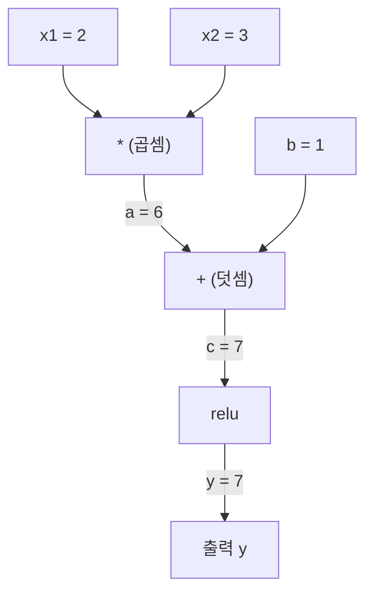
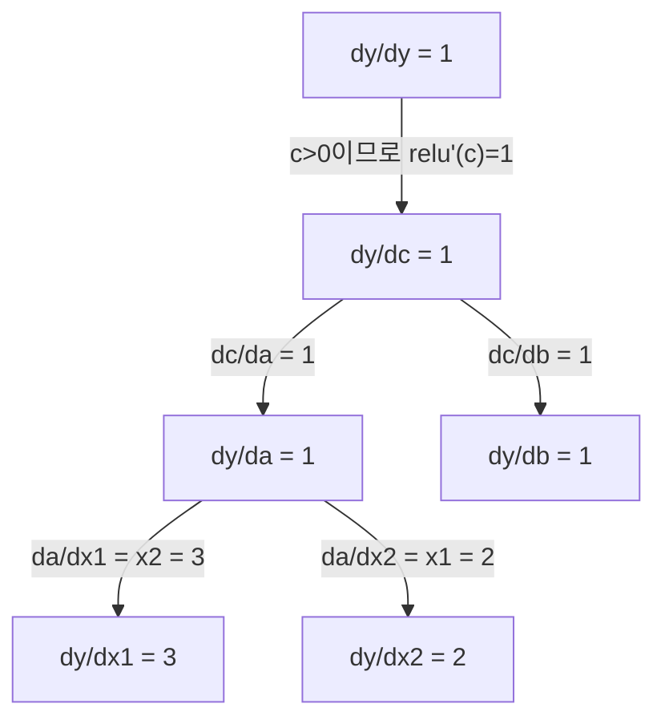

# 연쇄 법칙과 자동 미분 (Chain Rule & Automatic Differentiation)

> 🇰🇷 이 문서는 한국어 번역본입니다(ELI5 스타일). 원문: [en.md](en.md)

> 연쇄 법칙은 학습하는 모든 신경망 뒤에 숨어 있는 엔진입니다.

**유형:** Build
**언어:** Python
**선수 지식:** 페이즈 1, 레슨 04 (도함수와 그래디언트)
**소요 시간:** 약 90분

## 학습 목표

- 연산을 기록하고 reverse-mode 자동 미분으로 그래디언트를 계산하는 최소한의 autograd 엔진(Value 클래스) 만들기
- 위상 정렬(topological sort)을 사용해 계산 그래프의 순전파와 역방향 패스 구현하기
- 처음부터 만든 autograd 엔진만으로 XOR 문제의 다층 퍼셉트론을 구성하고 학습시키기
- 수치 유한 차분과 비교하는 그래디언트 검산으로 자동 미분의 정확성 검증하기

## 문제 상황

간단한 함수의 도함수는 구할 수 있습니다. 하지만 신경망은 간단한 함수가 아닙니다. 수백 개의 함수가 합성된 것입니다: 행렬 곱, 편향 더하기, 활성화 적용, 또 행렬 곱, 소프트맥스, 교차 엔트로피 손실. 출력은 함수의 함수의 함수인 거죠.

네트워크를 학습시키려면 손실에 대한 모든 가중치의 그래디언트가 필요합니다. 수백만 개의 파라미터를 손으로 하는 건 불가능합니다. 수치적으로(유한 차분) 하는 건 너무 느립니다.

연쇄 법칙이 수학을 줍니다. 자동 미분이 알고리즘을 줍니다. 둘을 합치면 임의의 함수 합성을 통과하는 정확한 그래디언트를, 순전파 한 번에 비례하는 시간 안에 계산할 수 있습니다.

PyTorch, TensorFlow, JAX가 동작하는 방식이 바로 이것입니다. 여러분은 미니 버전을 처음부터 만들어 볼 겁니다.

## 핵심 개념

### 연쇄 법칙

`y = f(g(x))`일 때, `y`의 `x`에 대한 도함수는:

```
dy/dx = dy/dg * dg/dx = f'(g(x)) * g'(x)
```

사슬을 따라 도함수들을 곱합니다. 각 고리는 자신의 국소 도함수를 기여합니다.

예: `y = sin(x^2)`

```
g(x) = x^2       g'(x) = 2x
f(g) = sin(g)     f'(g) = cos(g)

dy/dx = cos(x^2) * 2x
```

더 깊은 합성이라면 사슬이 늘어납니다:

```
y = f(g(h(x)))

dy/dx = f'(g(h(x))) * g'(h(x)) * h'(x)
```

신경망의 모든 레이어가 이 사슬의 고리 하나입니다.

### 계산 그래프

계산 그래프는 연쇄 법칙을 눈에 보이게 만듭니다. 모든 연산이 노드가 됩니다. 데이터는 그래프를 따라 앞으로 흐르고, 그래디언트는 뒤로 흐릅니다.

**순전파 (값 계산):**



**역방향 패스 (그래디언트 계산):**



역방향 패스는 모든 노드에서 연쇄 법칙을 적용하며 그래디언트를 출력에서 입력으로 전파합니다.

### 순전파 모드 vs 역전파 모드

그래프에 연쇄 법칙을 적용하는 방법은 두 가지입니다.

**순전파 모드(forward mode)**는 입력에서 시작해 도함수를 앞으로 밉니다. `dx/dx = 1`로 시드를 심고 각 연산을 통과시키죠. 입력은 적고 출력은 많을 때 좋습니다.

```
순전파 모드: dx/dx = 1 시드, 앞으로 전파

  x = 2       (dx/dx = 1)
  a = x^2     (da/dx = 2x = 4)
  y = sin(a)  (dy/dx = cos(a) * da/dx = cos(4) * 4 = -2.615)
```

**역전파 모드(reverse mode)**는 출력에서 시작해 그래디언트를 뒤로 당겨 옵니다. `dy/dy = 1`로 시드를 심고 각 연산을 역방향으로 통과합니다. 입력은 많고 출력은 적을 때 좋습니다.

```
역전파 모드: dy/dy = 1 시드, 뒤로 전파

  y = sin(a)  (dy/dy = 1)
  a = x^2     (dy/da = cos(a) = cos(4) = -0.654)
  x = 2       (dy/dx = dy/da * da/dx = -0.654 * 4 = -2.615)
```

신경망은 입력(가중치)이 수백만 개이고 출력(손실)은 하나입니다. 역전파 모드는 역방향 패스 한 번으로 모든 그래디언트를 계산합니다. 역전파(backpropagation)가 reverse mode를 쓰는 이유입니다.

| 모드 | 시드 | 방향 | 최적 상황 |
|------|------|-----------|-----------|
| 순전파 | `dx_i/dx_i = 1` | 입력에서 출력 | 입력 적음, 출력 많음 |
| 역전파 | `dy/dy = 1` | 출력에서 입력 | 입력 많음, 출력 적음 (신경망) |

### 순전파 모드를 위한 이중수

순전파 모드는 이중수(dual numbers)로 우아하게 구현할 수 있습니다. 이중수는 `a + b*epsilon` 형태이며 `epsilon^2 = 0`입니다.

```
이중수: (값, 도함수)

(2, 1)의 의미: 값은 2, x에 대한 도함수는 1

연산 규칙:
  (a, a') + (b, b') = (a+b, a'+b')
  (a, a') * (b, b') = (a*b, a'*b + a*b')
  sin(a, a')         = (sin(a), cos(a)*a')
```

입력 변수에 도함수 1을 시드로 심으면, 도함수가 모든 연산을 자동으로 통과합니다.

### Autograd 엔진 만들기

autograd 엔진에는 세 가지가 필요합니다:

1. **값 감싸기.** 모든 숫자를 값과 그래디언트를 저장하는 객체로 감쌉니다.
2. **그래프 기록.** 모든 연산이 자신의 입력과 국소 그래디언트 함수를 기록합니다.
3. **역방향 패스.** 그래프를 위상 정렬한 뒤 역방향으로 훑으며 각 노드에서 연쇄 법칙을 적용합니다.

PyTorch의 `autograd`가 하는 일이 정확히 이것입니다. `torch.Tensor` 클래스가 값을 감싸고, `requires_grad=True`일 때 연산을 기록하고, `.backward()`를 호출하면 그래디언트를 계산합니다.

### PyTorch Autograd의 내부 동작

PyTorch 코드를 이렇게 쓰면:

```python
x = torch.tensor(2.0, requires_grad=True)
y = x ** 2 + 3 * x + 1
y.backward()
print(x.grad)  # 7.0 = 2*x + 3 = 2*2 + 3
```

PyTorch는 내부적으로 이렇게 동작합니다:

1. `requires_grad=True`인 `x`용 `Tensor` 노드를 만듭니다
2. 모든 연산(`**`, `*`, `+`)이 새 노드를 만들고 backward 함수를 기록합니다
3. `y.backward()`가 기록된 그래프를 따라 reverse-mode 자동 미분을 실행합니다
4. 각 노드의 `grad_fn`이 국소 그래디언트를 계산해 부모 노드에 전달합니다
5. 그래디언트는 교체가 아니라 덧셈으로 `.grad` 속성에 누적됩니다

그래프는 동적입니다(define-by-run). 순전파마다 새 그래프가 만들어지죠. 그래서 PyTorch가 모델 안에서 제어 흐름(if/else, 루프)을 지원하는 겁니다.

```figure
chain-rule
```

## 직접 만들기

### 단계 1: Value 클래스

```python
class Value:
    def __init__(self, data, children=(), op=''):
        self.data = data
        self.grad = 0.0
        self._backward = lambda: None
        self._prev = set(children)
        self._op = op

    def __repr__(self):
        return f"Value(data={self.data:.4f}, grad={self.grad:.4f})"
```

모든 `Value`는 자신의 숫자 데이터, 그래디언트(처음엔 0), backward 함수, 그리고 자신을 만든 자식 노드를 가리키는 포인터를 저장합니다.

### 단계 2: 그래디언트 추적이 붙은 산술 연산

```python
    def __add__(self, other):
        other = other if isinstance(other, Value) else Value(other)
        out = Value(self.data + other.data, (self, other), '+')
        def _backward():
            self.grad += out.grad
            other.grad += out.grad
        out._backward = _backward
        return out

    def __mul__(self, other):
        other = other if isinstance(other, Value) else Value(other)
        out = Value(self.data * other.data, (self, other), '*')
        def _backward():
            self.grad += other.data * out.grad
            other.grad += self.data * out.grad
        out._backward = _backward
        return out

    def relu(self):
        out = Value(max(0, self.data), (self,), 'relu')
        def _backward():
            self.grad += (1.0 if out.data > 0 else 0.0) * out.grad
        out._backward = _backward
        return out
```

각 연산은 국소 그래디언트를 계산해 상류 그래디언트(`out.grad`)를 곱하는 방법을 아는 클로저를 만듭니다. `+=`는 하나의 값이 여러 연산에 쓰이는 경우를 처리합니다.

### 단계 3: 역방향 패스

```python
    def backward(self):
        topo = []
        visited = set()
        def build_topo(v):
            if v not in visited:
                visited.add(v)
                for child in v._prev:
                    build_topo(child)
                topo.append(v)
        build_topo(self)

        self.grad = 1.0
        for v in reversed(topo):
            v._backward()
```

위상 정렬은 모든 노드의 그래디언트가 자식에게 전파되기 전에 완전히 계산되도록 보장합니다. 시드 그래디언트는 1.0입니다 (dy/dy = 1).

### 단계 4: 완전한 엔진을 위한 추가 연산

기본 Value 클래스는 덧셈, 곱셈, relu를 처리합니다. 진짜 autograd 엔진에는 더 필요합니다. 신경망을 만드는 데 필요한 연산들입니다:

```python
    def __neg__(self):
        return self * -1

    def __sub__(self, other):
        return self + (-other)

    def __radd__(self, other):
        return self + other

    def __rmul__(self, other):
        return self * other

    def __rsub__(self, other):
        return other + (-self)

    def __pow__(self, n):
        out = Value(self.data ** n, (self,), f'**{n}')
        def _backward():
            self.grad += n * (self.data ** (n - 1)) * out.grad
        out._backward = _backward
        return out

    def __truediv__(self, other):
        return self * (other ** -1) if isinstance(other, Value) else self * (Value(other) ** -1)

    def exp(self):
        import math
        e = math.exp(self.data)
        out = Value(e, (self,), 'exp')
        def _backward():
            self.grad += e * out.grad
        out._backward = _backward
        return out

    def log(self):
        import math
        out = Value(math.log(self.data), (self,), 'log')
        def _backward():
            self.grad += (1.0 / self.data) * out.grad
        out._backward = _backward
        return out

    def tanh(self):
        import math
        t = math.tanh(self.data)
        out = Value(t, (self,), 'tanh')
        def _backward():
            self.grad += (1 - t ** 2) * out.grad
        out._backward = _backward
        return out
```

**각 연산이 중요한 이유:**

| 연산 | backward 규칙 | 사용처 |
|-----------|--------------|---------|
| `__sub__` | add + neg 재사용 | 손실 계산 (pred - target) |
| `__pow__` | n * x^(n-1) | 다항식 활성화, MSE (error^2) |
| `__truediv__` | mul + pow(-1) 재사용 | 정규화, 학습률 스케일링 |
| `exp` | exp(x) * 상류 그래디언트 | 소프트맥스, 로그 가능도 |
| `log` | (1/x) * 상류 그래디언트 | 교차 엔트로피 손실, 로그 확률 |
| `tanh` | (1 - tanh^2) * 상류 그래디언트 | 고전적인 활성화 함수 |

영리한 부분: `__sub__`과 `__truediv__`는 기존 연산으로 정의됩니다. 연쇄 법칙이 기반이 되는 add/mul/pow 연산을 통해 합성되기 때문에, 올바른 그래디언트를 공짜로 얻습니다.

### 단계 5: 처음부터 만드는 미니 MLP

완전한 Value 클래스가 있으면 신경망을 만들 수 있습니다. PyTorch도, NumPy도 필요 없습니다. Value와 연쇄 법칙만 있으면 됩니다.

```python
import random

class Neuron:
    def __init__(self, n_inputs):
        self.w = [Value(random.uniform(-1, 1)) for _ in range(n_inputs)]
        self.b = Value(0.0)

    def __call__(self, x):
        act = sum((wi * xi for wi, xi in zip(self.w, x)), self.b)
        return act.tanh()

    def parameters(self):
        return self.w + [self.b]

class Layer:
    def __init__(self, n_inputs, n_outputs):
        self.neurons = [Neuron(n_inputs) for _ in range(n_outputs)]

    def __call__(self, x):
        return [n(x) for n in self.neurons]

    def parameters(self):
        return [p for n in self.neurons for p in n.parameters()]

class MLP:
    def __init__(self, sizes):
        self.layers = [Layer(sizes[i], sizes[i+1]) for i in range(len(sizes)-1)]

    def __call__(self, x):
        for layer in self.layers:
            x = layer(x)
        return x[0] if len(x) == 1 else x

    def parameters(self):
        return [p for layer in self.layers for p in layer.parameters()]
```

`Neuron`은 `tanh(w1*x1 + w2*x2 + ... + b)`를 계산합니다. `Layer`는 뉴런 목록이고, `MLP`는 레이어를 쌓습니다. 모든 가중치가 `Value`이기 때문에 `loss.backward()`를 호출하면 모든 파라미터로 그래디언트가 전파됩니다.

**XOR 학습:**

```python
random.seed(42)
model = MLP([2, 4, 1])  # 입력 2개, 은닉 뉴런 4개, 출력 1개

xs = [[0, 0], [0, 1], [1, 0], [1, 1]]
ys = [-1, 1, 1, -1]  # XOR 패턴 (tanh용으로 -1/1 사용)

for step in range(100):
    preds = [model(x) for x in xs]
    loss = sum((p - y) ** 2 for p, y in zip(preds, ys))

    for p in model.parameters():
        p.grad = 0.0
    loss.backward()

    lr = 0.05
    for p in model.parameters():
        p.data -= lr * p.grad

    if step % 20 == 0:
        print(f"step {step:3d}  loss = {loss.data:.4f}")

print("\nPredictions after training:")
for x, y in zip(xs, ys):
    print(f"  input={x}  target={y:2d}  pred={model(x).data:6.3f}")
```

이것이 micrograd입니다. 순수 Python과 자동 미분으로 만든 완전한 신경망 학습 루프죠. 모든 상용 딥러닝 프레임워크가 같은 일을 어마어마한 규모로 하는 겁니다.

### 단계 6: 그래디언트 검산

자동 미분이 올바른지 어떻게 알까요? 수치 도함수와 비교합니다. 이것이 그래디언트 검산(gradient checking)입니다.

```python
def gradient_check(build_expr, x_val, h=1e-7):
    x = Value(x_val)
    y = build_expr(x)
    y.backward()
    autodiff_grad = x.grad

    y_plus = build_expr(Value(x_val + h)).data
    y_minus = build_expr(Value(x_val - h)).data
    numerical_grad = (y_plus - y_minus) / (2 * h)

    diff = abs(autodiff_grad - numerical_grad)
    return autodiff_grad, numerical_grad, diff
```

복잡한 식으로 시험해 봅시다:

```python
def expr(x):
    return (x ** 3 + x * 2 + 1).tanh()

ad, num, diff = gradient_check(expr, 0.5)
print(f"Autodiff:  {ad:.8f}")
print(f"Numerical: {num:.8f}")
print(f"Difference: {diff:.2e}")
# Difference should be < 1e-5
```

새 연산을 구현할 때 그래디언트 검산은 필수입니다. 역방향 패스에 버그가 있으면 수치 검산이 잡아 줍니다. 진지한 딥러닝 구현은 전부 개발 중에 그래디언트 검산을 돌립니다.

**그래디언트 검산 사용 시점:**

| 상황 | 그래디언트 검산? |
|-----------|-------------------|
| autograd에 새 연산 추가 | 예, 항상 |
| 수렴하지 않는 학습 루프 디버깅 | 예, 그래디언트부터 확인 |
| 프로덕션(운영 환경) 학습 | 아니오, 너무 느림 (파라미터당 순전파 2회) |
| autograd 코드의 단위 테스트 | 예, 자동화 |

### 단계 7: 손계산과 대조 검증

```python
x1 = Value(2.0)
x2 = Value(3.0)
a = x1 * x2          # a = 6.0
b = a + Value(1.0)    # b = 7.0
y = b.relu()          # y = 7.0

y.backward()

print(f"y = {y.data}")          # 7.0
print(f"dy/dx1 = {x1.grad}")   # 3.0 (= x2)
print(f"dy/dx2 = {x2.grad}")   # 2.0 (= x1)
```

손으로 확인: `y = relu(x1*x2 + 1)`. `x1*x2 + 1 = 7 > 0`이므로 relu는 항등 함수입니다.
`dy/dx1 = x2 = 3`. `dy/dx2 = x1 = 2`. 엔진이 일치합니다.

## 실전에서 활용하기

### PyTorch와 대조 검증

```python
import torch

x1 = torch.tensor(2.0, requires_grad=True)
x2 = torch.tensor(3.0, requires_grad=True)
a = x1 * x2
b = a + 1.0
y = torch.relu(b)
y.backward()

print(f"PyTorch dy/dx1 = {x1.grad.item()}")  # 3.0
print(f"PyTorch dy/dx2 = {x2.grad.item()}")  # 2.0
```

같은 그래디언트입니다. 여러분의 엔진이 PyTorch와 같은 결과를 내는 이유는 수학이 같기 때문입니다: 연쇄 법칙을 통한 reverse-mode 자동 미분이죠.

### 좀 더 복잡한 식

```python
a = Value(2.0)
b = Value(-3.0)
c = Value(10.0)
f = (a * b + c).relu()  # relu(2*(-3) + 10) = relu(4) = 4

f.backward()
print(f"df/da = {a.grad}")  # -3.0 (= b)
print(f"df/db = {b.grad}")  #  2.0 (= a)
print(f"df/dc = {c.grad}")  #  1.0
```

## 출시하기

이 레슨이 만드는 산출물:
- `outputs/skill-autodiff.md` -- autograd 시스템을 만들고 디버깅하기 위한 스킬
- `code/autodiff.py` -- 확장할 수 있는 최소 autograd 엔진

여기서 만든 Value 클래스는 페이즈 3의 신경망 학습 루프 토대입니다.

## 연습 문제

1. Value 클래스에 `__pow__`를 추가해 `x ** n`을 계산할 수 있게 하세요. `x=2`에서 `d/dx(x^3)`이 `12.0`인지 검증합니다.

2. 활성화 함수로 `tanh`를 추가하세요. `tanh'(0) = 1`이고 `tanh'(2) = 0.0707`(근사)인지 검증합니다.

3. 단일 뉴런의 계산 그래프를 만드세요: `y = relu(w1*x1 + w2*x2 + b)`. 다섯 개의 그래디언트를 모두 계산하고 PyTorch와 비교해 검증합니다.

4. 이중수(dual numbers)로 순전파 모드 자동 미분을 구현하세요. `Dual` 클래스를 만들고, reverse-mode 엔진과 같은 도함수를 내는지 확인합니다.

## 핵심 용어

| 용어 | 사람들의 말 | 실제 의미 |
|------|----------------|----------------------|
| 연쇄 법칙 | "도함수끼리 곱하기" | 합성 함수의 도함수는 각 함수의 국소 도함수를 올바른 지점에서 평가해 곱한 것과 같음 |
| 계산 그래프 | "네트워크 다이어그램" | 노드가 연산이고, 변은 값(순방향)이나 그래디언트(역방향)를 실어 나르는 방향성 비순환 그래프 |
| 순전파 모드 | "도함수를 앞으로 밀기" | 도함수를 입력에서 출력으로 전파하는 자동 미분. 입력 변수 하나당 패스 한 번. |
| 역전파 모드 | "역전파(backpropagation)" | 그래디언트를 출력에서 입력으로 전파하는 자동 미분. 출력 변수 하나당 패스 한 번. |
| Autograd | "자동 그래디언트" | 값에 대한 연산을 기록하고 그래프를 만들고 연쇄 법칙으로 정확한 그래디언트를 계산하는 시스템 |
| 이중수 | "값 + 도함수" | a + b*epsilon (epsilon^2 = 0) 형태의 수. 산술 연산을 통과하며 도함수 정보를 운반. |
| 위상 정렬 | "의존성 순서" | 모든 노드가 자신의 의존성보다 뒤에 오도록 그래프 노드를 정렬. 올바른 그래디언트 전파에 필수. |
| 그래디언트 누적 | "교체 말고 더하기" | 하나의 값이 여러 연산에 들어가면, 그래디언트는 들어오는 모든 기여의 합 |
| 동적 그래프 | "실행하며 정의" | 순전파마다 계산 그래프를 다시 만드는 방식. 모델 안에서 Python 제어 흐름 허용 (PyTorch 스타일). |
| 그래디언트 검산 | "수치 검증" | autodiff 그래디언트를 수치 유한 차분 그래디언트와 비교해 정확성 확인. 디버깅에 필수. |
| MLP | "다층 퍼셉트론" | 은닉 레이어를 하나 이상 가진 신경망. 각 뉴런은 가중합 + 편향을 계산한 뒤 활성화 함수를 적용. |
| 뉴런 | "가중합 + 활성화" | 기본 단위: output = activation(w1*x1 + w2*x2 + ... + b). 가중치와 편향이 학습 가능한 파라미터. |

## 더 읽을거리

- [3Blue1Brown: Backpropagation calculus](https://www.youtube.com/watch?v=tIeHLnjs5U8) -- 신경망 속 연쇄 법칙의 시각적 설명
- [PyTorch Autograd mechanics](https://pytorch.org/docs/stable/notes/autograd.html) -- 진짜 시스템이 동작하는 방식
- [Baydin et al., Automatic Differentiation in Machine Learning: a Survey](https://arxiv.org/abs/1502.05767) -- 포괄적인 레퍼런스
