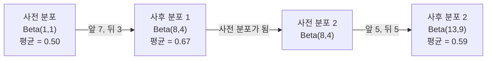

> 🇰🇷 이 문서는 한국어 번역본입니다(ELI5 스타일). 원문: [en.md](en.md)

# 베이즈 정리

> 확률은 '무엇을 예상하는가'에 관한 것이고, 베이즈 정리는 '무엇을 배우는가'에 관한 것입니다.

**유형:** Build
**언어:** Python
**선수 지식:** 페이즈 1, 레슨 06(확률 기초)
**시간:** 약 75분

## 학습 목표

- 사전 확률(prior), 가능도(likelihood), 증거(evidence)로부터 사후 확률(posterior)을 계산하기 위해 베이즈 정리를 적용합니다
- 라플라스 스무딩(Laplace smoothing)과 로그 공간 계산을 활용해 나이브 베이즈 텍스트 분류기를 처음부터 만듭니다
- MLE와 MAP 추정을 비교하고, MAP이 L2 정규화와 어떻게 대응되는지 설명합니다
- A/B 테스트를 위해 베타-이항(Beta-Binomial) 켤레 사전 분포를 사용한 순차적 베이즈 갱신을 구현합니다

## 문제 상황

어떤 의학 검사의 정확도는 99%입니다. 당신은 양성 판정을 받았습니다. 실제로 그 병을 가지고 있을 확률은 얼마일까요?

대부분의 사람은 99%라고 답합니다. 하지만 진짜 답은 그 병이 얼마나 드문지에 달려 있습니다. 10,000명 중 1명만 걸리는 병이라면, 양성 판정이 나와도 실제로 아플 확률은 약 1%에 불과합니다. 양성 판정의 나머지 99%는 건강한 사람에게서 나온 거짓 경보입니다.

이건 속임수 문제가 아닙니다. 바로 베이즈 정리입니다. 모든 스팸 필터, 모든 의료 진단, 불확실성을 수치로 다루는 모든 머신러닝 모델이 바로 이 추론을 사용합니다. 믿음에서 출발하고, 증거를 보고, 믿음을 갱신하는 것입니다.

이것을 이해하지 못한 채 ML 시스템을 만들면, 모델 출력을 잘못 해석하고, 엉터리 임계값을 정하고, 과하게 자신만만한 예측을 그대로 출시하게 됩니다.

## 개념

### 결합 확률에서 베이즈로

레슨 06에서 배웠듯이 조건부 확률은 다음과 같습니다:

```
P(A|B) = P(A and B) / P(B)
```

대칭적으로:

```
P(B|A) = P(A and B) / P(A)
```

두 식은 분자가 같습니다. P(A and B)이죠. 두 식을 같다고 놓고 정리하면:

```
P(A and B) = P(A|B) * P(B) = P(B|A) * P(A)

따라서:

P(A|B) = P(B|A) * P(A) / P(B)
```

이것이 베이즈 정리입니다. 네 개의 양, 하나의 식.

### 네 가지 구성 요소

| 구성 요소 | 이름 | 의미 |
|------|------|---------------|
| P(A\|B) | 사후 확률(posterior) | 증거 B를 본 뒤 A에 대해 갱신된 믿음 |
| P(B\|A) | 가능도(likelihood) | A가 참일 때 증거 B가 나타날 확률 |
| P(A) | 사전 확률(prior) | 증거를 보기 전에 갖고 있던 A에 대한 믿음 |
| P(B) | 증거(evidence) | 모든 가능성을 합쳤을 때 B가 나타날 전체 확률 |

증거 항 P(B)는 정규화 역할을 합니다. 전체 확률의 법칙(law of total probability)으로 전개할 수 있습니다:

```
P(B) = P(B|A) * P(A) + P(B|not A) * P(not A)
```

### 의학 검사 예시

어떤 병은 10,000명 중 1명에게 걸립니다. 검사의 정확도는 99%입니다(아픈 사람의 99%를 잡아내고, 건강한 사람을 1% 확률로 양성으로 오판합니다).

```
P(sick)          = 0.0001     (사전 확률: 병은 드물다)
P(positive|sick) = 0.99       (가능도: 검사가 잡아낸다)
P(positive|healthy) = 0.01    (거짓 양성률)

P(positive) = P(positive|sick) * P(sick) + P(positive|healthy) * P(healthy)
            = 0.99 * 0.0001 + 0.01 * 0.9999
            = 0.000099 + 0.009999
            = 0.010098

P(sick|positive) = P(positive|sick) * P(sick) / P(positive)
                 = 0.99 * 0.0001 / 0.010098
                 = 0.0098
                 = 0.98%
```

1%도 안 됩니다. 사전 확률이 모든 것을 지배합니다. 조건이 희귀하면, 정확도가 높은 검사라도 대부분 거짓 양성을 냅니다. 의사들이 확인용 검사를 따로 더 지시하는 이유가 바로 이것입니다.

### 스팸 필터 예시

"lottery"(복권)라는 단어가 들어간 이메일을 받았습니다. 스팸일까요?

```
P(spam)                = 0.3      (이메일의 30%는 스팸)
P("lottery"|spam)      = 0.05     (스팸 메일의 5%에 "lottery"가 들어 있다)
P("lottery"|not spam)  = 0.001    (정상 메일의 0.1%에 "lottery"가 들어 있다)

P("lottery") = 0.05 * 0.3 + 0.001 * 0.7
             = 0.015 + 0.0007
             = 0.0157

P(spam|"lottery") = 0.05 * 0.3 / 0.0157
                  = 0.955
                  = 95.5%
```

단어 하나가 확률을 30%에서 95.5%로 바꿔 놓았습니다. 실제 스팸 필터는 베이즈 정리를 수백 개의 단어에 동시에 적용합니다.

### 나이브 베이즈: 독립 가정

나이브 베이즈는 이 개념을 여러 특성(feature)으로 확장한 것으로, 클래스가 주어졌을 때 모든 특성이 조건부 독립이라고 가정합니다:

```
P(class | feature_1, feature_2, ..., feature_n)
  = P(class) * P(feature_1|class) * P(feature_2|class) * ... * P(feature_n|class)
    / P(feature_1, feature_2, ..., feature_n)
```

"나이브(순진하다)"라는 말은 바로 이 독립 가정에서 나왔습니다. 실제 텍스트에서 단어들의 등장은 독립적이지 않습니다("New"와 "York"은 함께 다닙니다). 그런데도 이 가정은 의외로 잘 작동합니다. 분류기에 필요한 것은 교정된(calibrated) 확률이 아니라 클래스 간 순위를 가리는 것이기 때문입니다.

분모는 모든 클래스에서 같으므로 생략하고 분자끼리만 비교해도 됩니다:

```
score(class) = P(class) * (P(feature_i | class)들의 곱)
```

가장 점수가 높은 클래스를 고릅니다.

### 최대 가능도 추정(MLE)

학습 데이터에서 P(feature|class)는 어떻게 구할까요? 세면 됩니다.

```
P("free"|spam) = ("free"가 들어간 스팸 메일 수) / (스팸 메일 총개수)
```

이것이 MLE입니다: 관찰된 데이터를 가장 그럴듯하게 만드는 매개변수 값을 고르는 것입니다. 가능도 함수를 최대화하는 건데, 이산 개수(discrete counts)의 경우에는 상대 도수로 귀결됩니다.

문제는 이것입니다: 학습 중 어떤 단어가 스팸에 한 번도 나오지 않았다면, MLE는 그 단어에 확률 0을 줍니다. 본 적 없는 단어 하나가 곱 전체를 0으로 만들어 버립니다. 라플라스 스무딩으로 이 문제를 해결합니다:

```
P(word|class) = (count(word, class) + 1) / (total_words_in_class + vocabulary_size)
```

모든 개수에 1을 더하면 확률이 0이 되는 일은 없습니다.

### 최대 사후 확률(MAP)

MLE는 묻습니다: P(data|parameters)를 최대화하는 매개변수는 무엇인가?

MAP은 묻습니다: P(parameters|data)를 최대화하는 매개변수는 무엇인가?

베이즈 정리에 의하면:

```
P(parameters|data) 는 P(data|parameters) * P(parameters) 에 비례합니다
```

MAP은 매개변수 자체에 대한 사전 확률을 더합니다. 매개변수가 작을 것이라고 믿는다면, 큰 값에 벌점을 주는 사전 분포로 그 믿음을 표현하면 됩니다. 이것은 ML의 L2 정규화와 정확히 같은 것입니다. 릿지 회귀(ridge regression)의 "릿지" 페널티는 문자 그대로 가중치에 대한 가우시안 사전 분포입니다.

| 추정 방법 | 최적화 대상 | ML에서의 대응물 |
|------------|-----------|---------------|
| MLE | P(data\|params) | 정규화 없는 학습 |
| MAP | P(data\|params) * P(params) | L2 / L1 정규화 |

### 베이지언 vs 빈도주의: 실무적 차이

빈도주의자(frequentist)는 매개변수를 고정된 미지수로 봅니다. 이들은 이렇게 묻죠: "이 실험을 여러 번 반복하면 어떻게 될까?"

베이지언(Bayesian)은 매개변수를 분포로 봅니다. 이들은 이렇게 묻습니다: "지금까지 관찰한 것을 볼 때, 매개변수에 대해 나는 무엇을 믿어야 하는가?"

ML 시스템을 만드는 관점에서의 실무적 차이는 다음과 같습니다:

| 측면 | 빈도주의 | 베이지언 |
|--------|-------------|----------|
| 출력 | 점 추정 | 값의 분포 |
| 불확실성 | 신뢰 구간(confidence interval, 절차에 대하여) | 신뢰 구간(credible interval, 매개변수에 대하여) |
| 작은 데이터 | 과적합될 수 있음 | 사전 분포가 정규화 역할 |
| 계산 | 대체로 빠름 | 흔히 샘플링 필요(MCMC) |

대부분의 프로덕션(운영 환경) ML은 빈도주의 방식입니다(SGD, 점 추정). 베이지언 방법이 빛을 발하는 때는 교정된 불확실성이 필요할 때(의료 판단, 안전이 중요한 시스템)나 데이터가 부족할 때(퓨샷 학습, 콜드 스타트)입니다.

### ML에서 베이지언 사고가 중요한 이유

이 연결은 단순한 비유 그 이상입니다:

**사전 분포는 정규화입니다.** 가중치에 대한 가우시안 사전 분포가 곧 L2 정규화이고, 라플라스 사전 분포가 곧 L1입니다. 정규화 항을 추가할 때마다 당신은 '어떤 매개변수 값을 기대하는가'에 대한 베이지언 선언을 하고 있던 것입니다.

**사후 분포는 불확실성입니다.** 예측 확률 하나만으로는 모델이 그 추정을 얼마나 확신하는지 알 수 없습니다. 베이지언 방법은 분포를 줍니다: "P(spam)은 0.8에서 0.95 사이라고 생각합니다."

**베이즈 갱신은 온라인 학습입니다.** 오늘의 사후 분포가 내일의 사전 분포가 됩니다. 모델이 새 데이터를 만나면 처음부터 다시 학습하는 대신 믿음을 조금씩 갱신합니다.

**모델 비교도 베이지언입니다.** 베이지언 정보 기준(BIC), 주변 가능도(marginal likelihood), 베이즈 인수(Bayes factor)는 모두 과적합 없이 모델을 고르기 위해 베이지언 추론을 사용합니다.

```figure
bayes-update
```

## 직접 만들기

### 단계 1: 베이즈 정리 함수

```python
def bayes(prior, likelihood, false_positive_rate):
    evidence = likelihood * prior + false_positive_rate * (1 - prior)
    posterior = likelihood * prior / evidence
    return posterior

result = bayes(prior=0.0001, likelihood=0.99, false_positive_rate=0.01)
print(f"P(sick|positive) = {result:.4f}")
```

### 단계 2: 나이브 베이즈 분류기

```python
import math
from collections import defaultdict

class NaiveBayes:
    def __init__(self, smoothing=1.0):
        self.smoothing = smoothing
        self.class_counts = defaultdict(int)
        self.word_counts = defaultdict(lambda: defaultdict(int))
        self.class_word_totals = defaultdict(int)
        self.vocab = set()

    def train(self, documents, labels):
        for doc, label in zip(documents, labels):
            self.class_counts[label] += 1
            words = doc.lower().split()
            for word in words:
                self.word_counts[label][word] += 1
                self.class_word_totals[label] += 1
                self.vocab.add(word)

    def predict(self, document):
        words = document.lower().split()
        total_docs = sum(self.class_counts.values())
        vocab_size = len(self.vocab)
        best_class = None
        best_score = float("-inf")
        for cls in self.class_counts:
            score = math.log(self.class_counts[cls] / total_docs)
            for word in words:
                count = self.word_counts[cls].get(word, 0)
                total = self.class_word_totals[cls]
                score += math.log((count + self.smoothing) / (total + self.smoothing * vocab_size))
            if score > best_score:
                best_score = score
                best_class = cls
        return best_class
```

로그 확률을 쓰면 언더플로(underflow)를 막을 수 있습니다. 작은 확률들을 여러 번 곱하면 부동소수점으로 표현하기 어려울 만큼 숫자가 작아집니다. 로그 확률을 더하는 방식은 수치적으로 안정적이면서 수학적으로도 완전히 동일합니다.

### 단계 3: 스팸 데이터로 학습

```python
train_docs = [
    "win free money now",
    "free lottery ticket winner",
    "claim your prize today free",
    "urgent offer free cash",
    "congratulations you won free",
    "meeting tomorrow at noon",
    "project update attached",
    "can we schedule a call",
    "quarterly report review",
    "lunch on thursday sounds good",
    "team standup notes attached",
    "please review the pull request",
]

train_labels = [
    "spam", "spam", "spam", "spam", "spam",
    "ham", "ham", "ham", "ham", "ham", "ham", "ham",
]

classifier = NaiveBayes()
classifier.train(train_docs, train_labels)

test_messages = [
    "free money waiting for you",
    "meeting rescheduled to friday",
    "you won a free prize",
    "please review the attached report",
]

for msg in test_messages:
    print(f"  '{msg}' -> {classifier.predict(msg)}")
```

### 단계 4: 학습된 확률 살펴보기

```python
def show_top_words(classifier, cls, n=5):
    vocab_size = len(classifier.vocab)
    total = classifier.class_word_totals[cls]
    probs = {}
    for word in classifier.vocab:
        count = classifier.word_counts[cls].get(word, 0)
        probs[word] = (count + classifier.smoothing) / (total + classifier.smoothing * vocab_size)
    sorted_words = sorted(probs.items(), key=lambda x: x[1], reverse=True)
    for word, prob in sorted_words[:n]:
        print(f"    {word}: {prob:.4f}")

print("\nTop spam words:")
show_top_words(classifier, "spam")
print("\nTop ham words:")
show_top_words(classifier, "ham")
```

## 실전에서 활용하기

Scikit-learn에는 프로덕션 수준의 나이브 베이즈 구현이 들어 있습니다:

```python
from sklearn.feature_extraction.text import CountVectorizer
from sklearn.naive_bayes import MultinomialNB
from sklearn.metrics import classification_report

vectorizer = CountVectorizer()
X_train = vectorizer.fit_transform(train_docs)
clf = MultinomialNB()
clf.fit(X_train, train_labels)

X_test = vectorizer.transform(test_messages)
predictions = clf.predict(X_test)
for msg, pred in zip(test_messages, predictions):
    print(f"  '{msg}' -> {pred}")
```

같은 알고리즘입니다. CountVectorizer가 토큰화와 어휘 구축을 맡고, MultinomialNB가 스무딩과 로그 확률 계산을 내부에서 처리합니다. 여러분이 처음부터 만든 버전도 똑같은 일을 40줄로 해 냅니다.

## 출시하기

여기서 만든 NaiveBayes 클래스는 전체 파이프라인을 보여 줍니다: 토큰화, 라플라스 스무딩을 곁들인 확률 추정, 로그 공간에서의 예측. `code/bayes.py`의 코드는 Python 표준 라이브러리 외에 별도 의존성 없이 끝까지 실행됩니다.

### 켤레 사전 분포

사전 분포와 사후 분포가 같은 분포족에 속할 때, 그 사전 분포를 "켤레(conjugate)"라고 부릅니다. 켤레 사전 분포를 쓰면 베이즈 갱신이 대수적으로 깔끔해집니다 -- 수치 적분 없이도 닫힌 형태(closed-form)의 사후 분포를 바로 얻습니다.

| 가능도 | 켤레 사전 분포 | 사후 분포 | 예 |
|-----------|----------------|-----------|---------|
| 베르누이(Bernoulli) | Beta(a, b) | Beta(a + 성공 횟수, b + 실패 횟수) | 동전 던지기 편향 추정 |
| 정규 분포(분산을 알 때) | Normal(mu_0, sigma_0) | Normal(가중 평균, 더 작은 분산) | 센서 보정 |
| 푸아송(Poisson) | Gamma(a, b) | Gamma(a + 개수 합, b + n) | 도착률 모델링 |
| 다항(multinomial) | Dirichlet(alpha) | Dirichlet(alpha + 개수) | 토픽 모델링, 언어 모델 |

중요한 이유: 켤레 사전 분포가 없으면 사후 분포를 근사하려면 몬테카를로 샘플링이나 변분 추론(variational inference)이 필요합니다. 켤레 사전 분포가 있으면 숫자 두 개를 더하기만 하면 됩니다.

베타 분포는 실무에서 가장 흔히 쓰는 켤레 사전 분포입니다. Beta(a, b)는 확률 매개변수에 대한 여러분의 믿음을 나타냅니다. 평균은 a/(a+b)입니다. a+b가 클수록 분포는 더 좁고 집중됩니다(확신이 강합니다).

베타 사전 분포의 특수 사례:
- Beta(1, 1) = 균등 분포. 매개변수에 대해 특별한 의견이 없습니다.
- Beta(10, 10) = 0.5에 뾰족하게 모임. 매개변수가 0.5 근처라는 강한 믿음입니다.
- Beta(1, 10) = 0 쪽으로 치우침. 매개변수가 작다고 믿습니다.

갱신 규칙은 놀랄 만큼 단순합니다:

```
사전 분포:  Beta(a, b)
데이터:     성공 s회, 실패 f회
사후 분포:  Beta(a + s, b + f)
```

적분도, 샘플링도 없습니다. 그냥 더하기입니다.

### 순차적 베이즈 갱신

베이즈 추론은 본래부터 순차적입니다. 오늘의 사후 분포가 내일의 사전 분포가 됩니다. 실제 시스템이 과거 데이터를 전부 다시 처리하지 않고도 점진적으로 학습하는 방식이 바로 이것입니다.

구체적인 예: 동전이 공정한지 추정하기.

**1일차: 아직 데이터 없음.**
Beta(1, 1) -- 균등 사전 분포에서 시작합니다. 아직 의견이 없습니다.
- 사전 평균: 0.5
- 사전 분포는 [0, 1] 구간에서 평평함

**2일차: 앞면 7번, 뒷면 3번 관찰.**
사후 분포 = Beta(1 + 7, 1 + 3) = Beta(8, 4)
- 사후 평균: 8/12 = 0.667
- 증거는 동전이 앞면 쪽으로 치우쳤다고 말해 줍니다

**3일차: 앞면 5번, 뒷면 5번 추가 관찰.**
어제의 사후 분포를 오늘의 사전 분포로 씁니다.
사후 분포 = Beta(8 + 5, 4 + 5) = Beta(13, 9)
- 사후 평균: 13/22 = 0.591
- 고르게 들어온 새 데이터가 추정값을 다시 0.5 쪽으로 끌어당김



관찰 순서는 중요하지 않습니다. Beta(1,1)에서 시작해 앞면 12번, 뒷면 8번을 한꺼번에 반영해도 Beta(13, 9) -- 같은 결과입니다. 순차 갱신과 배치 갱신은 수학적으로 동치입니다. 다만 순차 갱신을 쓰면 원본 데이터를 보관하지 않고도 매 단계에서 결정을 내릴 수 있습니다.

이것이 프로덕션 ML 시스템의 온라인 학습의 기초입니다. 밴딧(bandit)용 톰슨 샘플링(Thompson sampling), 점진적 추천 시스템, 스트리밍 이상 탐지기가 모두 이 패턴을 사용합니다.

### A/B 테스트와의 연결

A/B 테스트는 변장한 베이즈 추론입니다.

설정: 버튼 색 두 가지를 테스트한다고 합시다. 변형 A(파랑)와 변형 B(초록). 어느 쪽이 클릭을 더 많이 받는지 알고 싶습니다.

베이지언 A/B 테스트는 이렇게 진행합니다:

1. **사전 분포.** 두 변형 모두 Beta(1, 1)로 시작합니다. 미리 기울인 마음은 없습니다.
2. **데이터.** 변형 A: 1,000회 노출 중 50회 클릭. 변형 B: 1,000회 노출 중 65회 클릭.
3. **사후 분포.**
   - A: Beta(1 + 50, 1 + 950) = Beta(51, 951). 평균 = 0.051
   - B: Beta(1 + 65, 1 + 935) = Beta(66, 936). 평균 = 0.066
4. **결정.** P(B > A)를 계산합니다 -- B의 실제 전환율이 A보다 높을 확률입니다.

P(B > A)를 해석적으로 계산하기는 어렵습니다. 하지만 몬테카를로를 쓰면 아주 간단해집니다:

```
1. Beta(51, 951)에서 표본 100,000개를 뽑는다  -> samples_A
2. Beta(66, 936)에서 표본 100,000개를 뽑는다  -> samples_B
3. P(B > A) = B > A 인 표본의 비율
```

P(B > A) > 0.95면 변형 B를 출시합니다. 0.05와 0.95 사이면 데이터를 더 모읍니다. P(B > A) < 0.05면 변형 A를 출시합니다.

빈도주의 A/B 테스트에 비교한 장점:
- 직접적인 확률 진술이 나옵니다: "B가 더 좋을 확률이 97%입니다"
- p-값 혼란이 없습니다. "귀무가설을 기각하지 못했다"는 식의 애매한 수사도 없습니다.
- 거짓 양성률을 부풀리지 않고도 언제든 결과를 확인할 수 있습니다("훔쳐보기 문제(peeking problem)" 없음)
- 사전 지식을 반영할 수 있습니다(예: 지난 테스트들을 보면 전환율은 보통 3~8%였다)

| 측면 | 빈도주의 A/B | 베이지언 A/B |
|--------|----------------|--------------|
| 출력 | p-값 | P(B > A) |
| 해석 | "A=B일 때 이 데이터는 얼마나 놀라운가?" | "B가 A보다 좋을 가능성은 얼마인가?" |
| 조기 중단 | 거짓 양성을 부풀림 | 언제든 안전(사전 분포가 적절하고 모델이 올바르게 명시된 경우) |
| 사전 지식 | 사용하지 않음 | 베타 사전 분포로 인코딩 |
| 결정 규칙 | p < 0.05 | P(B > A) > 임계값 |

## 연습 문제

1. **검사 두 번.** 환자가 서로 독립인 검사 두 번에서 모두 양성 판정을 받았습니다(둘 다 정확도 99%, 병 유병률은 10,000명 중 1명). 두 검사를 모두 반영한 뒤 P(sick)는 얼마일까요? 첫 번째 검사의 사후 확률을 두 번째 검사의 사전 확률로 사용하세요.

2. **스무딩의 영향.** 스팸 분류기를 스무딩 값 0.01, 0.1, 1.0, 10.0으로 각각 실행해 보세요. 상위 단어 확률은 어떻게 바뀌나요? smoothing=0이고 어떤 단어가 ham에만 나온다면 무슨 일이 벌어지나요?

3. **특성 추가.** NaiveBayes 클래스를 확장해 단어 개수와 함께 메시지 길이(짧음/김)도 특성으로 사용해 보세요. 학습 데이터에서 P(short|spam)과 P(short|ham)을 추정하고, 예측 점수에 반영하세요.

4. **손으로 풀어 보는 MAP.** 관찰 데이터(동전 10번 던지기에서 앞면 7번)가 주어졌을 때, Beta(2,2) 사전 분포를 사용한 편향의 MAP 추정값을 계산하세요. MLE 추정값(7/10)과 비교해 보세요.

## 핵심 용어

| 용어 | 사람들이 말하는 것 | 실제 의미 |
|------|----------------|----------------------|
| 사전 확률(Prior) | "내 첫 추측" | 증거를 관찰하기 전의 P(가설). ML에서는 정규화 항. |
| 가능도(Likelihood) | "데이터가 얼마나 맞는가" | P(증거\|가설). 특정 가설 아래에서 관찰된 데이터가 나올 확률. |
| 사후 확률(Posterior) | "갱신된 내 믿음" | P(가설\|증거). 사전 확률에 가능도를 곱한 뒤 정규화한 것. |
| 증거(Evidence) | "정규화 상수" | 모든 가설에 걸친 P(데이터). 사후 확률의 합이 1이 되도록 보장. |
| 나이브 베이즈(Naive Bayes) | "그 간단한 텍스트 분류기" | 클래스가 주어지면 특성들이 독립이라고 가정하는 분류기. 가정이 틀렸는데도 잘 작동. |
| 라플라스 스무딩(Laplace smoothing) | "더하기 1 스무딩" | 보이지 않는 데이터 때문에 확률이 0이 되지 않도록 모든 특성 개수에 작은 값을 더하는 것. |
| MLE | "그냥 도수를 써라" | P(데이터\|매개변수)를 최대화하는 매개변수 선택. 사전 분포 없음. 데이터가 적으면 과적합 가능. |
| MAP | "사전 분포를 곁들인 MLE" | P(데이터\|매개변수) * P(매개변수)를 최대화하는 매개변수 선택. 정규화된 MLE와 동치. |
| 로그 확률(Log-probability) | "로그 공간에서 작업하라" | 작은 수를 여러 번 곱할 때 부동소수점 언더플로를 피하려고 P 대신 log(P)를 쓰는 것. |
| 거짓 양성(False positive) | "잘못된 경보" | 검사는 양성이라 하는데 실제 상태는 음성인 경우. 기본률 오류(base rate fallacy)를 일으키는 주범. |

## 더 읽을거리

- [3Blue1Brown: 베이즈 정리](https://www.youtube.com/watch?v=HZGCoVF3YvM) - 의학 검사 예시로 보는 시각적 설명
- [Stanford CS229: 생성 학습 알고리즘](https://cs229.stanford.edu/notes2022fall/cs229-notes2.pdf) - 나이브 베이즈와 판별 모델과의 연결
- [Think Bayes](https://greenteapress.com/wp/think-bayes/) - 무료 책, Python 코드로 배우는 베이지언 통계
- [scikit-learn 나이브 베이즈](https://scikit-learn.org/stable/modules/naive_bayes.html) - 프로덕션 구현과 각 변형을 언제 쓰는지
