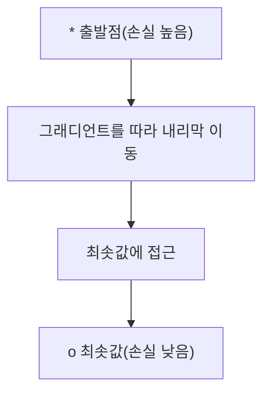
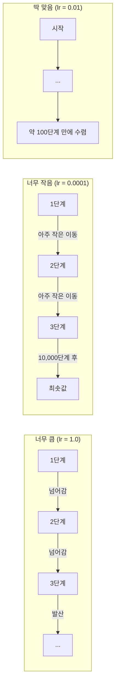
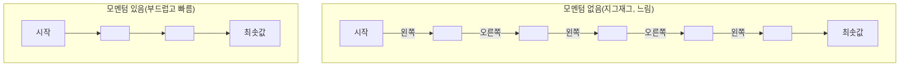
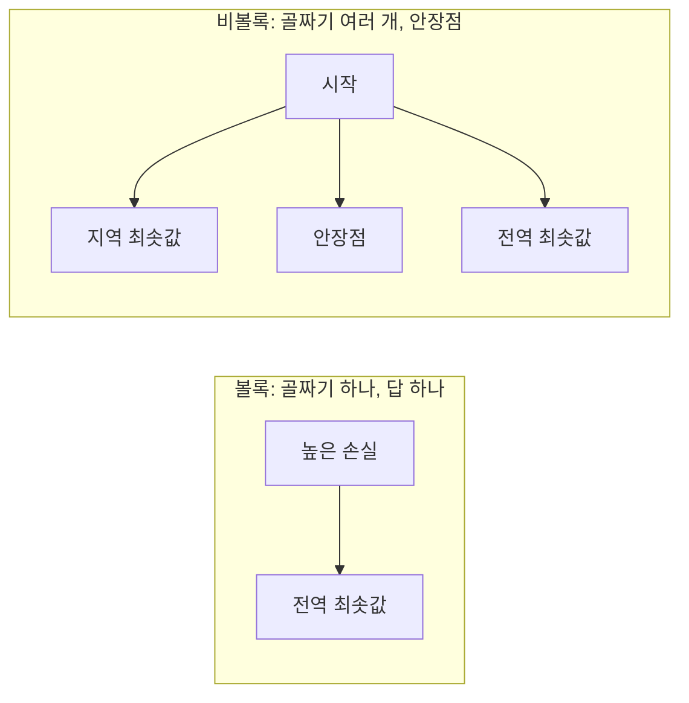
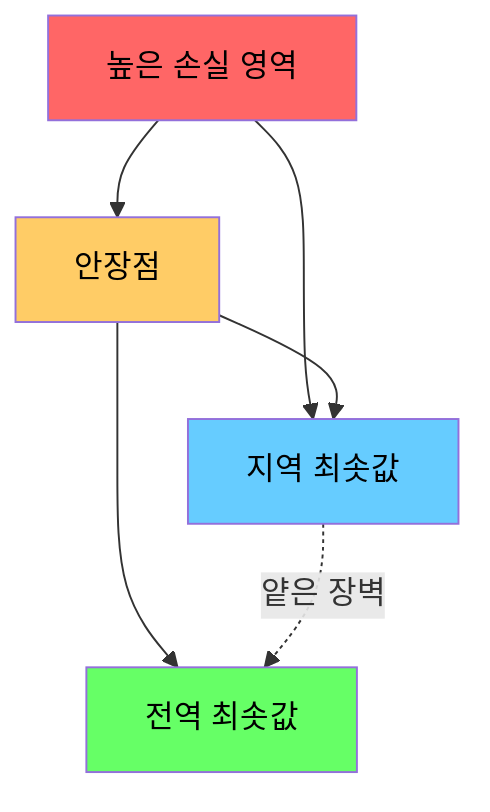

> 🇰🇷 이 문서는 한국어 번역본입니다(ELI5 스타일). 원문: [en.md](en.md)

# 최적화

> 신경망 학습이란 골짜기 바닥을 찾는 것, 그게 전부입니다.

**유형:** Build
**언어:** Python
**선수 지식:** 페이즈 1, 레슨 04-05(도함수, 그래디언트)
**시간:** 약 75분

## 학습 목표

- 기본 경사 하강법(vanilla gradient descent), 모멘텀을 곁들인 SGD, Adam을 처음부터 구현합니다
- 로젠브록(Rosenbrock) 함수에서 옵티마이저들의 수렴을 비교하고, Adam이 가중치별 학습률을 어떻게 조정하는지 설명합니다
- 볼록(convex) 손실 지형과 비볼록 손실 지형을 구분하고, 고차원에서 안장점이 하는 역할을 설명합니다
- 학습 안정성을 위해 학습률 스케줄(스텝 감쇠, 코사인 어닐링, 워밍업)을 설정합니다

## 문제 상황

손실 함수가 있습니다. 모델이 얼마나 틀렸는지 알려 주죠. 그래디언트(gradient)도 있습니다. 손실을 더 악화시키는 방향을 알려 줍니다. 이제 내리막을 걸어 내려갈 전략이 필요합니다.

순진한 방법은 단순합니다: 그래디언트 반대 방향으로 이동합니다. 이동폭을 학습률(learning rate)이라 부르는 숫자로 조절합니다. 반복합니다. 이것이 경사 하강법이고, 실제로 작동합니다. 하지만 '작동한다'에는 단서가 붙습니다. 학습률이 너무 크면 골짜기를 완전히 날아 넘어 벽 사이를 튕겨 다닙니다. 너무 작으면 불필요한 수천 단계를 기어가듯 이동해야 합니다. 안장점에 걸리면 최솟값을 찾지도 못했는데 움직임이 멈춰 버립니다.

딥러닝의 모든 옵티마이저는 같은 질문에 대한 답입니다: 어떻게 하면 더 빠르고, 더 믿을 만하게 골짜기 바닥에 도달할 수 있을까?

## 개념

### 최적화란 무엇인가

최적화는 함수를 최소화(또는 최대화)하는 입력값을 찾는 일입니다. 머신러닝에서 함수는 손실이고, 입력은 모델의 가중치입니다. 학습(훈련)은 곧 최적화입니다.

```
minimize L(w) where:
  L = 손실 함수
  w = 모델 가중치(수백만 개의 매개변수일 수 있음)
```

### 경사 하강법(기본형)

가장 단순한 옵티마이저입니다. 모든 가중치에 대한 손실의 그래디언트를 계산합니다. 각 가중치를 그래디언트 반대 방향으로 이동시키고, 이동폭은 학습률로 조절합니다.

```
w = w - lr * gradient
```

알고리즘이 전부입니다. 단 한 줄이죠.



### 학습률: 가장 중요한 하이퍼파라미터

학습률은 이동폭을 조절합니다. 수렴의 모든 것을 결정하죠.



적절한 학습률을 알려 주는 공식은 없습니다. 실험으로 찾아야 합니다. 흔한 시작점: Adam은 0.001, 모멘텀을 곁들인 SGD는 0.01.

### SGD vs 배치 vs 미니배치

기본 경사 하강법은 한 걸음 나아가기 전에 데이터셋 전체에 대한 그래디언트를 계산합니다. 이를 배치 경사 하강법이라 부릅니다. 안정적이지만 느립니다.

확률적 경사 하강법(SGD)은 무작위로 뽑은 샘플 하나에 대해 그래디언트를 계산하고 즉시 이동합니다. 시끄럽지만(노이즈가 있지만) 빠릅니다.

미니배치 경사 하강법은 그 중간을 취합니다. 작은 배치(32, 64, 128, 256개 샘플)에 대해 그래디언트를 계산한 뒤 이동합니다. 실제로 모두가 쓰는 방식입니다.

| 변형 | 배치 크기 | 그래디언트 품질 | 단계당 속도 | 노이즈 |
|---------|-----------|-----------------|---------------|-------|
| 배치 GD | 데이터셋 전체 | 정확함 | 느림 | 없음 |
| SGD | 샘플 1개 | 매우 시끄러움 | 빠름 | 높음 |
| 미니배치 | 32-256 | 좋은 추정치 | 균형 잡힘 | 보통 |

SGD와 미니배치의 노이즈는 버그가 아닙니다. 얕은 지역 최솟값과 안장점에서 빠져나오는 데 도움이 됩니다.

### 모멘텀: 언덕을 굴러 내려가는 공

기본 경사 하강법은 현재 그래디언트만 봅니다. 그래디언트가 지그재그면(좁은 골짜기에서 흔합니다) 진전이 더딥니다. 모멘텀(momentum)은 과거 그래디언트를 속도 항에 쌓아서 이 문제를 고칩니다.

```
v = beta * v + gradient
w = w - lr * v
```

비유하자면 언덕을 굴러 내려가는 공입니다. 굴곡마다 멈췄다 다시 출발하지 않습니다. 일관된 방향으로는 속도를 붙이고, 진동은 잘라 냅니다.



`beta`(보통 0.9)는 과거를 얼마나 기억할지 조절합니다. 베타가 클수록 모멘텀이 커지고 경로가 부드러워지지만, 방향이 바뀔 때의 반응은 느려집니다.

### Adam: 적응형 학습률

가중치마다 필요한 학습률은 다릅니다. 큰 그래디언트를 드물게 받는 가중치는 큰 그래디언트가 마침 들어왔을 때 더 큰 폭으로 움직여야 합니다. 항상 어마어마한 그래디언트를 받는 가중치는 더 작은 폭으로 움직여야 합니다.

Adam(Adaptive Moment Estimation)은 가중치마다 두 가지를 추적합니다:

1. 1차 모멘트(m): 그래디언트의 이동 평균(모멘텀과 비슷)
2. 2차 모멘트(v): 그래디언트 제곱의 이동 평균(그래디언트 크기)

```
m = beta1 * m + (1 - beta1) * gradient
v = beta2 * v + (1 - beta2) * gradient^2

m_hat = m / (1 - beta1^t)    편향 보정
v_hat = v / (1 - beta2^t)    편향 보정

w = w - lr * m_hat / (sqrt(v_hat) + epsilon)
```

`sqrt(v_hat)`로 나누는 것이 핵심 아이디어입니다. 그래디언트가 큰 가중치는 큰 수로 나눠지고(실효 학습률은 작아짐), 그래디언트가 작은 가중치는 작은 수로 나눠집니다(실효 학습률은 커짐). 각 가중치가 자기만의 적응형 학습률을 갖게 되는 것이죠.

기본 하이퍼파라미터: `lr=0.001, beta1=0.9, beta2=0.999, epsilon=1e-8`. 이 기본값은 대부분의 문제에서 잘 통합니다.

### 학습률 스케줄

고정 학습률은 타협안입니다. 학습 초반에는 큰 폭으로 빠르게 진전하고 싶고, 후반에는 최솟값 근처를 미세 조정하려고 작은 폭으로 움직이고 싶습니다.

흔한 스케줄:

| 스케줄 | 공식 | 용도 |
|----------|---------|----------|
| 스텝 감쇠 | N 에포크마다 lr = lr * factor | 단순, 수동 제어 |
| 지수 감쇠 | lr = lr_0 * decay^t | 부드러운 감소 |
| 코사인 어닐링 | lr = lr_min + 0.5 * (lr_max - lr_min) * (1 + cos(pi * t / T)) | 트랜스포머, 현대적 학습 |
| 워밍업 + 감쇠 | 선형으로 올렸다가 감쇠 | 대형 모델, 초기 불안정 방지 |

### 볼록 vs 비볼록

볼록 함수는 최솟값이 하나뿐입니다. 경사 하강법은 언제나 그것을 찾아냅니다. `f(x) = x^2` 같은 이차 함수는 볼록합니다.

신경망의 손실 함수는 비볼록입니다. 지역 최솟값, 안장점, 평평한 구역이 많습니다.



실전에서 고차원 신경망의 지역 최솟값은 문제가 되는 경우가 드뭅니다. 대부분의 지역 최솟값은 전역 최솟값에 가까운 손실 값을 갖습니다. 진짜 장애물은 안장점(어떤 방향으로는 평평하고 다른 방향으로는 휘어진 점)입니다. 모멘텀과 미니배치의 노이즈가 그것을 빠져나가는 데 도움이 됩니다.

### 손실 지형 시각화

손실은 모든 가중치의 함수입니다. 가중치 100만 개짜리 모델이라면 손실 지형은 1,000,001차원 공간에 존재합니다. 시각화는 가중치 공간에서 무작위 방향 두 개를 골라 그 방향을 따라가는 손실을 그려서 2차원 면을 만드는 방식으로 합니다.



뾰족한 최솟값은 일반화가 나쁩니다. 평평한 최솟값은 일반화가 좋습니다. 최종 테스트 정확도에서 모멘텀을 곁들인 SGD가 종종 Adam을 이기는 이유 중 하나가 이것입니다: SGD의 노이즈가 뾰족한 최솟값에 가라앉는 것을 막아 주기 때문입니다.

```figure
gradient-descent
```

## 직접 만들기

### 단계 1: 테스트 함수 정의

로젠브록 함수는 고전적인 최적화 벤치마크입니다. 최솟값은 (1, 1)에 있는데, 좁고 휘어진 골짜기 안쪽에 있어서 찾기는 쉬워도 따라가기는 어렵습니다.

```
f(x, y) = (1 - x)^2 + 100 * (y - x^2)^2
```

```python
def rosenbrock(params):
    x, y = params
    return (1 - x) ** 2 + 100 * (y - x ** 2) ** 2

def rosenbrock_gradient(params):
    x, y = params
    df_dx = -2 * (1 - x) + 200 * (y - x ** 2) * (-2 * x)
    df_dy = 200 * (y - x ** 2)
    return [df_dx, df_dy]
```

### 단계 2: 기본 경사 하강법

```python
class GradientDescent:
    def __init__(self, lr=0.001):
        self.lr = lr

    def step(self, params, grads):
        return [p - self.lr * g for p, g in zip(params, grads)]
```

### 단계 3: 모멘텀을 곁들인 SGD

```python
class SGDMomentum:
    def __init__(self, lr=0.001, momentum=0.9):
        self.lr = lr
        self.momentum = momentum
        self.velocity = None

    def step(self, params, grads):
        if self.velocity is None:
            self.velocity = [0.0] * len(params)
        self.velocity = [
            self.momentum * v + g
            for v, g in zip(self.velocity, grads)
        ]
        return [p - self.lr * v for p, v in zip(params, self.velocity)]
```

### 단계 4: Adam

```python
class Adam:
    def __init__(self, lr=0.001, beta1=0.9, beta2=0.999, epsilon=1e-8):
        self.lr = lr
        self.beta1 = beta1
        self.beta2 = beta2
        self.epsilon = epsilon
        self.m = None
        self.v = None
        self.t = 0

    def step(self, params, grads):
        if self.m is None:
            self.m = [0.0] * len(params)
            self.v = [0.0] * len(params)

        self.t += 1

        self.m = [
            self.beta1 * m + (1 - self.beta1) * g
            for m, g in zip(self.m, grads)
        ]
        self.v = [
            self.beta2 * v + (1 - self.beta2) * g ** 2
            for v, g in zip(self.v, grads)
        ]

        m_hat = [m / (1 - self.beta1 ** self.t) for m in self.m]
        v_hat = [v / (1 - self.beta2 ** self.t) for v in self.v]

        return [
            p - self.lr * mh / (vh ** 0.5 + self.epsilon)
            for p, mh, vh in zip(params, m_hat, v_hat)
        ]
```

### 단계 5: 실행하고 비교하기

```python
def optimize(optimizer, func, grad_func, start, steps=5000):
    params = list(start)
    history = [params[:]]
    for _ in range(steps):
        grads = grad_func(params)
        params = optimizer.step(params, grads)
        history.append(params[:])
    return history

start = [-1.0, 1.0]

gd_history = optimize(GradientDescent(lr=0.0005), rosenbrock, rosenbrock_gradient, start)
sgd_history = optimize(SGDMomentum(lr=0.0001, momentum=0.9), rosenbrock, rosenbrock_gradient, start)
adam_history = optimize(Adam(lr=0.01), rosenbrock, rosenbrock_gradient, start)

for name, history in [("GD", gd_history), ("SGD+M", sgd_history), ("Adam", adam_history)]:
    final = history[-1]
    loss = rosenbrock(final)
    print(f"{name:6s} -> x={final[0]:.6f}, y={final[1]:.6f}, loss={loss:.8f}")
```

예상 실행 결과: Adam이 가장 빨리 수렴합니다. 모멘텀을 곁들인 SGD는 더 부드러운 경로를 따라갑니다. 기본 GD는 좁은 골짜기를 따라 천천히 나아갑니다.

## 실전에서 활용하기

실전에서는 PyTorch나 JAX의 옵티마이저를 쓰세요. 매개변수 그룹, 가중치 감쇠(weight decay), 그래디언트 클리핑, GPU 가속을 알아서 처리해 줍니다.

```python
import torch

model = torch.nn.Linear(784, 10)

sgd = torch.optim.SGD(model.parameters(), lr=0.01, momentum=0.9)
adam = torch.optim.Adam(model.parameters(), lr=0.001)
adamw = torch.optim.AdamW(model.parameters(), lr=0.001, weight_decay=0.01)

scheduler = torch.optim.lr_scheduler.CosineAnnealingLR(adam, T_max=100)
```

경험 법칙:

- Adam(lr=0.001)으로 시작하세요. 튜닝 없이도 대부분의 문제에서 작동합니다.
- 최고의 최종 정확도가 필요하고 더 많은 튜닝을 감당할 수 있을 때는 모멘텀을 곁들인 SGD(lr=0.01, momentum=0.9)로 바꾸세요.
- 트랜스포머에는 AdamW(가중치 감쇠를 분리한 Adam)를 사용하세요.
- 몇 에포크를 넘어가는 학습에는 항상 학습률 스케줄을 쓰세요.
- 학습이 불안정하면 학습률을 낮추세요. 너무 느리면 올리세요.

## 출시하기

이 레슨은 올바른 옵티마이저를 고르기 위한 프롬프트를 산출물로 만듭니다. `outputs/prompt-optimizer-guide.md`를 보세요.

여기서 만든 옵티마이저 클래스들은 페이즈 3에서 신경망을 처음부터 학습시킬 때 다시 등장합니다.

## 연습 문제

1. **학습률 스윕.** 로젠브록 함수에 학습률 [0.0001, 0.0005, 0.001, 0.005, 0.01]를 적용해 기본 경사 하강법을 실행하세요. 각각 5000단계 후의 최종 손실을 출력하거나 그래프로 그리세요. 여전히 수렴하는 가장 큰 학습률을 찾아 보세요.

2. **모멘텀 비교.** 로젠브록 함수에 모멘텀 값 [0.0, 0.5, 0.9, 0.99]를 적용해 SGD를 실행하세요. 매 단계의 손실을 기록하세요. 어떤 모멘텀 값이 가장 빨리 수렴하나요? 어느 것이 최솟값을 넘어 튀어 오르나요?

3. **안장점 탈출.** `f(x, y) = x^2 - y^2` 함수(원점에 안장점이 있음)를 정의하세요. (0.01, 0.01)에서 시작합니다. 기본 GD, 모멘텀을 곁들인 SGD, Adam의 행동을 비교하세요. 안장점을 탈출하는 것은 어느 것인가요?

4. **학습률 감쇠 구현.** GradientDescent 클래스에 지수 감쇠 스케줄을 추가하세요: `lr = lr_0 * 0.999^step`. 로젠브록 함수에서 감쇠의 유무에 따른 수렴을 비교하세요.

## 핵심 용어

| 용어 | 사람들이 말하는 것 | 실제 의미 |
|------|----------------|----------------------|
| 경사 하강법(Gradient descent) | "내리막으로 내려가라" | 학습률을 곱한 그래디언트를 빼서 가중치를 갱신한다. 가장 기본적인 옵티마이저. |
| 학습률(Learning rate) | "이동폭" | 갱신마다 가중치가 얼마나 움직이는지 조절하는 스칼라. 너무 크면 발산하고, 너무 작으면 연산을 낭비한다. |
| 모멘텀(Momentum) | "계속 굴러가라" | 과거 그래디언트를 속도 벡터에 쌓는다. 진동을 잘라 내고 일관된 방향으로의 이동을 가속한다. |
| SGD | "무작위 샘플링" | 확률적 경사 하강법. 데이터셋 전체 대신 무작위 부분집합으로 그래디언트를 계산한다. 실전에서는 거의 항상 미니배치 SGD를 뜻한다. |
| 미니배치(Mini-batch) | "데이터 한 덩어리" | 그래디언트 추정에 쓰는 작은 학습 데이터 부분집합(32-256개 샘플). 속도와 그래디언트 정확도의 균형을 잡는다. |
| Adam | "기본 옵티마이저" | Adaptive Moment Estimation. 가중치별로 그래디언트와 그래디언트 제곱의 이동 평균을 추적해 각 가중치에 자기만의 학습률을 준다. |
| 편향 보정(Bias correction) | "차가운 출발 고치기" | Adam의 1차/2차 모멘트는 0으로 초기화된다. 편향 보정은 초기 단계에서 (1 - beta^t)로 나눠 이를 보상한다. |
| 학습률 스케줄(Learning rate schedule) | "시간에 따라 lr 바꾸기" | 학습 도중 학습률을 조절하는 함수. 초반엔 크게, 후반엔 작게. |
| 볼록 함수(Convex function) | "골짜기 하나" | 어떤 지역 최솟값이든 곧 전역 최솟값인 함수. 경사 하강법이 언제나 찾아낸다. 신경망 손실은 볼록하지 않다. |
| 안장점(Saddle point) | "평평하지만 최솟값은 아닌 점" | 그래디언트가 0인데 어떤 방향으로는 최소, 다른 방향으로는 최대인 점. 고차원에서 흔하다. |
| 손실 지형(Loss landscape) | "지형" | 가중치 공간 위에 그린 손실 함수. 무작위 방향 두 개로 슬라이스해서 시각화한다. |
| 수렴(Convergence) | "도착했다" | 추가 단계가 손실을 유의미하게 줄이지 못하는 지점에 옵티마이저가 도달했다. |

## 더 읽을거리

- [Sebastian Ruder: 경사 하강법 최적화 알고리즘 개관](https://ruder.io/optimizing-gradient-descent/) - 주요 옵티마이저 전체를 망라한 종합 서베이
- [왜 모멘텀은 정말 작동하는가 (Distill)](https://distill.pub/2017/momentum/) - 모멘텀 역학의 인터랙티브 시각화
- [Adam: A Method for Stochastic Optimization (Kingma & Ba, 2014)](https://arxiv.org/abs/1412.6980) - Adam 원논문. 읽기 쉽고 짧다
- [신경망 손실 지형 시각화 (Li et al., 2018)](https://arxiv.org/abs/1712.09913) - 뾰족한 최솟값 vs 평평한 최솟값을 보여 준 논문
