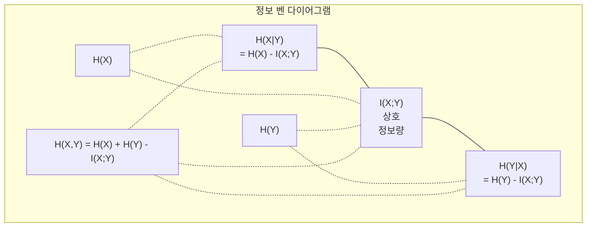

> 🇰🇷 이 문서는 한국어 번역본입니다(ELI5 스타일). 원문: [en.md](en.md)

# 정보 이론

> 정보 이론은 '놀람'을 측정합니다. 손실 함수는 그 위에 세워져 있습니다.

**유형:** Learn
**언어:** Python
**선수 지식:** 페이즈 1, 레슨 06(확률)
**시간:** 약 60분

## 학습 목표

- 엔트로피, 교차 엔트로피, KL 발산을 처음부터 구현하고 이들 사이의 관계를 설명합니다
- 교차 엔트로피 손실을 최소화하는 것이 로그 가능도를 최대화하는 것과 동치임을 유도합니다
- 특성(feature)과 타깃 사이의 상호 정보량을 계산해 특성 중요도의 순위를 매깁니다
- 퍼플렉서티(perplexity)를 언어 모델이 고르는 '실효 어휘 크기'로 설명합니다

## 문제 상황

분류 모델을 학습시킬 때마다 `CrossEntropyLoss()`를 호출합니다. 언어 모델 논문마다 "perplexity"를 봅니다. VAE, 증류(distillation), RLHF 이야기에서 KL 발산을 읽습니다. 이 개념들은 서로 동떨어져 있지 않습니다. 전부 같은 아이디어가 다른 모자를 쓰고 있는 것입니다.

정보 이론은 불확실성, 압축, 예측을 다룰 언어를 줍니다. Claude Shannon이 1948년 통신 문제를 풀기 위해 만들었습니다. 그런데 신경망 학습도 통신 문제였던 겁니다: 모델은 학습된 가중치라는 잡음 많은 채널을 통해 정답 레이블을 전송하려 하고 있으니까요.

이 레슨은 모든 공식을 처음부터 만들어 봅니다. 그 공식들이 어디서 왔고 왜 작동하는지 직접 보기 위해서입니다.

## 개념

### 정보량(놀람)

일어나기 어려운 일이 일어날수록 더 많은 정보를 담고 있습니다. 동전이 앞면이 나왔다? 놀랍지 않죠. 복권에 당첨됐다? 엄청 놀랍죠.

확률 p인 사건의 정보량은:

```
I(x) = -log(p(x))
```

로그 밑을 2로 쓰면 비트(bit), 자연로그를 쓰면 nat이 됩니다. 같은 아이디어, 다른 단위죠.

```
사건               확률    놀람(비트)
공정한 동전 앞면    0.5            1.0
주사위 6이 나옴     0.167          2.58
1000분의 1 사건     0.001          9.97
필연적 사건         1.0            0.0
```

필연적 사건은 정보량이 0입니다. 일어날 줄 이미 알고 있었으니까요.

### 엔트로피(평균 놀람)

엔트로피는 분포의 모든 가능한 결과에 걸친 기대 놀람입니다.

```
H(P) = -sum( p(x) * log(p(x)) )  모든 x에 대해
```

공정한 동전은 이진 변수에서 최대 엔트로피를 갖습니다: 1비트죠. 치우친 동전(앞면 99%)은 엔트로피가 낮습니다: 0.08비트. 무슨 일이 일어날지 이미 알기 때문에 던질 때마다 거의 아무것도 알려 주지 않습니다.

```
공정한 동전:    H = -(0.5 * log2(0.5) + 0.5 * log2(0.5)) = 1.0 bit
치우친 동전:  H = -(0.99 * log2(0.99) + 0.01 * log2(0.01)) = 0.08 bits
```

엔트로피는 분포 안에 줄일 수 없는 불확실성이 얼마인지 측정합니다. 그 아래로는 압축할 수 없습니다.

### 교차 엔트로피(여러분이 매일 쓰는 손실 함수)

교차 엔트로피는 실제로 분포 P에서 나온 사건을 분포 Q로 부호화할 때의 평균 놀람을 측정합니다.

```
H(P, Q) = -sum( p(x) * log(q(x)) )  모든 x에 대해
```

P는 참 분포(레이블)입니다. Q는 모델의 예측이죠. Q가 P와 완벽히 일치하면 교차 엔트로피는 엔트로피와 같아집니다. 어긋나면 더 커집니다.

분류에서 P는 원-핫(one-hot) 벡터입니다(정답 클래스만 확률 1, 나머지는 전부 0). 그러면 교차 엔트로피가 이렇게 단순해집니다:

```
H(P, Q) = -log(q(true_class))
```

이것이 분류용 교차 엔트로피 손실 공식의 전부입니다. 정답 클래스의 예측 확률을 최대화하는 것뿐이죠.

### KL 발산(분포 사이의 거리)

KL 발산은 P 대신 Q를 쓸 때 얼마나 추가로 놀라게 되는지 측정합니다.

```
D_KL(P || Q) = sum( p(x) * log(p(x) / q(x)) )  모든 x에 대해
             = H(P, Q) - H(P)
```

교차 엔트로피는 엔트로피에 KL 발산을 더한 것입니다. 참 분포의 엔트로피는 학습 내내 상수이므로, 교차 엔트로피를 최소화하는 것은 KL 발산을 최소화하는 것과 같습니다. 모델의 분포를 참 분포 쪽으로 밀어 붙이고 있는 겁니다.

KL 발산은 비대칭입니다: D_KL(P || Q) != D_KL(Q || P). 진짜 거리 측도(metric)가 아닙니다.

### 상호 정보량

상호 정보량(mutual information)은 한 변수를 알 때 다른 변수에 대해 알게 되는 정보의 양을 측정합니다.

```
I(X; Y) = H(X) - H(X|Y)
        = H(X) + H(Y) - H(X, Y)
```

X와 Y가 독립이면 상호 정보량은 0입니다. 하나를 알아도 다른 하나에 대해 아무것도 모릅니다. 완벽하게 상관돼 있다면 상호 정보량은 어느 한 변수의 엔트로피와 같습니다.

특성 선택(feature selection)에서 특성과 타깃 사이의 상호 정보량이 높다는 것은 그 특성이 유용하다는 뜻입니다. 낮으면 잡음입니다.

### 조건부 엔트로피

H(Y|X)는 X를 관찰한 뒤 Y에 대해 남아 있는 불확실성의 양입니다.

```
H(Y|X) = H(X,Y) - H(X)
```

두 극단:
- X가 Y를 완전히 결정하면 H(Y|X) = 0입니다. X를 알면 Y에 대한 불확실성이 모두 사라집니다. 예: X = 섭씨 온도, Y = 화씨 온도.
- X가 Y에 대해 아무것도 알려 주지 않으면 H(Y|X) = H(Y)입니다. X를 알아도 불확실성이 전혀 줄지 않습니다. 예: X = 동전 던지기, Y = 내일 날씨.

조건부 엔트로피는 항상 0 이상이며 절대 H(Y)를 넘지 않습니다:

```
0 <= H(Y|X) <= H(Y)
```

머신러닝에서는 의사결정나무에 조건부 엔트로피가 나옵니다. 분할마다 알고리즘은 H(Y|X)를 최소화하는 특성 X -- 레이블 Y에 대한 불확실성을 가장 많이 없애 주는 특성 -- 를 고릅니다.

### 결합 엔트로피

H(X,Y)는 X와 Y를 함께 봤을 때 결합 분포의 엔트로피입니다.

```
H(X,Y) = -sum sum p(x,y) * log(p(x,y))   모든 x, y에 대해
```

핵심 성질:

```
H(X,Y) <= H(X) + H(Y)
```

X와 Y가 독립일 때 등호가 성립합니다. 정보를 공유한다면 결합 엔트로피는 개별 엔트로피의 합보다 작습니다. '사라진' 엔트로피가 바로 상호 정보량입니다.



관계식들:
- H(X,Y) = H(X) + H(Y|X) = H(Y) + H(X|Y)
- I(X;Y) = H(X) - H(X|Y) = H(Y) - H(Y|X)
- H(X,Y) = H(X) + H(Y) - I(X;Y)

### 상호 정보량(심화)

상호 정보량 I(X;Y)는 한 변수를 알면 다른 변수에 대한 불확실성이 얼마나 줄어드는지 정량화합니다.

```
I(X;Y) = H(X) - H(X|Y)
       = H(Y) - H(Y|X)
       = H(X) + H(Y) - H(X,Y)
       = sum sum p(x,y) * log(p(x,y) / (p(x) * p(y)))
```

성질들:
- I(X;Y) >= 0 이 항상 성립합니다. 무언가를 관찰해서 정보를 잃는 일은 없습니다.
- I(X;Y) = 0일 필요충분조건은 X와 Y가 독립이라는 것입니다.
- I(X;Y) = I(Y;X). KL 발산과 달리 대칭입니다.
- I(X;X) = H(X). 변수는 자기 자신과 모든 정보를 공유합니다.

**특성 선택을 위한 상호 정보량.** ML에서는 타깃에 대해 정보를 주는 특성을 원합니다. 상호 정보량은 특성의 순위를 매길 수 있는 원칙적인 방법을 줍니다:

1. 각 특성 X_i에 대해 타깃 변수 Y에 대한 I(X_i; Y)를 계산합니다.
2. MI 점수로 특성의 순위를 매깁니다.
3. 상위 k개 특성을 유지합니다.

이 방법은 특성과 타깃 사이의 어떤 관계에도 작동합니다 -- 선형이든, 비선형이든, 단조든, 아니든. 상관계수는 선형 관계만 잡아 냅니다. MI는 전부 잡아 냅니다.

| 방법 | 감지하는 것 | 계산 비용 | 범주형 처리? |
|--------|---------|-------------------|---------------------|
| 피어슨 상관계수 | 선형 관계 | O(n) | 아니오 |
| 스피어만 상관계수 | 단조 관계 | O(n log n) | 아니오 |
| 상호 정보량 | 모든 통계적 의존성 | binning을 곁들이면 O(n log n) | 예 |

### 레이블 스무딩과 교차 엔트로피

표준 분류는 하드 타깃을 씁니다: [0, 0, 1, 0]. 정답 클래스는 확률 1, 나머지는 0이죠. 레이블 스무딩(label smoothing)은 이것을 소프트 타깃으로 바꿉니다:

```
soft_target = (1 - epsilon) * hard_target + epsilon / num_classes
```

epsilon = 0.1, 클래스 4개일 때:
- 하드 타깃:  [0, 0, 1, 0]
- 소프트 타깃:  [0.025, 0.025, 0.925, 0.025]

정보 이론 관점에서 레이블 스무딩은 타깃 분포의 엔트로피를 높입니다. 하드 원-핫 타깃의 엔트로피는 0입니다 -- 불확실성이 전혀 없죠. 소프트 타깃은 양의 엔트로피를 갖습니다.

도움이 되는 이유:
- 모델이 로짓(logit)을 극단값으로 밀어 올리는 것을 막아 줍니다(교차 엔트로피에서 원-핫 타깃에 완벽히 맞으려면 무한대의 로짓이 필요합니다)
- 정규화 역할을 합니다: 모델이 100% 확신할 수 없게 됩니다
- 보정(calibration)을 개선합니다: 예측 확률이 실제 불확실성을 더 잘 반영합니다
- 학습과 추론(inference) 사이의 격차를 줄입니다

레이블 스무딩이 적용된 교차 엔트로피 손실은 이렇게 됩니다:

```
L = (1 - epsilon) * CE(hard_target, prediction) + epsilon * H_uniform(prediction)
```

두 번째 항은 균등 분포에서 먼 예측에 벌점을 줍니다 -- 확신에 대한 직접적인 정규화입니다.

### 왜 교차 엔트로피가 '그' 분류 손실인가

세 가지 관점, 같은 결론입니다.

**정보 이론 관점.** 교차 엔트로피는 참 분포 대신 모델의 분포를 쓸 때 몇 비트를 낭비하는지 측정합니다. 이를 최소화하면 모델이 현실의 가장 효율적인 부호화기(encoder)가 됩니다.

**최대 가능도 관점.** 정답 클래스 y_i를 가진 N개 학습 샘플에 대해:

```
가능도(Likelihood)     = product( q(y_i) )
로그 가능도            = sum( log(q(y_i)) )
음의 로그 가능도        = -sum( log(q(y_i)) )
```

마지막 줄이 교차 엔트로피 손실입니다. 교차 엔트로피를 최소화한다는 것은 모델 아래에서 학습 데이터의 가능도를 최대화한다는 것과 같습니다.

**그래디언트 관점.** 로짓에 대한 교차 엔트로피의 그래디언트는 그냥 (예측 - 참값)입니다. 깔끔하고, 안정적이고, 계산이 빠릅니다. 소프트맥스와 완벽히 맞물리는 이유죠.

### 비트 vs nat

차이는 로그 밑뿐입니다.

```
log base 2   -> bits      (정보 이론의 전통)
log base e   -> nats      (머신러닝의 관례)
log base 10  -> hartleys  (거의 안 씀)
```

1 nat = 1/ln(2) 비트 = 1.4427 비트. PyTorch와 TensorFlow는 기본으로 자연로그(nat)를 씁니다.

### 퍼플렉서티

퍼플렉서티는 교차 엔트로피의 지수 함수입니다. 모델이 동등하게 가능한 선택지 몇 개 사이에서 고민하고 있는지, 그 실효 개수를 알려 줍니다.

```
Perplexity = 2^H(P,Q)   (비트를 쓸 때)
Perplexity = e^H(P,Q)   (nat을 쓸 때)
```

퍼플렉서티 50인 언어 모델은 평균적으로 50개의 가능한 다음 토큰 중에서 균등하게 골라야 하는 것만큼 헤매는 셈입니다. 낮을수록 좋습니다.

GPT-2는 흔한 벤치마크에서 퍼플렉서티 약 30을 기록했습니다. 현대 모델들은 대표성이 좋은 도메인에서는 한 자릿수입니다.

```figure
entropy-kl
```

## 직접 만들기

### 단계 1: 정보량과 엔트로피

```python
import math

def information_content(p, base=2):
    if p <= 0 or p > 1:
        return float('inf') if p <= 0 else 0.0
    return -math.log(p) / math.log(base)

def entropy(probs, base=2):
    return sum(
        p * information_content(p, base)
        for p in probs if p > 0
    )

fair_coin = [0.5, 0.5]
biased_coin = [0.99, 0.01]
fair_die = [1/6] * 6

print(f"Fair coin entropy:   {entropy(fair_coin):.4f} bits")
print(f"Biased coin entropy: {entropy(biased_coin):.4f} bits")
print(f"Fair die entropy:    {entropy(fair_die):.4f} bits")
```

### 단계 2: 교차 엔트로피와 KL 발산

```python
def cross_entropy(p, q, base=2):
    total = 0.0
    for pi, qi in zip(p, q):
        if pi > 0:
            if qi <= 0:
                return float('inf')
            total += pi * (-math.log(qi) / math.log(base))
    return total

def kl_divergence(p, q, base=2):
    return cross_entropy(p, q, base) - entropy(p, base)

true_dist = [0.7, 0.2, 0.1]
good_model = [0.6, 0.25, 0.15]
bad_model = [0.1, 0.1, 0.8]

print(f"Entropy of true dist:     {entropy(true_dist):.4f} bits")
print(f"CE (good model):          {cross_entropy(true_dist, good_model):.4f} bits")
print(f"CE (bad model):           {cross_entropy(true_dist, bad_model):.4f} bits")
print(f"KL divergence (good):     {kl_divergence(true_dist, good_model):.4f} bits")
print(f"KL divergence (bad):      {kl_divergence(true_dist, bad_model):.4f} bits")
```

### 단계 3: 분류 손실로서의 교차 엔트로피

```python
def softmax(logits):
    max_logit = max(logits)
    exps = [math.exp(z - max_logit) for z in logits]
    total = sum(exps)
    return [e / total for e in exps]

def cross_entropy_loss(true_class, logits):
    probs = softmax(logits)
    return -math.log(probs[true_class])

logits = [2.0, 1.0, 0.1]
true_class = 0

probs = softmax(logits)
loss = cross_entropy_loss(true_class, logits)

print(f"Logits:      {logits}")
print(f"Softmax:     {[f'{p:.4f}' for p in probs]}")
print(f"True class:  {true_class}")
print(f"Loss:        {loss:.4f} nats")
print(f"Perplexity:  {math.exp(loss):.2f}")
```

### 단계 4: 교차 엔트로피 = 음의 로그 가능도

```python
import random

random.seed(42)

n_samples = 1000
n_classes = 3
true_labels = [random.randint(0, n_classes - 1) for _ in range(n_samples)]
model_logits = [[random.gauss(0, 1) for _ in range(n_classes)] for _ in range(n_samples)]

ce_loss = sum(
    cross_entropy_loss(label, logits)
    for label, logits in zip(true_labels, model_logits)
) / n_samples

nll = -sum(
    math.log(softmax(logits)[label])
    for label, logits in zip(true_labels, model_logits)
) / n_samples

print(f"Cross-entropy loss:      {ce_loss:.6f}")
print(f"Negative log-likelihood: {nll:.6f}")
print(f"Difference:              {abs(ce_loss - nll):.2e}")
```

### 단계 5: 상호 정보량

```python
def mutual_information(joint_probs, base=2):
    rows = len(joint_probs)
    cols = len(joint_probs[0])

    margin_x = [sum(joint_probs[i][j] for j in range(cols)) for i in range(rows)]
    margin_y = [sum(joint_probs[i][j] for i in range(rows)) for j in range(cols)]

    mi = 0.0
    for i in range(rows):
        for j in range(cols):
            pxy = joint_probs[i][j]
            if pxy > 0:
                mi += pxy * math.log(pxy / (margin_x[i] * margin_y[j])) / math.log(base)
    return mi

independent = [[0.25, 0.25], [0.25, 0.25]]
dependent = [[0.45, 0.05], [0.05, 0.45]]

print(f"MI (independent): {mutual_information(independent):.4f} bits")
print(f"MI (dependent):   {mutual_information(dependent):.4f} bits")
```

## 실전에서 활용하기

같은 개념을 NumPy로, 실전에서 쓰는 방식 그대로:

```python
import numpy as np

def np_entropy(p):
    p = np.asarray(p, dtype=float)
    mask = p > 0
    result = np.zeros_like(p)
    result[mask] = p[mask] * np.log(p[mask])
    return -result.sum()

def np_cross_entropy(p, q):
    p, q = np.asarray(p, dtype=float), np.asarray(q, dtype=float)
    mask = p > 0
    return -(p[mask] * np.log(q[mask])).sum()

def np_kl_divergence(p, q):
    return np_cross_entropy(p, q) - np_entropy(p)

true = np.array([0.7, 0.2, 0.1])
pred = np.array([0.6, 0.25, 0.15])
print(f"Entropy:    {np_entropy(true):.4f} nats")
print(f"Cross-ent:  {np_cross_entropy(true, pred):.4f} nats")
print(f"KL div:     {np_kl_divergence(true, pred):.4f} nats")
```

여러분은 `torch.nn.CrossEntropyLoss()`가 내부적으로 하는 일을 처음부터 만들어 본 겁니다. 이제 학습 중 손실이 왜 내려가는지 알 겁니다: 모델의 예측 분포가 참 분포에 가까워지고 있는데, 그 개선 정도가 '낭비되는 정보의 nat'으로 측정되는 것이죠.

## 연습 문제

1. 영어 알파벳(26자)이 균등 분포를 따른다고 가정하고 엔트로피를 계산하세요. 그다음 실제 문자 빈도를 사용해 추정해 보세요. 어느 쪽이 더 높고 왜 그런가요?

2. 어떤 모델이 정답 클래스 1인 샘플에 대해 로짓 [5.0, 2.0, 0.5]을 출력합니다. 교차 엔트로피 손실을 손으로 계산한 뒤 `cross_entropy_loss` 함수로 검증하세요. 손실이 0이 되려면 로짓이 어떻게 되어야 하나요?

3. KL 발산이 비대칭임을 보이세요. 두 분포 P와 Q를 골라 D_KL(P || Q)와 D_KL(Q || P)를 계산하고, 왜 다른지 설명하세요.

4. 토큰 예측 시퀀스의 퍼플렉서티를 계산하는 함수를 만드세요. (정답 토큰 인덱스, 예측 로짓) 쌍의 리스트가 주어지면 시퀀스의 퍼플렉서티를 반환합니다.

## 핵심 용어

| 용어 | 사람들이 말하는 것 | 실제 의미 |
|------|----------------|----------------------|
| 정보량(Information content) | "놀람" | 사건을 부호화하는 데 필요한 비트(또는 nat)의 수: -log(p) |
| 엔트로피(Entropy) | "무작위성" | 분포의 모든 결과에 걸친 평균 놀람. 줄일 수 없는 불확실성을 측정. |
| 교차 엔트로피(Cross-entropy) | "그 손실 함수" | 모델 분포 Q로 참 분포 P의 사건을 부호화할 때의 평균 놀람. |
| KL 발산(KL divergence) | "분포 사이의 거리" | P 대신 Q를 써서 낭비되는 추가 비트. 교차 엔트로피 빼기 엔트로피와 같음. 비대칭. |
| 상호 정보량(Mutual information) | "X와 Y가 얼마나 관련 있는가" | Y를 알아서 줄어드는 X에 대한 불확실성. 0이면 독립. |
| 소프트맥스(Softmax) | "로짓을 확률로 바꾼다" | 지수 함수를 취하고 정규화. 실수 벡터를 유효한 확률 분포로 사상. |
| 퍼플렉서티(Perplexity) | "모델이 얼마나 헤매는가" | 교차 엔트로피의 지수. 매 단계 모델이 고르고 있는 실효 어휘 크기. |
| 비트(Bits) | "Shannon의 단위" | 로그 밑 2로 잰 정보. 1비트는 공정한 동전 던지기 한 번의 불확실성을 해소. |
| nat | "ML의 단위" | 자연로그로 잰 정보. PyTorch와 TensorFlow의 기본값. |
| 음의 로그 가능도(Negative log-likelihood) | "NLL 손실" | 원-핫 레이블에서는 교차 엔트로피 손실과 동일. 최소화하면 정답 예측의 확률이 최대화됨. |

## 더 읽을거리

- [Shannon 1948: 통신의 수학적 이론](https://people.math.harvard.edu/~ctm/home/text/others/shannon/entropy/entropy.pdf) - 원논문, 지금 읽어도 충분히 읽을 만함
- [시각 정보 이론 (Chris Olah)](https://colah.github.io/posts/2015-09-Visual-Information/) - 엔트로피와 KL 발산의 최고의 시각적 설명
- [PyTorch CrossEntropyLoss 문서](https://pytorch.org/docs/stable/generated/torch.nn.CrossEntropyLoss.html) - 방금 직접 만든 것을 프레임워크가 어떻게 구현했는지
