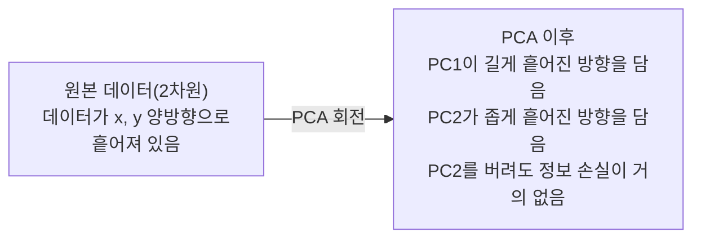

> 🇰🇷 이 문서는 한국어 번역본입니다(ELI5 스타일). 원문: [en.md](en.md)

# 차원 축소

> 고차원 데이터에도 구조가 있습니다. 올바른 각도에서 보면 찾을 수 있습니다.

**유형:** Build
**언어:** Python
**선수 지식:** 페이즈 1, 레슨 01(선형대수 직관), 02(벡터, 행렬과 연산), 03(고유값과 고유벡터), 06(확률과 분포)
**시간:** 약 90분

## 학습 목표

- PCA를 처음부터 구현합니다: 데이터 중심화, 공분산 행렬 계산, 고유분해, 투영
- 설명 분산 비율과 엘보우 방법으로 주성분 개수를 고릅니다
- MNIST 숫자를 2차원으로 시각화할 때 PCA, t-SNE, UMAP을 비교하고 각각의 트레이드오프를 설명합니다
- RBF 커널을 쓴 커널 PCA를 적용해 표준 PCA가 다루지 못하는 비선형 데이터 구조를 분리합니다

## 문제 상황

샘플 하나당 특성(feature)이 784개인 데이터셋이 있습니다. 손으로 쓴 숫자의 픽셀 값일 수도 있고, 유전자 발현량일 수도 있고, 사용자 행동 신호일 수도 있죠. 784차원은 시각화할 수 없습니다. 그림으로 그릴 수도 없고, 머릿속으로도 담을 수 없습니다.

그런데 그 784개 특성 대부분은 중복입니다. 진짜 정보는 훨씬 작은 면 위에 살고 있습니다. 손으로 쓴 "7"을 묘사하는 데 784개의 독립적인 숫자가 필요하지 않습니다. 몇 개만 필요하죠: 획의 각도, 가로획의 길이, 기운 정도. 나머지는 잡음입니다.

차원 축소는 그 작은 면을 찾습니다. 784차원 데이터를 중요한 구조는 유지하면서 2차원, 10차원, 50차원으로 압축합니다.

## 개념

### 차원의 저주

고차원 공간은 직관이 통하지 않습니다. 차원이 커지면 세 가지가 망가집니다.

**거리가 무의미해집니다.** 고차원에서는 무작위로 뽑은 두 점 사이의 거리가 모두 같은 값으로 수렴합니다. 모든 점이 서로 대충 같은 거리에 있다면 최근접 이웃 탐색은 작동을 멈춥니다.

```
차원    평균 거리 비율(무작위 점 사이 최대/최소)
2            ~5.0
10           ~1.8
100          ~1.2
1000         ~1.02
```

**부피가 구석에 몰립니다.** d차원 단위 초입방체는 2^d개의 꼭짓점을 가집니다. 100차원에서는 거의 모든 부피가 중심에서 먼 구석에 있습니다. 데이터 점들은 가장자리로 흩어지고, 모델은 내부 영역에서 데이터 부족에 시달립니다.

**데이터가 기하급수적으로 더 필요해집니다.** 공간에서 같은 샘플 밀도를 유지하려면 2차원에서 20차원으로 갈 때 10^18배 더 많은 데이터가 필요합니다. 충분할 리가 없죠. 차원을 줄이면 데이터 밀도가 다시 다룰 만한 수준으로 돌아옵니다.

### PCA: 중요한 방향 찾기

주성분 분석(PCA)은 데이터가 가장 많이 흩어져 있는 축을 찾습니다. 좌표계를 회전해서 첫 번째 축이 가장 큰 분산을 담고, 두 번째 축이 그다음을 담게 만드는 것이죠.

알고리즘:

```
1. 데이터 중심화        (각 특성에서 평균을 뺀다)
2. 공분산 계산     (특성들이 함께 움직이는 정도)
3. 고유분해     (주 방향을 찾는다)
4. 고유값 기준 정렬     (분산이 큰 것부터)
5. 투영               (상위 k개 고유벡터만 남기고 나머지는 버린다)
```

왜 고유분해일까요? 공분산 행렬은 대칭이고 양의 준정부호입니다. 고유벡터들은 특성 공간의 직교 방향들이고, 고유값은 각 방향이 담는 분산의 양을 알려 줍니다. 가장 큰 고유값을 가진 고유벡터가 최대 분산 방향을 가리킵니다.



- **PCA 이전:** 데이터 구름이 x축과 y축에 대각선으로 흩어져 있음
- **PCA 이후:** 좌표계가 회전해서 PC1이 최대 분산 방향(길게 흩어진 방향)에, PC2가 최소 분산 방향(좁게 흩어진 방향)에 정렬됨
- **차원 축소:** PC2를 버리고 PC1에 투영해도 잃는 정보가 매우 적음

### 설명 분산 비율

각 주성분은 전체 분산의 일부를 담습니다. 설명 분산 비율(explained variance ratio)은 얼마나 담는지 알려 줍니다.

```
성분    고유값    설명 비율    누적
PC1          4.73          0.473              0.473
PC2          2.51          0.251              0.724
PC3          1.12          0.112              0.836
PC4          0.89          0.089              0.925
...
```

누적 설명 분산이 0.95에 도달하면, 그만큼의 성분이 정보의 95%를 담는다는 뜻입니다. 그 뒤는 대부분 잡음입니다.

### 성분 개수 고르기

세 가지 전략:

1. **임계값.** 분산의 90~95%를 설명할 만큼 성분을 유지합니다.
2. **엘보우 방법.** 성분별 설명 분산을 그래프로 그립니다. 급격히 떨어지는 지점을 찾습니다.
3. **다운스트림 성능.** PCA를 전처리로 씁니다. k를 여러 값으로 바꿔 가며 모델 정확도를 측정합니다. 정확도가 정체되는 지점이 최선의 k입니다.

### t-SNE: 이웃 관계 보존

t-SNE(t-Distributed Stochastic Neighbor Embedding)는 시각화를 위해 설계됐습니다. 어떤 점들이 서로 가까운지를 지키면서 고차원 데이터를 2차원(또는 3차원)으로 사상합니다.

직관은 이렇습니다: 원래 공간에서 점 쌍들에 대해 거리를 바탕으로 확률 분포를 계산합니다. 가까운 점은 높은 확률, 먼 점은 낮은 확률을 받죠. 그다음 같은 확률 분포가 성립하는 2차원 배치를 찾습니다. 784차원에서 이웃이던 점들은 2차원에서도 이웃으로 남습니다.

t-SNE의 핵심 성질:
- 비선형입니다. PCA가 못 펼치는 복잡한 다양체(manifold)도 펼칠 수 있습니다.
- 확률적입니다. 실행할 때마다 배치가 달라집니다.
- 퍼플렉서티 매개변수가 몇 개의 이웃을 볼지 조절합니다(보통 5-50).
- 출력에서 클러스터 사이의 거리는 의미가 없습니다. 클러스터 자체만 의미가 있습니다.
- 큰 데이터셋에서는 느립니다. 기본값은 O(n^2)입니다.

### UMAP: 더 빠르고, 전역 구조도 더 잘 살림

UMAP(Uniform Manifold Approximation and Projection)은 t-SNE와 비슷하게 작동하지만 두 가지 장점이 있습니다:
- 더 빠릅니다. 모든 쌍의 거리를 계산하는 대신 근사 최근접 이웃 그래프를 씁니다.
- 전역 구조를 더 잘 살립니다. 출력에서 클러스터들의 상대적 위치가 t-SNE보다 의미 있는 경우가 많습니다.

UMAP은 고차원 공간에서 가중 그래프("퍼지 위상 표현")를 만들고, 이 그래프를 최대한 보존하는 저차원 배치를 찾습니다.

핵심 매개변수:
- `n_neighbors`: 국소 구조를 정의하는 이웃 수(퍼플렉서티와 비슷). 클수록 더 많은 전역 구조를 보존합니다.
- `min_dist`: 출력에서 점들이 얼마나 빽빽하게 모이는지. 작을수록 촘촘한 클러스터가 만들어집니다.

### 언제 무엇을 쓸까

| 방법 | 용도 | 보존하는 것 | 속도 |
|--------|----------|-----------|-------|
| PCA | 학습 전 전처리 | 전역 분산 | 빠름(정확 계산), 수백만 샘플 처리 가능 |
| PCA | 빠른 탐색적 시각화 | 선형 구조 | 빠름 |
| t-SNE | 논문 수준의 2차원 그림 | 국소 이웃 관계 | 느림(1만 샘플 이하 권장) |
| UMAP | 대규모 2차원 시각화 | 국소 + 일부 전역 구조 | 보통(수백만 개 처리) |
| PCA | 모델용 특성 축소 | 분산 순위로 정렬된 특성 | 빠름 |
| t-SNE / UMAP | 클러스터 구조 이해 | 클러스터 분리 | 보통에서 느림 |

경험 법칙: 전처리와 데이터 압축에는 PCA를 쓰세요. 2차원에서 구조를 보고 싶을 때는 t-SNE나 UMAP을 쓰세요.

### 커널 PCA

표준 PCA는 선형 부분공간을 찾습니다. 좌표계를 돌리고 축을 버리죠. 그런데 데이터가 비선형 다양체 위에 있다면? 2차원의 원은 어떤 직선으로도 분리할 수 없습니다. 표준 PCA는 도움이 되지 않습니다.

커널 PCA는 커널 함수가 만들어 내는 고차원 특성 공간에서 PCA를 적용하되, 그 공간의 좌표를 직접 계산하지 않습니다. 이것이 커널 트릭입니다 -- SVM의 뒤에 깔린 같은 아이디어죠.

알고리즘:
1. 커널 행렬 K를 계산합니다(K_ij = k(x_i, x_j)).
2. 커널 행렬을 특성 공간에서 중심화합니다.
3. 중심화된 커널 행렬을 고유분해합니다.
4. 상위 고유벡터들(1/sqrt(고유값)으로 스케일한 것)이 투영입니다.

흔한 커널 함수:

| 커널 | 공식 | 잘 맞는 것 |
|--------|---------|----------|
| RBF(가우시안) | exp(-gamma * \|\|x - y\|\|^2) | 대부분의 비선형 데이터, 매끄러운 다양체 |
| 다항(polynomial) | (x . y + c)^d | 다항 관계 |
| 시그모이드 | tanh(alpha * x . y + c) | 신경망 같은 사상 |

커널 PCA vs 표준 PCA, 언제 무엇을 쓸까:

| 기준 | 표준 PCA | 커널 PCA |
|-----------|-------------|------------|
| 데이터 구조 | 선형 부분공간 | 비선형 다양체 |
| 속도 | O(min(n^2 d, d^2 n)) | O(n^2 d + n^3) |
| 해석 가능성 | 성분이 특성의 선형 결합 | 성분을 특성으로 직접 해석하기 어려움 |
| 확장성 | 수백만 샘플 처리 가능 | 커널 행렬이 n x n, 메모리가 제약 |
| 재구성 | 직접 역변환 가능 | 사전 영상(pre-image) 근사 필요 |

고전적인 예: 2차원의 동심원. 점 두 링이 한쪽 안에 다른 쪽이 있습니다. 표준 PCA는 둘 다 같은 직선 위로 투영합니다 -- 분류에 쓸모가 없죠. RBF 커널을 쓴 커널 PCA는 안쪽 원과 바깥쪽 원을 다른 영역으로 사상해 선형 분리 가능하게 만듭니다.

### 재구성 오차

차원 축소가 얼마나 좋은가요? 784차원을 50차원으로 압축했다면 무엇을 잃었나요?

재구성 오차를 측정합니다:
1. 데이터를 k차원으로 투영: X_reduced = X @ W_k
2. 재구성: X_hat = X_reduced @ W_k^T
3. MSE 계산: mean((X - X_hat)^2)

PCA에서 재구성 오차는 설명 분산과 깔끔한 관계가 있습니다:

```
재구성 오차 = 포함하지 않은 고유값들의 합
전체 분산 = 모든 고유값의 합
잃은 비율 = (버린 고유값의 합) / (모든 고유값의 합)
```

각 성분의 설명 분산 비율은:

```
explained_ratio_k = eigenvalue_k / sum(all eigenvalues)
```

성분 개수에 대한 누적 설명 분산을 그리면 "엘보우" 곡선이 나옵니다. 올바른 성분 개수는 이런 곳입니다:
- 곡선이 평평해지는 지점(체감 수익)
- 누적 분산이 임계값(보통 0.90 또는 0.95)을 넘는 지점
- 다운스트림 작업 성능이 정체되는 지점

재구성 오차는 k 고르기 이상으로도 쓸모가 있습니다. 이상 탐지에 활용할 수 있죠: 재구성 오차가 큰 샘플은 학습된 부분공간에 맞지 않는 이상치입니다. 프로덕션 시스템의 PCA 기반 이상 탐지가 바로 이 원리입니다.

```figure
pca-axes
```

## 직접 만들기

### 단계 1: PCA를 처음부터

```python
import numpy as np

class PCA:
    def __init__(self, n_components):
        self.n_components = n_components
        self.components = None
        self.mean = None
        self.eigenvalues = None
        self.explained_variance_ratio_ = None

    def fit(self, X):
        self.mean = np.mean(X, axis=0)
        X_centered = X - self.mean

        cov_matrix = np.cov(X_centered, rowvar=False)

        eigenvalues, eigenvectors = np.linalg.eigh(cov_matrix)

        sorted_idx = np.argsort(eigenvalues)[::-1]
        eigenvalues = eigenvalues[sorted_idx]
        eigenvectors = eigenvectors[:, sorted_idx]

        self.components = eigenvectors[:, :self.n_components].T
        self.eigenvalues = eigenvalues[:self.n_components]
        total_var = np.sum(eigenvalues)
        self.explained_variance_ratio_ = self.eigenvalues / total_var

        return self

    def transform(self, X):
        X_centered = X - self.mean
        return X_centered @ self.components.T

    def fit_transform(self, X):
        self.fit(X)
        return self.transform(X)
```

### 단계 2: 합성 데이터로 테스트

```python
np.random.seed(42)
n_samples = 500

t = np.random.uniform(0, 2 * np.pi, n_samples)
x1 = 3 * np.cos(t) + np.random.normal(0, 0.2, n_samples)
x2 = 3 * np.sin(t) + np.random.normal(0, 0.2, n_samples)
x3 = 0.5 * x1 + 0.3 * x2 + np.random.normal(0, 0.1, n_samples)

X_synthetic = np.column_stack([x1, x2, x3])

pca = PCA(n_components=2)
X_reduced = pca.fit_transform(X_synthetic)

print(f"Original shape: {X_synthetic.shape}")
print(f"Reduced shape:  {X_reduced.shape}")
print(f"Explained variance ratios: {pca.explained_variance_ratio_}")
print(f"Total variance captured: {sum(pca.explained_variance_ratio_):.4f}")
```

### 단계 3: 2차원 MNIST 숫자

```python
from sklearn.datasets import fetch_openml

mnist = fetch_openml("mnist_784", version=1, as_frame=False, parser="auto")
X_mnist = mnist.data[:5000].astype(float)
y_mnist = mnist.target[:5000].astype(int)

pca_mnist = PCA(n_components=50)
X_pca50 = pca_mnist.fit_transform(X_mnist)
print(f"50 components capture {sum(pca_mnist.explained_variance_ratio_):.2%} of variance")

pca_2d = PCA(n_components=2)
X_pca2d = pca_2d.fit_transform(X_mnist)
print(f"2 components capture {sum(pca_2d.explained_variance_ratio_):.2%} of variance")
```

### 단계 4: sklearn과 비교

```python
from sklearn.decomposition import PCA as SklearnPCA
from sklearn.manifold import TSNE

sklearn_pca = SklearnPCA(n_components=2)
X_sklearn_pca = sklearn_pca.fit_transform(X_mnist)

print(f"\nOur PCA explained variance:     {pca_2d.explained_variance_ratio_}")
print(f"Sklearn PCA explained variance: {sklearn_pca.explained_variance_ratio_}")

diff = np.abs(np.abs(X_pca2d) - np.abs(X_sklearn_pca))
print(f"Max absolute difference: {diff.max():.10f}")

tsne = TSNE(n_components=2, perplexity=30, random_state=42)
X_tsne = tsne.fit_transform(X_mnist)
print(f"\nt-SNE output shape: {X_tsne.shape}")
```

### 단계 5: UMAP 비교

```python
try:
    from umap import UMAP

    reducer = UMAP(n_components=2, n_neighbors=15, min_dist=0.1, random_state=42)
    X_umap = reducer.fit_transform(X_mnist)
    print(f"UMAP output shape: {X_umap.shape}")
except ImportError:
    print("Install umap-learn: pip install umap-learn")
```

## 실전에서 활용하기

분류기 앞단의 전처리로 쓰는 PCA:

```python
from sklearn.decomposition import PCA as SklearnPCA
from sklearn.linear_model import LogisticRegression
from sklearn.model_selection import train_test_split
from sklearn.metrics import accuracy_score

X_train, X_test, y_train, y_test = train_test_split(
    X_mnist, y_mnist, test_size=0.2, random_state=42
)

results = {}
for k in [10, 30, 50, 100, 200]:
    pca_k = SklearnPCA(n_components=k)
    X_tr = pca_k.fit_transform(X_train)
    X_te = pca_k.transform(X_test)

    clf = LogisticRegression(max_iter=1000, random_state=42)
    clf.fit(X_tr, y_train)
    acc = accuracy_score(y_test, clf.predict(X_te))
    var_captured = sum(pca_k.explained_variance_ratio_)
    results[k] = (acc, var_captured)
    print(f"k={k:>3d}  accuracy={acc:.4f}  variance={var_captured:.4f}")
```

성능은 784차원에 훨씬 못 미치는 지점에서 정체됩니다. 그 정체 지점이 바로 당신의 운용 지점입니다.

## 출시하기

이 레슨의 산출물:
- `outputs/skill-dimensionality-reduction.md` - 주어진 작업에 맞는 올바른 차원 축소 기법을 고르기 위한 스킬

## 연습 문제

1. PCA 클래스가 `inverse_transform`을 지원하도록 수정하세요. 10, 50, 200개 성분으로 MNIST 숫자를 재구성하고, 각각의 재구성 오차(원본과의 평균 제곱 차이)를 출력하세요.

2. 같은 MNIST 부분집합에 퍼플렉서티 5, 30, 100으로 t-SNE를 실행하세요. 출력이 어떻게 달라지는지 묘사해 보세요. 퍼플렉서티가 클러스터의 조밀함에 영향을 주는 이유는 무엇일까요?

3. 50개 특성 중 5개만 정보를 담고 있는 데이터셋을 준비하세요(`sklearn.datasets.make_classification`으로 만들면 됩니다). PCA를 적용하고 설명 분산 곡선이 이 데이터가 사실상 5차원이라는 것을 올바르게 짚어 내는지 확인하세요.

## 핵심 용어

| 용어 | 사람들이 말하는 것 | 실제 의미 |
|------|----------------|----------------------|
| 차원의 저주 | "특성이 너무 많다" | 차원이 커지면 거리, 부피, 데이터 밀도가 모두 직관에 반하게 동작한다. 모델이 만족하려면 기하급수적으로 더 많은 데이터가 필요하다. |
| PCA | "차원을 줄인다" | 좌표계를 회전해 축을 최대 분산 방향에 맞춘 뒤, 분산이 낮은 축을 버린다. |
| 주성분 | "중요한 방향" | 공분산 행렬의 고유벡터. 특성 공간에서 데이터가 가장 많이 흩어진 방향. |
| 설명 분산 비율 | "이 성분이 가진 정보량" | 한 주성분이 담는 전체 분산의 비율. 상위 k개의 비율을 합하면 k개 성분이 얼마나 유지하는지 보인다. |
| 공분산 행렬 | "특성들이 어떻게 상관되는가" | 성분 (i,j)가 특성 i와 특성 j가 함께 움직이는 정도를 잰 대칭 행렬. 대각선 성분은 각자의 분산. |
| t-SNE | "그 클러스터 그림" | 쌍별 이웃 확률을 지키며 고차원 데이터를 2차원으로 사상하는 비선형 방법. 시각화용이지 전처리용이 아니다. |
| UMAP | "더 빠른 t-SNE" | 위상 데이터 분석에 기반한 비선형 방법. 국소 구조와 일부 전역 구조를 모두 보존한다. t-SNE보다 확장성이 좋다. |
| 퍼플렉서티 | "t-SNE의 노브(조절 손잡이)" | 각 점이 고려하는 실효 이웃 수를 조절한다. 낮으면 아주 국소적인 구조에, 높으면 더 넓은 패턴에 집중한다. |
| 다양체(Manifold) | "데이터가 살고 있는 면" | 고차원 공간에 박힌 더 낮은 차원의 면. 3차원에서 구겨진 종이 한 장이 2차원 다양체다. |

## 더 읽을거리

- [주성분 분석 튜토리얼](https://arxiv.org/abs/1404.1100) (Shlens) - PCA를 바닥부터 명쾌하게 유도
- [t-SNE를 효과적으로 쓰는 법](https://distill.pub/2016/misread-tsne/) (Wattenberg et al.) - t-SNE의 함정과 매개변수 선택에 대한 인터랙티브 가이드
- [UMAP 문서](https://umap-learn.readthedocs.io/) - UMAP 저자들이 쓴 이론과 실전 안내
