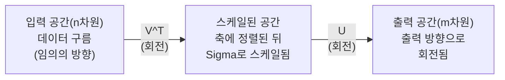
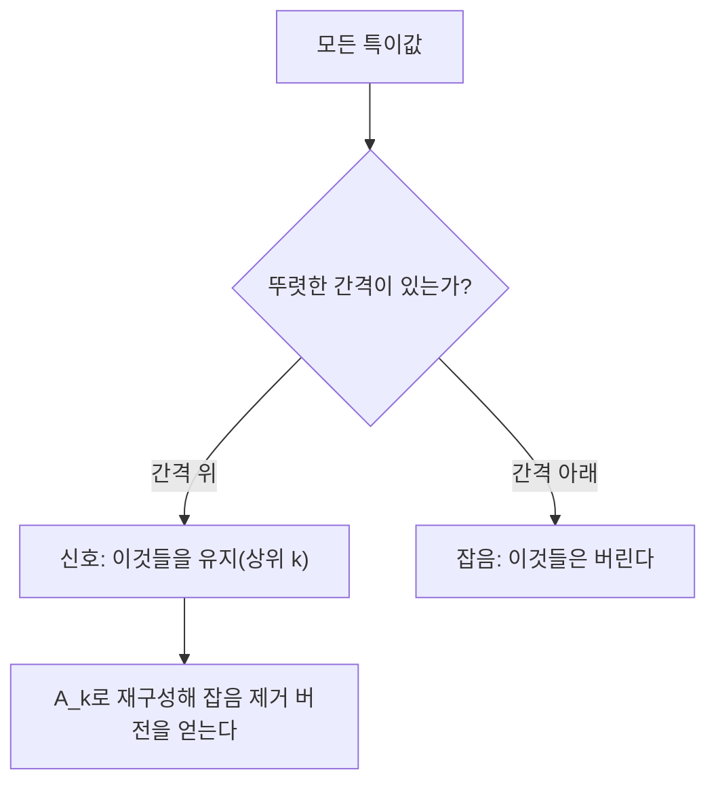

> 🇰🇷 이 문서는 한국어 번역본입니다(ELI5 스타일). 원문: [en.md](en.md)

# 특이값 분해

> SVD는 선형대수의 만능 칼입니다. 모든 행렬에 존재하고, 모든 데이터 과학자에게 필요합니다.

**유형:** Build
**언어:** Python, Julia
**선수 지식:** 페이즈 1, 레슨 01(선형대수 직관), 02(벡터와 행렬 연산), 03(행렬 변환)
**시간:** 약 120분

## 학습 목표

- 거듭제곱법(power iteration)으로 SVD를 구현하고 U, Sigma, V^T의 기하학적 의미를 설명합니다
- 절단 SVD(truncated SVD)를 이미지 압축에 적용하고 압축률 대비 재구성 오차를 측정합니다
- SVD로 무어-펜로즈 유사역행렬(Moore-Penrose pseudoinverse)을 계산해 과결정 최소제곱 시스템을 풉니다
- SVD를 PCA, 추천 시스템(잠재 요인), NLP의 잠재 의미 분석과 연결합니다

## 문제 상황

1000x2000 행렬이 있습니다. 사용자-영화 평점일 수도 있고, 문서-단어 빈도표일 수도 있고, 이미지의 픽셀 값일 수도 있죠. 이 행렬을 압축하거나, 잡음을 제거하거나, 숨은 구조를 찾거나, 최소제곱 시스템을 풀어야 합니다. 고유분해는 정방행렬에만 작동합니다. 거기에 더해 행렬이 선형 독립인 고유벡터 전체 집합을 가져야 한다는 조건도 필요합니다.

SVD는 어떤 행렬에도 작동합니다. 어떤 모양이든, 어떤 랭크든, 조건 없이요. 행렬을 세 개의 인수로 분해해서 행렬이 공간에 하는 일의 기하학을 드러냅니다. 선형대수 전체에서 가장 일반적이고 가장 유용한 인수분해입니다.

## 개념

### SVD가 기하학적으로 하는 일

모든 행렬은 모양과 상관없이 세 연산을 순서대로 수행합니다: 회전, 스케일, 회전. SVD는 이 분해를 명시적으로 보여 줍니다.

```
A = U * Sigma * V^T

      m x n     m x m    m x n    n x n
     (임의)    (회전)   (스케일)  (회전)
```

임의의 행렬 A가 주어지면, SVD는 이렇게 인수분해합니다:
- V^T는 입력 공간(n차원)의 벡터를 회전합니다
- Sigma는 각 축을 따라 스케일합니다(늘리거나 줄입니다)
- U는 결과를 출력 공간(m차원)으로 회전합니다



이렇게 생각해 보세요. SVD에 행렬을 하나 건넵니다. SVD가 말해 줍니다: "이 행렬은 입력으로 들어온 구를 먼저 V^T로 회전하고, 그다음 Sigma로 타원체로 늘린 뒤, 그 타원체를 U로 회전합니다." 특이값은 타원체 축들의 길이입니다.

### 전체 분해

모양이 m x n인 행렬 A에 대해:

```
A = U * Sigma * V^T

where:
  U     is m x m, orthogonal (U^T U = I)
  Sigma is m x n, diagonal (singular values on the diagonal)
  V     is n x n, orthogonal (V^T V = I)

The singular values sigma_1 >= sigma_2 >= ... >= sigma_r > 0
where r = rank(A)
```

U의 열을 왼쪽 특이벡터(left singular vectors)라 부르고, V의 열을 오른쪽 특이벡터(right singular vectors)라 부릅니다. Sigma의 대각선 성분은 특이값(singular values)이라 부릅니다. 특이값은 항상 음수가 아니고 관례적으로 내림차순으로 정렬합니다.

### 왼쪽 특이벡터, 특이값, 오른쪽 특이벡터

SVD의 각 구성 요소는 뚜렷한 기하학적 의미를 갖습니다.

**오른쪽 특이벡터(V의 열):** 입력 공간(R^n)의 정규직교 기저를 이룹니다. 행렬이 출력 공간에서 직교하는 방향들로 사상하는, 입력 공간의 방향들입니다. 정의역의 자연스러운 좌표계라고 생각하면 됩니다.

**특이값(Sigma의 대각선):** 스케일 인자들입니다. i번째 특이값은 행렬이 i번째 오른쪽 특이벡터 방향으로 벡터를 얼마나 늘리는지 알려 줍니다. 특이값이 0이라는 것은 행렬이 그 방향을 완전히 눌러 찌른다는 뜻입니다.

**왼쪽 특이벡터(U의 열):** 출력 공간(R^m)의 정규직교 기저를 이룹니다. i번째 왼쪽 특이벡터는 i번째 오른쪽 특이벡터가 (스케일을 거친 뒤) 도착하는 출력 공간의 방향입니다.

셋의 관계:

```
A * v_i = sigma_i * u_i

행렬 A는 i번째 오른쪽 특이벡터 v_i를 가져다
sigma_i로 스케일하고, i번째 왼쪽 특이벡터 u_i로 사상한다.
```

이것 덕분에 어떤 행렬이 하는 일을 좌표 하나하나 수준의 그림으로 볼 수 있습니다.

### 외적 형태

SVD는 랭크-1 행렬들의 합으로 쓸 수 있습니다:

```
A = sigma_1 * u_1 * v_1^T + sigma_2 * u_2 * v_2^T + ... + sigma_r * u_r * v_r^T

각 항 sigma_i * u_i * v_i^T는 랭크-1 행렬(외적)이다.
전체 행렬은 그런 행렬 r개의 합이며, r은 랭크다.
```

이 형태가 저랭크 근사의 기초입니다. 각 항은 구조를 한 겹씩 더합니다. 첫 번째 항이 가장 중요한 패턴 하나를 담고, 두 번째가 그다음으로 중요한 것을 담습니다. 이런 식으로 계속됩니다. 이 합을 임의의 랭크에서 잘라내면 그 랭크에서 가능한 최선의 근사를 얻습니다.

```
랭크-1 근사:    A_1 = sigma_1 * u_1 * v_1^T
                  (지배적인 패턴을 담는다)

랭크-2 근사:    A_2 = sigma_1 * u_1 * v_1^T + sigma_2 * u_2 * v_2^T
                  (가장 중요한 두 패턴을 담는다)

랭크-k 근사:    A_k = 상위 k개 항의 합
                  (Eckart-Young 정리에 의해 최적이다)
```

### 고유분해와의 관계

SVD와 고유분해는 깊이 연결돼 있습니다. A의 특이값과 특이벡터는 A^T A와 A A^T의 고유값과 고유벡터에서 바로 나옵니다.

```
A^T A = V * Sigma^T * U^T * U * Sigma * V^T
      = V * Sigma^T * Sigma * V^T
      = V * D * V^T

where D = Sigma^T * Sigma is a diagonal matrix with sigma_i^2 on the diagonal.

So:
- The right singular vectors (V) are eigenvectors of A^T A
- The singular values squared (sigma_i^2) are eigenvalues of A^T A

Similarly:
A A^T = U * Sigma * V^T * V * Sigma^T * U^T
      = U * Sigma * Sigma^T * U^T

So:
- The left singular vectors (U) are eigenvectors of A A^T
- The eigenvalues of A A^T are also sigma_i^2
```

이 연결이 알려 주는 세 가지:
1. 특이값은 항상 실수이고 음수가 아닙니다(양의 준정부호 행렬 고유값의 제곱근이므로).
2. A^T A의 고유분해로 SVD를 계산할 수도 있지만, 이렇게 하면 조건수가 제곱돼 수치 정밀도를 잃습니다. 전용 SVD 알고리즘은 이것을 피합니다.
3. A가 정방이고 대칭인 양의 준정부호 행렬이면, SVD와 고유분해는 같은 것입니다.

### 절단 SVD: 저랭크 근사

Eckart-Young-Mirsky 정리에 따르면, A에 대한 최선의 랭크-k 근사(Frobenius 놈과 스펙트럼 놈 모두에서)는 상위 k개 특이값과 그에 대응하는 벡터들만 남기는 것으로 얻어집니다:

```
A_k = U_k * Sigma_k * V_k^T

where:
  U_k     is m x k  (first k columns of U)
  Sigma_k is k x k  (top-left k x k block of Sigma)
  V_k     is n x k  (first k columns of V)

Approximation error = sigma_{k+1}  (in spectral norm)
                    = sqrt(sigma_{k+1}^2 + ... + sigma_r^2)  (in Frobenius norm)
```

이것은 단지 "좋은" 근사가 아닙니다. 랭크 k 근사 중에서 증명 가능하게 최선입니다. 어떤 다른 랭크-k 행렬도 A에 더 가깝지 않습니다.

| 구성 요소 | 상대적 크기 | 랭크-3 근사에 포함? |
|-----------|-------------------|------------------------|
| sigma_1 | 가장 큼 | 예 |
| sigma_2 | 큼 | 예 |
| sigma_3 | 중간-큼 | 예 |
| sigma_4 | 중간 | 아니오(오차) |
| sigma_5 | 중간-작음 | 아니오(오차) |
| sigma_6 | 작음 | 아니오(오차) |
| sigma_7 | 매우 작음 | 아니오(오차) |
| sigma_8 | 아주 작음 | 아니오(오차) |

상위 3개를 유지: A_3은 가장 큰 세 특이값을 담습니다. 오차 = 나머지 값들(sigma_4부터 sigma_8까지).

특이값이 빠르게 감쇠하면 작은 k로도 행렬 대부분을 담습니다. 느리게 감쇠하면 그 행렬에는 저랭크 구조가 없는 것입니다.

### SVD를 이용한 이미지 압축

회색조 이미지는 픽셀 강도의 행렬입니다. 800x600 이미지는 480,000개 값을 가집니다. SVD를 쓰면 훨씬 적은 값으로 근사할 수 있습니다.

```
원본 이미지: 800 x 600 = 480,000 values

랭크 k SVD:
  U_k:      800 x k values
  Sigma_k:  k values
  V_k:      600 x k values
  Total:    k * (800 + 600 + 1) = k * 1401 values

  k=10:   14,010 values   (원본의 2.9%)
  k=50:   70,050 values  (원본의 14.6%)
  k=100: 140,100 values  (원본의 29.2%)

  k가 작아질수록 압축률은 좋아지지만,
  시각적 품질은 떨어진다.
```

핵심 통찰: 자연 이미지는 특이값이 빠르게 감쇠합니다. 첫 몇 개 특이값이 넓은 구조(형상, 그라디언트)를 담고, 나중 것들이 세밀한 디테일과 잡음을 담습니다. 랭크 50에서 잘라내면 저장 공간은 85% 덜 쓰면서 원본과 거의 똑같아 보이는 이미지가 나오는 경우가 많습니다.

### 추천 시스템을 위한 SVD

넷플릭스 프라이즈(Netflix Prize)가 이 용도를 유명하게 만들었습니다. 대부분의 항목이 비어 있는 사용자-영화 평점 행렬이 있습니다.

```
             Movie1  Movie2  Movie3  Movie4  Movie5
  User1      [  5      ?       3       ?       1  ]
  User2      [  ?      4       ?       2       ?  ]
  User3      [  3      ?       5       ?       ?  ]
  User4      [  ?      ?       ?       4       3  ]

  ? = unknown rating
```

아이디어는 이렇습니다: 이 평점 행렬은 낮은 랭크를 갖습니다. 사용자들의 취향은 완전히 독립적이지 않습니다. 대부분의 선호를 설명하는 소수의 잠재 요인(latent factors, 액션 vs 드라마, 구작 vs 신작, 두뇌형 vs 관능형 같은)이 있습니다.

(빈칸을 채운) 평점 행렬에 SVD를 적용하면 다음처럼 분해됩니다:
- U: 잠재 요인 공간에서의 사용자 프로필
- Sigma: 각 잠재 요인의 중요도
- V^T: 잠재 요인 공간에서의 영화 프로필

사용자가 특정 영화에 줄 것으로 예측된 평점은 사용자 프로필과 영화 프로필의 내적입니다(특이값으로 가중). 저랭크 근사가 빠진 항목들을 채워 넣습니다.

실전에서는 Simon Funk의 증분 SVD나 ALS(교대 최소제곱)처럼 결측 데이터를 직접 다루는 변형을 씁니다. 하지만 핵심 아이디어는 같습니다: SVD를 통한 잠재 요인 분해입니다.

### NLP에서의 SVD: 잠재 의미 분석

잠재 의미 분석(LSA, Latent Semantic Analysis), 달리 말해 잠재 의미 색인(LSI, Latent Semantic Indexing)은 단어-문서 행렬에 SVD를 적용합니다.

```
             Doc1   Doc2   Doc3   Doc4
  "cat"      [  3      0      1      0  ]
  "dog"      [  2      0      0      1  ]
  "fish"     [  0      4      1      0  ]
  "pet"      [  1      1      1      1  ]
  "ocean"    [  0      3      0      0  ]

랭크 k=2로 SVD를 한 뒤:

  각 문서는 2차원 "개념 공간"의 점이 된다.
  각 단어도 같은 2차원 공간의 점이 된다.
  비슷한 주제의 문서들이 뭉친다.
  비슷한 의미의 단어들이 뭉친다.

  "cat"과 "dog"은 가까이 위치하게 된다(육상 애완동물).
  "fish"와 "ocean"은 가까이 위치하게 된다(물 개념).
  Doc1과 Doc3은 주제가 비슷하면 한 클러스터에 속한다.
```

LSA는 날텍스트에서 의미적 유사성을 잡아 낸 최초의 성공적인 방법 중 하나입니다. 동의어들이 비슷한 문서들에 등장하는 경향이 있어서, SVD가 그것들을 같은 잠재 차원으로 묶기 때문입니다. 현대의 단어 임베딩(Word2Vec, GloVe)은 이 아이디어의 후손으로 볼 수 있습니다.

### 잡음 감소를 위한 SVD

잡음 낀 데이터에서는 신호가 상위 특이값에 집중되고 잡음은 모든 특이값에 퍼져 있습니다. 잘라내면 잡음 바닥(noise floor)이 제거됩니다.

**깨끗한 신호의 특이값:**

| 구성 요소 | 크기 | 유형 |
|-----------|-----------|------|
| sigma_1 | 매우 큼 | 신호 |
| sigma_2 | 큼 | 신호 |
| sigma_3 | 중간 | 신호 |
| sigma_4 | 0 근처 | 무시 가능 |
| sigma_5 | 0 근처 | 무시 가능 |

**잡음 낀 신호의 특이값(잡음이 전부에 더해짐):**

| 구성 요소 | 크기 | 유형 |
|-----------|-----------|------|
| sigma_1 | 매우 큼 | 신호 |
| sigma_2 | 큼 | 신호 |
| sigma_3 | 중간 | 신호 |
| sigma_4 | 작음 | 잡음 |
| sigma_5 | 작음 | 잡음 |
| sigma_6 | 작음 | 잡음 |
| sigma_7 | 작음 | 잡음 |



이것은 신호 처리, 과학적 측정, 데이터 정제에 쓰입니다. 덧셈 잡음으로 오염된 행렬이 있다면, 절단 SVD는 신호와 잡음을 분리하는 원칙적인 방법입니다.

### SVD를 통한 유사역행렬

무어-펜로즈 유사역행렬(Moore-Penrose pseudoinverse) A+는 행렬의 역을 비정방행렬과 특이행렬로까지 일반화합니다. SVD를 쓰면 이를 계산하는 일은 아주 간단해집니다.

```
If A = U * Sigma * V^T, then:

A+ = V * Sigma+ * U^T

where Sigma+ is formed by:
  1. Transpose Sigma (swap rows and columns)
  2. Replace each non-zero diagonal entry sigma_i with 1/sigma_i
  3. Leave zeros as zeros

For A (m x n):      A+ is (n x m)
For Sigma (m x n):  Sigma+ is (n x m)
```

유사역행렬은 최소제곱 문제를 풉니다. Ax = b에 정확한 해가 없다면(과결정 시스템), x = A+ b가 최소제곱 해입니다(||Ax - b||를 최소화).

```
과결정 시스템(방정식이 미지수보다 많음):

  [1  1]         [3]
  [2  1] x   =   [5]       No exact solution exists.
  [3  1]         [6]

  x_ls = A+ b = V * Sigma+ * U^T * b

  This gives the x that minimizes the sum of squared residuals.
  Same result as the normal equations (A^T A)^(-1) A^T b,
  but numerically more stable.
```

### 수치 안정성의 이점

A^T A의 고유분해를 계산하면 특이값이 제곱됩니다(A^T A의 고유값은 sigma_i^2). 이것은 조건수를 제곱해서 수치 오차를 증폭시킵니다.

```
Example:
  A has singular values [1000, 1, 0.001]
  Condition number of A: 1000 / 0.001 = 10^6

  A^T A has eigenvalues [10^6, 1, 10^{-6}]
  Condition number of A^T A: 10^6 / 10^{-6} = 10^{12}

  Computing SVD directly: works with condition number 10^6
  Computing via A^T A:     works with condition number 10^{12}
                           (6 extra digits of precision lost)
```

현대 SVD 알고리즘(Golub-Kahan 이대각화)은 A를 직접 다루며 A^T A를 만들지 않습니다. 그래서 `np.linalg.eig(A.T @ A)`보다 항상 `np.linalg.svd(A)`를 쓰는 것이 좋습니다.

### PCA와의 연결

PCA는 곧 중심화된 데이터에 대한 SVD입니다. 이것은 비유가 아닙니다. 문자 그대로 같은 계산입니다.

```
Given data matrix X (n_samples x n_features), centered (mean subtracted):

Covariance matrix: C = (1/(n-1)) * X^T X

PCA finds eigenvectors of C. But:

  X = U * Sigma * V^T    (SVD of X)

  X^T X = V * Sigma^2 * V^T

  C = (1/(n-1)) * V * Sigma^2 * V^T

So the principal components are exactly the right singular vectors V.
The explained variance for each component is sigma_i^2 / (n-1).

In sklearn, PCA is implemented using SVD, not eigendecomposition.
It is faster and more numerically stable.
```

즉, 레슨 10에서 차원 축소에 대해 배운 모든 것은 무대 뒤에서 SVD였던 겁니다. PCA는 머신러닝에서 SVD의 가장 흔한 응용입니다.

```figure
svd-rank-reconstruction
```

## 직접 만들기

### 단계 1: 거듭제곱법으로 SVD를 처음부터

아이디어: 가장 큰 특이값과 그 벡터를 찾기 위해 A^T A(또는 A A^T)에 거듭제곱법을 적용합니다. 그다음 행렬을 수축(deflate)하고 다음 특이값에 대해 반복합니다.

```python
import numpy as np

def power_iteration(M, num_iters=100):
    n = M.shape[1]
    v = np.random.randn(n)
    v = v / np.linalg.norm(v)

    for _ in range(num_iters):
        Mv = M @ v
        v = Mv / np.linalg.norm(Mv)

    eigenvalue = v @ M @ v
    return eigenvalue, v

def svd_from_scratch(A, k=None):
    m, n = A.shape
    if k is None:
        k = min(m, n)

    sigmas = []
    us = []
    vs = []

    A_residual = A.copy().astype(float)

    for _ in range(k):
        AtA = A_residual.T @ A_residual
        eigenvalue, v = power_iteration(AtA, num_iters=200)

        if eigenvalue < 1e-10:
            break

        sigma = np.sqrt(eigenvalue)
        u = A_residual @ v / sigma

        sigmas.append(sigma)
        us.append(u)
        vs.append(v)

        A_residual = A_residual - sigma * np.outer(u, v)

    U = np.column_stack(us) if us else np.empty((m, 0))
    S = np.array(sigmas)
    V = np.column_stack(vs) if vs else np.empty((n, 0))

    return U, S, V
```

### 단계 2: 테스트하고 NumPy와 비교

```python
np.random.seed(42)
A = np.random.randn(5, 4)

U_ours, S_ours, V_ours = svd_from_scratch(A)
U_np, S_np, Vt_np = np.linalg.svd(A, full_matrices=False)

print("Our singular values:", np.round(S_ours, 4))
print("NumPy singular values:", np.round(S_np, 4))

A_reconstructed = U_ours @ np.diag(S_ours) @ V_ours.T
print(f"Reconstruction error: {np.linalg.norm(A - A_reconstructed):.8f}")
```

### 단계 3: 이미지 압축 데모

```python
def compress_image_svd(image_matrix, k):
    U, S, Vt = np.linalg.svd(image_matrix, full_matrices=False)
    compressed = U[:, :k] @ np.diag(S[:k]) @ Vt[:k, :]
    return compressed

image = np.random.seed(42)
rows, cols = 200, 300
image = np.random.randn(rows, cols)

for k in [1, 5, 10, 20, 50]:
    compressed = compress_image_svd(image, k)
    error = np.linalg.norm(image - compressed) / np.linalg.norm(image)
    original_size = rows * cols
    compressed_size = k * (rows + cols + 1)
    ratio = compressed_size / original_size
    print(f"k={k:>3d}  error={error:.4f}  storage={ratio:.1%}")
```

### 단계 4: 잡음 감소

```python
np.random.seed(42)
clean = np.outer(np.sin(np.linspace(0, 4*np.pi, 100)),
                 np.cos(np.linspace(0, 2*np.pi, 80)))
noise = 0.3 * np.random.randn(100, 80)
noisy = clean + noise

U, S, Vt = np.linalg.svd(noisy, full_matrices=False)
denoised = U[:, :5] @ np.diag(S[:5]) @ Vt[:5, :]

print(f"Noisy error:    {np.linalg.norm(noisy - clean):.4f}")
print(f"Denoised error: {np.linalg.norm(denoised - clean):.4f}")
print(f"Improvement:    {(1 - np.linalg.norm(denoised - clean) / np.linalg.norm(noisy - clean)):.1%}")
```

### 단계 5: 유사역행렬

```python
A = np.array([[1, 1], [2, 1], [3, 1]], dtype=float)
b = np.array([3, 5, 6], dtype=float)

U, S, Vt = np.linalg.svd(A, full_matrices=False)
S_inv = np.diag(1.0 / S)
A_pinv = Vt.T @ S_inv @ U.T

x_svd = A_pinv @ b
x_lstsq = np.linalg.lstsq(A, b, rcond=None)[0]
x_pinv = np.linalg.pinv(A) @ b

print(f"SVD pseudoinverse solution:  {x_svd}")
print(f"np.linalg.lstsq solution:   {x_lstsq}")
print(f"np.linalg.pinv solution:    {x_pinv}")
```

## 실전에서 활용하기

전체 동작 데모는 `code/svd.py`에 있습니다. 실행하면 이미지 압축, 추천 시스템, 잠재 의미 분석, 잡음 감소에 적용된 SVD를 볼 수 있습니다.

```bash
python svd.py
```

`code/svd.jl`의 Julia 버전은 Julia의 기본 `svd()` 함수와 `LinearAlgebra` 패키지를 사용해 같은 개념을 보여 줍니다.

```bash
julia svd.jl
```

## 출시하기

이 레슨의 산출물:
- `outputs/skill-svd.md` - 실제 프로젝트에서 SVD를 언제, 어떻게 적용할지 알기 위한 스킬

## 연습 문제

1. 거듭제곱법을 쓰지 않고 전체 SVD를 처음부터 구현하세요. 대신 A^T A의 고유분해를 계산해 V와 특이값을 얻고, U = A V Sigma^{-1}을 계산하세요. 거듭제곱법 버전과 NumPy와 수치 정확도를 비교하세요.

2. 실제 회색조 이미지를 불러오세요(또는 하나를 회색조로 변환하세요). 랭크 1, 5, 10, 25, 50, 100으로 압축하세요. 각 랭크마다 압축률과 상대 오차를 계산하세요. 이미지가 눈으로 볼 만해지는 랭크를 찾으세요.

3. 작은 추천 시스템을 만드세요. 일부 항목만 알려진 10x8 사용자-영화 평점 행렬을 만드세요. 빈 항목을 행 평균으로 채우세요. SVD를 계산하고 랭크-3 근사를 재구성하세요. 재구성된 행렬로 빠진 평점을 예측하세요. 예측이 합리적인지 확인하세요.

4. 합성 주제 3개로 100x50 문서-단어 행렬을 만드세요. 각 주제에 연관된 단어 5개씩이 있습니다. 잡음을 더하세요. SVD를 적용하고 상위 3개 특이값이 나머지보다 훨씬 큰지 확인하세요. 문서들을 3차원 잠재 공간에 투영하고 같은 주제의 문서들이 뭉치는지 확인하세요.

5. 깨끗한 저랭크 행렬(랭크 3, 크기 50x40)을 만들고 서로 다른 수준의 가우시안 잡음(sigma = 0.1, 0.5, 1.0, 2.0)을 더하세요. 각 잡음 수준마다 k를 1부터 40까지 훑으면서 깨끗한 행렬 대비 재구성 오차를 측정해 최적 절단 랭크를 찾으세요. 최적 k가 잡음 수준에 따라 어떻게 바뀌는지 그래프로 그리세요.

## 핵심 용어

| 용어 | 사람들이 말하는 것 | 실제 의미 |
|------|----------------|----------------------|
| SVD | "어떤 행렬이든 인수분해한다" | A를 U Sigma V^T로 분해한다. U와 V는 직교, Sigma는 음수가 아닌 성분의 대각 행렬. 어떤 모양의 행렬에도 작동. |
| 특이값(Singular value) | "이 성분이 얼마나 중요한가" | Sigma의 i번째 대각선 성분. 행렬이 i번째 주 방향으로 얼마나 늘리는지 측정. 항상 음수가 아니고 내림차순 정렬. |
| 왼쪽 특이벡터(Left singular vector) | "출력 방향" | U의 열. i번째 오른쪽 특이벡터가 (sigma_i로 스케일된 뒤) 사상되는 출력 공간의 방향. |
| 오른쪽 특이벡터(Right singular vector) | "입력 방향" | V의 열. 행렬이 (sigma_i로 스케일한 뒤) i번째 왼쪽 특이벡터로 사상하는 입력 공간의 방향. |
| 절단 SVD(Truncated SVD) | "저랭크 근사" | 상위 k개 특이값과 그 벡터들만 유지. 원래 행렬에 대해 증명 가능하게 최선인 랭크-k 근사를 만든다(Eckart-Young 정리). |
| 랭크(Rank) | "진짜 차원수" | 0이 아닌 특이값의 개수. 행렬이 실제로 쓰는 독립적인 방향이 몇 개인지 알려 준다. |
| 유사역행렬(Pseudoinverse) | "일반화된 역행렬" | V Sigma+ U^T. 0이 아닌 특이값은 역수를 취하고 0은 0으로 둔다. 비정방 또는 특이 행렬의 최소제곱 문제를 푼다. |
| 조건수(Condition number) | "오차에 얼마나 민감한가" | sigma_max / sigma_min. 조건수가 크면 입력의 작은 변화가 출력의 큰 변화를 일으킨다. SVD가 이것을 직접 드러낸다. |
| 잠재 요인(Latent factor) | "숨은 변수" | SVD가 발견하는 저랭크 공간의 차원. 추천에서는 장르 선호에 해당할 수 있고, NLP에서는 주제에 해당할 수 있다. |
| Frobenius 놈 | "행렬의 전체 크기" | 성분 제곱합의 제곱근. 특이값 제곱합의 제곱근과 같다. 근사 오차 측정에 쓴다. |
| Eckart-Young 정리 | "SVD가 최고의 압축을 준다" | 어떤 목표 랭크 k에 대해서도, 절단 SVD가 가능한 모든 랭크-k 행렬 중 근사 오차를 최소화한다. |
| 거듭제곱법(Power iteration) | "가장 큰 고유벡터 찾기" | 무작위 벡터를 행렬로 반복해서 곱하고 정규화한다. 가장 큰 고유값의 고유벡터로 수렴한다. 많은 SVD 알고리즘의 빌딩 블록. |

## 더 읽을거리

- [Gilbert Strang: Linear Algebra and Its Applications, 7장](https://math.mit.edu/~gs/linearalgebra/) - 응용을 곁들인 SVD의 철저한 다루기
- [3Blue1Brown: 그래서 SVD란 무엇인가?](https://www.youtube.com/watch?v=vSczTbgc8Rc) - SVD의 기하학적 직관
- [We Recommend a Singular Value Decomposition](https://www.ams.org/publicoutreach/feature-column/fcarc-svd) - 미국수학회의 읽기 쉬운 개관
- [Netflix Prize and Matrix Factorization](https://sifter.org/~simon/journal/20061211.html) - 추천용 SVD에 관한 Simon Funk의 원래 블로그 글
- [잠재 의미 분석](https://en.wikipedia.org/wiki/Latent_semantic_analysis) - SVD의 최초의 NLP 응용
- [Numerical Linear Algebra by Trefethen and Bau](https://people.maths.ox.ac.uk/trefethen/text.html) - SVD 알고리즘과 그 수치적 성질을 이해하는 데 최고의 표준으로 꼽히는 교재
