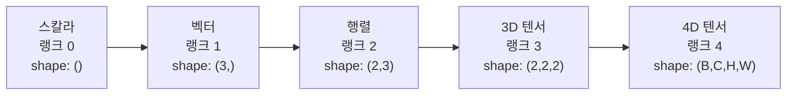
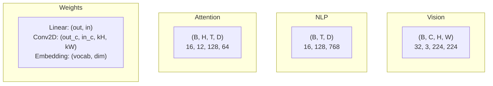
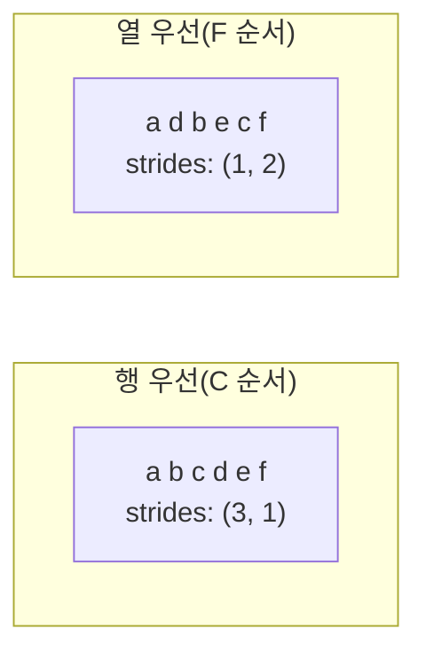
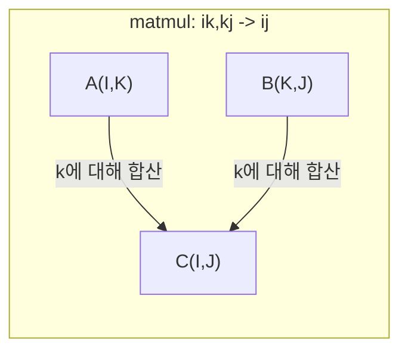

> 🇰🇷 이 문서는 한국어 번역본입니다(ELI5 스타일). 원문: [en.md](en.md)

# 텐서 연산

> 텐서는 데이터와 딥러닝 사이의 공용어입니다. 모든 이미지, 모든 문장, 모든 그래디언트가 텐서를 통과합니다.

**유형:** Build(직접 만들기)
**언어:** Python
**선수 지식:** 페이즈 1, 레슨 01(선형대수 직관), 02(벡터, 행렬과 연산)
**시간:** 약 90분

## 학습 목표

- shape(형태), 스트라이드(strides), reshape, transpose, 요소별 연산을 갖춘 텐서 클래스를 처음부터 직접 구현하기
- 브로드캐스팅(Broadcasting) 규칙을 적용해 데이터를 복사하지 않고도 서로 다른 shape의 텐서끼리 연산하기
- 내적, 행렬 곱셈, 외적, 배치 연산을 einsum 식으로 작성하기
- 멀티헤드 어텐션의 모든 단계에서 텐서 shape가 어떻게 바뀌는지 정확히 추적하기

## 문제 상황

여러분이 트랜스포머를 만듭니다. 포워드 패스(forward pass, 순전파)는 멀쩡해 보입니다. 실행하면 이런 오류가 나옵니다: `RuntimeError: mat1 and mat2 shapes cannot be multiplied (32x768 and 512x768)`. shape를 한참 들여다봅니다. transpose를 한번 넣어 봅니다. 이번에는 `Expected 4D input (got 3D input)`이라고 합니다. unsqueeze를 추가합니다. 그러면 다른 곳이 망가집니다.

shape 오류는 딥러닝 코드에서 가장 흔한 버그입니다. 개념 자체는 어렵지 않습니다. 연산마다 shape 계약(shape contract)이 정해져 있을 뿐이죠. 하지만 오류는 순식간에 곱절로 불어납니다. 트랜스포머 안에는 reshape, transpose, 브로드캐스팅이 수십 개씩 사슬처럼 엮여 있어서, 축(axis) 하나만 잘못 잡아도 오류가 도미노처럼 번집니다. 더 문제는, 어떤 shape 실수는 아예 오류조차 내지 않는다는 점입니다. 잘못된 차원으로 브로드캐스팅하거나 엉뚱한 축으로 합산하면서, 조용히 쓰레기 값을 만들어 냅니다.

행렬은 두 집합 사이의 짝지어진 관계만 다룹니다. 그런데 실제 데이터는 2차원에 담기지 않습니다. 224x224 크기의 RGB 이미지 32장이 모인 배치는 `(32, 3, 224, 224)`라는 4차원 텐서입니다. 헤드 12개를 쓰는 셀프 어텐션도 4차원입니다: `(batch, heads, seq_len, head_dim)`. 차원 수가 몇이든 일반적으로 다룰 수 있고, 모든 차원에서 연산이 깔끔하게 조합되는 자료 구조가 필요합니다. 그것이 바로 텐서입니다. 텐서 연산을 제대로 익히면 shape 오류는 아주 쉽게 디버깅할 수 있는 문제가 됩니다.

## 핵심 개념

### 텐서란 무엇인가

텐서는 데이터 타입이 균일한 숫자들의 다차원 배열입니다. 차원의 개수를 **랭크(rank)**(또는 **order**)라고 부릅니다. 각 차원을 **축(axis)**이라고 합니다. **shape**는 각 축의 크기를 나열한 튜플입니다.



전체 원소 수 = 모든 크기의 곱입니다. shape가 `(2, 3, 4)`면 `2 * 3 * 4 = 24`개의 원소를 담습니다.

### 딥러닝에서의 텐서 shape

데이터 종류에 따라 관례적으로 쓰이는 텐서 shape가 정해져 있습니다.



PyTorch는 NCHW(채널 우선)를 씁니다. TensorFlow는 기본값이 NHWC(채널 나중)입니다. 레이아웃이 맞지 않으면 오류가 나거나, 오류 없이 조용히 느려지기도 합니다.

### 메모리 레이아웃의 동작 방식

메모리 안에서 2차원 배열은 그냥 1차원 바이트 나열입니다. **스트라이드(strides)**는 각 축을 따라 한 칸 이동할 때 몇 개의 원소를 건너뛰어야 하는지를 알려 줍니다.



transpose는 데이터를 실제로 옮기지 않습니다. 스트라이드만 바꿔치기하며, 그 결과 텐서는 **non-contiguous(메모리에 연속적이지 않음)** 상태가 됩니다. 즉 한 행의 원소들이 메모리상에서 더 이상 붙어 있지 않습니다.

### 브로드캐스팅 규칙

브로드캐스팅은 데이터를 복사하지 않고도 서로 다른 shape의 텐서끼리 연산하게 해 줍니다. shape는 오른쪽부터 맞춥니다. 두 차원은 크기가 같거나 한쪽이 1일 때 호환됩니다. 차원 수가 부족한 쪽은 왼쪽에 1을 채워 넣습니다.

```
텐서 A:      (8, 1, 6, 1)
텐서 B:         (7, 1, 5)
B 패딩 후:   (1, 7, 1, 5)
결과:        (8, 7, 6, 5)
```

### einsum: 만능 텐서 연산

아인슈타인 표기법(einsum)은 각 축에 알파벳 글자를 붙입니다. 입력에는 있지만 출력에는 없는 축은 합산됩니다. 양쪽에 모두 있는 축은 그대로 남습니다.



핵심 패턴: `i,i->`(내적), `i,j->ij`(외적), `ii->`(trace), `ij->ji`(전치), `bij,bjk->bik`(배치 행렬 곱), `bhtd,bhsd->bhts`(어텐션 점수).

```figure
tensor-broadcast
```

## 직접 만들기

코드는 `code/tensors.py`에 들어 있습니다. 각 단계에서 그 안의 구현을 참조합니다.

### 단계 1: 텐서 저장과 스트라이드

텐서는 평평하게 편 숫자 목록과 shape 메타데이터를 저장합니다. 스트라이드는 인덱싱 로직이 다차원 인덱스를 1차원 위치로 어떻게 대응시킬지 알려 줍니다.

```python
class Tensor:
    def __init__(self, data, shape=None):
        if isinstance(data, (list, tuple)):
            self._data, self._shape = self._flatten_nested(data)
        elif isinstance(data, np.ndarray):
            self._data = data.flatten().tolist()
            self._shape = tuple(data.shape)
        else:
            self._data = [data]
            self._shape = ()

        if shape is not None:
            total = reduce(lambda a, b: a * b, shape, 1)
            if total != len(self._data):
                raise ValueError(
                    f"Cannot reshape {len(self._data)} elements into shape {shape}"
                )
            self._shape = tuple(shape)

        self._strides = self._compute_strides(self._shape)

    @staticmethod
    def _compute_strides(shape):
        if len(shape) == 0:
            return ()
        strides = [1] * len(shape)
        for i in range(len(shape) - 2, -1, -1):
            strides[i] = strides[i + 1] * shape[i + 1]
        return tuple(strides)
```

shape가 `(3, 4)`이면 스트라이드는 `(4, 1)`입니다. 한 행을 전진하려면 원소 4개를 건너뛰고, 한 열을 전진하려면 원소 1개를 건너뜁니다.

### 단계 2: reshape, squeeze, unsqueeze

reshape는 원소 순서를 바꾸지 않고 shape만 바꿉니다. 전체 원소 개수는 그대로여야 합니다. 차원 하나에 `-1`을 넣으면 그 크기를 자동으로 추론합니다.

```python
t = Tensor(list(range(12)), shape=(2, 6))
r = t.reshape((3, 4))
r = t.reshape((-1, 3))
```

squeeze는 크기가 1인 축을 제거합니다. unsqueeze은 그런 축을 하나 끼워 넣습니다. unsqueeze는 브로드캐스팅에서 아주 중요합니다. 배치 `(B, T, D)`에 더해지는 편향 벡터 `(D,)`는 `(1, 1, D)`로 unsqueeze해야 하기 때문입니다.

```python
t = Tensor(list(range(6)), shape=(1, 3, 1, 2))
s = t.squeeze()
v = Tensor([1, 2, 3])
u = v.unsqueeze(0)
```

### 단계 3: transpose와 permute

transpose는 두 축을 맞바꿉니다. permute는 모든 축을 원하는 순서로 재배열합니다. NCHW와 NHWC를 서로 변환할 때 쓰는 방법이 바로 이것입니다.

```python
mat = Tensor(list(range(6)), shape=(2, 3))
tr = mat.transpose(0, 1)

t4d = Tensor(list(range(24)), shape=(1, 2, 3, 4))
perm = t4d.permute((0, 2, 3, 1))
```

transpose나 permute를 거치면 텐서는 메모리에서 non-contiguous 상태가 됩니다. PyTorch에서 `view`는 non-contiguous 텐서에 대해 실패하므로, `reshape`를 쓰거나 먼저 `.contiguous()`를 호출해야 합니다.

### 단계 4: 요소별 연산과 축소(reduction)

요소별 연산(덧셈, 곱셈, 뺄셈)은 각 원소에 독립적으로 적용되며 shape를 그대로 유지합니다. 축소 연산(reduction, sum/mean/max)은 하나 이상의 축을 접어서 없앱니다.

```python
a = Tensor([[1, 2], [3, 4]])
b = Tensor([[10, 20], [30, 40]])
c = a + b
d = a * 2
s = a.sum(axis=0)
```

CNN의 글로벌 평균 풀링: `(B, C, H, W).mean(axis=[2, 3])`의 결과는 `(B, C)`입니다. NLP의 시퀀스 평균 풀링: `(B, T, D).mean(axis=1)`의 결과는 `(B, D)`입니다.

### 단계 5: NumPy로 브로드캐스팅하기

`tensors.py`의 `demo_broadcasting_numpy()` 함수가 핵심 패턴을 보여 줍니다.

```python
activations = np.random.randn(4, 3)
bias = np.array([0.1, 0.2, 0.3])
result = activations + bias

images = np.random.randn(2, 3, 4, 4)
scale = np.array([0.5, 1.0, 1.5]).reshape(1, 3, 1, 1)
result = images * scale

a = np.array([1, 2, 3]).reshape(-1, 1)
b = np.array([10, 20, 30, 40]).reshape(1, -1)
outer = a * b
```

브로드캐스팅으로 쌍별 거리 구하기: `(M, 2)`를 `(M, 1, 2)`로, `(N, 2)`를 `(1, N, 2)`로 reshape한 뒤 빼고, 제곱하고, 마지막 축으로 합산하고, 제곱근을 씌웁니다. 결과는 `(M, N)`입니다.

### 단계 6: einsum 연산

`demo_einsum()`과 `demo_einsum_gallery()` 함수가 흔한 패턴을 하나하나 짚어 줍니다.

```python
a = np.array([1.0, 2.0, 3.0])
b = np.array([4.0, 5.0, 6.0])
dot = np.einsum("i,i->", a, b)

A = np.array([[1, 2], [3, 4], [5, 6]], dtype=float)
B = np.array([[7, 8, 9], [10, 11, 12]], dtype=float)
matmul = np.einsum("ik,kj->ij", A, B)

batch_A = np.random.randn(4, 3, 5)
batch_B = np.random.randn(4, 5, 2)
batch_mm = np.einsum("bij,bjk->bik", batch_A, batch_B)
```

축약(contraction) 연산의 계산 비용은 모든 인덱스 크기(유지되는 것과 합산되는 것 모두)의 곱입니다. B=32, I=128, J=64, K=128인 `bij,bjk->bik`의 경우 `32 * 128 * 64 * 128 = 33,554,432`번의 곱셈-덧셈이 필요합니다.

### 단계 7: einsum으로 어텐션 메커니즘 만들기

`demo_attention_einsum()` 함수가 멀티헤드 어텐션을 처음부터 끝까지 구현합니다.

```python
B, H, T, D = 2, 4, 8, 16
E = H * D

X = np.random.randn(B, T, E)
W_q = np.random.randn(E, E) * 0.02

Q = np.einsum("bte,ek->btk", X, W_q)
Q = Q.reshape(B, T, H, D).transpose(0, 2, 1, 3)

scores = np.einsum("bhtd,bhsd->bhts", Q, K) / np.sqrt(D)
weights = softmax(scores, axis=-1)
attn_output = np.einsum("bhts,bhsd->bhtd", weights, V)

concat = attn_output.transpose(0, 2, 1, 3).reshape(B, T, E)
output = np.einsum("bte,ek->btk", concat, W_o)
```

모든 단계가 텐서 연산입니다. 투영(projection, einsum으로 matmul), 헤드 분리(reshape + transpose), 어텐션 점수(einsum으로 배치 matmul), 가중 합(einsum으로 배치 matmul), 헤드 병합(transpose + reshape), 출력 투영(einsum으로 matmul).

## 활용하기

### 스크래치 구현 vs NumPy

| 연산 | 스크래치(Tensor 클래스) | NumPy |
|---|---|---|
| 생성 | `Tensor([[1,2],[3,4]])` | `np.array([[1,2],[3,4]])` |
| reshape | `t.reshape((3,4))` | `a.reshape(3,4)` |
| transpose | `t.transpose(0,1)` | `a.T` 또는 `a.transpose(0,1)` |
| squeeze | `t.squeeze(0)` | `np.squeeze(a, 0)` |
| 합계 | `t.sum(axis=0)` | `a.sum(axis=0)` |
| einsum | 없음 | `np.einsum("ij,jk->ik", a, b)` |

### 스크래치 구현 vs PyTorch

```python
import torch

t = torch.tensor([[1, 2, 3], [4, 5, 6]], dtype=torch.float32)
t.shape
t.stride()
t.is_contiguous()

t.reshape(3, 2)
t.unsqueeze(0)
t.transpose(0, 1)
t.transpose(0, 1).contiguous()

torch.einsum("ik,kj->ij", A, B)
```

PyTorch에는 autograd, GPU 지원, 최적화된 BLAS 커널이 더해져 있습니다. shape 의미론은 완전히 동일합니다. 스크래치 버전을 이해했다면 PyTorch의 shape 오류 메시지도 읽을 수 있게 됩니다.

### 모든 신경망 레이어는 텐서 연산이다

| 연산 | 텐서 형태 | einsum |
|---|---|---|
| Linear 레이어 | `Y = X @ W.T + b` | `"bd,od->bo"` + 편향 |
| 어텐션 QKV | `Q = X @ W_q` | `"btd,dh->bth"` |
| 어텐션 점수 | `Q @ K.T / sqrt(d)` | `"bhtd,bhsd->bhts"` |
| 어텐션 출력 | `softmax(scores) @ V` | `"bhts,bhsd->bhtd"` |
| 배치 정규화 | `(X - mu) / sigma * gamma` | 요소별 연산 + 브로드캐스팅 |
| softmax | `exp(x) / sum(exp(x))` | 요소별 연산 + reduction |

## 출시하기

이 레슨은 재사용 가능한 프롬프트 두 개를 산출합니다:

1. **`outputs/prompt-tensor-shapes.md`** -- 텐서 shape 불일치를 디버깅하기 위한 체계적인 프롬프트입니다. 자주 쓰이는 모든 연산(matmul, broadcast, cat, Linear, Conv2d, BatchNorm, softmax)의 판단 표와 수정 방법 조회 표가 들어 있습니다.

2. **`outputs/prompt-tensor-debugger.md`** -- shape 오류에 막혔을 때 아무 AI 어시스턴트에나 붙여 넣는 단계별 디버깅 프롬프트입니다. 오류 메시지와 텐서 shape를 넣어 주면 정확한 수정 방법을 돌려받습니다.

## 연습 문제

1. **쉬움 -- reshape 왕복.** shape가 `(2, 3, 4)`인 텐서를 `(6, 4)`로 reshape했다가, `(24,)`로, 다시 `(2, 3, 4)`로 되돌려 보세요. 각 단계마다 평평한 데이터를 출력해서 원소 순서가 보존되는지 확인합니다.

2. **보통 -- 브로드캐스팅 구현.** `Tensor` 클래스에, 크기가 1인 차원을 목표 shape에 맞게 늘려 주는 `broadcast_to(shape)` 메서드를 추가합니다. 그다음 `_elementwise_op`를 고쳐 연산 전에 자동으로 브로드캐스팅하도록 만듭니다. shape `(3, 1)`과 `(1, 4)`로 `(3, 4)`가 나오는지 테스트합니다.

3. **어려움 -- einsum 직접 만들기.** 최소한 내적(`i,i->`), 행렬 곱셈(`ij,jk->ik`), 외적(`i,j->ij`), 전치(`ij->ji`)를 처리하는 기본적인 `einsum(subscripts, *tensors)` 함수를 구현합니다. 첨자(subscript) 문자열을 파싱하고, 축약될 인덱스를 찾아내고, 모든 인덱스 조합을 순회합니다. 결과를 `np.einsum`과 비교해 보세요.

4. **어려움 -- 어텐션 shape 추적기.** `batch_size`, `seq_len`, `embed_dim`, `num_heads`를 입력받아 멀티헤드 어텐션의 모든 단계(입력, Q/K/V 투영, 헤드 분리, 어텐션 점수, softmax 가중치, 가중 합, 헤드 병합, 출력 투영)에서의 정확한 shape를 출력하는 함수를 작성합니다. `demo_attention_einsum()`의 출력과 비교해 검증합니다.

## 핵심 용어

| 용어 | 사람들이 말하는 방식 | 실제 의미 |
|---|---|---|
| 텐서 | "행렬인데 차원이 더 많은 것" | 균일한 타입과 정해진 shape, 스트라이드, 연산을 갖춘 다차원 배열 |
| 랭크(rank) | "차원의 개수" | 축의 개수입니다. 행렬의 텐서 랭크는 2이며, 선형대수에서 말하는 행렬 rank(계수)와 같은 게 아닙니다 |
| shape | "텐서의 크기" | 각 축의 크기를 나열한 튜플. `(2, 3)`은 2행 3열이라는 뜻 |
| 스트라이드(stride) | "메모리 배치 방식" | 각 축을 따라 한 칸 전진할 때 건너뛰어야 할 원소 수 |
| 브로드캐스팅 | "shape가 달라도 알아서 잘 돌아간다" | 엄격한 규칙의 집합: 오른쪽부터 정렬하고, 각 차원은 같거나 한쪽이 1이어야 한다 |
| contiguous | "텐서가 정상 상태다" | 원소가 논리적 레이아웃과 같은 순서로 메모리에 연속 저장된 상태 |
| einsum | "matmul을 멋있게 쓰는 방법" | 어떤 텐서 축약, 외적, trace, 전치든 한 줄로 표현할 수 있는 일반 표기법 |
| view | "reshape와 같은 것" | 같은 메모리 버퍼를 공유하되 shape/스트라이드 메타데이터만 다른 텐서. non-contiguous 데이터에서는 실패한다 |
| 축약(contraction) | "어떤 인덱스에 대해 합산하기" | 텐서들 사이에서 공유되는 인덱스를 곱하고 더해 더 낮은 랭크의 결과를 만드는 일반 연산 |
| NCHW / NHWC | "PyTorch vs TensorFlow 포맷" | 이미지 텐서의 메모리 레이아웃 관례. NCHW는 채널을 공간 차원 앞에, NHWC는 뒤에 둔다 |

## 더 읽을거리

- [NumPy 브로드캐스팅](https://numpy.org/doc/stable/user/basics.broadcasting.html) -- 정식 규칙을 시각적 예제와 함께 설명
- [PyTorch 텐서 뷰(View)](https://pytorch.org/docs/stable/tensor_view.html) -- 뷰가 동작하는 경우와 복사가 일어나는 경우
- [einops](https://github.com/arogozhnikov/einops) -- 텐서 reshape를 읽기 쉽고 안전하게 만들어 주는 라이브러리
- [The Illustrated Transformer](https://jalammar.github.io/illustrated-transformer/) -- 어텐션을 흐르는 텐서 shape를 시각화
- [NumPy의 아인슈타인 합 기호](https://numpy.org/doc/stable/reference/generated/numpy.einsum.html) -- 예제가 포함된 einsum 전체 문서
