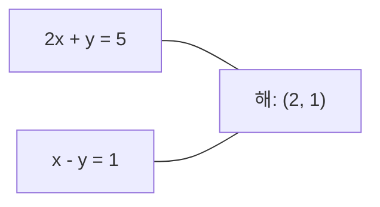
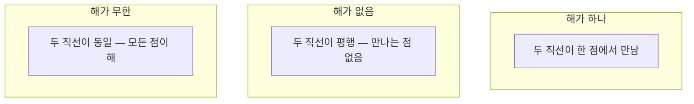

> 🇰🇷 이 문서는 한국어 번역본입니다(ELI5 스타일). 원문: [en.md](en.md)

# 선형 시스템

> Ax = b를 푸는 것은 수학에서 가장 오래된 문제이면서, 지금도 여러분의 신경망을 움직이고 있는 문제입니다.

**유형:** Build
**언어:** Python
**선수 지식:** 페이즈 1, 레슨 01(선형대수 직관), 02(벡터와 행렬), 03(행렬 변환)
**시간:** ~120분

## 학습 목표

- 부분 피벗팅(partial pivoting)과 후방 대입(back substitution)을 갖춘 가우스 소거법으로 Ax = b를 풉니다
- LU, QR, 숄레스키(Cholesky) 분해로 행렬을 분해하고, 각각이 언제 적합한지 설명합니다
- 최소제곱법의 정규 방정식(normal equations)을 유도하고 이를 선형 회귀 및 릿지 회귀와 연결합니다
- 조건수(condition number)로 나쁜 조건(ill-conditioned) 시스템을 진단하고, 정규화를 적용해 안정화합니다

## 문제 상황

선형 회귀를 학습할 때마다 선형 시스템을 풉니다. 최소제곱 피팅을 계산할 때마다 선형 시스템을 풉니다. 신경망 레이어가 `y = Wx + b`를 계산할 때도 선형 시스템의 한쪽 변을 계산하는 것입니다. 정규화를 추가하면 시스템을 수정하는 것이고, 가우시안 프로세스를 쓰면 행렬을 분해하는 것이며, 마할라노비스 거리(Mahalanobis distance)를 위해 공분산 행렬을 뒤집을 때도 선형 시스템을 푸는 것입니다.

Ax = b라는 식은 어디에나 있습니다. A는 알려진 계수 행렬이고, b는 알려진 출력 벡터이며, x는 구하고자 하는 미지수 벡터입니다. 선형 회귀에서 A는 데이터 행렬, b는 타깃 벡터, x는 가중치 벡터죠. 모델 전체가 한 문장으로 줄어듭니다: Ax가 b에 최대한 가까워지도록 x를 찾아라.

이 레슨에서는 이 방정식을 푸는 주요 방법을 모두 직접 만듭니다. 어떤 방법은 빠르고 어떤 방법은 안정적인 이유, 어떤 방법은 정방 시스템(square system)에만 작동하고 어떤 방법은 과결정(overdetermined) 시스템도 처리하는 이유, 그리고 행렬의 조건수가 답이 도무지 의미가 있는지를 결정하는 이유까지 이해하게 됩니다.

## 핵심 개념

### Ax = b를 기하학적으로 이해하기

연립 선형 방정식에는 기하학적 해석이 있습니다. 각 방정식이 하나의 초평면(hyperplane)을 정의하고, 해는 모든 초평면이 만나는 점(또는 점들의 집합)입니다.

```
2x + y = 5          2차원의 두 직선.
x - y  = 1          x=2, y=1에서 만납니다.
```



가능한 결과는 세 가지입니다:



행렬 형태로 말하면, "해가 하나"는 A가 가역(invertible)이라는 뜻입니다. "해가 없음"은 시스템이 부정합(inconsistent)이라는 뜻이고, "해가 무한"은 A가 영공간(null space)을 가진다는 뜻입니다. 대부분의 ML 문제는 "정확한 해가 없음" 범주에 속합니다. 방정식(데이터 포인트)이 미지수(파라미터)보다 많기 때문이죠. 바로 여기서 최소제곱법이 등장합니다.

### 열 그림 vs 행 그림

Ax = b를 읽는 방법은 두 가지입니다.

**행 그림.** A의 각 행이 하나의 방정식을 정의합니다. 각 방정식은 초평면이고, 해는 이들이 모두 만나는 지점입니다.

**열 그림.** A의 각 열은 하나의 벡터입니다. 질문이 바뀝니다. A의 열들의 어떤 선형 결합이 b를 만들어낼까?

```
A = | 2  1 |    b = | 5 |
    | 1 -1 |        | 1 |

행 그림: 2x + y = 5와 x - y = 1을 연립해서 풉니다.

열 그림: 다음을 만족하는 x1, x2를 찾습니다:
  x1 * [2, 1] + x2 * [1, -1] = [5, 1]
  2 * [2, 1] + 1 * [1, -1] = [4+1, 2-1] = [5, 1]   확인 완료.
```

열 그림이 더 근본적입니다. b가 A의 열공간(column space) 안에 있으면 시스템에는 해가 있습니다. b가 그렇지 않다면 열공간에서 가장 가까운 점을 찾으면 됩니다. 그 가장 가까운 점이 바로 최소제곱 해입니다.

### 가우스 소거법

가우스 소거법(Gaussian elimination)은 Ax = b를 상삼각 시스템 Ux = c로 바꾼 뒤, 후방 대입(back substitution)으로 푸는 방법입니다. 가장 직접적인 방법이죠.

알고리즘:

```
1. 각 열 k(피벗 열)에 대해:
   a. k행 이하에서 k열의 가장 큰 원소를 찾습니다(부분 피벗팅).
   b. 그 행을 k행과 맞바꿉니다.
   c. k 아래의 각 행 i에 대해:
      - 승수 m = A[i][k] / A[k][k]를 계산
      - i행에서 k행의 m배를 뺍니다.
2. 후방 대입: 마지막 방정식부터 위로 거슬러 풉니다.
```

예시:

```
원래 시스템:
| 2  1  1 | 8 |       R2 = R2 - (2)R1     | 2  1   1 |  8 |
| 4  3  3 |20 |  -->  R3 = R3 - (1)R1 --> | 0  1   1 |  4 |
| 2  3  1 |12 |                            | 0  2   0 |  4 |

                       R3 = R3 - (2)R2     | 2  1   1 |  8 |
                                       --> | 0  1   1 |  4 |
                                           | 0  0  -2 | -4 |

후방 대입:
  -2 * x3 = -4    -->  x3 = 2
  x2 + 2  = 4     -->  x2 = 2
  2*x1 + 2 + 2 = 8 --> x1 = 2
```

가우스 소거법은 O(n^3) 연산이 듭니다. 1000x1000 시스템이면 대략 10억 번의 부동소수점 연산이죠. 빠르긴 하지만, 같은 A로 여러 시스템을 풀어야 한다면 더 잘할 수 있습니다.

### 부분 피벗팅: 왜 중요한가

피벗팅이 없으면 가우스 소거법은 실패하거나 엉터리 결과를 냅니다. 피벗 원소가 0이면 0으로 나누게 되고, 작으면 반올림 오차를 증폭시킵니다.

```
나쁜 피벗:                        부분 피벗팅 사용:
| 0.001  1 | 1.001 |            먼저 행을 맞바꿈:
| 1      1 | 2     |            | 1      1 | 2     |
                                 | 0.001  1 | 1.001 |
m = 1/0.001 = 1000              m = 0.001/1 = 0.001
R2 = R2 - 1000*R1               R2 = R2 - 0.001*R1
| 0.001  1     | 1.001   |      | 1      1     | 2     |
| 0     -999   | -999.0  |      | 0      0.999 | 0.999 |

x2 = 1.000 (정답)               x2 = 1.000 (정답)
x1 = (1.001 - 1)/0.001          x1 = (2 - 1)/1 = 1.000 (정답)
   = 0.001/0.001 = 1.000        승수가 작아서 안정적입니다.
```

정밀도가 유한한 부동소수점 연산에서는 피벗팅 없이 계산하면 유효 숫자를 잃을 수 있습니다. 부분 피벗팅은 항상 가장 큰 피벗을 골라 오차 증폭을 최소화합니다.

### LU 분해

LU 분해는 A를 하삼각 행렬 L과 상삼각 행렬 U로 분해합니다(A = LU). L 행렬은 가우스 소거법의 승수들을 저장하고, U 행렬은 소거가 끝난 결과입니다.

```
A = L @ U

| 2  1  1 |   | 1  0  0 |   | 2  1   1 |
| 4  3  3 | = | 2  1  0 | @ | 0  1   1 |
| 2  3  1 |   | 1  2  1 |   | 0  0  -2 |
```

그냥 소거하지 왜 분해할까요? L과 U를 한 번 손에 넣으면, 새로운 b가 올 때마다 Ax = b를 푸는 데 O(n^2)만 듭니다:

```
Ax = b
LUx = b
y = Ux라고 하면:
  Ly = b    (전방 대입, O(n^2))
  Ux = y    (후방 대입, O(n^2))
```

O(n^3) 비용은 분해할 때 딱 한 번 지불합니다. 이후의 풀이는 전부 O(n^2)입니다. 같은 A에 대해 b만 다른 1000개 시스템을 풀어야 한다면, LU는 총 작업량을 1000/3배로 줄여줍니다.

부분 피벗팅을 쓰면 PA = LU가 되는데, 여기서 P는 행 맞바꿈을 기록하는 치환 행렬(permutation matrix)입니다.

### QR 분해

QR 분해는 A를 직교 행렬 Q와 상삼각 행렬 R로 분해합니다(A = QR).

직교 행렬은 Q^T Q = I라는 성질을 가집니다. 열들이 정규직교(orthonormal) 벡터죠. Q를 곱하면 길이와 각도가 보존됩니다.

```
A = Q @ R

Q는 정규직교 열을 가짐: Q^T Q = I
R은 상삼각 행렬

Ax = b를 풀려면:
  QRx = b
  Rx = Q^T b    (Q^T를 곱하기만 하면 됨, 역행렬 불필요)
  후방 대입으로 x를 구합니다.
```

최소제곱 문제를 풀 때 QR은 LU보다 수치적으로 더 안정적입니다. 그람-슈미트(Gram-Schmidt) 과정은 Q를 열 단위로 만들어 갑니다:

```
A의 열 a1, a2, ...가 주어졌을 때:

q1 = a1 / ||a1||

q2 = a2 - (a2 . q1) * q1        (q1 방향 성분을 뺌)
q2 = q2 / ||q2||                (정규화)

q3 = a3 - (a3 . q1) * q1 - (a3 . q2) * q2
q3 = q3 / ||q3||

R[i][j] = qi . aj    (i <= j일 때)
```

각 단계는 지금까지의 모든 q 벡터 방향 성분을 제거해서, 새로운 직교 방향만 남깁니다.

### 숄레스키 분해

A가 대칭(A = A^T)이고 양의 정부호(모든 고윳값이 양수)라면 A = L L^T(L은 하삼각)로 분해할 수 있습니다. 이것이 숄레스키(Cholesky) 분해입니다.

```
A = L @ L^T

| 4  2 |   | 2  0 |   | 2  1 |
| 2  5 | = | 1  2 | @ | 0  2 |

L[i][i] = sqrt(A[i][i] - sum(L[i][k]^2 for k < i))
L[i][j] = (A[i][j] - sum(L[i][k]*L[j][k] for k < j)) / L[j][j]    (i > j일 때)
```

숄레스키는 LU보다 2배 빠르고 저장 공간도 절반입니다. 대칭 양의 정부호 행렬에만 작동하지만, 그런 행렬은 곳곳에 등장합니다:

- 공분산 행렬은 대칭 양의 준정부호입니다(정규화를 더하면 양의 정부호).
- 가우시안 프로세스의 커널 행렬은 대칭 양의 정부호입니다.
- 볼록 함수가 최솟값을 갖는 점에서의 헤시안(Hessian)은 대칭 양의 정부호입니다.
- A^T A는 항상 대칭 양의 준정부호입니다.

가우시안 프로세스에서는 커널 행렬 K를 숄레스키로 분해한 뒤 K alpha = y를 풀어 예측 평균을 구합니다. 숄레스키 인자는 주변 가능도(marginal likelihood)에 필요한 로그 행렬식도 알려줍니다: log det(K) = 2 * sum(log(diag(L))).

### 최소제곱법: Ax = b에 정확한 해가 없을 때

A가 m x n이고 m > n(방정식이 미지수보다 많음)이면 시스템은 과결정(overdetermined)입니다. 정확한 해는 존재하지 않죠. 대신 제곱 오차를 최소화합니다:

```
minimize ||Ax - b||^2

이것은 잔차 제곱합입니다:
  sum((A[i,:] @ x - b[i])^2 for i in range(m))
```

최소화하는 x는 정규 방정식을 만족합니다:

```
A^T A x = A^T b
```

유도: ||Ax - b||^2 = (Ax - b)^T (Ax - b) = x^T A^T A x - 2 x^T A^T b + b^T b로 전개합니다. x에 대한 그래디언트를 구해 0으로 놓으면 2 A^T A x - 2 A^T b = 0입니다.

```
원래 시스템(과결정, 방정식 4개, 미지수 2개):
| 1  1 |         | 3 |
| 1  2 | x     = | 5 |       4개 방정식을 모두 만족하는 정확한 x는 없습니다.
| 1  3 |         | 6 |
| 1  4 |         | 8 |

정규 방정식:
A^T A = | 4  10 |    A^T b = | 22 |
        | 10 30 |            | 63 |

풀이: x = [1.5, 1.7]

이것이 바로 선형 회귀입니다. x[0]은 절편, x[1]은 기울기입니다.
```

### 정규 방정식 = 선형 회귀

이 연결은 정확히 성립합니다. 선형 회귀에서 데이터 행렬 X는 샘플마다 하나의 행, 특성(feature)마다 하나의 열을 가집니다. 타깃 벡터 y는 샘플마다 하나의 원소를 가지고요. 가중치 벡터 w는 다음을 만족합니다:

```
X^T X w = X^T y
w = (X^T X)^(-1) X^T y
```

이것이 선형 회귀의 닫힌 형태 해입니다. `sklearn.linear_model.LinearRegression.fit()`을 호출할 때마다 이 값이 계산됩니다(QR이나 SVD로 등가물을 계산하기도 합니다).

행렬에 정규화 항 lambda * I를 더하면 릿지 회귀(ridge regression)가 됩니다:

```
(X^T X + lambda * I) w = X^T y
w = (X^T X + lambda * I)^(-1) X^T y
```

정규화는 행렬의 조건을 좋게 만들고(정확하게 뒤집기 쉬워짐) 가중치를 0 쪽으로 수축시켜 과적합을 막습니다. X^T X + lambda * I는 lambda > 0일 때 항상 대칭 양의 정부호이므로 숄레스키로 풀 수 있습니다.

### 유사역행렬(무어-펜로즈)

유사역행렬(pseudoinverse) A+는 행렬 뒤집기를 정사각이 아니거나 특이(singular)인 행렬로까지 확장합니다. 임의의 행렬 A에 대해:

```
x = A+ b

여기서 A+ = V Sigma+ U^T    (SVD로 계산)
```

Sigma+는 0이 아닌 특잇값마다 역수를 취하고 결과를 전치해서 만듭니다. A = U Sigma V^T이면 A+ = V Sigma+ U^T입니다.

```
A = U Sigma V^T        (SVD)

Sigma = | 5  0 |       Sigma+ = | 1/5  0  0 |
        | 0  2 |                | 0  1/2  0 |
        | 0  0 |

A+ = V Sigma+ U^T
```

유사역행렬은 최소 노름(minimum-norm) 최소제곱 해를 줍니다. 시스템이 다음 중 어느 상태든:
- 해가 하나: A+ b가 그 해를 줍니다.
- 해가 없음: A+ b가 최소제곱 해를 줍니다.
- 해가 무한: A+ b가 ||x||가 가장 작은 해를 줍니다.

NumPy의 `np.linalg.lstsq`와 `np.linalg.pinv`는 모두 내부적으로 SVD를 사용합니다.

### 조건수

조건수(condition number)는 입력의 작은 변화에 해가 얼마나 민감한지를 측정합니다. 행렬 A의 조건수는:

```
kappa(A) = ||A|| * ||A^(-1)|| = sigma_max / sigma_min
```

여기서 sigma_max와 sigma_min은 각각 가장 큰 특잇값과 가장 작은 특잇값입니다.

```
조건 좋음 (kappa ~ 1):                조건 나쁨 (kappa ~ 10^15):
b의 작은 변화 -->                     b의 작은 변화 -->
x의 작은 변화                         x의 어마어마한 변화

| 2  0 |   kappa = 2/1 = 2          | 1   1          |   kappa ~ 10^15
| 0  1 |   풀어도 안전               | 1   1+10^(-15) |   해가 엉터리
```

경험 법칙:
- kappa < 100: 안전, 해가 정확합니다.
- kappa ~ 10^k: 부동소수점 연산에서 정밀도 약 k자릿수를 잃습니다.
- kappa ~ 10^16(float64 기준): 해는 무의미합니다. 행렬은 사실상 특이 행렬입니다.

ML에서 조건이 나빠지는 경우는 특성들이 거의 공선적(collinear)일 때입니다. 정규화(lambda * I 추가)는 조건수를 sigma_max / sigma_min에서 (sigma_max + lambda) / (sigma_min + lambda)로 개선합니다.

### 반복 방법: 켤레 기울기법(공액 경사법)

아주 큰 희소(sparse) 시스템(미지수 수백만 개)에서는 LU나 숄레스키 같은 직접 방법이 너무 비쌉니다. 반복 방법은 추정값을 여러 번의 반복에 걸쳐 조금씩 개선하며 해를 근사합니다.

켤레 기울기법(conjugate gradient, CG)은 A가 대칭 양의 정부호일 때 Ax = b를 풉니다. 정확한 산술에서는 최대 n번의 반복 안에 정확한 해를 찾지만, A의 고윳값들이 뭉쳐 있으면 대개 훨씬 빨리 수렴합니다.

```
알고리즘 개요:
  x0 = 초기 추정값(보통 0)
  r0 = b - A x0           (잔차)
  p0 = r0                 (탐색 방향)

  k = 0, 1, 2, ...에 대해:
    alpha = (rk . rk) / (pk . A pk)
    x_{k+1} = xk + alpha * pk
    r_{k+1} = rk - alpha * A pk
    beta = (r_{k+1} . r_{k+1}) / (rk . rk)
    p_{k+1} = r_{k+1} + beta * pk
    ||r_{k+1}|| < 허용오차이면: 중단
```

CG가 쓰이는 곳:
- 대규모 최적화(뉴턴-CG 방법)
- 편미분 방정식(PDE) 이산화 풀이
- 커널 행렬이 너무 커서 분해할 수 없는 커널 방법
- 다른 반복 솔버를 위한 전조(preconditioning)

수렴 속도는 조건수에 달려 있습니다. 조건이 좋은 시스템일수록 빨리 수렴하고, 정규화가 도움이 되는 또 하나의 이유죠.

### 전체 그림: 언제 어떤 방법을

| 방법 | 요구 사항 | 비용 | 사용 사례 |
|--------|-------------|------|----------|
| 가우스 소거법 | 정방형, 비특이 A | O(n^3) | 정방 시스템의 일회성 풀이 |
| LU 분해 | 정방형, 비특이 A | O(n^3) 분해 + O(n^2) 풀이 | 같은 A로 여러 번 풀기 |
| QR 분해 | 임의의 A (m >= n) | O(mn^2) | 최소제곱, 수치적으로 안정 |
| 숄레스키 | 대칭 양의 정부호 A | O(n^3/3) | 공분산 행렬, 가우시안 프로세스, 릿지 회귀 |
| 정규 방정식 | 과결정 (m > n) | O(mn^2 + n^3) | 선형 회귀(n이 작을 때) |
| SVD / 유사역행렬 | 임의의 A | O(mn^2) | 랭크 부족 시스템, 최소 노름 해 |
| 켤레 기울기법 | 대칭 양의 정부호, 희소 A | O(n * k * nnz) | 대형 희소 시스템, k = 반복 횟수 |

### ML과의 연결

이 레슨의 모든 방법은 프로덕션(운영 환경) ML에 등장합니다:

**선형 회귀.** 닫힌 형태 해는 정규 방정식 X^T X w = X^T y를 풉니다. 숄레스키로(n이 작으면), QR로(수치 안정성이 중요하면), SVD로(행렬이 랭크 부족일 수 있으면) 풀어냅니다.

**릿지 회귀.** X^T X에 lambda * I를 더합니다. 정규화된 시스템 (X^T X + lambda * I) w = X^T y는 lambda > 0이면 X^T X + lambda * I가 대칭 양의 정부호라 항상 숄레스키로 풀립니다.

**가우시안 프로세스.** 예측 평균을 구하려면 커널 행렬 K에 대해 K alpha = y를 풀어야 합니다. K의 숄레스키 분해가 표준 접근입니다. 로그 주변 가능도는 log det(K) = 2 sum(log(diag(L)))를 사용합니다.

**신경망 초기화.** 직교 초기화는 QR 분해로 열이 정규직교인 가중치 행렬을 만듭니다. 깊은 신경망에서 신호 붕괴를 막아줍니다.

**전조(preconditioning).** 대규모 최적화 도구들은 불완전 숄레스키나 불완전 LU를 켤레 기울기 솔버의 전조(preconditioner)로 사용합니다.

**특성(feature) 엔지니어링.** X^T X의 조건수가 특성들이 공선적인지 알려줍니다. kappa가 크면 특성을 버리거나 정규화를 더하세요.

```figure
linear-system-conditioning
```

## 직접 만들기

### 단계 1: 부분 피벗팅이 있는 가우스 소거법

```python
import numpy as np

def gaussian_elimination(A, b):
    n = len(b)
    Ab = np.hstack([A.astype(float), b.reshape(-1, 1).astype(float)])

    for k in range(n):
        max_row = k + np.argmax(np.abs(Ab[k:, k]))
        Ab[[k, max_row]] = Ab[[max_row, k]]

        if abs(Ab[k, k]) < 1e-12:
            raise ValueError(f"Matrix is singular or nearly singular at pivot {k}")

        for i in range(k + 1, n):
            m = Ab[i, k] / Ab[k, k]
            Ab[i, k:] -= m * Ab[k, k:]

    x = np.zeros(n)
    for i in range(n - 1, -1, -1):
        x[i] = (Ab[i, -1] - Ab[i, i+1:n] @ x[i+1:n]) / Ab[i, i]

    return x
```

### 단계 2: LU 분해

```python
def lu_decompose(A):
    n = A.shape[0]
    L = np.eye(n)
    U = A.astype(float).copy()
    P = np.eye(n)

    for k in range(n):
        max_row = k + np.argmax(np.abs(U[k:, k]))
        if max_row != k:
            U[[k, max_row]] = U[[max_row, k]]
            P[[k, max_row]] = P[[max_row, k]]
            if k > 0:
                L[[k, max_row], :k] = L[[max_row, k], :k]

        for i in range(k + 1, n):
            L[i, k] = U[i, k] / U[k, k]
            U[i, k:] -= L[i, k] * U[k, k:]

    return P, L, U

def lu_solve(P, L, U, b):
    n = len(b)
    Pb = P @ b.astype(float)

    y = np.zeros(n)
    for i in range(n):
        y[i] = Pb[i] - L[i, :i] @ y[:i]

    x = np.zeros(n)
    for i in range(n - 1, -1, -1):
        x[i] = (y[i] - U[i, i+1:] @ x[i+1:]) / U[i, i]

    return x
```

### 단계 3: 숄레스키 분해

```python
def cholesky(A):
    n = A.shape[0]
    L = np.zeros_like(A, dtype=float)

    for i in range(n):
        for j in range(i + 1):
            s = A[i, j] - L[i, :j] @ L[j, :j]
            if i == j:
                if s <= 0:
                    raise ValueError("Matrix is not positive definite")
                L[i, j] = np.sqrt(s)
            else:
                L[i, j] = s / L[j, j]

    return L
```

### 단계 4: 정규 방정식으로 최소제곱 풀기

```python
def least_squares_normal(A, b):
    AtA = A.T @ A
    Atb = A.T @ b
    return gaussian_elimination(AtA, Atb)

def ridge_regression(A, b, lam):
    n = A.shape[1]
    AtA = A.T @ A + lam * np.eye(n)
    Atb = A.T @ b
    L = cholesky(AtA)
    y = np.zeros(n)
    for i in range(n):
        y[i] = (Atb[i] - L[i, :i] @ y[:i]) / L[i, i]
    x = np.zeros(n)
    for i in range(n - 1, -1, -1):
        x[i] = (y[i] - L.T[i, i+1:] @ x[i+1:]) / L.T[i, i]
    return x
```

### 단계 5: 조건수

```python
def condition_number(A):
    U, S, Vt = np.linalg.svd(A)
    return S[0] / S[-1]
```

## 실전에서 쓰기

지금까지 만든 조각들을 모아 실제 데이터로 선형 회귀와 릿지 회귀를 돌려 봅니다:

```python
np.random.seed(42)
X_raw = np.random.randn(100, 3)
w_true = np.array([2.0, -1.0, 0.5])
y = X_raw @ w_true + np.random.randn(100) * 0.1

X = np.column_stack([np.ones(100), X_raw])

w_ols = least_squares_normal(X, y)
print(f"OLS weights (ours):    {w_ols}")

w_np = np.linalg.lstsq(X, y, rcond=None)[0]
print(f"OLS weights (numpy):   {w_np}")
print(f"Max difference: {np.max(np.abs(w_ols - w_np)):.2e}")

w_ridge = ridge_regression(X, y, lam=1.0)
print(f"Ridge weights (ours):  {w_ridge}")

from sklearn.linear_model import Ridge
ridge_sk = Ridge(alpha=1.0, fit_intercept=False)
ridge_sk.fit(X, y)
print(f"Ridge weights (sklearn): {ridge_sk.coef_}")
```

## 출시하기

이 레슨이 만들어내는 것:
- 가우스 소거법, LU 분해, 숄레스키 분해, 최소제곱, 릿지 회귀를 직접 구현한 `code/linear_systems.py`
- 정규 방정식과 sklearn의 LinearRegression이 같은 가중치를 낸다는 동작 데모

## 연습 문제

1. `[[1,2,3],[4,5,6],[7,8,10]] x = [6, 15, 27]` 시스템을 직접 만든 가우스 소거법, 직접 만든 LU 솔버, `np.linalg.solve`로 풀어 보세요. 세 가지 모두 부동소수점 허용 오차 안에서 같은 답을 내는지 확인합니다.

2. 50x5 난수 행렬 X와 타깃 y = X @ w_true + 노이즈를 만드세요. 정규 방정식, QR(`np.linalg.qr`), SVD(`np.linalg.svd`), `np.linalg.lstsq`로 w를 구하고 네 가지 해를 모두 비교합니다. X^T X의 조건수를 측정하고, 그것이 어떤 방법을 신뢰할지에 어떤 영향을 주는지 설명합니다.

3. 두 열을 거의 똑같이 만들어(예: 2번째 열 = 1번째 열 + 1e-10 * 노이즈) 거의 특이인 행렬을 만들어 보세요. 조건수를 계산하고, 정규화가 있을 때와 없을 때(0.01 * I 추가) Ax = b를 풉니다. 해와 잔차를 비교하고 정규화가 왜 도움이 되는지 설명합니다.

4. 100x100 난수 대칭 양의 정부호 행렬에 대해 켤레 기울기법 알고리즘을 구현하세요. 허용 오차 1e-8로 수렴하는 데 몇 번의 반복이 필요한지 세어 보고, 이론적 최대치인 n번 반복과 비교합니다.

5. 크기 10, 50, 200, 500의 대칭 양의 정부호 행렬에서 직접 만든 숄레스키 솔버, 직접 만든 LU 솔버, `np.linalg.solve`의 실행 시간을 재 보세요. 결과를 그래프로 그리고, 숄레스키가 LU보다 대략 2배 빠른지 확인합니다.

## 핵심 용어

| 용어 | 흔히 하는 말 | 실제 의미 |
|------|----------------|----------------------|
| 선형 시스템 | "x를 구하는 것" | 연립 선형 방정식 Ax = b. x를 찾는다는 것은 변환 A 아래에서 출력 b를 만들어내는 입력을 찾는다는 뜻. |
| 가우스 소거법 | "행 줄이기" | 행 연산으로 대각선 아래 원소를 체계적으로 0으로 만들어, 후방 대입으로 풀 수 있는 상삼각 시스템을 만듦. O(n^3). |
| 부분 피벗팅 | "안정성을 위해 행 맞바꾸기" | k열에서 소거하기 전에, 그 열에서 절댓값이 가장 큰 행을 피벗 자리로 옮김. 작은 수로 나누는 일을 막아줌. |
| LU 분해 | "삼각형으로 쪼개기" | A = LU로 씀. L은 하삼각(승수 저장), U는 상삼각(소거된 행렬). O(n^3) 비용을 여러 번의 풀이에 걸쳐 나눠 부담. |
| QR 분해 | "직교 분해" | A = QR로 씀. Q는 정규직교 열, R은 상삼각. 최소제곱에서 LU보다 안정적. |
| 숄레스키 분해 | "행렬의 제곱근" | 대칭 양의 정부호 A에 대해 A = LL^T로 씀. LU 비용의 절반. 공분산 행렬, 커널 행렬, 릿지 회귀에 사용. |
| 최소제곱법 | "정확한 해가 불가능할 때 최선의 피팅" | 시스템이 과결정일 때(방정식이 미지수보다 많을 때) 잔차 제곱합 ||Ax - b||^2를 최소화. |
| 정규 방정식 | "미적분 지름길" | A^T A x = A^T b. ||Ax - b||^2의 그래디언트를 0으로 놓은 것. 선형 회귀의 닫힌 형태 해 그 자체임. |
| 유사역행렬 | "정사각이 아닌 행렬의 뒤집기" | SVD로 A+ = V Sigma+ U^T. 정사각이든 직사각이든, 특이든 아니든 어떤 행렬에도 최소 노름 최소제곱 해를 줌. |
| 조건수 | "이 답이 얼마나 믿을 만한가" | kappa = sigma_max / sigma_min. 입력 섭동에 대한 민감도를 측정. 정밀도 약 log10(kappa)자릿수를 잃음. |
| 릿지 회귀 | "정규화된 최소제곱" | (X^T X + lambda I) w = X^T y를 품. lambda I를 더하면 조건이 좋아지고 가중치가 0 쪽으로 수축. 과적합을 막음. |
| 켤레 기울기법 | "큰 행렬용 반복 Ax=b" | 대칭 양의 정부호 시스템용 반복 솔버. 최대 n단계 안에 수렴. 분해가 너무 비싼 대형 희소 시스템에 실용적. |
| 과결정 시스템 | "파라미터보다 데이터가 많음" | m x n 시스템에서 m > n. 정확한 해가 존재하지 않음. 최소제곱이 최선의 근사를 찾음. 모든 회귀 문제가 이 경우. |
| 후방 대입 | "아래에서 위로 풀기" | 상삼각 시스템에서 마지막 방정식부터 먼저 풀고 뒤로 거슬러 대입. O(n^2). |
| 전방 대입 | "위에서 아래로 풀기" | 하삼각 시스템에서 첫 방정식부터 먼저 풀고 앞으로 대입. O(n^2). LU 풀이의 L 단계에서 사용. |

## 더 읽을거리

- [MIT 18.06: Linear Algebra](https://ocw.mit.edu/courses/18-06-linear-algebra-spring-2010/) (Gilbert Strang) -- 선형 시스템과 행렬 분해의 정석 과정
- [Numerical Linear Algebra](https://people.maths.ox.ac.uk/trefethen/text.html) (Trefethen & Bau) -- 수치 안정성, 조건, 그리고 알고리즘이 왜 실패하는지를 이해하기 위한 표준 참고서
- [Matrix Computations](https://www.cs.cornell.edu/cv/GolubVanLoan4/golubandvanloan.htm) (Golub & Van Loan) -- 모든 행렬 알고리즘을 망라한 백과사전식 참고서
- [3Blue1Brown: Inverse Matrices](https://www.3blue1brown.com/lessons/inverse-matrices) -- Ax = b를 푼다는 것이 기하학적으로 무엇을 뜻하는지에 대한 시각적 직관
