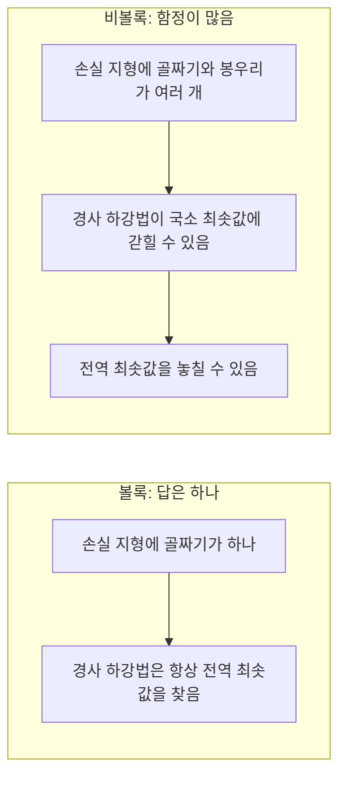
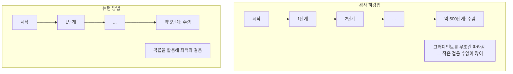
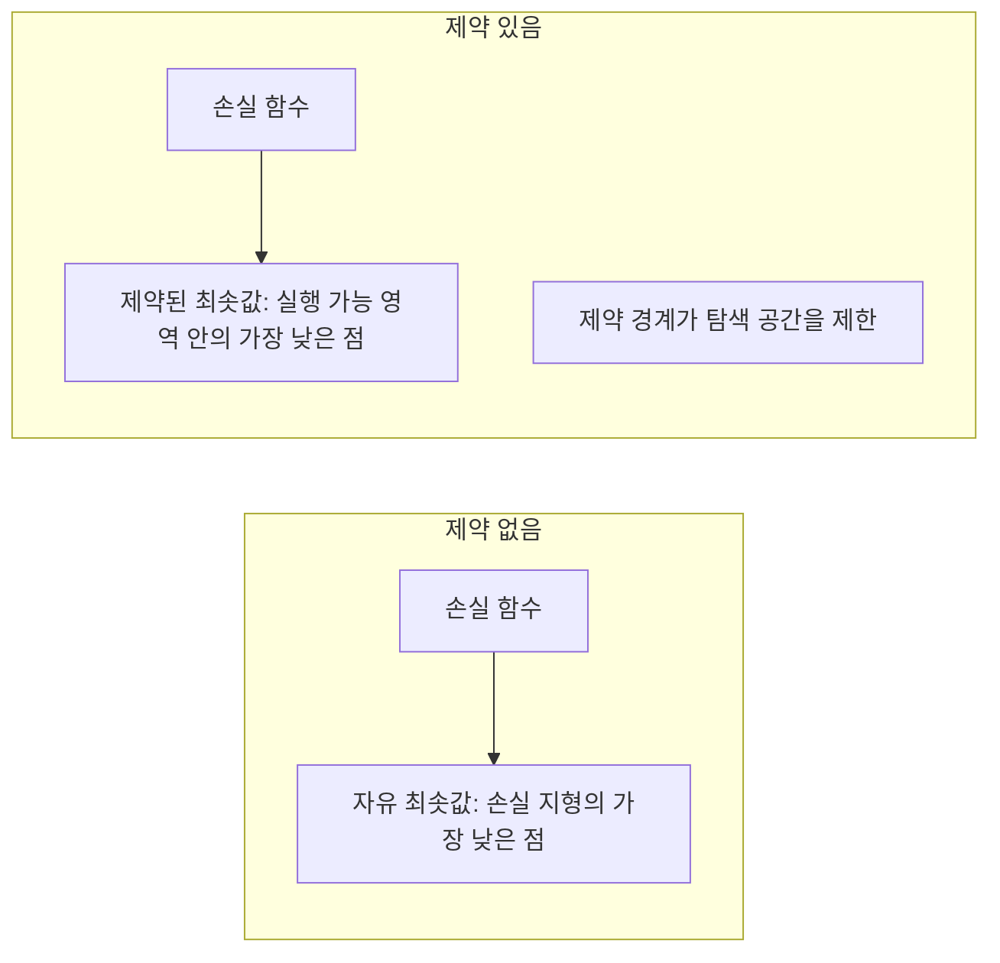
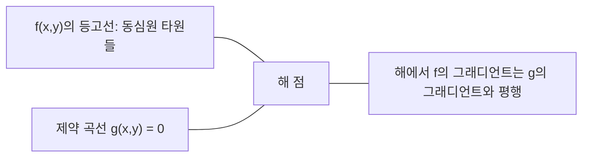

> 🇰🇷 이 문서는 한국어 번역본입니다(ELI5 스타일). 원문: [en.md](en.md)

# 볼록 최적화

> 볼록 문제는 골짜기가 하나뿐입니다. 신경망은 골짜기가 수백만 개죠. 이 차이를 아는 것이 중요합니다.

**유형:** Build
**언어:** Python
**선수 지식:** 페이즈 1, 레슨 04(ML을 위한 미적분), 08(최적화)
**시간:** ~90분

## 학습 목표

- 정의, 이계도함수, 헤시안 판정법으로 함수가 볼록한지 검사합니다
- 뉴턴 방법을 구현하고 2차 수렴이 경사 하강법과 어떻게 다른지 비교합니다
- 라그랑주 승수법으로 제약이 있는 최적화 문제를 풀고 KKT 조건을 해석합니다
- 신경망의 손실 지형이 비볼록인데도 SGD가 좋은 해를 찾는 이유를 설명합니다

## 문제 상황

레슨 08에서 경사 하강법, 모멘텀, Adam을 배웠습니다. 이 옵티마이저들은 어떤 지형에서든 아래로 내려갑니다. 하지만 아무런 보장도 없죠. 비볼록 지형 위의 경사 하강법은 나쁜 국소 최솟값에 빠지거나, 안장점(saddle point)에 갇히거나, 영원히 진동할 수 있습니다. 그래도 써 왔죠. 신경망은 비볼록이고 대안이 없으니까요.

하지만 머신러닝의 많은 문제는 볼록합니다. 선형 회귀, 로지스틱 회귀, SVM, LASSO, 릿지 회귀가 그렇죠. 이런 문제에는 더 강력한 무기가 있습니다. 수학적 보장이 붙은 최적화입니다. 볼록 문제는 골짜기가 정확히 하나입니다. 아래로 내려가는 알고리즘은 무엇이든 전역 최솟값에 도달합니다. 재시작도 필요 없고, 학습률 스케줄도 필요 없고, 기도할 필요도 없습니다.

볼록성을 이해하면 세 가지를 얻습니다. 첫째, 내 문제가 쉬운 볼록 문제인지 어려운 비볼록 문제인지 판별해 줍니다. 둘째, 볼록 문제에 쓸 수 있는 뉴턴 방법 같은 더 빠른 도구를 얻습니다. 셋째, ML 곳곳에 등장하는 개념들을 설명해 줍니다. 제약으로서의 정규화, SVM의 쌍대성(duality), 그리고 볼록성이 주는 좋은 성질들을 하나도 지키지 않는데도 딥러닝이 작동하는 이유 말이죠.

## 핵심 개념

### 볼록 집합

집합 S 안의 임의의 두 점을 이은 선분이 통째로 S 안에 들어 있다면, S는 볼록 집합입니다.

| 볼록 집합 | 볼록하지 않음 |
|---|---|
| **사각형**: 안의 두 점을 잇는 선분이 항상 내부에 머묾 | **별/초승달 모양**: 내부 두 점을 잇는 선이 집합 밖을 지날 수 있음 |
| **삼각형**: 모든 내부 점에서 같은 성질이 성립 | **도넛/환형**: 구멍 때문에 일부 선분이 집합을 벗어남 |
| 임의의 두 점을 잇는 선분이 집합 안에 머묾 | 어떤 점 쌍을 잇는 선분은 집합 밖으로 나감 |

엄밀한 판정: S 안의 임의의 점 x, y와 임의의 t ∈ [0, 1]에 대해 점 tx + (1-t)y도 S 안에 있으면 됩니다.

볼록 집합의 예:
- 직선, 평면, R^n 전체
- 공(원, 구, 초구)
- 반공간(halfspace): {x : a^T x <= b}
- 임의 개수의 볼록 집합들의 교집합

비볼록 집합의 예:
- 도넛(환형)
- 서로 떨어진 두 원의 합집합
- "움푹 파인 부분"이나 "구멍"이 있는 집합

### 볼록 함수

정의역이 볼록 집합이고, 정의역 안의 임의의 두 점 x, y와 임의의 t ∈ [0, 1]에 대해 다음이 성립하면 함수 f는 볼록입니다:

```
f(tx + (1-t)y) <= t*f(x) + (1-t)*f(y)
```

기하학적으로 말하면: 그래프 위의 임의의 두 점을 잇는 선분이 그래프 위쪽 또는 그래프에 딱 붙어 있어야 합니다.

| 성질 | 볼록 함수 | 비볼록 함수 |
|---|---|---|
| **선분 검사** | 그래프 위의 두 점을 잇는 선이 곡선 **위나 곡선에 딱 붙음** | 그래프 위의 어떤 점들을 잇는 선이 곡선 **아래로 내려감** |
| **모양** | 위로 휘어진 단 하나의 그릇/골짜기 | 곡률이 섞인 여러 봉우리와 골짜기 |
| **국소 최솟값** | 모든 국소 최솟값이 곧 전역 최솟값 | 높이가 다른 여러 국소 최솟값이 존재할 수 있음 |

흔한 볼록 함수들:
- f(x) = x^2(포물선)
- f(x) = |x|(절댓값)
- f(x) = e^x(지수 함수)
- f(x) = max(0, x)(ReLU, 조각별 선형이지만 볼록)
- f(x) = -log(x), x > 0(음의 로그)
- 임의의 선형 함수 f(x) = a^T x + b(볼록하면서 오목하기도 함)

### 볼록성 검사하기

실전에서 쓰는 세 가지 검사, 쉬운 것부터 엄밀한 것까지.

**검사 1: 이계도함수 검사(1차원).** 모든 x에서 f''(x) >= 0이면 f는 볼록입니다.

- f(x) = x^2: f''(x) = 2 >= 0. 볼록.
- f(x) = x^3: f''(x) = 6x. x < 0이면 음수. 볼록하지 않음.
- f(x) = e^x: f''(x) = e^x > 0. 볼록.

**검사 2: 헤시안 검사(다변수).** 헤시안 행렬 H(x)가 모든 x에서 양의 준정부호이면 f는 볼록입니다. 헤시안은 이계 편도함수들을 모은 행렬입니다.

**검사 3: 정의 검사.** 부등식 f(tx + (1-t)y) <= t*f(x) + (1-t)*f(y)를 직접 확인합니다. 도함수 계산이 어려운 함수에 유용합니다.

### 볼록성이 왜 중요한가

볼록 최적화의 중심 정리:

**볼록 함수에서는 모든 국소 최솟값이 전역 최솟값입니다.**

즉 경사 하강법은 갇힐 수 없습니다. 어떤 내리막 길을 걷더라도 같은 답에 도달합니다. 알고리즘이 최적 해로 수렴한다는 보장이 있는 것이죠.



결과적으로:
- 무작위 재시작이 필요 없습니다
- 정교한 학습률 스케줄이 필요 없습니다
- 수렴 증명이 가능합니다(수렴 속도는 함수 성질에 따라 다름)
- 해가 유일합니다(평평한 영역은 제외)

### ML에서 볼록 vs 비볼록

| 문제 | 볼록한가? | 이유 |
|---------|---------|-----|
| 선형 회귀(MSE) | 예 | 손실이 가중치에 대해 이차형 |
| 로지스틱 회귀 | 예 | 로그 손실이 가중치에 대해 볼록 |
| SVM(힌지 손실) | 예 | 선형 함수들의 최댓값 |
| LASSO(L1 회귀) | 예 | 볼록 함수들의 합은 볼록 |
| 릿지 회귀(L2) | 예 | 이차형 + 이차형 = 볼록 |
| 신경망(모든 손실) | 아니오 | 비선형 활성화가 비볼록 지형을 만듦 |
| k-평균 클러스터링 | 아니오 | 이산 할당 단계 |
| 행렬 분해 | 아니오 | 미지수들의 곱 |

볼록 손실을 쓰는 선형 모델은 볼록입니다. 비선형 활성화를 곁들인 은닉층을 추가하는 순간 볼록성은 깨집니다.

### 헤시안 행렬

함수 f: R^n -> R의 헤시안 H는 이계 편도함수들을 모은 n x n 행렬입니다.

```
H[i][j] = d^2 f / (dx_i dx_j)
```

f(x, y) = x^2 + 3xy + y^2의 경우:

```
df/dx = 2x + 3y       d^2f/dx^2 = 2      d^2f/dxdy = 3
df/dy = 3x + 2y       d^2f/dydx = 3      d^2f/dy^2 = 2

H = [ 2  3 ]
    [ 3  2 ]
```

헤시안은 곡률에 관한 정보를 줍니다:
- 고윳값이 모두 양수: 모든 방향으로 위로 볼록(그 점에서 볼록)
- 고윳값이 모두 음수: 모든 방향으로 아래로 볼록(오목, 국소 최댓값)
- 부호가 섞임: 안장점(어떤 방향으로는 위로, 다른 방향으로는 아래로)
- 고윳값이 0: 그 방향으로 평평함(퇴화)

볼록성이 성립하려면 헤시안이 한 점이 아니라 모든 곳에서 양의 준정부호(모든 고윳값 >= 0)여야 합니다.

### 뉴턴 방법

경사 하강법은 1차 정보(그래디언트)를 사용합니다. 뉴턴 방법은 2차 정보(헤시안)를 사용하죠. 현재 점에서 이차 근사를 만들어 맞춰보고, 그 이차 함수의 최솟값으로 곧장 점프합니다.

```
갱신 규칙:
  x_new = x - H^(-1) * gradient

경사 하강법과 비교:
  x_new = x - lr * gradient
```

뉴턴 방법은 스칼라 학습률을 헤시안의 역행렬로 대체합니다. 덕분에 국소 곡률에 따라 보폭과 방향이 자동으로 조절됩니다.



장점:
- 최솟값 근처에서 2차 수렴(오차가 매 단계 제곱으로 줄어듦)
- 튜닝할 학습률이 없습니다
- 스케일 불변(문제를 어떻게 파라미터화해도 작동)

단점:
- 헤시안 계산에 O(n^2) 메모리, 뒤집는 데 O(n^3)
- 가중치 100만 개짜리 신경망이라면 원소 10^12개, 연산 10^18회
- 딥러닝에는 비실용적

### 제약 최적화

제약 없는 최적화: 모든 x에 대해 f(x)를 최소화.
제약 있는 최적화: 제약 조건을 만족하면서 f(x)를 최소화.

실제 문제에는 제약이 있습니다. 비용을 최소화하고 싶지만 예산이 한정되어 있고, 오차를 최소화하고 싶지만 모델 복잡도에 상한이 있죠.



### 라그랑주 승수

라그랑주 승수법(Lagrange multipliers)은 제약 문제를 제약 없는 문제로 바꿔 줍니다.

문제: g(x) = 0을 만족하면서 f(x)를 최소화.

풀이: 새 변수(라그랑주 승수 lambda)를 도입하고 제약 없는 문제를 풉니다:

```
L(x, lambda) = f(x) + lambda * g(x)
```

해에서는 L의 그래디언트가 0입니다:

```
dL/dx = df/dx + lambda * dg/dx = 0
dL/dlambda = g(x) = 0
```

기하학적 직관: 제약된 최솟값에서 f의 그래디언트는 제약 g의 그래디언트와 평행해야 합니다. 평행하지 않다면 제약 면을 따라 이동하면서 f를 더 줄일 수 있을 테니까요.



예시: x + y = 1을 만족하면서 f(x,y) = x^2 + y^2를 최소화.

```
L = x^2 + y^2 + lambda(x + y - 1)

dL/dx = 2x + lambda = 0  =>  x = -lambda/2
dL/dy = 2y + lambda = 0  =>  y = -lambda/2
dL/dlambda = x + y - 1 = 0

처음 두 식에서: x = y
대입하면: 2x = 1, 따라서 x = y = 0.5, lambda = -1
```

직선 x + y = 1 위에서 원점에 가장 가까운 점은 (0.5, 0.5)입니다.

### KKT 조건

카루시-쿤-터커(KKT) 조건은 라그랑주 승수를 부등호 제약으로 확장합니다.

문제: i = 1, ..., m에 대해 g_i(x) <= 0을 만족하면서 f(x)를 최소화.

KKT 조건(최적성의 필요조건):

```
1. 정상성(stationarity):     df/dx + sum(lambda_i * dg_i/dx) = 0
2. 원문제 실현 가능성:   g_i(x) <= 0  (모든 i)
3. 쌍문제 실현 가능성:   lambda_i >= 0  (모든 i)
4. 상보 여유성(complementary slackness):  lambda_i * g_i(x) = 0  (모든 i)
```

상보 여유성이 핵심 통찰입니다. 제약이 활성 상태이거나(g_i = 0, 해가 경계 위에 있음) 승수가 0이거나(제약이 무의미) 둘 중 하나입니다. 해에 영향을 주지 않는 제약의 lambda는 0입니다.

KKT 조건은 SVM의 중심에 있습니다. 서포트 벡터는 제약이 활성 상태인(lambda > 0) 데이터 포인트들입니다. 나머지 데이터 포인트들은 lambda = 0이라 결정 경계에 영향을 주지 않죠.

### 제약 최적화로서의 정규화

L1과 L2 정규화는 마음대로 고른 요술이 아닙니다. 제약 최적화 문제를 겉모습만 바꿔 숨겨 놓은 것입니다.

**L2 정규화(릿지):**

```
minimize  Loss(w)  단,  ||w||^2 <= t

동등한 제약 없는 형태:
minimize  Loss(w) + lambda * ||w||^2
```

제약 ||w||^2 <= t는 공 하나(2차원에선 원, 3차원에선 구)를 정의합니다. 손실 등고선이 이 공에 처음 닿는 지점이 해입니다.

**L1 정규화(LASSO):**

```
minimize  Loss(w)  단,  ||w||_1 <= t

동등한 제약 없는 형태:
minimize  Loss(w) + lambda * ||w||_1
```

제약 ||w||_1 <= t는 마름모(2차원에서 45도 돌린 정사각형)를 정의합니다.

| 성질 | L2 제약(원) | L1 제약(마름모) |
|---|---|---|
| **제약 모양** | 원(더 높은 차원에선 구) | 마름모(2차원에서 45도 돌린 정사각형) |
| **손실 등고선이 닿는 곳** | 매끈한 경계 — 원 위의 어느 점이든 | 모서리 — 축과 나란한 지점 |
| **해의 성격** | 가중치가 작지만 0은 아님 | 일부 가중치가 정확히 0(희소) |
| **결과** | 가중치 수축 | 특성(feature) 선택 |

이것이 L1은 희소 모델(특성 선택)을 만들고 L2는 가중치만 줄이는 이유를 설명해 줍니다. 마름모는 축과 나란한 모서리를 가지고 있습니다. 손실 등고선은 모서리에 닿기 쉽고, 닿으면 가중치 하나 이상이 정확히 0으로 박제되죠.

### 쌍대성

모든 제약 최적화 문제(원문제, primal)에는 짝 문제(쌍대문제, dual)가 있습니다. 볼록 문제에서는 원문제와 쌍대문제의 최적값이 같습니다. 이것이 강한 쌍대성(strong duality)입니다.

라그랑주 쌍대 함수:

```
원문제: g(x) <= 0을 만족하면서 f(x)를 최소화
라그랑지안: L(x, lambda) = f(x) + lambda * g(x)
쌍대 함수: d(lambda) = min_x L(x, lambda)
쌍대 문제: lambda >= 0을 만족하면서 d(lambda)를 최대화
```

쌍대성이 중요한 이유:
- 쌍대 문제가 원문제보다 풀기 쉬운 때가 있습니다
- SVM은 쌍대 형태로 푸는데, 이 형태에서는 문제가 데이터 포인트 간 내적에만 의존합니다(커널 트릭이 가능해지는 이유)
- 쌍대는 원문제 최적값의 하한을 주어 해의 품질 검사에 유용합니다

SVM의 경우 구체적으로:

```
원문제: 마진 2/||w||를 최대화하는 w, b를 찾되
        모든 i에 대해 y_i(w^T x_i + b) >= 1을 만족

쌍문제: maximize sum(alpha_i) - 0.5 * sum_ij(alpha_i * alpha_j * y_i * y_j * x_i^T x_j)
        단, alpha_i >= 0이고 sum(alpha_i * y_i) = 0

쌍문제에는 내적 x_i^T x_j만 등장합니다.
x_i^T x_j를 K(x_i, x_j)로 바꾸면 커널 트릭이 됩니다.
```

### 비볼록인데도 딥러닝이 작동하는 이유

신경망 손실 함수는 극심하게 비볼록입니다. 고전적 기준으로는 최적화가 실패해야 정상입니다. 그런데 확률적 경사 하강법(SGD)은 묘하게도 좋은 해를 안정적으로 찾아냅니다. 몇 가지 요인이 이를 설명합니다.

**대부분의 국소 최솟값은 충분히 좋다.** 고차원 공간에서 무작위 임계점(그래디언트가 0인 점)은 압도적으로 안장점이지 국소 최솟값이 아닙니다. 소수 존재하는 국소 최솟값들도 손실값이 전역 최솟값에 가까운 경우가 많죠. 파라미터 공간이 수백만 차원이면 끔찍한 국소 최솟값에 갇힐 확률은 극히 낮습니다.

**진짜 장애물은 국소 최솟값이 아니라 안장점이다.** 파라미터 n개짜리 함수에서 안장점은 양수와 음수 곡률 방향이 섞여 있습니다. 고차원에서 무작위 임계점의 n개 고윳값이 모두 양수(국소 최솟값)일 확률은 대략 2^(-n)입니다. 거의 모든 임계점은 안장점이죠. SGD의 노이즈가 그 탈출을 도와줍니다.

**과다 파라미터화가 지형을 매끄럽게 만든다.** 학습 예제보다 파라미터가 많은 네트워크는 더 매끄럽고 연결된 손실 면을 가집니다. 넓은 네트워크일수록 나쁜 국소 최솟값이 적죠. 직관에 반하지만 경험적으로 일관되게 확인됩니다.

**손실 지형 구조:**

| 성질 | 저차원 공간 | 고차원 공간 |
|---|---|---|
| **지형** | 고립된 봉우리와 골짜기가 많음 | 매끄럽게 연결된 골짜기 |
| **최솟값** | 고립된 국소 최솟값이 많음 | 나쁜 국소 최솟값은 드묾; 대부분 거의 최적 |
| **탐색** | 전역 최솟값을 찾기 어려움 | 좋은 해로 이어지는 길이 많음 |
| **임계점** | 국소 최솟값과 안장점이 섞임 | 압도적으로 안장점, 국소 최솟값 아님 |

**확률적 노이즈는 암묵적 정규화로 작동한다.** 미니배치 SGD는 뾰족한 최솟값에 정착하지 못하게 하는 노이즈를 더합니다. 뾰족한 최솟값은 과적합되고, 평평한 최솟값은 일반화됩니다. 노이즈는 최적화를 손실 지형의 평평한 영역 쪽으로 기울이죠.

### 실전에서의 2차 방법

순수한 뉴턴 방법은 큰 모델에는 비실용적입니다. 몇 가지 근사법이 2차 정보를 실용적으로 쓸 수 있게 해 줍니다.

**L-BFGS(Limited-memory BFGS):** 최근 m개의 그래디언트 차이를 이용해 헤시안의 역행렬을 근사합니다. O(n^2) 대신 O(mn) 메모리면 충분하죠. 파라미터 10,000개 안팎까지의 문제에서 잘 작동합니다. 고전 ML(로지스틱 회귀, CRF)에서 쓰이지만 딥러닝에는 쓰이지 않습니다.

**자연 그래디언트(natural gradient):** 표준 헤시안 대신 피셔 정보 행렬(로그 가능도의 기댓값 헤시안)을 사용합니다. 확률 분포의 기하학을 반영하는 방식이죠. K-FAC(Kronecker-Factored Approximate Curvature)은 피셔 행렬을 크로네커 곱으로 근사해 신경망에서도 실용적으로 만듭니다.

**헤시안 프리 최적화(Hessian-free optimization):** H를 만들지 않고 켤레 기울기법으로 Hx = g를 풉니다. 헤시안-벡터 곱만 필요한데, 이는 자동 미분으로 O(n) 시간에 계산할 수 있습니다.

**대각 근사:** Adam의 2차 모멘트는 헤시안 대각선의 대각 근사입니다. AdaHessian은 여기서 한 발 더 나아가 Hutchinson 추정량으로 실제 헤시안 대각 원소를 사용합니다.

| 방법 | 메모리 | 단계당 비용 | 언제 사용 |
|--------|--------|--------------|-------------|
| 경사 하강법 | O(n) | O(n) | 베이스라인, 큰 모델 |
| 뉴턴 방법 | O(n^2) | O(n^3) | 작은 볼록 문제 |
| L-BFGS | O(mn) | O(mn) | 중간 크기 볼록 문제 |
| Adam | O(n) | O(n) | 딥러닝 기본값 |
| K-FAC | O(n) | 레이어당 O(n) | 연구, 대형 배치 학습 |

```figure
convex-vs-nonconvex
```

## 직접 만들기

### 단계 1: 볼록성 검사기

점들을 샘플링하고 정의를 확인하는 방식으로 볼록성을 경험적으로 검사하는 함수를 만듭니다.

```python
import random
import math

def check_convexity(f, dim, bounds=(-5, 5), samples=1000):
    violations = 0
    for _ in range(samples):
        x = [random.uniform(*bounds) for _ in range(dim)]
        y = [random.uniform(*bounds) for _ in range(dim)]
        t = random.uniform(0, 1)
        mid = [t * xi + (1 - t) * yi for xi, yi in zip(x, y)]
        lhs = f(mid)
        rhs = t * f(x) + (1 - t) * f(y)
        if lhs > rhs + 1e-10:
            violations += 1
    return violations == 0, violations
```

### 단계 2: 2차원 뉴턴 방법

헤시안을 명시적으로 사용하는 뉴턴 방법을 구현하세요. 경사 하강법과 수렴 속도를 비교합니다.

```python
def newtons_method(f, grad_f, hessian_f, x0, steps=50, tol=1e-12):
    x = list(x0)
    history = [x[:]]
    for _ in range(steps):
        g = grad_f(x)
        H = hessian_f(x)
        det = H[0][0] * H[1][1] - H[0][1] * H[1][0]
        if abs(det) < 1e-15:
            break
        H_inv = [
            [H[1][1] / det, -H[0][1] / det],
            [-H[1][0] / det, H[0][0] / det],
        ]
        dx = [
            H_inv[0][0] * g[0] + H_inv[0][1] * g[1],
            H_inv[1][0] * g[0] + H_inv[1][1] * g[1],
        ]
        x = [x[0] - dx[0], x[1] - dx[1]]
        history.append(x[:])
        if sum(gi ** 2 for gi in g) < tol:
            break
    return history
```

### 단계 3: 라그랑주 승수 솔버

라그랑지안에 경사 하강법을 적용해 제약 최적화를 풉니다.

```python
def lagrange_solve(f_grad, g_val, g_grad, x0, lr=0.01,
                   lr_lambda=0.01, steps=5000):
    x = list(x0)
    lam = 0.0
    history = []
    for _ in range(steps):
        fg = f_grad(x)
        gv = g_val(x)
        gg = g_grad(x)
        x = [
            xi - lr * (fgi + lam * ggi)
            for xi, fgi, ggi in zip(x, fg, gg)
        ]
        lam = lam + lr_lambda * gv
        history.append((x[:], lam, gv))
    return history
```

### 단계 4: 1차 방법 vs 2차 방법 비교

같은 이차 함수에 경사 하강법과 뉴턴 방법을 돌려 보세요. 수렴까지 걸리는 단계 수를 세어 봅니다.

```python
def quadratic(x):
    return 5 * x[0] ** 2 + x[1] ** 2

def quadratic_grad(x):
    return [10 * x[0], 2 * x[1]]

def quadratic_hessian(x):
    return [[10, 0], [0, 2]]
```

뉴턴 방법은 1단계 만에 수렴합니다(이차 함수에는 정확하죠). 경사 하강법은 수백 단계가 걸립니다. 헤시안의 고윳값이 5배 차이 나서 길쭉한 골짜기가 만들어지기 때문입니다.

## 실전에서 쓰기

ML 모델과 솔버를 고를 때 볼록성 분석이 바로 쓰입니다.

볼록 문제(로지스틱 회귀, SVM, LASSO)에는:
- 전용 솔버를 사용하세요(liblinear, CVXPY, method='L-BFGS-B'를 쓰는 scipy.optimize.minimize)
- 유일한 전역 해를 기대할 수 있습니다
- 2차 방법이 실용적이고 빠릅니다

비볼록 문제(신경망)에는:
- 1차 방법을 사용하세요(SGD, Adam)
- 해가 초기화와 무작위성에 달려 있다는 사실을 받아들입니다
- 과다 파라미터화, 노이즈, 학습률 스케줄을 암묵적 정규화로 활용합니다
- 전역 최솟값을 찾으려 시간을 낭비하지 마세요. 좋은 국소 최솟값이면 충분합니다.

```python
from scipy.optimize import minimize

result = minimize(
    fun=lambda w: sum((y - X @ w) ** 2) + 0.1 * sum(w ** 2),
    x0=np.zeros(d),
    method='L-BFGS-B',
    jac=lambda w: -2 * X.T @ (y - X @ w) + 0.2 * w,
)
```

SVM에는 쌍대 정식화 덕분에 커널 트릭을 쓸 수 있습니다:

```python
from sklearn.svm import SVC

svm = SVC(kernel='rbf', C=1.0)
svm.fit(X_train, y_train)
print(f"Support vectors: {svm.n_support_}")
```

## 연습 문제

1. **볼록성 갤러리.** 검사기로 다음 함수들의 볼록성을 확인하세요: f(x) = x^4, f(x) = sin(x), f(x,y) = x^2 + y^2, f(x,y) = x*y, f(x) = max(x, 0). 각 결과가 왜 그렇게 나오는지 설명합니다.

2. **뉴턴 vs 경사 하강법 경주.** 시작점 (10, 10)에서 f(x,y) = 50*x^2 + y^2에 두 방법을 모두 돌려 보세요. 손실이 1e-10 미만이 되려면 각각 몇 단계가 필요한가요? 조건수(헤시안 최대 고윳값과 최소 고윳값의 비)가 커지면 경사 하강법은 어떻게 되나요?

3. **라그랑주 승수의 기하학.** x + 2y = 4를 만족하면서 f(x,y) = (x-3)^2 + (y-3)^2를 최소화하세요. 해에서 f의 그래디언트가 g의 그래디언트와 평행한지 확인해 답을 검증합니다.

4. **정규화 제약.** L1 제약 최적화를 구현하세요: |x| + |y| <= 1을 만족하면서 (x-3)^2 + (y-2)^2를 최소화. 해의 좌표 하나가 0이 된다는 것을 보여줍니다(마름모 제약이 만든 희소성).

5. **헤시안 고윳값 분석.** 로젠브록(Rosenbrock) 함수의 헤시안을 (1,1)과 (-1,1)에서 계산하세요. 두 점에서 고윳값을 구하고, 최솟값에서와 멀리 떨어진 곳에서의 곡률이 고윳값에 어떻게 드러나는지 설명합니다.

## 핵심 용어

| 용어 | 의미 |
|------|---------------|
| 볼록 집합 | 집합 안의 임의의 두 점을 잇는 선분이 집합 안에 머무는 집합 |
| 볼록 함수 | 그래프 위의 임의의 두 점을 잇는 선이 그래프 위나 그래프에 놓이는 함수. 동등하게, 헤시안이 모든 곳에서 양의 준정부호 |
| 국소 최솟값 | 주변의 모든 점보다 낮은 점. 볼록 함수에서는 모든 국소 최솟값이 전역 최솟값 |
| 전역 최솟값 | 함수의 정의역 전체에서 가장 낮은 점 |
| 헤시안 행렬 | 모든 이계 편도함수를 모은 행렬. 곡률 정보를 담음 |
| 양의 준정부호 | 고윳값이 모두 0 이상인 행렬. "이계도함수 >= 0"의 다차원 버전 |
| 조건수 | 헤시안의 최대 고윳값과 최소 고윳값의 비. 조건수가 크면 길쭉한 골짜기와 느린 경사 하강법을 뜻함 |
| 뉴턴 방법 | 헤시안의 역행렬로 보폭과 방향을 정하는 2차 최적화 기법. 최솟값 근처에서 2차 수렴 |
| 라그랑주 승수 | 제약 최적화 문제를 제약 없는 문제로 바꾸기 위해 도입하는 변수 |
| KKT 조건 | 부등호 제약이 있을 때의 최적성 필요조건. 라그랑주 승수를 일반화 |
| 상보 여유성 | 해에서는 제약이 활성 상태이거나 승수가 0이거나 둘 중 하나. 둘 다 0이 아닌 일은 없음 |
| 쌍대성 | 모든 제약 문제에는 짝인 쌍대 문제가 있음. 볼록 문제에서는 둘의 최적값이 같음 |
| 강한 쌍대성 | 원문제와 쌍대문제의 최적값이 같음. 슬레이터 조건을 만족하는 볼록 문제에서 성립 |
| L-BFGS | 전체 헤시안 대신 최근 m개의 그래디언트 차이를 저장하는 근사 2차 방법 |
| 안장점 | 그래디언트는 0이지만 어떤 방향에선 최솟값, 다른 방향에선 최댓값인 점 |
| 과다 파라미터화 | 학습 예제보다 많은 파라미터를 쓰는 것. 손실 지형을 매끄럽게 하고 나쁜 국소 최솟값을 줄임 |

## 더 읽을거리

- [Boyd & Vandenberghe: Convex Optimization](https://web.stanford.edu/~boyd/cvxbook/) - 표준 교과서, 온라인에서 무료 공개
- [Bottou, Curtis, Nocedal: Optimization Methods for Large-Scale Machine Learning (2018)](https://arxiv.org/abs/1606.04838) - 볼록 최적화 이론과 딥러닝 실전을 잇는 논문
- [Choromanska et al.: The Loss Surfaces of Multilayer Networks (2015)](https://arxiv.org/abs/1412.0233) - 비볼록 신경망 지형이 보이는 것만큼 나쁘지 않은 이유
- [Nocedal & Wright: Numerical Optimization](https://link.springer.com/book/10.1007/978-0-387-40065-5) - 뉴턴 방법, L-BFGS, 제약 최적화를 망라한 종합 참고서
